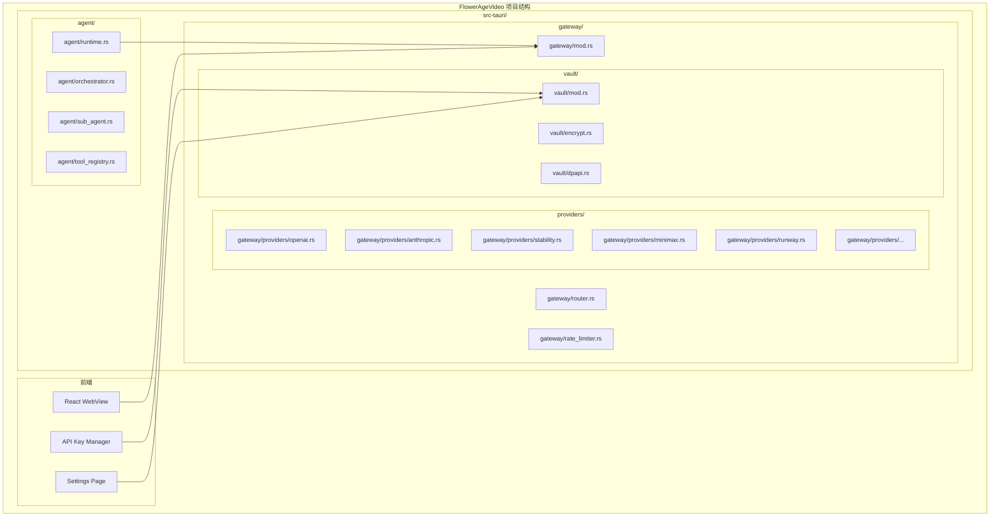
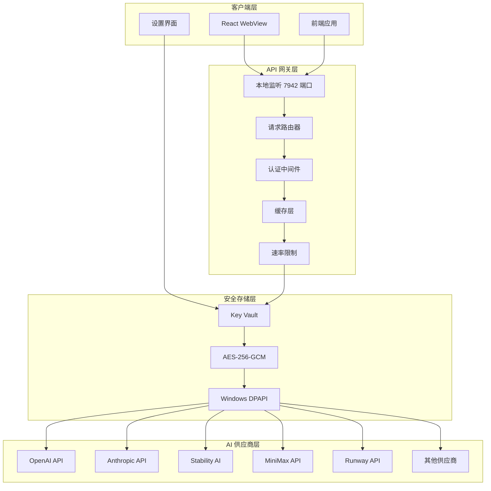
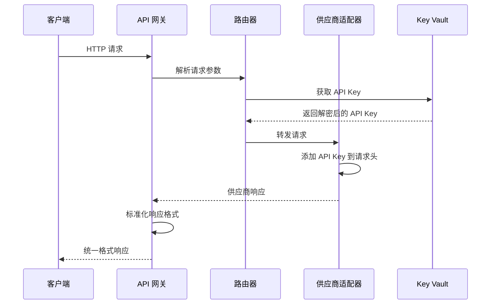
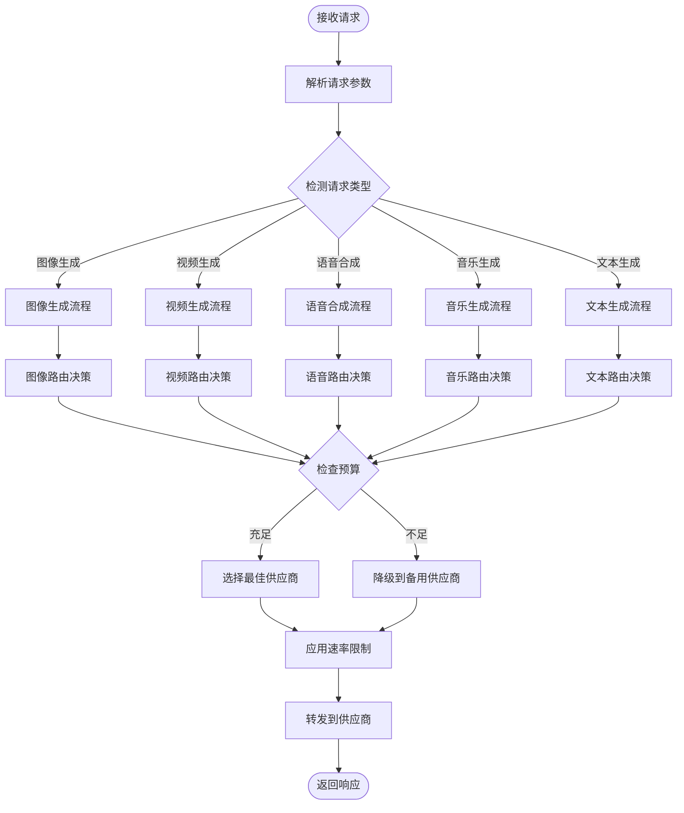
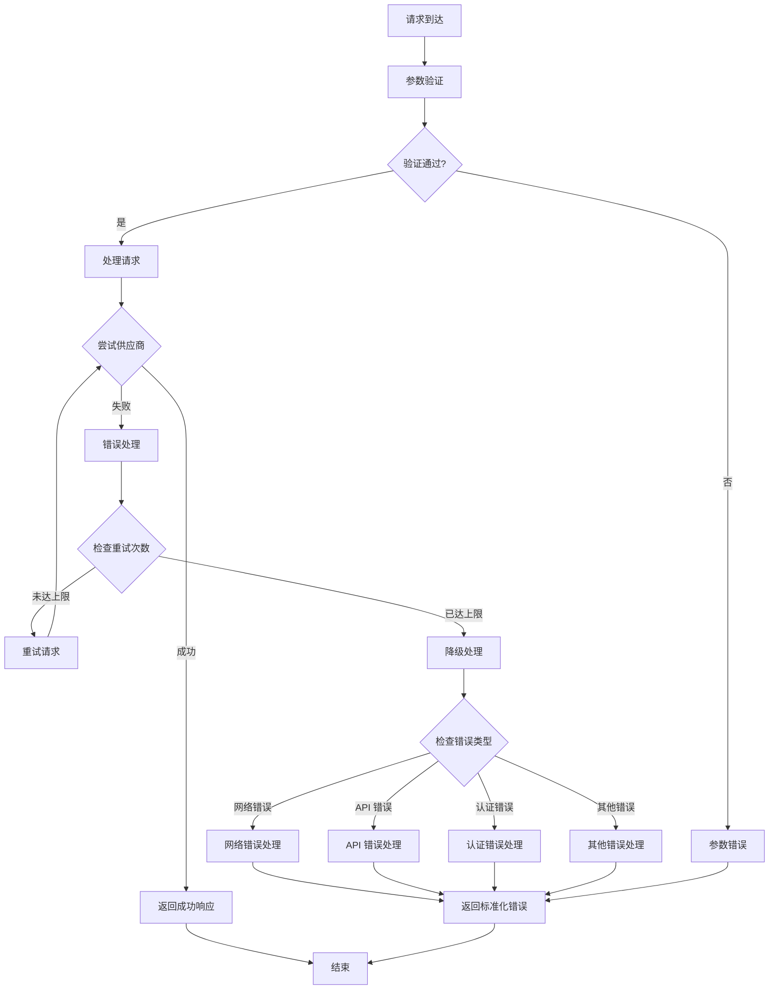
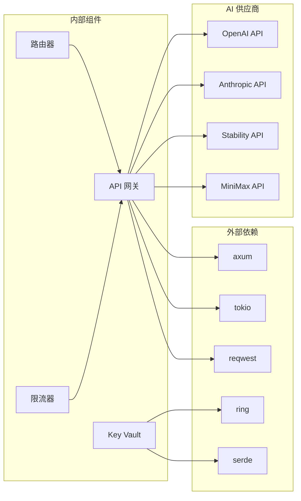

# API 网关设计

<cite>
**本文引用的文件**
- [buzhidaozenmemingmin.md](file://buzhidaozenmemingmin.md)
</cite>

## 目录
1. [简介](#简介)
2. [项目结构](#项目结构)
3. [核心组件](#核心组件)
4. [架构总览](#架构总览)
5. [详细组件分析](#详细组件分析)
6. [依赖分析](#依赖分析)
7. [性能考虑](#性能考虑)
8. [故障排除指南](#故障排除指南)
9. [结论](#结论)
10. [附录](#附录)

## 简介
Flower Age Video 的 API 网关是一个统一的本地代理层，负责将用户请求路由到不同的 AI 供应商 API，同时确保用户 API Key 的本地加密存储。该网关在本地 7942 端口监听，提供标准化的请求处理管道和响应格式，支持多种 AI 供应商的无缝集成。

## 项目结构
根据项目文档，API 网关位于 Tauri Rust 后端的 `gateway` 目录下，采用模块化设计：

**图表来源**
- [buzhidaozenmemingmin.md: 354-472:354-472](file://buzhidaozenmemingmin.md#L354-L472)

**章节来源**
- [buzhidaozenmemingmin.md: 354-472:354-472](file://buzhidaozenmemingmin.md#L354-L472)

## 核心组件
API 网关由以下核心组件构成：

### 1. 网关入口模块
- **gateway/mod.rs**: 网关主模块，负责初始化和协调各个组件
- **gateway/router.rs**: 请求路由核心，实现模型选择逻辑
- **gateway/rate_limiter.rs**: 速率限制器，防止 API 调用过载

### 2. 供应商适配器
- **gateway/providers/openai.rs**: OpenAI API 适配器
- **gateway/providers/anthropic.rs**: Anthropic API 适配器  
- **gateway/providers/stability.rs**: Stability AI API 适配器
- **gateway/providers/minimax.rs**: MiniMax API 适配器
- **gateway/providers/runway.rs**: Runway API 适配器
- **gateway/providers/...**: 其他供应商适配器

### 3. 安全存储模块
- **vault/mod.rs**: Key Vault 主模块
- **vault/encrypt.rs**: AES-256-GCM 加密实现
- **vault/dpapi.rs**: Windows DPAPI 集成

**章节来源**
- [buzhidaozenmemingmin.md: 367-381:367-381](file://buzhidaozenmemingmin.md#L367-L381)
- [buzhidaozenmemingmin.md: 378-381:378-381](file://buzhidaozenmemingmin.md#L378-L381)

## 架构总览
API 网关采用统一代理架构，作为本地代理层连接用户界面与云端 AI 供应商：

**图表来源**
- [buzhidaozenmemingmin.md: 268-288:268-288](file://buzhidaozenmemingmin.md#L268-L288)
- [buzhidaozenmemingmin.md: 338-350:338-350](file://buzhidaozenmemingmin.md#L338-L350)

## 详细组件分析

### 请求路由机制
API 网关的核心功能是智能路由用户请求到合适的 AI 供应商：

**图表来源**
- [buzhidaozenmemingmin.md: 268-288:268-288](file://buzhidaozenmemingmin.md#L268-L288)

### 模型选择逻辑
网关根据请求类型和用户配置自动选择最优的 AI 供应商：

**图表来源**
- [buzhidaozenmemingmin.md: 290-337:290-337](file://buzhidaozenmemingmin.md#L290-L337)

### 错误处理策略
网关实现了多层次的错误处理机制：

**图表来源**
- [buzhidaozenmemingmin.md: 268-288:268-288](file://buzhidaozenmemingmin.md#L268-L288)

**章节来源**
- [buzhidaozenmemingmin.md: 268-350:268-350](file://buzhidaozenmemingmin.md#L268-L350)

## 依赖分析
API 网关依赖于多个关键技术和组件：

### 技术栈依赖
- **HTTP 框架**: axum (高性能异步 HTTP)
- **异步运行时**: tokio (Rust 异步标准)
- **HTTP 客户端**: reqwest (调用云端 API)
- **加密库**: ring + aead (AES-256-GCM 加密)
- **JSON 处理**: serde / serde_json (序列化标准)

### 外部依赖关系

**图表来源**
- [buzhidaozenmemingmin.md: 112-124:112-124](file://buzhidaozenmemingmin.md#L112-L124)

**章节来源**
- [buzhidaozenmemingmin.md: 112-124:112-124](file://buzhidaozenmemingmin.md#L112-L124)

## 性能考虑
API 网关在设计时充分考虑了性能优化：

### 并发处理
- 使用 tokio 异步运行时处理高并发请求
- 采用连接池管理与 AI 供应商的连接
- 实现请求队列和背压机制

### 缓存策略
- 响应缓存减少重复请求
- 模型能力缓存避免频繁探测
- API Key 缓存减少解密开销

### 速率限制
- 基于供应商的速率限制配置
- 用户级别的请求配额管理
- 动态调整策略适应不同负载

### 网络优化
- 连接复用减少 TCP 握手开销
- 压缩传输减少带宽占用
- 超时控制防止资源泄露

## 故障排除指南

### 常见问题诊断
1. **API Key 无法验证**
   - 检查 Key Vault 是否正常工作
   - 验证加密密钥是否正确
   - 确认 Windows DPAPI 是否可用

2. **请求路由失败**
   - 查看路由器日志
   - 验证供应商配置
   - 检查网络连接

3. **性能问题**
   - 监控 CPU 和内存使用
   - 检查连接池状态
   - 分析慢查询日志

### 调试方法
- 启用详细日志记录
- 使用网络抓包分析请求
- 实施健康检查端点
- 监控关键指标（延迟、错误率）

### 配置检查清单
- 确认本地 7942 端口未被占用
- 验证供应商 API 端点可达性
- 检查防火墙设置
- 确认 SSL/TLS 证书有效

**章节来源**
- [buzhidaozenmemingmin.md: 338-350:338-350](file://buzhidaozenmemingmin.md#L338-L350)

## 结论
Flower Age Video 的 API 网关设计体现了现代 AI 应用的最佳实践：本地化部署、隐私保护、多供应商集成和高性能处理。通过统一的代理架构，网关不仅简化了前端开发复杂度，还确保了用户数据的安全性和应用的可靠性。

该设计的关键优势包括：
- **隐私保护**: 用户 API Key 本地加密存储，无第三方代理
- **灵活性**: 支持多种 AI 供应商，可扩展性强
- **性能**: 异步处理和缓存策略确保高效响应
- **安全性**: 多层防护机制保护用户数据

## 附录

### 配置选项
- **端口配置**: 本地 7942 端口监听
- **超时设置**: 请求超时和连接超时配置
- **缓存策略**: 响应缓存和模型能力缓存
- **日志级别**: 调试、信息、警告、错误级别

### API Key 管理
- **加密算法**: AES-256-GCM
- **存储位置**: 本地 SQLite 数据库
- **访问控制**: 内存中短暂停留
- **安全策略**: 从不写入日志、不网络传输

### 支持的供应商
- **大语言模型**: OpenAI、Anthropic、DeepSeek、通义千问、MiniMax
- **图像生成**: OpenAI DALL·E、Stability AI、Midjourney
- **视频生成**: Runway、Kling、Seedance、MiniMax
- **语音合成**: MiniMax TTS、ElevenLabs、OpenAI TTS
- **音乐生成**: Suno、Udio、MiniMax

**章节来源**
- [buzhidaozenmemingmin.md: 290-337:290-337](file://buzhidaozenmemingmin.md#L290-L337)