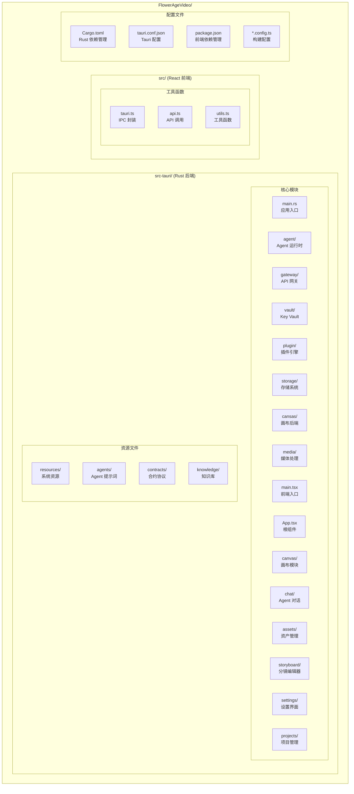
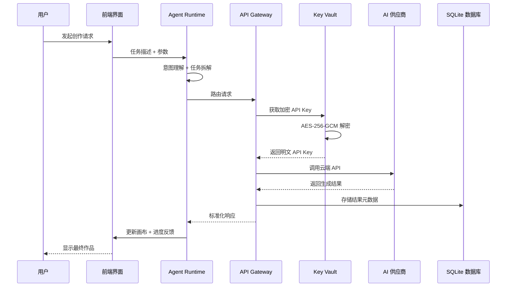
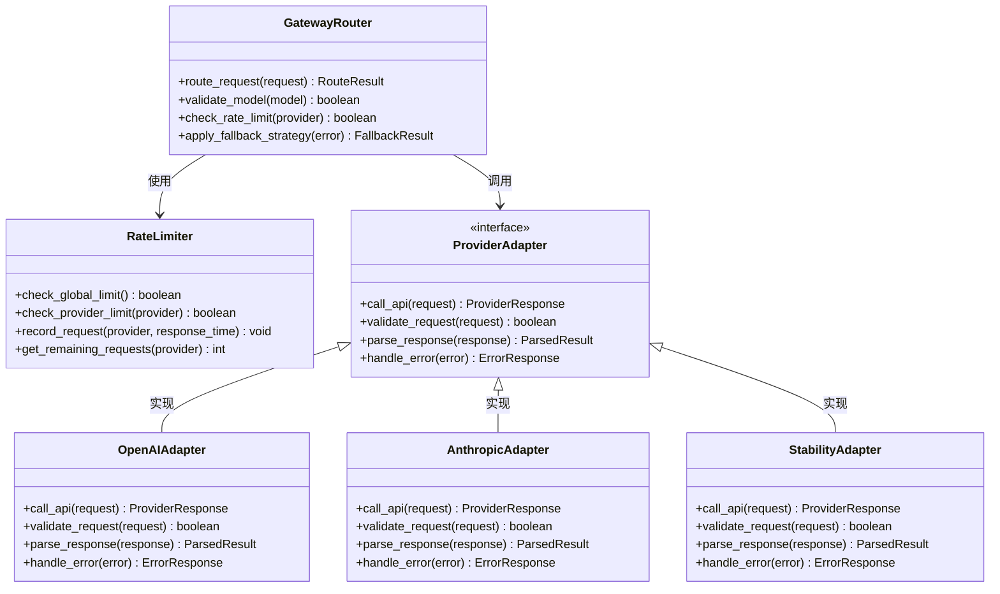
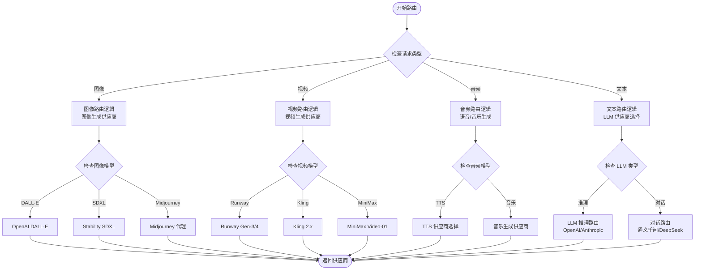
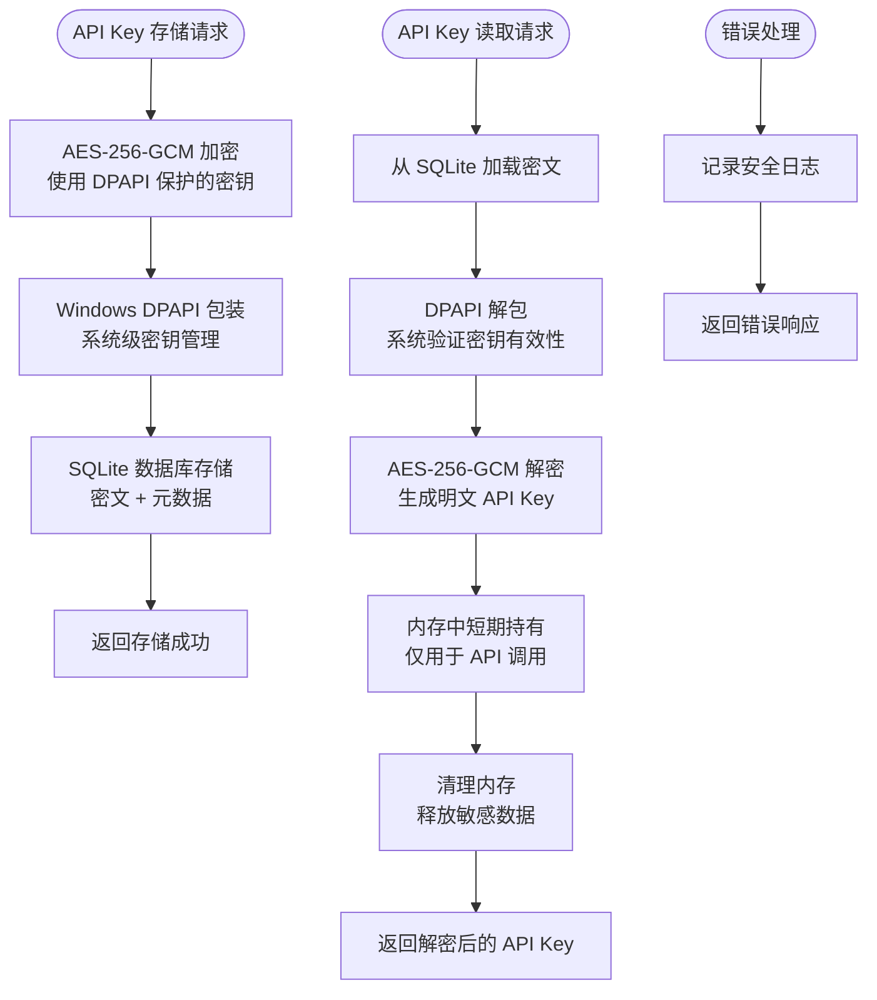
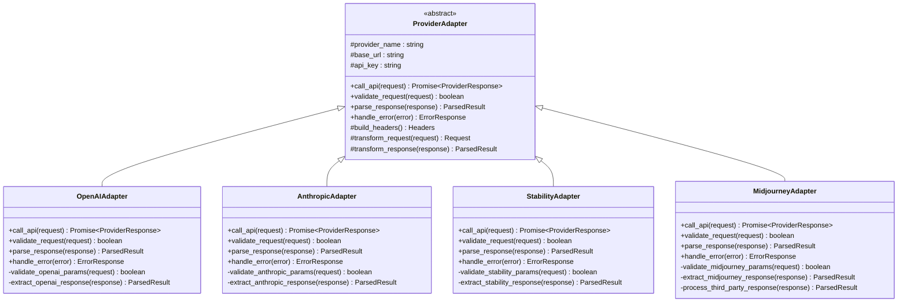
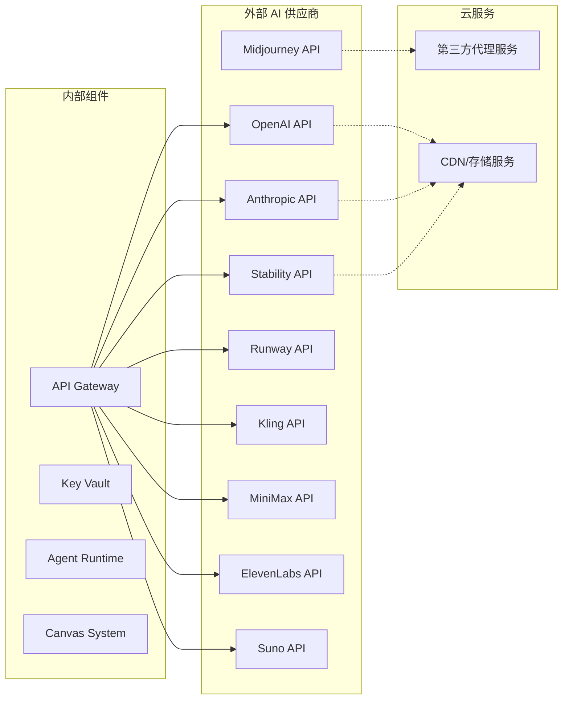

# API 集成系统

<cite>
**本文档引用的文件**
- [buzhidaozenmemingmin.md](file://buzhidaozenmemingmin.md)
</cite>

## 目录
1. [简介](#简介)
2. [项目结构](#项目结构)
3. [核心组件](#核心组件)
4. [架构概览](#架构概览)
5. [详细组件分析](#详细组件分析)
6. [依赖分析](#依赖分析)
7. [性能考虑](#性能考虑)
8. [故障排除指南](#故障排除指南)
9. [结论](#结论)
10. [附录](#附录)

## 简介

Flower Age Video 是一款基于 Tauri 桌面框架的 AI 驱动创意工作站，专注于为视频创作者、内容生产者和 AI 艺术家提供本地化的无限画布工作环境。该系统的核心创新在于其统一的 API Gateway 设计，实现了对多家 AI 供应商的无缝集成，同时确保用户隐私和数据安全。

本系统采用主 Agent 编排 + 子 Agent 执行的架构模式，通过本地 API Key 加密存储机制，让用户能够在完全私有的环境中使用各种云端 AI 服务。系统支持超过 10 个主要 AI 供应商，涵盖大语言模型、图像生成、视频生成、语音合成和音乐生成等多个领域。

## 项目结构

Flower Age Video 采用模块化的项目结构，将不同的功能组件清晰分离：



**图表来源**
- [buzhidaozenmemingmin.md:354-472](file://buzhidaozenmemingmin.md#L354-L472)

**章节来源**
- [buzhidaozenmemingmin.md:354-472](file://buzhidaozenmemingmin.md#L354-L472)

## 核心组件

### API Gateway 统一代理

API Gateway 是整个系统的核心枢纽，负责将来自 Agent Runtime 的请求路由到相应的 AI 供应商 API。该组件采用 localhost:7942 的本地监听地址，确保所有 API 调用都在用户的本地计算机上进行，无需经过任何第三方服务器。

#### 组件职责
- **统一入口**：为所有 AI 供应商提供统一的 API 接口
- **模型路由**：根据请求类型和参数自动选择合适的 AI 供应商
- **速率限制**：实施全局和供应商特定的速率限制策略
- **错误处理**：标准化错误响应格式，提供降级策略
- **安全代理**：作为本地代理，避免直接暴露用户 API Key

#### 路由策略
系统实现了智能的模型路由逻辑，能够根据以下因素自动选择最优的 AI 供应商：
- 请求类型（文本、图像、视频、音频）
- 模型参数和质量要求
- 供应商可用性和负载情况
- 用户偏好设置和历史使用记录

**章节来源**
- [buzhidaozenmemingmin.md:268-288](file://buzhidaozenmemingmin.md#L268-L288)

### 支持的 AI 供应商

系统支持以下主要 AI 供应商，每个供应商都针对特定的 AI 模型和应用场景进行了专门适配：

#### 大语言模型（LLM）
- **OpenAI**：GPT-4o / GPT-4.1，主力 Agent 推理
- **Anthropic**：Claude 4 Sonnet / Opus，复杂创意推理
- **DeepSeek**：DeepSeek-V3 / V4，高性价比推理
- **通义千问**：Qwen-Max，中文优化
- **MiniMax**：MiniMax-Text-01，备用推理

#### 图像生成
- **OpenAI**：DALL·E 3，通用图像
- **Stability AI**：SD3 / SDXL，可控图像
- **Midjourney**：通过第三方代理，艺术风格
- **即梦/豆包**：Seedream，中文文字渲染
- **Recraft**：V3，矢量/设计

#### 视频生成
- **Runway**：Gen-3 / Gen-4，高质量 T2V
- **可灵**：Kling 2.x，中文短视频
- **即梦**：Seedance 2.0，多模态视频
- **MiniMax**：Video-01，通用视频
- **Luma**：Dream Machine，氛围视频

#### 语音合成
- **MiniMax**：speech-2.8-hd，中文多情绪 TTS
- **ElevenLabs**：Multilingual v2，多语种 + 声音克隆
- **OpenAI**：TTS-1 / TTS-1-hd，通用 TTS

#### 音乐生成
- **Suno**：V4，带人声歌曲
- **Udio**：V2，高品质 BGM
- **MiniMax**：music-2.6，器乐/翻唱

**章节来源**
- [buzhidaozenmemingmin.md:290-337](file://buzhidaozenmemingmin.md#L290-L337)

### Key Vault 安全存储

Key Vault 是系统安全架构的核心组件，采用双重加密机制确保用户 API Key 的绝对安全：

#### 加密机制
1. **AES-256-GCM 加密**：使用硬件加速的对称加密算法
2. **Windows DPAPI 加持**：利用操作系统提供的密钥管理服务
3. **本地存储**：密文存储在 SQLite 数据库中
4. **内存保护**：解密后的密钥仅在内存中短暂存在

#### 安全特性
- **零日志记录**：从不记录明文 API Key
- **零网络传输**：API Key 从未离开用户本地计算机
- **零持久化明文**：数据库中只存储加密后的密文
- **最小权限原则**：仅在 API 调用时才进行解密

**章节来源**
- [buzhidaozenmemingmin.md:338-350](file://buzhidaozenmemingmin.md#L338-L350)

## 架构概览

Flower Age Video 采用了分层架构设计，确保各个组件之间的松耦合和高内聚：

```mermaid
graph TB
subgraph "用户界面层"
UI[React WebView<br/>无限画布]
Chat[Agent 对话面板]
Settings[设置界面]
end
subgraph "应用壳层"
Tauri[Tauri Desktop Shell<br/>Windows .exe]
IPC[Tauri IPC<br/>前后端通信]
end
subgraph "业务逻辑层"
AgentRuntime[Agent Runtime<br/>主/子 Agent 生命周期]
ToolRegistry[MCP 风格工具注册表]
CanvasSync[画布同步协议]
end
subgraph "基础设施层"
Gateway[API Gateway<br/>localhost:7942]
Vault[Key Vault<br/>AES-256-GCM + DPAPI]
SQLite[(SQLite)<br/>项目/资产持久化]
end
subgraph "外部服务"
OpenAI[OpenAI API]
Anthropic[Anthropic API]
Stability[Stability API]
Midjourney[Midjourney API]
Runway[Runway API]
Kling[Kling API]
MiniMax[MiniMax API]
ElevenLabs[ElevenLabs API]
Suno[Suno API]
end
UI --> Tauri
Tauri --> IPC
IPC --> AgentRuntime
AgentRuntime --> Gateway
Gateway --> Vault
Vault --> SQLite
Gateway --> OpenAI
Gateway --> Anthropic
Gateway --> Stability
Gateway --> Midjourney
Gateway --> Runway
Gateway --> Kling
Gateway --> MiniMax
Gateway --> ElevenLabs
Gateway --> Suno
AgentRuntime --> CanvasSync
CanvasSync --> UI
```

**图表来源**
- [buzhidaozenmemingmin.md:27-83](file://buzhidaozenmemingmin.md#L27-L83)

### 请求处理流程

系统采用异步事件驱动的处理模式，确保高并发场景下的稳定性和响应性：



**图表来源**
- [buzhidaozenmemingmin.md:66-83](file://buzhidaozenmemingmin.md#L66-L83)

## 详细组件分析

### API Gateway 组件架构

API Gateway 采用模块化设计，每个组件都有明确的职责和接口：



**图表来源**
- [buzhidaozenmemingmin.md:367-377](file://buzhidaozenmemingmin.md#L367-L377)

#### 路由逻辑实现

GatewayRouter 实现了复杂的路由决策逻辑，能够根据多种因素选择最优的 AI 供应商：



**图表来源**
- [buzhidaozenmemingmin.md:290-337](file://buzhidaozenmemingmin.md#L290-L337)

**章节来源**
- [buzhidaozenmemingmin.md:367-377](file://buzhidaozenmemingmin.md#L367-L377)

### Key Vault 加密存储机制

Key Vault 实现了多层次的安全保护机制，确保用户 API Key 的绝对安全：



**图表来源**
- [buzhidaozenmemingmin.md:338-350](file://buzhidaozenmemingmin.md#L338-L350)

#### 加密算法详解

系统采用业界标准的加密算法组合：

- **对称加密**：AES-256-GCM，提供机密性和完整性保护
- **密钥管理**：Windows DPAPI，利用操作系统级别的密钥保护
- **随机数生成**：使用 cryptographically secure RNG 生成 nonce 和密钥
- **认证标签**：GCM 模式的认证标签确保数据完整性

**章节来源**
- [buzhidaozenmemingmin.md:338-350](file://buzhidaozenmemingmin.md#L338-L350)

### 供应商适配器架构

每个 AI 供应商都有专门的适配器实现，确保与上游 API 的兼容性和稳定性：



**图表来源**
- [buzhidaozenmemingmin.md:370-376](file://buzhidaozenmemingmin.md#L370-L376)

**章节来源**
- [buzhidaozenmemingmin.md:370-376](file://buzhidaozenmemingmin.md#L370-L376)

## 依赖分析

### 技术栈依赖

系统采用 MIT/Apache-2.0 许可证的开源技术栈，确保商业使用的安全性：

```mermaid
graph TB
subgraph "桌面框架"
Tauri[Tauri 2.x<br/>MIT + Apache-2.0]
WebView[WebView2<br/>系统组件]
Bundler[Tauri Bundler<br/>MIT]
Updater[Tauri Updater<br/>MIT]
end
subgraph "前端技术"
React[React 18<br/>MIT]
TS[TypeScript 5.x<br/>Apache-2.0]
Vite[Vite<br/>MIT]
XYFlow[@xyflow/react<br/>MIT]
Zustand[Zustand<br/>MIT]
Shadcn[shadcn/ui + Radix<br/>MIT]
Tailwind[Tailwind CSS<br/>MIT]
Motion[Framer Motion<br/>MIT]
AISDK[@ai-sdk/react<br/>Apache-2.0]
end
subgraph "后端技术"
Axum[Axum<br/>MIT]
Tokio[Tokio<br/>MIT]
Reqwest[Reqwest<br/>MIT + Apache-2.0]
Ring[Ring<br/>ISC]
Rusqlite[Rusqlite<br/>MIT]
Tera[Tera<br/>MIT]
Wasmtime[Wasmtime<br/>Apache-2.0]
end
subgraph "原生模块"
FFmpeg[FFmpeg Sidecar<br/>MIT]
ImageRs[Image-rs<br/>MIT]
Symphonia[Symphonia<br/>MPL-2.0]
Whisper[Whisper-rs<br/>MIT]
end
```

**图表来源**
- [buzhidaozenmemingmin.md:87-134](file://buzhidaozenmemingmin.md#L87-L134)

### 第三方依赖关系

系统与外部 AI 供应商的依赖关系相对独立，通过 API Gateway 实现松耦合集成：



**图表来源**
- [buzhidaozenmemingmin.md:270-288](file://buzhidaozenmemingmin.md#L270-L288)

**章节来源**
- [buzhidaozenmemingmin.md:87-134](file://buzhidaozenmemingmin.md#L87-L134)

## 性能考虑

### 并发处理机制

系统采用异步并发模型，能够高效处理多个 AI 供应商的请求：

- **Tokio 异步运行时**：提供高效的并发执行环境
- **连接池管理**：复用 HTTP 连接，减少握手开销
- **请求队列**：按供应商维度管理请求队列
- **超时控制**：为每个请求设置合理的超时时间

### 缓存策略

为了提高响应速度和降低成本，系统实现了多层缓存机制：

- **API Key 缓存**：短期缓存解密后的 API Key
- **模型能力缓存**：缓存供应商的模型能力信息
- **响应缓存**：对重复的相同请求进行缓存
- **配置缓存**：缓存用户设置和偏好

### 资源管理

系统采用严格的资源管理策略：

- **内存限制**：防止内存泄漏和过度占用
- **文件句柄管理**：及时关闭不再使用的文件
- **网络连接监控**：监控和重置异常的网络连接
- **垃圾回收**：定期清理无用对象

## 故障排除指南

### 常见问题诊断

#### API Key 相关问题

**问题症状**：API 调用返回认证错误或 401 状态码

**诊断步骤**：
1. 检查 API Key 是否正确存储在 Key Vault 中
2. 验证 API Key 格式是否符合供应商要求
3. 确认 API Key 是否已过期或被撤销
4. 检查网络连接是否正常

**解决方案**：
- 重新配置 API Key 并保存
- 联系相应供应商确认账户状态
- 检查防火墙设置是否阻止访问

#### 供应商连接问题

**问题症状**：请求超时或连接失败

**诊断步骤**：
1. 检查供应商 API 的可用性状态
2. 验证网络连接和 DNS 解析
3. 检查代理设置和防火墙规则
4. 查看系统日志中的错误信息

**解决方案**：
- 切换到备用供应商
- 配置正确的代理服务器
- 调整超时参数和重试策略

#### 速率限制问题

**问题症状**：频繁收到 429 状态码或被限流

**诊断步骤**：
1. 检查当前的请求频率
2. 分析供应商的速率限制配置
3. 评估系统的并发设置
4. 监控 API 调用统计

**解决方案**：
- 调整请求间隔和并发数量
- 实施指数退避策略
- 为不同供应商设置独立的限流规则

### 调试工具和方法

#### 日志分析

系统提供了详细的日志记录机制：

- **API 调用日志**：记录所有外部 API 调用的详细信息
- **错误日志**：记录所有错误和异常的堆栈跟踪
- **性能日志**：记录响应时间和资源使用情况
- **安全日志**：记录所有安全相关的事件

#### 性能监控

建议使用以下指标监控系统性能：

- **请求延迟**：平均响应时间和 95 分位延迟
- **错误率**：API 调用失败的比例
- **吞吐量**：每秒处理的请求数量
- **资源利用率**：CPU、内存、网络的使用情况

**章节来源**
- [buzhidaozenmemingmin.md:66-83](file://buzhidaozenmemingmin.md#L66-L83)

## 结论

Flower Age Video 的 API 集成系统代表了现代 AI 创意工具的发展方向，通过本地化的架构设计和严格的安全保障，为用户提供了既强大又安全的 AI 创作体验。

该系统的主要优势包括：

1. **隐私保护**：所有 API 调用都在本地进行，用户数据完全受控
2. **灵活性**：支持多家 AI 供应商，用户可以根据需求选择
3. **安全性**：采用 AES-256-GCM + Windows DPAPI 的双重加密机制
4. **可扩展性**：模块化的架构设计便于添加新的 AI 供应商
5. **易用性**：简洁的用户界面和直观的工作流程

未来的发展方向包括：
- 支持更多 AI 供应商和模型
- 优化性能和资源使用效率
- 增强错误处理和故障恢复能力
- 扩展插件生态系统

## 附录

### 新供应商接入指南

#### 基本要求
- 支持 RESTful API 接口
- 提供标准的 HTTP 认证机制
- 支持 JSON 格式的请求和响应
- 具备稳定的 API 端点和域名

#### 接入步骤
1. **需求分析**：确定供应商支持的功能类型和模型
2. **接口设计**：定义供应商适配器的接口规范
3. **实现开发**：编写适配器代码和测试用例
4. **配置集成**：在系统配置中注册新供应商
5. **测试验证**：进行全面的功能和性能测试
6. **文档完善**：更新相关技术文档和用户指南

#### 最佳实践
- 遵循现有的代码风格和架构模式
- 实现完整的错误处理和重试机制
- 提供详细的日志记录和监控指标
- 确保线程安全和资源管理
- 考虑国际化和本地化需求

### API 调用示例

由于系统采用本地 API 调用模式，具体的 API 调用示例将在实际开发过程中提供。建议开发者参考以下通用模式：

#### 基本调用流程
1. **参数准备**：构建符合供应商要求的请求参数
2. **认证处理**：从 Key Vault 获取并使用 API Key
3. **请求发送**：通过 API Gateway 发送 HTTP 请求
4. **响应处理**：解析和验证供应商的响应
5. **结果存储**：将生成的资产保存到本地存储

#### 错误处理策略
- **网络错误**：实现重试机制和降级策略
- **认证错误**：提示用户重新配置 API Key
- **业务错误**：提供友好的错误消息和解决建议
- **超时处理**：设置合理的超时时间和取消机制

### 安全最佳实践

#### 密钥管理
- 定期轮换 API Key，避免长期使用同一密钥
- 为不同供应商使用独立的 API Key
- 限制 API Key 的权限范围和使用限制
- 定期审计 API Key 的使用记录

#### 网络安全
- 使用 HTTPS 协议进行所有 API 通信
- 配置适当的防火墙规则和访问控制
- 定期更新系统和依赖的安全补丁
- 监控异常的网络活动和访问模式

#### 数据保护
- 对敏感数据进行最小化收集和存储
- 实施数据脱敏和匿名化处理
- 定期备份重要数据并验证恢复流程
- 建立数据销毁和清理的政策和流程