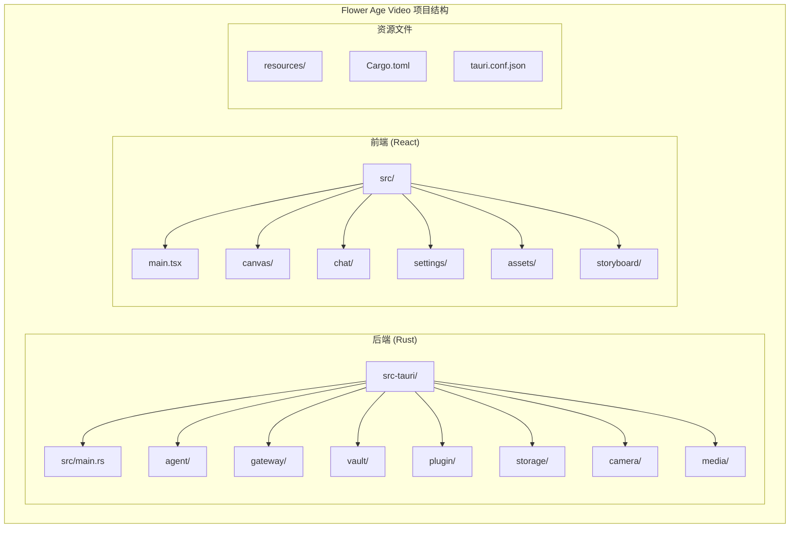
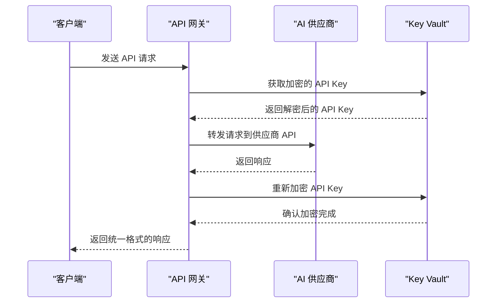
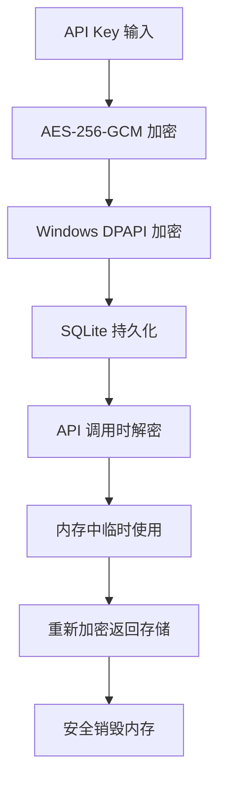
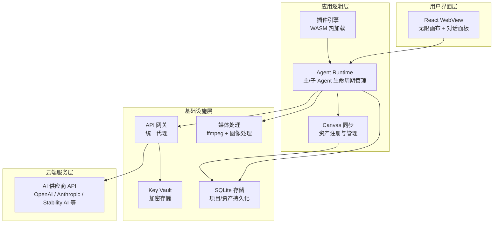
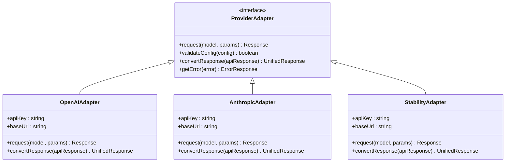
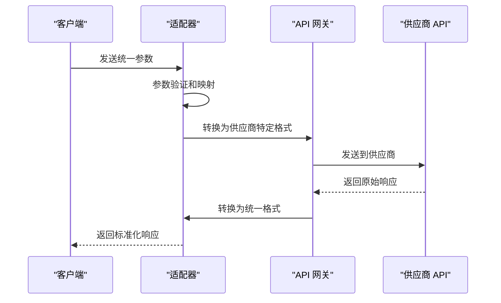
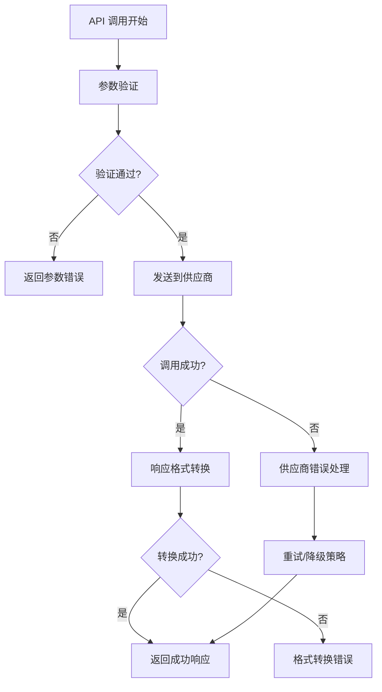
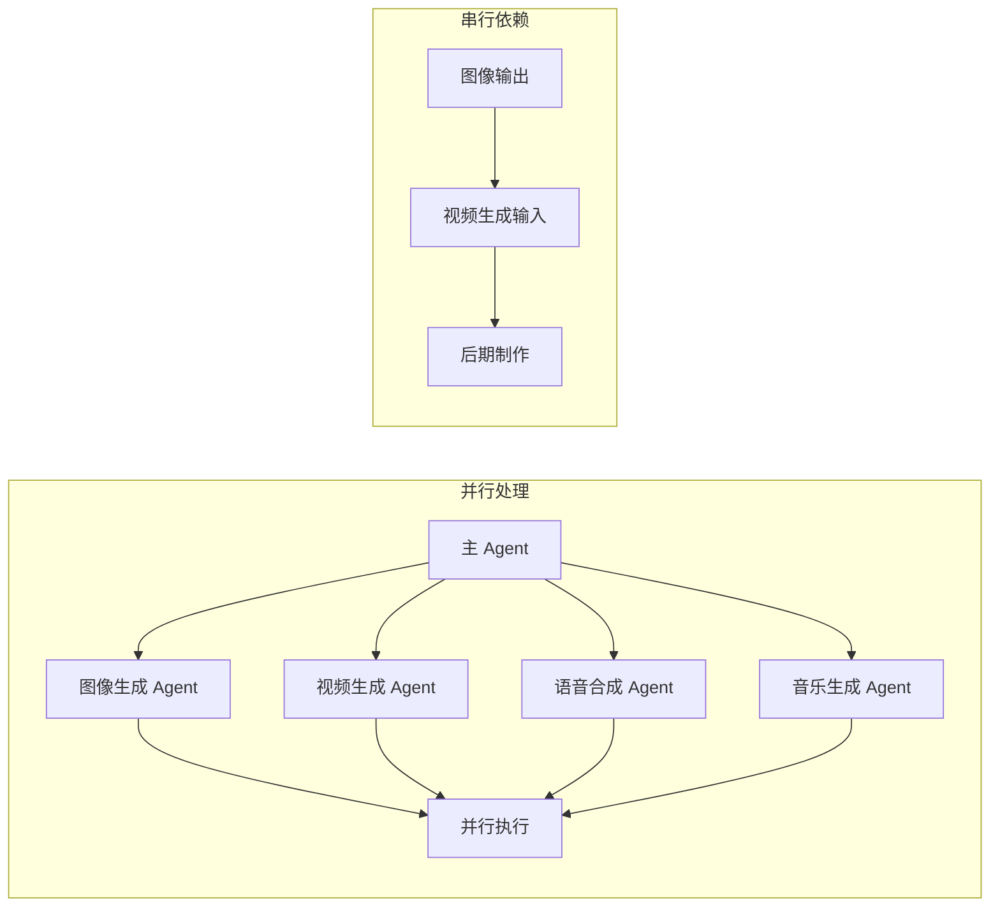

# 供应商适配器

<cite>
**本文引用的文件**
- [buzhidaozenmemingmin.md](file://buzhidaozenmemingmin.md)
</cite>

## 目录
1. [简介](#简介)
2. [项目结构](#项目结构)
3. [核心组件](#核心组件)
4. [架构总览](#架构总览)
5. [详细组件分析](#详细组件分析)
6. [依赖分析](#依赖分析)
7. [性能考虑](#性能考虑)
8. [故障排除指南](#故障排除指南)
9. [结论](#结论)
10. [附录](#附录)

## 简介

Flower Age Video 是一款基于 AI 驱动的无限画布创意工作站，专注于为视频创作者、内容生产者和 AI 艺术家提供完整的本地化解决方案。该项目的核心创新在于其供应商适配器系统，该系统能够统一管理多个 AI 供应商的 API 调用，为不同的 AI 模型提供一致的接口。

本系统采用主 Agent 编排 + 子 Agent 执行的架构模式，通过统一的 API 网关实现对 OpenAI、Anthropic、Stability AI、Midjourney、Runway、Kling、MiniMax、ElevenLabs、Suno 等多家 AI 供应商的支持。

## 项目结构

根据项目文档，Flower Age Video 采用前后端分离的架构设计，后端使用 Rust 语言开发，前端使用 React + TypeScript 构建。



**图表来源**
- [buzhidaozenmemingmin.md:354-472](file://buzhidaozenmemingmin.md#L354-L472)

**章节来源**
- [buzhidaozenmemingmin.md:354-472](file://buzhidaozenmemingmin.md#L354-L472)

## 核心组件

### API 网关 (API Gateway)

API 网关是整个系统的核心组件，负责统一管理所有 AI 供应商的 API 调用。该组件运行在本地端口 7942 上，作为所有外部 API 调用的代理层。



**图表来源**
- [buzhidaozenmemingmin.md:268-288](file://buzhidaozenmemingmin.md#L268-L288)

### Key Vault 加密存储

Key Vault 组件负责安全地存储和管理用户的 API Key，采用 AES-256-GCM 加密算法，并结合 Windows DPAPI 提供额外的安全保护。



**图表来源**
- [buzhidaozenmemingmin.md:338-350](file://buzhidaozenmemingmin.md#L338-L350)

**章节来源**
- [buzhidaozenmemingmin.md:268-350](file://buzhidaozenmemingmin.md#L268-L350)

## 架构总览

Flower Age Video 的整体架构采用了分层设计，确保了系统的可扩展性和安全性。



**图表来源**
- [buzhidaozenmemingmin.md:27-83](file://buzhidaozenmemingmin.md#L27-L83)

**章节来源**
- [buzhidaozenmemingmin.md:27-83](file://buzhidaozenmemingmin.md#L27-L83)

## 详细组件分析

### 供应商适配器架构

每个 AI 供应商都通过专门的适配器进行集成，这些适配器遵循统一的接口规范，确保不同供应商之间的兼容性。



**图表来源**
- [buzhidaozenmemingmin.md:290-337](file://buzhidaozenmemingmin.md#L290-L337)

### 支持的 AI 供应商能力矩阵

根据项目文档，Flower Age Video 支持以下 AI 供应商及其主要能力：

#### 大语言模型 (LLM)
| 供应商 | 模型 | 主要用途 | 参数映射 |
|--------|------|----------|----------|
| OpenAI | GPT-4o, GPT-4.1 | 主力 Agent 推理 | system_prompt, messages, temperature |
| Anthropic | Claude 4 Sonnet, Opus | 复杂创意推理 | system, messages, temperature |
| DeepSeek | DeepSeek-V3, V4 | 高性价比推理 | prompt, temperature, max_tokens |
| 通义千问 | Qwen-Max | 中文优化 | messages, temperature, top_p |
| MiniMax | MiniMax-Text-01 | 备用推理 | messages, temperature, stream |

#### 图像生成
| 供应商 | 模型 | 主要用途 | 参数映射 |
|--------|------|----------|----------|
| OpenAI | DALL·E 3 | 通用图像 | prompt, model, n, size |
| Stability AI | SD3, SDXL | 可控图像 | prompt, width, height, cfg_scale |
| Midjourney | (第三方代理) | 艺术风格 | prompt, style, aspect_ratio |
| 即梦/豆包 | Seedream | 中文文字渲染 | prompt, style, resolution |
| Recraft | V3 | 矢量/设计 | prompt, format, style |

#### 视频生成
| 供应商 | 模型 | 主要用途 | 参数映射 |
|--------|------|----------|----------|
| Runway | Gen-3, Gen-4 | 高质量 T2V | prompt, duration, fps |
| 可灵 | Kling 2.x | 中文短视频 | prompt, duration, aspect_ratio |
| 即梦 | Seedance 2.0 | 多模态视频 | prompt, duration, motion |
| MiniMax | Video-01 | 通用视频 | prompt, duration, resolution |
| Luma | Dream Machine | 氛围视频 | prompt, mood, style |

#### 语音合成
| 供应商 | 模型 | 主要用途 | 参数映射 |
|--------|------|----------|----------|
| MiniMax | speech-2.8-hd | 中文多情绪 TTS | text, voice_type, speed |
| ElevenLabs | Multilingual v2 | 多语种 + 声音克隆 | text, voice_id, emotion |
| OpenAI | TTS-1, TTS-1-hd | 通用 TTS | input, voice, response_format |

#### 音乐生成
| 供应商 | 模型 | 主要用途 | 参数映射 |
|--------|------|----------|----------|
| Suno | V4 | 带人声歌曲 | prompt, duration, mood |
| Udio | V2 | 高品质 BGM | prompt, duration, genre |
| MiniMax | music-2.6 | 器乐/翻唱 | prompt, duration, style |

**章节来源**
- [buzhidaozenmemingmin.md:290-337](file://buzhidaozenmemingmin.md#L290-L337)

### 统一接口设计

系统实现了统一的接口设计，确保不同供应商的 API 调用具有相同的参数格式和响应结构。



**图表来源**
- [buzhidaozenmemingmin.md:268-288](file://buzhidaozenmemingmin.md#L268-L288)

### 错误处理机制

系统实现了多层次的错误处理机制，包括参数验证、API 调用错误、响应格式转换错误等。



**图表来源**
- [buzhidaozenmemingmin.md:268-288](file://buzhidaozenmemingmin.md#L268-L288)

**章节来源**
- [buzhidaozenmemingmin.md:268-350](file://buzhidaozenmemingmin.md#L268-L350)

## 依赖分析

### 技术栈依赖

Flower Age Video 采用了现代化的技术栈组合，确保了高性能和易维护性。

```mermaid
graph TB
subgraph "后端技术栈"
Rust[Rust 语言] --> Tokio[Tokio 异步运行时]
Rust --> Axum[Axum HTTP 框架]
Rust --> Reqwest[Reqwest HTTP 客户端]
Rust --> Ring[Ring 加密库]
Rust --> Rusqlite[Rusqlite SQLite]
Rust --> Wasmtime[Wasmtime WASM 运行时]
end
subgraph "前端技术栈"
React[React 18] --> TS[TypeScript 5.x]
React --> Vite[Vite 构建工具]
React --> XYFlow[@xyflow/react 无限画布]
React --> Zustand[Zustand 状态管理]
end
subgraph "原生模块"
FFmpeg[FFmpeg Sidecar] --> Media[媒体处理]
ImageRs[Image-rs] --> ImageProc[图像处理]
Symphonia[Symphonia] --> AudioProc[音频处理]
end
```

**图表来源**
- [buzhidaozenmemingmin.md:87-134](file://buzhidaozenmemingmin.md#L87-L134)

### 许可证兼容性

项目中的所有依赖都采用了 MIT、Apache-2.0 或 BSD 许可证，确保了商业使用的安全性。

**章节来源**
- [buzhidaozenmemingmin.md:87-134](file://buzhidaozenmemingmin.md#L87-L134)

## 性能考虑

### 并行处理架构

系统采用了并行处理架构，允许多个 Agent 同时执行不同的任务，最大化利用计算资源。



**图表来源**
- [buzhidaozenmemingmin.md:172-190](file://buzhidaozenmemingmin.md#L172-L190)

### 速率限制与缓存

API 网关实现了智能的速率限制和缓存机制，确保在高并发情况下仍能保持稳定的性能表现。

**章节来源**
- [buzhidaozenmemingmin.md:172-190](file://buzhidaozenmemingmin.md#L172-L190)

## 故障排除指南

### 常见问题诊断

1. **API Key 无效**
   - 检查 API Key 是否正确配置
   - 验证供应商账户状态
   - 确认网络连接正常

2. **响应超时**
   - 检查供应商 API 状态
   - 调整超时参数
   - 实施重试机制

3. **格式转换错误**
   - 验证响应格式
   - 检查适配器实现
   - 查看日志记录

### 调试工具

系统提供了完善的调试工具和日志记录机制，帮助开发者快速定位和解决问题。

**章节来源**
- [buzhidaozenmemingmin.md:268-350](file://buzhidaozenmemingmin.md#L268-L350)

## 结论

Flower Age Video 的供应商适配器系统代表了现代 AI 创意工具的发展方向。通过统一的接口设计、强大的加密存储机制和灵活的插件架构，该系统为用户提供了安全、高效、易用的 AI 创作体验。

系统的主要优势包括：
- **安全性**：用户自有 API Key，无中间商代理
- **灵活性**：支持多种 AI 供应商，可扩展性强
- **性能**：并行处理架构，充分利用计算资源
- **易用性**：零环境依赖，双击即用

随着 AI 技术的不断发展，该系统将继续演进，为创作者提供更强大的工具和更丰富的创作可能性。

## 附录

### 新供应商接入流程

1. **需求分析**：评估供应商 API 的功能和限制
2. **适配器开发**：实现统一接口规范
3. **参数映射**：建立参数转换规则
4. **测试验证**：进行全面的功能和性能测试
5. **文档编写**：更新相关技术文档
6. **部署上线**：集成到生产环境

### 最佳实践建议

1. **安全性优先**：始终使用加密存储 API Key
2. **错误处理**：实现完善的异常处理机制
3. **性能监控**：建立实时的性能监控体系
4. **版本管理**：严格控制 API 版本兼容性
5. **用户体验**：提供清晰的进度反馈和错误信息