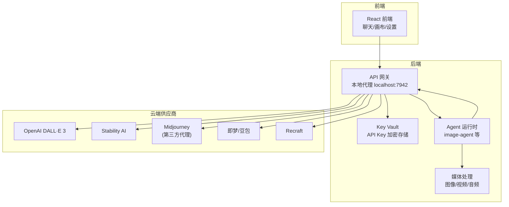
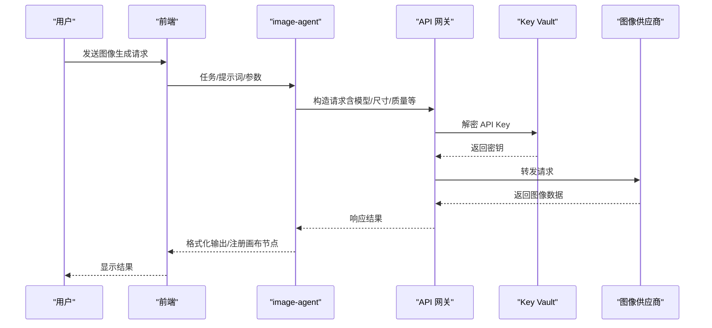
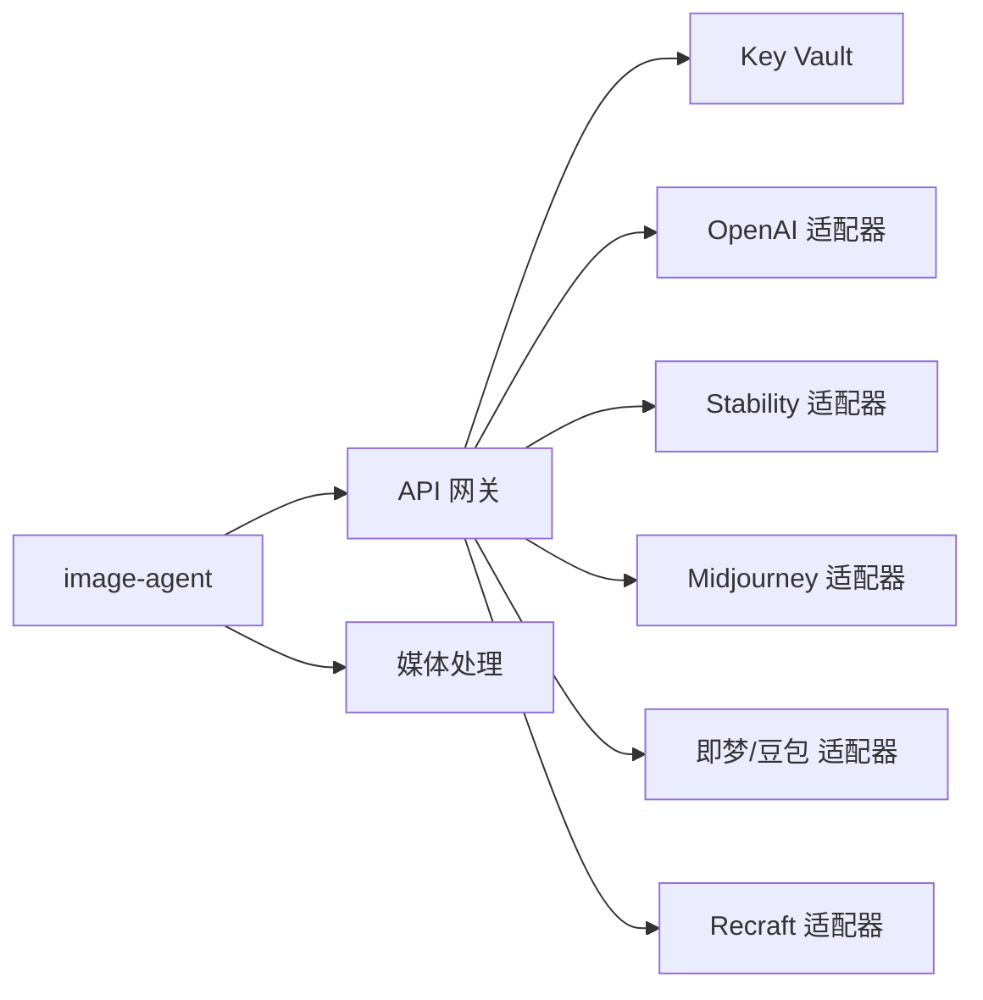

# 图像生成适配器

<cite>
**本文引用的文件**
- [buzhidaozenmemingmin.md](file://buzhidaozenmemingmin.md)
</cite>

## 目录
1. [简介](#简介)
2. [项目结构](#项目结构)
3. [核心组件](#核心组件)
4. [架构总览](#架构总览)
5. [详细组件分析](#详细组件分析)
6. [依赖分析](#依赖分析)
7. [性能考虑](#性能考虑)
8. [故障排查指南](#故障排查指南)
9. [结论](#结论)
10. [附录](#附录)

## 简介
本文件为 Flower Age Video 的图像生成适配器系统提供全面技术文档。根据项目设计文档，系统通过本地 API 网关统一路由至多家云端图像生成供应商（OpenAI DALL·E 3、Stability AI、Midjourney、即梦/豆包、Recraft），并在本地以加密方式存储用户 API Key，确保隐私与可控性。本文将围绕适配器的统一接口设计、提示词处理、参数映射、分辨率与质量控制、批量生成与错误恢复、以及新供应商接入流程进行系统化说明，并给出参数配置与质量优化建议。

## 项目结构
- 项目采用前后端分离架构：前端为 React/Vite，后端为 Tauri/Rust。
- 后端包含 Agent 运行时、API 网关、Key Vault、存储与媒体处理等模块。
- 图像生成适配器位于后端 API 网关的供应商适配层，负责对接各图像生成供应商。

图表来源
- [buzhidaozenmemingmin.md:357-416](file://buzhidaozenmemingmin.md#L357-L416)
- [buzhidaozenmemingmin.md:266-288](file://buzhidaozenmemingmin.md#L266-L288)

章节来源
- [buzhidaozenmemingmin.md:357-416](file://buzhidaozenmemingmin.md#L357-L416)
- [buzhidaozenmemingmin.md:266-288](file://buzhidaozenmemingmin.md#L266-L288)

## 核心组件
- API 网关：本地代理，负责路由到各图像生成供应商，统一处理请求与响应。
- Key Vault：本地加密存储 API Key，确保隐私与安全。
- Agent 运行时：其中 image-agent 作为图像生成专家，负责提示词解析、参数映射、批量生成与错误恢复。
- 媒体处理：图像编解码、格式转换、缩略图生成等。

章节来源
- [buzhidaozenmemingmin.md:57-65](file://buzhidaozenmemingmin.md#L57-L65)
- [buzhidaozenmemingmin.md:166](file://buzhidaozenmemingmin.md#L166)
- [buzhidaozenmemingmin.md:130-133](file://buzhidaozenmemingmin.md#L130-L133)

## 架构总览
图像生成请求在前端发起后，经由 Agent 运行时的 image-agent 进行任务拆解与参数准备，随后通过 API 网关统一路由到对应供应商。API 网关在本地进行 Key Vault 解密与请求转发，返回结果后再由 Agent 运行时进行后处理与画布同步。

图表来源
- [buzhidaozenmemingmin.md:66-83](file://buzhidaozenmemingmin.md#L66-L83)
- [buzhidaozenmemingmin.md:266-288](file://buzhidaozenmemingmin.md#L266-L288)
- [buzhidaozenmemingmin.md:338-350](file://buzhidaozenmemingmin.md#L338-L350)

## 详细组件分析

### 统一接口设计
- 统一入口：API 网关提供统一路由与限流，屏蔽供应商差异。
- 统一参数：image-agent 将前端参数标准化为适配器可识别的键值，包括提示词、尺寸、质量、风格、种子等。
- 统一错误：对供应商返回的错误进行归一化处理，结合降级矩阵进行恢复或回退。

章节来源
- [buzhidaozenmemingmin.md:66-83](file://buzhidaozenmemingmin.md#L66-L83)
- [buzhidaozenmemingmin.md:558-564](file://buzhidaozenmemingmin.md#L558-L564)

### 提示词处理与参数映射
- 提示词清洗：去除冗余字符、规范化关键词，避免供应商侧违禁词触发。
- 参数映射规则：
  - 尺寸：统一为像素宽高，按供应商支持范围映射；若超出范围则按比例缩放或取最接近值。
  - 质量：统一质量等级（如低/中/高），映射到供应商的采样步数、CFG、分辨率等。
  - 风格/风格权重：映射到供应商的风格标签或参数（如 LoRA、艺术风格参数）。
  - 种子：随机或固定种子，保证可复现性。
- 批量生成：将同一任务拆分为多个子任务，分别映射到不同供应商或不同参数组合，提高成功率与多样性。

章节来源
- [buzhidaozenmemingmin.md:166](file://buzhidaozenmemingmin.md#L166)
- [buzhidaozenmemingmin.md:558-564](file://buzhidaozenmemingmin.md#L558-L564)

### 分辨率控制与质量设置
- 分辨率控制：优先满足目标画布/项目需求，按供应商支持的最大分辨率与比例进行裁剪或缩放。
- 质量设置：通过统一的质量等级映射到供应商的采样步数、CFG、重采样策略等；在高分辨率下适当增加步数以保持细节。
- 格式转换：统一输出为高质量 PNG/JPEG，必要时进行格式转换与压缩。

章节来源
- [buzhidaozenmemingmin.md:130-133](file://buzhidaozenmemingmin.md#L130-L133)

### 错误恢复机制
- 降级矩阵：当某供应商不可用或限额时，自动切换到备用供应商或降低质量/分辨率。
- 重试与超时：对瞬时错误进行指数退避重试，设置合理超时阈值。
- 失败兜底：若多次失败，返回预设的占位图或提示信息，并记录日志便于诊断。

章节来源
- [buzhidaozenmemingmin.md:558-564](file://buzhidaozenmemingmin.md#L558-L564)

### 新供应商接入流程与适配器开发指南
- 供应商能力评估：确认是否支持文本到图像（T2I）、图像到图像（I2I）、风格迁移、批量生成等。
- 适配器开发步骤：
  1) 在 API 网关新增供应商模块，实现统一接口（请求构造、响应解析、错误处理）。
  2) 参数映射：建立与统一参数的映射表，覆盖尺寸、质量、风格、种子等。
  3) Key Vault 集成：在 Key Vault 中新增该供应商的密钥字段与解密逻辑。
  4) 限流与配额：对接供应商的速率限制与配额，实现本地限流与排队。
  5) 测试与回归：覆盖正常/异常/边界场景，确保稳定性与一致性。
- 接入验证：通过单元测试与端到端测试验证适配器行为与画布同步。

章节来源
- [buzhidaozenmemingmin.md:659-664](file://buzhidaozenmemingmin.md#L659-L664)
- [buzhidaozenmemingmin.md:338-350](file://buzhidaozenmemingmin.md#L338-L350)

## 依赖分析
- 外部依赖：HTTP 客户端、加密库、SQLite、图像处理库、SSE 等。
- 内部耦合：API 网关与 Key Vault、Agent 运行时与网关、媒体处理与画布同步。

图表来源
- [buzhidaozenmemingmin.md:118-124](file://buzhidaozenmemingmin.md#L118-L124)
- [buzhidaozenmemingmin.md:130-133](file://buzhidaozenmemingmin.md#L130-L133)

章节来源
- [buzhidaozenmemingmin.md:118-124](file://buzhidaozenmemingmin.md#L118-L124)
- [buzhidaozenmemingmin.md:130-133](file://buzhidaozenmemingmin.md#L130-L133)

## 性能考虑
- 并行与串行：对无依赖的子任务进行并行生成，对有依赖的任务进行串行处理，缩短总耗时。
- 批量生成：在保证质量的前提下，尽量合并请求以减少往返开销。
- 缓存与重用：对重复提示词或相似参数的结果进行缓存，避免重复调用。
- 限流与配额：严格遵守供应商的速率限制与配额，避免被限流或封禁。
- 压缩与格式：在满足画布/项目要求的前提下，选择合适的输出格式与压缩级别，平衡质量与体积。

## 故障排查指南
- API Key 问题：确认 Key Vault 中密钥正确且未过期；检查解密流程与权限。
- 供应商不可用：检查网络连通性、代理设置与供应商状态；查看限流与配额。
- 参数不生效：核对参数映射表，确认尺寸/质量/风格等参数是否在供应商支持范围内。
- 输出异常：检查图像编解码与格式转换逻辑，确认输出格式与画布节点注册是否成功。
- 日志与监控：启用详细日志记录，定位错误发生点并进行针对性修复。

章节来源
- [buzhidaozenmemingmin.md:338-350](file://buzhidaozenmemingmin.md#L338-L350)
- [buzhidaozenmemingmin.md:558-564](file://buzhidaozenmemingmin.md#L558-L564)

## 结论
Flower Age Video 的图像生成适配器系统通过统一接口、参数映射与错误恢复机制，实现了对多家图像生成供应商的无缝集成。配合本地 Key Vault 与画布同步，既保障了隐私与可控性，又提升了创作效率与一致性。未来可通过插件化扩展与持续优化参数映射，进一步提升适配器的灵活性与性能。

## 附录
- 支持的图像生成供应商（首批）：OpenAI DALL·E 3、Stability AI、Midjourney（第三方代理）、即梦/豆包、Recraft。
- 关键设计亮点：主 Agent + 子 Agent 分层、确定性派发流程、Canvas 节点系统、Memory 持久化、知识库 Top-5 截断、合约约束系统、降级矩阵等。

章节来源
- [buzhidaozenmemingmin.md:290-310](file://buzhidaozenmemingmin.md#L290-L310)
- [buzhidaozenmemingmin.md:551-564](file://buzhidaozenmemingmin.md#L551-L564)