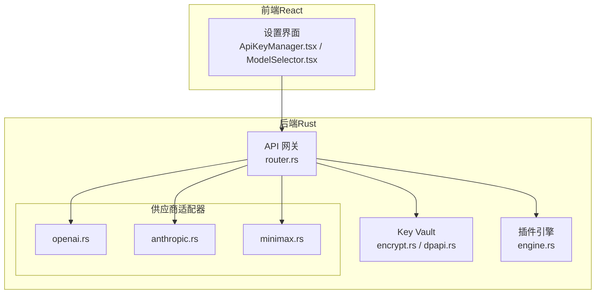
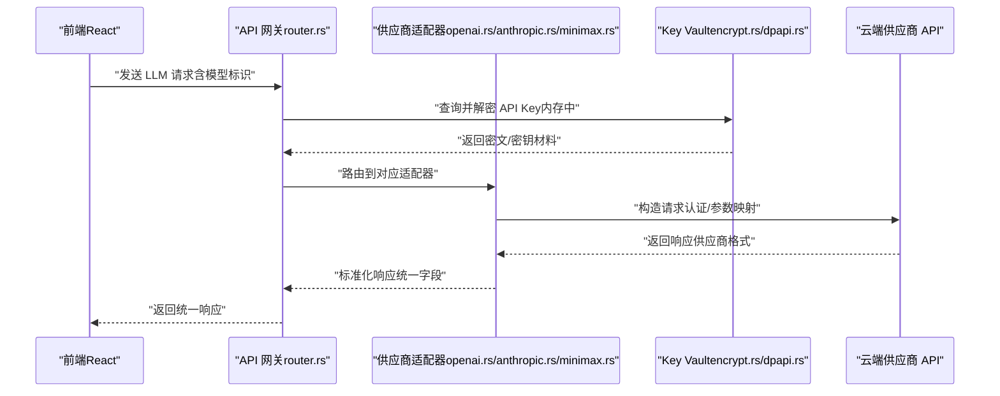
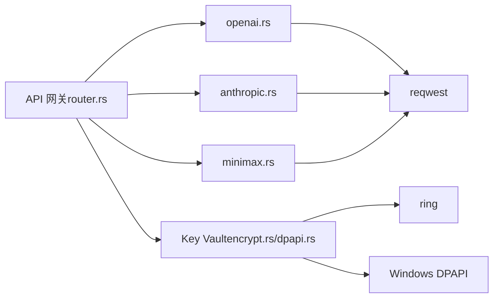

# 大语言模型适配器

<cite>
**本文引用的文件**
- [buzhidaozenmemingmin.md](file://buzhidaozenmemingmin.md)
</cite>

## 目录
1. [简介](#简介)
2. [项目结构](#项目结构)
3. [核心组件](#核心组件)
4. [架构总览](#架构总览)
5. [详细组件分析](#详细组件分析)
6. [依赖关系分析](#依赖关系分析)
7. [性能考虑](#性能考虑)
8. [故障排查指南](#故障排查指南)
9. [结论](#结论)
10. [附录](#附录)

## 简介
本文件为 Flower Age Video 的大语言模型（LLM）适配器系统提供技术文档。该系统以“主 Agent 编排 + 子 Agent 执行”的模式为核心，通过本地 API 网关统一对接多家云端 AI 供应商（OpenAI、Anthropic、DeepSeek、通义千问、MiniMax），为视频创作工作流提供推理与决策支持。文档重点阐述：
- LLM 适配器的统一接口设计与模型路由逻辑
- 认证机制与 API Key 安全存储策略
- 请求参数映射与响应格式转换
- 错误处理与速率限制机制
- 新供应商接入流程与适配器开发最佳实践
- 具体调用示例、参数配置指南与性能优化建议

## 项目结构
根据设计文档，后端采用 Rust + Tauri 架构，LLM 适配器位于 API 网关模块下，按供应商划分目录组织。以下为与 LLM 适配器相关的关键目录与职责概览：
- src-tauri/src/gateway/router.rs：模型路由与请求分发
- src-tauri/src/gateway/providers/openai.rs：OpenAI 适配器
- src-tauri/src/gateway/providers/anthropic.rs：Anthropic 适配器
- src-tauri/src/gateway/providers/minimax.rs：MiniMax 适配器
- src-tauri/src/vault/encrypt.rs：API Key 加密存储（AES-256-GCM）
- src-tauri/src/vault/dpapi.rs：Windows DPAPI 保护
- src-tauri/src/plugin/engine.rs：WASM 插件引擎，用于扩展新供应商

图表来源
- [buzhidaozenmemingmin.md:357-416](file://buzhidaozenmemingmin.md#L357-L416)

章节来源
- [buzhidaozenmemingmin.md:357-416](file://buzhidaozenmemingmin.md#L357-L416)

## 核心组件
- API 网关（router.rs）：负责接收来自前端的 LLM 请求，解析模型标识，将请求路由至对应供应商适配器，并聚合响应返回给前端。
- 供应商适配器：针对不同供应商的 API 端点、认证方式、请求参数与响应格式进行适配与转换。
- Key Vault：本地加密存储 API Key，确保不落盘明文，仅在调用时于内存中短暂解密。
- 插件引擎：通过 WASM 插件机制扩展新的供应商接入，保证安全与隔离。

章节来源
- [buzhidaozenmemingmin.md:266-350](file://buzhidaozenmemingmin.md#L266-L350)
- [buzhidaozenmemingmin.md:357-416](file://buzhidaozenmemingmin.md#L357-L416)

## 架构总览
Flower Age Video 的 LLM 适配器遵循“本地直连 + 统一网关 + 供应商适配器 + 安全存储”的设计。Agent Runtime 在本地发起 LLM 调用，API 网关根据模型标识选择适配器，适配器完成认证与参数映射后调用云端供应商 API，最终将标准化后的响应返回给前端。

图表来源
- [buzhidaozenmemingmin.md:266-350](file://buzhidaozenmemingmin.md#L266-L350)

## 详细组件分析

### 统一接口设计与模型路由
- 统一接口：前端通过统一的 LLM 调用入口提交请求，包含模型标识、消息历史、参数等；网关负责解析并路由。
- 模型路由：根据模型标识（如 openai/gpt-4o、anthropic/claude-4、minimax/text-01 等）将请求分发到对应适配器。
- 降级矩阵：每个适配器内嵌失败兜底策略，当上游供应商不可用或限流时，自动切换备用模型或返回降级结果。

章节来源
- [buzhidaozenmemingmin.md:290-301](file://buzhidaozenmemingmin.md#L290-L301)
- [buzhidaozenmemingmin.md:357-416](file://buzhidaozenmemingmin.md#L357-L416)

### 认证机制与 API Key 安全存储
- 认证方式：各供应商适配器在请求头中注入对应的认证字段（如 Authorization），值来自本地 Key Vault 解密后的 API Key。
- 安全存储：API Key 使用 AES-256-GCM 加密存储于本地 SQLite；加密密钥由 Windows DPAPI 保护；解密仅在调用时于内存中短暂存在，不写入日志或网络传输。
- Key Vault 组件：encrypt.rs 负责加解密；dpapi.rs 负责系统级密钥保护。

章节来源
- [buzhidaozenmemingmin.md:338-350](file://buzhidaozenmemingmin.md#L338-L350)
- [buzhidaozenmemingmin.md:378-381](file://buzhidaozenmemingmin.md#L378-L381)

### 请求参数映射与响应格式转换
- 参数映射：适配器将统一的请求参数映射为供应商特定的请求字段（如消息结构、温度、最大生成长度等），并处理特殊字段（如流式输出开关）。
- 响应转换：将供应商返回的原始响应转换为统一的数据结构（如统一的消息内容、耗时统计、token 使用量等），便于前端与 Agent Runtime 一致消费。
- 流式输出：若供应商支持流式输出，适配器需正确解析流式事件并拼接为完整响应。

章节来源
- [buzhidaozenmemingmin.md:266-350](file://buzhidaozenmemingmin.md#L266-L350)

### 错误处理策略
- 供应商错误：捕获 HTTP 状态码、错误码与错误消息，进行分类处理（如重试、降级、报错）。
- 限流与退避：对 429/5xx 等错误实施指数退避重试；超过阈值则触发降级矩阵。
- 本地异常：Key Vault 解密失败、网络超时、参数校验失败等情况均需记录并返回明确的错误信息。

章节来源
- [buzhidaozenmemingmin.md:357-416](file://buzhidaozenmemingmin.md#L357-L416)

### 速率限制机制
- 本地速率限制：网关维护每供应商的并发与 QPS 限额，超过则排队或拒绝。
- 供应商限流：适配器监听 429/503 等响应，自动退避重试；必要时切换备用模型。
- 配额监控：记录每日/每模型的调用次数与费用，辅助用户配置与成本控制。

章节来源
- [buzhidaozenmemingmin.md:377](file://buzhidaozenmemingmin.md#L377)

### 适配器开发最佳实践
- 参数抽象：将供应商差异抽象为统一的参数对象，便于扩展与测试。
- 响应归一：严格定义统一响应结构，避免前端分支判断过多。
- 日志与追踪：为每次调用生成唯一请求 ID，便于问题定位与审计。
- 单元测试：为参数映射与响应转换编写单元测试，覆盖正常与异常场景。
- 文档与契约：为每个适配器维护接口契约文档，明确输入输出与错误码。

章节来源
- [buzhidaozenmemingmin.md:357-416](file://buzhidaozenmemingmin.md#L357-L416)

### 新供应商接入流程
- 插件化扩展：优先通过 WASM 插件引擎接入新供应商，确保安全与隔离。
- 适配器实现：在 providers 目录新增供应商适配器，实现统一接口与参数映射。
- 配置与路由：在 router.rs 中注册新模型标识与路由规则。
- 安全与测试：完成 Key Vault 集成、限流策略与端到端测试。
- 文档与发布：完善接口契约与使用文档，随版本发布。

章节来源
- [buzhidaozenmemingmin.md:374-376](file://buzhidaozenmemingmin.md#L374-L376)
- [buzhidaozenmemingmin.md:382-384](file://buzhidaozenmemingmin.md#L382-L384)

## 依赖关系分析
- 组件耦合：API 网关与适配器之间通过统一接口耦合，降低供应商变更影响。
- 外部依赖：适配器依赖 reqwest 进行 HTTP 调用，依赖 serde/serde_json 进行序列化。
- 安全依赖：Key Vault 依赖 ring 与 Windows DPAPI，确保 API Key 的机密性与完整性。

图表来源
- [buzhidaozenmemingmin.md:116-124](file://buzhidaozenmemingmin.md#L116-L124)
- [buzhidaozenmemingmin.md:378-381](file://buzhidaozenmemingmin.md#L378-L381)

章节来源
- [buzhidaozenmemingmin.md:116-124](file://buzhidaozenmemingmin.md#L116-L124)
- [buzhidaozenmemingmin.md:378-381](file://buzhidaozenmemingmin.md#L378-L381)

## 性能考虑
- 连接复用：使用长连接与连接池，减少握手开销。
- 流式输出：优先启用流式输出以缩短首字节延迟。
- 参数裁剪：合理设置 max_tokens 与 temperature，平衡质量与速度。
- 缓存策略：对静态提示词与常用模板进行缓存，减少重复计算。
- 并发控制：根据供应商限流与自身资源，动态调整并发度。
- 监控与告警：建立调用耗时、错误率与费用的监控指标，及时发现异常。

## 故障排查指南
- 认证失败：检查 API Key 是否正确配置、是否已加密存储、解密流程是否成功。
- 路由错误：确认模型标识是否在路由表中注册，是否存在大小写或前缀不匹配。
- 限流与退避：观察 429/503 错误频率，适当降低并发或延长重试间隔。
- 响应异常：核对适配器的响应转换逻辑，确保字段映射与类型一致。
- 日志追踪：通过请求 ID 快速定位问题，结合 Key Vault 的访问日志与网络日志进行交叉验证。

章节来源
- [buzhidaozenmemingmin.md:338-350](file://buzhidaozenmemingmin.md#L338-L350)
- [buzhidaozenmemingmin.md:377](file://buzhidaozenmemingmin.md#L377)

## 结论
Flower Age Video 的 LLM 适配器系统以“统一网关 + 供应商适配器 + 安全存储”为核心，既满足多供应商并行接入的需求，又确保用户隐私与数据安全。通过插件化扩展与完善的错误处理、速率限制机制，系统具备良好的可维护性与可扩展性。建议在后续开发中持续完善监控与告警体系，优化参数与缓存策略，进一步提升用户体验与成本效率。

## 附录

### 供应商与模型对照（首批）
- 大语言模型（LLM）
  - OpenAI：GPT-4o / GPT-4.1
  - Anthropic：Claude 4 Sonnet / Opus
  - DeepSeek：DeepSeek-V3 / V4
  - 通义千问：Qwen-Max
  - MiniMax：MiniMax-Text-01

章节来源
- [buzhidaozenmemingmin.md:290-301](file://buzhidaozenmemingmin.md#L290-L301)

### API Key 管理与配置指南
- 在前端设置页面配置各供应商的 API Key。
- Key Vault 会在本地加密存储，不落盘明文。
- 调用时仅在内存中短暂解密，避免泄露风险。

章节来源
- [buzhidaozenmemingmin.md:270-288](file://buzhidaozenmemingmin.md#L270-L288)
- [buzhidaozenmemingmin.md:338-350](file://buzhidaozenmemingmin.md#L338-L350)

### API 调用示例（概念性说明）
- 前端发送统一 LLM 请求，包含模型标识与消息历史。
- 网关根据模型标识路由到对应适配器。
- 适配器完成认证与参数映射后调用云端供应商 API。
- 返回统一响应给前端。

章节来源
- [buzhidaozenmemingmin.md:266-350](file://buzhidaozenmemingmin.md#L266-L350)