# 视频生成适配器

<cite>
**本文档引用的文件**
- [buzhidaozenmemingmin.md](file://buzhidaozenmemingmin.md)
</cite>

## 目录
1. [简介](#简介)
2. [项目结构](#项目结构)
3. [核心组件](#核心组件)
4. [架构概览](#架构概览)
5. [详细组件分析](#详细组件分析)
6. [依赖分析](#依赖分析)
7. [性能考虑](#性能考虑)
8. [故障排除指南](#故障排除指南)
9. [结论](#结论)
10. [附录](#附录)

## 简介

Flower Age Video 是一款基于 AI 驱动的无限画布创意工作站，专注于视频生成领域的创新解决方案。该项目采用主 Agent 编排 + 子 Agent 执行的架构模式，通过统一的 API 网关连接多个云端视频生成供应商，包括 Runway、可灵(Kling)、即梦(Seedance)、MiniMax 和 Luma。

该系统的核心价值在于提供了一个本地化的、零依赖的视频生成工作流，用户可以通过配置自己的 API Key 直接访问云端服务，同时确保数据隐私和安全性。系统支持多种视频生成模式，包括文本到视频(T2V)、图像到视频(I2V)、多模态视频生成以及数字人生成能力。

## 项目结构

根据设计文档，Flower Age Video 采用了清晰的分层架构，专门针对视频生成适配器进行了优化设计：

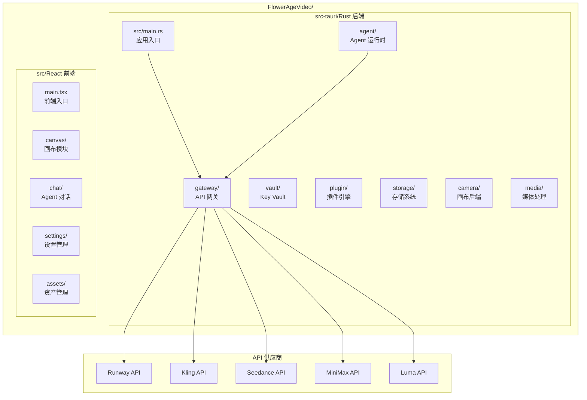

**图表来源**
- [buzhidaozenmemingmin.md:357-472](file://buzhidaozenmemingmin.md#L357-L472)

**章节来源**
- [buzhidaozenmemingmin.md:354-472](file://buzhidaozenmemingmin.md#L354-L472)

## 核心组件

### API 网关架构

API 网关是视频生成适配器的核心组件，负责统一管理所有云端供应商的 API 调用。根据设计文档，API 网关采用 Rust (axum/hyper) 实现，提供以下关键功能：

- **统一路由**：将来自各个 Agent 的请求路由到相应的供应商 API
- **速率限制**：防止 API 调用过载，确保稳定的服务质量
- **错误处理**：标准化错误响应格式，便于前端处理
- **进度监控**：通过 Server-Sent Events(SSE) 实时推送生成进度

### Key Vault 安全存储

为了确保用户数据的安全性，系统实现了本地加密的 API Key 存储机制：

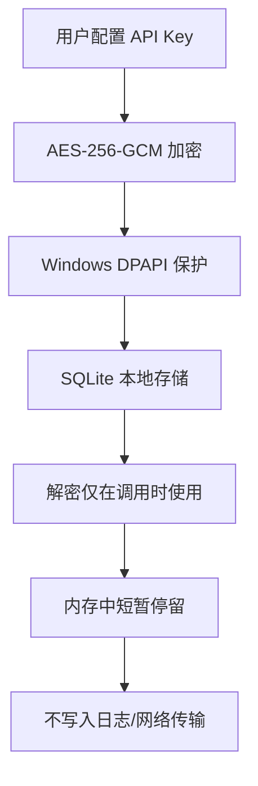

**图表来源**
- [buzhidaozenmemingmin.md:339-350](file://buzhidaozenmemingmin.md#L339-L350)

**章节来源**
- [buzhidaozenmemingmin.md:268-288](file://buzhidaozenmemingmin.md#L268-L288)
- [buzhidaozenmemingmin.md:338-350](file://buzhidaozenmemingmin.md#L338-L350)

## 架构概览

### 整体架构设计

Flower Age Video 采用了先进的主 Agent + 子 Agent 分层架构，专门针对视频生成场景进行了优化：

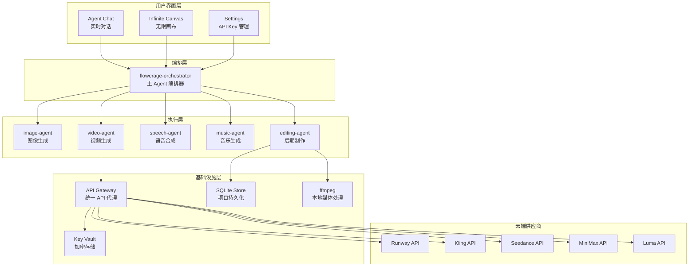

**图表来源**
- [buzhidaozenmemingmin.md:27-83](file://buzhidaozenmemingmin.md#L27-L83)

### 视频生成专用架构

针对视频生成的特殊需求，系统设计了专门的处理流程：

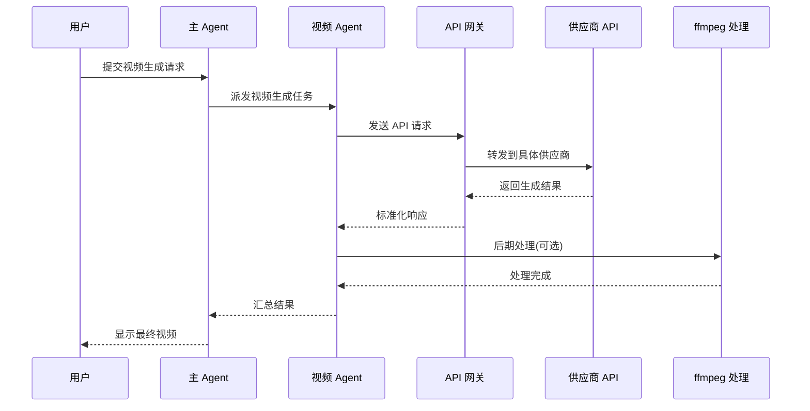

**图表来源**
- [buzhidaozenmemingmin.md:66-83](file://buzhidaozenmemingmin.md#L66-L83)

**章节来源**
- [buzhidaozenmemingmin.md:27-83](file://buzhidaozenmemingmin.md#L27-L83)

## 详细组件分析

### 支持的视频生成供应商

根据设计文档，系统支持以下主要视频生成供应商：

#### Runway 适配器

Runway 提供高质量的文本到视频生成能力，支持多种视频模型：

| 供应商 | 模型 | 用途 | 特殊功能 |
|--------|------|------|----------|
| Runway | Gen-3 | 高质量 T2V | 支持复杂场景生成 |
| Runway | Gen-4 | 最新版本 | 改进的细节控制 |

#### 可灵(Kling) 适配器

专为中国市场优化的短视频生成平台：

| 供应商 | 模型 | 用途 | 特殊功能 |
|--------|------|------|----------|
| 可灵 | Kling 2.x | 中文短视频 | 支持中文提示词 |
| 可灵 | 多模态 | 复合内容生成 | 文本+图像混合 |

#### 即梦(Seedance) 适配器

多模态视频生成专家：

| 供应商 | 模型 | 用途 | 特殊功能 |
|--------|------|------|----------|
| 即梦 | Seedance 2.0 | 多模态视频 | 支持多种输入模态 |
| 即梦 | 数字人 | 人物生成 | 专精数字人技术 |

#### MiniMax 适配器

通用视频生成解决方案：

| 供应商 | 模型 | 用途 | 特殊功能 |
|--------|------|------|----------|
| MiniMax | Video-01 | 通用视频 | 高性价比 |
| MiniMax | 多情绪 | 情感表达 | 支持情感控制 |

#### Luma 适配器

氛围视频生成专家：

| 供应商 | 模型 | 用途 | 特殊功能 |
|--------|------|------|----------|
| Luma | Dream Machine | 氛围视频 | 擅长氛围营造 |

**章节来源**
- [buzhidaozenmemingmin.md:312-321](file://buzhidaozenmemingmin.md#L312-L321)

### 统一接口设计

视频生成适配器采用统一的接口设计，确保不同供应商的 API 能够以一致的方式被调用：

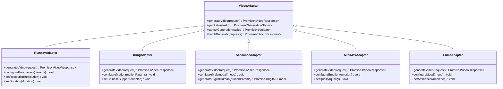

**图表来源**
- [buzhidaozenmemingmin.md:312-321](file://buzhidaozenmemingmin.md#L312-L321)

### 视频格式转换

系统集成了强大的媒体处理能力，支持多种视频格式的转换和优化：

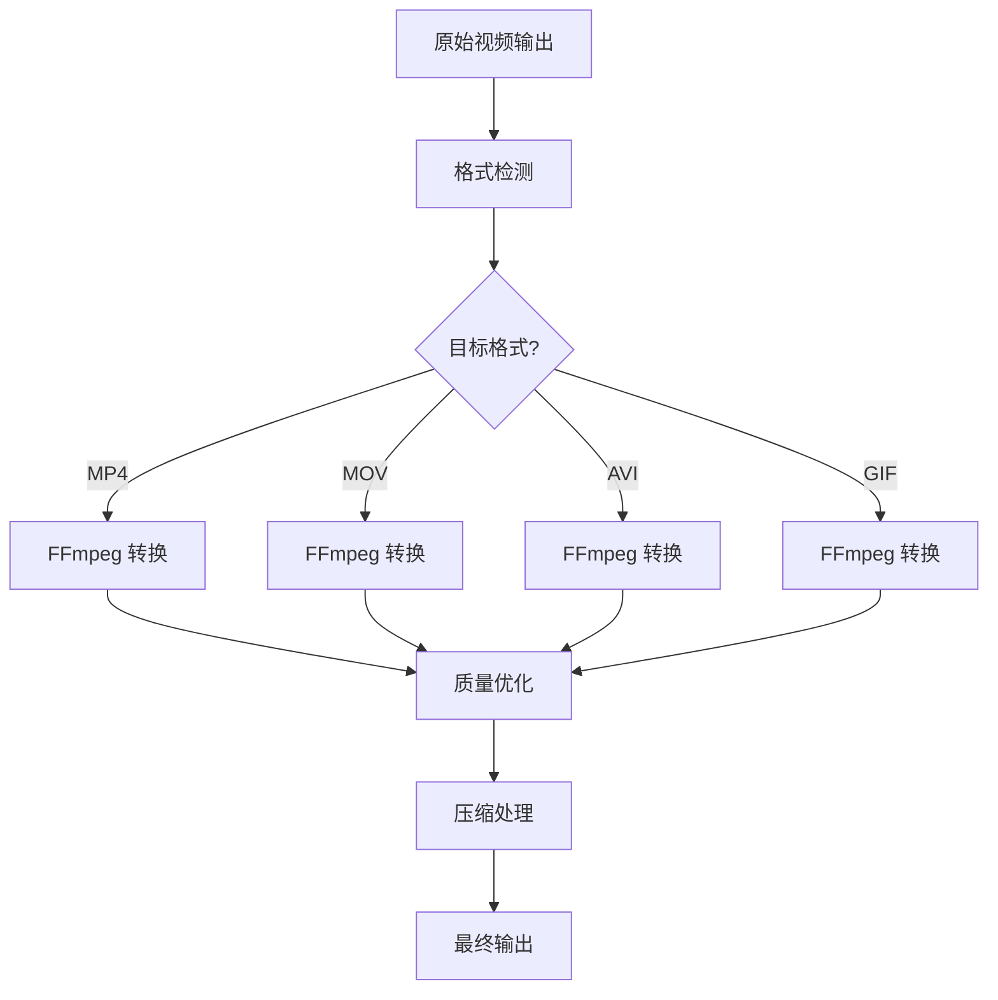

**图表来源**
- [buzhidaozenmemingmin.md:46-48](file://buzhidaozenmemingmin.md#L46-L48)

### 批量生成处理

系统支持高效的批量视频生成，通过并行处理提高整体效率：

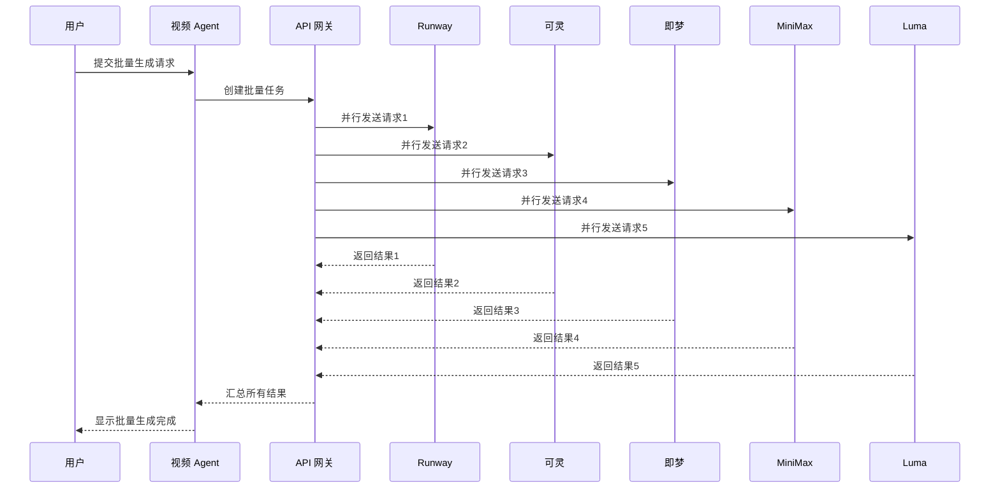

**图表来源**
- [buzhidaozenmemingmin.md:172-190](file://buzhidaozenmemingmin.md#L172-L190)

**章节来源**
- [buzhidaozenmemingmin.md:172-190](file://buzhidaozenmemingmin.md#L172-L190)

### 进度监控机制

系统实现了完善的进度监控机制，通过 Server-Sent Events(SSE) 实时推送生成状态：

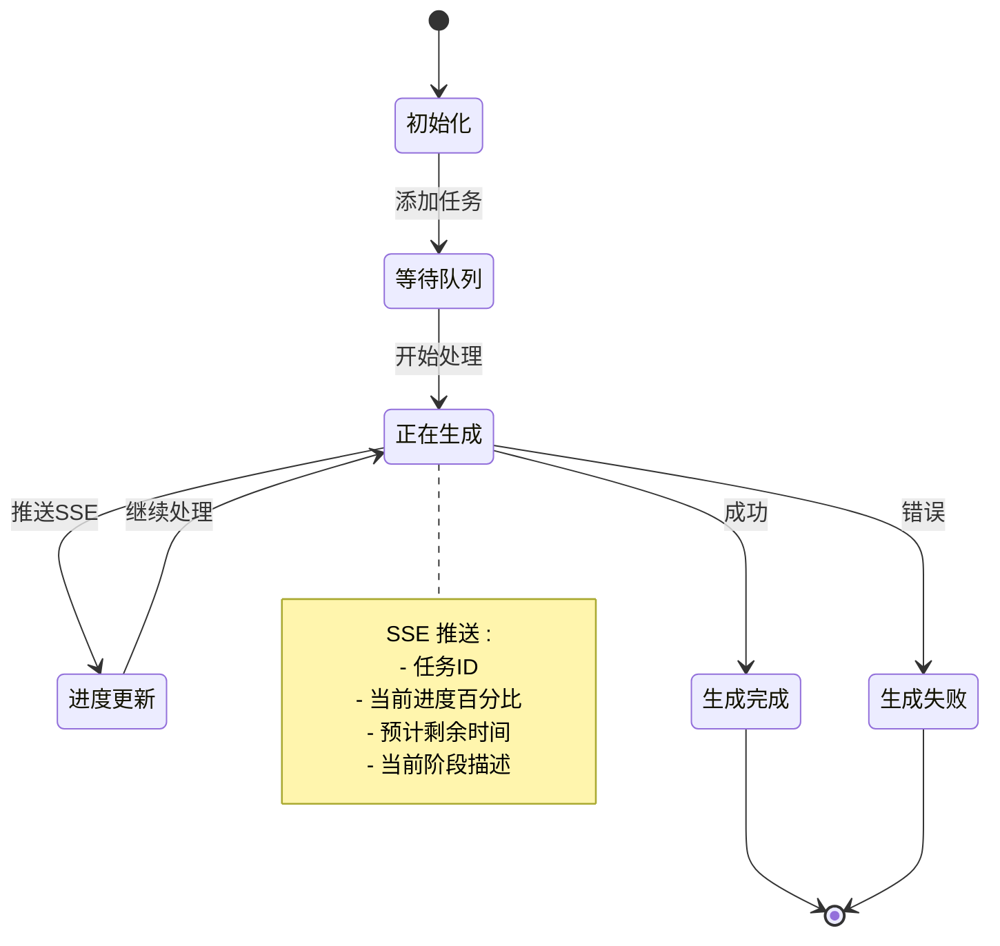

**图表来源**
- [buzhidaozenmemingmin.md:62-63](file://buzhidaozenmemingmin.md#L62-L63)

**章节来源**
- [buzhidaozenmemingmin.md:62-63](file://buzhidaozenmemingmin.md#L62-L63)

## 依赖分析

### 技术栈依赖

Flower Age Video 采用了全面的现代技术栈，确保系统的高性能和可靠性：

```mermaid
graph TB
subgraph "桌面框架"
A[Tauri 2.x<br/>轻量级桌面框架]
B[WebView2<br/>Windows 内置浏览器]
end
subgraph "前端技术"
C[React 18<br/>用户界面]
D[TypeScript 5.x<br/>类型安全]
E[Vite<br/>构建工具]
F[@xyflow/react<br/>无限画布]
end
subgraph "后端技术"
G[Rust<br/>高性能语言]
H[axum<br/>HTTP 框架]
I[tokio<br/>异步运行时]
J[reqwest<br/>HTTP 客户端]
end
subgraph "原生模块"
K[ffmpeg-sidecar<br/>媒体处理]
L[image-rs<br/>图像处理]
M[symphonia<br/>音频处理]
end
subgraph "存储系统"
N[SQLite<br/>嵌入式数据库]
O[WASM<br/>插件系统]
end
A --> C
A --> G
C --> D
C --> E
G --> H
G --> I
G --> J
K --> L
K --> M
G --> N
G --> O
```

**图表来源**
- [buzhidaozenmemingmin.md:87-134](file://buzhidaozenmemingmin.md#L87-L134)

### 供应商集成依赖

系统与各视频生成供应商的集成关系如下：

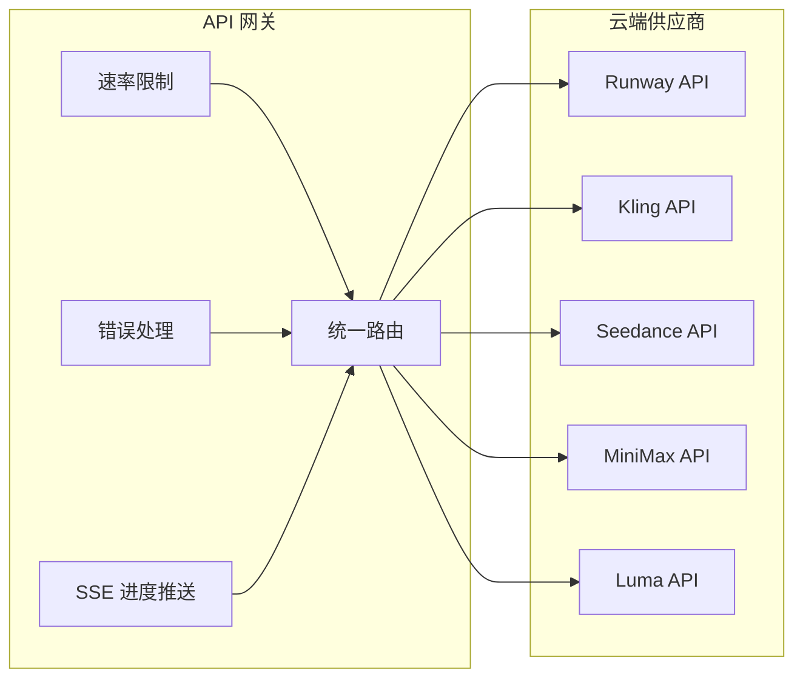

**图表来源**
- [buzhidaozenmemingmin.md:268-288](file://buzhidaozenmemingmin.md#L268-L288)

**章节来源**
- [buzhidaozenmemingmin.md:87-134](file://buzhidaozenmemingmin.md#L87-L134)
- [buzhidaozenmemingmin.md:268-288](file://buzhidaozenmemingmin.md#L268-L288)

## 性能考虑

### 并行处理优化

系统通过并行处理机制显著提升了视频生成的效率：

- **多 Agent 并行**：主 Agent 可以同时派发多个子 Agent 执行任务
- **批量生成**：支持一次提交多个生成请求，充分利用 API 限额
- **异步处理**：使用 Rust 的异步运行时确保高并发下的稳定性

### 资源管理

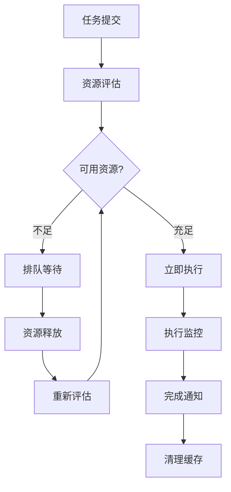

### 缓存策略

系统实现了多层次的缓存策略来提升性能：

- **API Key 缓存**：短期内存缓存减少重复解密开销
- **模型参数缓存**：常用参数预加载
- **中间结果缓存**：避免重复计算

## 故障排除指南

### 常见问题诊断

| 问题类型 | 症状 | 可能原因 | 解决方案 |
|----------|------|----------|----------|
| API Key 错误 | 401/403 错误 | Key 无效或过期 | 检查 Key 格式和有效期 |
| 供应商不可达 | 连接超时 | 网络问题或供应商维护 | 检查网络连接和供应商状态 |
| 生成失败 | 任务卡住 | 资源不足或参数错误 | 检查资源配额和参数设置 |
| 格式转换失败 | 输出文件损坏 | ffmpeg 问题 | 重新下载 ffmpeg 或检查权限 |

### 错误处理机制

系统实现了完善的错误处理和降级机制：

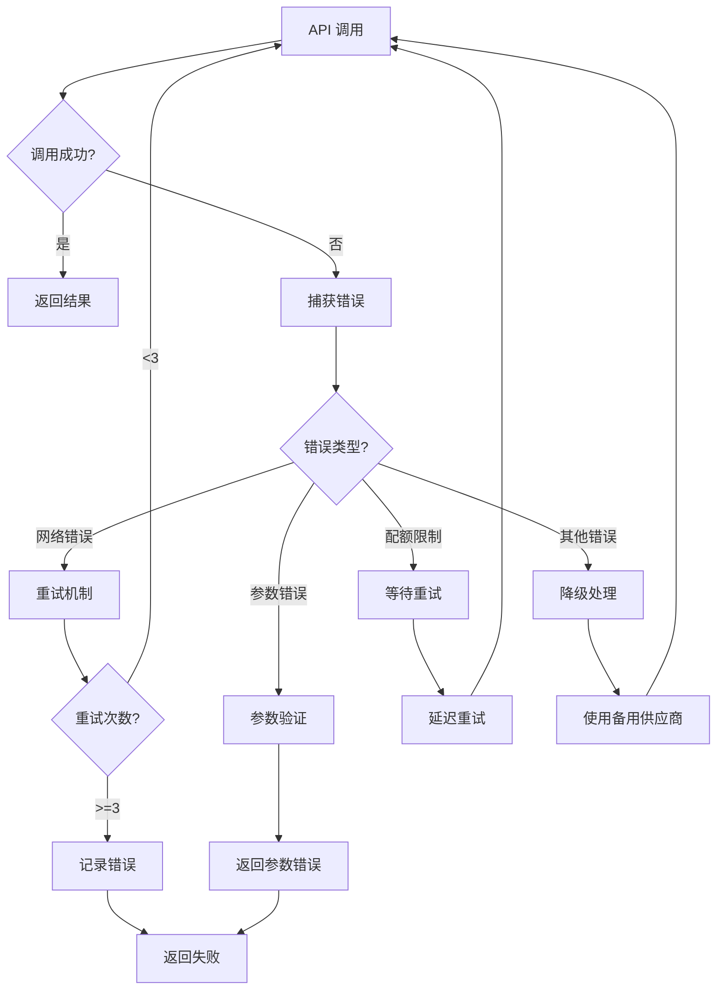

**章节来源**
- [buzhidaozenmemingmin.md:338-350](file://buzhidaozenmemingmin.md#L338-L350)

## 结论

Flower Age Video 的视频生成适配器系统代表了现代 AI 创意工具的发展方向。通过精心设计的架构和统一的接口，系统成功地整合了多个云端视频生成供应商，为用户提供了强大而灵活的视频创作能力。

该系统的主要优势包括：

- **统一接口**：通过适配器模式实现了供应商无关的 API 设计
- **本地化部署**：用户完全掌控自己的 API Key，确保数据隐私
- **高性能架构**：基于 Rust 的异步设计确保了优秀的性能表现
- **丰富的功能**：支持多种视频生成模式和格式转换
- **完善的监控**：实时进度跟踪和错误处理机制

随着 AI 视频生成技术的不断发展，Flower Age Video 为未来的扩展和优化奠定了坚实的基础。

## 附录

### 开发最佳实践

#### 新供应商接入流程

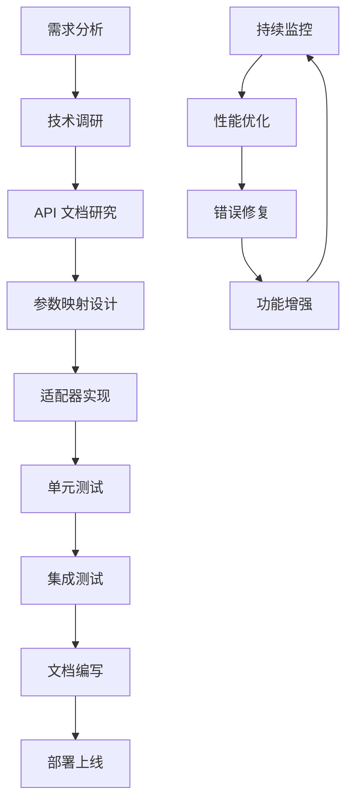

#### 参数配置指南

| 参数类别 | 关键参数 | 建议值 | 说明 |
|----------|----------|--------|------|
| 时长控制 | duration | 3-60秒 | 根据内容复杂度调整 |
| 分辨率设置 | width/height | 512x512-1024x1024 | 平衡质量和性能 |
| 运动控制 | motion_strength | 0.1-1.0 | 控制视频运动幅度 |
| 质量参数 | quality | 1-10 | 数字人生成专用 |
| 批量大小 | batch_size | 1-5 | 避免 API 限流 |

#### 质量优化建议

1. **提示词优化**：提供清晰、具体的描述性文本
2. **参数调优**：根据内容类型调整相关参数
3. **格式选择**：根据用途选择合适的输出格式
4. **后处理**：利用 ffmpeg 进行必要的质量增强