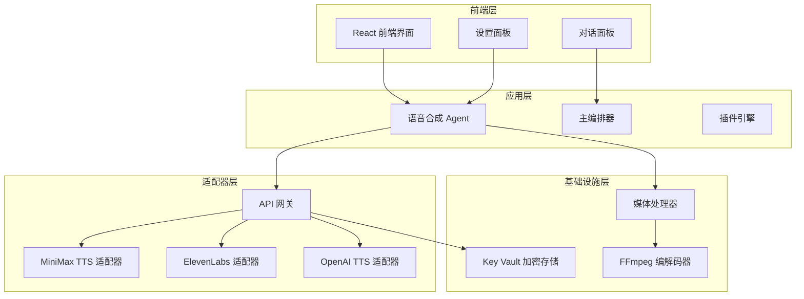
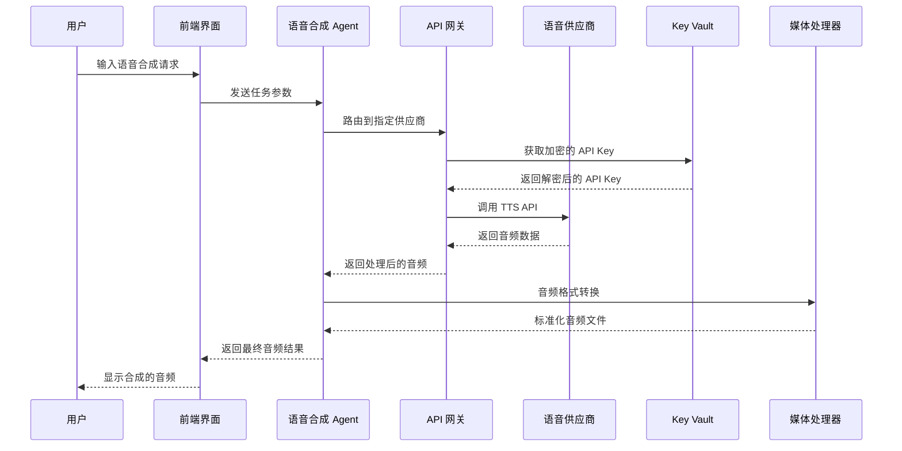
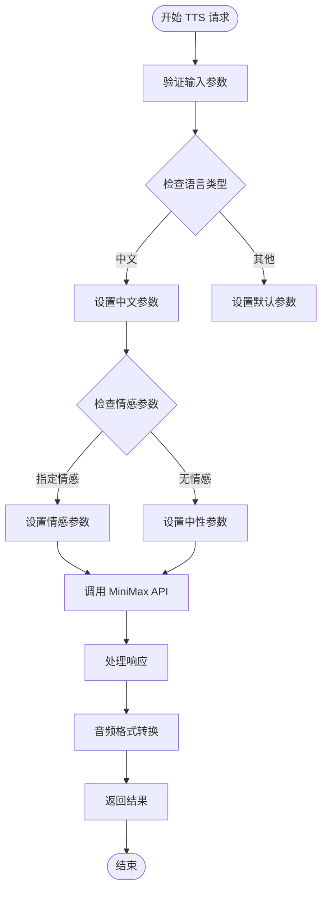
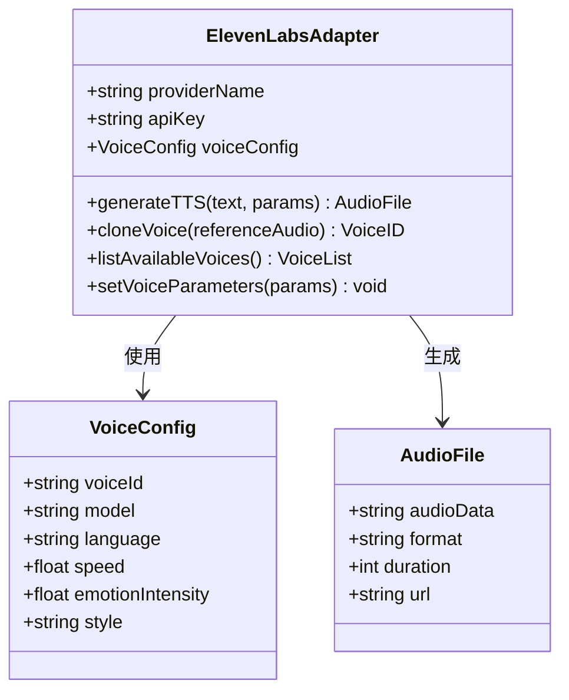
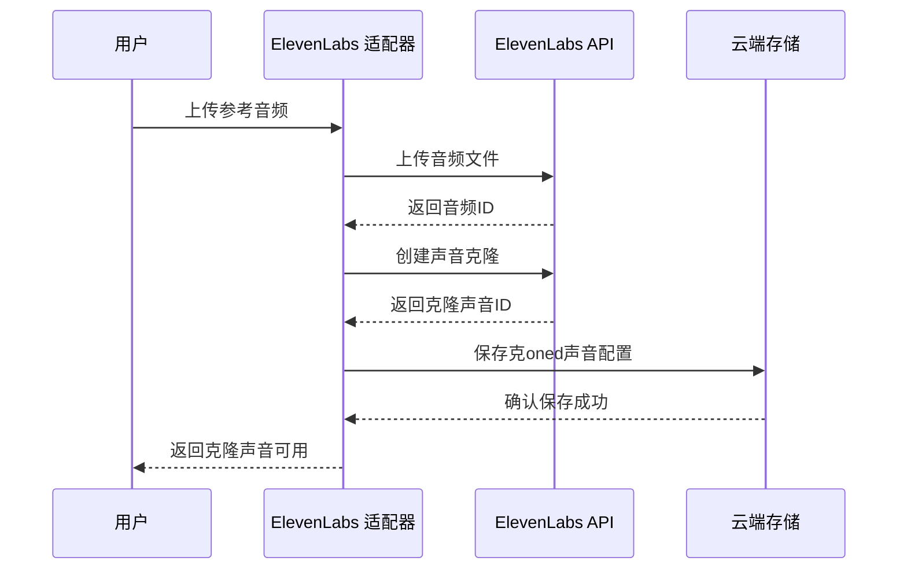
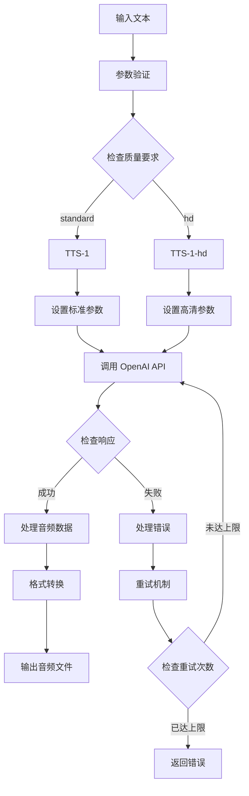
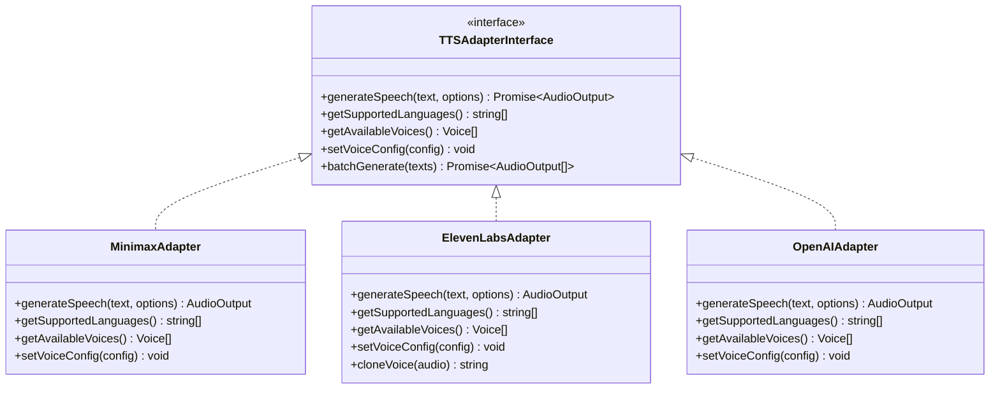
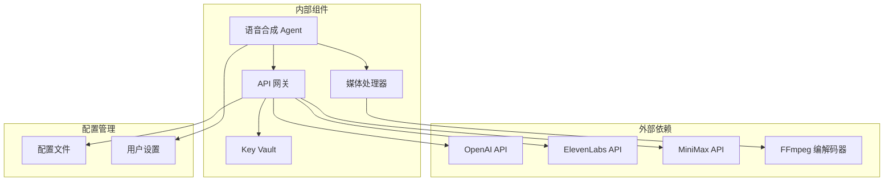
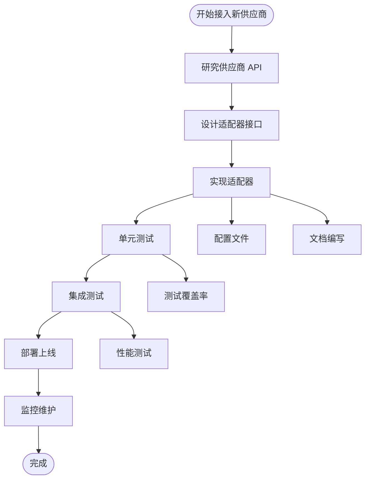

# 语音合成适配器

<cite>
**本文档引用的文件**
- [buzhidaozenmemingmin.md](file://buzhidaozenmemingmin.md)
</cite>

## 目录
1. [简介](#简介)
2. [项目结构](#项目结构)
3. [核心组件](#核心组件)
4. [架构概览](#架构概览)
5. [详细组件分析](#详细组件分析)
6. [依赖关系分析](#依赖关系分析)
7. [性能考虑](#性能考虑)
8. [故障排除指南](#故障排除指南)
9. [结论](#结论)
10. [附录](#附录)

## 简介
Flower Age Video 是一款 AI 驱动的无限画布创意工作站，专注于为视频创作者提供完整的 AI 创作解决方案。语音合成（TTS）作为其核心功能之一，通过统一的适配器系统支持多家云端 AI 供应商，包括 MiniMax、ElevenLabs 和 OpenAI。

该项目采用独特的"主 Agent + 子 Agent"分层架构，其中 speech-agent 专门负责语音合成任务，能够处理多语种、多情感、多角色对话以及声音克隆等高级功能。

## 项目结构
基于项目文档，Flower Age Video 的语音合成系统采用模块化设计，主要包含以下关键组件：

**图表来源**
- [buzhidaozenmemingmin.md: 354-472:354-472](file://buzhidaozenmemingmin.md#L354-L472)

**章节来源**
- [buzhidaozenmemingmin.md: 354-472:354-472](file://buzhidaozenmemingmin.md#L354-L472)

## 核心组件
语音合成系统的核心组件包括：

### 1. 语音合成 Agent
- **角色**：语音专家
- **核心能力**：TTS / 声音克隆 / 多角色对话 / 情绪控制
- **步数预算**：200 步
- **工具集**：5 个 MCP 工具

### 2. API 网关
- **端口**：localhost:7942
- **功能**：统一路由到各 AI 供应商 API
- **安全**：用户自有 API Key 直连，不经过第三方服务器

### 3. Key Vault 加密存储
- **加密算法**：AES-256-GCM
- **密钥保护**：Windows DPAPI
- **存储介质**：SQLite 本地数据库

**章节来源**
- [buzhidaozenmemingmin.md: 168-169:168-169](file://buzhidaozenmemingmin.md#L168-L169)
- [buzhidaozenmemingmin.md: 266-288:266-288](file://buzhidaozenmemingmin.md#L266-L288)
- [buzhidaozenmemingmin.md: 338-350:338-350](file://buzhidaozenmemingmin.md#L338-L350)

## 架构概览
语音合成系统的整体架构采用分层设计，确保了高度的模块化和可扩展性：

**图表来源**
- [buzhidaozenmemingmin.md: 66-83:66-83](file://buzhidaozenmemingmin.md#L66-L83)
- [buzhidaozenmemingmin.md: 266-288:266-288](file://buzhidaozenmemingmin.md#L266-L288)

## 详细组件分析

### MiniMax TTS 适配器
MiniMax 作为中文多情绪 TTS 的首选供应商，提供了强大的中文语音合成能力。

#### 支持特性
- **模型**：speech-2.8-hd
- **语言支持**：中文为主，支持多方言
- **情感控制**：多情绪表达（快乐、悲伤、愤怒、平静等）
- **声音质量**：高清音频输出

#### API 端点设计

**图表来源**
- [buzhidaozenmemingmin.md: 326](file://buzhidaozenmemingmin.md#L326)

#### 参数配置指南
- **文本输入**：支持纯文本和带标点的中文文本
- **情感参数**：可选值包括自然、温和、激昂、悲伤等
- **速度控制**：0.5-2.0 倍速调节
- **音高调节**：±10% 音高偏移

**章节来源**
- [buzhidaozenmemingmin.md: 326](file://buzhidaozenmemingmin.md#L326)

### ElevenLabs 适配器
ElevenLabs 提供了业界领先的多语种 TTS 和声音克隆功能。

#### 支持特性
- **模型**：Multilingual v2
- **语言支持**：支持 29 种语言
- **声音克隆**：高质量语音克隆
- **自定义声音**：支持声音训练和微调

#### API 端点设计

**图表来源**
- [buzhidaozenmemingmin.md: 327](file://buzhidaozenmemingmin.md#L327)

#### 声音克隆工作流程

**图表来源**
- [buzhidaozenmemingmin.md: 327](file://buzhidaozenmemingmin.md#L327)

**章节来源**
- [buzhidaozenmemingmin.md: 327](file://buzhidaozenmemingmin.md#L327)

### OpenAI TTS 适配器
OpenAI 的 TTS-1 和 TTS-1-hd 模型提供了通用的高质量语音合成服务。

#### 支持特性
- **模型**：TTS-1 / TTS-1-hd
- **语言支持**：英语为主，支持多种变体
- **音频格式**：mp3, flac, wav, opus
- **质量等级**：standard / hd

#### API 端点设计

**图表来源**
- [buzhidaozenmemingmin.md: 328](file://buzhidaozenmemingmin.md#L328)

**章节来源**
- [buzhidaozenmemingmin.md: 328](file://buzhidaozenmemingmin.md#L328)

### 统一接口设计
所有 TTS 适配器都遵循统一的接口规范，确保了系统的可扩展性和一致性。

#### 适配器接口规范

**图表来源**
- [buzhidaozenmemingmin.md: 326-328:326-328](file://buzhidaozenmemingmin.md#L326-L328)

#### 音频格式转换机制
系统支持多种音频格式的自动转换，确保输出的一致性：

| 输入格式 | 处理流程 | 输出格式 | 质量控制 |
|---------|---------|---------|---------|
| mp3 | 解码 → 标准化 | wav | 44.1kHz/16bit |
| flac | 解码 → 标准化 | wav | 48kHz/24bit |
| opus | 解码 → 标准化 | wav | 48kHz/24bit |
| m4a | 解码 → 标准化 | wav | 48kHz/24bit |

**章节来源**
- [buzhidaozenmemingmin.md: 326-328:326-328](file://buzhidaozenmemingmin.md#L326-L328)

## 依赖关系分析
语音合成系统的依赖关系体现了清晰的分层架构：

**图表来源**
- [buzhidaozenmemingmin.md: 266-288:266-288](file://buzhidaozenmemingmin.md#L266-L288)
- [buzhidaozenmemingmin.md: 370-377:370-377](file://buzhidaozenmemingmin.md#L370-L377)

**章节来源**
- [buzhidaozenmemingmin.md: 266-288:266-288](file://buzhidaozenmemingmin.md#L266-L288)
- [buzhidaozenmemingmin.md: 370-377:370-377](file://buzhidaozenmemingmin.md#L370-L377)

## 性能考虑
语音合成系统的性能优化主要体现在以下几个方面：

### 1. 并行处理
- **多供应商并行**：支持同时调用多个 TTS 供应商
- **批量处理**：支持批量文本的并发合成
- **缓存机制**：重复文本的音频缓存

### 2. 资源管理
- **内存优化**：音频数据的流式处理
- **网络优化**：连接池管理和超时控制
- **存储优化**：压缩算法和增量存储

### 3. 质量控制
- **实时监控**：音频质量的实时评估
- **降级策略**：网络异常时的备用方案
- **错误恢复**：自动重试和故障转移

## 故障排除指南

### 常见问题及解决方案

#### 1. API Key 相关问题
- **问题**：API Key 无效或过期
- **解决方案**：检查 Key Vault 中的加密存储，重新配置 API Key

#### 2. 网络连接问题
- **问题**：无法连接到 TTS 供应商
- **解决方案**：检查网络连接，配置代理设置，验证防火墙规则

#### 3. 音频格式问题
- **问题**：输出音频格式不符合预期
- **解决方案**：检查媒体处理器配置，验证 FFmpeg 安装

#### 4. 性能问题
- **问题**：语音合成响应缓慢
- **解决方案**：启用缓存机制，调整并发数量，优化网络配置

**章节来源**
- [buzhidaozenmemingmin.md: 338-350:338-350](file://buzhidaozenmemingmin.md#L338-L350)

## 结论
Flower Age Video 的语音合成适配器系统展现了现代 AI 应用的优秀设计实践。通过统一的接口设计、模块化的架构和严格的安全保障，该系统为视频创作者提供了强大而灵活的语音合成能力。

系统的主要优势包括：
- **多供应商支持**：灵活选择最适合的 TTS 服务
- **统一接口**：简化了多供应商的集成复杂度
- **安全可靠**：用户自有 API Key，隐私保护优先
- **高性能**：并行处理和缓存机制确保流畅体验
- **易于扩展**：插件化设计支持新供应商快速接入

随着 AI 技术的不断发展，该语音合成系统将继续演进，为用户提供更加丰富和高质量的语音合成服务。

## 附录

### 新供应商接入流程

### 最佳实践建议
1. **参数优化**：根据应用场景调整情感强度和语速
2. **缓存策略**：合理设置缓存时间和容量
3. **错误处理**：实现完善的错误捕获和恢复机制
4. **性能监控**：建立实时性能指标监控
5. **安全配置**：定期更新 API Key 和加密配置