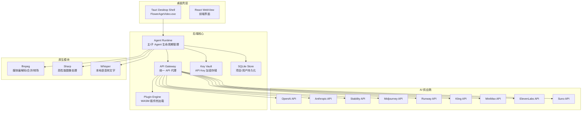
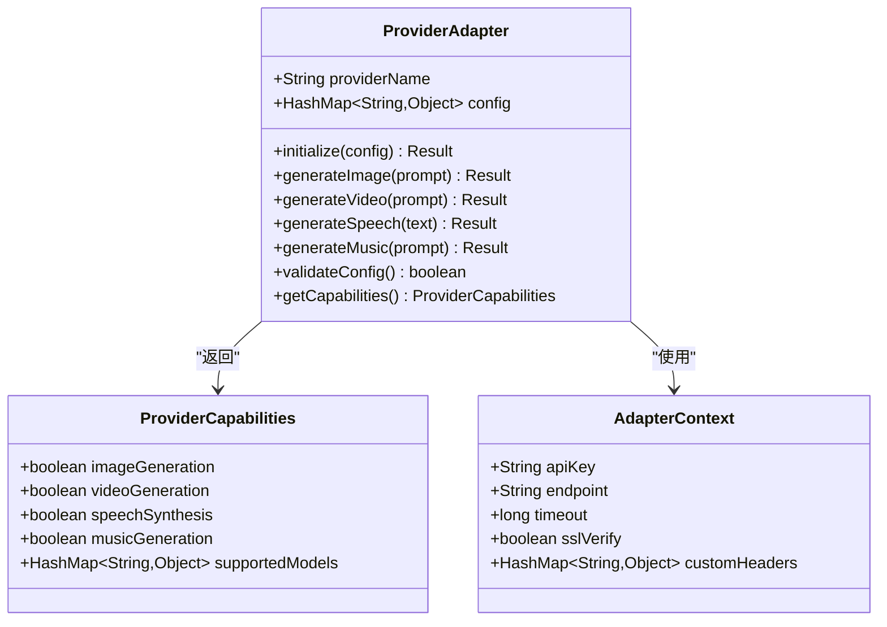
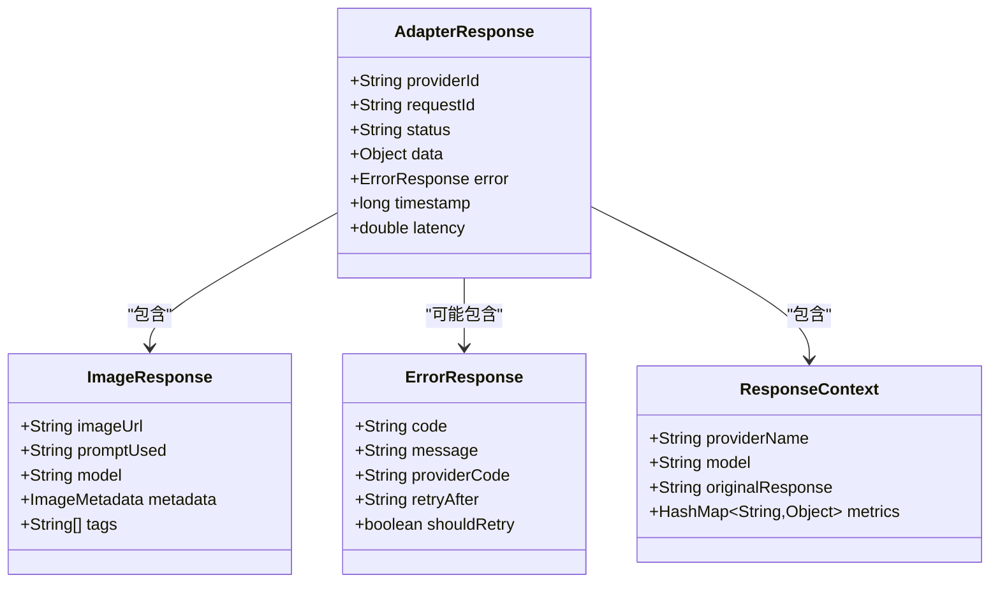
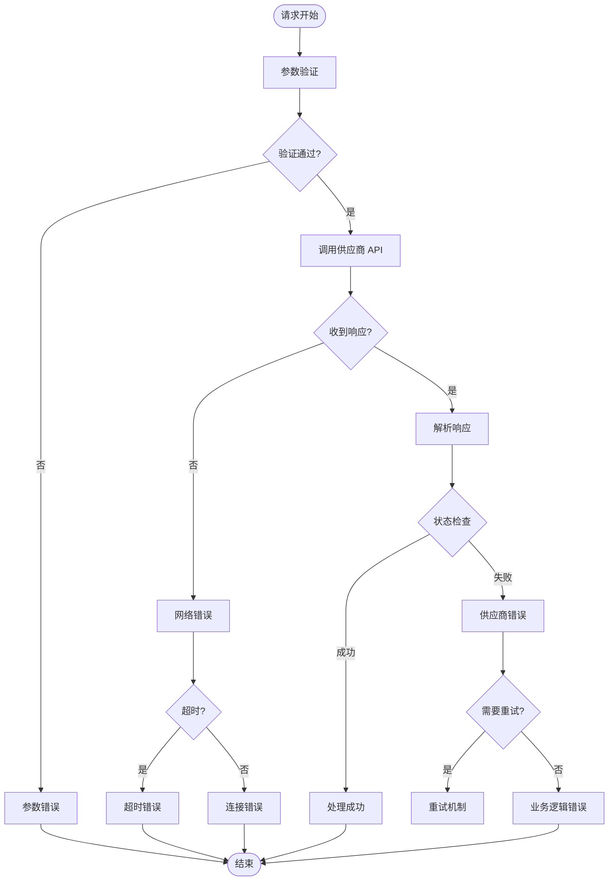
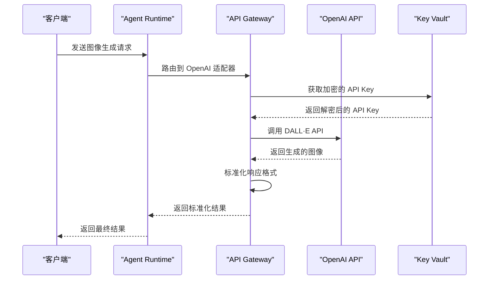
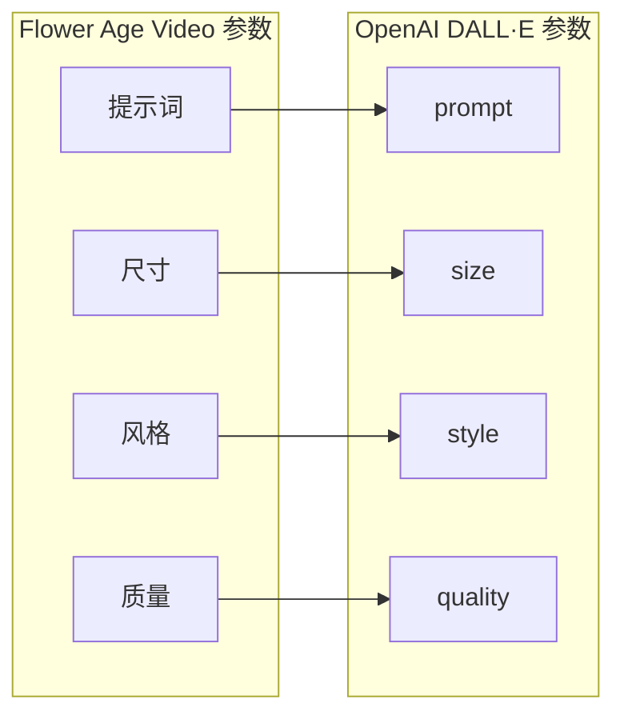
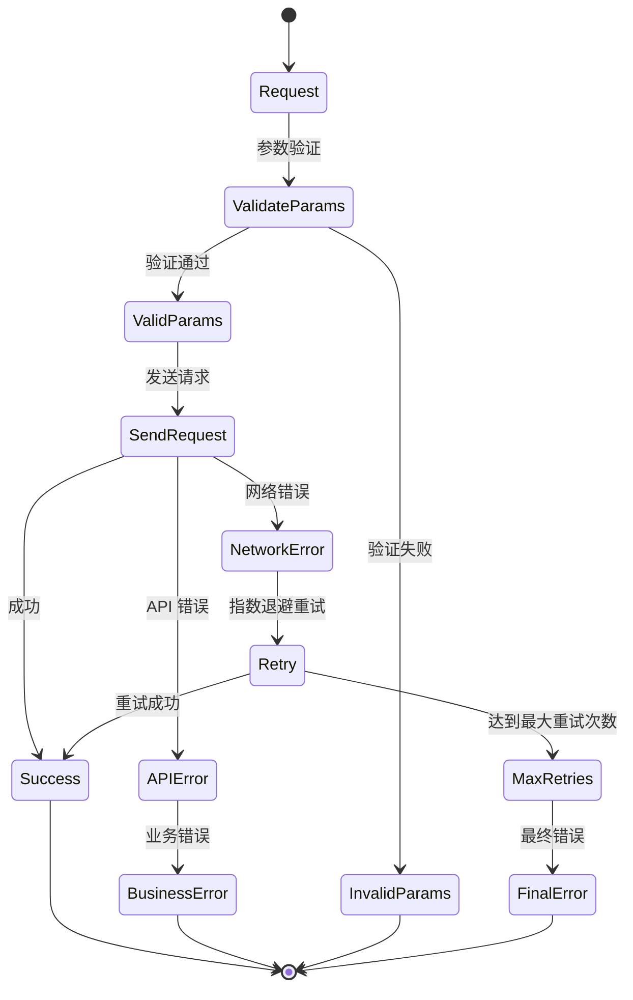

# 适配器开发指南

<cite>
**本文档引用的文件**
- [buzhidaozenmemingmin.md](file://buzhidaozenmemingmin.md)
</cite>

## 目录
1. [简介](#简介)
2. [项目架构概览](#项目架构概览)
3. [适配器开发标准化流程](#适配器开发标准化流程)
4. [接口设计原则](#接口设计原则)
5. [参数映射规则](#参数映射规则)
6. [响应格式转换](#响应格式转换)
7. [错误处理策略](#错误处理策略)
8. [适配器模板](#适配器模板)
9. [代码示例](#代码示例)
10. [最佳实践建议](#最佳实践建议)
11. [新增供应商流程](#新增供应商流程)
12. [API 端点测试方法](#api-端点测试方法)
13. [性能优化技巧](#性能优化技巧)
14. [兼容性验证流程](#兼容性验证流程)
15. [调试工具使用指南](#调试工具使用指南)
16. [单元测试编写方法](#单元测试编写方法)
17. [集成测试策略](#集成测试策略)
18. [部署和维护生命周期](#部署和维护生命周期)
19. [故障排除指南](#故障排除指南)
20. [结论](#结论)

## 简介

Flower Age Video 是一款基于 AI 驱动的无限画布创意工作站，采用主 Agent 编排 + 子 Agent 执行的架构模式。本指南专注于 AI 供应商适配器的开发，涵盖从接口设计到部署维护的完整生命周期管理。

## 项目架构概览

Flower Age Video 采用分层架构设计，核心组件包括：



**图表来源**
- [buzhidaozenmemingmin.md:27-83](file://buzhidaozenmemingmin.md#L27-L83)

## 适配器开发标准化流程

### 1. 需求分析阶段
- **供应商能力评估**：分析目标 AI 供应商的 API 特性、限制和优势
- **功能需求梳理**：明确适配器需要支持的功能范围
- **技术可行性分析**：评估与现有架构的兼容性

### 2. 设计阶段
- **接口抽象设计**：定义统一的适配器接口规范
- **数据模型设计**：建立标准化的数据结构映射
- **错误处理机制**：设计统一的错误处理策略

### 3. 实现阶段
- **核心适配器开发**：实现基础适配器功能
- **参数映射实现**：完成输入输出参数的映射逻辑
- **响应格式转换**：实现标准化响应格式转换

### 4. 测试阶段
- **单元测试**：验证适配器核心功能
- **集成测试**：测试与整体系统的集成
- **性能测试**：评估适配器性能表现

### 5. 部署阶段
- **配置管理**：设置适配器配置参数
- **监控部署**：部署监控和日志系统
- **文档完善**：更新相关技术文档

## 接口设计原则

### 1. 统一接口规范
所有适配器必须遵循统一的接口设计原则：



**图表来源**
- [buzhidaozenmemingmin.md:268-288](file://buzhidaozenmemingmin.md#L268-L288)

### 2. 参数标准化
- **输入参数**：统一参数命名规范，确保跨供应商一致性
- **输出参数**：标准化响应格式，便于上层系统处理
- **配置参数**：提供灵活的配置选项，支持不同供应商特性

### 3. 错误处理一致性
- **异常分类**：区分网络错误、认证错误、业务逻辑错误
- **错误码规范**：定义统一的错误码体系
- **错误信息格式**：提供标准化的错误信息格式

## 参数映射规则

### 1. 图像生成参数映射

| 参数类型 | Flower Age Video | OpenAI DALL·E | Stability AI | Midjourney |
|----------|------------------|--------------|--------------|------------|
| 提示词 | String | prompt | prompt | prompt |
| 尺寸 | String | size | width/height | aspect ratio |
| 数量 | Integer | n | count | steps |
| 风格 | String | style | style_preset | style descriptor |
| 质量 | String | quality | None | quality |
| 创意系数 | Float | None | None | None |

### 2. 视频生成参数映射

| 参数类型 | Flower Age Video | Runway | Kling | Seedance |
|----------|------------------|--------|-------|----------|
| 提示词 | String | prompt | prompt | prompt |
| 时长 | Integer | duration | duration | duration |
| 分辨率 | String | None | resolution | aspect_ratio |
| 运动控制 | Boolean | motion_control | motion_control | motion_control |
| 数字人 | Boolean | digital_human | digital_human | digital_human |

### 3. 语音合成参数映射

| 参数类型 | Flower Age Video | MiniMax TTS | ElevenLabs | OpenAI TTS |
|----------|------------------|-------------|------------|------------|
| 文本 | String | text | text | input |
| 语言 | String | language | language | None |
| 速度 | Float | speed | speed | None |
| 音色 | String | voice_type | voice | None |
| 情绪 | String | emotion | None | None |

### 4. 音乐生成参数映射

| 参数类型 | Flower Age Video | Suno | Udio | MiniMax Music |
|----------|------------------|------|------|---------------|
| 提示词 | String | prompt | prompt | prompt |
| 风格 | String | genre | style | genre |
| 时长 | Integer | duration | duration | duration |
| 人声 | Boolean | has_vocal | has_vocal | has_instrumental |
| BGM | Boolean | has_instrumental | has_instrumental | has_vocal |

## 响应格式转换

### 1. 标准化响应结构



**图表来源**
- [buzhidaozenmemingmin.md:268-288](file://buzhidaozenmemingmin.md#L268-L288)

### 2. 数据转换策略
- **统一字段映射**：将不同供应商的响应转换为统一格式
- **元数据提取**：提取关键信息用于后续处理
- **错误信息标准化**：将供应商特定的错误信息转换为标准格式

### 3. 资源链接管理
- **URL 标准化**：统一资源访问链接格式
- **缓存策略**：实现智能缓存机制
- **过期处理**：管理临时链接的有效期

## 错误处理策略

### 1. 错误分类体系



**图表来源**
- [buzhidaozenmemingmin.md:268-288](file://buzhidaozenmemingmin.md#L268-L288)

### 2. 重试机制
- **指数退避算法**：实现指数级延迟重试
- **最大重试次数**：设置合理的重试上限
- **错误类型区分**：针对不同错误类型采用不同的重试策略

### 3. 降级策略
- **备用供应商**：当主要供应商不可用时切换到备用供应商
- **功能降级**：在资源受限时提供简化功能
- **缓存回退**：使用缓存数据作为临时解决方案

## 适配器模板

### 1. 基础适配器模板

```rust
// 适配器基础结构模板
pub struct ProviderAdapter {
    pub provider_name: String,
    pub config: HashMap<String, Value>,
    pub client: HttpClient,
    pub rate_limiter: RateLimiter,
}

impl ProviderAdapter {
    pub fn new(config: HashMap<String, Value>) -> Self {
        Self {
            provider_name: String::new(),
            config,
            client: HttpClient::new(),
            rate_limiter: RateLimiter::new(),
        }
    }
    
    pub async fn initialize(&mut self) -> Result<(), Error> {
        // 初始化适配器
        Ok(())
    }
    
    pub async fn validate_config(&self) -> Result<bool, Error> {
        // 验证配置有效性
        Ok(true)
    }
}
```

### 2. 图像生成适配器模板

```rust
// 图像生成适配器模板
impl ImageProvider for ProviderAdapter {
    async fn generate_image(
        &self,
        request: ImageGenerateRequest,
    ) -> Result<ImageGenerateResponse, Error> {
        // 参数映射
        let mapped_request = self.map_image_request(&request)?;
        
        // 速率限制
        self.rate_limiter.acquire().await?;
        
        // 发送请求
        let response = self.send_request(mapped_request).await?;
        
        // 响应转换
        let result = self.convert_image_response(response)?;
        
        Ok(result)
    }
    
    fn map_image_request(&self, request: &ImageGenerateRequest) -> Result<ProviderRequest, Error> {
        // 参数映射逻辑
        Ok(ProviderRequest::default())
    }
    
    fn convert_image_response(&self, response: ProviderResponse) -> Result<ImageGenerateResponse, Error> {
        // 响应转换逻辑
        Ok(ImageGenerateResponse::default())
    }
}
```

### 3. 视频生成适配器模板

```rust
// 视频生成适配器模板
impl VideoProvider for ProviderAdapter {
    async fn generate_video(
        &self,
        request: VideoGenerateRequest,
    ) -> Result<VideoGenerateResponse, Error> {
        // 处理视频生成请求
        Ok(VideoGenerateResponse::default())
    }
    
    async fn poll_generation_status(
        &self,
        job_id: &str,
    ) -> Result<GenerationStatus, Error> {
        // 轮询生成状态
        Ok(GenerationStatus::default())
    }
}
```

## 代码示例

### 1. OpenAI 适配器实现示例

基于文档中的架构设计，以下是 OpenAI 适配器的实现要点：



**图表来源**
- [buzhidaozenmemingmin.md:270-288](file://buzhidaozenmemingmin.md#L270-L288)

### 2. 参数映射示例



**图表来源**
- [buzhidaozenmemingmin.md:302-337](file://buzhidaozenmemingmin.md#L302-L337)

### 3. 错误处理示例



**图表来源**
- [buzhidaozenmemingmin.md:268-288](file://buzhidaozenmemingmin.md#L268-L288)

## 最佳实践建议

### 1. 性能优化最佳实践

#### 1.1 并发控制
- **连接池管理**：合理配置 HTTP 连接池大小
- **并发限制**：设置适配器级别的并发请求限制
- **队列管理**：实现请求队列，避免过度并发

#### 1.2 缓存策略
- **响应缓存**：对重复请求进行缓存
- **配置缓存**：缓存供应商配置信息
- **元数据缓存**：缓存常用元数据信息

#### 1.3 资源管理
- **内存管理**：及时释放不再使用的资源
- **文件处理**：优化大文件的处理流程
- **网络资源**：合理管理网络连接

### 2. 安全最佳实践

#### 2.1 API Key 安全
- **加密存储**：使用 AES-256-GCM 加密存储
- **最小权限**：遵循最小权限原则
- **定期轮换**：支持 API Key 定期轮换

#### 2.2 数据传输安全
- **HTTPS 强制**：所有 API 调用必须使用 HTTPS
- **证书验证**：启用 SSL 证书验证
- **数据脱敏**：敏感信息在日志中脱敏显示

### 3. 可靠性最佳实践

#### 3.1 健康检查
- **定期健康检查**：监控适配器运行状态
- **告警机制**：设置合理的告警阈值
- **自动恢复**：实现自动故障恢复机制

#### 3.2 监控指标
- **性能指标**：跟踪响应时间、成功率等
- **资源指标**：监控 CPU、内存、磁盘使用情况
- **业务指标**：跟踪生成数量、费用等

## 新增供应商流程

### 1. 供应商评估
- **技术评估**：分析供应商 API 的技术特点
- **成本评估**：评估使用成本和定价策略
- **稳定性评估**：评估服务可用性和 SLA

### 2. 需求分析
- **功能需求**：确定需要支持的功能范围
- **性能需求**：评估性能要求和限制
- **集成需求**：分析与现有系统的集成难度

### 3. 设计实现
- **接口设计**：设计适配器接口规范
- **参数映射**：制定参数映射规则
- **错误处理**：设计错误处理策略

### 4. 开发测试
- **核心功能开发**：实现基本适配器功能
- **单元测试**：编写单元测试用例
- **集成测试**：进行系统集成测试

### 5. 部署上线
- **配置部署**：部署适配器配置
- **监控部署**：部署监控和日志系统
- **文档更新**：更新相关技术文档

## API 端点测试方法

### 1. 单元测试
- **参数验证测试**：测试各种参数组合的正确性
- **边界条件测试**：测试边界值和异常输入
- **性能测试**：测试适配器的性能表现

### 2. 集成测试
- **端到端测试**：测试完整的请求处理流程
- **并发测试**：测试高并发场景下的稳定性
- **故障注入测试**：模拟各种故障场景

### 3. 回归测试
- **版本升级测试**：测试新版本的兼容性
- **配置变更测试**：测试配置变更的影响
- **依赖更新测试**：测试外部依赖更新的影响

### 4. 性能基准测试
- **响应时间测试**：测量平均响应时间和 P95
- **吞吐量测试**：测试最大吞吐量
- **资源消耗测试**：测量 CPU、内存、网络使用情况

## 性能优化技巧

### 1. 网络优化
- **连接复用**：使用 HTTP/2 和连接池
- **压缩传输**：启用 Gzip 或 Brotli 压缩
- **CDN 使用**：利用 CDN 加速静态资源

### 2. 缓存优化
- **多级缓存**：实现应用层、网络层、存储层缓存
- **智能过期**：根据数据特征设置合适的过期策略
- **预加载机制**：预测用户行为进行预加载

### 3. 计算优化
- **异步处理**：使用异步编程提高并发性能
- **批量处理**：合并多个小请求为批量请求
- **计算卸载**：将计算密集型任务卸载到专用服务

### 4. 存储优化
- **索引优化**：为常用查询字段建立索引
- **分区策略**：按时间或业务维度进行数据分区
- **压缩存储**：对静态数据进行压缩存储

## 兼容性验证流程

### 1. 向后兼容性
- **API 兼容性**：确保新版本不影响旧版本功能
- **数据格式兼容**：保持数据存储格式稳定
- **配置兼容性**：支持旧配置文件的平滑迁移

### 2. 前向兼容性
- **新功能支持**：提前支持未来可能出现的新特性
- **扩展性设计**：为未来扩展预留接口
- **渐进式升级**：支持渐进式的功能升级

### 3. 跨平台兼容性
- **操作系统兼容**：支持 Windows、macOS、Linux
- **硬件兼容**：支持不同硬件配置
- **网络环境兼容**：适应不同的网络环境

### 4. 第三方兼容性
- **SDK 兼容**：兼容主流开发语言的 SDK
- **工具链兼容**：与常见开发工具链兼容
- **标准兼容**：遵循行业标准和规范

## 调试工具使用指南

### 1. 日志调试
- **日志级别**：合理设置日志级别，平衡信息量和性能
- **结构化日志**：使用结构化日志格式便于分析
- **关键路径日志**：为重点业务路径添加详细日志

### 2. 性能分析工具
- **APM 工具**：使用应用性能监控工具分析性能瓶颈
- **内存分析**：使用内存分析工具检测内存泄漏
- **网络分析**：使用网络分析工具优化网络请求

### 3. 业务监控
- **关键指标**：监控关键业务指标的变化趋势
- **异常告警**：设置合理的异常告警阈值
- **用户体验监控**：监控用户体验相关指标

### 4. 故障排查
- **快速定位**：使用日志和监控快速定位问题
- **根因分析**：深入分析问题的根本原因
- **修复验证**：验证修复效果并防止问题复发

## 单元测试编写方法

### 1. 测试用例设计
- **功能测试**：测试适配器的核心功能
- **边界测试**：测试边界条件和异常输入
- **集成测试**：测试与其他组件的集成

### 2. Mock 对象使用
- **HTTP Mock**：使用 Mock 模拟 HTTP 请求
- **数据库 Mock**：使用内存数据库进行测试
- **外部服务 Mock**：模拟外部服务的行为

### 3. 测试数据管理
- **测试数据隔离**：确保测试数据相互独立
- **测试数据清理**：及时清理测试产生的数据
- **测试数据生成**：自动化生成测试数据

### 4. 测试覆盖率
- **代码覆盖率**：确保关键代码都有测试覆盖
- **分支覆盖率**：确保所有分支都被测试到
- **集成覆盖率**：确保关键集成点都有测试

## 集成测试策略

### 1. 环境准备
- **测试环境**：搭建与生产环境相似的测试环境
- **数据准备**：准备测试所需的数据和配置
- **依赖服务**：确保所有依赖的服务都可用

### 2. 测试场景设计
- **正常流程测试**：测试正常的业务流程
- **异常流程测试**：测试各种异常情况的处理
- **压力测试**：测试高负载下的系统表现

### 3. 自动化测试
- **持续集成**：将测试集成到 CI/CD 流程中
- **回归测试**：每次代码变更都运行回归测试
- **性能测试**：定期运行性能基准测试

### 4. 测试报告
- **测试结果分析**：分析测试结果并生成报告
- **问题跟踪**：跟踪发现的问题并验证修复
- **测试改进**：根据测试结果改进测试策略

## 部署和维护生命周期

### 1. 部署前准备
- **环境检查**：检查部署环境的准备情况
- **配置验证**：验证所有配置参数的正确性
- **依赖检查**：确认所有依赖项都已安装

### 2. 部署实施
- **灰度发布**：采用灰度发布策略降低风险
- **监控部署**：部署监控和告警系统
- **文档更新**：更新部署和运维文档

### 3. 运行维护
- **日常监控**：监控系统运行状态和性能指标
- **问题处理**：及时处理出现的各种问题
- **容量规划**：根据使用情况规划系统容量

### 4. 版本管理
- **版本控制**：严格控制版本发布流程
- **回滚机制**：确保能够快速回滚到稳定版本
- **升级策略**：制定合理的系统升级策略

### 5. 终止退役
- **数据迁移**：安全地迁移或备份重要数据
- **资源清理**：清理不再使用的系统资源
- **知识转移**：整理和转移相关的知识和经验

## 故障排除指南

### 1. 常见问题诊断
- **连接问题**：检查网络连接和防火墙设置
- **认证问题**：验证 API Key 和权限配置
- **性能问题**：分析系统资源使用情况
- **配置问题**：检查配置文件的正确性

### 2. 诊断工具
- **日志分析**：通过日志分析问题原因
- **网络诊断**：使用网络工具诊断网络问题
- **性能分析**：使用性能分析工具定位瓶颈
- **依赖检查**：检查外部依赖的状态

### 3. 问题解决
- **紧急处理**：快速处理影响业务的紧急问题
- **根因分析**：深入分析问题的根本原因
- **预防措施**：制定预防类似问题再次发生的措施
- **经验总结**：总结问题处理经验并分享

### 4. 持续改进
- **流程优化**：优化故障处理流程
- **工具改进**：改进故障诊断和处理工具
- **知识库建设**：建立和完善故障处理知识库
- **团队培训**：加强团队的故障处理能力

## 结论

Flower Age Video 的 AI 供应商适配器开发是一个复杂而重要的任务。通过遵循本文档提供的标准化流程、设计原则和最佳实践，可以确保适配器的质量、性能和可靠性。

关键要点包括：
- **标准化接口设计**：确保所有适配器遵循统一的接口规范
- **严格的参数映射**：实现准确的参数转换和映射
- **完善的错误处理**：建立健壮的错误处理和重试机制
- **全面的测试策略**：从单元测试到集成测试的全方位保障
- **持续的性能优化**：不断优化适配器的性能表现
- **完整的生命周期管理**：从开发到维护的全流程管理

通过严格执行这些指导原则和最佳实践，可以为 Flower Age Video 项目构建高质量、可维护的 AI 供应商适配器生态系统，为用户提供稳定可靠的 AI 创作体验。