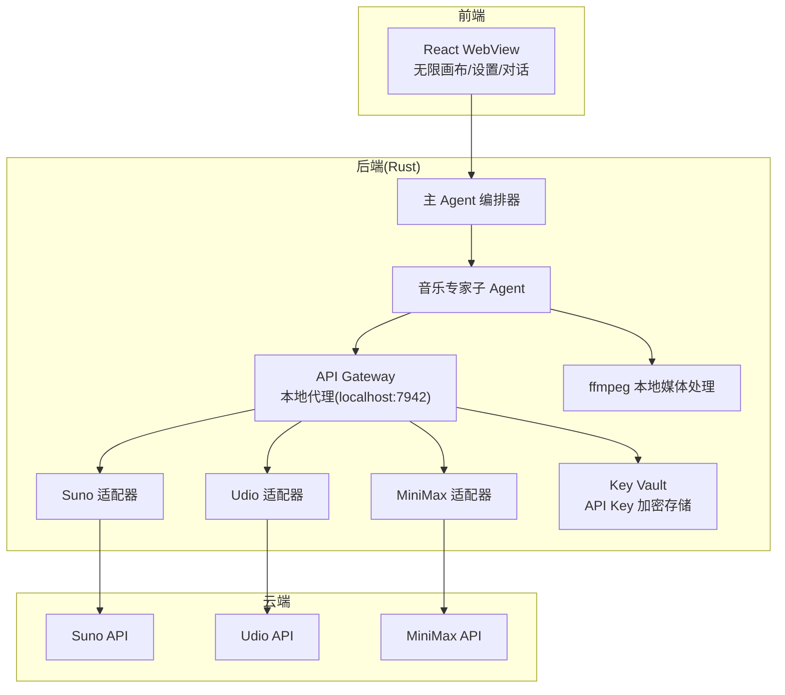
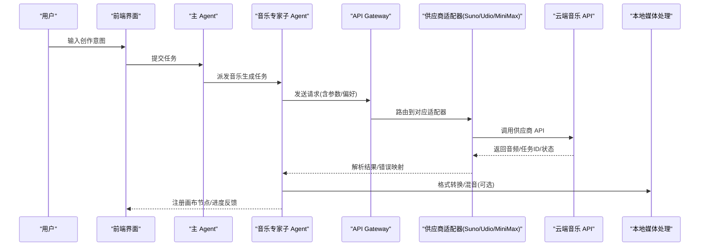
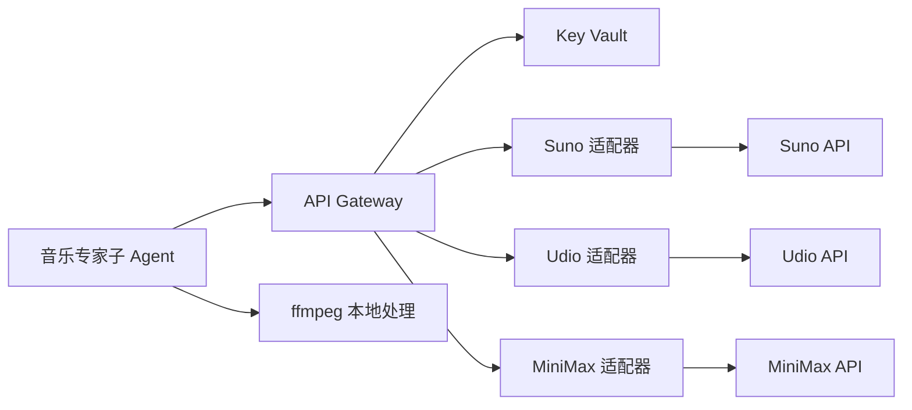

# 音乐生成适配器

<cite>
**本文引用的文件**
- [buzhidaozenmemingmin.md](file://buzhidaozenmemingmin.md)
</cite>

## 目录
1. [简介](#简介)
2. [项目结构](#项目结构)
3. [核心组件](#核心组件)
4. [架构总览](#架构总览)
5. [详细组件分析](#详细组件分析)
6. [依赖分析](#依赖分析)
7. [性能考虑](#性能考虑)
8. [故障排查指南](#故障排查指南)
9. [结论](#结论)
10. [附录](#附录)

## 简介
本文件面向 Flower Age Video 的音乐生成适配器系统，聚焦于支持的音乐生成供应商（Suno、Udio、MiniMax）的适配器设计与实现要点。文档基于现有设计文档中的描述，系统阐述统一接口设计、音频格式转换、批量生成处理、质量评估机制，并提供调用示例、参数配置指南与风格定制建议。同时给出新供应商接入流程与适配器开发最佳实践，帮助开发者快速理解与扩展音乐生成能力。

## 项目结构
Flower Age Video 采用“主 Agent 编排 + 子 Agent 执行”的多 Agent 协作模式，音乐生成由独立的音乐专家子 Agent 负责，经 API Gateway 路由至各云端供应商。项目结构中明确包含音乐生成子 Agent 的 SP 模板与资源目录，以及 API Gateway 的供应商路由层。

图表来源
- [buzhidaozenmemingmin.md: 66–83:66-83](file://buzhidaozenmemingmin.md#L66-L83)
- [buzhidaozenmemingmin.md: 266–288:266-288](file://buzhidaozenmemingmin.md#L266-L288)
- [buzhidaozenmemingmin.md: 330–337:330-337](file://buzhidaozenmemingmin.md#L330-L337)

章节来源
- [buzhidaozenmemingmin.md: 66–83:66-83](file://buzhidaozenmemingmin.md#L66-L83)
- [buzhidaozenmemingmin.md: 266–288:266-288](file://buzhidaozenmemingmin.md#L266-L288)
- [buzhidaozenmemingmin.md: 330–337:330-337](file://buzhidaozenmemingmin.md#L330-L337)

## 核心组件
- 音乐专家子 Agent：负责音乐生成任务的意图解析、参数构造、调用 API Gateway、结果回传与画布注册。
- API Gateway：统一路由到各供应商 API，负责请求转发、速率限制与错误处理。
- 供应商适配器：针对 Suno、Udio、MiniMax 的具体实现，封装请求参数、响应解析与错误映射。
- Key Vault：本地加密存储用户 API Key，确保隐私与安全。
- 媒体处理：本地 ffmpeg 用于音频格式转换、混音与导出。

章节来源
- [buzhidaozenmemingmin.md: 161–171:161-171](file://buzhidaozenmemingmin.md#L161-L171)
- [buzhidaozenmemingmin.md: 266–288:266-288](file://buzhidaozenmemingmin.md#L266-L288)
- [buzhidaozenmemingmin.md: 330–337:330-337](file://buzhidaozenmemingmin.md#L330-L337)

## 架构总览
音乐生成在 Flower Age Video 中的端到端链路如下：
- 用户在前端输入创作意图（如风格、歌词、时长、情绪），由主 Agent 拆解为音乐生成任务。
- 音乐专家子 Agent 根据任务类型与偏好参数，构造请求并调用 API Gateway。
- API Gateway 将请求路由到对应供应商适配器，适配器完成参数签名、请求发送与响应解析。
- 适配器将结果写入本地存储或直接返回，音乐专家子 Agent 将生成物注册到画布节点，供后续编辑与导出使用。

图表来源
- [buzhidaozenmemingmin.md: 66–83:66-83](file://buzhidaozenmemingmin.md#L66-L83)
- [buzhidaozenmemingmin.md: 266–288:266-288](file://buzhidaozenmemingmin.md#L266-L288)

## 详细组件分析

### Suno 适配器
- 适用场景：带人声歌曲生成，适合流行、摇滚、电子等多种风格。
- 关键能力：
  - 歌词创作与风格控制：通过提示词与风格标签控制生成风格与情绪。
  - 人声歌曲生成：支持指定人声风格、节奏与情感倾向。
  - 批量生成：支持一次提交多首歌曲，提高产出效率。
  - 质量评估：结合歌词质量、风格一致性与人声自然度进行评估。
- 参数要点（示意）：
  - 歌词/主题：用于驱动旋律与歌词内容。
  - 风格标签：如流行、爵士、摇滚、电子、民谣等。
  - 情绪标签：如欢快、忧郁、激昂、宁静等。
  - 时长/节拍：控制歌曲长度与节奏感。
  - 人声风格：如男声/女声、音域范围、音色特征。
- 调用示例（路径指引）：
  - 请求构造与参数映射：[音乐专家子 Agent SP](file://buzhidaozenmemingmin.md#L400)
  - API Gateway 路由与适配器入口：[API Gateway 设计:266-288](file://buzhidaozenmemingmin.md#L266-L288)
  - Key Vault 加密存储与解密流程：[Key Vault 设计:338-350](file://buzhidaozenmemingmin.md#L338-L350)

章节来源
- [buzhidaozenmemingmin.md: 330–337:330-337](file://buzhidaozenmemingmin.md#L330-L337)
- [buzhidaozenmemingmin.md: 266–288:266-288](file://buzhidaozenmemingmin.md#L266-L288)
- [buzhidaozenmemingmin.md: 338–350:338-350](file://buzhidaozenmemingmin.md#L338-L350)

### Udio 适配器
- 适用场景：高品质背景音乐（BGM），适合视频配乐、氛围营造。
- 关键能力：
  - 风格控制：支持电影配乐、游戏 BGM、轻音乐、氛围音乐等。
  - 器乐伴奏：支持钢琴、弦乐、打击乐等乐器组合。
  - 批量生成：支持多轨/多风格并发生成。
  - 质量评估：关注和声稳定性、动态范围与空间感。
- 参数要点（示意）：
  - 风格分类：电影、游戏、轻音乐、氛围、爵士等。
  - 情绪维度：舒缓、紧张、神秘、希望等。
  - 乐器组合：钢琴、弦乐、鼓组、合成器等。
  - 时长/循环：是否循环、循环点设置。
- 调用示例（路径指引）：
  - 请求参数与风格映射：[音乐专家子 Agent SP](file://buzhidaozenmemingmin.md#L400)
  - 供应商路由与错误处理：[API Gateway 设计:266-288](file://buzhidaozenmemingmin.md#L266-L288)

章节来源
- [buzhidaozenmemingmin.md: 330–337:330-337](file://buzhidaozenmemingmin.md#L330-L337)
- [buzhidaozenmemingmin.md: 266–288:266-288](file://buzhidaozenmemingmin.md#L266-L288)

### MiniMax 适配器
- 适用场景：器乐/翻唱，适合需要稳定输出与可控风格的任务。
- 关键能力：
  - 器乐风格：古典、爵士、流行、电子、民族等。
  - 翻唱能力：支持指定歌手风格与音色。
  - 批量生成：支持多风格/多歌手并发生成。
  - 质量评估：关注音准、节拍稳定性与混响自然度。
- 参数要点（示意）：
  - 风格标签：古典、爵士、流行、电子、民族等。
  - 歌手风格：指定歌手风格或音色模板。
  - 时长/节拍：控制节奏与长度。
  - 是否翻唱：启用/禁用翻唱模式。
- 调用示例（路径指引）：
  - 请求参数与风格映射：[音乐专家子 Agent SP](file://buzhidaozenmemingmin.md#L400)
  - 供应商路由与错误处理：[API Gateway 设计:266-288](file://buzhidaozenmemingmin.md#L266-L288)

章节来源
- [buzhidaozenmemingmin.md: 330–337:330-337](file://buzhidaozenmemingmin.md#L330-L337)
- [buzhidaozenmemingmin.md: 266–288:266-288](file://buzhidaozenmemingmin.md#L266-L288)

### 统一接口设计
- 接口抽象：音乐专家子 Agent 以统一的输入输出规范对接适配器，屏蔽供应商差异。
- 参数标准化：将歌词、风格、情绪、时长、乐器等参数映射到各供应商的字段。
- 错误处理：统一错误码与消息，便于前端展示与重试策略。
- 进度与状态：通过 SSE 或轮询方式向前端推送生成进度与最终结果。

章节来源
- [buzhidaozenmemingmin.md: 161–171:161-171](file://buzhidaozenmemingmin.md#L161-L171)
- [buzhidaozenmemingmin.md: 266–288:266-288](file://buzhidaozenmemingmin.md#L266-L288)

### 音频格式转换
- 本地处理：使用 ffmpeg-sidecar 在本地完成音频格式转换、采样率调整与混音。
- 输出规范：统一输出为常见格式（如 MP3/WAV），便于后续编辑与导出。
- 性能优化：按需裁剪、降噪与动态范围压缩，提升下游处理效率。

章节来源
- [buzhidaozenmemingmin.md: 126–134:126-134](file://buzhidaozenmemingmin.md#L126-L134)
- [buzhidaozenmemingmin.md: 529–545:529-545](file://buzhidaozenmemingmin.md#L529-L545)

### 批量生成处理
- 并行调度：音乐专家子 Agent 可并行派发多个任务，充分利用供应商吞吐能力。
- 速率限制：API Gateway 实施速率限制与退避策略，避免触发供应商限流。
- 结果聚合：统一收集各任务结果，进行质量初筛与排序，再注册到画布。

章节来源
- [buzhidaozenmemingmin.md: 66–83:66-83](file://buzhidaozenmemingmin.md#L66-L83)
- [buzhidaozenmemingmin.md: 266–288:266-288](file://buzhidaozenmemingmin.md#L266-L288)

### 质量评估机制
- 评估维度：歌词质量、风格一致性、人声/器乐自然度、动态范围与空间感。
- 自动化评估：结合文本相似度、音频特征与风格标签匹配度进行打分。
- 人工复核：在前端提供预览与评分入口，支持二次调整与重生成。

章节来源
- [buzhidaozenmemingmin.md: 161–171:161-171](file://buzhidaozenmemingmin.md#L161-L171)

## 依赖分析
- 供应商依赖：Suno、Udio、MiniMax 的 API 端点与认证方式。
- 本地依赖：Key Vault（加密存储）、API Gateway（统一路由）、ffmpeg（媒体处理）。
- 前端依赖：React + @xyflow/react（无限画布）、Zustand（状态管理）、SSE（进度推送）。

图表来源
- [buzhidaozenmemingmin.md: 266–288:266-288](file://buzhidaozenmemingmin.md#L266-L288)
- [buzhidaozenmemingmin.md: 330–337:330-337](file://buzhidaozenmemingmin.md#L330-L337)

章节来源
- [buzhidaozenmemingmin.md: 266–288:266-288](file://buzhidaozenmemingmin.md#L266-L288)
- [buzhidaozenmemingmin.md: 330–337:330-337](file://buzhidaozenmemingmin.md#L330-L337)

## 性能考虑
- 并行与队列：合理设置并行度，避免超卖与限流；对长任务采用队列与优先级调度。
- 缓存与重用：对常用风格与模板进行缓存，减少重复请求。
- 本地加速：优先使用本地 ffmpeg 进行格式转换与混音，降低网络往返。
- 超时与重试：为供应商 API 设置合理的超时与指数退避重试策略。

## 故障排查指南
- 认证失败：检查 Key Vault 中的 API Key 是否正确、是否过期。
- 限流与熔断：观察 API Gateway 的速率限制日志，适当降低并发或增加重试间隔。
- 响应异常：记录供应商返回的状态码与错误信息，映射到统一错误码。
- 媒体处理失败：确认 ffmpeg 二进制可用、路径正确，必要时重新下载。

章节来源
- [buzhidaozenmemingmin.md: 338–350:338-350](file://buzhidaozenmemingmin.md#L338-L350)
- [buzhidaozenmemingmin.md: 266–288:266-288](file://buzhidaozenmemingmin.md#L266-L288)

## 结论
Flower Age Video 的音乐生成适配器系统通过统一接口与本地安全存储，实现了对 Suno、Udio、MiniMax 等多家供应商的无缝集成。借助多 Agent 协作与本地媒体处理能力，系统在保证隐私与性能的同时，提供了高质量的音乐生成体验。未来可继续扩展更多供应商与风格模板，持续优化批量生成与质量评估机制。

## 附录

### 调用示例与参数配置指南
- 示例路径（仅提供路径，不展示具体代码）：
  - [音乐专家子 Agent SP](file://buzhidaozenmemingmin.md#L400)
  - [API Gateway 路由与适配器入口:266-288](file://buzhidaozenmemingmin.md#L266-L288)
  - [Key Vault 加密存储与解密流程:338-350](file://buzhidaozenmemingmin.md#L338-L350)

### 风格定制建议
- 风格标签：优先使用供应商提供的官方风格标签，确保生成效果稳定。
- 情绪维度：结合视频内容选择合适的情绪标签，提升情感契合度。
- 乐器组合：对于器乐 BGM，建议先确定主乐器与伴奏层次，再细化细节。

### 新供应商接入流程
- 供应商调研：确认 API 端点、认证方式、参数字段与限流策略。
- 适配器开发：在 API Gateway 下新增适配器模块，实现请求封装与响应解析。
- 参数映射：建立统一参数到供应商字段的映射表，支持风格、情绪与时长等。
- 测试与验证：在 Key Vault 中配置测试 Key，进行端到端测试与质量评估。
- 文档与发布：完善 SP 与调用示例，纳入版本发布流程。