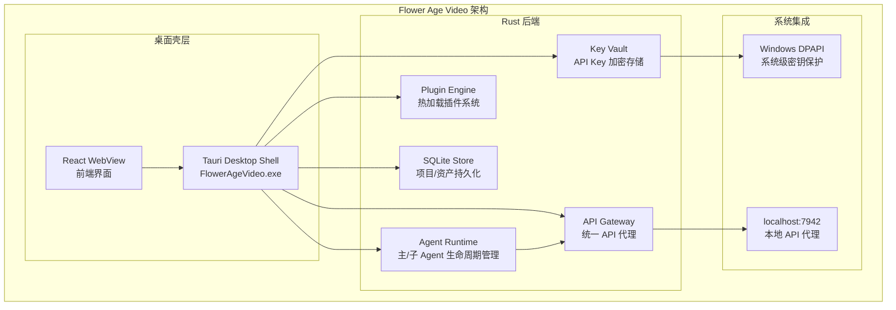
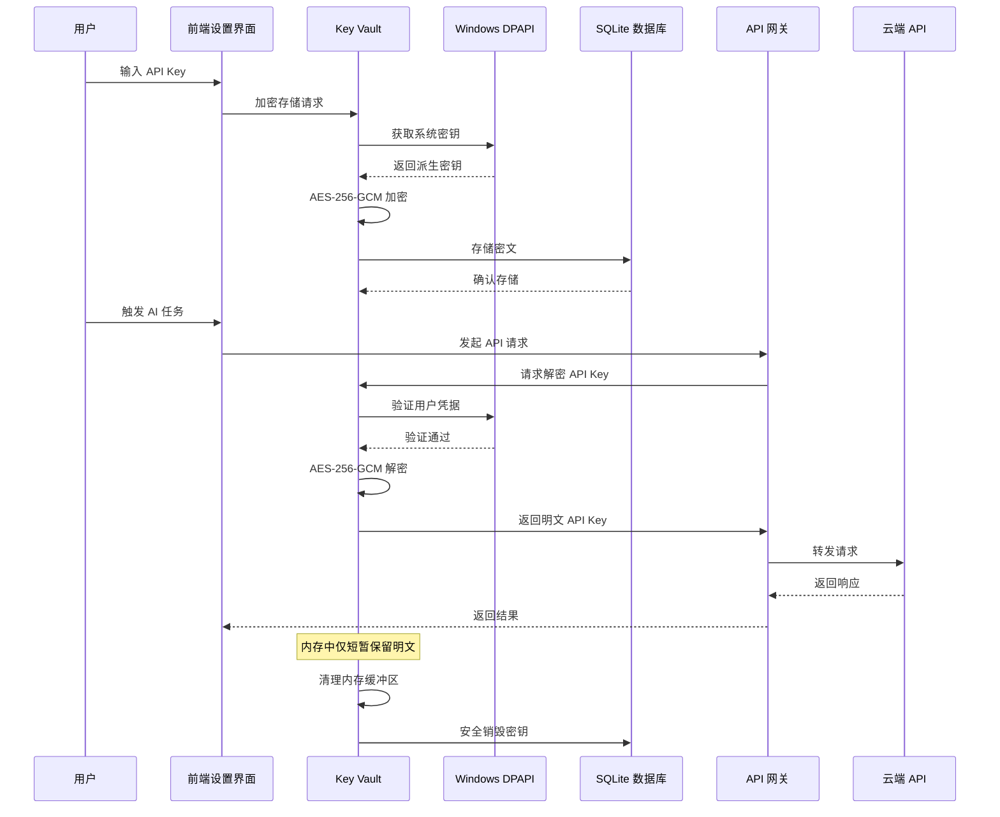
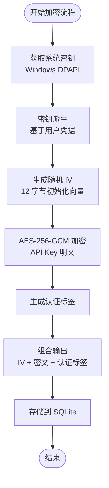
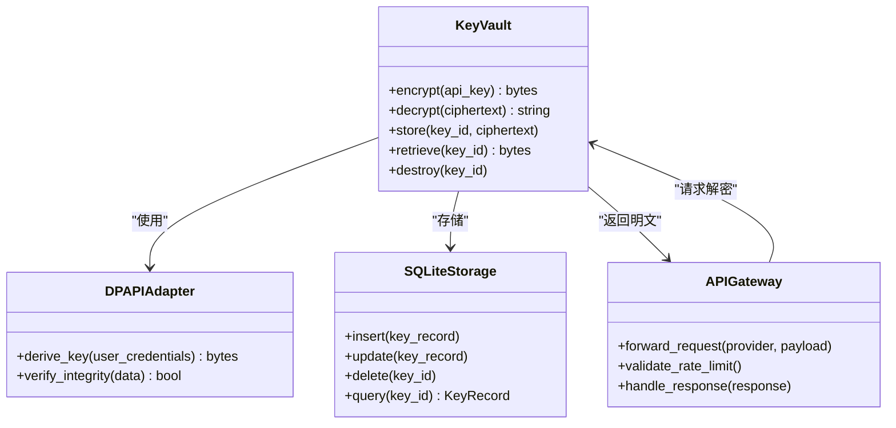
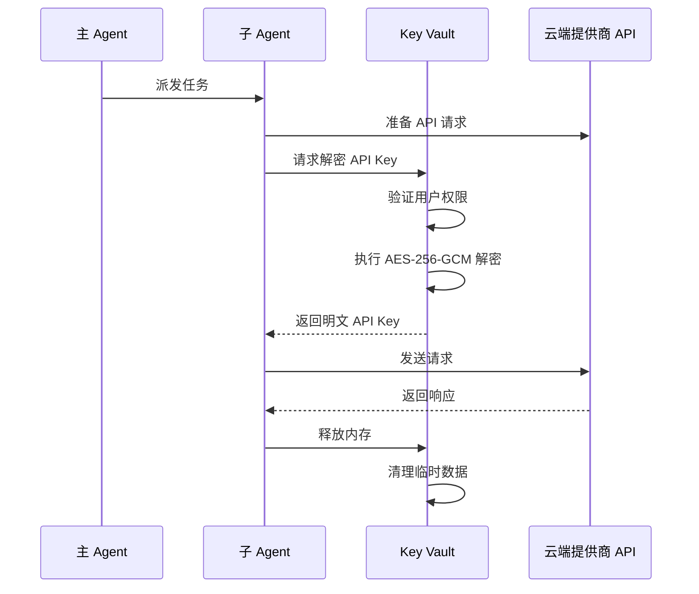
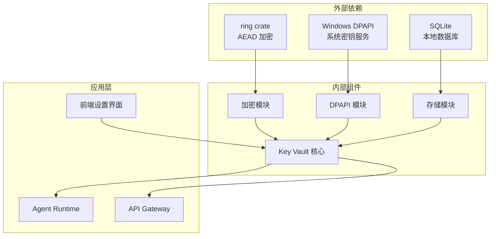

# 安全存储系统

<cite>
**本文引用的文件**
- [buzhidaozenmemingmin.md](file://buzhidaozenmemingmin.md)
</cite>

## 目录
1. [简介](#简介)
2. [项目结构](#项目结构)
3. [核心组件](#核心组件)
4. [架构概览](#架构概览)
5. [详细组件分析](#详细组件分析)
6. [依赖分析](#依赖分析)
7. [性能考虑](#性能考虑)
8. [故障排除指南](#故障排除指南)
9. [结论](#结论)
10. [附录](#附录)

## 简介
Flower Age Video 是一款基于 Tauri 桌面框架的 AI 创意工作站，专注于本地化的 API Key 安全存储。该系统采用 AES-256-GCM 对称加密算法配合 Windows DPAPI 系统集成，确保用户云端 API 密钥在本地设备上的安全存储和使用。

## 项目结构
根据设计文档，Flower Age Video 采用模块化架构，其中 Key Vault 作为核心安全组件位于 Rust 后端的 src-tauri 目录下。

**图表来源**
- [buzhidaozenmemingmin.md:29-50](file://buzhidaozenmemingmin.md#L29-L50)
- [buzhidaozenmemingmin.md:356-472](file://buzhidaozenmemingmin.md#L356-L472)

**章节来源**
- [buzhidaozenmemingmin.md:27-50](file://buzhidaozenmemingmin.md#L27-L50)
- [buzhidaozenmemingmin.md:356-472](file://buzhidaozenmemingmin.md#L356-L472)

## 核心组件
Key Vault 安全存储系统包含三个核心组件：

### AES-256-GCM 对称加密
- 使用 ring crate 提供的 AEAD 加密算法
- 256 位密钥长度，提供机密性和完整性保护
- 支持随机盐值和初始化向量生成
- 密文包含认证标签，防止篡改检测

### Windows DPAPI 系统集成
- 利用操作系统提供的密钥派生机制
- 将用户凭据与系统级密钥绑定
- 支持用户账户级别的密钥隔离
- 自动处理密钥轮换和系统更新

### SQLite 持久化存储
- 加密后的 API Key 存储在本地数据库
- 与项目数据、资产信息统一管理
- 支持事务性操作保证数据一致性

**章节来源**
- [buzhidaozenmemingmin.md:60](file://buzhidaozenmemingmin.md#L60)
- [buzhidaozenmemingmin.md:120](file://buzhidaozenmemingmin.md#L120)
- [buzhidaozenmemingmin.md:340-350](file://buzhidaozenmemingmin.md#L340-L350)

## 架构概览
API Key 在系统中的完整生命周期包括加密存储、解密使用、内存清理和安全销毁四个阶段。

**图表来源**
- [buzhidaozenmemingmin.md:338-350](file://buzhidaozenmemingmin.md#L338-L350)
- [buzhidaozenmemingmin.md:268-288](file://buzhidaozenmemingmin.md#L268-L288)

## 详细组件分析

### 加密算法选择与实现
Key Vault 采用 AES-256-GCM（Advanced Encryption Standard - Galois/Counter Mode）作为主要加密算法，结合 Windows DPAPI 提供的密钥派生机制。

#### AES-256-GCM 特性
- **机密性保护**：256 位密钥长度提供强加密强度
- **完整性验证**：Galois 认证标签防止数据篡改
- **随机性**：每次加密使用唯一随机盐值和初始化向量
- **性能优化**：硬件加速支持，适合大量 API Key 存储

#### 密钥派生机制

**图表来源**
- [buzhidaozenmemingmin.md:340-349](file://buzhidaozenmemingmin.md#L340-L349)

### API Key 生命周期管理
系统严格控制 API Key 的生命周期，确保从存储到使用的每个环节都符合安全要求。

#### 加密存储阶段
- 用户在前端设置界面输入 API Key
- Key Vault 通过 Windows DPAPI 获取系统级密钥
- 使用 AES-256-GCM 对 API Key 进行加密
- 将密文存储在 SQLite 数据库中
- 从不存储明文版本

#### 解密使用阶段
- 当 Agent Runtime 需要调用云端 API 时触发
- Key Vault 验证用户凭据和系统完整性
- 执行 AES-256-GCM 解密操作
- 将明文 API Key 传递给 API Gateway
- 解密后的明文立即在内存中清理

#### 内存清理阶段
- 解密完成后立即清除内存缓冲区
- 防止垃圾回收器意外保留敏感数据
- 使用安全的内存清理函数

#### 安全销毁阶段
- 确认不再需要 API Key 时进行销毁
- 从 SQLite 数据库中删除对应记录
- 清理相关的临时文件和缓存

**章节来源**
- [buzhidaozenmemingmin.md:338-350](file://buzhidaozenmemingmin.md#L338-L350)

### 与 API Gateway 的集成
Key Vault 与 API Gateway 的集成采用最小权限原则，确保 API Key 仅在必要时被访问。

**图表来源**
- [buzhidaozenmemingmin.md:378-381](file://buzhidaozenmemingmin.md#L378-L381)
- [buzhidaozenmemingmin.md:367-377](file://buzhidaozenmemingmin.md#L367-L377)

### 与 Agent Runtime 的交互
Agent Runtime 通过受控接口访问 Key Vault，确保 API Key 的使用符合预设的安全策略。

**图表来源**
- [buzhidaozenmemingmin.md:137-190](file://buzhidaozenmemingmin.md#L137-L190)

## 依赖分析
Key Vault 系统依赖于多个外部组件和系统服务。

**图表来源**
- [buzhidaozenmemingmin.md:114-125](file://buzhidaozenmemingmin.md#L114-L125)
- [buzhidaozenmemingmin.md:378-381](file://buzhidaozenmemingmin.md#L378-L381)

**章节来源**
- [buzhidaozenmemingmin.md:114-125](file://buzhidaozenmemingmin.md#L114-L125)
- [buzhidaozenmemingmin.md:378-381](file://buzhidaozenmemingmin.md#L378-L381)

## 性能考虑
Key Vault 系统在安全性与性能之间寻求平衡，采用多种优化策略：

### 加密性能优化
- 使用硬件加速的 AES-GCM 实现
- 批量处理多个 API Key 的加密/解密操作
- 智能缓存机制减少重复计算

### 内存管理
- 最小化明文 API Key 在内存中的停留时间
- 使用安全的内存分配和清理机制
- 防止内存碎片化影响性能

### 数据库优化
- SQLite 数据库的索引优化
- 事务批量提交减少 I/O 操作
- 连接池管理提高并发性能

## 故障排除指南
针对 Key Vault 系统可能出现的问题提供诊断和解决方案：

### 常见问题及解决方法

#### 1. API Key 解密失败
**症状**：Agent Runtime 无法获取 API Key 或出现认证错误
**排查步骤**：
- 检查 Windows DPAPI 是否正常工作
- 验证用户凭据是否正确
- 确认密文数据完整性
- 检查系统时间同步状态

#### 2. 存储空间不足
**症状**：Key Vault 无法存储新的 API Key
**解决方法**：
- 清理过期或无效的 API Key 记录
- 检查 SQLite 数据库文件大小
- 优化数据库维护操作

#### 3. 性能问题
**症状**：API Key 加密/解密操作响应缓慢
**优化建议**：
- 检查系统资源使用情况
- 调整批处理大小
- 优化数据库查询性能

**章节来源**
- [buzhidaozenmemingmin.md:338-350](file://buzhidaozenmemingmin.md#L338-L350)

## 结论
Flower Age Video 的 API Key 安全存储系统通过 AES-256-GCM 对称加密与 Windows DPAPI 的深度集成，为用户提供了企业级的本地 API Key 保护方案。系统的设计充分考虑了安全性、性能和可用性的平衡，确保用户能够在本地环境中安全地管理和使用各种云端 AI 服务的 API Key。

该系统的核心优势在于：
- **零信任架构**：从不存储明文 API Key
- **系统级保护**：利用 Windows DPAPI 提供的系统级密钥保护
- **最小权限原则**：API Key 仅在必要时被解密和使用
- **完整生命周期管理**：从创建到销毁的全流程安全控制

## 附录

### 安全威胁模型分析
系统采用威胁建模方法识别和缓解潜在的安全风险：

#### 主要威胁向量
- **本地存储泄露**：攻击者获取设备后尝试访问 API Key
- **内存转储**：恶意软件扫描内存中的明文 API Key
- **侧信道攻击**：通过时间分析推断加密操作
- **供应链攻击**：针对系统组件的恶意修改

#### 防护措施
- 多层加密保护：AES-256-GCM + DPAPI
- 最小暴露原则：明文 API Key 仅在内存中短暂存在
- 完整性验证：Galois 认证标签防止篡改
- 系统集成：依赖操作系统提供的安全基础设施

### 合规性考虑
- **数据保护法规**：符合 GDPR、CCPA 等数据保护要求
- **行业标准**：遵循 NIST、ISO/IEC 27001 等安全标准
- **许可证合规**：所有依赖项均为开源许可证，无 GPL 传染风险
- **商业使用**：100% 无商业侵权风险的许可证组合

### 密钥管理最佳实践
- 定期轮换 API Key，避免长期使用同一密钥
- 实施最小权限原则，为不同供应商分配独立的 API Key
- 建立密钥备份和恢复机制
- 监控 API Key 的使用模式，及时发现异常行为

### 安全审计方法
- 定期检查加密算法的实现和配置
- 审核 API Key 的访问日志和使用记录
- 验证系统完整性，确保未被篡改
- 进行渗透测试和安全评估