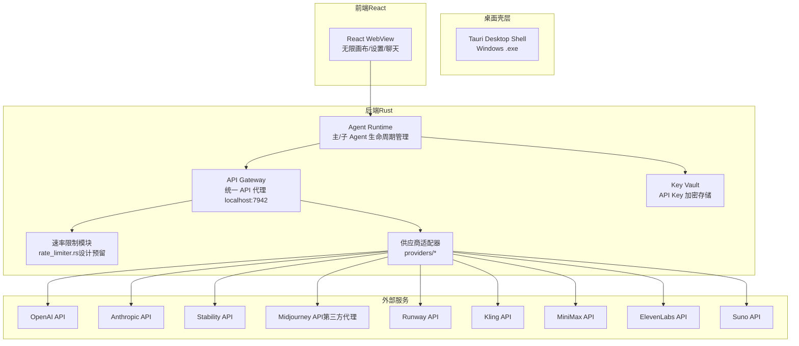
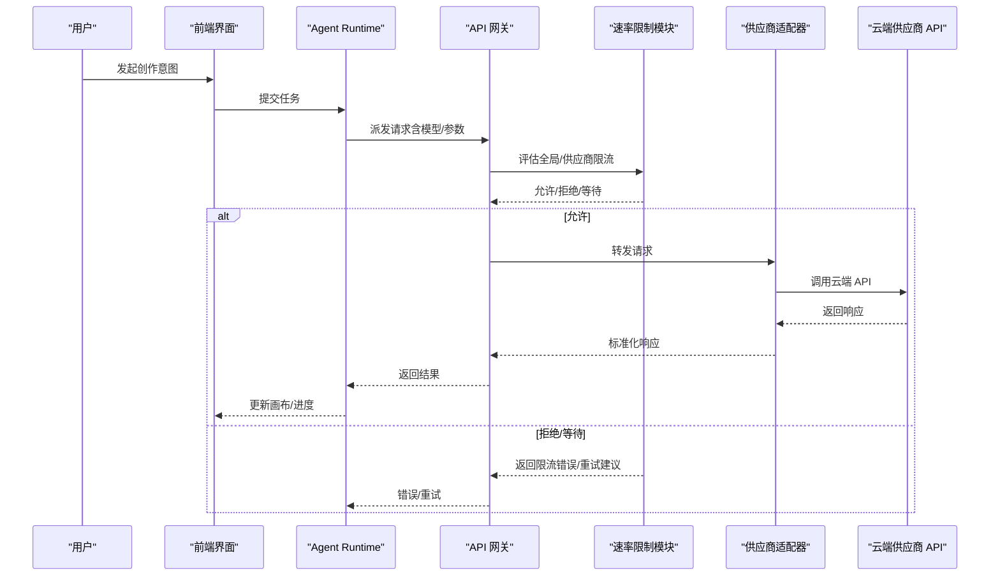
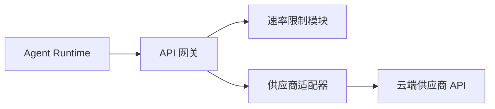

# 速率限制机制

<cite>
**本文引用的文件**
- [buzhidaozenmemingmin.md](file://buzhidaozenmemingmin.md)
</cite>

## 目录
1. [简介](#简介)
2. [项目结构](#项目结构)
3. [核心组件](#核心组件)
4. [架构总览](#架构总览)
5. [详细组件分析](#详细组件分析)
6. [依赖分析](#依赖分析)
7. [性能考虑](#性能考虑)
8. [故障排除指南](#故障排除指南)
9. [结论](#结论)
10. [附录](#附录)

## 简介
本技术文档围绕 Flower Age Video 的 API 速率限制机制展开，结合项目设计文档中的架构与组件规划，系统阐述以下主题：
- 速率限制策略：令牌桶算法、滑动窗口限制、并发连接控制
- 供应商侧策略与重试/退避机制
- 用户配置项、全局限制与供应商特定限制的协调
- 触发条件、告警与监控指标
- 性能影响与调优建议
- 故障排除方法
- 与 Agent 编排系统的协同方式

说明：当前仓库仅包含设计文档，未包含具体实现代码。本文依据设计文档进行“概念性实现”与“最佳实践”层面的系统化梳理，并在涉及具体实现细节处明确标注“依据设计文档”。

## 项目结构
Flower Age Video 的后端以 Rust 为主，采用 Tauri 桌面壳 + Rust 后端 + React 前端的组合。API 网关位于后端，负责将请求路由至各云端 AI 供应商，并在设计中预留了速率限制模块。

图表来源
- [buzhidaozenmemingmin.md: 266-288:266-288](file://buzhidaozenmemingmin.md#L266-L288)
- [buzhidaozenmemingmin.md: 354-472:354-472](file://buzhidaozenmemingmin.md#L354-L472)

章节来源
- [buzhidaozenmemingmin.md: 266-288:266-288](file://buzhidaozenmemingmin.md#L266-L288)
- [buzhidaozenmemingmin.md: 354-472:354-472](file://buzhidaozenmemingmin.md#L354-L472)

## 核心组件
- API 网关：统一入口，负责将请求路由到各供应商适配器，并在设计中预留速率限制模块。
- 供应商适配器：针对不同供应商的 API 特性进行封装，包括认证、参数映射、错误处理与重试。
- 速率限制模块：在设计中预留，用于实现令牌桶、滑动窗口与并发连接控制。
- Key Vault：本地加密存储 API Key，确保在调用时才解密并在内存中短暂持有。
- Agent 编排：主 Agent 拆解任务、派发子 Agent，子 Agent 通过 API 网关访问云端供应商。

章节来源
- [buzhidaozenmemingmin.md: 266-288:266-288](file://buzhidaozenmemingmin.md#L266-L288)
- [buzhidaozenmemingmin.md: 354-472:354-472](file://buzhidaozenmemingmin.md#L354-L472)

## 架构总览
API 请求在本地完成，不经过第三方代理服务器。Agent Runtime 通过 API Gateway 路由到各供应商，速率限制模块在网关层统一接入，实现全局限制与供应商特定限制的协调。

图表来源
- [buzhidaozenmemingmin.md: 266-288:266-288](file://buzhidaozenmemingmin.md#L266-L288)
- [buzhidaozenmemingmin.md: 354-472:354-472](file://buzhidaozenmemingmin.md#L354-L472)

## 详细组件分析

### 速率限制策略与实现要点
- 令牌桶算法
  - 适用场景：平滑突发流量，保障平均速率稳定。
  - 关键参数：桶容量、填充速率、最大突发量。
  - 与并发控制的关系：令牌桶关注“速率”，并发控制关注“同时请求数”。
- 滑动窗口限制
  - 适用场景：严格控制单位时间内的请求数量。
  - 关键参数：窗口大小、阈值。
  - 与令牌桶的区别：滑动窗口更强调“瞬时峰值”的抑制。
- 并发连接控制
  - 适用场景：防止下游供应商因并发过高而触发自身限流或超载。
  - 关键参数：最大并发请求数、队列长度、超时策略。
- 供应商特定限制
  - 不同供应商的配额、QPS、并发限制不同，需按供应商维度独立配置。
  - 示例：图像生成、视频生成、语音合成、音乐生成等不同能力域的配额差异较大。

依据设计文档，速率限制模块在网关层统一接入，支持全局与供应商维度的策略叠加与协调。

章节来源
- [buzhidaozenmemingmin.md: 266-288:266-288](file://buzhidaozenmemingmin.md#L266-L288)
- [buzhidaozenmemingmin.md: 354-472:354-472](file://buzhidaozenmemingmin.md#L354-L472)

### 供应商策略与重试/退避机制
- 供应商策略
  - 不同供应商的配额与限流策略不同，需在速率限制模块中区分供应商维度。
  - 建议：为每个供应商维护独立的限流配置（如 QPS、并发、每日配额）。
- 重试与退避
  - 重试条件：网络异常、临时性错误、上游限流返回的 Retry-After。
  - 退避策略：指数退避（带抖动）或线性退避，避免雪崩效应。
  - 最大重试次数与超时：避免无限重试导致资源耗尽。
- 错误分类
  - 429 Too Many Requests：明确触发限流，应优先退避。
  - 5xx 服务端错误：可尝试重试，但需控制频率。
  - 4xx 客户端错误：通常不应重试，需修正请求。

依据设计文档，API 网关负责路由到各供应商，速率限制模块应在网关层统一处理重试与退避逻辑。

章节来源
- [buzhidaozenmemingmin.md: 266-288:266-288](file://buzhidaozenmemingmin.md#L266-L288)
- [buzhidaozenmemingmin.md: 354-472:354-472](file://buzhidaozenmemingmin.md#L354-L472)

### 用户配置选项与协调机制
- 用户配置项（建议）
  - 全局 QPS 与并发上限
  - 供应商维度的 QPS、并发、每日配额
  - 重试次数与退避参数
  - 超时与队列长度
- 协调机制
  - 全局策略作为“硬约束”，供应商策略作为“软约束”。
  - 当供应商策略超过全局策略时，以全局策略为准。
  - 并发控制与速率控制可并行生效，避免同时超过两者阈值。

依据设计文档，用户在本地配置 API Key，API 网关负责路由与限流，速率限制模块应支持上述配置项与协调策略。

章节来源
- [buzhidaozenmemingmin.md: 266-288:266-288](file://buzhidaozenmemingmin.md#L266-L288)
- [buzhidaozenmemingmin.md: 354-472:354-472](file://buzhidaozenmemingmin.md#L354-L472)

### 限流触发条件、告警与监控
- 触发条件
  - 速率超过全局/供应商阈值
  - 并发达到上限
  - 供应商返回 429 或限流相关错误
- 告警机制
  - 限流事件计数、延迟分布、错误率阈值告警
  - 供应商维度与全局维度分别告警
- 监控指标（建议）
  - QPS、并发数、成功率、P95/P99 延迟、重试次数、队列长度
  - 供应商维度的配额使用率、剩余配额

依据设计文档，API 网关与速率限制模块应具备可观测性与告警能力，以便在限流发生时快速定位原因。

章节来源
- [buzhidaozenmemingmin.md: 266-288:266-288](file://buzhidaozenmemingmin.md#L266-L288)
- [buzhidaozenmemingmin.md: 354-472:354-472](file://buzhidaozenmemingmin.md#L354-L472)

### 与 Agent 编排系统的配合
- 主 Agent 拆解任务并派发子 Agent，子 Agent 通过 API 网关访问云端供应商。
- 速率限制模块在网关层统一接入，避免子 Agent 重复实现限流逻辑。
- 限流策略应与 Agent 的步数预算、任务粒度相匹配，避免阻塞主流程。

依据设计文档，主/子 Agent 的编排与 API 网关的限流策略需协同，确保整体吞吐与稳定性。

章节来源
- [buzhidaozenmemingmin.md: 137-210:137-210](file://buzhidaozenmemingmin.md#L137-L210)
- [buzhidaozenmemingmin.md: 266-288:266-288](file://buzhidaozenmemingmin.md#L266-L288)

## 依赖分析
- 组件耦合
  - API 网关与速率限制模块强耦合，需在网关层统一接入。
  - 供应商适配器与速率限制模块弱耦合，通过标准化接口交互。
- 外部依赖
  - 云端供应商 API 的限流策略与配额变化会影响限流策略调整。
- 循环依赖
  - 速率限制模块不应依赖具体供应商实现，避免循环依赖。

图表来源
- [buzhidaozenmemingmin.md: 266-288:266-288](file://buzhidaozenmemingmin.md#L266-L288)
- [buzhidaozenmemingmin.md: 354-472:354-472](file://buzhidaozenmemingmin.md#L354-L472)

章节来源
- [buzhidaozenmemingmin.md: 266-288:266-288](file://buzhidaozenmemingmin.md#L266-L288)
- [buzhidaozenmemingmin.md: 354-472:354-472](file://buzhidaozenmemingmin.md#L354-L472)

## 性能考虑
- 令牌桶 vs 滑动窗口
  - 令牌桶适合平滑流量，滑动窗口适合抑制瞬时峰值。
  - 在高并发场景下，建议结合两种策略：令牌桶平滑、滑动窗口抑制突发。
- 并发控制
  - 并发上限应低于供应商的并发阈值，留出安全余量。
  - 队列长度与超时需平衡吞吐与延迟。
- 重试与退避
  - 退避策略应带抖动，避免集中重试。
  - 重试次数与超时应与上游限流周期匹配，避免无效重试。
- 监控与自适应
  - 基于监控指标动态调整 QPS 与并发上限，实现自适应限流。

## 故障排除指南
- 症状：频繁出现 429
  - 排查：确认全局与供应商维度的 QPS 是否过低；检查是否启用指数退避。
  - 处理：提高 QPS 或延长退避间隔；必要时降低并发。
- 症状：请求堆积、延迟升高
  - 排查：队列长度是否过大；并发是否接近供应商上限。
  - 处理：缩短队列长度、增加退避、降低并发。
- 症状：部分供应商频繁限流
  - 排查：该供应商的配额是否不足；是否存在热点模型。
  - 处理：为该供应商单独配置更高 QPS 或并发；分流到备用供应商。
- 症状：重试无效导致资源耗尽
  - 排查：最大重试次数是否过大；退避是否合理。
  - 处理：限制最大重试次数；引入抖动与随机退避。

## 结论
本设计文档为 Flower Age Video 的 API 速率限制提供了系统化的策略与实施建议。尽管当前仓库尚未包含具体实现代码，但依据设计文档，API 网关与速率限制模块的协同将有效保障在多供应商、多 Agent 场景下的稳定性与性能。后续实现应重点关注：
- 令牌桶与滑动窗口的组合策略
- 供应商维度的差异化配置
- 重试与退避的健壮性
- 监控与告警的可观测性
- 与 Agent 编排系统的无缝衔接

## 附录

### 速率限制配置指南（建议）
- 全局配置
  - 全局 QPS：建议从较低值起步，逐步上调
  - 全局并发：建议不超过供应商并发阈值的 60%
  - 重试次数：建议 3–5 次
  - 退避策略：指数退避（带抖动），初始间隔 1–2s，最大间隔 30–60s
- 供应商配置（示例）
  - OpenAI：QPS 20–50，并发 5–10
  - Stability：QPS 10–20，并发 3–5
  - Midjourney：QPS 5–10，并发 2–3（第三方代理）
  - Runway/Kling：QPS 5–10，并发 2–3
  - MiniMax：QPS 10–20，并发 3–5
  - ElevenLabs/Suno：QPS 10–20，并发 3–5

### 调优建议
- 从保守值开始，逐步提高 QPS 与并发，观察延迟与成功率
- 针对不同供应商建立独立的限流策略，避免互相影响
- 使用队列与超时参数控制背压，避免下游过载
- 结合监控指标定期复盘，动态调整策略

### 与 Agent 编排的配合
- 主/子 Agent 的任务粒度与限流策略匹配，避免阻塞主流程
- 在 Agent 层面设置合理的步数预算，与网关限流形成双重保障
- 对高耗时任务（如视频生成）单独配置更高的并发与 QPS