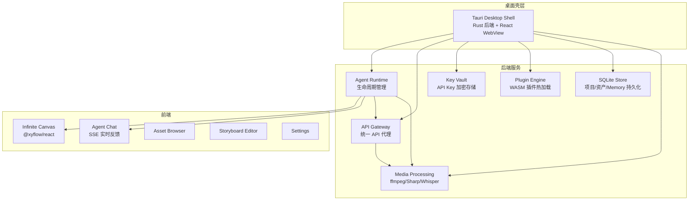
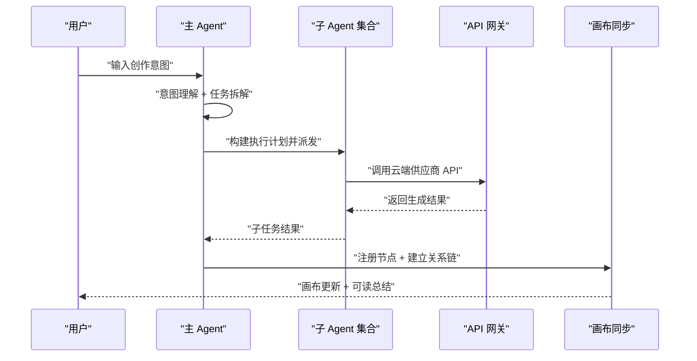
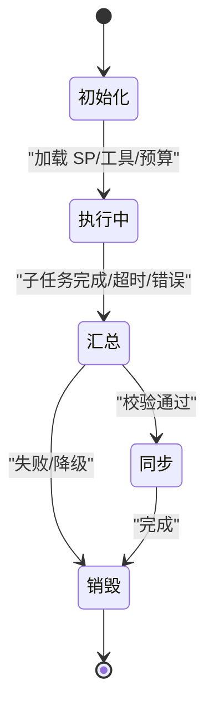
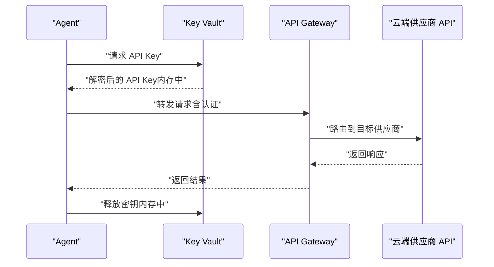
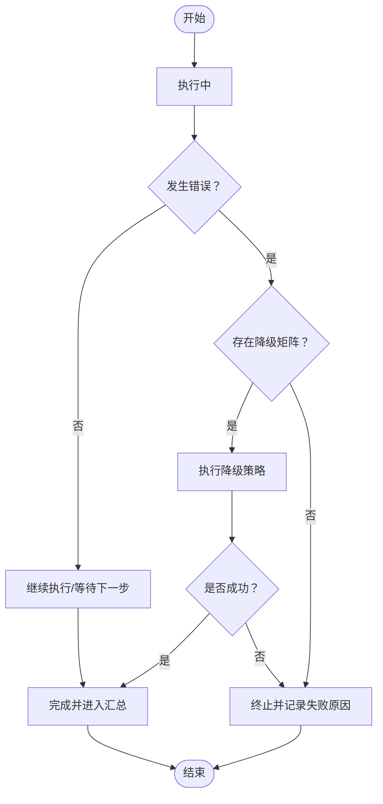

# Agent 生命周期管理

<cite>
**本文引用的文件**
- [buzhidaozenmemingmin.md](file://buzhidaozenmemingmin.md)
</cite>

## 目录
1. [简介](#简介)
2. [项目结构](#项目结构)
3. [核心组件](#核心组件)
4. [架构总览](#架构总览)
5. [详细组件分析](#详细组件分析)
6. [依赖分析](#依赖分析)
7. [性能考虑](#性能考虑)
8. [故障排查指南](#故障排查指南)
9. [结论](#结论)
10. [附录](#附录)

## 简介
本文件围绕“Flower Age Video”项目中的 Agent 生命周期管理进行系统化技术文档整理，聚焦于主 Agent 编排与子 Agent 执行的完整生命周期：创建、初始化、执行、监控与销毁；阐述状态转换机制、内存管理策略、并发控制与资源清理；描述启动参数配置、运行时环境隔离、错误恢复与优雅关闭流程；并提供生命周期状态图、资源分配时序图与异常处理流程图，以及配置模板、状态监控接口与性能优化建议。由于当前仓库仅包含设计文档，本文在不虚构实现细节的前提下，基于设计文档中的架构与流程进行严谨的工程化解读与可视化呈现。

## 项目结构
- 顶层为设计文档，涵盖整体架构、Agent 体系、API 网关、存储设计、开发路线图等内容。
- 后端 Rust 模块位于 src-tauri/，按功能域划分：agent/（Agent 运行时）、gateway/（API 网关）、vault/（Key Vault）、plugin/（插件引擎）、storage/（存储）、canvas/（画布后端）、media/（媒体处理）。
- 前端位于 src/，包含无限画布、Agent 对话、资产管理、分镜编辑器、设置等模块。
- 资源文件位于 src-tauri/resources/，包含各 Agent 的系统提示词（SP）、合约/约束协议、知识库等。

图表来源
- [buzhidaozenmemingmin.md:29-50](file://buzhidaozenmemingmin.md#L29-L50)
- [buzhidaozenmemingmin.md:354-472](file://buzhidaozenmemingmin.md#L354-L472)

章节来源
- [buzhidaozenmemingmin.md:27-50](file://buzhidaozenmemingmin.md#L27-L50)
- [buzhidaozenmemingmin.md:354-472](file://buzhidaozenmemingmin.md#L354-L472)

## 核心组件
- Agent 运行时（Agent Runtime）：负责 Agent 生命周期管理、工具调度、系统提示词注入、步数限制与派发协调。
- 主 Agent（orchestrator）：总编排器，负责意图理解、任务拆解、并行/串行派发、结果汇总与画布同步。
- 子 Agent：图像、视频、语音、音乐、后期制作等专业 Agent，各自具备步数预算与降级矩阵。
- API 网关：统一路由到各云端 AI 供应商 API，本地代理，不经过第三方服务器。
- Key Vault：API Key 本地加密存储，AES-256-GCM + Windows DPAPI 保护。
- 插件引擎：WASM 插件热加载，扩展新 AI 模型接入。
- 无限画布：节点式无限画布，支持拖拽、缩放、连线、分组与小地图导航。
- 媒体处理：ffmpeg 本地执行，图像/音频处理，Whisper 可选本地语音转文字。

章节来源
- [buzhidaozenmemingmin.md:137-211](file://buzhidaozenmemingmin.md#L137-L211)
- [buzhidaozenmemingmin.md:266-351](file://buzhidaozenmemingmin.md#L266-L351)
- [buzhidaozenmemingmin.md:418-472](file://buzhidaozenmemingmin.md#L418-L472)

## 架构总览
Agent 生命周期管理贯穿“意图理解 → 并行派发 → 汇总与画布同步”的确定性流程。主 Agent 依据系统提示词（SP）与步数预算进行决策，将任务拆解为子 Agent 的执行计划；子 Agent 在各自的预算内调用工具与 API 网关，产出结果；最终由主 Agent 汇总并通过画布同步协议注册节点，建立资产关系链。

图表来源
- [buzhidaozenmemingmin.md:172-190](file://buzhidaozenmemingmin.md#L172-L190)
- [buzhidaozenmemingmin.md:266-288](file://buzhidaozenmemingmin.md#L266-L288)

## 详细组件分析

### Agent 生命周期状态机
Agent 生命周期包括以下关键状态与转换：
- 初始化（Initialized）：加载系统提示词（SP）、注入工具、绑定步数预算。
- 执行中（Executing）：根据派发计划执行任务，记录步数与中间结果。
- 汇总（Aggregating）：校验子任务输出，准备汇总报告。
- 同步（Syncing）：将结果注册到画布节点，建立资产关系链。
- 销毁（Destroyed）：释放资源、清理内存、关闭连接。

图表来源
- [buzhidaozenmemingmin.md:172-190](file://buzhidaozenmemingmin.md#L172-L190)
- [buzhidaozenmemingmin.md:137-171](file://buzhidaozenmemingmin.md#L137-L171)

章节来源
- [buzhidaozenmemingmin.md:137-171](file://buzhidaozenmemingmin.md#L137-L171)
- [buzhidaozenmemingmin.md:172-190](file://buzhidaozenmemingmin.md#L172-L190)

### Agent 状态转换机制
- 步数预算控制：主 Agent 与子 Agent 各自设置 max_turns，防止无限循环或过长推理。
- 降级矩阵：每个 Agent 内置失败兜底策略，确保在部分失败时仍能输出可用结果。
- 合约约束：通过合约/约束协议限制输出格式、安全红线与介质锁定，保证一致性与合规性。
- Memory 持久化：跨会话风格偏好与角色锚点持久化，提升一致性与个性化体验。

章节来源
- [buzhidaozenmemingmin.md:192-211](file://buzhidaozenmemingmin.md#L192-L211)
- [buzhidaozenmemingmin.md:512-546](file://buzhidaozenmemingmin.md#L512-L546)

### 内存管理策略
- API Key 加密存储：AES-256-GCM 加密，Windows DPAPI 保护，解密仅在调用时于内存中短暂停留，不落盘明文。
- 本地缓存与临时文件：生成资产存放于本地目录，按需清理；日志与数据库分离，避免内存压力。
- 插件沙箱：WASM 插件在独立虚拟机中运行，隔离内存与系统资源。

章节来源
- [buzhidaozenmemingmin.md:338-351](file://buzhidaozenmemingmin.md#L338-L351)
- [buzhidaozenmemingmin.md:512-546](file://buzhidaozenmemingmin.md#L512-L546)

### 并发控制与资源清理
- 并发派发：无依赖任务并行执行，有依赖任务串行执行，最大化吞吐同时保证数据一致性。
- 速率限制：API 网关内置速率限制，避免触发供应商限流。
- 资源清理：Agent 执行完成后释放工具句柄、关闭网络连接、删除临时文件；数据库事务提交或回滚，确保一致性。

章节来源
- [buzhidaozenmemingmin.md:180-189](file://buzhidaozenmemingmin.md#L180-L189)
- [buzhidaozenmemingmin.md:266-351](file://buzhidaozenmemingmin.md#L266-L351)

### 运行时环境隔离
- 本地部署：单文件 .exe 安装，无需 Docker、Python、Node.js 运行时。
- 云端 API 直连：用户自行配置 API Key，不经过第三方服务器，保障隐私与可控性。
- 媒体处理本地化：ffmpeg 由侧车组件自动下载与管理，避免外部依赖。

章节来源
- [buzhidaozenmemingmin.md:20-23](file://buzhidaozenmemingmin.md#L20-L23)
- [buzhidaozenmemingmin.md:266-288](file://buzhidaozenmemingmin.md#L266-L288)
- [buzhidaozenmemingmin.md:500-509](file://buzhidaozenmemingmin.md#L500-L509)

### 错误恢复机制与优雅关闭
- 错误恢复：子任务失败时触发降级矩阵，尝试备用模型或简化流程；若仍失败则进入降级输出并记录原因。
- 优雅关闭：在收到中断信号时，主 Agent 通知子 Agent 有序停止，提交数据库事务，清理临时文件，释放资源。

章节来源
- [buzhidaozenmemingmin.md:192-211](file://buzhidaozenmemingmin.md#L192-L211)
- [buzhidaozenmemingmin.md:172-190](file://buzhidaozenmemingmin.md#L172-L190)

### 资源分配时序图（API 调用）

图表来源
- [buzhidaozenmemingmin.md:266-288](file://buzhidaozenmemingmin.md#L266-L288)
- [buzhidaozenmemingmin.md:338-351](file://buzhidaozenmemingmin.md#L338-L351)

### 异常处理流程图

图表来源
- [buzhidaozenmemingmin.md:192-211](file://buzhidaozenmemingmin.md#L192-L211)

## 依赖分析
- 技术栈与许可证：项目采用 MIT/Apache-2.0/BSD 许可证组合，确保可商用且无 GPL 传染风险。
- 第三方组件：Tauri、React、@xyflow/react、Zustand、Vite、Axum、Tokio、Reqwest、Ring、Rusqlite、Wasmtime、FFmpeg-sidecar、Image-rs、Symphonia 等。
- 依赖耦合：Agent Runtime 与 API Gateway、Key Vault、SQLite、画布后端紧密耦合；插件引擎与 Agent Runtime 解耦，便于扩展。

章节来源
- [buzhidaozenmemingmin.md:87-134](file://buzhidaozenmemingmin.md#L87-L134)
- [buzhidaozenmemingmin.md:596-621](file://buzhidaozenmemingmin.md#L596-L621)

## 性能考虑
- 异步运行时：Tokio 异步运行时提升并发效率，降低阻塞。
- 速率限制：API 网关内置速率限制，避免供应商限流导致的抖动。
- 本地媒体处理：ffmpeg 侧车组件自动下载与复用，减少网络开销。
- 插件沙箱：WASM 插件隔离执行，避免全局状态污染。
- 数据库优化：SQLite 轻量高效，结合事务与索引提升读写性能。
- 前端渲染：React + Zustand + @xyflow/react，组件化与状态管理优化交互性能。

章节来源
- [buzhidaozenmemingmin.md:112-134](file://buzhidaozenmemingmin.md#L112-L134)
- [buzhidaozenmemingmin.md:266-351](file://buzhidaozenmemingmin.md#L266-L351)

## 故障排查指南
- API Key 问题：确认 Key Vault 中密文正确、解密流程正常、未在网络或日志中泄露明文。
- 供应商限流：检查 API 网关速率限制配置，必要时调整并发与重试策略。
- 画布同步失败：核对画布同步协议与节点注册逻辑，确保资产关系链完整。
- 插件加载失败：检查 WASM 插件清单与沙箱权限，确认兼容性与完整性。
- 媒体处理异常：验证 ffmpeg 二进制版本与路径，确保首次启动时已正确下载。

章节来源
- [buzhidaozenmemingmin.md:338-351](file://buzhidaozenmemingmin.md#L338-L351)
- [buzhidaozenmemingmin.md:266-351](file://buzhidaozenmemingmin.md#L266-L351)
- [buzhidaozenmemingmin.md:512-546](file://buzhidaozenmemingmin.md#L512-L546)

## 结论
本设计文档为 Flower Age Video 的 Agent 生命周期管理提供了系统化的工程化视角：从状态机、并发控制、内存与资源管理，到错误恢复与优雅关闭，均体现了对可靠性与可维护性的重视。尽管当前仓库尚未包含后端 Rust 实现代码，但基于设计文档的架构与流程，可以清晰地指导后续开发与落地实施。

## 附录

### Agent 配置模板（示例字段）
- Agent ID：唯一标识符（如 flowerage-orchestrator）
- 角色与能力边界：Agent 的职责与能力范围
- 工具使用 SOP：标准操作流程
- 降级矩阵：失败兜底策略
- 输出格式规范：统一的数据结构与字段
- 安全红线：不可覆盖的约束
- 步数预算：max_turns 限制
- 工具集数量：MCP 工具数

章节来源
- [buzhidaozenmemingmin.md:192-211](file://buzhidaozenmemingmin.md#L192-L211)

### 状态监控接口（建议）
- Agent 状态查询：返回当前状态、步数、错误信息
- 任务进度：SSE 推送实时进度
- 画布节点同步：注册节点与关系链状态
- API 调用统计：成功率、耗时、错误码分布

章节来源
- [buzhidaozenmemingmin.md:266-288](file://buzhidaozenmemingmin.md#L266-L288)
- [buzhidaozenmemingmin.md:440-445](file://buzhidaozenmemingmin.md#L440-L445)