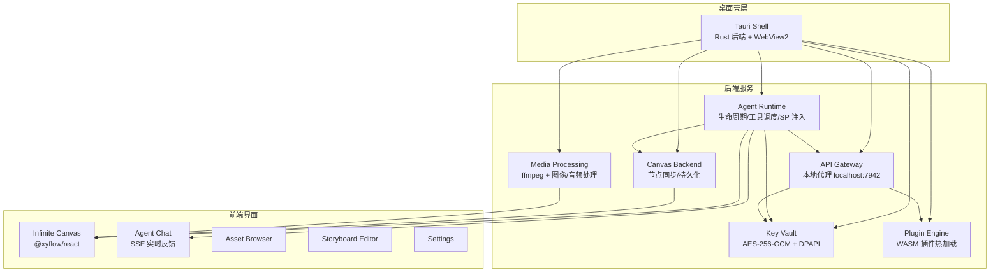
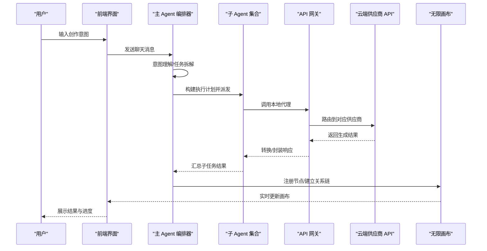
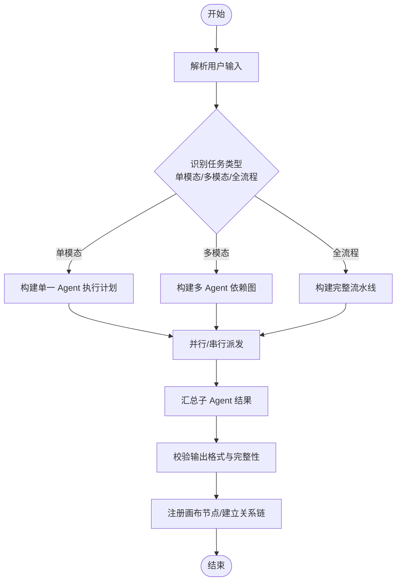
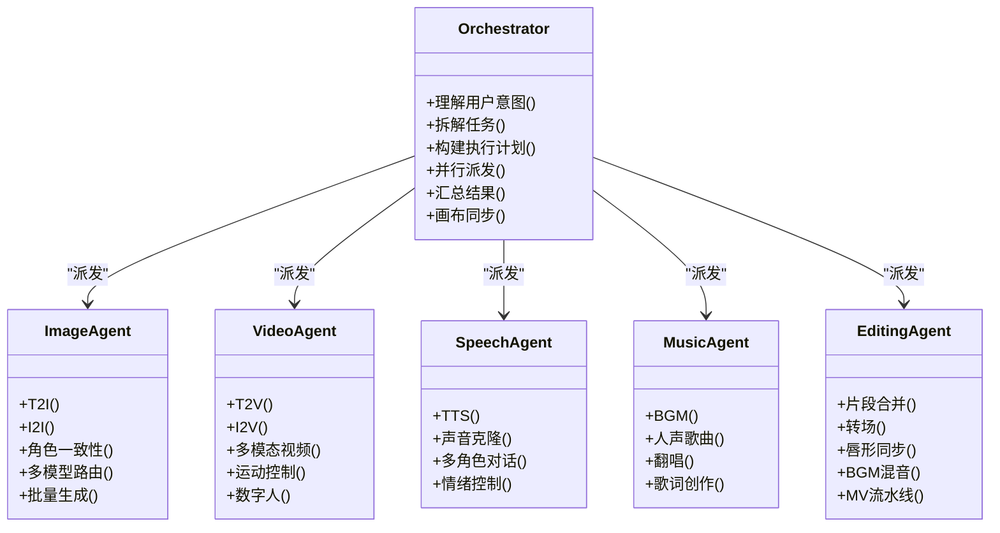
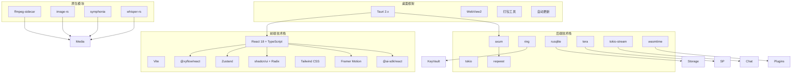

# Agent 系统

<cite>
**本文档引用的文件**
- [buzhidaozenmemingmin.md](file://buzhidaozenmemingmin.md)
</cite>

## 目录
1. [简介](#简介)
2. [项目结构](#项目结构)
3. [核心组件](#核心组件)
4. [架构总览](#架构总览)
5. [详细组件分析](#详细组件分析)
6. [依赖分析](#依赖分析)
7. [性能考虑](#性能考虑)
8. [故障排查指南](#故障排查指南)
9. [结论](#结论)
10. [附录](#附录)

## 简介
Flower Age Video 是一款基于主 Agent 编排 + 子 Agent 执行的 AI 创意工作站，面向视频创作者与内容生产者。系统在本地 Windows 桌面提供无限画布，用户通过主 Agent 描述创作意图，由五个专业子 Agent（图像、视频、语音、音乐、后期）自动完成全链路协作。项目采用 Rust 后端 + Tauri 桌面壳 + React 前端的混合架构，强调零依赖安装、本地 API Key 加密存储与 MCP 风格工具注册表。

## 项目结构
项目采用前后端分离的模块化组织，后端位于 src-tauri（Rust），前端位于 src（React）。Agent 运行时、API 网关、Key Vault、插件引擎、画布后端与媒体处理均在后端实现；前端负责无限画布、对话面板、资产浏览器、分镜编辑器与设置界面。

**图表来源**
- [buzhidaozenmemingmin.md: 27-83:27-83](file://buzhidaozenmemingmin.md#L27-L83)
- [buzhidaozenmemingmin.md: 354-472:354-472](file://buzhidaozenmemingmin.md#L354-L472)

**章节来源**
- [buzhidaozenmemingmin.md: 27-83:27-83](file://buzhidaozenmemingmin.md#L27-L83)
- [buzhidaozenmemingmin.md: 354-472:354-472](file://buzhidaozenmemingmin.md#L354-L472)

## 核心组件
- 主 Agent 编排器（flowerage-orchestrator）：负责意图理解、任务拆解、并行/串行派发、结果汇总与画布同步。
- 五个专业子 Agent：image-agent、video-agent、speech-agent、music-agent、editing-agent，分别承担各自领域的生成与处理任务。
- Agent Runtime：统一管理 Agent 生命周期、工具调度、系统提示词注入与步数预算控制。
- MCP 风格工具注册表：标准化工具注册与调用，支持跨 Agent 的工具复用。
- API Gateway：本地代理，将请求路由到各云端 AI 供应商 API，并进行速率限制与错误处理。
- Key Vault：本地加密存储 API Key，采用 AES-256-GCM 与 Windows DPAPI 双重保护。
- 无限画布：基于 @xyflow/react 的节点式无限画布，支持拖拽、缩放、连线与分组。
- 插件引擎：WASM 动态加载，扩展新 AI 模型或工具能力。
- 媒体处理：ffmpeg-sidecar 集成，提供视频合并、转场、音频混音与格式转换。

**章节来源**
- [buzhidaozenmemingmin.md: 137-171:137-171](file://buzhidaozenmemingmin.md#L137-L171)
- [buzhidaozenmemingmin.md: 266-350:266-350](file://buzhidaozenmemingmin.md#L266-L350)
- [buzhidaozenmemingmin.md: 418-472:418-472](file://buzhidaozenmemingmin.md#L418-L472)

## 架构总览
系统采用“主 Agent 编排 + 子 Agent 执行”的分层架构。用户输入经由 Agent Runtime 的主 Agent（flowerage-orchestrator）解析，按任务依赖关系构建执行计划，随后并行/串行派发至子 Agent。子 Agent 通过 API Gateway 调用云端供应商 API 或本地 ffmpeg 执行媒体处理，最终将生成物注册到无限画布节点并建立资产关系链。

**图表来源**
- [buzhidaozenmemingmin.md: 66-83:66-83](file://buzhidaozenmemingmin.md#L66-L83)
- [buzhidaozenmemingmin.md: 172-190:172-190](file://buzhidaozenmemingmin.md#L172-L190)

**章节来源**
- [buzhidaozenmemingmin.md: 66-83:66-83](file://buzhidaozenmemingmin.md#L66-L83)
- [buzhidaozenmemingmin.md: 172-190:172-190](file://buzhidaozenmemingmin.md#L172-L190)

## 详细组件分析

### 主 Agent 编排器（flowerage-orchestrator）
- 角色与职责：总编排器，负责理解用户意图、拆解任务、构建执行计划、并行/串行派发、汇总结果与画布同步。
- 步数预算：400，用于控制推理深度与工具调用次数。
- 工具集：任务拆解、画布读写、Memory、派发。
- 编排流程：Stage 1（意图理解）→ Stage 2（并行派发）→ Stage 3（汇总与画布同步）。

**图表来源**
- [buzhidaozenmemingmin.md: 172-190:172-190](file://buzhidaozenmemingmin.md#L172-L190)

**章节来源**
- [buzhidaozenmemingmin.md: 141-159:141-159](file://buzhidaozenmemingmin.md#L141-L159)
- [buzhidaozenmemingmin.md: 161-171:161-171](file://buzhidaozenmemingmin.md#L161-L171)
- [buzhidaozenmemingmin.md: 172-190:172-190](file://buzhidaozenmemingmin.md#L172-L190)

### 子 Agent 体系
- image-agent：图像生成（T2I/I2I）、角色一致性、多模型路由、批量生成。
- video-agent：视频生成（T2V/I2V）、多模态视频、运动控制、数字人。
- speech-agent：语音合成（TTS）、声音克隆、多角色对话、情绪控制。
- music-agent：音乐生成（BGM/人声歌曲/翻唱）、歌词创作。
- editing-agent：片段合并、转场、唇形同步、BGM 混音、MV 流水线。

**图表来源**
- [buzhidaozenmemingmin.md: 161-171:161-171](file://buzhidaozenmemingmin.md#L161-L171)

**章节来源**
- [buzhidaozenmemingmin.md: 161-171:161-171](file://buzhidaozenmemingmin.md#L161-L171)

### Agent 系统提示词（SP）设计
每个 Agent 的 SP 包含六个维度：
- 角色定义与能力边界
- 工具使用 SOP（标准操作流程）
- 降级矩阵（失败兜底策略）
- 输出格式规范
- 安全红线（不可覆盖的约束）
- 步数预算提醒

主 Agent SP 约 500 行，核心是 Stage 决策表与派发规则；子 Agent SP 约 200 行/个，核心是模型路由与降级矩阵。SP 模板集中管理于 resources/agents/ 目录下。

**章节来源**
- [buzhidaozenmemingmin.md: 192-210:192-210](file://buzhidaozenmemingmin.md#L192-L210)

### MCP 风格工具注册表
- 目标：标准化工具注册与调用，支持跨 Agent 的工具复用与版本管理。
- 关键特性：声明式工具定义、工具分类（图像/视频/语音/音乐/编辑）、工具参数与返回值规范、工具调用链追踪。
- 与传统 MCP 的关系：遵循 MCP 的开放协议思想，实现自研工具注册与发现机制。

**章节来源**
- [buzhidaozenmemingmin.md: 354-417:354-417](file://buzhidaozenmemingmin.md#L354-L417)

### 任务拆解与派发策略
- 无依赖的 Agent 并行执行（如 image-agent 与 music-agent 同时生成）。
- 有依赖的 Agent 串行执行（如 image-agent 输出作为 video-agent 输入）。
- 步数预算控制：主 Agent 400，子 Agent 各 200，防止过度推理与工具滥用。
- 降级矩阵：每个 Agent 内置失败兜底链，确保在上游失败时仍能产出可用中间产物。

**章节来源**
- [buzhidaozenmemingmin.md: 172-190:172-190](file://buzhidaozenmemingmin.md#L172-L190)
- [buzhidaozenmemingmin.md: 549-565:549-565](file://buzhidaozenmemingmin.md#L549-L565)

### 无限画布与节点系统
- 画布核心：基于 @xyflow/react 的无限画布，支持无限缩放、拖拽布局、连线关系、分组节点、小地图与对齐吸附。
- 节点类型：ProjectNode、TextNode、ImageNode、VideoNode、AudioNode、StoryboardNode、TaskNode、GroupNode。
- 状态管理：Zustand 管理节点、边、视口、项目上下文与 Agent 集成映射。

**章节来源**
- [buzhidaozenmemingmin.md: 213-262:213-262](file://buzhidaozenmemingmin.md#L213-L262)

### API 网关与供应商集成
- API Gateway：本地代理（localhost:7942），路由到 OpenAI、Anthropic、Stability、Midjourney、Runway、Kling、MiniMax、ElevenLabs、Suno 等供应商。
- Key Vault：API Key 本地加密存储，采用 AES-256-GCM 与 Windows DPAPI，解密仅在调用时短暂存在于内存。
- 速率限制：统一的速率限制器，避免触发供应商限流。

**章节来源**
- [buzhidaozenmemingmin.md: 266-350:266-350](file://buzhidaozenmemingmin.md#L266-L350)

## 依赖分析
- 桌面框架：Tauri 2.x（Rust 后端 + WebView2），打包工具与自动更新。
- 前端：React 18 + TypeScript + Vite + @xyflow/react + Zustand + shadcn/ui + Tailwind CSS + Framer Motion + Vercel AI SDK。
- 后端：axum（高性能异步 HTTP）、tokio（异步运行时）、reqwest（HTTP 客户端）、ring（加密）、rusqlite（SQLite）、tera（模板引擎）、tokio-stream（SSE）、wasmtime（WASM 插件运行时）。
- 原生模块：ffmpeg-sidecar（媒体处理）、image-rs（图像处理）、symphonia（音频解码）、whisper-rs（可选语音识别）。

**图表来源**
- [buzhidaozenmemingmin.md: 87-134:87-134](file://buzhidaozenmemingmin.md#L87-L134)

**章节来源**
- [buzhidaozenmemingmin.md: 87-134:87-134](file://buzhidaozenmemingmin.md#L87-L134)

## 性能考虑
- 异步并发：Tokio 异步运行时 + axum 高性能 HTTP，最大化并发吞吐。
- 工具调用优化：MCP 风格工具注册表减少重复初始化开销，统一参数校验与缓存。
- 画布渲染：@xyflow/react 的虚拟化与增量更新，避免大规模节点重绘。
- 媒体处理：ffmpeg-sidecar 预下载与缓存，减少首启等待；媒体处理在本地执行，降低网络抖动影响。
- 步数预算：主 Agent 400、子 Agent 200 的预算控制，防止过度推理导致的延迟与资源浪费。
- 错误快速失败：降级矩阵与速率限制，避免雪崩效应。

[本节为通用性能指导，不直接分析具体文件]

## 故障排查指南
- API Key 无法访问：检查 Key Vault 是否正确加密存储，确认解密流程仅在调用时短暂存在内存。
- 供应商限流：启用速率限制器，合理分配各供应商额度；必要时启用降级矩阵。
- 画布节点异常：检查画布同步协议与节点持久化逻辑，确认 sourceNodeId 关系链是否正确建立。
- 媒体处理失败：验证 ffmpeg 二进制下载与权限，确认媒体处理命令参数与格式支持。
- Agent 超步数：调整 SP 中的步骤拆分与工具调用频率，避免不必要的循环与重复推理。

**章节来源**
- [buzhidaozenmemingmin.md: 338-350:338-350](file://buzhidaozenmemingmin.md#L338-L350)
- [buzhidaozenmemingmin.md: 549-565:549-565](file://buzhidaozenmemingmin.md#L549-L565)

## 结论
Flower Age Video 的 Agent 系统通过“主 Agent 编排 + 子 Agent 执行”的分层架构，结合 MCP 风格工具注册表、系统提示词模板化管理、步数预算控制与降级矩阵机制，实现了从意图理解到画布同步的全链路自动化。配合 Tauri 轻量桌面壳、零依赖安装与本地 API Key 加密存储，项目在易用性、隐私性与可扩展性方面具备显著优势。未来可在工具注册表的标准化、SP 模板的动态加载与插件生态的完善方面持续演进。

[本节为总结性内容，不直接分析具体文件]

## 附录

### Agent SP 模板结构
- 角色定义与能力边界：明确 Agent 的职责范围与能力上限。
- 工具使用 SOP：标准化工具调用流程与参数传递。
- 降级矩阵：失败兜底策略与回退路径。
- 输出格式规范：统一的输出结构与字段约定。
- 安全红线：不可覆盖的约束与合规要求。
- 步数预算提醒：在 SP 中显式提醒步数限制。

**章节来源**
- [buzhidaozenmemingmin.md: 192-210:192-210](file://buzhidaozenmemingmin.md#L192-L210)

### 工具注册方法（MCP 风格）
- 工具定义：声明工具名称、类别、参数与返回值规范。
- 工具注册：在 Agent Runtime 中注册工具，建立工具到实现的映射。
- 工具调用：通过统一接口调用工具，记录调用链与耗时。
- 版本管理：支持工具版本与兼容性检查。

**章节来源**
- [buzhidaozenmemingmin.md: 354-417:354-417](file://buzhidaozenmemingmin.md#L354-L417)

### 性能优化建议
- 并行化：充分利用子 Agent 的无依赖并行执行，缩短总时延。
- 缓存：对常用工具与中间结果进行缓存，减少重复计算。
- 参数裁剪：在 SP 中精简冗余参数，降低工具调用成本。
- 超步数保护：在 SP 中插入预算检查点，及时中断高风险分支。
- 降级策略：为关键工具准备降级方案，确保系统韧性。

[本节为通用优化建议，不直接分析具体文件]