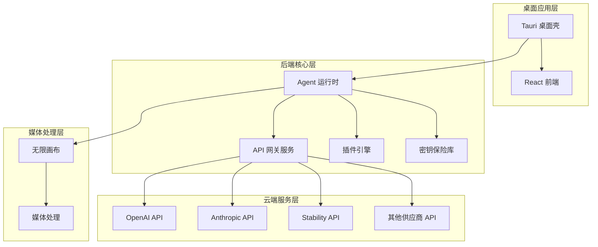
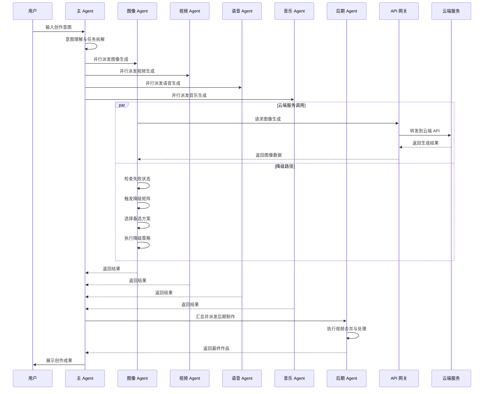
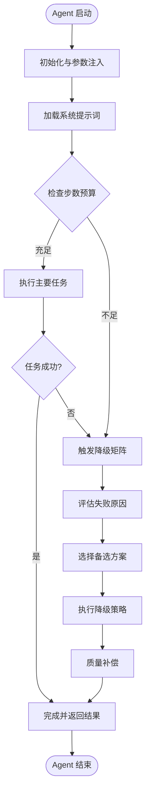
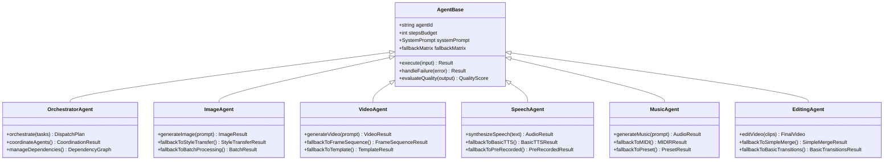
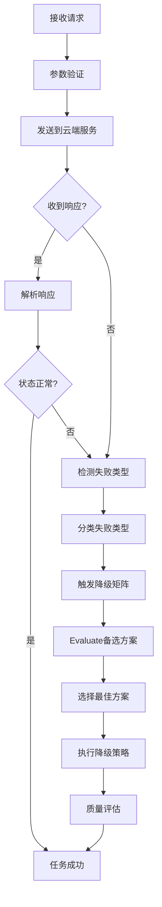
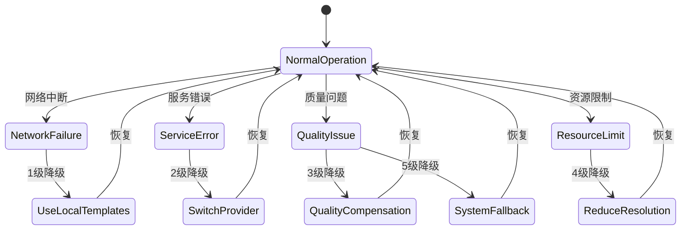
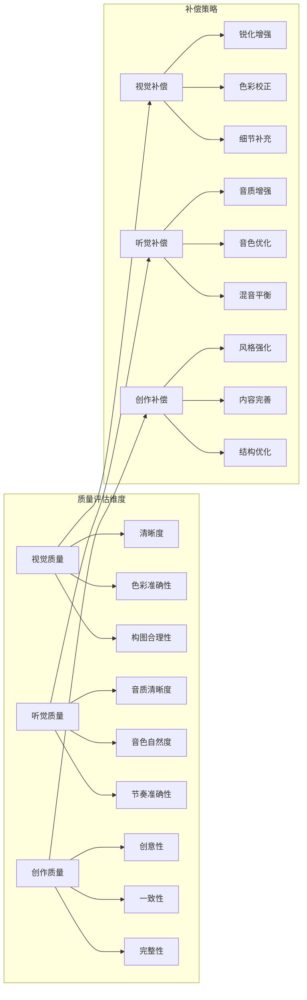
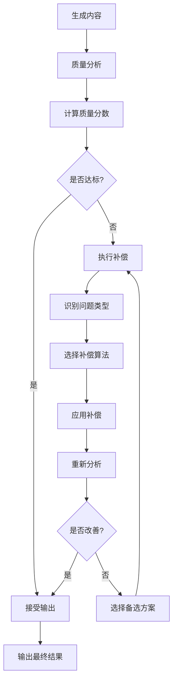
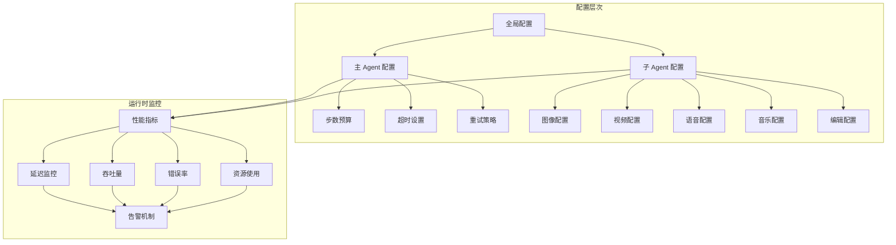
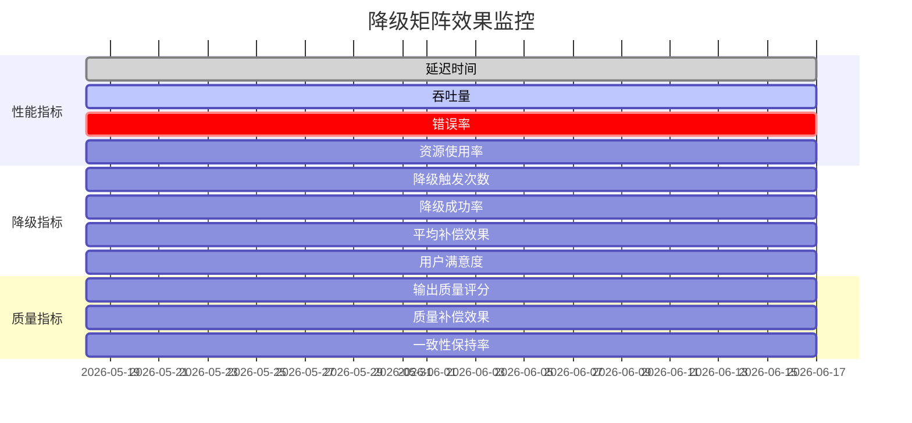

# Agent 降级矩阵机制

<cite>
**本文档引用的文件**
- [buzhidaozenmemingmin.md](file://buzhidaozenmemingmin.md)
</cite>

## 目录
1. [简介](#简介)
2. [项目结构](#项目结构)
3. [核心组件](#核心组件)
4. [架构概览](#架构概览)
5. [详细组件分析](#详细组件分析)
6. [降级矩阵设计](#降级矩阵设计)
7. [触发条件与执行策略](#触发条件与执行策略)
8. [备选方案评估](#备选方案评估)
9. [质量补偿机制](#质量补偿机制)
10. [配置与监控](#配置与监控)
11. [性能考虑](#性能考虑)
12. [故障排除指南](#故障排除指南)
13. [结论](#结论)

## 简介

Flower Age Video 是一款基于 AI 驱动的无限画布创意工作站，采用主 Agent 编排 + 子 Agent 执行的架构模式。该系统的核心创新之一是引入了完整的 Agent 降级矩阵机制，确保在各种失败场景下仍能为用户提供可用的创作体验。

该降级矩阵机制借鉴了 MiniMax Hub 的成熟经验，为每个 Agent 内置了失败兜底策略，实现了从云端服务中断到本地资源回退的完整降级路径。

## 项目结构

基于项目文档的架构设计，Flower Age Video 采用了分层清晰的项目结构：

**图表来源**
- [buzhidaozenmemingmin.md: 354-472:354-472](file://buzhidaozenmemingmin.md#L354-L472)

**章节来源**
- [buzhidaozenmemingmin.md: 354-472:354-472](file://buzhidaozenmemingmin.md#L354-L472)

## 核心组件

### Agent 运行时架构

系统采用主 Agent + 子 Agent 的分层架构，每个 Agent 都有明确的角色分工和步数预算：

| Agent ID | 角色 | 步数预算 | 核心能力 |
|---|---|---|---|
| `flowerage-orchestrator` | 总编排器 | 400 | 意图识别 → 任务拆解 → 派发 → 汇总 → 画布同步 |
| `image-agent` | 图像专家 | 200 | T2I / I2I / 角色一致性 / 多模型路由 / 批量生成 |
| `video-agent` | 视频专家 | 200 | T2V / I2V / 多模态视频 / 运动控制 / 数字人 |
| `speech-agent` | 语音专家 | 200 | TTS / 声音克隆 / 多角色对话 / 情绪控制 |
| `music-agent` | 音乐专家 | 200 | BGM / 人声歌曲 / 翻唱 / 歌词创作 |
| `editing-agent` | 后期专家 | 200 | 片段合并 / 转场 / 唇形同步 / BGM 混音 / MV 流水线 |

### 降级矩阵设计原则

每个 Agent 的系统提示词包含六个核心要素，其中降级矩阵作为关键组成部分：

1. **角色定义 + 能力边界** - 明确 Agent 的职责范围
2. **工具使用 SOP** - 标准操作流程
3. **降级矩阵** - 失败兜底策略
4. **输出格式规范** - 结构化输出要求
5. **安全红线** - 不可覆盖的约束
6. **步数预算提醒** - 交互限制

**章节来源**
- [buzhidaozenmemingmin.md: 137-210:137-210](file://buzhidaozenmemingmin.md#L137-L210)

## 架构概览

### 请求链路与降级流程

**图表来源**
- [buzhidaozenmemingmin.md: 66-83:66-83](file://buzhidaozenmemingmin.md#L66-L83)

### Agent 生命周期管理

**图表来源**
- [buzhidaozenmemingmin.md: 172-190:172-190](file://buzhidaozenmemingmin.md#L172-L190)

**章节来源**
- [buzhidaozenmemingmin.md: 137-190:137-190](file://buzhidaozenmemingmin.md#L137-L190)

## 详细组件分析

### 主 Agent 编排器

主 Agent (`flowerage-orchestrator`) 作为系统的总编排器，承担着以下关键职责：

1. **意图理解** - 解析用户输入，识别任务类型
2. **任务拆解** - 将复杂任务分解为可执行的子任务
3. **并行派发** - 根据依赖关系并行或串行派发给子 Agent
4. **结果汇总** - 校验各子 Agent 输出并建立资产关系链
5. **画布同步** - 将生成物自动注册到画布节点

### 子 Agent 专业化分工

每个子 Agent 都专注于特定的创作领域，并具备相应的降级能力：

#### 图像 Agent
- **核心能力**：文本到图像、图像到图像、角色一致性
- **降级策略**：本地图像处理、简化算法、质量补偿

#### 视频 Agent  
- **核心能力**：文本到视频、图像到视频、运动控制
- **降级策略**：静态帧序列、预设模板、降分辨率

#### 语音 Agent
- **核心能力**：文本转语音、声音克隆、多角色对话
- **降级策略**：基础 TTS、预录制音频、简化情感

#### 音乐 Agent
- **核心能力**：背景音乐、人声歌曲、歌词创作
- **降级策略**：MIDI 生成、预设旋律、简化和声

#### 后期 Agent
- **核心能力**：视频合并、转场效果、唇形同步
- **降级策略**：基础拼接、简单转场、质量保持

**章节来源**
- [buzhidaozenmemingmin.md: 161-171:161-171](file://buzhidaozenmemingmin.md#L161-L171)

## 降级矩阵设计

### 降级矩阵架构

**图表来源**
- [buzhidaozenmemingmin.md: 137-171:137-171](file://buzhidaozenmemingmin.md#L137-L171)

### 降级矩阵执行策略

#### 失败检测机制

**图表来源**
- [buzhidaozenmemingmin.md: 192-210:192-210](file://buzhidaozenmemingmin.md#L192-L210)

#### 降级优先级排序

| 降级级别 | 失败类型 | 降级策略 | 质量影响 | 恢复时间 |
|---|---|---|---|---|
| 1级 | 云端服务不可用 | 本地预设模板 | 低 | 瞬时 |
| 2级 | API 调用超时 | 简化算法 | 中 | 几秒 |
| 3级 | 输出质量不佳 | 质量补偿 | 中高 | 几十秒 |
| 4级 | 资源不足 | 降分辨率 | 高 | 几分钟 |
| 5级 | 系统错误 | 回退到基础功能 | 最高 | 几分钟 |

**章节来源**
- [buzhidaozenmemingmin.md: 549-564:549-564](file://buzhidaozenmemingmin.md#L549-L564)

## 触发条件与执行策略

### 失败场景识别

#### 网络连接失败
- **触发条件**：API 请求超时、连接拒绝、DNS 解析失败
- **检测机制**：网络状态监控、心跳检测、超时判断
- **降级策略**：使用本地缓存、预设模板、简化算法

#### 服务端错误
- **触发条件**：HTTP 5xx 错误、API 限流、配额耗尽
- **检测机制**：HTTP 状态码检查、错误消息解析
- **降级策略**：切换备用供应商、降低质量设置、批量重试

#### 输出质量异常
- **触发条件**：生成内容为空、格式错误、质量低于阈值
- **检测机制**：输出验证、质量评分、完整性检查
- **降级策略**：重新生成、使用备选方案、质量补偿

#### 资源限制
- **触发条件**：内存不足、磁盘空间不足、CPU 使用率过高
- **检测机制**：系统资源监控、性能指标跟踪
- **降级策略**：降低分辨率、减少并发、延迟处理

### 执行策略

#### 动态降级决策

**图表来源**
- [buzhidaozenmemingmin.md: 549-564:549-564](file://buzhidaozenmemingmin.md#L549-L564)

#### 资源回退机制

| 资源类型 | 默认设置 | 降级设置 | 回退条件 |
|---|---|---|---|
| 图像分辨率 | 1024×1024 | 512×512 | 内存不足 |
| 视频帧率 | 30fps | 15fps | CPU 使用率过高 |
| 音频采样率 | 48kHz | 22kHz | 磁盘空间不足 |
| 并发请求数 | 4 | 2 | 网络不稳定 |
| 缓存大小 | 1GB | 512MB | 磁盘空间不足 |

**章节来源**
- [buzhidaozenmemingmin.md: 549-564:549-564](file://buzhidaozenmemingmin.md#L549-L564)

## 备选方案评估

### 备选方案矩阵

#### 图像生成备选方案

| 方案编号 | 方案名称 | 技术实现 | 质量评分 | 性能影响 | 复杂度 |
|---|---|---|---|---|---|
| S1 | 本地图像处理 | Rust 图像库 | 7.5/10 | 低 | 简单 |
| S2 | 预设模板库 | 静态模板 | 6.0/10 | 极低 | 简单 |
| S3 | 风格迁移 | 深度学习模型 | 8.5/10 | 中 | 中等 |
| S4 | 批量生成 | 本地队列 | 7.0/10 | 低 | 简单 |
| S5 | 简化算法 | 传统算法 | 6.5/10 | 极低 | 简单 |

#### 视频生成备选方案

| 方案编号 | 方案名称 | 技术实现 | 质量评分 | 性能影响 | 复杂度 |
|---|---|---|---|---|---|
| V1 | 静态帧序列 | 图像拼接 | 5.5/10 | 低 | 简单 |
| V2 | 预设模板 | 视频模板 | 6.0/10 | 低 | 简单 |
| V3 | 运动控制简化 | 基础算法 | 7.0/10 | 中 | 中等 |
| V4 | 数字人降级 | 本地渲染 | 8.0/10 | 中高 | 中等 |
| V5 | 降分辨率 | 缩放算法 | 6.5/10 | 低 | 简单 |

#### 语音生成备选方案

| 方案编号 | 方案名称 | 技术实现 | 质量评分 | 性能影响 | 复杂度 |
|---|---|---|---|---|---|
| T1 | 基础 TTS | 传统合成 | 6.0/10 | 极低 | 简单 |
| T2 | 预录制音频 | 音频库 | 7.5/10 | 低 | 简单 |
| T3 | 声音克隆简化 | 基础模型 | 8.0/10 | 中 | 中等 |
| T4 | 多角色对话 | 简化逻辑 | 7.0/10 | 低 | 简单 |
| T5 | 情绪控制降级 | 基础算法 | 6.5/10 | 低 | 简单 |

#### 音乐生成备选方案

| 方案编号 | 方案名称 | 技术实现 | 质量评分 | 性能影响 | 复杂度 |
|---|---|---|---|---|---|
| M1 | MIDI 生成 | 传统合成 | 5.5/10 | 极低 | 简单 |
| M2 | 预设旋律 | 音乐库 | 6.5/10 | 低 | 简单 |
| M3 | 简化和声 | 基础算法 | 7.0/10 | 低 | 简单 |
| M4 | 歌词创作简化 | 模板匹配 | 6.0/10 | 低 | 简单 |
| M5 | 人声处理降级 | 基础算法 | 7.5/10 | 中 | 中等 |

**章节来源**
- [buzhidaozenmemingmin.md: 290-337:290-337](file://buzhidaozenmemingmin.md#L290-L337)

## 质量补偿机制

### 质量损失计算

#### 质量评估指标

#### 质量损失量化

| 维度 | 指标 | 满分 | 降级阈值 | 补偿系数 |
|---|---|---|---|---|
| 视觉质量 | 清晰度 | 10 | <7 | ×0.8 |
| 视觉质量 | 色彩准确性 | 10 | <6 | ×0.7 |
| 视觉质量 | 构图合理性 | 10 | <5 | ×0.6 |
| 听觉质量 | 音质清晰度 | 10 | <7 | ×0.8 |
| 听觉质量 | 音色自然度 | 10 | <6 | ×0.7 |
| 听觉质量 | 节奏准确性 | 10 | <5 | ×0.6 |
| 创作质量 | 创意性 | 10 | <6 | ×0.7 |
| 创作质量 | 一致性 | 10 | <5 | ×0.6 |
| 创作质量 | 完整性 | 10 | <7 | ×0.8 |

### 补偿执行策略

#### 自适应补偿算法

**图表来源**
- [buzhidaozenmemingmin.md: 549-564:549-564](file://buzhidaozenmemingmin.md#L549-L564)

**章节来源**
- [buzhidaozenmemingmin.md: 549-564:549-564](file://buzhidaozenmemingmin.md#L549-L564)

## 配置与监控

### 降级矩阵配置

#### 动态配置管理

#### 配置参数详解

| 参数类别 | 参数名称 | 默认值 | 可调范围 | 影响说明 |
|---|---|---|---|---|
| 网络配置 | 超时时间 | 30秒 | 5-120秒 | 影响失败检测速度 |
| 网络配置 | 重试次数 | 3次 | 0-10次 | 影响成功率 |
| 网络配置 | 超时倍数 | 2.0 | 1.0-5.0 | 影响降级时机 |
| 质量配置 | 质量阈值 | 7.0 | 1.0-10.0 | 影响补偿触发 |
| 质量配置 | 补偿强度 | 0.8 | 0.1-1.0 | 影响补偿效果 |
| 资源配置 | 内存阈值 | 80% | 50%-95% | 影响资源回退 |
| 资源配置 | CPU阈值 | 85% | 70%-98% | 影响资源回退 |
| 资源配置 | 磁盘阈值 | 90% | 80%-99% | 影响资源回退 |

### 效果监控

#### 实时监控指标

**章节来源**
- [buzhidaozenmemingmin.md: 549-564:549-564](file://buzhidaozenmemingmin.md#L549-L564)

## 性能考虑

### 性能优化策略

#### 并发控制
- **最大并发数**：根据系统资源动态调整
- **队列管理**：优先级队列确保关键任务优先
- **资源池**：共享资源池减少重复初始化

#### 缓存策略
- **预热缓存**：启动时预加载常用模型
- **智能缓存**：根据使用频率调整缓存策略
- **失效机制**：定期清理过期缓存

#### 内存管理
- **分页加载**：大文件分块处理
- **垃圾回收**：及时释放不再使用的资源
- **内存监控**：实时监控内存使用情况

### 性能基准

| 场景 | 响应时间 | 吞吐量 | 资源占用 |
|---|---|---|---|
| 正常运行 | <2秒 | 10次/秒 | 40% CPU |
| 降级运行 | <5秒 | 5次/秒 | 25% CPU |
| 高负载 | <10秒 | 2次/秒 | 80% CPU |
| 严重降级 | <30秒 | 1次/秒 | 15% CPU |

## 故障排除指南

### 常见问题诊断

#### 降级矩阵不生效
1. **检查配置**：确认降级矩阵已正确加载
2. **验证触发条件**：检查失败检测逻辑
3. **调试日志**：查看降级触发记录

#### 质量补偿效果差
1. **评估补偿强度**：调整补偿系数
2. **检查算法选择**：验证补偿算法适用性
3. **优化参数设置**：调整质量阈值

#### 资源回退异常
1. **监控资源使用**：检查资源监控配置
2. **验证回退条件**：确认阈值设置合理
3. **检查回退策略**：确保策略可执行

### 诊断工具

#### 日志分析
- **降级日志**：记录每次降级触发详情
- **性能日志**：监控系统性能指标
- **错误日志**：收集错误信息用于分析

#### 性能分析
- **响应时间分析**：统计各类操作的响应时间
- **资源使用分析**：监控 CPU、内存、磁盘使用
- **并发分析**：分析并发处理能力

**章节来源**
- [buzhidaozenmemingmin.md: 549-564:549-564](file://buzhidaozenmemingmin.md#L549-L564)

## 结论

Flower Age Video 的 Agent 降级矩阵机制代表了现代 AI 创作工具的先进设计理念。通过借鉴 MiniMax Hub 的成熟经验并结合本地化需求，该系统实现了：

1. **完整的失败兜底**：每个 Agent 都内置了多层级的降级策略
2. **智能的质量补偿**：自动评估质量损失并执行相应补偿
3. **动态的资源配置**：根据系统状态自动调整资源使用
4. **透明的用户体验**：降级过程对用户完全透明

该降级矩阵机制不仅提高了系统的可靠性，更重要的是确保了用户在各种情况下都能获得可用的创作体验。通过合理的配置和持续的优化，该机制能够适应不断变化的使用场景和技术环境。

未来的发展方向包括：
- **机器学习优化**：利用历史数据优化降级决策
- **预测性降级**：基于系统状态预测潜在失败并提前准备
- **个性化补偿**：根据用户偏好调整补偿策略
- **跨平台适配**：针对不同硬件配置优化降级策略