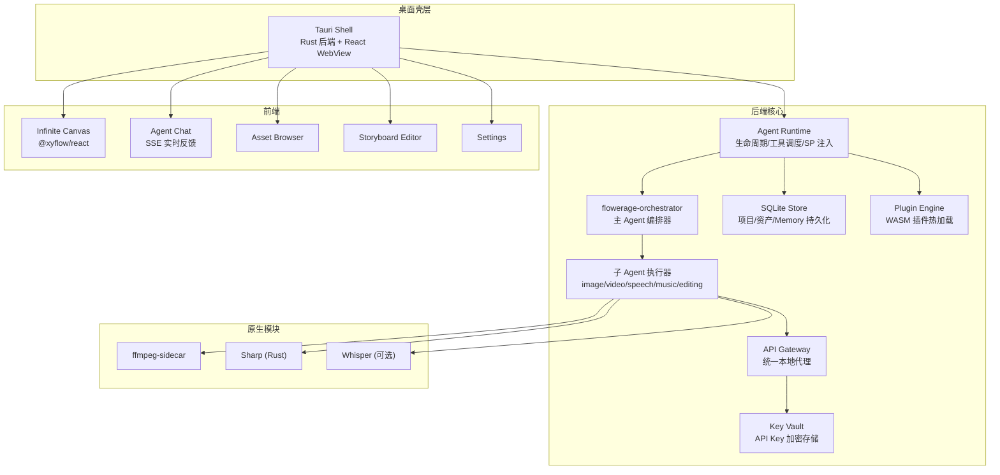
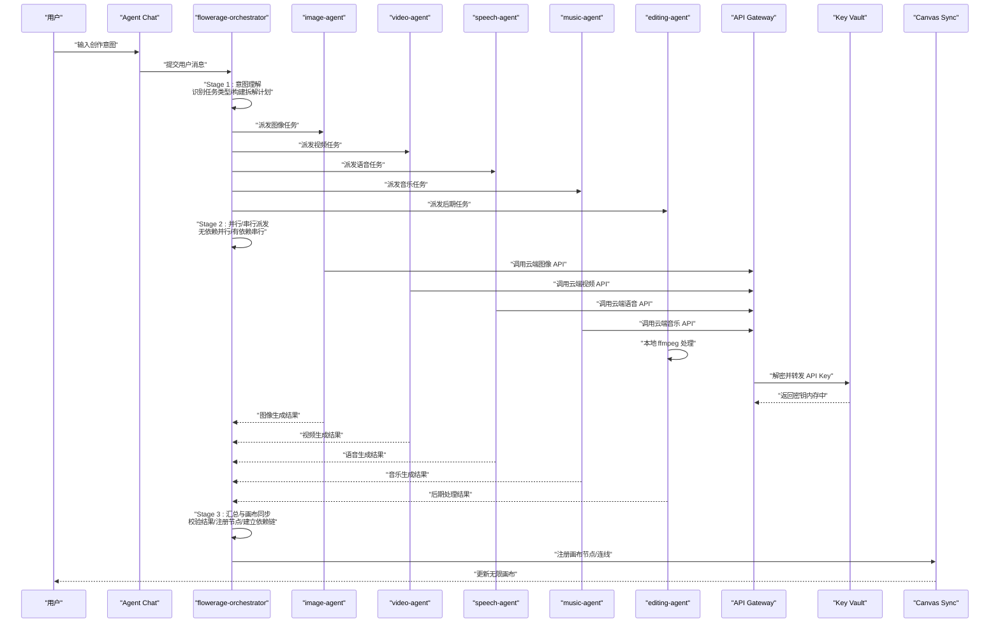
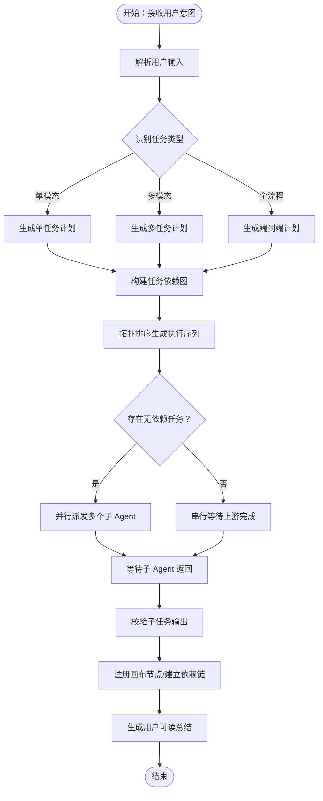
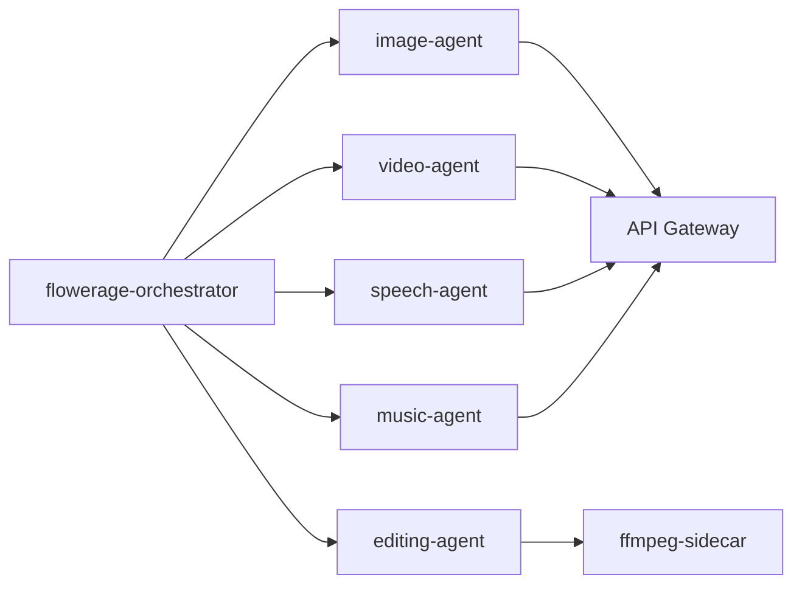
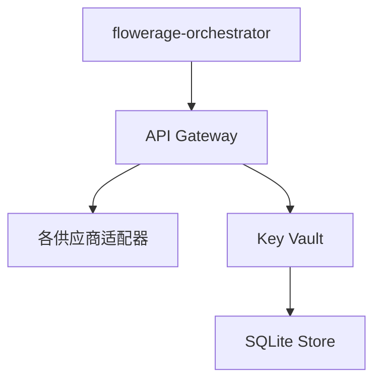
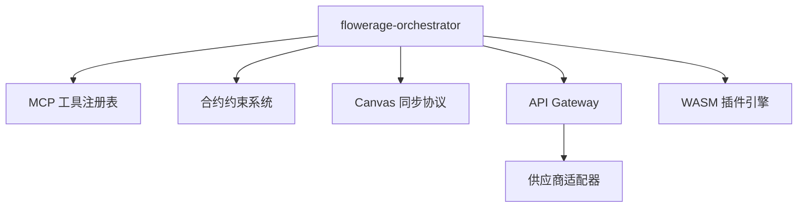

# 主 Agent 编排系统

<cite>
**本文引用的文件**
- [buzhidaozenmemingmin.md](file://buzhidaozenmemingmin.md)
</cite>

## 目录
1. [简介](#简介)
2. [项目结构](#项目结构)
3. [核心组件](#核心组件)
4. [架构总览](#架构总览)
5. [详细组件分析](#详细组件分析)
6. [依赖分析](#依赖分析)
7. [性能考虑](#性能考虑)
8. [故障排查指南](#故障排查指南)
9. [结论](#结论)
10. [附录](#附录)

## 简介
本文件面向“主 Agent 编排系统”的技术文档，聚焦于 flowerage-orchestrator 的核心职责与实现蓝图：意图理解、任务拆解、并行/串行派发、结果汇总；阐述其决策算法、任务依赖分析、执行计划生成与资源调度策略；描述主 Agent 的系统提示词（SP）设计、工具调用流程、步数预算控制与错误处理机制；并提供编排流程图、任务依赖图、执行计划表与性能监控指标，以及编排器配置方法、调试技巧与优化建议。

## 项目结构
根据仓库文档，Flower Age Video 采用“主 Agent 编排 + 子 Agent 执行”的分层架构，桌面壳层为 Tauri（Rust），后端核心为 Rust Agent Runtime，前端为 React + @xyflow/react 无限画布。编排器位于后端 Rust 模块中，负责将用户意图转化为可执行的任务计划，并驱动子 Agent 并行/串行执行，最终将产物注册到无限画布。



图表来源
- [buzhidaozenmemingmin.md:29-83](file://buzhidaozenmemingmin.md#L29-L83)

章节来源
- [buzhidaozenmemingmin.md:27-83](file://buzhidaozenmemingmin.md#L27-L83)

## 核心组件
- 主编排器（flowerage-orchestrator）
  - 角色：总编排器，职责：理解用户意图 → 拆解任务 → 派发子 Agent → 汇总结果 → 更新画布
  - 步数预算：400
  - 工具集：任务拆解 / 画布读写 / Memory / 派发
- 子 Agent（image/video/speech/music/editing）
  - 各自领域专家，步数预算：200
  - 工具集：对应领域的生成/处理能力与降级矩阵
- Agent Runtime
  - 生命周期管理、工具调度、SP 注入、步数限制
- API Gateway
  - 本地统一代理，路由到各 AI 供应商 API
- Key Vault
  - API Key 本地加密存储（AES-256-GCM + Windows DPAPI）
- 无限画布（Infinite Canvas）
  - 节点式画布，支持无限缩放、拖拽、连线、分组、小地图、对齐吸附
- 媒体处理（ffmpeg、Sharp、Whisper）
  - 媒体编解码/合并/转场、高性能图像处理、本地语音转文字

章节来源
- [buzhidaozenmemingmin.md:137-171](file://buzhidaozenmemingmin.md#L137-L171)
- [buzhidaozenmemingmin.md:172-190](file://buzhidaozenmemingmin.md#L172-L190)
- [buzhidaozenmemingmin.md:213-262](file://buzhidaozenmemingmin.md#L213-L262)
- [buzhidaozenmemingmin.md:266-350](file://buzhidaozenmemingmin.md#L266-L350)

## 架构总览
下图展示了从用户输入意图到最终画布同步的完整请求链路，体现主 Agent 的三阶段编排流程：意图理解、并行派发、汇总与画布同步。



图表来源
- [buzhidaozenmemingmin.md:66-83](file://buzhidaozenmemingmin.md#L66-L83)
- [buzhidaozenmemingmin.md:172-190](file://buzhidaozenmemingmin.md#L172-L190)

## 详细组件分析

### 主编排器（flowerage-orchestrator）设计
- 角色与职责
  - 意图理解：解析用户输入，识别任务类型（单模态/多模态/全流程）
  - 任务拆解：将复杂创作意图分解为可并行/可串行的子任务
  - 并行/串行派发：依据任务依赖关系，决定同时执行或顺序执行
  - 结果汇总：校验子 Agent 输出，统一格式并触发画布同步
- 决策算法与执行计划
  - 决策表：主 Agent SP 中包含 Stage 决策表与派发规则
  - 依赖分析：基于输入/输出节点关系建立任务依赖图
  - 执行计划：生成拓扑序的执行序列，确保无依赖任务尽早并行
- 工具调用流程
  - 使用 MCP 风格工具注册表进行工具发现与调用
  - 通过 API Gateway 路由到各供应商 API，Key Vault 提供加密存储的 API Key
- 步数预算控制
  - 主 Agent 步数预算：400；子 Agent 步数预算：200
  - 步数预算提醒与降级矩阵：在 SP 中明确步数限制与失败兜底策略
- 错误处理机制
  - 降级矩阵：每个 Agent 内置失败兜底链（如备用模型/供应商）
  - 合约约束：Anti-Loop、Canvas Discipline、Model Routing、Output Format、Memory Discipline 等
  - 流校验：后期 Agent 对输出流进行严格的时间戳校验（Δ ≤ 0.08s）



图表来源
- [buzhidaozenmemingmin.md:172-190](file://buzhidaozenmemingmin.md#L172-L190)
- [buzhidaozenmemingmin.md:192-210](file://buzhidaozenmemingmin.md#L192-L210)

章节来源
- [buzhidaozenmemingmin.md:137-171](file://buzhidaozenmemingmin.md#L137-L171)
- [buzhidaozenmemingmin.md:172-190](file://buzhidaozenmemingmin.md#L172-L190)
- [buzhidaozenmemingmin.md:192-210](file://buzhidaozenmemingmin.md#L192-L210)

### 子 Agent 体系
- 图像 Agent：T2I/I2I/角色一致性/多模型路由/批量生成
- 视频 Agent：T2V/I2V/多模态视频/运动控制/数字人
- 语音 Agent：TTS/声音克隆/多角色对话/情绪控制
- 音乐 Agent：BGM/人声歌曲/翻唱/歌词创作
- 后期 Agent：片段合并/转场/唇形同步/BGM 混音/MV 流水线



图表来源
- [buzhidaozenmemingmin.md:162-171](file://buzhidaozenmemingmin.md#L162-L171)
- [buzhidaozenmemingmin.md:266-288](file://buzhidaozenmemingmin.md#L266-L288)

章节来源
- [buzhidaozenmemingmin.md:162-171](file://buzhidaozenmemingmin.md#L162-L171)
- [buzhidaozenmemingmin.md:266-288](file://buzhidaozenmemingmin.md#L266-L288)

### 无限画布与节点系统
- 画布核心：无限缩放、拖拽布局、连线关系、分组节点、小地图、对齐吸附
- 节点类型：ProjectNode、TextNode、ImageNode、VideoNode、AudioNode、StoryboardNode、TaskNode、GroupNode
- 状态管理：Zustand 管理节点/边、操作、视口、项目上下文、Agent 集成映射与同步

```mermaid
classDiagram
class CanvasState {
+nodes : Node[]
+edges : Edge[]
+addNode(node)
+removeNode(id)
+connectNodes(source, target)
+viewport : {x, y, zoom}
+currentProjectId : string
+agentTaskMap : Map<string, string>
+syncAgentResult(taskId, result)
}
```

图表来源
- [buzhidaozenmemingmin.md:239-262](file://buzhidaozenmemingmin.md#L239-L262)

章节来源
- [buzhidaozenmemingmin.md:213-262](file://buzhidaozenmemingmin.md#L213-L262)

### API 网关与 Key Vault
- API Gateway：统一本地代理，路由到各供应商 API（OpenAI、Anthropic、Stability、Midjourney、Runway、Kling、MiniMax、ElevenLabs、Suno 等）
- Key Vault：API Key 本地加密存储（AES-256-GCM + Windows DPAPI），密文存储于 SQLite，解密仅在调用时于内存中短暂停留



图表来源
- [buzhidaozenmemingmin.md:266-350](file://buzhidaozenmemingmin.md#L266-L350)

章节来源
- [buzhidaozenmemingmin.md:266-350](file://buzhidaozenmemingmin.md#L266-L350)

## 依赖分析
- 组件耦合与内聚
  - 主编排器与子 Agent 通过工具注册表与 API Gateway 解耦
  - 画布同步通过统一协议与节点持久化实现低耦合集成
- 外部依赖与集成点
  - 云端 AI 供应商 API（通过本地代理直连）
  - 媒体处理（ffmpeg-sidecar）、图像处理（Sharp）、语音识别（Whisper）
- 合约与约束
  - Anti-Loop、Canvas Discipline、Model Routing、Output Format、Memory Discipline 等合约保障系统稳定性与一致性



图表来源
- [buzhidaozenmemingmin.md:395-415](file://buzhidaozenmemingmin.md#L395-L415)
- [buzhidaozenmemingmin.md:476-545](file://buzhidaozenmemingmin.md#L476-L545)

章节来源
- [buzhidaozenmemingmin.md:395-415](file://buzhidaozenmemingmin.md#L395-L415)
- [buzhidaozenmemingmin.md:476-545](file://buzhidaozenmemingmin.md#L476-L545)

## 性能考虑
- 并行度与吞吐
  - 无依赖任务尽可能并行执行，减少端到端时延
  - 子 Agent 步数预算与工具调用频率需平衡，避免超限导致降级
- 资源调度
  - 依据任务类型与供应商能力进行模型路由与速率限制
  - 后期处理（ffmpeg）应按可用 CPU/GPU 资源动态调整并发
- 存储与 I/O
  - 画布节点与资产索引采用 SQLite 持久化，注意批量写入与事务优化
  - 媒体文件采用分层目录结构，避免单目录过大
- 监控指标
  - 关键指标：任务完成时延、并行度、API 调用成功率、CPU/内存占用、磁盘 I/O、ffmpeg 处理耗时
  - 建议：通过 SSE 推送实时进度，结合前端图表展示

## 故障排查指南
- 步数超限
  - 现象：Agent 在预算内无法完成任务
  - 处理：启用降级矩阵，切换备用模型/供应商，缩短提示词长度
- 依赖死锁
  - 现象：多个子任务互相等待上游输出
  - 处理：检查任务依赖图，必要时引入中间节点或拆分任务
- API Key 问题
  - 现象：API 调用失败或权限不足
  - 处理：确认 Key Vault 加密存储正确，解密流程仅在内存中短暂存在
- 画布同步异常
  - 现象：节点未注册或连线缺失
  - 处理：检查 Canvas 同步协议与节点持久化逻辑，核对 sourceNodeId 关系链
- 流校验失败
  - 现象：后期输出流时间戳偏差过大
  - 处理：回退到更稳定的供应商/模型，或调整转场参数

章节来源
- [buzhidaozenmemingmin.md:192-210](file://buzhidaozenmemingmin.md#L192-L210)
- [buzhidaozenmemingmin.md:338-350](file://buzhidaozenmemingmin.md#L338-L350)
- [buzhidaozenmemingmin.md:549-593](file://buzhidaozenmemingmin.md#L549-L593)

## 结论
flowerage-orchestrator 以“意图理解—任务拆解—并行/串行派发—结果汇总”为主线，结合 MCP 风格工具注册、合约约束与降级矩阵，形成稳定可靠的主 Agent 编排体系。通过无限画布与统一 API 网关，系统实现了从创意到成品的一站式本地化工作流。未来可在执行计划优化、资源调度智能化与监控可视化方面持续迭代。

## 附录
- 编排器配置方法
  - 步数预算：主 Agent 400，子 Agent 200；在 SP 中明确步数提醒与降级策略
  - 工具注册：通过 MCP 风格工具注册表集中管理
  - 画布同步：遵循 Canvas 同步协议，建立 sourceNodeId 资产关系链
- 调试技巧
  - 使用 SSE 实时观察 Agent 进度
  - 分阶段验证：先验证意图理解与任务拆解，再验证派发与汇总
  - 利用最小可行任务（MVP）快速定位问题
- 优化建议
  - 任务依赖图预计算与缓存
  - 子任务粒度与并行度的动态调节
  - API 调用批量化与重试退避
  - 媒体处理流水线的硬件加速利用