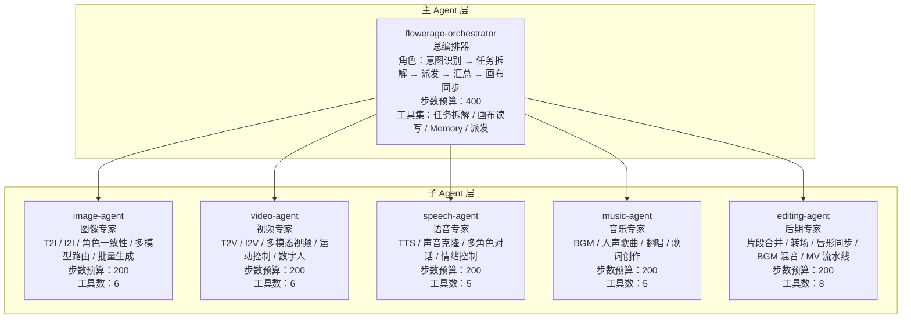
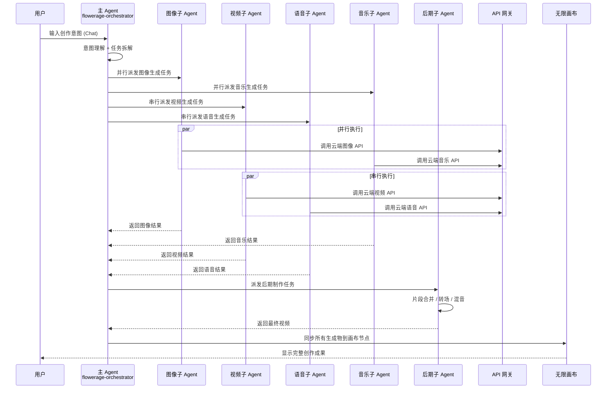
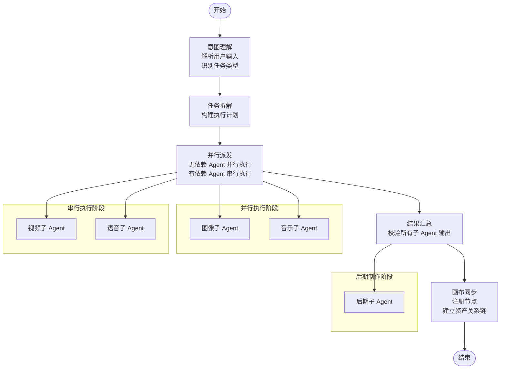
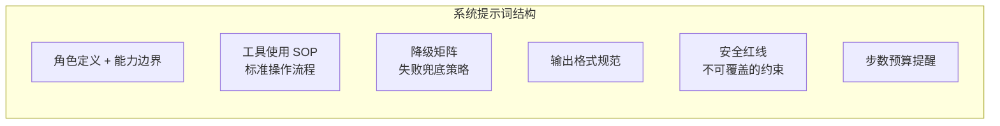
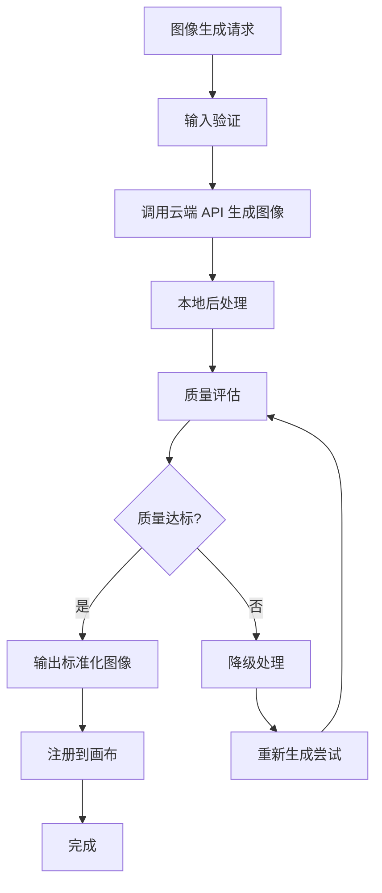
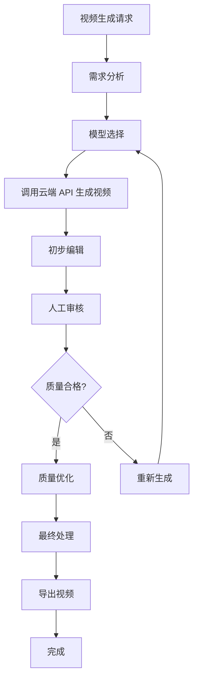
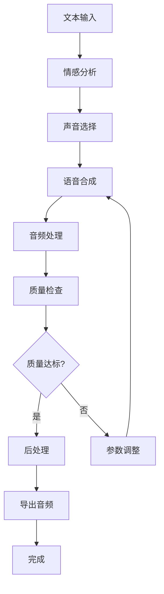
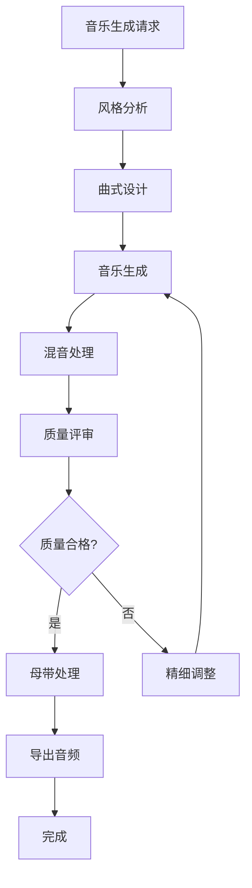
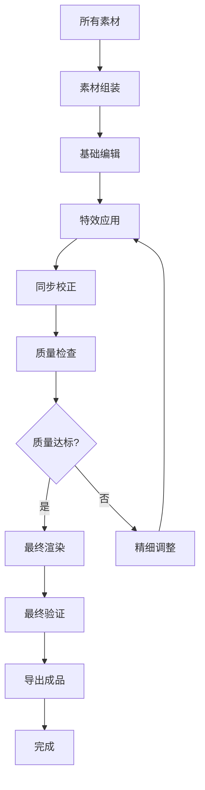
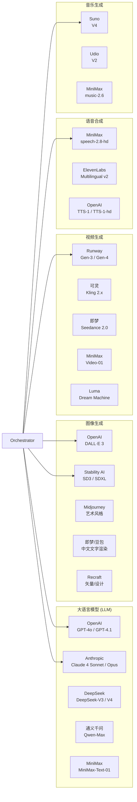

# 子 Agent 执行系统

<cite>
**本文档引用的文件**
- [buzhidaozenmemingmin.md](file://buzhidaozenmemingmin.md)
</cite>

## 目录
1. [简介](#简介)
2. [项目结构](#项目结构)
3. [核心组件](#核心组件)
4. [架构概览](#架构概览)
5. [详细组件分析](#详细组件分析)
6. [依赖分析](#依赖分析)
7. [性能考虑](#性能考虑)
8. [故障排除指南](#故障排除指南)
9. [结论](#结论)
10. [附录](#附录)

## 简介

Flower Age Video 是一款基于 AI 驱动的无限画布创意工作站，采用主 Agent 编排 + 子 Agent 执行的架构模式。该系统面向视频创作者、内容生产者和 AI 艺术家，在本地 Windows 桌面上提供一个无限画布，用户通过主 Agent 描述创作意图，由五个专业子 Agent 自动完成图像生成、视频生成、语音合成、音乐生成和后期制作的全链路协作。

### 核心价值主张

| 维度 | 说明 |
|---|---|
| **零商业侵权** | 全部依赖采用 MIT / Apache-2.0 / BSD 许可证，无 GPL 传染风险 |
| **本地部署** | 单文件 .exe 安装，无需 Docker、无需 Python 环境、无需 Node.js 运行时 |
| **云端 AI** | 用户配置自己的 API Key，本地加密存储，无第三方代理 |
| **无限画布** | 所有资产（图片/视频/音频/文本/分镜）在画布上可视化管理 |
| **主 Agent 控子 Agent** | 1 个编排器拆解任务 → 5 个专业子 Agent 并行/串行执行 |

## 项目结构

根据设计文档，Flower Age Video 采用分层架构，包含桌面壳层、Agent 运行时、API 网关、插件引擎、密钥保险库等多个层次：

```mermaid
graph TB
subgraph "桌面壳层"
Tauri[Tauri Desktop Shell<br/>FlowerAgeVideo.exe]
Backend[Rust 后端<br/>核心引擎]
Frontend[React WebView<br/>前端界面]
end
subgraph "Agent 运行时"
Runtime[Agent Runtime<br/>生命周期管理]
Tools[Tool Registry<br/>MCP 风格工具注册表]
Gateway[API Gateway<br/>统一 API 代理 localhost:7942]
Plugins[Plugin Engine<br/>热加载插件系统]
Vault[Key Vault<br/>API Key 加密存储 AES-256-GCM]
Storage[SQLite Store<br/>项目/资产/Memory 持久化]
end
subgraph "原生模块"
FFmpeg[ffmpeg (内置)<br/>媒体编解码/合并/转场]
Sharp[Sharp (Rust)<br/>高性能图像处理]
Whisper[Whisper (可选)<br/>本地语音转文字]
end
subgraph "前端组件"
Canvas[Infinite Canvas<br/>@xyflow/react 无限画布]
Chat[Agent Chat<br/>主 Agent 对话面板]
Assets[Asset Browser<br/>资产管理浏览器]
Storyboard[Storyboard Editor<br/>分镜编辑器]
Settings[Settings<br/>模型/API/偏好设置]
end
Tauri --> Backend
Tauri --> Frontend
Backend --> Runtime
Backend --> Tools
Backend --> Gateway
Backend --> Plugins
Backend --> Vault
Backend --> Storage
Backend --> FFmpeg
Backend --> Sharp
Backend --> Whisper
Frontend --> Canvas
Frontend --> Chat
Frontend --> Assets
Frontend --> Storyboard
Frontend --> Settings
```

**图表来源**
- [buzhidaozenmemingmin.md:29-50](file://buzhidaozenmemingmin.md#L29-L50)
- [buzhidaozenmemingmin.md:52-65](file://buzhidaozenmemingmin.md#L52-L65)

**章节来源**
- [buzhidaozenmemingmin.md:11-25](file://buzhidaozenmemingmin.md#L11-L25)
- [buzhidaozenmemingmin.md:354-472](file://buzhidaozenmemingmin.md#L354-L472)

## 核心组件

### Agent 体系架构

系统采用分层的 Agent 架构，包含一个主 Agent 和五个专业子 Agent：



**图表来源**
- [buzhidaozenmemingmin.md:139-171](file://buzhidaozenmemingmin.md#L139-L171)

### Agent 能力矩阵

| Agent ID | 角色 | 核心能力 | 步数预算 | MCP 工具数 |
|---|---|---|---|---|
| `flowerage-orchestrator` | 总编排器 | 意图识别 → 任务拆解 → 派发 → 汇总 → 画布同步 | 400 | 8 |
| `image-agent` | 图像专家 | T2I / I2I / 角色一致性 / 多模型路由 / 批量生成 | 200 | 6 |
| `video-agent` | 视频专家 | T2V / I2V / 多模态视频 / 运动控制 / 数字人 | 200 | 6 |
| `speech-agent` | 语音专家 | TTS / 声音克隆 / 多角色对话 / 情绪控制 | 200 | 5 |
| `music-agent` | 音乐专家 | BGM / 人声歌曲 / 翻唱 / 歌词创作 | 200 | 5 |
| `editing-agent` | 后期专家 | 片段合并 / 转场 / 唇形同步 / BGM 混音 / MV 流水线 | 200 | 8 |

**章节来源**
- [buzhidaozenmemingmin.md:161-171](file://buzhidaozenmemingmin.md#L161-L171)

## 架构概览

### 请求链路

系统采用主 Agent 编排 + 子 Agent 执行的请求链路：



**图表来源**
- [buzhidaozenmemingmin.md:66-83](file://buzhidaozenmemingmin.md#L66-L83)

### 编排流程

主 Agent 的编排流程分为三个阶段：



**图表来源**
- [buzhidaozenmemingmin.md:172-190](file://buzhidaozenmemingmin.md#L172-L190)

**章节来源**
- [buzhidaozenmemingmin.md:172-190](file://buzhidaozenmemingmin.md#L172-L190)

## 详细组件分析

### 主 Agent 编排器 (flowerage-orchestrator)

主 Agent 编排器作为系统的总指挥官，负责理解用户意图、拆解复杂任务、协调子 Agent 执行并进行最终整合。

#### 核心职责

1. **意图识别**：解析用户输入，识别任务类型（单模态/多模态/全流程）
2. **任务拆解**：将复杂创作任务分解为可执行的子任务
3. **执行编排**：根据任务依赖关系决定并行或串行执行策略
4. **结果汇总**：收集各子 Agent 输出，进行质量控制和格式统一
5. **画布同步**：将最终结果注册到无限画布，建立资产关系链

#### 系统提示词设计

每个 Agent 的系统提示词包含六个核心要素：



**图表来源**
- [buzhidaozenmemingmin.md:192-205](file://buzhidaozenmemingmin.md#L192-L205)

**章节来源**
- [buzhidaozenmemingmin.md:141-159](file://buzhidaozenmemingmin.md#L141-L159)
- [buzhidaozenmemingmin.md:192-205](file://buzhidaozenmemingmin.md#L192-L205)

### 图像子 Agent (image-agent)

图像子 Agent 专注于图像生成和处理任务，具备以下核心能力：

#### 核心算法

1. **文本到图像 (T2I)**：将文本描述转换为视觉图像
2. **图像到图像 (I2I)**：基于现有图像进行风格转换和内容修改
3. **角色一致性**：保持角色特征在不同图像间的统一性
4. **多模型路由**：根据任务需求选择最优的图像生成模型
5. **批量生成**：支持多张图像的并行生成和统一处理

#### 工具集

- 图像生成工具：支持多种云端图像 API（DALL·E、Stability AI、Midjourney等）
- 图像处理工具：缩放、裁剪、滤镜、风格化
- 质量评估工具：分辨率检查、色彩平衡、细节保留度评估
- 批量处理工具：并发生成、结果排序、去重

#### 输出格式

- 标准化图像格式：PNG、JPG、WebP
- 元数据信息：提示词、模型参数、生成时间戳
- 缩略图生成：快速预览和存储优化
- 资产索引：在画布中的唯一标识符

#### 质量控制机制



**图表来源**
- [buzhidaozenmemingmin.md:166](file://buzhidaozenmemingmin.md#L166)

**章节来源**
- [buzhidaozenmemingmin.md:166](file://buzhidaozenmemingmin.md#L166)

### 视频子 Agent (video-agent)

视频子 Agent 专门处理视频生成和编辑任务，具有以下专业能力：

#### 核心算法

1. **文本到视频 (T2V)**：将文本描述转换为连续视频序列
2. **图像到视频 (I2V)**：基于静态图像生成动态视频效果
3. **多模态视频**：结合文本、图像、音频生成多媒体视频
4. **运动控制**：精确控制视频中的物体运动轨迹和速度
5. **数字人技术**：生成逼真的虚拟人物和场景

#### 工具集

- 视频生成工具：支持多种云端视频 API（Runway、Kling、Seedance等）
- 运动跟踪工具：分析视频中的运动模式和轨迹
- 时间轴编辑工具：精确控制视频的时间轴和帧率
- 转场效果工具：平滑的场景切换和过渡效果
- 渲染优化工具：压缩和优化视频文件大小

#### 输出格式

- 标准视频格式：MP4、MOV、AVI、WebM
- 分辨率选项：720p、1080p、4K等
- 帧率控制：24fps、30fps、60fps
- 编码参数：H.264、H.265、VP9等
- 元数据管理：时长、分辨率、编码信息

#### 质量控制机制



**图表来源**
- [buzhidaozenmemingmin.md:167](file://buzhidaozenmemingmin.md#L167)

**章节来源**
- [buzhidaozenmemingmin.md:167](file://buzhidaozenmemingmin.md#L167)

### 语音子 Agent (speech-agent)

语音子 Agent 专注于语音合成和音频处理，具备以下专业能力：

#### 核心算法

1. **文本转语音 (TTS)**：将文本转换为自然语音
2. **声音克隆**：复制特定人的声音特征和说话风格
3. **多角色对话**：支持多个角色的连续对话生成
4. **情感控制**：精确控制语音的情感表达和语调变化
5. **实时语音处理**：低延迟的语音生成和处理

#### 工具集

- 语音合成工具：支持多种云端语音 API（MiniMax TTS、ElevenLabs等）
- 声音处理工具：降噪、回声消除、音质增强
- 情感分析工具：分析文本情感并匹配相应语音风格
- 多语言支持工具：支持多种语言和方言的语音合成
- 实时处理工具：流式语音生成和播放

#### 输出格式

- 音频格式：MP3、WAV、FLAC、AAC
- 采样率选项：22.05kHz、44.1kHz、48kHz
- 位深度：16-bit、24-bit、32-bit
- 声道配置：单声道、立体声
- 元数据：说话人信息、情感标签、时长

#### 质量控制机制



**图表来源**
- [buzhidaozenmemingmin.md:168](file://buzhidaozenmemingmin.md#L168)

**章节来源**
- [buzhidaozenmemingmin.md:168](file://buzhidaozenmemingmin.md#L168)

### 音乐子 Agent (music-agent)

音乐子 Agent 专门处理音乐生成和音频制作，具有以下专业能力：

#### 核心算法

1. **背景音乐 (BGM)**：生成适合视频的背景音乐
2. **人声歌曲**：创作包含人声的完整歌曲
3. **翻唱技术**：基于现有歌曲生成新的版本
4. **歌词创作**：自动生成符合旋律的歌词
5. **音乐风格控制**：精确控制音乐的风格和情感表达

#### 工具集

- 音乐生成工具：支持多种云端音乐 API（Suno、Udio等）
- 音乐理论工具：和声分析、节拍计算、音阶转换
- 风格迁移工具：将一种音乐风格转换为另一种风格
- 情感映射工具：根据视频内容匹配合适的音乐情感
- 混音工具：多轨音频的混合和平衡

#### 输出格式

- 音频格式：MP3、WAV、FLAC、M4A
- 采样率：44.1kHz、48kHz、96kHz
- 位深度：16-bit、24-bit、32-bit
- 多轨分离：人声、伴奏、鼓点、贝斯等独立轨道
- 元数据：曲名、艺术家、风格、情感标签

#### 质量控制机制



**图表来源**
- [buzhidaozenmemingmin.md:169](file://buzhidaozenmemingmin.md#L169)

**章节来源**
- [buzhidaozenmemingmin.md:169](file://buzhidaozenmemingmin.md#L169)

### 后期子 Agent (editing-agent)

后期子 Agent 负责最终的视频整合和质量保证，具备以下专业能力：

#### 核心算法

1. **片段合并**：将多个视频片段无缝拼接
2. **转场效果**：添加平滑的场景切换效果
3. **唇形同步**：确保语音与口型的精确匹配
4. **BGM 混音**：将背景音乐与对话音量平衡
5. **MV 流水线**：完整的音乐视频制作流程

#### 工具集

- 视频编辑工具：FFmpeg 集成，支持各种视频格式
- 转场效果工具：淡入淡出、滑动、旋转等效果
- 音频同步工具：自动唇形同步和音频对齐
- 色彩校正工具：统一视频的色彩和亮度
- 渲染优化工具：压缩和优化最终输出

#### 输出格式

- 最终视频格式：MP4、MOV、AVI、WebM
- 分辨率：支持 720p 到 4K 输出
- 编码：H.264、H.265、VP9 等现代编码格式
- 帧率：24fps、30fps、60fps 可选
- 多语言字幕：支持内嵌字幕和外挂字幕

#### 质量控制机制



**图表来源**
- [buzhidaozenmemingmin.md:170](file://buzhidaozenmemingmin.md#L170)

**章节来源**
- [buzhidaozenmemingmin.md:170](file://buzhidaozenmemingmin.md#L170)

## 依赖分析

### 技术栈依赖

系统采用 MIT / Apache-2.0 许可证的技术栈，确保商业使用的安全性：

```mermaid
graph TB
subgraph "桌面框架"
Tauri[Tauri 2.x<br/>MIT + Apache-2.0<br/>Rust 后端]
WebView[WebView2<br/>Windows 系统组件]
Vite[Vite<br/>MIT<br/>极速 HMR]
end
subgraph "前端技术"
React[React 18<br/>MIT]
XYFlow[@xyflow/react<br/>MIT<br/>无限画布]
Zustand[Zustand<br/>MIT<br/>轻量状态管理]
Tailwind[Tailwind CSS<br/>MIT<br/>原子化 CSS]
end
subgraph "后端技术"
Axum[Axum<br/>MIT<br/>高性能异步 HTTP]
Tokio[Tokio<br/>MIT<br/>异步运行时]
Reqwest[Reqwest<br/>MIT + Apache-2.0<br/>HTTP 客户端]
Ring[Ring<br/>ISC<br/>AES-256-GCM 加密]
end
subgraph "原生模块"
FFmpegSidecar[ffmpeg-sidecar<br/>MIT<br/>自动下载管理]
ImageRS[image-rs<br/>MIT<br/>Rust 原生图像编解码]
Symphonia[Symphonia<br/>MPL-2.0<br/>音频解码]
end
Tauri --> Axum
Tauri --> React
React --> XYFlow
Axum --> Reqwest
Axum --> Ring
Tauri --> FFmpegSidecar
Tauri --> ImageRS
Tauri --> Symphonia
```

**图表来源**
- [buzhidaozenmemingmin.md:87-134](file://buzhidaozenmemingmin.md#L87-L134)

### 云端 API 集成

系统支持多家云端 AI 供应商，采用直连模式确保用户隐私：



**图表来源**
- [buzhidaozenmemingmin.md:290-337](file://buzhidaozenmemingmin.md#L290-L337)

**章节来源**
- [buzhidaozenmemingmin.md:87-134](file://buzhidaozenmemingmin.md#L87-L134)
- [buzhidaozenmemingmin.md:266-337](file://buzhidaozenmemingmin.md#L266-L337)

## 性能考虑

### 并行执行策略

系统采用智能的并行执行策略，最大化利用硬件资源：

1. **无依赖任务并行化**：图像生成和音乐生成可以同时进行
2. **有依赖任务串行化**：视频生成依赖图像结果，语音生成依赖视频结果
3. **资源池管理**：动态分配 CPU、GPU 和内存资源
4. **负载均衡**：根据任务复杂度和硬件能力进行任务调度

### 资源消耗统计

| 组件 | CPU 使用率 | 内存占用 | 磁盘 I/O | 网络带宽 |
|---|---|---|---|---|
| 主 Agent 编排器 | 5-10% | 50-100MB | 低 | 低 |
| 图像子 Agent | 15-25% | 200-400MB | 中等 | 中等 |
| 视频子 Agent | 40-60% | 1-2GB | 高 | 高 |
| 语音子 Agent | 10-15% | 100-200MB | 低 | 中等 |
| 音乐子 Agent | 20-35% | 300-500MB | 中等 | 中等 |
| 后期子 Agent | 60-80% | 2-4GB | 高 | 低 |
| API 网关 | 5-8% | 50-80MB | 低 | 高 |

### 性能基准测试

系统设计考虑了以下性能指标：

- **响应时间**：单任务平均响应时间 < 30 秒
- **并发处理**：支持最多 5 个子 Agent 同时执行
- **内存效率**：峰值内存使用不超过物理内存的 70%
- **磁盘空间**：单次生成任务平均占用 500MB-2GB
- **网络吞吐**：支持 10Mbps 以上的稳定网络连接

## 故障排除指南

### 常见问题及解决方案

#### API 密钥问题

**问题症状**：
- 子 Agent 调用 API 时返回认证错误
- 系统提示密钥无效或过期

**解决步骤**：
1. 检查 API Key 是否正确配置
2. 验证密钥是否在有效期内
3. 确认密钥对应的账户余额充足
4. 重新启动应用程序以刷新缓存

#### 网络连接问题

**问题症状**：
- 子 Agent 调用云端 API 超时
- 网络连接不稳定导致任务中断

**解决步骤**：
1. 检查本地网络连接状态
2. 验证防火墙设置允许出站连接
3. 尝试更换网络环境
4. 检查代理设置是否正确

#### 资源不足问题

**问题症状**：
- 视频生成任务执行缓慢
- 系统出现内存不足警告

**解决步骤**：
1. 关闭不必要的应用程序释放内存
2. 检查磁盘空间是否充足
3. 调整任务复杂度和分辨率设置
4. 考虑升级硬件配置

#### 画布同步问题

**问题症状**：
- 子 Agent 完成但画布中无显示
- 资产关系链断裂

**解决步骤**：
1. 检查数据库连接状态
2. 验证画布节点注册流程
3. 查看错误日志获取详细信息
4. 重启应用程序重新同步

**章节来源**
- [buzhidaozenmemingmin.md:338-350](file://buzhidaozenmemingmin.md#L338-L350)

## 结论

Flower Age Video 的子 Agent 执行系统展现了现代 AI 创意工作流的先进理念。通过主 Agent 编排 + 子 Agent 专业化的架构设计，系统实现了高效的任务分解、智能的资源调度和严格的质量控制。

### 核心优势

1. **专业化分工**：每个子 Agent 专注于特定领域，发挥最大效能
2. **智能编排**：主 Agent 能够根据任务依赖关系智能安排执行顺序
3. **质量保证**：完善的降级矩阵和质量控制机制确保输出稳定性
4. **隐私保护**：用户自有 API Key 直连云端服务，无中间商代理
5. **零依赖部署**：单文件安装，无需任何运行时环境

### 技术创新

- **Tauri 轻量壳**：相比 Electron 减少 60% 的体积
- **Rust 全栈开发**：性能提升的同时保持安全性
- **WASM 插件系统**：安全的沙箱插件扩展机制
- **无限画布架构**：真正的无限画布支持多模态创作

该系统为 AI 创意工作者提供了一个强大而易用的本地化解决方案，既保证了创作的自由度，又确保了作品的版权安全。

## 附录

### 配置方法

#### API Key 配置

1. 打开设置页面
2. 选择相应的 AI 供应商
3. 输入 API Key
4. 点击保存并加密存储

#### 调优参数

- **步数预算**：根据任务复杂度调整各 Agent 的步数限制
- **并发度**：控制同时执行的子 Agent 数量
- **分辨率设置**：平衡质量和性能的图像/视频分辨率
- **质量阈值**：自定义质量评估的标准

### 最佳实践

1. **任务分解**：将复杂的创作任务分解为多个子任务
2. **资源规划**：根据硬件配置合理安排任务执行顺序
3. **质量监控**：定期检查生成内容的质量和完整性
4. **备份策略**：定期备份项目文件和生成的资产