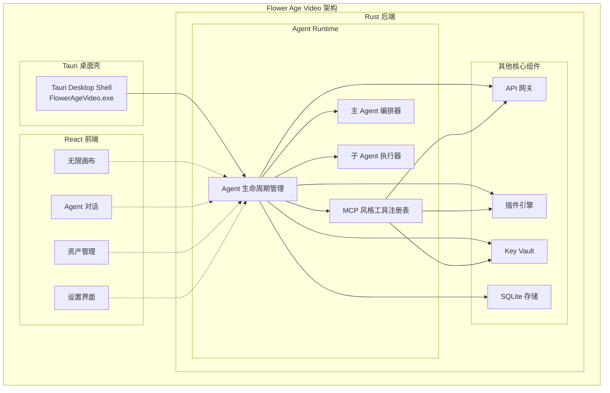
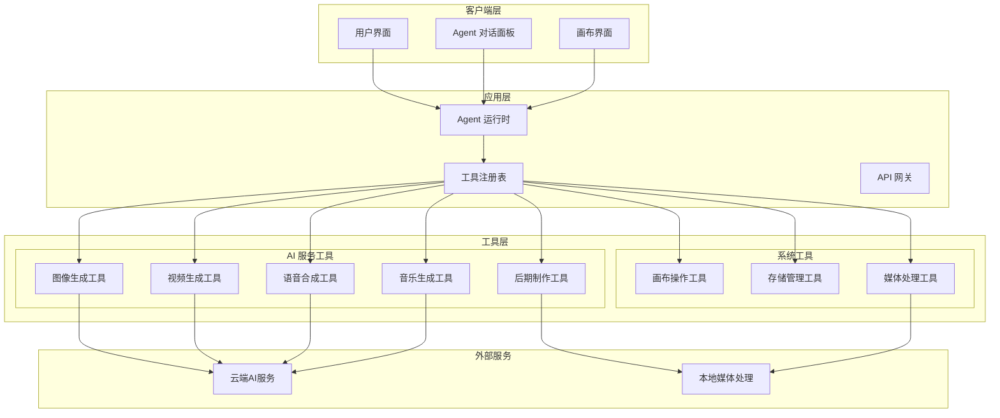
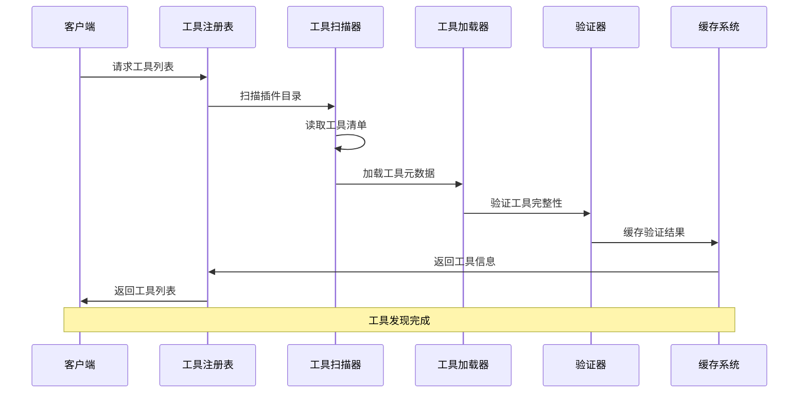
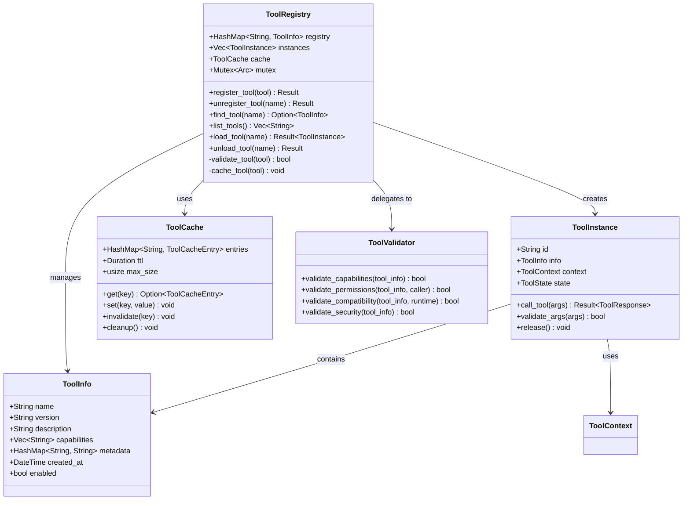
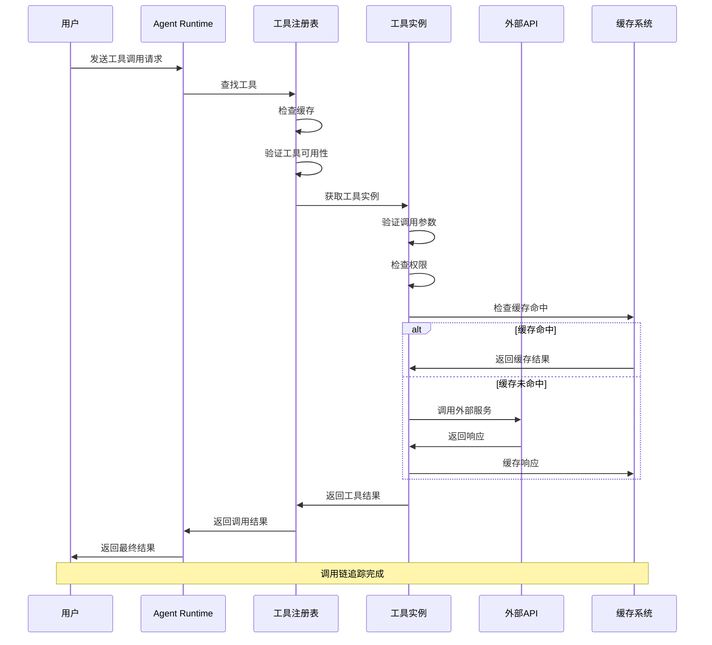
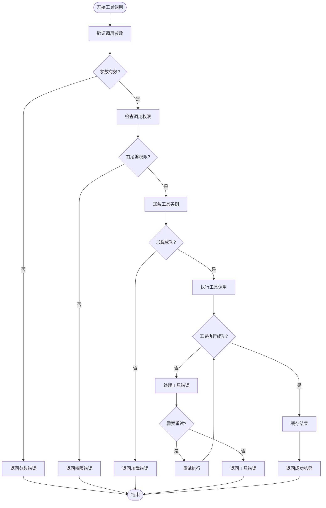
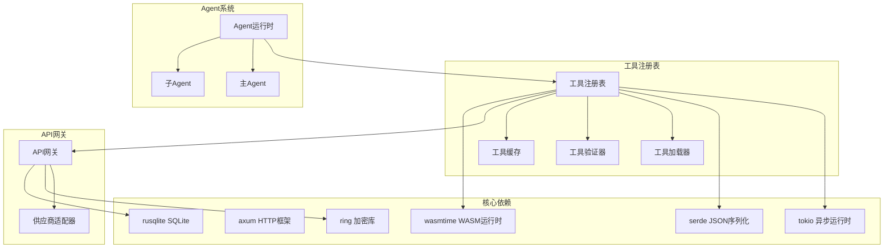

# 工具注册表系统

<cite>
**本文档引用的文件**
- [buzhidaozenmemingmin.md](file://buzhidaozenmemingmin.md)
</cite>

## 目录
1. [简介](#简介)
2. [项目结构](#项目结构)
3. [核心组件](#核心组件)
4. [架构概览](#架构概览)
5. [详细组件分析](#详细组件分析)
6. [依赖分析](#依赖分析)
7. [性能考虑](#性能考虑)
8. [故障排除指南](#故障排除指南)
9. [结论](#结论)
10. [附录](#附录)

## 简介

Flower Age Video项目中的MCP（Model Context Protocol）风格工具注册表系统是一个关键的基础设施组件，负责管理AI Agent使用的各种工具和服务。该系统采用MCP协议风格，提供了标准化的工具发现、加载、验证、调用和卸载机制。

### 系统目标

- **标准化接口**：提供统一的工具访问接口，支持多种AI服务提供商
- **动态加载**：支持工具的动态发现和加载，无需重启应用
- **安全隔离**：通过沙箱机制确保工具调用的安全性
- **版本管理**：支持工具版本控制和兼容性检查
- **性能优化**：提供缓存和连接池机制，提升工具调用效率

## 项目结构

根据项目文档，工具注册表系统位于Agent运行时的核心部分：



**图表来源**
- [buzhidaozenmemingmin.md:357-472](file://buzhidaozenmemingmin.md#L357-L472)

**章节来源**
- [buzhidaozenmemingmin.md:27-50](file://buzhidaozenmemingmin.md#L27-L50)
- [buzhidaozenmemingmin.md:357-472](file://buzhidaozenmemingmin.md#L357-L472)

## 核心组件

### 工具注册表架构

工具注册表系统采用模块化设计，主要包含以下核心组件：

#### 1. 工具发现机制
- **动态扫描**：自动扫描插件目录发现可用工具
- **元数据解析**：解析工具的描述信息和依赖关系
- **能力检测**：验证工具的功能完整性和兼容性

#### 2. 工具加载系统
- **沙箱隔离**：在独立的执行环境中运行工具
- **资源管理**：控制工具的内存和CPU使用
- **生命周期管理**：跟踪工具的创建、运行和销毁

#### 3. 工具验证框架
- **参数验证**：检查工具调用参数的有效性
- **权限检查**：验证调用者的访问权限
- **安全审计**：记录工具使用的历史和行为

#### 4. 工具调用协调器
- **请求路由**：将工具调用分发到正确的工具实例
- **并发控制**：管理工具的并发访问和资源竞争
- **错误处理**：捕获和处理工具调用过程中的异常

**章节来源**
- [buzhidaozenmemingmin.md:137-210](file://buzhidaozenmemingmin.md#L137-L210)

## 架构概览

### 整体系统架构



**图表来源**
- [buzhidaozenmemingmin.md:66-83](file://buzhidaozenmemingmin.md#L66-L83)
- [buzhidaozenmemingmin.md:163-171](file://buzhidaozenmemingmin.md#L163-L171)

### 工具注册流程



**图表来源**
- [buzhidaozenmemingmin.md:365-366](file://buzhidaozenmemingmin.md#L365-L366)

## 详细组件分析

### 工具注册表核心类设计



**图表来源**
- [buzhidaozenmemingmin.md:365-366](file://buzhidaozenmemingmin.md#L365-L366)

### 工具调用链追踪



**图表来源**
- [buzhidaozenmemingmin.md:66-83](file://buzhidaozenmemingmin.md#L66-L83)

### 错误处理策略



**图表来源**
- [buzhidaozenmemingmin.md:163-171](file://buzhidaozenmemingmin.md#L163-L171)

**章节来源**
- [buzhidaozenmemingmin.md:137-210](file://buzhidaozenmemingmin.md#L137-L210)

## 依赖分析

### 外部依赖关系



**图表来源**
- [buzhidaozenmemingmin.md:112-134](file://buzhidaozenmemingmin.md#L112-L134)

### 内部组件耦合

工具注册表系统与其他核心组件的耦合关系如下：

- **与Agent运行时**：紧密耦合，提供工具调用支持
- **与API网关**：中等耦合，共享认证和权限信息
- **与插件引擎**：松散耦合，通过标准接口交互
- **与Key Vault**：弱耦合，仅在需要时进行密钥访问

**章节来源**
- [buzhidaozenmemingmin.md:112-134](file://buzhidaozenmemingmin.md#L112-L134)

## 性能考虑

### 性能监控方案

工具注册表系统实现了多层次的性能监控机制：

#### 1. 工具调用性能指标
- **响应时间**：记录每次工具调用的耗时
- **吞吐量**：统计单位时间内的调用次数
- **成功率**：计算工具调用的成功比例
- **错误率**：监控各类错误的发生频率

#### 2. 资源使用监控
- **内存使用**：跟踪工具实例的内存占用
- **CPU使用**：监控工具执行的CPU消耗
- **并发度**：统计同时运行的工具数量
- **缓存命中率**：评估缓存效果

#### 3. 性能优化策略
- **连接池管理**：复用外部API连接
- **批量处理**：合并相似的工具调用
- **预加载机制**：提前加载常用工具
- **智能缓存**：基于使用模式的缓存策略

### 性能基准测试

系统支持以下性能测试场景：

- **工具发现性能**：扫描和加载工具的时间
- **工具调用延迟**：从请求到响应的完整时间
- **并发处理能力**：同时处理多个工具调用的能力
- **内存泄漏检测**：长期运行下的内存使用情况

## 故障排除指南

### 常见问题诊断

#### 1. 工具加载失败
**症状**：工具无法被发现或加载
**可能原因**：
- 工具文件损坏或缺失
- 权限不足导致无法访问
- 版本不兼容问题
- 依赖库缺失

**解决步骤**：
1. 检查工具文件的完整性
2. 验证文件权限设置
3. 确认工具版本兼容性
4. 安装缺失的依赖库

#### 2. 工具调用超时
**症状**：工具调用长时间无响应
**可能原因**：
- 外部API响应慢
- 网络连接问题
- 工具实例阻塞
- 资源不足

**解决步骤**：
1. 检查网络连接状态
2. 监控外部API健康状况
3. 重启阻塞的工具实例
4. 增加系统资源

#### 3. 权限验证失败
**症状**：工具调用被拒绝
**可能原因**：
- 用户权限不足
- 工具权限配置错误
- API密钥无效
- 访问令牌过期

**解决步骤**：
1. 验证用户权限级别
2. 检查工具权限设置
3. 更新API密钥
4. 刷新访问令牌

**章节来源**
- [buzhidaozenmemingmin.md:338-350](file://buzhidaozenmemingmin.md#L338-L350)

## 结论

Flower Age Video项目中的MCP风格工具注册表系统是一个设计精良的基础设施组件，具有以下特点：

### 技术优势
- **模块化设计**：清晰的组件分离和职责划分
- **安全性保障**：多层安全检查和沙箱隔离
- **性能优化**：智能缓存和资源管理机制
- **可扩展性**：支持动态工具加载和卸载

### 架构特色
- **统一接口**：标准化的工具访问协议
- **灵活配置**：支持多种工具类型和配置选项
- **监控完善**：全面的性能和错误监控
- **易于维护**：清晰的日志记录和调试支持

### 发展前景
该系统为Flower Age Video项目提供了强大的工具管理能力，支持未来功能的扩展和新工具的集成。通过持续的优化和改进，可以进一步提升系统的性能和可靠性。

## 附录

### 工具开发指南

#### 1. 工具开发规范
- **接口标准化**：遵循统一的工具接口规范
- **错误处理**：实现完整的错误处理机制
- **日志记录**：提供详细的日志信息
- **性能考虑**：优化工具的执行效率

#### 2. 工具测试方法
- **单元测试**：测试工具的基本功能
- **集成测试**：验证工具与系统的集成
- **性能测试**：评估工具的性能表现
- **安全测试**：检查工具的安全性

#### 3. 最佳实践
- **版本管理**：建立完善的版本控制机制
- **文档编写**：提供详细的使用说明
- **错误恢复**：实现优雅的错误恢复机制
- **监控告警**：建立有效的监控和告警系统

### 接口规范

#### 1. 工具注册接口
```rust
// 工具注册请求
struct ToolRegistration {
    name: String,
    version: String,
    description: String,
    capabilities: Vec<String>,
    metadata: HashMap<String, String>,
}

// 工具注册响应
struct RegistrationResponse {
    success: bool,
    tool_id: Option<String>,
    error_message: Option<String>,
}
```

#### 2. 工具调用接口
```rust
// 工具调用请求
struct ToolInvocation {
    tool_id: String,
    arguments: HashMap<String, Value>,
    timeout: Duration,
}

// 工具调用响应
struct InvocationResponse {
    success: bool,
    result: Option<Value>,
    error: Option<ToolError>,
    execution_time: Duration,
}
```

#### 3. 工具状态接口
```rust
// 工具状态查询
struct ToolStatus {
    tool_id: String,
    status: ToolStatusEnum,
    last_used: DateTime,
    usage_count: u64,
    error_count: u64,
}

// 工具状态枚举
enum ToolStatusEnum {
    Available,
    Loading,
    Unloading,
    Error,
    Disabled,
}
```

### 配置选项

#### 1. 工具注册表配置
- **扫描间隔**：工具目录扫描的时间间隔
- **缓存大小**：工具元数据缓存的最大容量
- **超时设置**：工具加载和调用的超时时间
- **并发限制**：同时运行的工具最大数量

#### 2. 性能监控配置
- **采样频率**：性能指标的采样频率
- **保留期限**：监控数据的保存时间
- **告警阈值**：触发告警的性能阈值
- **报告周期**：生成性能报告的时间间隔