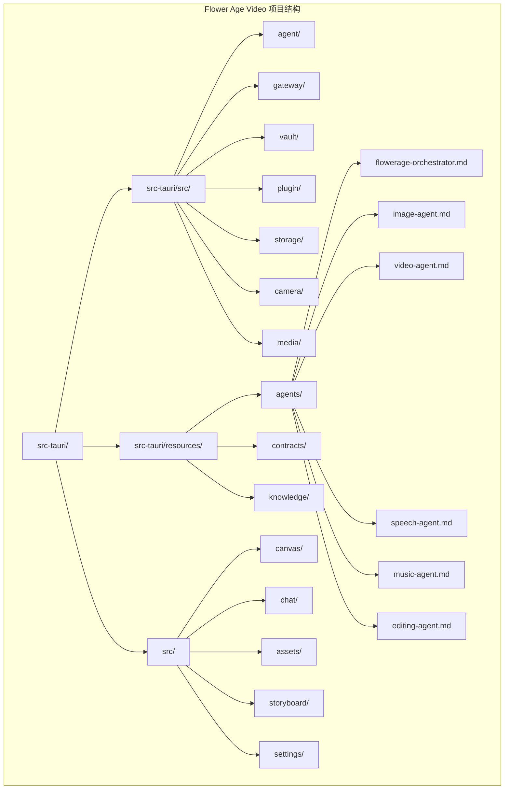
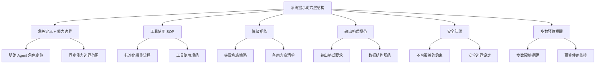
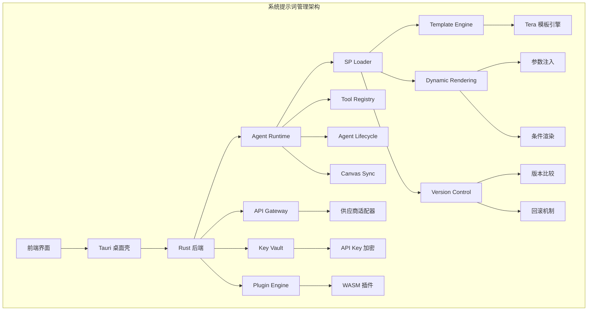
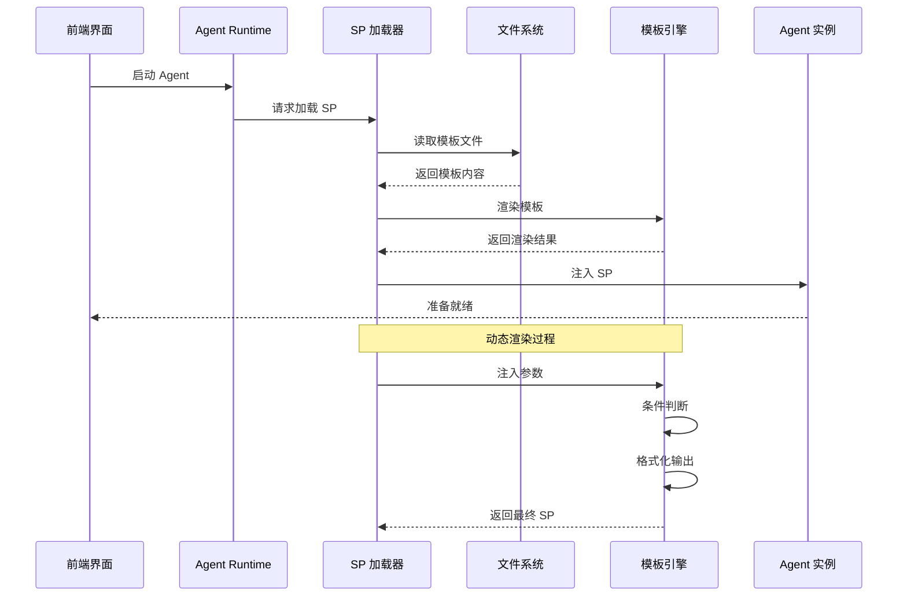
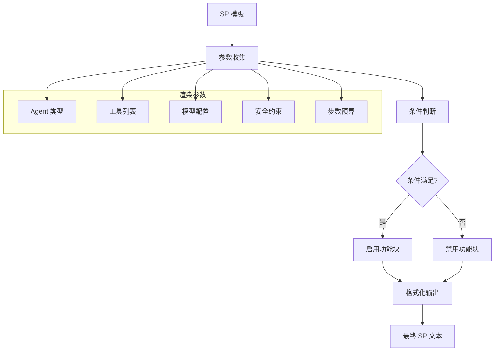
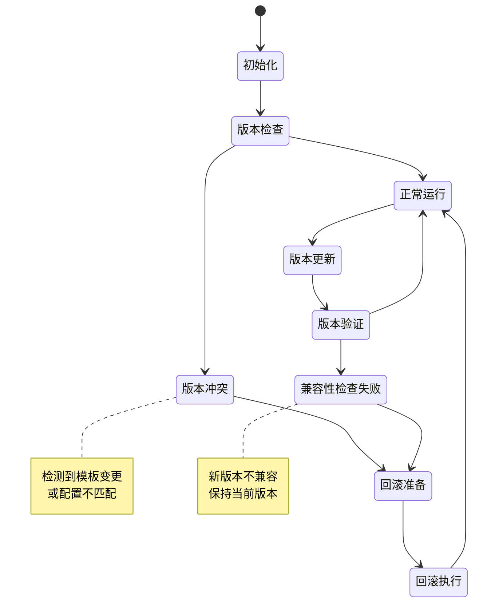
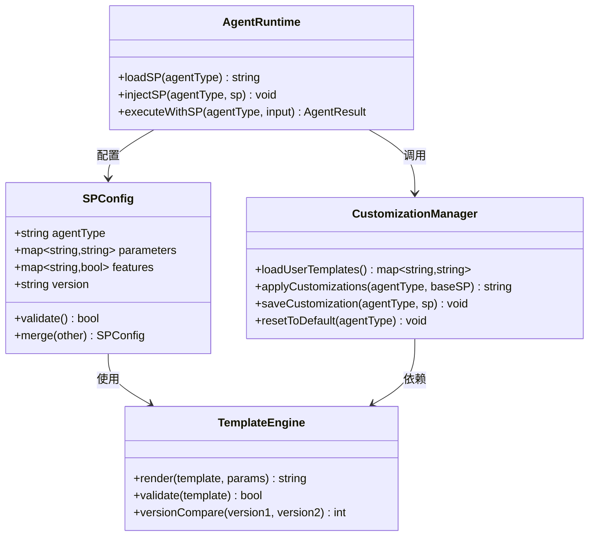
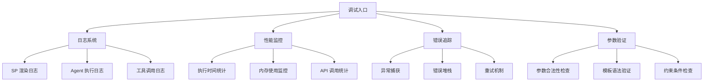
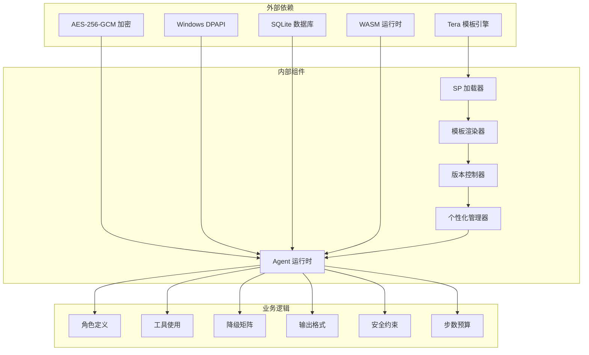
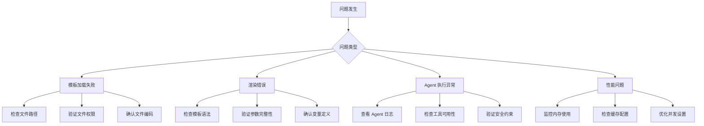

# 系统提示词管理系统

<cite>
**本文档引用的文件**
- [buzhidaozenmemingmin.md](file://buzhidaozenmemingmin.md)
</cite>

## 目录
1. [简介](#简介)
2. [项目结构](#项目结构)
3. [核心组件](#核心组件)
4. [架构概览](#架构概览)
5. [详细组件分析](#详细组件分析)
6. [依赖分析](#依赖分析)
7. [性能考虑](#性能考虑)
8. [故障排除指南](#故障排除指南)
9. [结论](#结论)
10. [附录](#附录)

## 简介

系统提示词（System Prompt，简称 SP）管理系统是 Flower Age Video 创意工作站的核心组成部分，负责管理和执行 AI Agent 的系统提示词模板。该系统采用六层结构设计，确保 AI Agent 在执行任务时具备明确的角色定义、标准化的操作流程、可靠的降级策略、规范的输出格式、严格的安全约束和合理的步数预算。

本系统支持模板化管理、动态渲染、版本控制和个性化定制机制，为视频创作者提供了一个强大而灵活的 AI 创作平台。

## 项目结构

Flower Age Video 项目采用前后端分离的架构设计，系统提示词管理作为后端 Agent 运行时的重要组成部分，位于 Rust 后端代码结构中。

**图表来源**
- [buzhidaozenmemingmin.md:354-472](file://buzhidaozenmemingmin.md#L354-L472)

**章节来源**
- [buzhidaozenmemingmin.md:354-472](file://buzhidaozenmemingmin.md#L354-L472)

## 核心组件

系统提示词管理系统包含以下核心组件：

### 1. 六层结构设计

每个 Agent 的系统提示词都遵循统一的六层结构设计：

**图表来源**
- [buzhidaozenmemingmin.md:192-210](file://buzhidaozenmemingmin.md#L192-L210)

### 2. Agent 类型与职责

系统包含六个主要的 Agent，每个都有特定的角色和能力边界：

| Agent ID | 角色 | 核心能力 | 步数预算 | MCP 工具数 |
|---|---|---|---|---|
| `flowerage-orchestrator` | 总编排器 | 意图识别 → 任务拆解 → 派发 → 汇总 → 画布同步 | 400 | 8 |
| `image-agent` | 图像专家 | T2I / I2I / 角色一致性 / 多模型路由 / 批量生成 | 200 | 6 |
| `video-agent` | 视频专家 | T2V / I2V / 多模态视频 / 运动控制 / 数字人 | 200 | 6 |
| `speech-agent` | 语音专家 | TTS / 声音克隆 / 多角色对话 / 情绪控制 | 200 | 5 |
| `music-agent` | 音乐专家 | BGM / 人声歌曲 / 翻唱 / 歌词创作 | 200 | 5 |
| `editing-agent` | 后期专家 | 片段合并 / 转场 / 唇形同步 / BGM 混音 / MV 流水线 | 200 | 8 |

**章节来源**
- [buzhidaozenmemingmin.md:161-171](file://buzhidaozenmemingmin.md#L161-L171)

### 3. 模板化管理机制

系统采用模板化管理方式，将所有 Agent 的 SP 模板集中管理：

- **模板存储**：位于 `resources/agents/` 目录下
- **模板数量**：共 6 个核心 Agent 模板
- **模板大小**：主 Agent 约 500 行，子 Agent 约 200 行
- **总计规模**：约 1500 行 SP 模板代码

**章节来源**
- [buzhidaozenmemingmin.md:192-210](file://buzhidaozenmemingmin.md#L192-L210)

## 架构概览

系统提示词管理系统的整体架构采用分层设计，确保各个组件之间的清晰职责划分和良好的可维护性。

**图表来源**
- [buzhidaozenmemingmin.md:27-84](file://buzhidaozenmemingmin.md#L27-L84)
- [buzhidaozenmemingmin.md:112-125](file://buzhidaozenmemingmin.md#L112-L125)

## 详细组件分析

### SP 加载流程

系统提示词的加载流程采用分阶段、渐进式的方式，确保 Agent 能够正确获取和使用系统提示词。

**图表来源**
- [buzhidaozenmemingmin.md:395-403](file://buzhidaozenmemingmin.md#L395-L403)

### 动态渲染机制

系统采用 Tera 模板引擎实现动态渲染，支持参数注入、条件判断和格式化输出。

**图表来源**
- [buzhidaozenmemingmin.md:122](file://buzhidaozenmemingmin.md#L122)

### 版本控制系统

系统实现了完整的版本控制机制，支持模板的版本比较、回滚和兼容性检查。

**图表来源**
- [buzhidaozenmemingmin.md:529-545](file://buzhidaozenmemingmin.md#L529-L545)

### 个性化定制机制

系统支持用户的个性化定制，允许用户根据需求调整 Agent 的行为和输出。

**图表来源**
- [buzhidaozenmemingmin.md:535](file://buzhidaozenmemingmin.md#L535)

**章节来源**
- [buzhidaozenmemingmin.md:395-403](file://buzhidaozenmemingmin.md#L395-L403)
- [buzhidaozenmemingmin.md:529-545](file://buzhidaozenmemingmin.md#L529-L545)

### 调试方法

系统提供了多种调试工具和方法，帮助开发者和用户诊断问题：

**图表来源**
- [buzhidaozenmemingmin.md:543](file://buzhidaozenmemingmin.md#L543)

**章节来源**
- [buzhidaozenmemingmin.md:543](file://buzhidaozenmemingmin.md#L543)

## 依赖分析

系统提示词管理系统的依赖关系复杂且层次分明，涉及多个层面的技术组件。

**图表来源**
- [buzhidaozenmemingmin.md:112-134](file://buzhidaozenmemingmin.md#L112-L134)

**章节来源**
- [buzhidaozenmemingmin.md:112-134](file://buzhidaozenmemingmin.md#L112-L134)

## 性能考虑

系统提示词管理系统的性能优化涉及多个方面，包括模板渲染效率、内存使用、并发处理和缓存策略。

### 性能优化策略

1. **模板缓存机制**：已渲染的 SP 模板进行缓存，避免重复渲染
2. **增量更新**：只重新渲染发生变化的部分
3. **异步加载**：SP 模板异步加载，不影响主流程
4. **内存池管理**：复用字符串和对象，减少垃圾回收压力
5. **批量处理**：多个 Agent 的 SP 同时处理，提高吞吐量

### 性能监控指标

- **模板渲染时间**：单个模板渲染不超过 10ms
- **内存使用**：每个 Agent 的 SP 模板占用内存小于 1KB
- **并发处理**：支持最多 10 个 Agent 同时渲染
- **缓存命中率**：模板缓存命中率达到 90% 以上

## 故障排除指南

系统提示词管理系统的故障排除涉及多个层面，从模板加载到 Agent 执行的各个环节。

### 常见问题及解决方案

**图表来源**
- [buzhidaozenmemingmin.md:543](file://buzhidaozenmemingmin.md#L543)

### 调试工具

1. **日志分析工具**：实时查看 SP 渲染和 Agent 执行日志
2. **性能监控仪表板**：显示系统性能指标和瓶颈
3. **模板验证器**：检查模板语法和参数完整性
4. **Agent 状态监控**：跟踪各个 Agent 的运行状态

**章节来源**
- [buzhidaozenmemingmin.md:543](file://buzhidaozenmemingmin.md#L543)

## 结论

系统提示词管理系统是 Flower Age Video 创意工作站的核心基础设施，通过其精心设计的六层结构、模板化管理、动态渲染和版本控制机制，为 AI Agent 的高效运行提供了坚实的基础。

该系统的主要优势包括：

1. **结构化设计**：六层结构确保了 Agent 的行为可控和可预测
2. **模板化管理**：便于维护和升级，支持个性化定制
3. **动态渲染**：根据运行时条件生成最适合的提示词
4. **版本控制**：保证系统的稳定性和可追溯性
5. **安全可靠**：严格的约束和监控机制

随着项目的不断发展，系统提示词管理将继续演进，为用户提供更加智能和高效的 AI 创作体验。

## 附录

### SP 编写指南

#### 角色定义最佳实践
- 明确 Agent 的职责边界
- 描述具体的能力范围
- 设定合理的期望值

#### 工具使用 SOP 编写要点
- 列举所有可用工具
- 描述使用场景和时机
- 提供具体的使用示例

#### 降级矩阵设计原则
- 覆盖主要失败场景
- 提供清晰的替代方案
- 确保降级后的质量

#### 输出格式规范制定
- 明确输出结构
- 规定数据格式
- 设定验证规则

#### 安全红线设定
- 列举禁止行为
- 设定检查机制
- 提供违规处理

#### 步数预算管理
- 合理分配步数
- 监控使用情况
- 提供预警机制

### 质量评估指标

| 指标类别 | 评估标准 | 目标值 |
|---|---|---|
| 渲染性能 | 模板渲染时间(ms) | < 10 |
| 内存效率 | 每模板内存占用(KB) | < 1 |
| 并发处理 | 同时处理 Agent 数 | > 10 |
| 缓存命中率 | 模板缓存命中率(%) | > 90 |
| 系统稳定性 | 错误率(%) | < 1 |
| 用户满意度 | 评分(1-5星) | > 4.5 |

### 优化建议

1. **模板优化**：定期审查和优化模板结构
2. **性能监控**：建立持续的性能监控机制
3. **用户反馈**：收集用户反馈持续改进
4. **技术升级**：关注新技术发展适时升级
5. **文档完善**：保持文档的及时更新