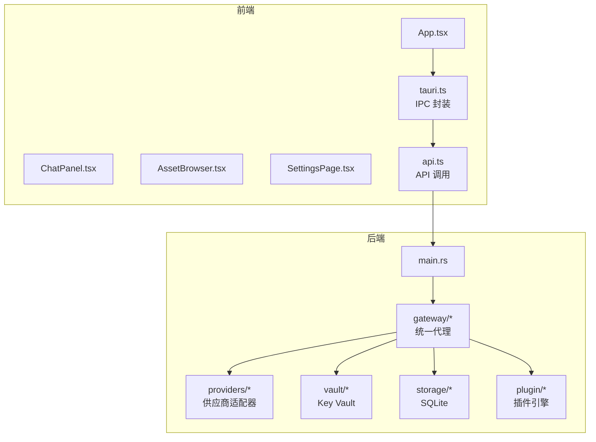
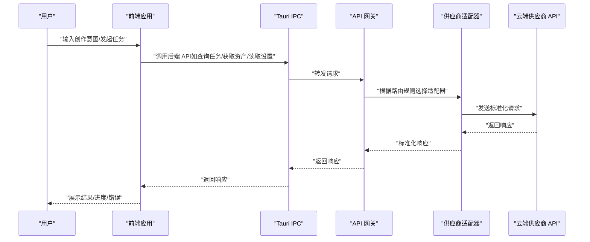
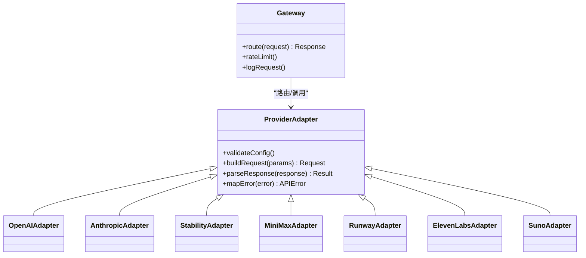
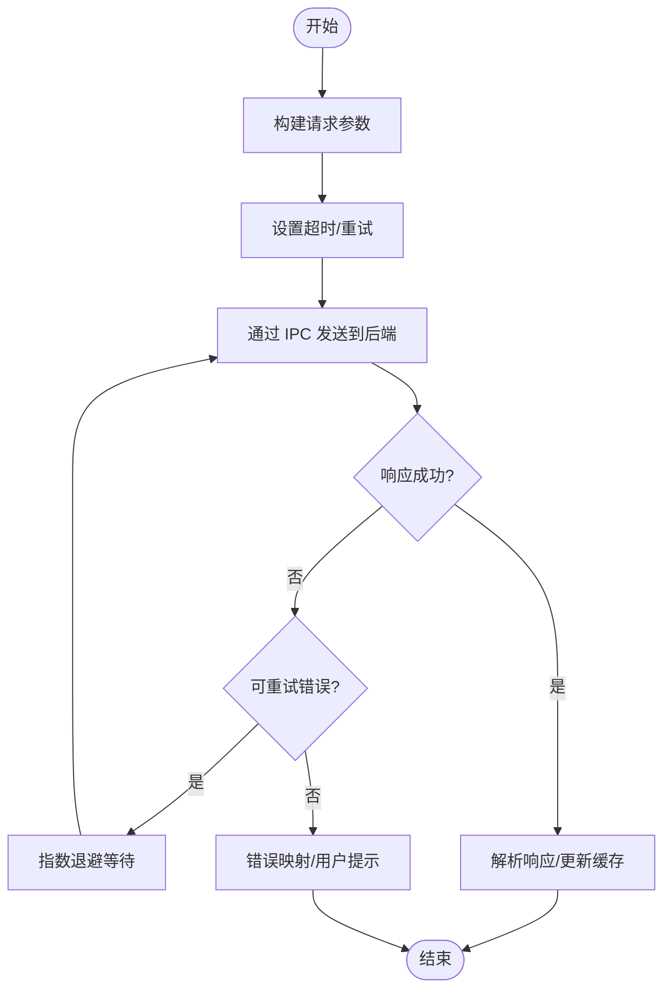
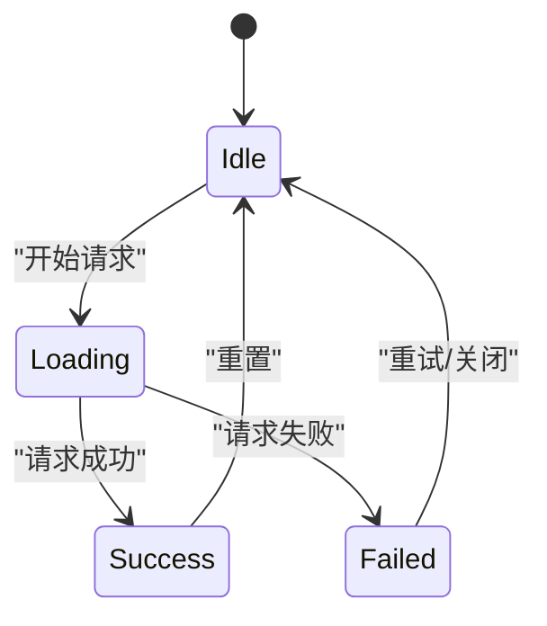
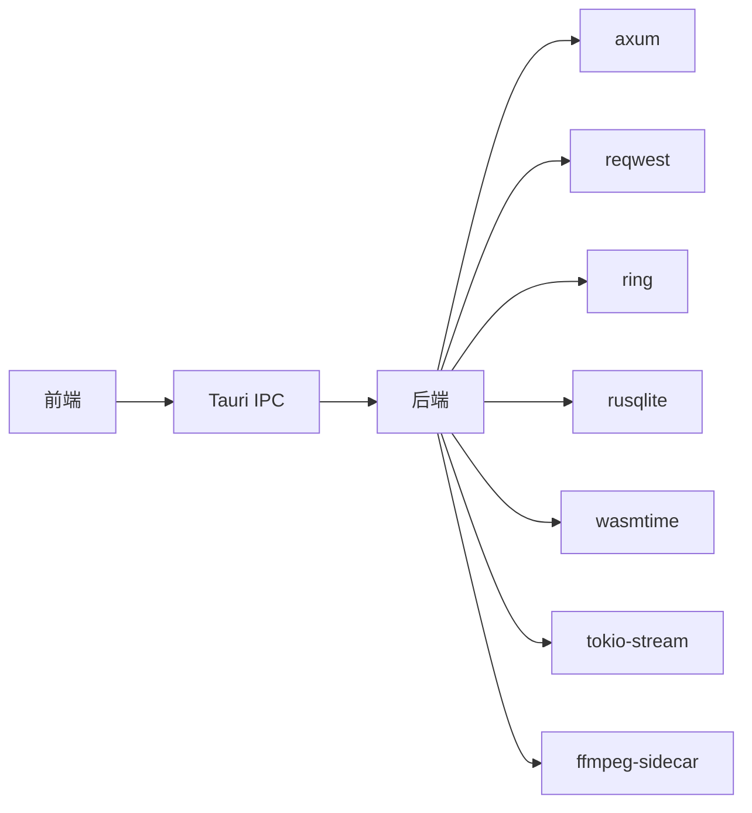

# API 集成

<cite>
**本文引用的文件**
- [buzhidaozenmemingmin.md](file://buzhidaozenmemingmin.md)
</cite>

## 目录
1. [简介](#简介)
2. [项目结构](#项目结构)
3. [核心组件](#核心组件)
4. [架构总览](#架构总览)
5. [详细组件分析](#详细组件分析)
6. [依赖分析](#依赖分析)
7. [性能考虑](#性能考虑)
8. [故障排查指南](#故障排查指南)
9. [结论](#结论)
10. [附录](#附录)

## 简介
本文件围绕 Flower Age Video 的 API 集成系统进行系统化说明，重点阐述后端 API 网关如何统一对接多家云端 AI 供应商，以及前端如何通过 Tauri IPC 与后端交互，实现 Agent 任务查询、资产列表获取、设置读取等核心功能。文档同时覆盖统一请求处理、缓存策略、重试机制、错误处理、加载状态管理与用户反馈、调试工具与网络监控、性能优化策略，并给出在组件中优雅处理异步数据流的最佳实践。

## 项目结构
Flower Age Video 采用 Tauri 桌面壳 + Rust 后端 + React 前端的分层架构。API 集成的关键位置包括：
- 后端 Rust 模块：src-tauri/src/gateway/* 提供统一 API 代理与供应商适配器
- 前端模块：src/lib/* 提供 Tauri IPC 封装与 API 调用
- 画布与状态：src/canvas/*、src/chat/*、src/assets/*、src/settings/* 等模块负责 UI 与数据流

图表来源
- [buzhidaozenmemingmin.md: 357-472:357-472](file://buzhidaozenmemingmin.md#L357-L472)

章节来源
- [buzhidaozenmemingmin.md: 357-472:357-472](file://buzhidaozenmemingmin.md#L357-L472)

## 核心组件
- API 网关（Rust）：在本地监听端口，统一路由至各供应商 API，负责速率限制、请求转发与响应聚合
- 供应商适配器：针对不同供应商（OpenAI、Anthropic、Stability、Midjourney、Runway、Kling、MiniMax、ElevenLabs、Suno 等）实现标准化请求与响应
- Key Vault：本地加密存储 API Key，调用时解密，内存中短暂停留，确保隐私安全
- 前端 IPC 封装：通过 Tauri IPC 与后端通信，屏蔽底层细节
- 前端 API 调用：封装统一的请求方法，支持超时、重试、错误处理与加载状态管理
- 画布与状态：Zustand 管理画布节点、边、视口与 Agent 任务映射，支持任务结果同步

章节来源
- [buzhidaozenmemingmin.md: 268-350:268-350](file://buzhidaozenmemingmin.md#L268-L350)
- [buzhidaozenmemingmin.md: 418-471:418-471](file://buzhidaozenmemingmin.md#L418-L471)

## 架构总览
下图展示了从用户输入到云端供应商 API 的完整链路，以及后端 API 网关如何在本地进行统一代理与安全存储。

图表来源
- [buzhidaozenmemingmin.md: 66-83:66-83](file://buzhidaozenmemingmin.md#L66-L83)
- [buzhidaozenmemingmin.md: 268-288:268-288](file://buzhidaozenmemingmin.md#L268-L288)

## 详细组件分析

### API 网关与供应商适配器
- 统一代理：后端在本地提供统一入口，将不同供应商的 API 请求标准化，避免前端直接暴露密钥或第三方代理
- 速率限制：在网关层实施速率限制，防止突发流量导致供应商限流或成本异常
- 适配器模式：为每家供应商实现独立适配器，封装请求参数、头部、错误码映射与响应格式转换
- 安全存储：API Key 通过 Key Vault 加密存储，调用时解密并在内存中短暂使用，不落盘明文

图表来源
- [buzhidaozenmemingmin.md: 367-377:367-377](file://buzhidaozenmemingmin.md#L367-L377)
- [buzhidaozenmemingmin.md: 290-337:290-337](file://buzhidaozenmemingmin.md#L290-L337)

章节来源
- [buzhidaozenmemingmin.md: 268-350:268-350](file://buzhidaozenmemingmin.md#L268-L350)

### 前端 IPC 与 API 调用封装
- IPC 封装：提供统一的 IPC 方法，隐藏 Tauri 原生调用细节，便于前端模块复用
- API 调用：封装 GET/POST/DELETE 等方法，支持超时、重试、错误映射与加载状态管理
- 统一处理：集中处理网络异常、业务错误与空值场景，保证 UI 一致的反馈体验
- 重试策略：对瞬时性错误（如网络抖动、供应商限流）进行指数退避重试
- 缓存策略：对只读数据（如设置、资产元数据）采用内存缓存，结合失效策略降低重复请求

图表来源
- [buzhidaozenmemingmin.md: 462-464:462-464](file://buzhidaozenmemingmin.md#L462-L464)

章节来源
- [buzhidaozenmemingmin.md: 418-471:418-471](file://buzhidaozenmemingmin.md#L418-L471)

### 画布与状态管理（Zustand）
- 节点与边：维护画布节点与连线，支持增删改查与视口状态
- Agent 任务映射：维护任务 ID 到画布节点 ID 的映射，便于结果回填
- 同步逻辑：当 Agent 任务完成时，将结果同步到画布，建立资产依赖关系

图表来源
- [buzhidaozenmemingmin.md: 239-262:239-262](file://buzhidaozenmemingmin.md#L239-L262)

章节来源
- [buzhidaozenmemingmin.md: 239-262:239-262](file://buzhidaozenmemingmin.md#L239-L262)

### 核心 API 使用示例（基于设计文档）
以下示例以“路径”形式给出，便于在实际代码中定位实现位置。请根据实际文件结构替换为真实路径。

- Agent 任务查询
  - 前端调用：通过 IPC 调用后端任务查询接口，传入任务 ID
  - 后端路由：网关根据任务 ID 路由到对应适配器，拉取供应商进度
  - 响应：返回任务状态、进度百分比、日志片段与最终产物链接
  - 参考路径：[src/lib/tauri.ts](file://src/lib/tauri.ts)、[src/lib/api.ts](file://src/lib/api.ts)、[src-tauri/src/gateway/router.rs](file://src-tauri/src/gateway/router.rs)

- 资产列表获取
  - 前端调用：请求资产索引（分页、过滤、排序）
  - 后端处理：从 SQLite 读取资产元数据，按类型/时间/关键词筛选
  - 响应：返回资产列表与缩略图路径
  - 参考路径：[src/lib/tauri.ts](file://src/lib/tauri.ts)、[src/lib/api.ts](file://src/lib/api.ts)、[src-tauri/src/storage/db.rs](file://src-tauri/src/storage/db.rs)

- 设置读取
  - 前端调用：读取用户偏好与模型配置
  - 后端处理：从 SQLite 或本地 JSON 读取设置
  - 响应：返回当前设置对象
  - 参考路径：[src/lib/tauri.ts](file://src/lib/tauri.ts)、[src/lib/api.ts](file://src/lib/api.ts)、[src-tauri/src/storage/models.rs](file://src-tauri/src/storage/models.rs)

章节来源
- [buzhidaozenmemingmin.md: 418-471:418-471](file://buzhidaozenmemingmin.md#L418-L471)
- [buzhidaozenmemingmin.md: 357-472:357-472](file://buzhidaozenmemingmin.md#L357-L472)

### 错误处理、加载状态管理与用户反馈
- 错误分类：网络错误、供应商限流/熔断、业务参数错误、权限不足
- 错误映射：将供应商特定错误码映射为统一错误类型，便于前端一致处理
- 重试策略：对瞬时性错误进行指数退避重试，最大重试次数与总超时时间可控
- 加载状态：在 UI 上显示加载指示、进度条与占位符，避免空白屏
- 用户反馈：提供 Toast/弹窗/日志面板，帮助用户理解失败原因与后续步骤

章节来源
- [buzhidaozenmemingmin.md: 268-350:268-350](file://buzhidaozenmemingmin.md#L268-L350)

### API 调试工具、网络监控与性能优化
- 调试工具：在网关层记录请求/响应日志（不含敏感信息），提供请求追踪 ID；前端提供网络面板查看 IPC 调用详情
- 网络监控：统计成功率、平均延迟、重试次数与错误分布，辅助定位问题
- 性能优化：
  - 请求合并：对多次小请求进行批处理
  - 响应缓存：对只读数据进行内存缓存，结合失效策略
  - 并发控制：限制并发请求数，避免供应商限流
  - 超时与重试：合理设置超时与重试，平衡用户体验与成本

章节来源
- [buzhidaozenmemingmin.md: 268-350:268-350](file://buzhidaozenmemingmin.md#L268-L350)

### 在组件中优雅处理异步数据流
- Hook 设计：为常用数据流提供自定义 Hook（如 useAgentTasks、useAssets），封装加载、错误与缓存逻辑
- 渲染策略：骨架屏、渐进式加载、分页懒加载，避免阻塞主线程
- 事件驱动：通过 SSE 或轮询获取实时进度，保持 UI 与后端状态一致
- 取消与去抖：对高频输入（如搜索）进行防抖与取消旧请求，避免资源浪费

章节来源
- [buzhidaozenmemingmin.md: 440-464:440-464](file://buzhidaozenmemingmin.md#L440-L464)

## 依赖分析
- 前端依赖：React、TypeScript、Zustand、@xyflow/react、Tailwind CSS、Framer Motion、Vite、shadcn/ui
- 后端依赖：axum、tokio、reqwest、ring、rusqlite、wasmtime、tokio-stream、ffmpeg-sidecar
- 安全与存储：API Key 本地加密存储，SQLite 持久化，Windows DPAPI 辅助保护

图表来源
- [buzhidaozenmemingmin.md: 87-134:87-134](file://buzhidaozenmemingmin.md#L87-L134)

章节来源
- [buzhidaozenmemingmin.md: 87-134:87-134](file://buzhidaozenmemingmin.md#L87-L134)

## 性能考虑
- 合理的超时与重试策略，避免长时间占用连接
- 对只读数据进行缓存，减少重复请求
- 限制并发数量，避免触发供应商限流
- 使用 SSE 或短轮询获取进度，降低长连接开销
- 前端懒加载与骨架屏，提升感知性能

## 故障排查指南
- 网络问题：检查本地代理、防火墙与 DNS；确认后端服务已启动
- 供应商限流：查看网关日志中的速率限制触发情况，调整重试策略
- API Key 问题：确认 Key Vault 中密文正确，解密流程正常
- 前端 IPC 失败：检查 IPC 方法签名与参数类型，确认通道名称一致
- 数据不一致：核对画布同步逻辑与任务映射，确保结果回填成功

章节来源
- [buzhidaozenmemingmin.md: 338-350:338-350](file://buzhidaozenmemingmin.md#L338-L350)

## 结论
Flower Age Video 的 API 集成以“本地代理 + 供应商适配器 + 加密存储 + 统一前端封装”为核心，既保障了隐私与性能，又提供了良好的扩展性与可维护性。通过合理的错误处理、加载状态管理与用户反馈机制，能够在复杂异步数据流中提供稳定可靠的用户体验。建议在后续迭代中持续完善网络监控与性能指标，进一步优化缓存与重试策略。

## 附录
- 项目定位与目标平台：Windows（.exe 单文件安装）
- 安装与运行：零 Docker/Python/Node.js 依赖，双击即用
- 许可证：全部依赖 100% MIT/Apache-2.0/BSD 许可证，无 GPL 传染风险

章节来源
- [buzhidaozenmemingmin.md: 11-25:11-25](file://buzhidaozenmemingmin.md#L11-L25)
- [buzhidaozenmemingmin.md: 476-509:476-509](file://buzhidaozenmemingmin.md#L476-L509)
- [buzhidaozenmemingmin.md: 596-621:596-621](file://buzhidaozenmemingmin.md#L596-L621)