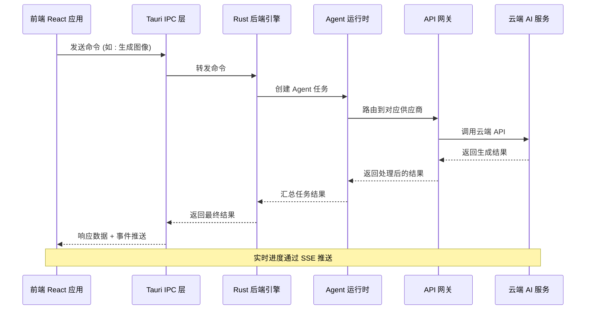
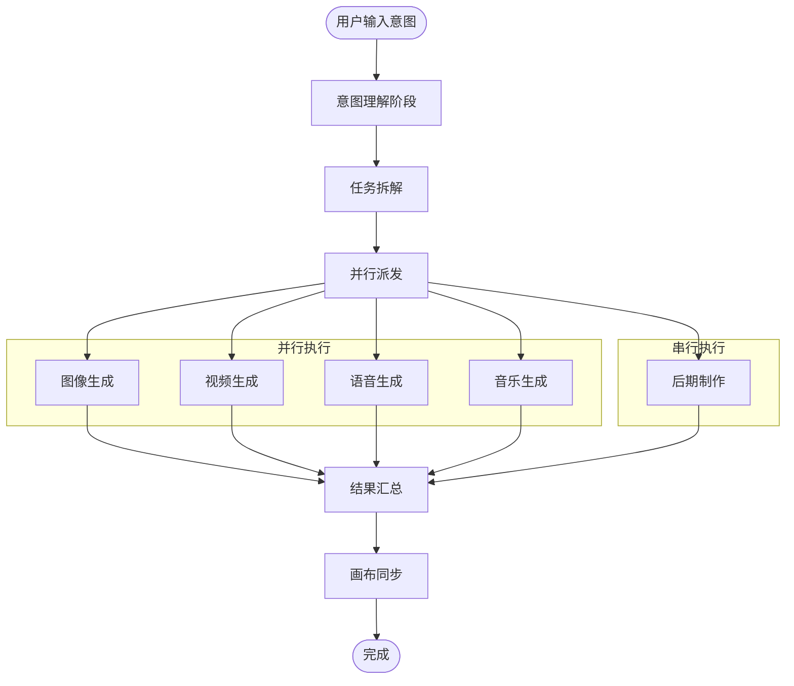

# IPC 通信

<cite>
**本文档引用的文件**
- [buzhidaozenmemingmin.md](file://buzhidaozenmemingmin.md)
</cite>

## 目录
1. [简介](#简介)
2. [项目结构](#项目结构)
3. [核心组件](#核心组件)
4. [架构概览](#架构概览)
5. [详细组件分析](#详细组件分析)
6. [依赖分析](#依赖分析)
7. [性能考虑](#性能考虑)
8. [故障排除指南](#故障排除指南)
9. [结论](#结论)
10. [附录](#附录)

## 简介

Flower Age Video 是一款基于 Tauri 2.x 的 AI 驱动无限画布创意工作站。该项目采用主 Agent 编排 + 子 Agent 执行的架构模式，通过 Tauri 的跨平台 IPC 通信机制实现前端 React 应用与后端 Rust 引擎之间的高效数据交换。

该系统的核心价值在于：
- **零商业侵权**：全部依赖采用 MIT / Apache-2.0 / BSD 许可证
- **本地部署**：单文件 .exe 安装，无需 Docker、Python 或 Node.js 运行时
- **云端 AI**：用户配置自己的 API Key，本地加密存储，无第三方代理
- **无限画布**：所有资产在画布上可视化管理
- **主 Agent 控子 Agent**：1 个编排器拆解任务 → 5 个专业子 Agent 并行/串行执行

## 项目结构

基于项目文档，Flower Age Video 采用分层架构设计：

```mermaid
graph TB
subgraph "桌面壳层 (Tauri Shell)"
Tauri[Tauri Desktop Shell<br/>FlowerAgeVideo.exe]
WebView[WebView2 (Windows 内置)]
end
subgraph "后端 (Rust)"
Backend[Rust Backend<br/>核心引擎]
subgraph "Agent Runtime"
Orchestrator[主 Agent 编排器]
ImageAgent[图像专家 Agent]
VideoAgent[视频专家 Agent]
SpeechAgent[语音专家 Agent]
MusicAgent[音乐专家 Agent]
EditingAgent[后期专家 Agent]
end
subgraph "服务层"
APIService[API Gateway<br/>统一 API 代理]
PluginEngine[插件引擎<br/>WASM 热加载]
KeyVault[Key Vault<br/>API Key 加密存储]
SQLiteStore[SQLite Store<br/>项目/资产持久化]
end
subgraph "原生模块"
FFmpeg[ffmpeg (内置)]
Sharp[Sharp (Rust)]
Whisper[Whisper (可选)]
end
end
subgraph "前端 (React)"
ReactApp[React WebView]
InfiniteCanvas[无限画布<br/>@xyflow/react]
AgentChat[Agent Chat<br/>SSE 实时对话]
AssetBrowser[资产管理浏览器]
StoryboardEditor[分镜编辑器]
Settings[设置界面]
end
Tauri --> Backend
Tauri --> ReactApp
ReactApp --> InfiniteCanvas
ReactApp --> AgentChat
ReactApp --> AssetBrowser
ReactApp --> StoryboardEditor
ReactApp --> Settings
Backend --> Orchestrator
Orchestrator --> ImageAgent
Orchestrator --> VideoAgent
Orchestrator --> SpeechAgent
Orchestrator --> MusicAgent
Orchestrator --> EditingAgent
Orchestrator --> APIService
APIService --> PluginEngine
APIService --> KeyVault
APIService --> SQLiteStore
Backend --> FFmpeg
Backend --> Sharp
Backend --> Whisper
```

**图表来源**
- [buzhidaozenmemingmin.md:27-50](file://buzhidaozenmemingmin.md#L27-L50)
- [buzhidaozenmemingmin.md:355-472](file://buzhidaozenmemingmin.md#L355-L472)

**章节来源**
- [buzhidaozenmemingmin.md:27-50](file://buzhidaozenmemingmin.md#L27-L50)
- [buzhidaozenmemingmin.md:355-472](file://buzhidaozenmemingmin.md#L355-L472)

## 核心组件

### Tauri IPC 通信架构

Flower Age Video 的 IPC 通信系统基于 Tauri 2.x 的跨平台机制，实现了以下核心功能：

#### 命令调用模式
- **同步调用**：适用于快速返回的小数据操作
- **异步调用**：适用于长时间运行的任务，如 AI 生成
- **事件监听**：用于实时数据推送，如 Agent 进度更新

#### 数据交换模式
- **请求-响应模式**：标准的 RPC 调用
- **事件驱动模式**：Server-Sent Events (SSE) 实时推送
- **文件系统操作**：本地文件读写和媒体处理

#### 错误处理机制
- **类型安全的错误处理**：Rust 的 Result 类型确保错误传播
- **超时控制**：可配置的超时机制防止阻塞
- **重试策略**：网络异常时的自动重试

**章节来源**
- [buzhidaozenmemingmin.md:52-65](file://buzhidaozenmemingmin.md#L52-L65)
- [buzhidaozenmemingmin.md:112-134](file://buzhidaozenmemingmin.md#L112-L134)

## 架构概览

### IPC 通信流程



**图表来源**
- [buzhidaozenmemingmin.md:66-83](file://buzhidaozenmemingmin.md#L66-L83)
- [buzhidaozenmemingmin.md:172-190](file://buzhidaozenmemingmin.md#L172-L190)

### Agent 编排流程



**图表来源**
- [buzhidaozenmemingmin.md:172-190](file://buzhidaozenmemingmin.md#L172-L190)
- [buzhidaozenmemingmin.md:161-171](file://buzhidaozenmemingmin.md#L161-L171)

**章节来源**
- [buzhidaozenmemingmin.md:137-190](file://buzhidaozenmemingmin.md#L137-L190)

## 详细组件分析

### Agent 运行时系统

#### 主 Agent 编排器

主 Agent (`flowerage-orchestrator`) 是整个系统的协调中心，负责：

- **意图理解**：解析用户输入，识别任务类型
- **任务拆解**：将复杂任务分解为子任务
- **并行/串行派发**：根据依赖关系安排执行顺序
- **结果汇总**：整合各子 Agent 的输出
- **画布同步**：将生成物自动注册到画布节点

#### 子 Agent 专家系统

系统包含 5 个专业子 Agent：

| Agent ID | 角色 | 核心能力 | 步数预算 |
|---|---|---|---|
| `flowerage-orchestrator` | 总编排器 | 意图识别 → 任务拆解 → 派发 → 汇总 → 画布同步 | 400 |
| `image-agent` | 图像专家 | T2I / I2I / 角色一致性 / 多模型路由 / 批量生成 | 200 |
| `video-agent` | 视频专家 | T2V / I2V / 多模态视频 / 运动控制 / 数字人 | 200 |
| `speech-agent` | 语音专家 | TTS / 声音克隆 / 多角色对话 / 情绪控制 | 200 |
| `music-agent` | 音乐专家 | BGM / 人声歌曲 / 翻唱 / 歌词创作 | 200 |
| `editing-agent` | 后期专家 | 片段合并 / 转场 / 唇形同步 / BGM 混音 / MV 流水线 | 200 |

#### Agent 系统提示词设计

每个 Agent 的系统提示词包含六个核心要素：

1. **角色定义 + 能力边界**：明确 Agent 的职责范围
2. **工具使用 SOP**：标准操作流程
3. **降级矩阵**：失败兜底策略
4. **输出格式规范**：标准化的数据结构
5. **安全红线**：不可覆盖的约束条件
6. **步数预算提醒**：防止无限循环

**章节来源**
- [buzhidaozenmemingmin.md:137-171](file://buzhidaozenmemingmin.md#L137-L171)
- [buzhidaozenmemingmin.md:192-205](file://buzhidaozenmemingmin.md#L192-L205)

### API 网关系统

#### 本地 API 代理

API Gateway (`localhost:7942`) 作为本地代理层，提供以下功能：

- **统一入口**：集中管理所有云端 AI 供应商的 API 调用
- **模型路由**：根据任务类型和用户偏好选择合适的模型
- **速率限制**：防止 API 调用过载
- **错误处理**：统一的错误响应格式

#### 支持的 AI 供应商

系统支持多家主流 AI 供应商：

**大语言模型 (LLM)**
- OpenAI: GPT-4o / GPT-4.1
- Anthropic: Claude 4 Sonnet / Opus
- DeepSeek: DeepSeek-V3 / V4
- 通义千问: Qwen-Max
- MiniMax: MiniMax-Text-01

**图像生成**
- OpenAI: DALL·E 3
- Stability AI: SD3 / SDXL
- Midjourney: 第三方代理
- 即梦/豆包: Seedream
- Recraft: V3

**视频生成**
- Runway: Gen-3 / Gen-4
- 可灵: Kling 2.x
- 即梦: Seedance 2.0
- MiniMax: Video-01
- Luma: Dream Machine

**语音合成**
- MiniMax: speech-2.8-hd
- ElevenLabs: Multilingual v2
- OpenAI: TTS-1 / TTS-1-hd

**音乐生成**
- Suno: V4
- Udio: V2
- MiniMax: music-2.6

#### API Key 安全存储

Key Vault 采用多层安全设计：

```
API Key → AES-256-GCM 加密存储
    ↓
加密密钥 → Windows DPAPI 保护
    ↓
密文存储 → SQLite (本地)
    ↓
解密仅在 API 调用时，内存中短暂停留
```

**章节来源**
- [buzhidaozenmemingmin.md:266-350](file://buzhidaozenmemingmin.md#L266-L350)

### 无限画布系统

#### 画布核心功能

基于 @xyflow/react 的无限画布支持：

- **无限缩放**：0.1x ~ 5x，鼠标滚轮控制
- **拖拽布局**：自由拖拽节点
- **连线关系**：节点间有向边，表达资产依赖
- **分组节点**：Group Node 收纳相关资产
- **小地图**：MiniMap 全局导航
- **对齐吸附**：拖拽自动吸附对齐

#### 节点类型系统

| 节点类型 | 图标 | 功能 | 数据承载 |
|---|---|---|---|
| **ProjectNode** | 📁 | 项目根节点 | 项目名称/描述/创建时间 |
| **TextNode** | 📝 | 文本/脚本/创意 | Markdown 内容 |
| **ImageNode** | 🖼️ | 图像资产 | 缩略图 + 提示词 + 模型 + 尺寸 |
| **VideoNode** | 🎬 | 视频资产 | 预览帧 + 提示词 + 时长 + 分辨率 |
| **AudioNode** | 🎵 | 音频资产 | 波形 + 时长 + 情绪标签 |
| **StoryboardNode** | 🎞️ | 分镜节点 | 镜头号 + 描述 + 时长 + 转场 |
| **TaskNode** | ⚙️ | Agent 任务节点 | 任务状态 + 进度 + Agent 日志 |
| **GroupNode** | 📦 | 分组容器 | 子节点集合 |

#### 画布状态管理

使用 Zustand 实现的状态管理：

```typescript
interface CanvasState {
  // 节点与边
  nodes: Node[];
  edges: Edge[];
  
  // 操作
  addNode: (node: Node) => void;
  removeNode: (id: string) => void;
  connectNodes: (source: string, target: string) => void;
  
  // 画布视口
  viewport: { x: number; y: number; zoom: number };
  
  // 项目上下文
  currentProjectId: string;
  
  // Agent 集成
  agentTaskMap: Map<string, string>; // taskId → nodeId
  syncAgentResult: (taskId: string, result: AgentResult) => void;
}
```

**章节来源**
- [buzhidaozenmemingmin.md:213-262](file://buzhidaozenmemingmin.md#L213-L262)

### 插件引擎系统

#### WASM 插件架构

系统支持安全的 WASM 插件热加载：

- **沙箱隔离**：WASM 运行时提供内存安全
- **动态加载**：运行时加载和卸载插件
- **接口标准化**：统一的插件接口规范
- **版本管理**：插件版本兼容性检查

#### 插件清单管理

插件系统包括：
- **插件清单**：描述插件元数据和依赖
- **加载器**：安全加载 WASM 模块
- **生命周期管理**：插件的启动、运行、停止
- **错误处理**：插件异常的隔离和恢复

**章节来源**
- [buzhidaozenmemingmin.md:378-384](file://buzhidaozenmemingmin.md#L378-L384)

## 依赖分析

### 技术栈依赖

```mermaid
graph TB
subgraph "桌面框架"
Tauri[Tauri 2.x<br/>MIT + Apache-2.0]
WebView2[WebView2<br/>系统组件]
Bundler[Tauri Bundler<br/>MIT]
Updater[Tauri Updater<br/>MIT]
end
subgraph "前端技术"
React[React 18<br/>MIT]
TS[TypeScript 5.x<br/>Apache-2.0]
Vite[Vite<br/>MIT]
XYFlow[@xyflow/react<br/>MIT]
Zustand[Zustand<br/>MIT]
Shadcn[shadcn/ui + Radix<br/>MIT]
Tailwind[Tailwind CSS<br/>MIT]
Motion[Framer Motion<br/>MIT]
AISDK[@ai-sdk/react<br/>Apache-2.0]
end
subgraph "后端技术 (Rust)"
Axum[Axum<br/>MIT]
Tokio[Tokio<br/>MIT]
Serde[Serde / Serde_json<br/>MIT + Apache-2.0]
Reqwest[Reqwest<br/>MIT + Apache-2.0]
Ring[Ring + AEAD<br/>ISC (BSD-like)]
Rusqlite[Rusqlite<br/>MIT]
Tera[Tera<br/>MIT]
SSE[tokio-stream<br/>MIT]
Wasm[wasmtime<br/>Apache-2.0]
end
subgraph "原生模块"
FFmpeg[ffmpeg-sidecar<br/>MIT]
ImageRs[image-rs<br/>MIT]
Symphonia[Symphonia<br/>MPL-2.0]
WhisperRs[whisper-rs<br/>MIT]
end
Tauri --> React
React --> AXum
AXum --> Backend
Backend --> FFmpeg
Backend --> ImageRs
Backend --> Symphonia
```

**图表来源**
- [buzhidaozenmemingmin.md:87-134](file://buzhidaozenmemingmin.md#L87-L134)

### 许可证合规性

所有依赖均采用 MIT/Apache-2.0/BSD 许可证，确保 100% 无 GPL 传染性，可安全商用。

**章节来源**
- [buzhidaozenmemingmin.md:596-621](file://buzhidaozenmemingmin.md#L596-L621)

## 性能考虑

### IPC 性能优化

1. **异步调用模式**：避免阻塞主线程
2. **事件驱动架构**：减少轮询开销
3. **内存管理**：Rust 的所有权系统确保内存安全
4. **并发控制**：合理限制同时运行的 Agent 数量

### 资源清理策略

- **自动垃圾回收**：Rust 的 RAII 模式
- **连接池管理**：HTTP 连接复用
- **缓存策略**：智能缓存减少重复计算
- **超时控制**：防止资源泄露

### 性能监控

- **指标收集**：Agent 执行时间、内存使用
- **日志记录**：结构化日志便于分析
- **错误追踪**：完整的错误堆栈信息
- **资源使用**：CPU、内存、磁盘 I/O 监控

## 故障排除指南

### 常见问题诊断

#### IPC 连接问题
- 检查 Tauri 应用是否正常启动
- 验证前端与后端的通信状态
- 查看系统托盘状态指示

#### Agent 执行异常
- 检查 Agent 日志输出
- 验证系统提示词配置
- 确认步数预算设置

#### API 调用失败
- 验证 API Key 配置
- 检查网络连接状态
- 查看速率限制情况

#### 画布同步问题
- 检查节点数据完整性
- 验证连线关系正确性
- 确认画布状态同步

### 调试工具

1. **开发者工具**：F12 打开调试面板
2. **日志查看器**：查看应用运行日志
3. **性能分析器**：监控应用性能指标
4. **网络监控**：跟踪 API 调用情况

### 重启和重置

- **应用重启**：重新启动 Tauri 应用
- **数据库重置**：删除本地数据库文件
- **设置重置**：恢复默认配置
- **缓存清理**：清除临时文件

## 结论

Flower Age Video 的 IPC 通信系统展现了现代跨平台应用的最佳实践：

1. **架构清晰**：分层设计确保了系统的可维护性和扩展性
2. **性能优异**：基于 Rust 的高性能后端配合 React 的响应式前端
3. **安全性强**：本地 API Key 存储和多层安全防护
4. **用户体验佳**：无限画布和实时 Agent 对话提供流畅体验

该系统为 AI 创意工作者提供了强大的本地化解决方案，既保证了隐私安全，又提供了丰富的创作功能。

## 附录

### 开发路线图

项目分为 6 个阶段，总计约 17 周：

1. **核心框架** (4周)：Tauri + React + 无限画布 + IPC
2. **Agent 运行时** (4周)：Agent 引擎 + 对话系统 + 步数控制
3. **API 网关** (3周)：多供应商适配 + 加密存储
4. **画布增强** (2周)：节点系统 + 分镜编辑 + 资产管理
5. **后期制作** (2周)：ffmpeg 集成 + 流水线处理
6. **打包发布** (2周)：安装包 + 自动更新 + 测试

### 许可证合规性

- **桌面框架**：Tauri (MIT + Apache-2.0)
- **前端技术**：React 生态 (MIT)
- **后端技术**：Rust 生态 (MIT/Apache-2.0/BSD)
- **原生模块**：多媒体处理库 (MIT/MPL-2.0)

所有组件均无 GPL 传染性，可安全商用。