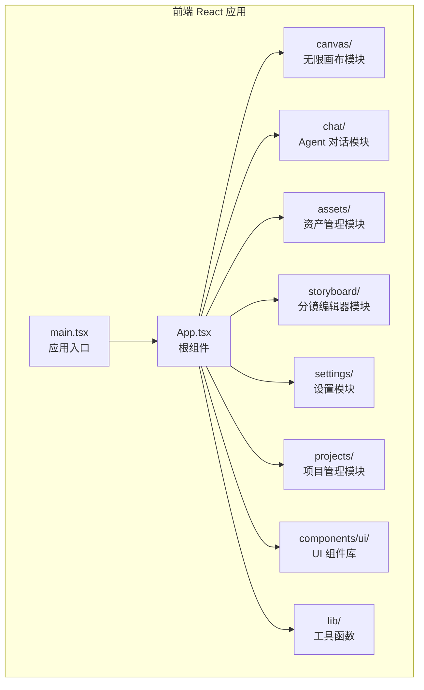
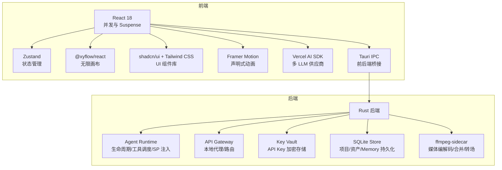
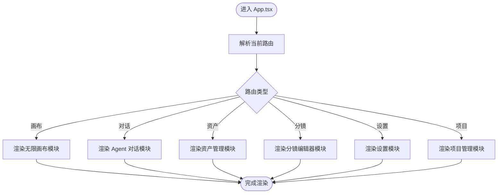
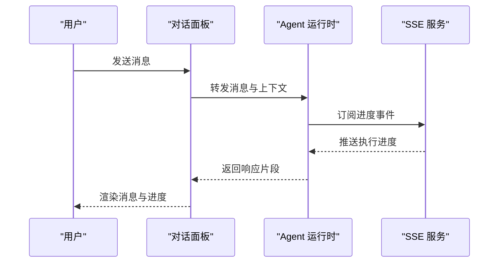
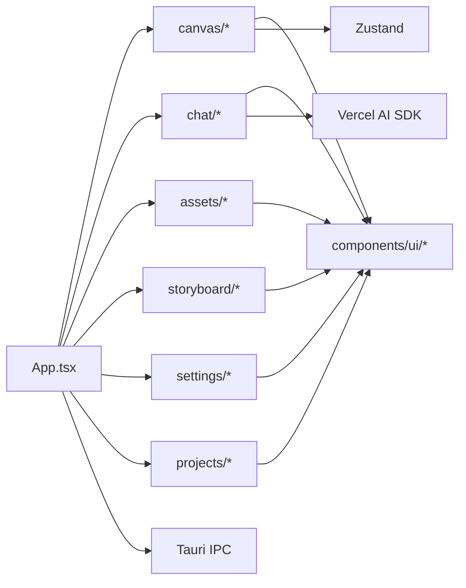

# React 组件架构

<cite>
**本文引用的文件**
- [buzhidaozenmemingmin.md](file://buzhidaozenmemingmin.md)
</cite>

## 目录
1. [简介](#简介)
2. [项目结构](#项目结构)
3. [核心组件](#核心组件)
4. [架构总览](#架构总览)
5. [详细组件分析](#详细组件分析)
6. [依赖分析](#依赖分析)
7. [性能考虑](#性能考虑)
8. [故障排查指南](#故障排查指南)
9. [结论](#结论)
10. [附录](#附录)

## 简介
本文件面向 Flower Age Video 项目，基于 React 18 的现代组件设计模式，系统梳理前端组件层次结构、模块化组织与代码分割策略；阐释根组件 App.tsx 的设计思路、路由配置与页面布局；解释组件间通信模式、props 传递与事件处理机制；涵盖生命周期管理、错误边界使用与性能优化策略，并提供组件开发最佳实践、代码规范与重构指南，以及在 Tauri 环境下的组件开发与调试方法。

## 项目结构
Flower Age Video 采用“Tauri 桌面壳 + Rust 后端 + React 前端”的分层架构。前端以 Vite + React 18 + TypeScript 构建，使用 Zustand 管理状态，@xyflow/react 实现无限画布，shadcn/ui + Radix + Tailwind CSS 提供 UI 基础组件，Framer Motion 提供声明式动画，Vercel AI SDK 支持多 LLM 供应商的实时对话与进度推送。

项目前端目录组织如下：
- main.tsx：应用入口，挂载根组件 App.tsx
- App.tsx：根组件，负责路由与页面布局
- canvas/：无限画布模块，包含主画布组件、Zustand 状态、节点类型与工具栏
- chat/：Agent 对话模块，包含对话面板、消息气泡、思考过程与进度条
- assets/：资产管理模块，包含资产浏览器与资产卡片
- storyboard/：分镜编辑器模块，包含编辑器、镜头卡与时间轴
- settings/：设置模块，包含设置页、API Key 管理、模型选择与偏好面板
- projects/：项目管理模块，包含项目列表与创建
- components/ui/：基于 shadcn/ui 的可复用 UI 组件
- lib/：工具函数，包含 Tauri IPC 封装、API 调用与通用工具



**图表来源**
- [buzhidaozenmemingmin.md:418-472](file://buzhidaozenmemingmin.md#L418-L472)

**章节来源**
- [buzhidaozenmemingmin.md:418-472](file://buzhidaozenmemingmin.md#L418-L472)

## 核心组件
- 根组件 App.tsx：作为路由与页面布局的中枢，负责根据当前页面渲染对应模块，协调画布、对话、资产、分镜与设置等功能区域。
- 无限画布模块：基于 @xyflow/react 的无限画布，支持节点拖拽、连线、缩放、对齐吸附与小地图导航；节点类型包括 ProjectNode、TextNode、ImageNode、VideoNode、AudioNode、StoryboardNode、TaskNode、GroupNode。
- Agent 对话模块：提供实时对话面板、消息气泡、思考过程展示与任务进度条，结合 SSE 推送 Agent 执行进度。
- 资产管理模块：提供资产浏览器与资产卡片，用于浏览与管理生成的图像、视频、音频与文本等资产。
- 分镜编辑器模块：提供分镜编辑器、镜头卡与时间轴，支持将画布中的资产组织为故事板。
- 设置模块：提供设置页、API Key 管理、模型选择与偏好设置，支撑多供应商 API 的配置与切换。
- 项目管理模块：提供项目列表与创建功能，支撑多项目工作流。
- UI 组件库：基于 shadcn/ui + Radix + Tailwind CSS，提供无运行时依赖的可复用组件。
- 工具函数：封装 Tauri IPC、API 调用与通用工具，统一前后端交互与数据处理。

**章节来源**
- [buzhidaozenmemingmin.md:213-262](file://buzhidaozenmemingmin.md#L213-L262)
- [buzhidaozenmemingmin.md:418-472](file://buzhidaozenmemingmin.md#L418-L472)

## 架构总览
Flower Age Video 的前端架构围绕“模块化 + 状态集中 + 事件驱动”展开。React 18 提供并发特性与 Suspense 支持，Zustand 作为轻量状态管理，@xyflow/react 提供无限画布能力，shadcn/ui + Tailwind CSS 提供一致的视觉与交互体验，Vercel AI SDK 提供多供应商的实时对话与进度推送。Tauri IPC 作为前后端通信桥梁，将前端 UI 与 Rust 后端的 Agent 运行时、API 网关、Key Vault、SQLite 存储、媒体处理等能力连接起来。



**图表来源**
- [buzhidaozenmemingmin.md:27-83](file://buzhidaozenmemingmin.md#L27-L83)
- [buzhidaozenmemingmin.md:98-134](file://buzhidaozenmemingmin.md#L98-L134)

## 详细组件分析

### 根组件 App.tsx 设计与路由
- 设计思路：App.tsx 作为单一入口，负责页面布局与路由分发。通过条件渲染与路由钩子，将无限画布、对话、资产、分镜与设置等功能区域按需加载，确保首屏性能与用户体验。
- 路由配置：采用基于路径的简单路由策略，根据当前页面渲染对应模块，避免复杂路由层级带来的维护成本。
- 页面布局：采用响应式布局，支持侧边栏、主内容区与底部状态栏的组合，确保在不同分辨率下的可用性。



**图表来源**
- [buzhidaozenmemingmin.md:418-472](file://buzhidaozenmemingmin.md#L418-L472)

**章节来源**
- [buzhidaozenmemingmin.md:418-472](file://buzhidaozenmemingmin.md#L418-L472)

### 无限画布模块（Canvas）
- 画布核心：基于 @xyflow/react 的无限画布，支持无限缩放、拖拽布局、连线关系、分组节点、小地图与对齐吸附。
- 节点类型：包含 ProjectNode、TextNode、ImageNode、VideoNode、AudioNode、StoryboardNode、TaskNode、GroupNode，每种节点承载不同的数据与行为。
- 状态管理：使用 Zustand 管理节点、边、视口、当前项目上下文与 Agent 集成映射，提供增删节点、连线与画布同步等操作接口。
- 画布同步：通过 Agent 结果同步到画布节点，建立 sourceNodeId 资产关系链，确保生成物在画布上的可视化管理。

```mermaid
classDiagram
class CanvasState {
+nodes : Node[]
+edges : Edge[]
+addNode(node) : void
+removeNode(id) : void
+connectNodes(source, target) : void
+viewport : {x : number, y : number, zoom : number}
+currentProjectId : string
+agentTaskMap : Map<string, string>
+syncAgentResult(taskId, result) : void
}
class Node {
+id : string
+type : string
+position : {x : number, y : number}
+data : any
}
class Edge {
+id : string
+source : string
+target : string
+type : string
}
CanvasState --> Node : "管理"
CanvasState --> Edge : "管理"
```

**图表来源**
- [buzhidaozenmemingmin.md:239-262](file://buzhidaozenmemingmin.md#L239-L262)

**章节来源**
- [buzhidaozenmemingmin.md:213-262](file://buzhidaozenmemingmin.md#L213-L262)

### Agent 对话模块（Chat）
- 对话面板：提供用户输入与 Agent 响应的交互界面，支持多轮对话与上下文管理。
- 消息气泡：区分用户消息与 Agent 消息，支持富文本与进度指示。
- 思考过程：展示 Agent 的内部推理与工具调用过程，提升透明度与可解释性。
- 任务进度：通过进度条与 SSE 推送，实时反馈 Agent 执行进度与状态。



**图表来源**
- [buzhidaozenmemingmin.md:66-83](file://buzhidaozenmemingmin.md#L66-L83)
- [buzhidaozenmemingmin.md:109-110](file://buzhidaozenmemingmin.md#L109-L110)

**章节来源**
- [buzhidaozenmemingmin.md:66-83](file://buzhidaozenmemingmin.md#L66-L83)
- [buzhidaozenmemingmin.md:109-110](file://buzhidaozenmemingmin.md#L109-L110)

### 资产管理模块（Assets）
- 资产浏览器：提供资产列表与筛选，支持按类型、时间、关键词等维度查看。
- 资产卡片：展示资产缩略图、元数据与操作按钮，支持预览与删除。
- 与画布联动：资产可直接拖拽到画布，或通过右键菜单创建节点。

**章节来源**
- [buzhidaozenmemingmin.md:445-447](file://buzhidaozenmemingmin.md#L445-L447)

### 分镜编辑器模块（Storyboard）
- 分镜编辑器：支持将画布中的资产组织为故事板，设置镜头顺序与转场效果。
- 镜头卡：展示每个镜头的描述、时长与预览帧，支持编辑与排序。
- 时间轴：提供时间轴视图，便于精确控制每个镜头的开始与结束时间。

**章节来源**
- [buzhidaozenmemingmin.md:448-451](file://buzhidaozenmemingmin.md#L448-L451)

### 设置模块（Settings）
- 设置页：提供全局设置入口，包含主题、语言、单位制等选项。
- API Key 管理：提供 API Key 的加密存储与配置，支持多供应商切换。
- 模型选择：允许用户选择当前使用的模型与供应商，支持快速切换。
- 偏好面板：保存用户偏好与角色锚点，提升后续创作效率。

**章节来源**
- [buzhidaozenmemingmin.md:452-456](file://buzhidaozenmemingmin.md#L452-L456)

### 项目管理模块（Projects）
- 项目列表：展示用户创建的项目，支持搜索、排序与批量操作。
- 项目创建：提供项目创建向导，设置项目名称、描述与初始画布。

**章节来源**
- [buzhidaozenmemingmin.md:457-459](file://buzhidaozenmemingmin.md#L457-L459)

### UI 组件库（shadcn/ui + Tailwind CSS）
- 无运行时依赖：组件按需引入，减少打包体积。
- 一致性：统一的视觉与交互规范，提升开发效率与用户体验。
- 可定制性：通过 Tailwind CSS 提供灵活的样式定制能力。

**章节来源**
- [buzhidaozenmemingmin.md:107-108](file://buzhidaozenmemingmin.md#L107-L108)

### 工具函数（lib）
- Tauri IPC 封装：统一前后端通信接口，隐藏 IPC 细节。
- API 调用：封装后端 API，提供类型安全的调用方式。
- 通用工具：提供日期、格式化、错误处理等通用工具函数。

**章节来源**
- [buzhidaozenmemingmin.md:461-464](file://buzhidaozenmemingmin.md#L461-L464)

## 依赖分析
- 组件耦合：App.tsx 作为中枢，与其他模块通过 props 与状态共享进行松耦合连接；画布模块与对话模块通过 Zustand 状态与 IPC 进行间接耦合。
- 直接依赖：各模块内部组件依赖 UI 组件库与工具函数；画布模块依赖 @xyflow/react；对话模块依赖 Vercel AI SDK。
- 外部依赖：React 18、TypeScript、Vite、Zustand、@xyflow/react、shadcn/ui、Tailwind CSS、Framer Motion、Vercel AI SDK、Tauri。



**图表来源**
- [buzhidaozenmemingmin.md:418-472](file://buzhidaozenmemingmin.md#L418-L472)
- [buzhidaozenmemingmin.md:98-110](file://buzhidaozenmemingmin.md#L98-L110)

**章节来源**
- [buzhidaozenmemingmin.md:418-472](file://buzhidaozenmemingmin.md#L418-L472)
- [buzhidaozenmemingmin.md:98-110](file://buzhidaozenmemingmin.md#L98-L110)

## 性能考虑
- 代码分割：按路由与模块进行代码分割，利用 React.lazy 与 Suspense 实现懒加载，减少首屏体积与加载时间。
- 状态管理：Zustand 提供轻量状态管理，避免不必要的重渲染；合理拆分状态，使用 selector 选择性订阅。
- 画布性能：@xyflow/react 在大数据量场景下，建议启用虚拟化与增量更新；对节点与边进行批处理更新。
- 动画性能：Framer Motion 使用 GPU 加速动画，避免触发强制同步布局；合理使用 transform 与 opacity。
- 网络请求：Vercel AI SDK 支持流式响应与 SSE 推送，减少等待时间；对重复请求进行缓存与去抖。
- 打包优化：Vite 提供快速 HMR 与 Tree Shaking；Tailwind CSS 通过 Purge 优化最终体积。

[本节为通用性能指导，无需特定文件引用]

## 故障排查指南
- 组件渲染异常：检查 props 类型与默认值，确认组件是否正确接收与使用父组件传递的数据；使用 React DevTools 检查组件树与状态变化。
- 状态不更新：确认 Zustand 状态更新函数是否被正确调用；避免在状态对象中直接修改引用；使用 selector 选择性订阅。
- IPC 通信问题：检查 Tauri IPC 封装是否正确；确认后端命令是否已注册；在开发环境下开启日志以便追踪。
- 画布交互异常：检查 @xyflow/react 的节点与边数据结构；确认事件处理器绑定是否正确；验证视口状态与缩放级别。
- 对话与进度：确认 SSE 连接是否建立；检查后端事件推送逻辑；验证前端事件监听与状态更新。
- 错误边界：在关键模块添加错误边界，捕获并显示友好错误信息；记录错误堆栈以便调试。

**章节来源**
- [buzhidaozenmemingmin.md:461-464](file://buzhidaozenmemingmin.md#L461-L464)

## 结论
Flower Age Video 的 React 组件架构以模块化为核心，结合 Zustand 状态管理、@xyflow/react 无限画布与 shadcn/ui + Tailwind CSS 的 UI 基础设施，构建了清晰、可维护且高性能的前端系统。通过 App.tsx 的路由与布局设计，配合 Tauri IPC 的前后端桥接，实现了与 Rust 后端的无缝协作。遵循本文的最佳实践与性能优化策略，可在保证开发效率的同时，持续提升用户体验与系统稳定性。

[本节为总结性内容，无需特定文件引用]

## 附录
- 开发最佳实践
  - 使用 TypeScript 严格模式，确保类型安全与可维护性。
  - 组件设计遵循单一职责原则，尽量保持无状态组件与纯函数。
  - 使用 React 18 的并发特性，合理使用 Suspense 与并发渲染。
  - 状态管理集中在 Zustand，避免过度使用 Context 或 Redux。
  - UI 组件库按需引入，减少打包体积。
  - 对外暴露稳定的 API，内部实现可演进。
- 代码规范
  - 文件命名采用帕斯卡命名法（如 App.tsx），组件文件夹内包含组件与相关 hooks、store。
  - 导出统一的入口，便于模块化导入与测试。
  - 注释与文档齐全，便于团队协作与知识传承。
- 重构指南
  - 当模块复杂度上升时，优先拆分子模块与子组件，降低耦合度。
  - 对重复逻辑进行抽象，提取为通用 Hook 或工具函数。
  - 对性能瓶颈进行测量与优化，必要时引入缓存与懒加载。
  - 对外接口变更需保持向后兼容，或提供迁移指南。

[本节为通用指导内容，无需特定文件引用]