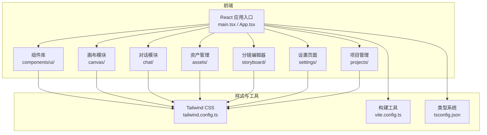
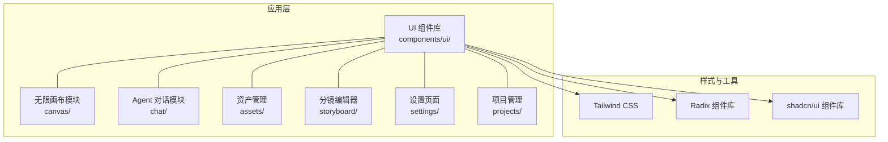
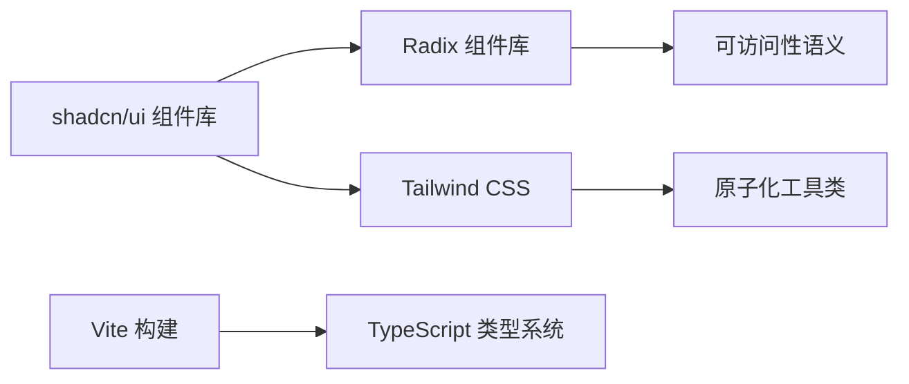

# UI 组件库

<cite>
**本文引用的文件**
- [buzhidaozenmemingmin.md](file://buzhidaozenmemingmin.md)
</cite>

## 目录
1. [简介](#简介)
2. [项目结构](#项目结构)
3. [核心组件](#核心组件)
4. [架构总览](#架构总览)
5. [组件详解](#组件详解)
6. [依赖关系分析](#依赖关系分析)
7. [性能考量](#性能考量)
8. [故障排查指南](#故障排查指南)
9. [结论](#结论)
10. [附录](#附录)

## 简介
本文件为 Flower Age Video 的 UI 组件库文档，围绕 shadcn/ui + Radix + Tailwind CSS 的现代化组件体系进行系统化说明。文档聚焦于组件的设计理念、使用方法、属性配置、事件处理与样式覆盖，涵盖按钮、输入框、模态框、导航栏等核心组件，并结合项目中已明确的技术栈与模块划分，给出组件组合模式、无障碍访问支持与跨浏览器兼容性建议。

## 项目结构
根据项目文档，前端采用 React + Vite + TypeScript，UI 组件以 shadcn/ui + Radix 为基础，样式使用 Tailwind CSS。组件库位于前端目录下的组件目录中，配合 Zustand 状态管理与 @xyflow/react 无限画布模块协同工作。

图表来源
- [buzhidaozenmemingmin.md:354-472](file://buzhidaozenmemingmin.md#L354-L472)

章节来源
- [buzhidaozenmemingmin.md:354-472](file://buzhidaozenmemingmin.md#L354-L472)

## 核心组件
- 组件体系：基于 shadcn/ui + Radix，强调“复制即用、无运行时依赖”，与 Tailwind CSS 原子化样式深度结合。
- 设计理念：以 Radix 作为无障碍与可访问性的底层基础，shadcn/ui 提供语义化、可定制的 UI 组件；Tailwind CSS 提供一致的视觉语言与响应式能力。
- 使用方法：组件通过 props 配置行为与外观；通过 className 或 shadcn/ui 提供的变体类名覆盖样式；事件回调通过标准 React 事件模型接入。
- 定制选项：支持尺寸、颜色、形状、状态等变体；可通过 Tailwind 工具类进行局部覆盖；必要时可在组件外层包裹容器进行布局与主题统一。

章节来源
- [buzhidaozenmemingmin.md:87-111](file://buzhidaozenmemingmin.md#L87-L111)
- [buzhidaozenmemingmin.md:460](file://buzhidaozenmemingmin.md#L460)

## 架构总览
下图展示了 UI 组件库在应用中的位置与交互关系，以及与画布、对话、资产管理等模块的协作方式。

图表来源
- [buzhidaozenmemingmin.md:354-472](file://buzhidaozenmemingmin.md#L354-L472)
- [buzhidaozenmemingmin.md:87-111](file://buzhidaozenmemingmin.md#L87-L111)

## 组件详解

### 按钮 Button
- 设计理念：基于 Radix 的可访问性语义，shadcn/ui 提供多种尺寸、状态与色彩变体，满足从主要操作到次要操作的场景。
- 使用方法：通过 props 传入点击回调、禁用状态、加载状态等；通过 Tailwind 工具类覆盖尺寸与颜色。
- 事件处理：onClick 为标准 React 事件；在异步操作中建议结合加载态 props 与禁用态，确保用户反馈一致。
- 样式覆盖：支持通过 className 覆盖默认样式；推荐优先使用 shadcn/ui 提供的变体类名，保持全局一致性。

章节来源
- [buzhidaozenmemingmin.md:87-111](file://buzhidaozenmemingmin.md#L87-L111)
- [buzhidaozenmemingmin.md:460](file://buzhidaozenmemingmin.md#L460)

### 输入框 Input
- 设计理念：提供基础文本输入能力，支持前缀/后缀图标、错误状态、禁用态等；与表单验证结合时可配合状态类名反馈。
- 使用方法：value 与 onChange 为标准受控模式；可结合 placeholder、type 等常规属性；错误态通过状态类名或外部容器提示。
- 事件处理：onChange、onBlur、onFocus 等标准事件；在复杂表单中建议配合 zod、react-hook-form 等进行校验与状态管理。
- 样式覆盖：通过 className 覆盖尺寸与圆角等；与 shadcn/ui 的组合组件（如 InputWithIcon）可减少重复样式。

章节来源
- [buzhidaozenmemingmin.md:87-111](file://buzhidaozenmemingmin.md#L87-L111)
- [buzhidaozenmemingmin.md:460](file://buzhidaozenmemingmin.md#L460)

### 模态框 Dialog
- 设计理念：基于 Radix 的可访问性语义，提供遮罩层、焦点陷阱与键盘交互；shadcn/ui 提供视觉与尺寸变体。
- 使用方法：通过 isOpen/openChange 控制显隐；内容区域建议包含标题、描述与操作按钮；关闭行为包括点击遮罩、按 ESC 键等。
- 事件处理：onOpenChange 用于统一处理打开/关闭逻辑；在关闭时注意清理内部状态与焦点恢复。
- 样式覆盖：通过 className 覆盖宽度、内边距与阴影等；建议在移动端使用响应式类名控制最大宽度。

章节来源
- [buzhidaozenmemingmin.md:87-111](file://buzhidaozenmemingmin.md#L87-L111)
- [buzhidaozenmemingmin.md:460](file://buzhidaozenmemingmin.md#L460)

### 导航栏 NavigationMenu
- 设计理念：提供多级菜单与下拉项，具备键盘可达性与焦点管理；适合在设置页、项目管理等模块中组织功能入口。
- 使用方法：通过 items 配置菜单层级；通过 onSelect 处理选中项；支持 hover/keyboard 触发。
- 事件处理：onSelect 返回被选中项标识；在切换路由或打开侧边栏时需同步状态。
- 样式覆盖：通过 className 覆盖背景、字体与间距；建议在深色主题下调整对比度。

章节来源
- [buzhidaozenmemingmin.md:87-111](file://buzhidaozenmemingmin.md#L87-L111)
- [buzhidaozenmemingmin.md:460](file://buzhidaozenmemingmin.md#L460)

### 组合模式与最佳实践
- 组件组合：将 Input 与 Button 组合形成搜索/提交区；将 Dialog 与 Form 组合形成设置/导入弹窗；将 NavigationMenu 与 Canvas/Assets 模块联动。
- 状态管理：在设置页与项目管理中，建议使用 Zustand 管理表单状态与提交流程，避免重复渲染与状态漂移。
- 无障碍访问：确保所有交互元素具备可访问名称与状态提示；在 Dialog 打开时自动将焦点移至首个可交互元素；在菜单中支持键盘导航。

章节来源
- [buzhidaozenmemingmin.md:452-460](file://buzhidaozenmemingmin.md#L452-L460)
- [buzhidaozenmemingmin.md:418-472](file://buzhidaozenmemingmin.md#L418-L472)

## 依赖关系分析
- 组件依赖：UI 组件依赖 Radix 提供的可访问性语义与状态管理；依赖 shadcn/ui 提供的视觉变体与组合能力；最终通过 Tailwind CSS 实现原子化样式。
- 样式依赖：Tailwind CSS 提供基础工具类，组件通过 className 与变体类名组合；在深浅主题切换时，建议通过根元素类名切换实现全局样式切换。
- 构建与类型：Vite 负责编译与热更新；TypeScript 提供类型安全；tsconfig 与 vite.config 保证路径别名与插件配置正确。

图表来源
- [buzhidaozenmemingmin.md:87-111](file://buzhidaozenmemingmin.md#L87-L111)
- [buzhidaozenmemingmin.md:466-471](file://buzhidaozenmemingmin.md#L466-L471)

章节来源
- [buzhidaozenmemingmin.md:87-111](file://buzhidaozenmemingmin.md#L87-L111)
- [buzhidaozenmemingmin.md:466-471](file://buzhidaozenmemingmin.md#L466-L471)

## 性能考量
- 组件懒加载：在设置页与资产管理等模块中，对重型组件（如分镜编辑器）采用懒加载，减少首屏渲染压力。
- 渲染优化：使用 React.memo 与 useMemo/useCallback 降低不必要的重渲染；在列表组件中使用虚拟滚动。
- 样式优化：通过 Tailwind 的 purge 配置移除未使用样式；在深色主题下避免频繁的颜色计算。
- 事件节流：在高频输入与滚动场景中，对事件回调进行节流/防抖处理。

## 故障排查指南
- 组件样式异常
  - 症状：组件样式错位、颜色不生效。
  - 排查：确认 Tailwind 配置是否正确加载；检查 className 是否与 shadcn/ui 变体类冲突；核对主题类名是否在根元素生效。
- 无障碍问题
  - 症状：键盘无法聚焦、屏幕阅读器无法读取。
  - 排查：确认组件是否使用 Radix 提供的可访问性语义；检查 aria-* 属性是否正确设置；在 Dialog 打开时是否自动聚焦首个可交互元素。
- 事件回调无效
  - 症状：点击/输入无响应。
  - 排查：检查 props 是否传入；确认父级容器是否存在 pointer-events-none；在受控组件中检查 value 与 onChange 是否同步。
- 响应式布局异常
  - 症状：移动端显示错乱。
  - 排查：检查 Tailwind 断点类名是否正确；确认容器是否设置了 overflow-x-auto；在 Dialog 中检查最大宽度与 margin 的响应式设置。

章节来源
- [buzhidaozenmemingmin.md:87-111](file://buzhidaozenmemingmin.md#L87-L111)
- [buzhidaozenmemingmin.md:466-471](file://buzhidaozenmemingmin.md#L466-L471)

## 结论
Flower Age Video 的 UI 组件库以 shadcn/ui + Radix + Tailwind CSS 为核心，提供了高可访问性、强可定制与低耦合的组件体系。通过合理的组合模式、状态管理与样式覆盖策略，能够支撑从设置页到无限画布的多样化界面需求。建议在后续迭代中持续完善主题系统与无障碍细节，确保跨浏览器与多设备的一致体验。

## 附录
- 主题定制
  - 建议在 tailwind.config 中集中定义颜色、字体与间距变量；通过根元素类名切换实现明暗主题；在 shadcn/ui 组件中优先使用变体类名而非硬编码样式。
- 响应式设计
  - 在移动端优先使用紧凑布局与触摸友好的尺寸；在桌面端提供更宽的容器与更丰富的交互细节；在 Dialog 与导航菜单中针对小屏设备优化高度与滚动行为。
- 无障碍访问
  - 为所有交互元素提供可访问名称；在表单中提供错误提示与成功反馈；在模态框中实现焦点陷阱与 ESC 关闭；在菜单中支持键盘导航与快捷键。

章节来源
- [buzhidaozenmemingmin.md:87-111](file://buzhidaozenmemingmin.md#L87-L111)
- [buzhidaozenmemingmin.md:466-471](file://buzhidaozenmemingmin.md#L466-L471)