# 前端组件系统

<cite>
**本文档引用的文件**
- [buzhidaozenmemingmin.md](file://buzhidaozenmemingmin.md)
- [package.json](file://package.json)
- [tsconfig.json](file://tsconfig.json)
- [vite.config.ts](file://vite.config.ts)
- [tailwind.config.ts](file://tailwind.config.ts)
- [index.html](file://index.html)
- [src/main.tsx](file://src/main.tsx)
- [src/App.tsx](file://src/App.tsx)
- [src/canvas/Canvas.tsx](file://src/canvas/Canvas.tsx)
- [src/canvas/store.ts](file://src/canvas/store.ts)
- [src/lib/tauri.ts](file://src/lib/tauri.ts)
- [src/lib/api.ts](file://src/lib/api.ts)
- [src/lib/utils.ts](file://src/lib/utils.ts)
</cite>

## 目录
1. [项目概述](#项目概述)
2. [项目结构](#项目结构)
3. [核心组件架构](#核心组件架构)
4. [状态管理系统](#状态管理系统)
5. [路由配置](#路由配置)
6. [样式系统](#样式系统)
7. [Tauri IPC 通信](#tauri-ipc-通信)
8. [API 调用系统](#api-调用系统)
9. [组件开发指南](#组件开发指南)
10. [性能优化策略](#性能优化策略)
11. [错误处理机制](#错误处理机制)
12. [集成模式](#集成模式)
13. [故障排除指南](#故障排除指南)
14. [总结](#总结)

## 项目概述

Flower Age Video 是一款基于 AI 驱动的无限画布创意工作站，面向视频创作者、内容生产者和 AI 艺术家。该项目采用现代化的前端技术栈，结合 Tauri 桌面壳层和 Rust 后端，为用户提供本地化的 AI 创作体验。

### 核心特性

- **无限画布**：基于 React Flow 的无限画布系统，支持节点拖拽、缩放和连线
- **主 Agent 编排**：1个主 Agent 拆解任务，5个专业子 Agent 并行/串行执行
- **多模态 AI 生成**：图像生成、视频生成、语音合成、音乐生成和后期制作
- **本地部署**：单文件 .exe 安装，无需 Docker、Python 或 Node.js 运行时
- **隐私优先**：用户 API Key 本地加密存储，无第三方代理

## 项目结构

项目采用清晰的功能模块化组织，遵循现代 React + Vite 开发模式：

```mermaid
graph TB
subgraph "项目根目录"
Root[项目根目录]
Src[src/] 前端代码
Tauri[src-tauri/] Rust 后端
Config[配置文件]
end
subgraph "前端模块 (src/)"
Main[main.tsx] 入口
App[App.tsx] 根组件
Canvas[canvas/] 画布模块
Chat[chat/] Agent 对话
Assets[assets/] 资产管理
Storyboard[storyboard/] 分镜编辑器
Settings[settings/] 设置模块
Components[components/ui/] UI 组件
Lib[lib/] 工具函数
end
subgraph "画布模块"
CanvasMain[Canvas.tsx] 主画布
Store[store.ts] Zustand 状态
Nodes[nodes/] 节点类型
Hooks[hooks/] 画布 Hooks
Toolbar[toolbar/] 工具栏
end
subgraph "工具函数"
TauriIPC[tauri.ts] IPC 封装
API[api.ts] API 调用
Utils[utils.ts] 通用工具
end
Root --> Src
Root --> Tauri
Root --> Config
Src --> Main
Src --> App
Src --> Canvas
Src --> Chat
Src --> Assets
Src --> Storyboard
Src --> Settings
Src --> Components
Src --> Lib
Canvas --> CanvasMain
Canvas --> Store
Canvas --> Nodes
Canvas --> Hooks
Canvas --> Toolbar
Lib --> TauriIPC
Lib --> API
Lib --> Utils
```

**图表来源**
- [buzhidaozenmemingmin.md:354-472](file://buzhidaozenmemingmin.md#L354-L472)

**章节来源**
- [buzhidaozenmemingmin.md:354-472](file://buzhidaozenmemingmin.md#L354-L472)

## 核心组件架构

### 组件层次结构

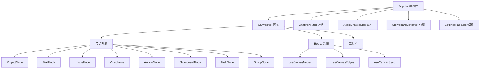

**图表来源**
- [buzhidaozenmemingmin.md:421-464](file://buzhidaozenmemingmin.md#L421-L464)

### 组件通信模式

项目采用多种组件通信模式：

1. **Props Drilling**：父子组件间的数据传递
2. **Context API**：跨层级组件共享状态
3. **Zustand Store**：全局状态管理
4. **Event Bus**：组件间事件通信

**章节来源**
- [buzhidaozenmemingmin.md:421-464](file://buzhidaozenmemingmin.md#L421-L464)

## 状态管理系统

### Zustand 状态架构

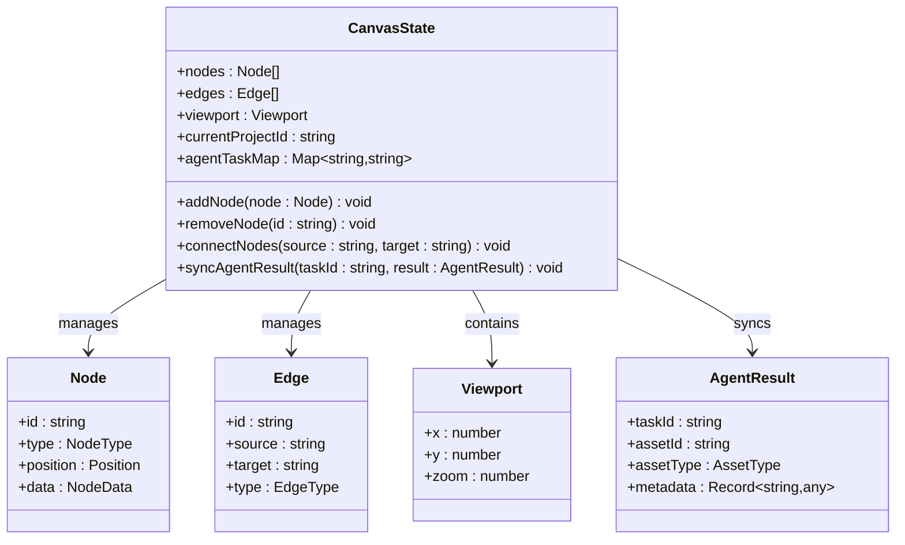

**图表来源**
- [buzhidaozenmemingmin.md:239-262](file://buzhidaozenmemingmin.md#L239-L262)

### 状态管理流程

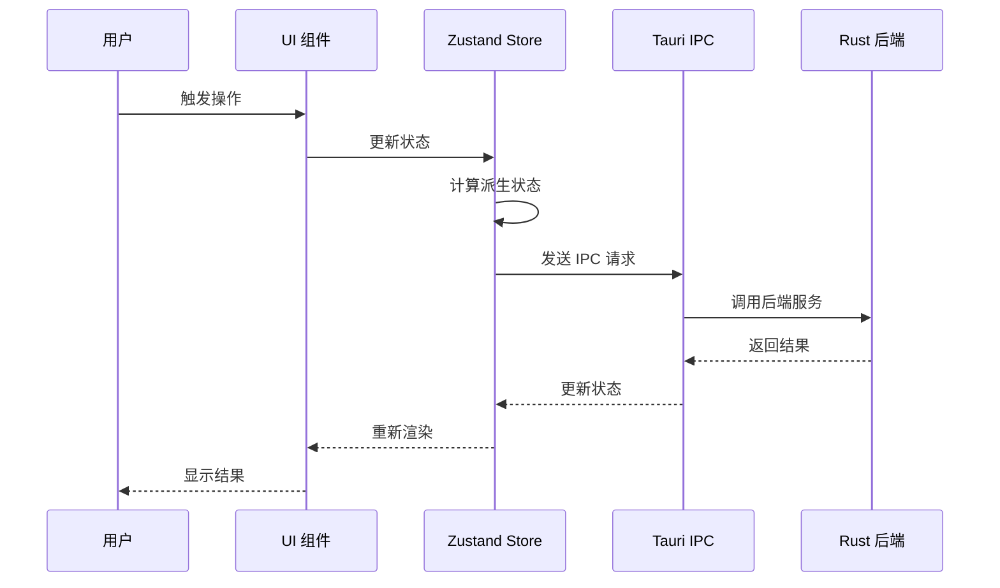

**图表来源**
- [buzhidaozenmemingmin.md:239-262](file://buzhidaozenmemingmin.md#L239-L262)

**章节来源**
- [buzhidaozenmemingmin.md:239-262](file://buzhidaozenmemingmin.md#L239-L262)

## 路由配置

### 路由架构设计

项目采用基于功能的路由组织，主要页面包括：

- **画布页面** (`/canvas`) - 主要工作区
- **资产浏览器** (`/assets`) - 资产管理
- **分镜编辑器** (`/storyboard`) - 分镜创作
- **设置页面** (`/settings`) - 系统配置

### 路由守卫机制

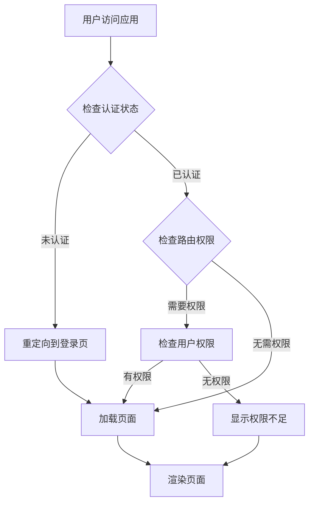

**图表来源**
- [buzhidaozenmemingmin.md:418-471](file://buzhidaozenmemingmin.md#L418-L471)

**章节来源**
- [buzhidaozenmemingmin.md:418-471](file://buzhidaozenmemingmin.md#L418-L471)

## 样式系统

### Tailwind CSS 配置

项目采用 Tailwind CSS 作为主要样式解决方案，结合 shadcn/ui 组件库：

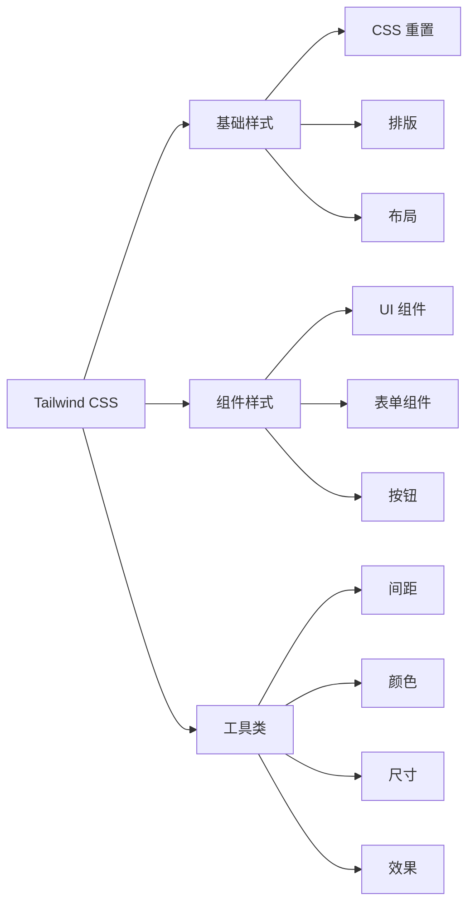

**图表来源**
- [buzhidaozenmemingmin.md:107-108](file://buzhidaozenmemingmin.md#L107-L108)

### shadcn/ui 集成

shadcn/ui 提供了高质量的 React 组件，具有以下特点：

- **无运行时依赖**：纯 CSS 样式，无额外运行时开销
- **可定制性强**：支持主题定制和样式覆盖
- **类型安全**：完整的 TypeScript 支持
- **复制即用**：组件可以直接复制使用

**章节来源**
- [buzhidaozenmemingmin.md:107-108](file://buzhidaozenmemingmin.md#L107-L108)

## Tauri IPC 通信

### IPC 通信架构

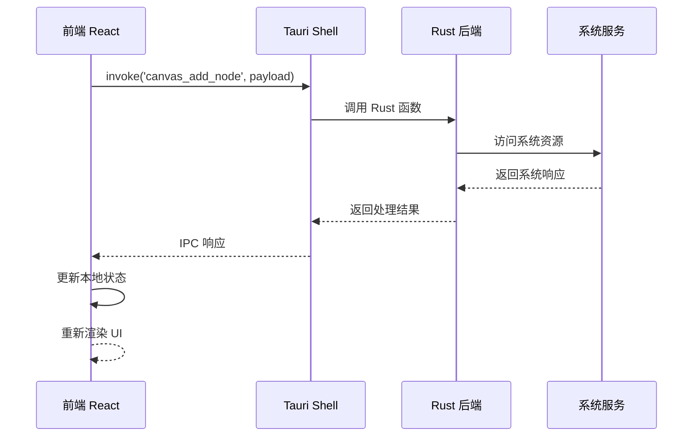

**图表来源**
- [buzhidaozenmemingmin.md:462](file://buzhidaozenmemingmin.md#L462)

### IPC API 设计

IPC 通信采用统一的接口设计：

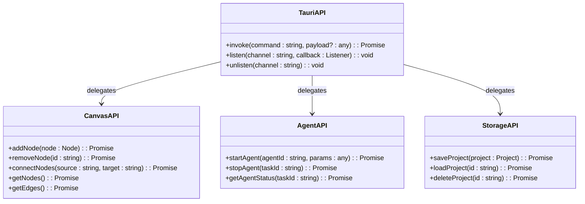

**图表来源**
- [buzhidaozenmemingmin.md:462](file://buzhidaozenmemingmin.md#L462)

**章节来源**
- [buzhidaozenmemingmin.md:462](file://buzhidaozenmemingmin.md#L462)

## API 调用系统

### API 调用架构

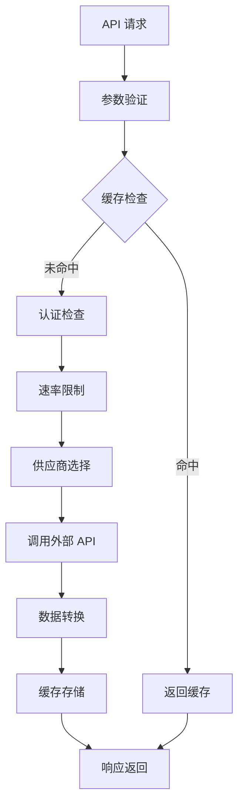

**图表来源**
- [buzhidaozenmemingmin.md:266-288](file://buzhidaozenmemingmin.md#L266-L288)

### 支持的 AI 供应商

项目支持多家 AI 供应商，采用统一的 API 网关模式：

| 供应商类别 | 支持的供应商 | 主要用途 |
|-----------|-------------|---------|
| 大语言模型(LLM) | OpenAI, Anthropic, DeepSeek, 通义千问, MiniMax | Agent 推理 |
| 图像生成 | OpenAI DALL·E, Stability AI, Midjourney, 即梦/豆包, Recraft | 通用图像生成 |
| 视频生成 | Runway, 可灵, 即梦, MiniMax, Luma | 视频内容生成 |
| 语音合成 | MiniMax, ElevenLabs, OpenAI | TTS 服务 |
| 音乐生成 | Suno, Udio, MiniMax | 音乐内容生成 |

**章节来源**
- [buzhidaozenmemingmin.md:266-337](file://buzhidaozenmemingmin.md#L266-L337)

## 组件开发指南

### 组件开发最佳实践

1. **类型安全**：使用 TypeScript 定义组件 Props 和状态
2. **可复用性**：设计通用组件，支持 props 配置
3. **性能优化**：使用 React.memo、useMemo、useCallback
4. **错误处理**：提供完善的错误边界和降级方案
5. **可访问性**：遵循 WCAG 指南，支持键盘导航

### 组件命名规范

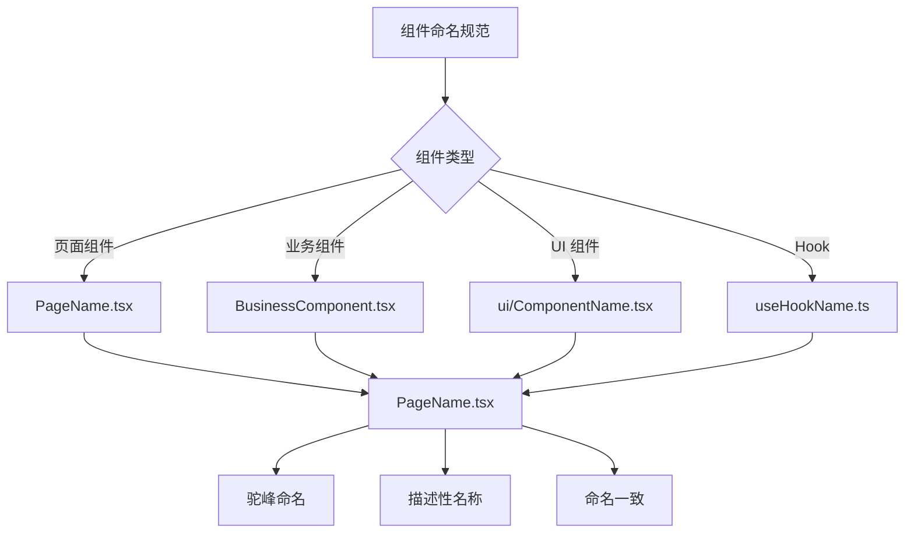

### 组件测试策略

- **单元测试**：使用 Jest + React Testing Library
- **集成测试**：测试组件间交互
- **端到端测试**：使用 Playwright 或 Cypress
- **视觉回归测试**：使用 Percy 或 Chromatic

## 性能优化策略

### 前端性能优化

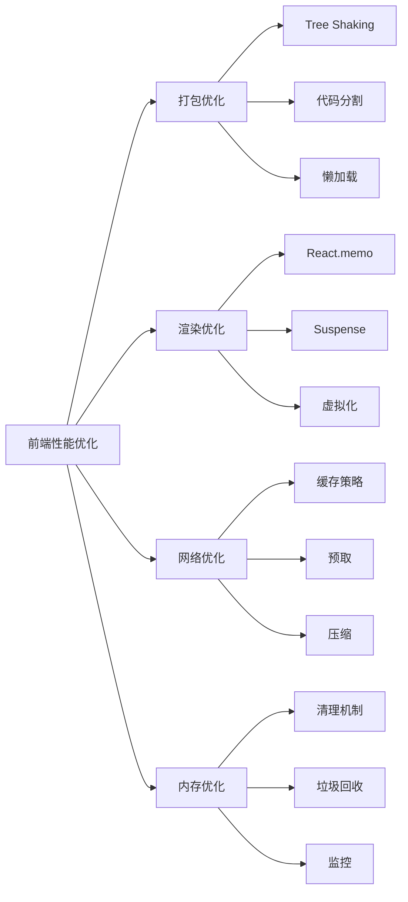

### 状态管理优化

- **状态分片**：将大状态分解为小的独立状态
- **选择器优化**：使用 Reselect 或自定义选择器
- **批量更新**：使用 React 的批处理更新
- **持久化策略**：合理使用 localStorage 或 IndexedDB

### 渲染性能优化

- **虚拟滚动**：大量数据时使用虚拟化
- **组件拆分**：避免不必要的重渲染
- **CSS 动画**：使用 transform 和 opacity
- **图片优化**：使用 WebP 格式和适当的尺寸

## 错误处理机制

### 错误边界设计

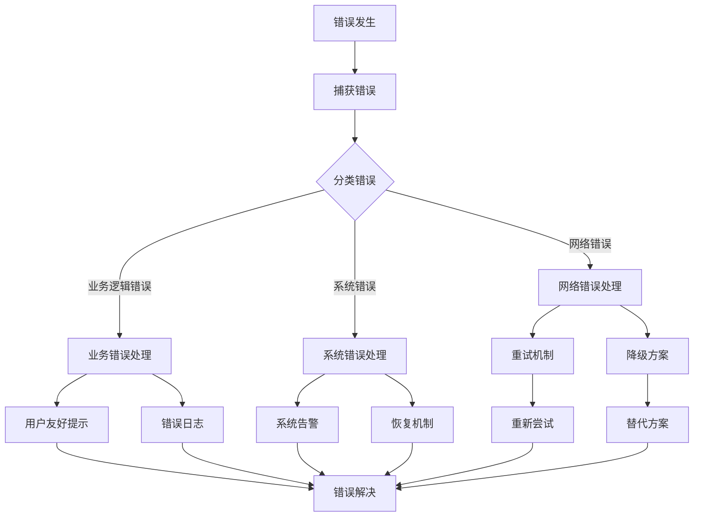

### 错误处理策略

1. **用户可见错误**：提供友好的错误提示和解决方案
2. **系统内部错误**：记录详细日志，便于调试
3. **网络异常处理**：实现重试机制和超时处理
4. **数据一致性**：确保错误不会破坏应用状态

**章节来源**
- [buzhidaozenmemingmin.md:549-594](file://buzhidaozenmemingmin.md#L549-L594)

## 集成模式

### 前后端集成架构

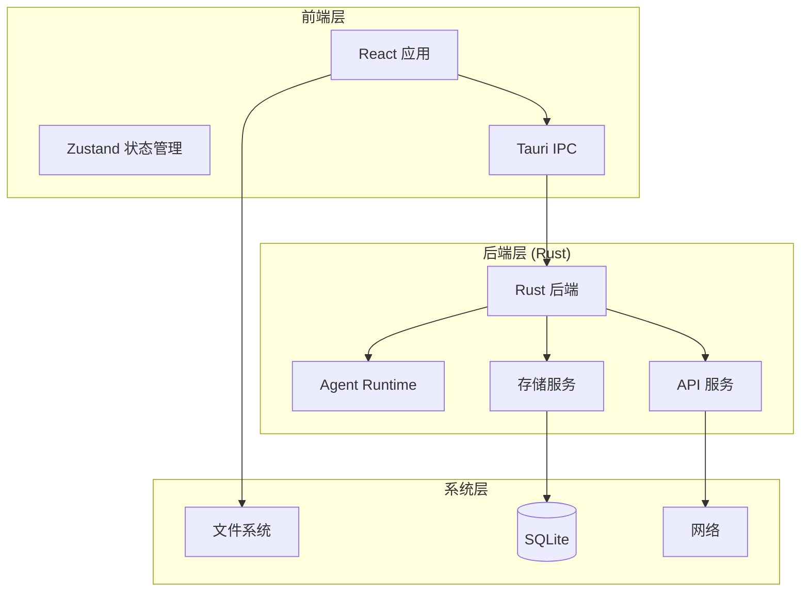

**图表来源**
- [buzhidaozenmemingmin.md:27-83](file://buzhidaozenmemingmin.md#L27-L83)

### 数据流设计

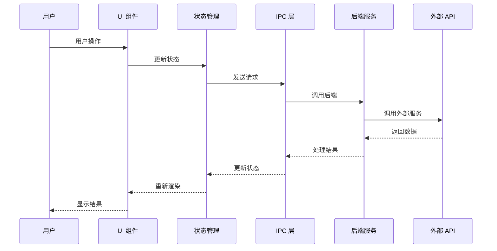

**图表来源**
- [buzhidaozenmemingmin.md:27-83](file://buzhidaozenmemingmin.md#L27-L83)

**章节来源**
- [buzhidaozenmemingmin.md:27-83](file://buzhidaozenmemingmin.md#L27-L83)

## 故障排除指南

### 常见问题诊断

| 问题类型 | 症状 | 诊断步骤 | 解决方案 |
|---------|------|---------|---------|
| IPC 连接失败 | 应用无法启动 | 检查 Tauri 配置和后端服务 | 重启应用，检查日志 |
| 状态不同步 | UI 显示异常 | 检查 Zustand 状态更新 | 添加状态监听，调试更新流程 |
| 网络请求失败 | API 调用超时 | 检查网络连接和代理设置 | 实现重试机制，添加超时处理 |
| 性能问题 | 页面卡顿 | 使用性能分析工具 | 优化渲染，实施懒加载 |

### 调试工具

- **React DevTools**：组件树检查和性能分析
- **Redux DevTools**：状态变更追踪
- **Tauri Inspector**：IPC 调试和日志查看
- **浏览器开发者工具**：网络请求和性能分析

### 日志记录策略

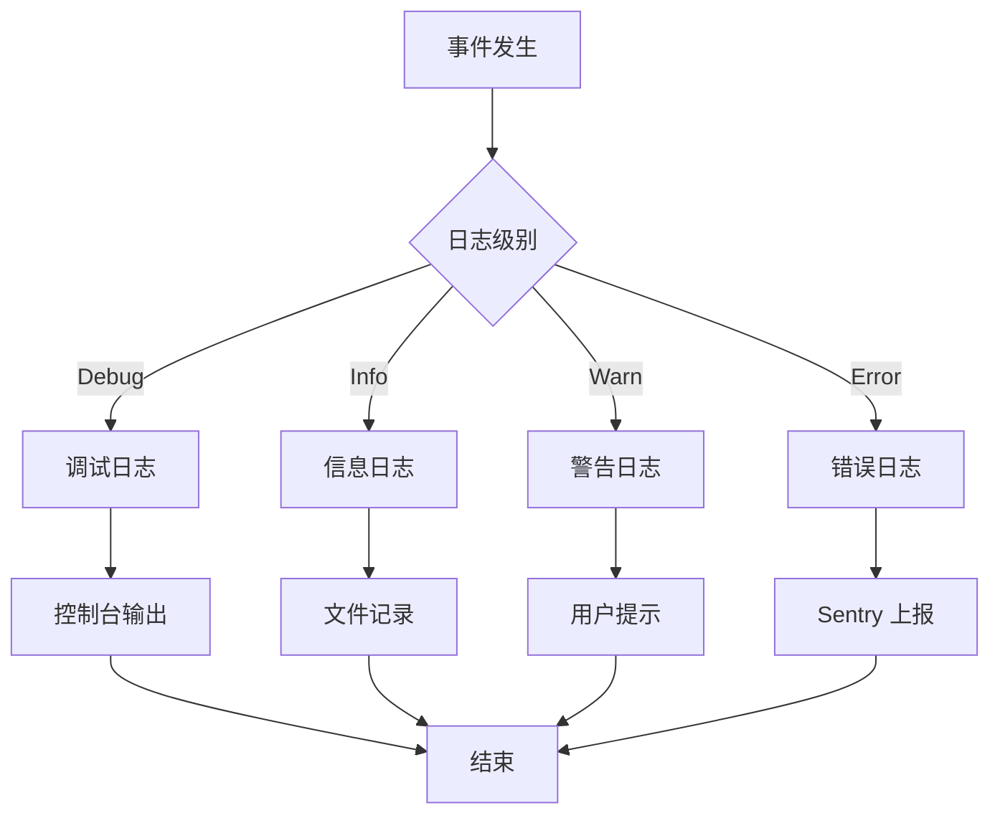

## 总结

Flower Age Video 的前端组件系统展现了现代前端开发的最佳实践，结合了：

1. **技术栈优势**：React 18 + Vite + TypeScript 提供了高性能和开发体验
2. **架构设计**：清晰的模块化组织和状态管理策略
3. **用户体验**：基于 shadcn/ui + Tailwind CSS 的现代化界面
4. **集成能力**：通过 Tauri IPC 与 Rust 后端无缝集成
5. **可扩展性**：支持插件系统和多供应商 API 集成

该系统为视频创作者提供了强大的 AI 驱动创作工具，同时保持了良好的性能和用户体验。通过合理的架构设计和开发规范，为后续的功能扩展和维护奠定了坚实的基础。