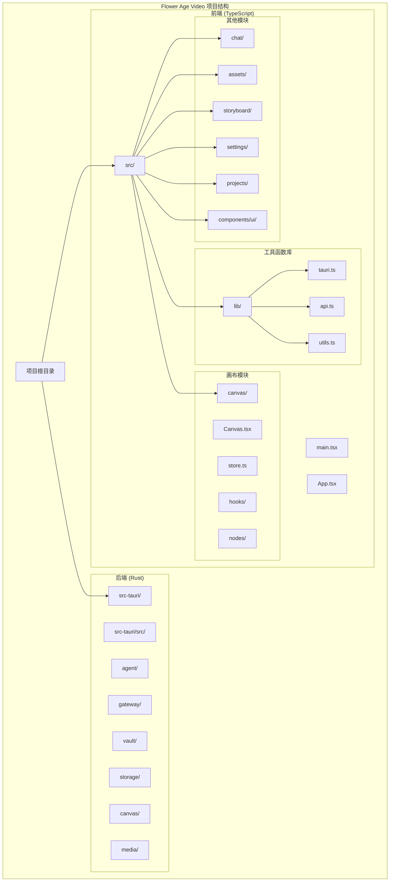
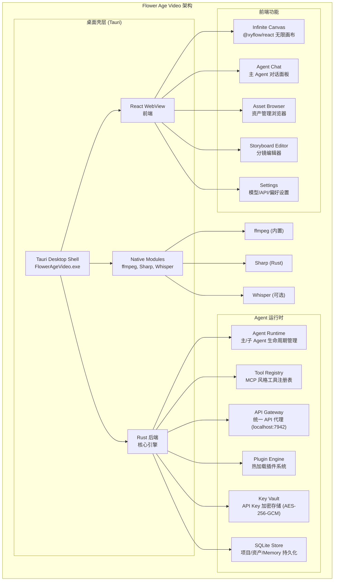
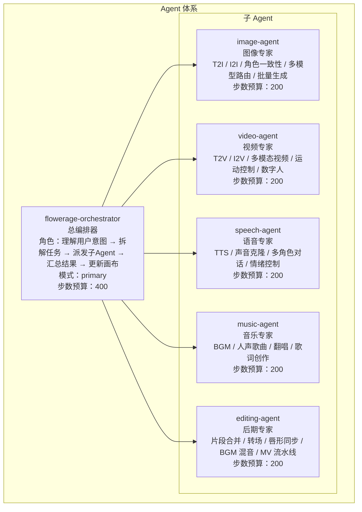
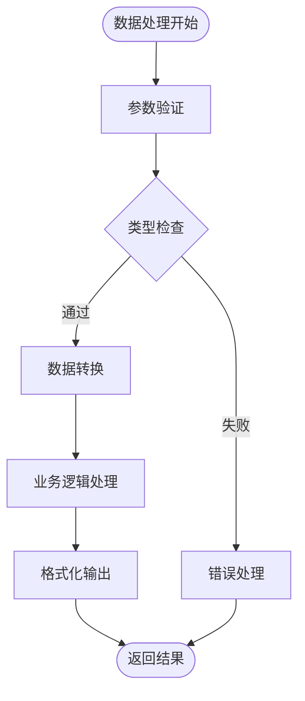
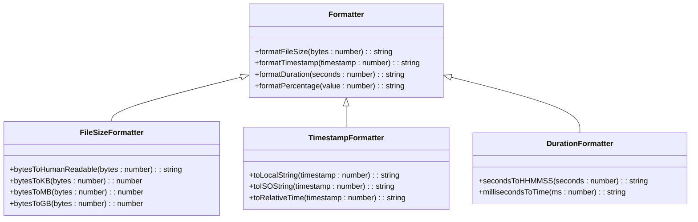
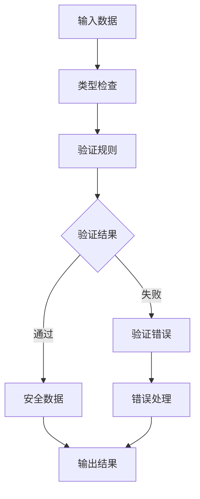
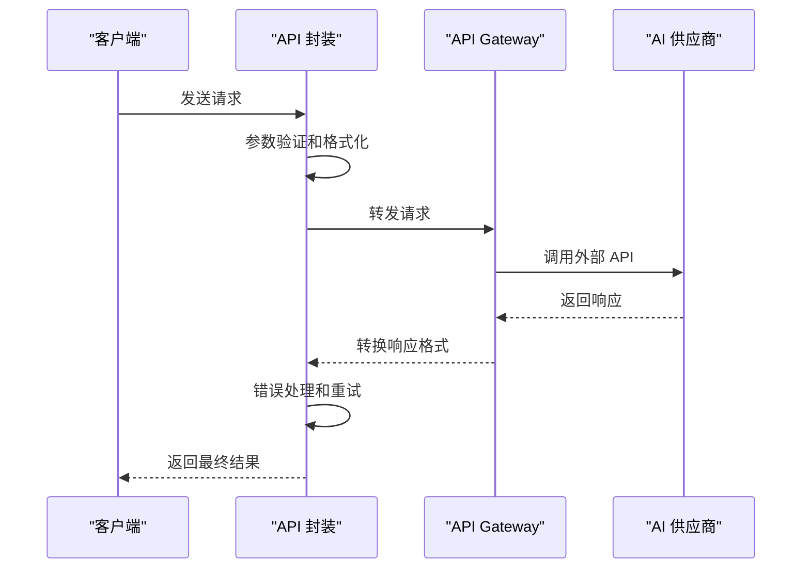
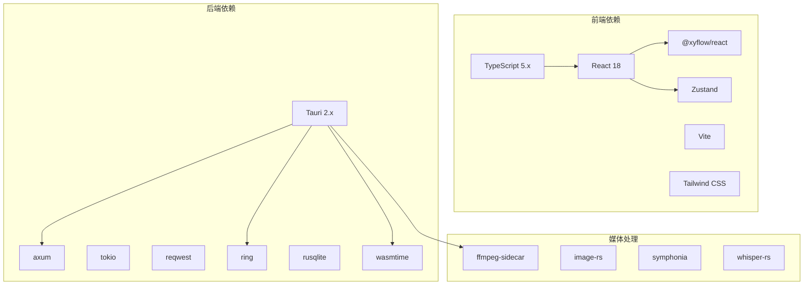
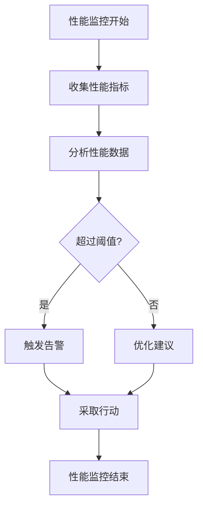
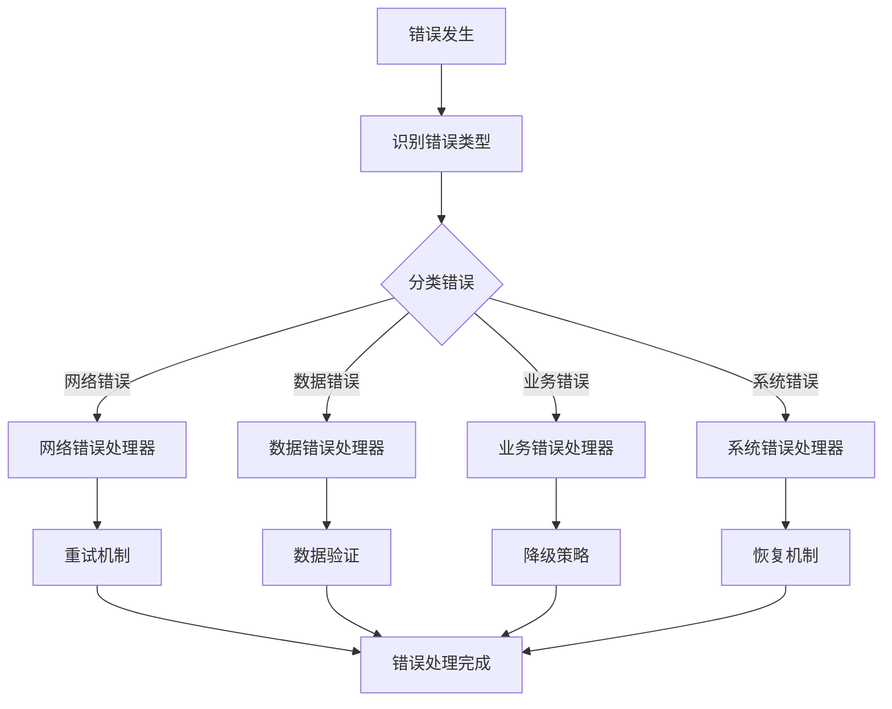

# 工具函数库

<cite>
**本文档引用的文件**
- [buzhidaozenmemingmin.md](file://buzhidaozenmemingmin.md)
</cite>

## 目录
1. [简介](#简介)
2. [项目结构](#项目结构)
3. [核心组件](#核心组件)
4. [架构概览](#架构概览)
5. [详细组件分析](#详细组件分析)
6. [依赖分析](#依赖分析)
7. [性能考虑](#性能考虑)
8. [故障排除指南](#故障排除指南)
9. [结论](#结论)
10. [附录](#附录)

## 简介

Flower Age Video 是一款基于 Tauri 桌面框架的 AI 驱动无限画布创意工作站。该项目采用 TypeScript 作为主要开发语言，构建了一个功能完整的桌面应用程序，支持图像生成、视频生成、语音合成、音乐生成和后期制作的全链路协作。

本项目的核心价值在于其独特的架构设计：通过主 Agent 编排器协调多个专业子 Agent，实现高效的 AI 创作工作流。项目完全本地化部署，无需 Docker、Python 或 Node.js 运行时，双击即可使用。

## 项目结构

根据项目设计文档，Flower Age Video 采用模块化的项目结构，其中工具函数库位于前端项目的 `src/lib/` 目录下：



**图表来源**
- [buzhidaozenmemingmin.md: 461-472:461-472](file://buzhidaozenmemingmin.md#L461-L472)

**章节来源**
- [buzhidaozenmemingmin.md: 461-472:461-472](file://buzhidaozenmemingmin.md#L461-L472)

## 核心组件

### 工具函数库架构

根据项目设计文档，工具函数库位于 `src/lib/` 目录下，包含以下核心文件：

- **tauri.ts**: Tauri IPC 封装，负责前端与 Rust 后端的通信
- **api.ts**: API 调用封装，处理各种服务接口
- **utils.ts**: 核心工具函数集合，包含数据处理、格式化、类型检查等功能

### 技术栈支持

项目采用全链路 TypeScript 类型系统，确保代码的类型安全性和开发体验：

- **TypeScript 5.x**: 全链路类型安全
- **React 18**: 成熟的 UI 框架生态
- **Vite**: 极速构建工具
- **@xyflow/react**: 行业标准无限画布
- **Zustand**: 轻量级状态管理

**章节来源**
- [buzhidaozenmemingmin.md: 87-111:87-111](file://buzhidaozenmemingmin.md#L87-L111)

## 架构概览

### 整体架构设计



**图表来源**
- [buzhidaozenmemingmin.md: 29-49:29-49](file://buzhidaozenmemingmin.md#L29-L49)

### Agent 体系架构



**图表来源**
- [buzhidaozenmemingmin.md: 139-171:139-171](file://buzhidaozenmemingmin.md#L139-L171)

**章节来源**
- [buzhidaozenmemingmin.md: 137-191:137-191](file://buzhidaozenmemingmin.md#L137-L191)

## 详细组件分析

### 工具函数库设计原则

基于项目的技术栈和架构要求，工具函数库应遵循以下设计原则：

#### 1. 类型安全优先
- 使用 TypeScript 5.x 的完整类型系统
- 确保所有函数都有明确的输入输出类型定义
- 利用泛型和条件类型提高代码复用性

#### 2. 性能优化
- 函数式编程范式，避免不必要的状态修改
- 合理使用缓存机制
- 避免阻塞主线程的操作

#### 3. 可维护性
- 清晰的函数命名和模块划分
- 完善的错误处理机制
- 详细的文档注释

### 核心工具函数分类

#### 数据处理函数



#### 格式化工具



#### 类型检查和验证函数



### API 调用封装



**图表来源**
- [buzhidaozenmemingmin.md: 268-288:268-288](file://buzhidaozenmemingmin.md#L268-L288)

**章节来源**
- [buzhidaozenmemingmin.md: 266-288:266-288](file://buzhidaozenmemingmin.md#L266-L288)

## 依赖分析

### 技术栈依赖关系



**图表来源**
- [buzhidaozenmemingmin.md: 87-134:87-134](file://buzhidaozenmemingmin.md#L87-L134)

### 许可证兼容性

项目采用 100% 无 GPL 传染性许可证，确保商业使用的安全性：

| 组件 | 许可证 | 商业使用 | 修改分发 | 传染性 |
|---|---|---|---|---|
| Tauri | MIT + Apache-2.0 | ✅ | ✅ | ❌ |
| React | MIT | ✅ | ✅ | ❌ |
| @xyflow/react | MIT | ✅ | ✅ | ❌ |
| Zustand | MIT | ✅ | ✅ | ❌ |
| shadcn/ui | MIT | ✅ | ✅ | ❌ |
| Tailwind CSS | MIT | ✅ | ✅ | ❌ |
| Vercel AI SDK | Apache-2.0 | ✅ | ✅ | ❌ |
| axum | MIT | ✅ | ✅ | ❌ |
| tokio | MIT | ✅ | ✅ | ❌ |
| reqwest | MIT + Apache-2.0 | ✅ | ✅ | ❌ |
| ring | ISC (BSD-like) | ✅ | ✅ | ❌ |
| rusqlite | MIT | ✅ | ✅ | ❌ |
| wasmtime | Apache-2.0 | ✅ | ✅ | ❌ |
| ffmpeg-sidecar | MIT | ✅ | ✅ | ❌ |
| image-rs | MIT | ✅ | ✅ | ❌ |
| symphonia | MPL-2.0 | ✅ | ✅ | ❌ (非传染) |

**章节来源**
- [buzhidaozenmemingmin.md: 596-621:596-621](file://buzhidaozenmemingmin.md#L596-L621)

## 性能考虑

### 工具函数性能优化策略

1. **内存管理**
   - 避免创建不必要的临时对象
   - 使用对象池模式复用频繁创建的对象
   - 及时清理事件监听器和定时器

2. **计算效率**
   - 对于重复计算的结果进行缓存
   - 使用高效的算法和数据结构
   - 避免在渲染循环中进行重型计算

3. **异步处理**
   - 将耗时操作移至 Web Workers
   - 合理使用 Promise 和 async/await
   - 实现适当的超时和取消机制

4. **网络优化**
   - 实现请求去重和缓存策略
   - 使用连接池管理网络连接
   - 实现指数退避重试机制

### 性能监控



## 故障排除指南

### 常见问题诊断

1. **工具函数调用失败**
   - 检查输入参数类型和格式
   - 验证依赖库版本兼容性
   - 查看控制台错误信息

2. **性能问题**
   - 使用浏览器开发者工具分析性能瓶颈
   - 检查内存泄漏和 CPU 占用
   - 优化算法复杂度和数据结构

3. **API 调用异常**
   - 验证网络连接状态
   - 检查 API Key 配置
   - 实现适当的重试和降级策略

### 错误处理最佳实践



**章节来源**
- [buzhidaozenmemingmin.md: 596-621:596-621](file://buzhidaozenmemingmin.md#L596-L621)

## 结论

Flower Age Video 的工具函数库设计体现了现代前端开发的最佳实践，结合了 TypeScript 的类型安全优势和 React 生态系统的成熟工具链。通过模块化的架构设计和完善的错误处理机制，该工具函数库能够为复杂的 AI 创作应用提供可靠的基础支撑。

项目采用的许可证策略确保了商业使用的安全性，而全链路的类型系统则提供了强大的开发体验。随着项目的不断发展，工具函数库将继续演进，以满足日益增长的业务需求和技术挑战。

## 附录

### 开发环境设置

1. **系统要求**
   - Windows 10+ (1809+)
   - 至少 4GB RAM
   - 至少 2GB 磁盘空间

2. **开发工具**
   - Node.js LTS (用于开发)
   - Rust 工具链 (用于后端)
   - Tauri CLI

3. **安装步骤**
   ```bash
   # 克隆项目
   git clone <repository-url>
   
   # 安装前端依赖
   npm install
   
   # 安装后端依赖
   cd src-tauri
   cargo build
   
   # 启动开发服务器
   cd ..
   npm run dev
   ```

### 版本管理策略

1. **语义化版本控制**
   - 主版本号：重大架构变更
   - 次版本号：新增功能
   - 修订号：bug 修复

2. **分支管理**
   - main：稳定版本
   - develop：开发版本
   - feature/*：功能开发
   - hotfix/*：紧急修复

3. **发布流程**
   - 代码审查
   - 自动化测试
   - 手动测试
   - 版本标记
   - 发布部署

### 维护指南

1. **代码质量**
   - 定期重构过时代码
   - 更新依赖库版本
   - 优化性能瓶颈
   - 完善单元测试

2. **文档维护**
   - 更新 API 文档
   - 维护设计文档
   - 记录变更日志
   - 提供迁移指南

3. **社区贡献**
   - 建立贡献指南
   - 维护 issue 模板
   - 建立讨论渠道
   - 提供学习资源