# 状态管理

<cite>
**本文引用的文件**
- [buzhidaozenmemingmin.md](file://buzhidaozenmemingmin.md)
</cite>

## 目录
1. [简介](#简介)
2. [项目结构](#项目结构)
3. [核心组件](#核心组件)
4. [架构概览](#架构概览)
5. [详细组件分析](#详细组件分析)
6. [依赖分析](#依赖分析)
7. [性能考虑](#性能考虑)
8. [故障排除指南](#故障排除指南)
9. [结论](#结论)
10. [附录](#附录)

## 简介

Flower Age Video 是一款基于 Tauri 桌面壳层的 AI 驱动无限画布创意工作站。该项目采用 Zustand 作为轻量级状态管理解决方案，为视频创作者、内容生产者和 AI 艺术家提供了一个功能强大的本地化创作环境。

本项目的核心价值主张包括：
- **零商业侵权**：全部依赖采用 MIT / Apache-2.0 / BSD 许可证
- **本地部署**：单文件 .exe 安装，无需 Docker、无需 Python 环境、无需 Node.js 运行时
- **云端 AI**：用户配置自己的 API Key，本地加密存储，无第三方代理
- **无限画布**：所有资产（图片/视频/音频/文本/分镜）在画布上可视化管理
- **主 Agent 控子 Agent**：1 个编排器拆解任务 → 5 个专业子 Agent 并行/串行执行

## 项目结构

Flower Age Video 采用模块化的项目结构，前端使用 React + TypeScript，后端使用 Rust，状态管理通过 Zustand 实现。

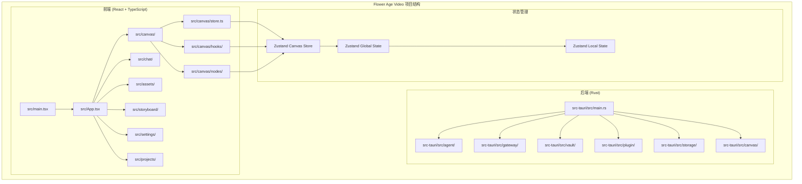

**图表来源**
- [buzhidaozenmemingmin.md:354-472](file://buzhidaozenmemingmin.md#L354-L472)

**章节来源**
- [buzhidaozenmemingmin.md:354-472](file://buzhidaozenmemingmin.md#L354-L472)

## 核心组件

### Zustand 状态管理架构

Flower Age Video 采用分层的状态管理架构，将全局状态与局部状态进行明确划分：

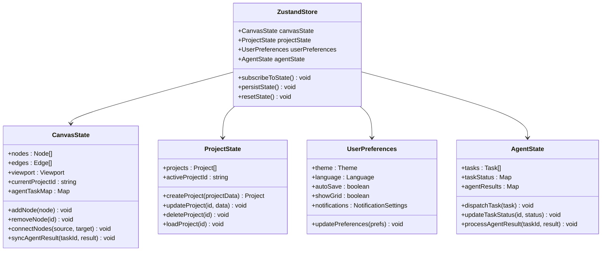

**图表来源**
- [buzhidaozenmemingmin.md:239-262](file://buzhidaozenmemingmin.md#L239-L262)

### 状态域设计原则

项目采用以下状态域划分原则：

1. **全局状态域**：跨组件共享的状态，如画布状态、项目状态
2. **局部状态域**：组件内部状态，如对话面板状态、设置面板状态
3. **用户偏好状态域**：用户个性化设置，如主题、语言、网格显示
4. **Agent 状态域**：AI Agent 执行状态和结果缓存

**章节来源**
- [buzhidaozenmemingmin.md:239-262](file://buzhidaozenmemingmin.md#L239-L262)

## 架构概览

Flower Age Video 的状态管理架构基于 Zustand 的轻量级设计，实现了高效的全局状态管理：

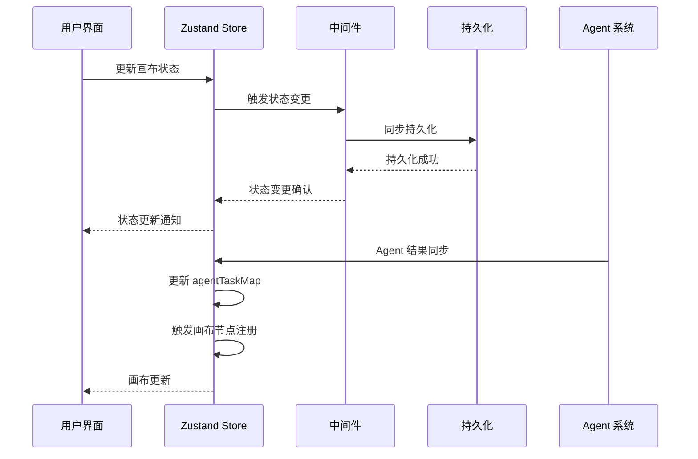

**图表来源**
- [buzhidaozenmemingmin.md:258-261](file://buzhidaozenmemingmin.md#L258-L261)

### 状态订阅机制

项目实现了多层次的状态订阅机制：

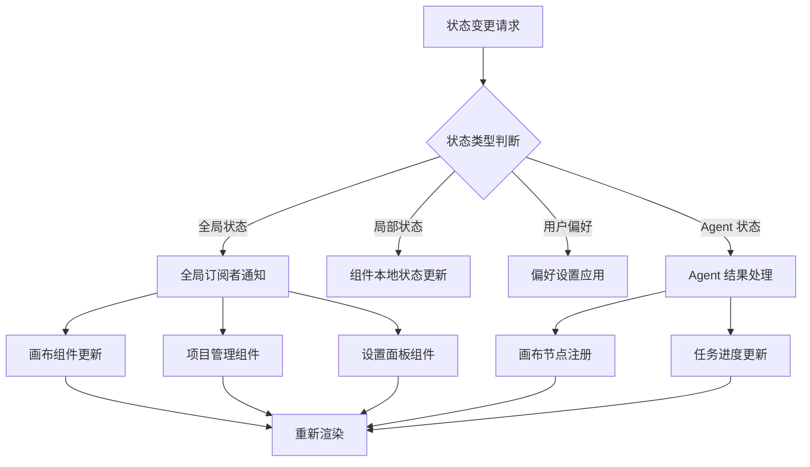

**图表来源**
- [buzhidaozenmemingmin.md:247-261](file://buzhidaozenmemingmin.md#L247-L261)

## 详细组件分析

### 画布状态管理

画布状态是项目最核心的状态域，负责管理无限画布的所有元素：

#### 画布状态接口设计

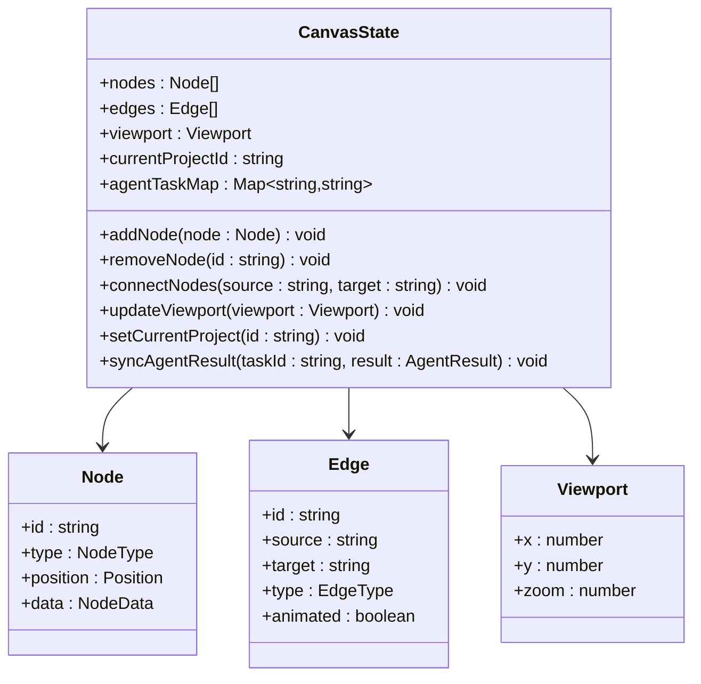

**图表来源**
- [buzhidaozenmemingmin.md:242-261](file://buzhidaozenmemingmin.md#L242-L261)

#### 画布操作流程

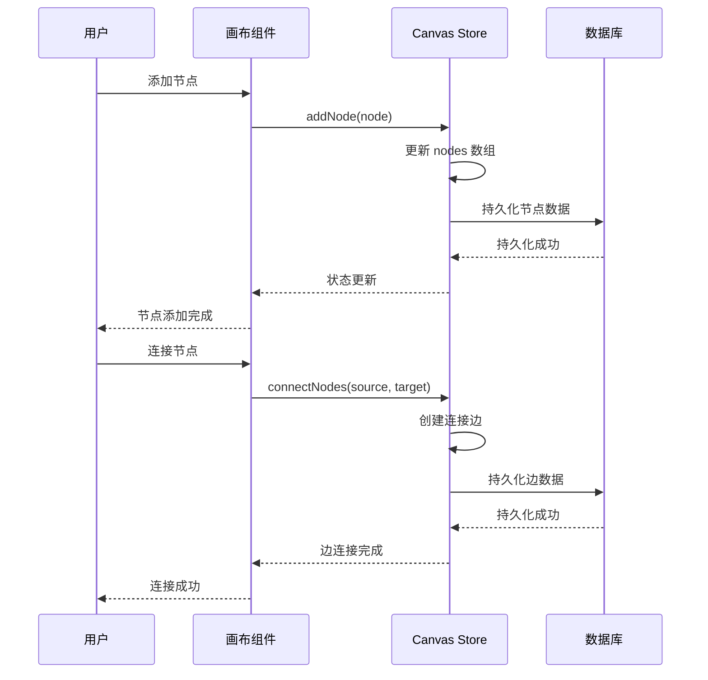

**图表来源**
- [buzhidaozenmemingmin.md:248-250](file://buzhidaozenmemingmin.md#L248-L250)

**章节来源**
- [buzhidaozenmemingmin.md:239-262](file://buzhidaozenmemingmin.md#L239-L262)

### 项目状态管理

项目状态管理负责管理用户的项目数据和上下文：

#### 项目状态结构

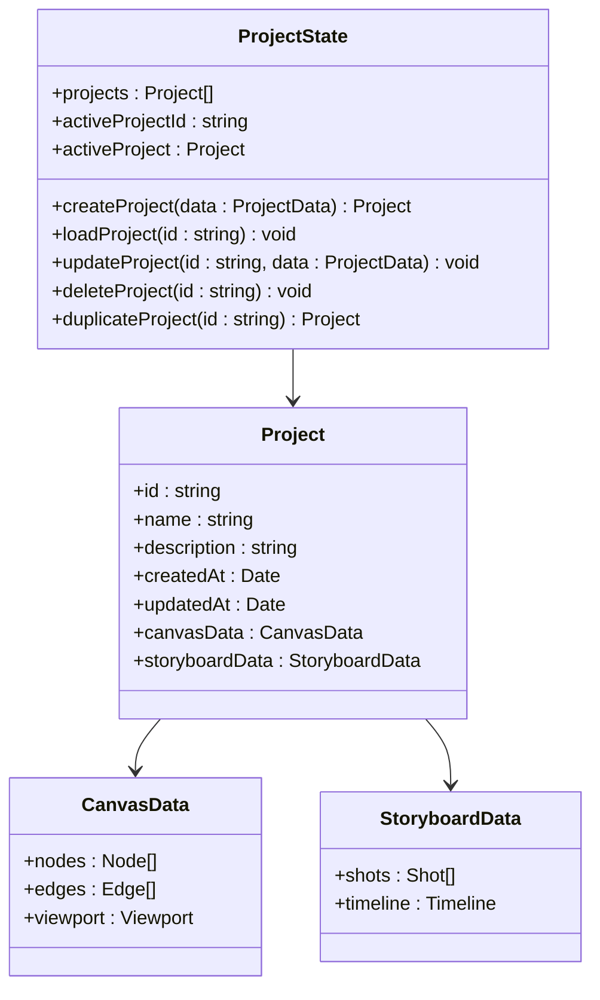

**图表来源**
- [buzhidaozenmemingmin.md:457-459](file://buzhidaozenmemingmin.md#L457-L459)

### 用户偏好状态管理

用户偏好状态管理提供了个性化的用户体验：

#### 偏好设置结构

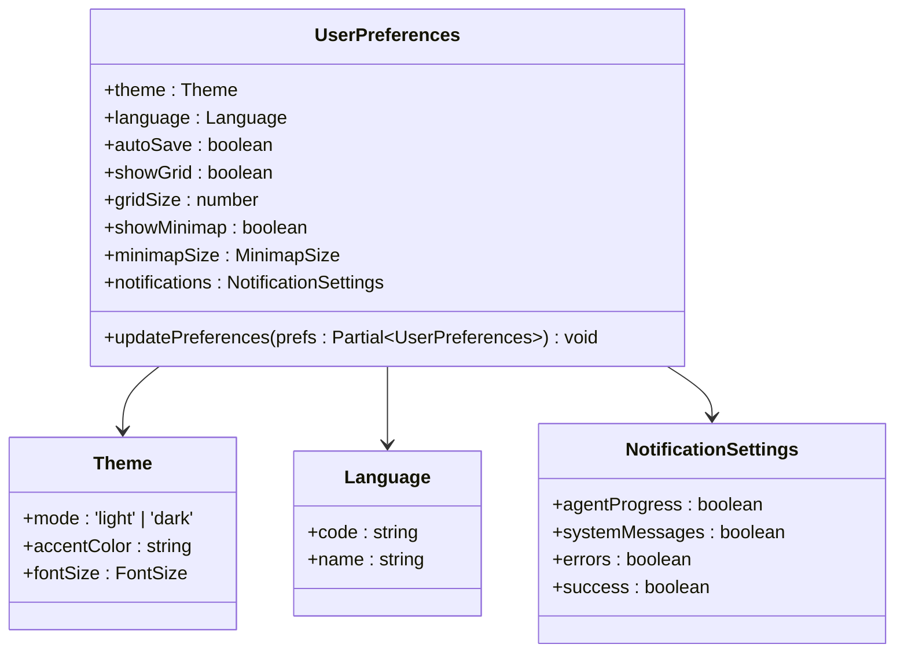

**图表来源**
- [buzhidaozenmemingmin.md:452-456](file://buzhidaozenmemingmin.md#L452-L456)

**章节来源**
- [buzhidaozenmemingmin.md:452-456](file://buzhidaozenmemingmin.md#L452-L456)

### Agent 状态管理

Agent 状态管理负责协调多个 AI Agent 的执行：

#### Agent 状态结构

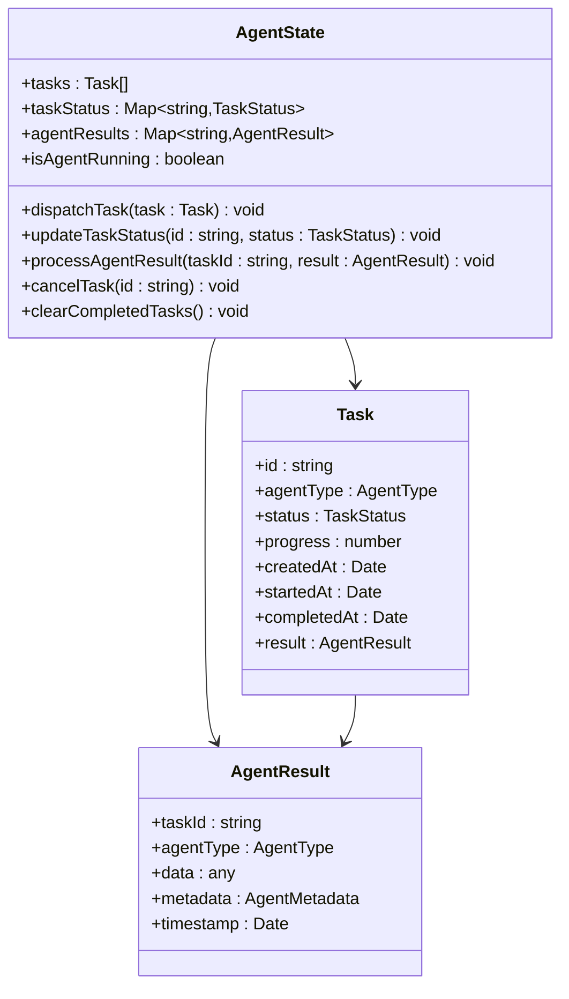

**图表来源**
- [buzhidaozenmemingmin.md:258-261](file://buzhidaozenmemingmin.md#L258-L261)

## 依赖分析

### Zustand 依赖关系

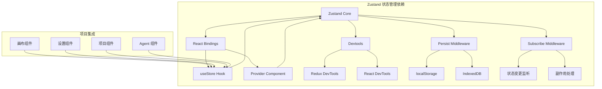

**图表来源**
- [buzhidaozenmemingmin.md:106](file://buzhidaozenmemingmin.md#L106)

### 状态持久化依赖

项目采用多层持久化策略：

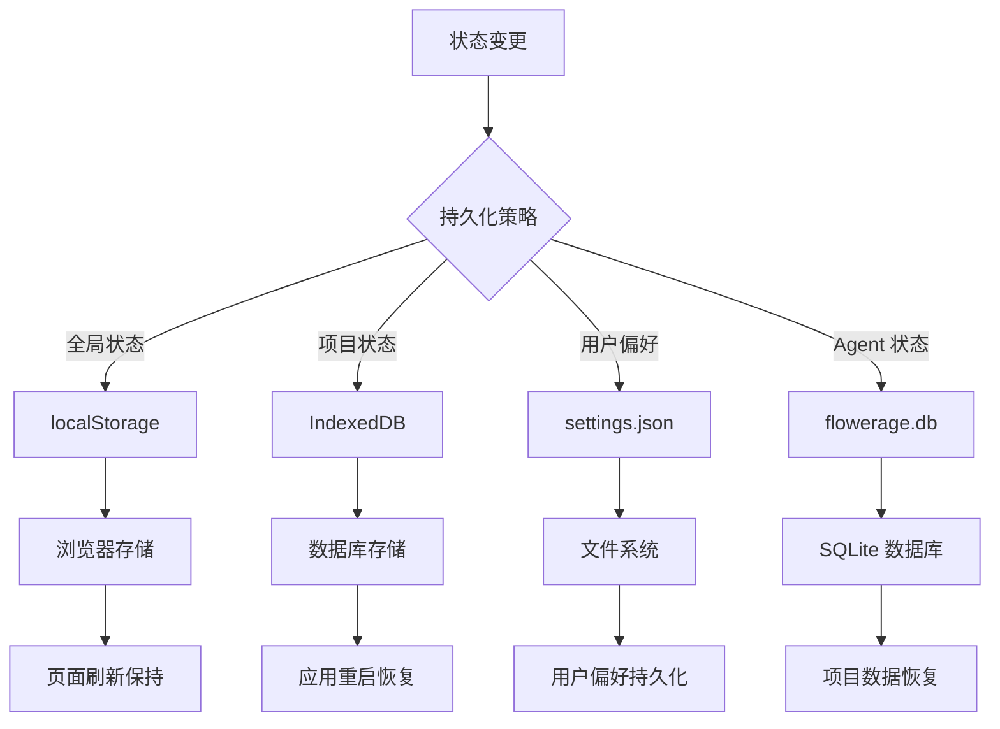

**图表来源**
- [buzhidaozenmemingmin.md:512-545](file://buzhidaozenmemingmin.md#L512-L545)

**章节来源**
- [buzhidaozenmemingmin.md:512-545](file://buzhidaozenmemingmin.md#L512-L545)

## 性能考虑

### 状态更新优化

项目采用了多种性能优化策略：

1. **状态分片**：将大型状态分解为独立的状态域，避免不必要的重渲染
2. **选择器模式**：使用选择器函数精确订阅所需状态，减少组件重渲染
3. **批量更新**：合并多个状态变更，在单个事务中应用
4. **缓存策略**：对昂贵的操作结果进行缓存，避免重复计算

### 内存管理

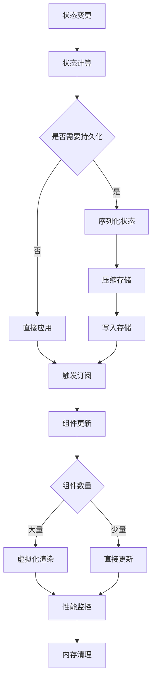

### 并发处理

项目实现了安全的并发状态管理：

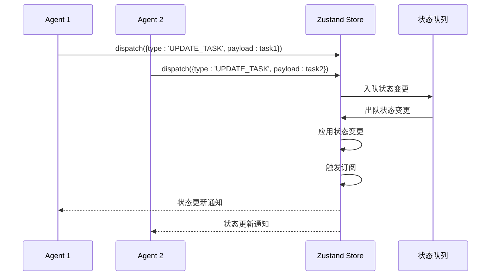

## 故障排除指南

### 常见问题诊断

#### 状态不同步问题

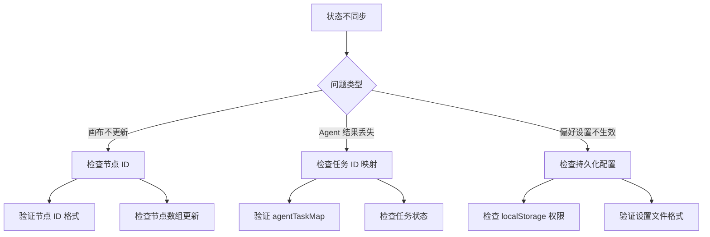

#### 性能问题排查

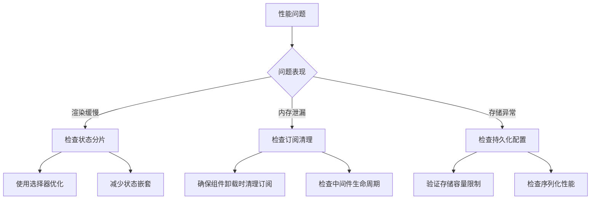

**章节来源**
- [buzhidaozenmemingmin.md:239-262](file://buzhidaozenmemingmin.md#L239-L262)

## 结论

Flower Age Video 的状态管理系统展现了现代前端应用的最佳实践。通过采用 Zustand 的轻量级设计，项目实现了：

1. **高效的状态管理**：通过分层状态架构和选择器模式，实现了最小化的重渲染
2. **灵活的状态持久化**：支持多层持久化策略，确保数据安全和性能平衡
3. **强大的中间件系统**：提供了调试、日志记录和状态重置等高级功能
4. **优秀的开发者体验**：简洁的 API 设计和完善的类型支持

该状态管理方案为视频创作工作流提供了坚实的技术基础，支持复杂的无限画布操作和多 Agent 协作场景。

## 附录

### 最佳实践清单

#### 代码组织模式
- 使用状态分片原则，将大型状态分解为独立的状态域
- 采用选择器模式，精确订阅所需状态
- 实现状态模块化，便于维护和测试

#### 团队协作规范
- 建立统一的状态命名约定
- 制定状态变更规范和文档要求
- 实施状态版本管理和回滚策略

#### 性能优化建议
- 使用 React.memo 和 shallowEqual 优化组件渲染
- 实现状态缓存和去重机制
- 定期进行性能监控和分析