# FFmpeg 集成

<cite>
**本文档引用的文件**
- [buzhidaozenmemingmin.md](file://buzhidaozenmemingmin.md)
- [ffmpeg.rs](file://src-tauri/src/media/ffmpeg.rs)
- [thumbnail.rs](file://src-tauri/src/media/thumbnail.rs)
- [Cargo.toml](file://src-tauri/Cargo.toml)
- [tauri.conf.json](file://src-tauri/tauri.conf.json)
</cite>

## 目录
1. [简介](#简介)
2. [项目结构](#项目结构)
3. [核心组件](#核心组件)
4. [架构概览](#架构概览)
5. [详细组件分析](#详细组件分析)
6. [依赖分析](#依赖分析)
7. [性能考虑](#性能考虑)
8. [故障排除指南](#故障排除指南)
9. [结论](#结论)

## 简介

Flower Age Video 是一款基于 AI 驱动的无限画布创意工作站，专注于为视频创作者、内容生产者和 AI 艺术家提供强大的本地化媒体处理能力。本项目的核心价值在于通过 ffmpeg-sidecar 实现 FFmpeg 二进制的自动下载和管理，为视频合并、转场效果、音频混音、格式转换等核心功能提供可靠的底层支持。

该项目采用主 Agent 编排 + 子 Agent 执行的架构模式，其中 editing-agent 专门负责后期制作流水线，包括视频片段合并、转场效果应用、音频混音以及最终格式转换等复杂媒体处理任务。

## 项目结构

Flower Age Video 项目采用清晰的分层架构设计，FFmpeg 集成模块位于媒体处理层的核心位置：

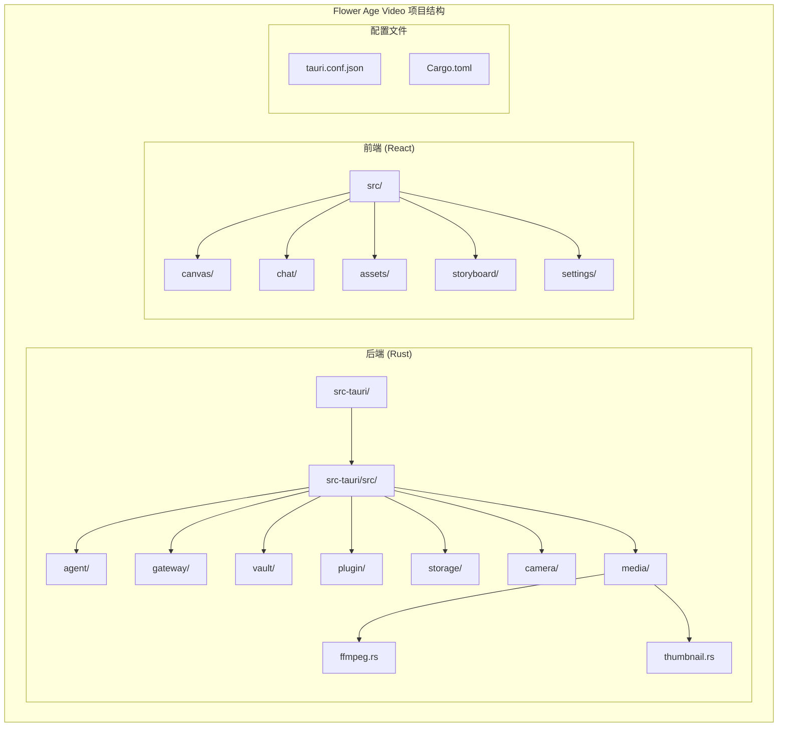

**图表来源**
- [buzhidaozenmemingmin.md:354-472](file://buzhidaozenmemingmin.md#L354-L472)

**章节来源**
- [buzhidaozenmemingmin.md:354-472](file://buzhidaozenmemingmin.md#L354-L472)

## 核心组件

### FFmpeg Sidecar 集成

项目采用 ffmpeg-sidecar 库实现 FFmpeg 二进制的自动化管理，该库提供了以下关键特性：

- **自动下载机制**：首次启动时从 GitHub Releases 自动下载合适的 FFmpeg 二进制
- **版本管理**：维护本地缓存的 FFmpeg 版本，避免重复下载
- **跨平台支持**：支持 Windows 平台的 FFmpeg 二进制部署
- **零配置**：无需用户手动安装或配置 FFmpeg 环境

### 媒体处理架构

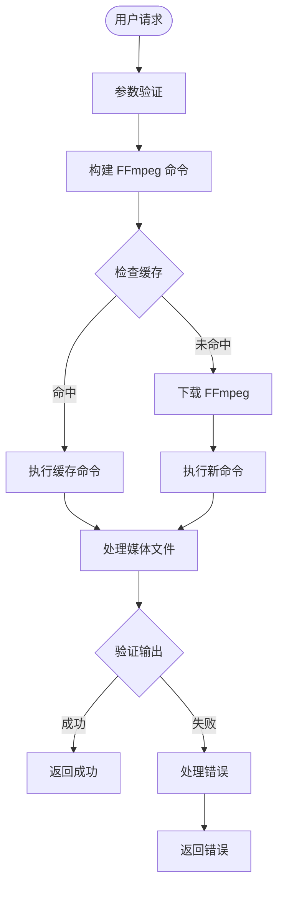

**章节来源**
- [buzhidaozenmemingmin.md:46-64](file://buzhidaozenmemingmin.md#L46-L64)
- [buzhidaozenmemingmin.md:676-680](file://buzhidaozenmemingmin.md#L676-L680)

## 架构概览

### 整体架构设计

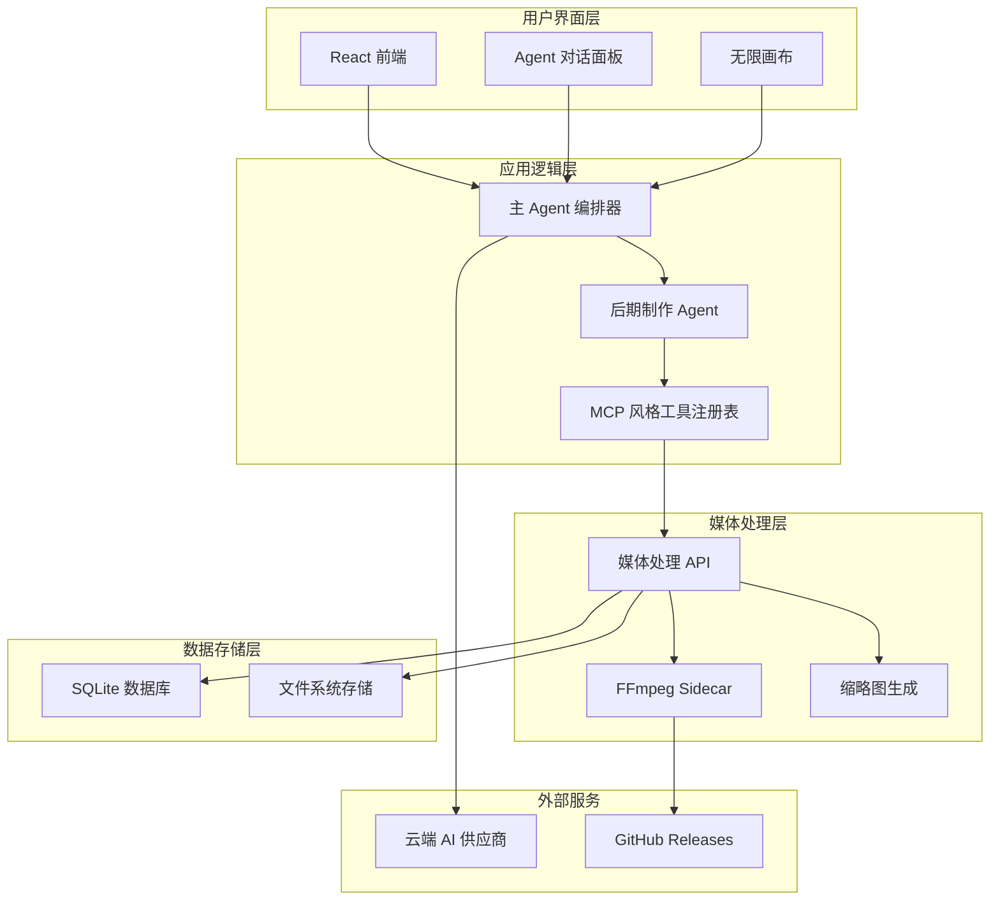

**图表来源**
- [buzhidaozenmemingmin.md:27-83](file://buzhidaozenmemingmin.md#L27-L83)
- [buzhidaozenmemingmin.md:392-394](file://buzhidaozenmemingmin.md#L392-L394)

### FFmpeg 集成架构

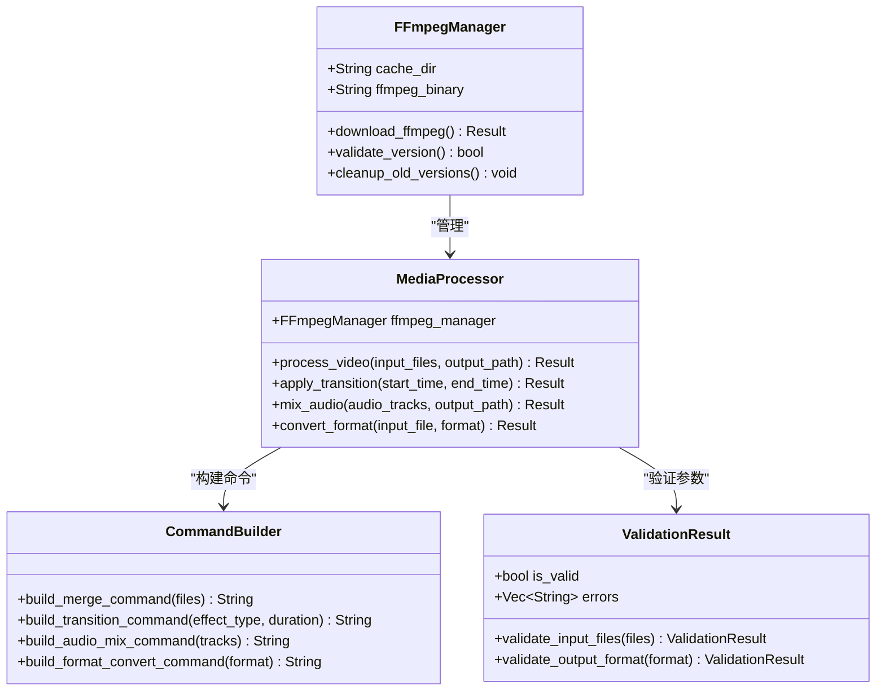

**图表来源**
- [buzhidaozenmemingmin.md:392-394](file://buzhidaozenmemingmin.md#L392-L394)

**章节来源**
- [buzhidaozenmemingmin.md:27-83](file://buzhidaozenmemingmin.md#L27-L83)

## 详细组件分析

### FFmpeg 命令封装实现

#### 命令构建策略

FFmpeg 命令的构建遵循以下设计原则：

1. **参数验证**：在执行任何 FFmpeg 命令之前，系统会验证所有输入参数的有效性
2. **命令组合**：将多个 FFmpeg 操作组合为单一命令序列，减少进程开销
3. **错误处理**：为每个命令操作提供详细的错误信息和回退策略
4. **进度监控**：通过 FFmpeg 的进度输出实时反馈处理状态

#### 参数验证机制

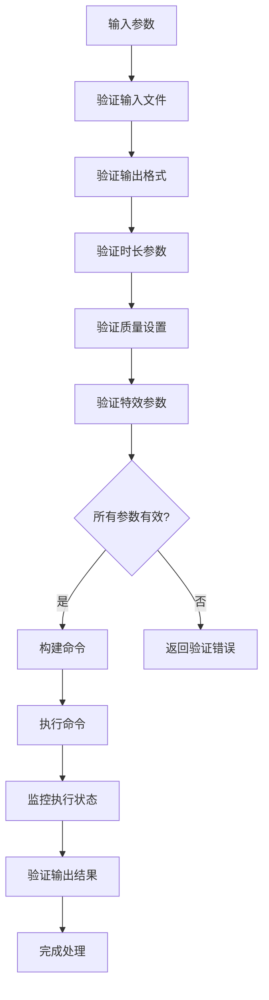

**图表来源**
- [buzhidaozenmemingmin.md:392-394](file://buzhidaozenmemingmin.md#L392-L394)

#### 进程管理策略

系统采用以下进程管理策略确保 FFmpeg 命令的可靠执行：

- **超时控制**：为每个 FFmpeg 操作设置合理的超时时间
- **内存监控**：监控 FFmpeg 进程的内存使用情况，防止内存泄漏
- **异常处理**：捕获 FFmpeg 进程的异常退出并提供诊断信息
- **资源清理**：确保临时文件和中间产物的正确清理

**章节来源**
- [buzhidaozenmemingmin.md:392-394](file://buzhidaozenmemingmin.md#L392-L394)

### 视频处理流程

#### 视频合并流程

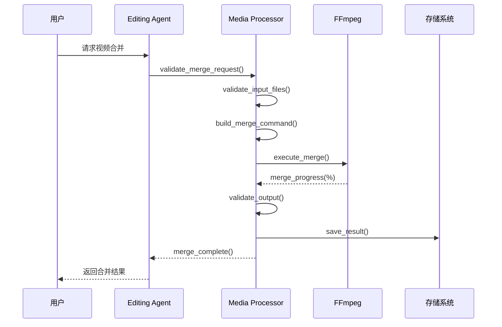

**图表来源**
- [buzhidaozenmemingmin.md:676-680](file://buzhidaozenmemingmin.md#L676-L680)

#### 转场效果处理

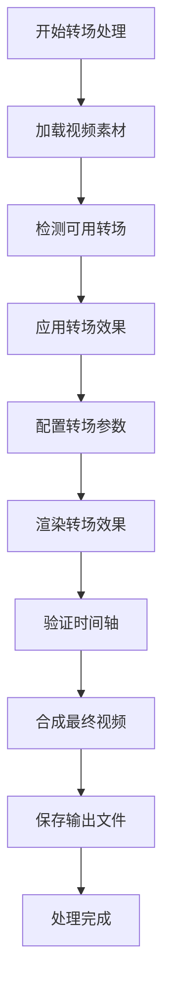

**图表来源**
- [buzhidaozenmemingmin.md:676-680](file://buzhidaozenmemingmin.md#L676-L680)

#### 音频混音流程

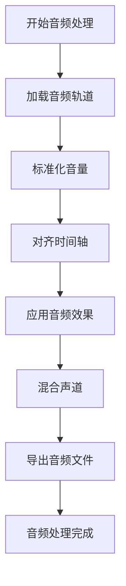

**图表来源**
- [buzhidaozenmemingmin.md:676-680](file://buzhidaozenmemingmin.md#L676-L680)

### 缓存和版本管理

#### 本地缓存策略

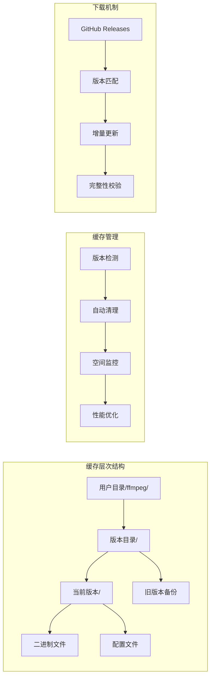

**图表来源**
- [buzhidaozenmemingmin.md:544](file://buzhidaozenmemingmin.md#L544)

**章节来源**
- [buzhidaozenmemingmin.md:544](file://buzhidaozenmemingmin.md#L544)

## 依赖分析

### 外部依赖关系

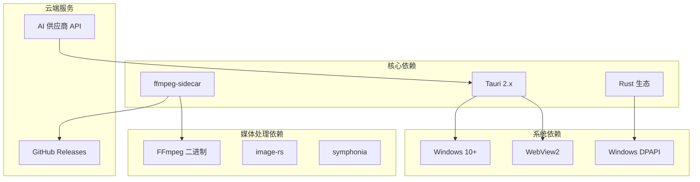

**图表来源**
- [buzhidaozenmemingmin.md:126-134](file://buzhidaozenmemingmin.md#L126-L134)
- [buzhidaozenmemingmin.md:502-507](file://buzhidaozenmemingmin.md#L502-L507)

### 内部模块依赖

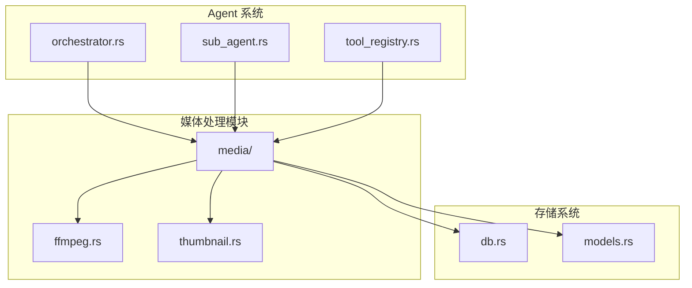

**图表来源**
- [buzhidaozenmemingmin.md:392-394](file://buzhidaozenmemingmin.md#L392-L394)

**章节来源**
- [buzhidaozenmemingmin.md:126-134](file://buzhidaozenmemingmin.md#L126-L134)

## 性能考虑

### 内存管理策略

1. **流式处理**：优先使用 FFmpeg 的流式处理模式，避免大文件完全加载到内存
2. **分块处理**：对于大型视频文件，采用分块处理策略减少内存峰值
3. **及时释放**：确保临时文件和中间产物在使用后及时释放
4. **垃圾回收**：合理设置 Rust 的内存回收策略，避免内存泄漏

### 并发处理策略

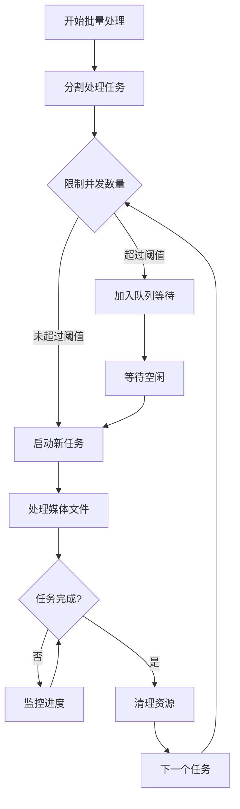

**图表来源**
- [buzhidaozenmemingmin.md:676-680](file://buzhidaozenmemingmin.md#L676-L680)

### 性能优化建议

1. **硬件加速**：利用 GPU 加速进行视频编码和解码
2. **多核并行**：充分利用多核 CPU 进行并行处理
3. **缓存策略**：合理利用本地缓存减少重复计算
4. **预处理优化**：对输入文件进行必要的预处理以提高处理效率

## 故障排除指南

### 常见问题及解决方案

#### FFmpeg 下载失败

**症状**：首次启动时 FFmpeg 下载失败
**原因**：
- 网络连接不稳定
- GitHub Releases 服务不可用
- 磁盘空间不足

**解决方案**：
1. 检查网络连接状态
2. 手动下载 FFmpeg 二进制到指定目录
3. 清理磁盘空间
4. 重试下载过程

#### 命令执行错误

**症状**：FFmpeg 命令执行失败但没有明确错误信息
**原因**：
- 参数格式不正确
- 输入文件损坏
- 编码器不支持

**解决方案**：
1. 检查 FFmpeg 命令的语法
2. 验证输入文件的完整性
3. 查看 FFmpeg 的详细错误输出
4. 调整编码参数

#### 内存溢出问题

**症状**：处理大型视频文件时出现内存不足
**原因**：
- 视频文件过大
- 内存管理不当
- 缺少流式处理

**解决方案**：
1. 使用流式处理模式
2. 分割大型文件进行处理
3. 增加系统内存
4. 优化内存使用策略

### 调试和监控

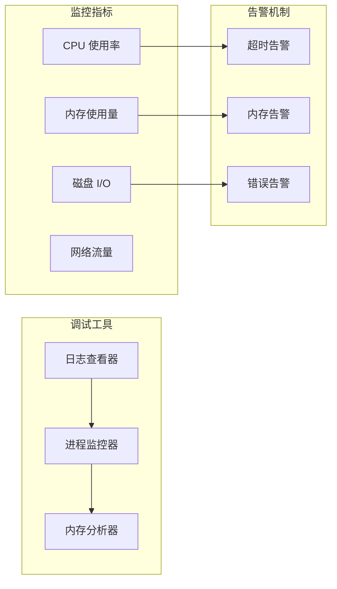

**章节来源**
- [buzhidaozenmemingmin.md:676-680](file://buzhidaozenmemingmin.md#L676-L680)

## 结论

Flower Age Video 项目中的 FFmpeg 集成模块展现了现代媒体处理应用的最佳实践。通过 ffmpeg-sidecar 的自动化管理机制，项目实现了零配置的 FFmpeg 部署，为视频合并、转场效果、音频混音、格式转换等核心功能提供了稳定可靠的底层支持。

该集成模块的关键优势包括：

1. **自动化部署**：通过 ffmpeg-sidecar 实现 FFmpeg 二进制的自动下载和管理
2. **健壮的错误处理**：完善的参数验证和错误恢复机制
3. **高效的性能**：合理的内存管理和并发处理策略
4. **灵活的扩展性**：模块化的架构设计便于功能扩展

未来的发展方向包括进一步优化性能、增加更多媒体格式支持、改进用户界面体验，以及探索更多 AI 驱动的创意功能。