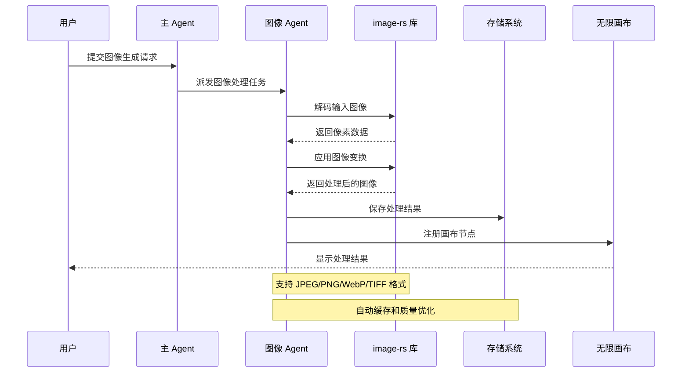
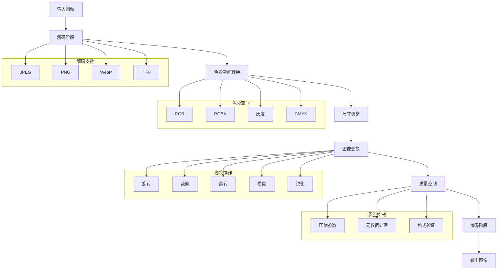
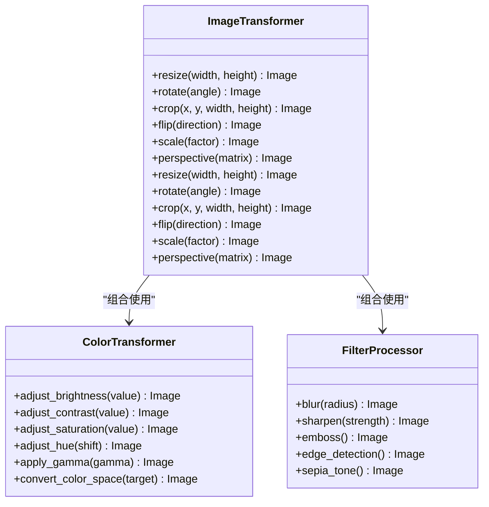
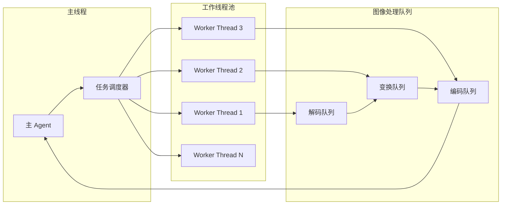
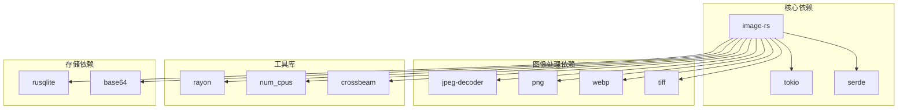
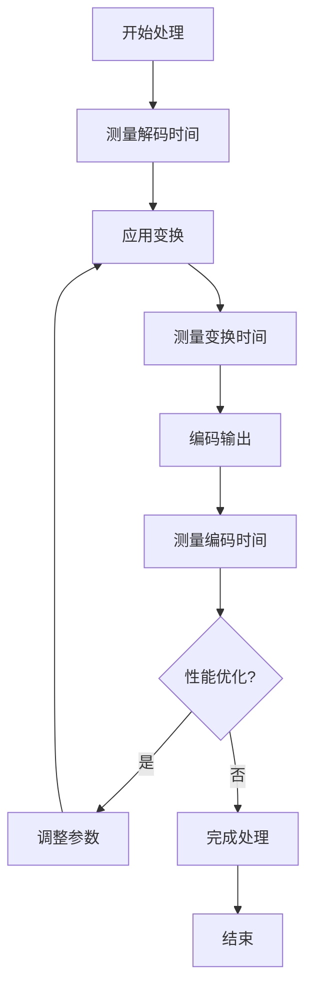

# 图像处理

<cite>
**本文引用的文件**
- [buzhidaozenmemingmin.md](file://buzhidaozenmemingmin.md)
</cite>

## 目录
1. [简介](#简介)
2. [项目结构](#项目结构)
3. [核心组件](#核心组件)
4. [架构概览](#架构概览)
5. [详细组件分析](#详细组件分析)
6. [依赖分析](#依赖分析)
7. [性能考虑](#性能考虑)
8. [故障排除指南](#故障排除指南)
9. [结论](#结论)

## 简介

Flower Age Video 是一款基于 AI 驱动的无限画布创意工作站，专注于为视频创作者、内容生产者和 AI 艺术家提供强大的图像处理能力。该项目采用主 Agent 编排 + 子 Agent 执行的架构模式，其中图像处理功能通过高性能的 image-rs 库实现。

image-rs 是一个用 Rust 编写的高性能图像编解码库，提供了对多种图像格式的原生支持，包括 JPEG、PNG、WebP、TIFF 等格式。该库以其零拷贝设计、内存安全性和卓越的性能表现而闻名，在 Flower Age Video 中被用于处理各种图像生成和编辑任务。

## 项目结构

根据项目文档，Flower Age Video 的后端架构采用 Rust 实现，主要分为以下几个层次：

```mermaid
graph TB
subgraph "桌面壳层"
Tauri[Tauri Desktop Shell<br/>FlowerAgeVideo.exe]
end
subgraph "Rust 后端"
subgraph "核心引擎"
AgentRuntime[Agent Runtime<br/>主/子 Agent 生命周期管理]
ToolRegistry[Tool Registry<br/>MCP 风格工具注册表]
APIGateway[API Gateway<br/>统一 API 代理]
PluginEngine[Plugin Engine<br/>热加载插件系统]
KeyVault[Key Vault<br/>API Key 加密存储]
SQLiteStore[SQLite Store<br/>项目/资产/Memory 持久化]
end
subgraph "媒体处理"
FFmpeg[ffmpeg (内置)<br/>媒体编解码/合并/转场]
ImageRS[image-rs (Rust)<br/>高性能图像处理]
Symphonia[Symphonia<br/>音频解码]
Whisper[Whisper (可选)<br/>本地语音转文字]
end
end
subgraph "前端"
React[React WebView]
Canvas[Infinite Canvas<br/>@xyflow/react 无限画布]
Chat[Agent Chat<br/>主 Agent 对话面板]
Browser[Asset Browser<br/>资产管理浏览器]
Editor[Storyboard Editor<br/>分镜编辑器]
Settings[Settings<br/>模型/API/偏好设置]
end
Tauri --> AgentRuntime
AgentRuntime --> ToolRegistry
AgentRuntime --> APIGateway
AgentRuntime --> PluginEngine
AgentRuntime --> KeyVault
AgentRuntime --> SQLiteStore
AgentRuntime --> ImageRS
AgentRuntime --> FFmpeg
React --> Canvas
React --> Chat
React --> Browser
React --> Editor
React --> Settings
```

**图表来源**
- [buzhidaozenmemingmin.md: 27-50:27-50](file://buzhidaozenmemingmin.md#L27-L50)
- [buzhidaozenmemingmin.md: 126-134:126-134](file://buzhidaozenmemingmin.md#L126-L134)

**章节来源**
- [buzhidaozenmemingmin.md: 27-50:27-50](file://buzhidaozenmemingmin.md#L27-L50)
- [buzhidaozenmemingmin.md: 126-134:126-134](file://buzhidaozenmemingmin.md#L126-L134)

## 核心组件

### 图像处理架构

Flower Age Video 的图像处理系统基于以下核心组件构建：

#### image-rs 集成
- **高性能编解码**：利用 image-rs 的零拷贝设计和内存安全性
- **多格式支持**：原生支持 JPEG、PNG、WebP、TIFF 等主流图像格式
- **并发处理**：支持多线程并行处理，充分利用现代 CPU 资源
- **内存优化**：最小化内存分配，降低垃圾回收压力

#### Agent 系统集成
- **image-agent**：专门负责图像生成、编辑和处理任务
- **editing-agent**：负责图像后期处理和质量控制
- **并行执行**：多个图像处理任务可以并行执行，提高整体效率

#### 媒体处理管道
- **输入处理**：接收来自云端 AI 服务的图像数据
- **格式转换**：将不同格式的图像统一转换为内部格式
- **质量优化**：应用图像增强和优化算法
- **输出管理**：生成最终图像文件并进行缓存

**章节来源**
- [buzhidaozenmemingmin.md: 166](file://buzhidaozenmemingmin.md#L166)
- [buzhidaozenmemingmin.md: 170](file://buzhidaozenmemingmin.md#L170)
- [buzhidaozenmemingmin.md: 131](file://buzhidaozenmemingmin.md#L131)

## 架构概览

### 图像处理工作流



**图表来源**
- [buzhidaozenmemingmin.md: 172-190:172-190](file://buzhidaozenmemingmin.md#L172-L190)
- [buzhidaozenmemingmin.md: 166](file://buzhidaozenmemingmin.md#L166)

### 图像处理管道



**图表来源**
- [buzhidaozenmemingmin.md: 131](file://buzhidaozenmemingmin.md#L131)

## 详细组件分析

### 图像编解码器实现

#### 格式支持矩阵

| 图像格式 | 编码支持 | 解码支持 | 压缩选项 | 关键特性 |
|---------|---------|---------|---------|---------|
| JPEG | ✅ | ✅ | 质量级别(1-100) | 有损压缩，适合照片 |
| PNG | ✅ | ✅ | 压缩级别(0-9) | 无损压缩，支持透明度 |
| WebP | ✅ | ✅ | 质量级别(0-100) | 有损/无损，高压缩比 |
| TIFF | ✅ | ✅ | 压缩算法 | 支持多页，专业格式 |

#### 压缩参数配置

**JPEG 参数**
- 质量级别：1-100（数值越高质量越好）
- 颜色采样：4:4:4/4:2:2/4:2:0
- 基线/渐进式：基线更快，渐进式体验更好

**PNG 参数**
- 压缩级别：0-9（0最快，9最省空间）
- 过滤算法：None/Sub/Avg/Paeth
- 颜色深度：1/2/4/8/16位

**WebP 参数**
- 质量：0-100（质量优先）
- 压缩比：0-100（大小优先）
- 动画支持：可选
- 透明度：支持 Alpha 通道

**章节来源**
- [buzhidaozenmemingmin.md: 131](file://buzhidaozenmemingmin.md#L131)

### 图像变换系统

#### 几何变换



**图表来源**
- [buzhidaozenmemingmin.md: 166](file://buzhidaozenmemingmin.md#L166)

#### 色彩空间转换

支持的色彩空间包括：
- **RGB/RGBA**：标准显示色彩空间
- **灰度**：单通道灰度图像
- **CMYK**：印刷色彩空间
- **LAB**：感知均匀色彩空间

转换过程确保：
- 色彩保真度最大化
- 白点标准化
- 色域映射优化

### 并发处理架构

#### 多线程图像处理



**图表来源**
- [buzhidaozenmemingmin.md: 166](file://buzhidaozenmemingmin.md#L166)

**章节来源**
- [buzhidaozenmemingmin.md: 166](file://buzhidaozenmemingmin.md#L166)

## 依赖分析

### 技术栈依赖



**图表来源**
- [buzhidaozenmemingmin.md: 112-134:112-134](file://buzhidaozenmemingmin.md#L112-L134)

### 许可证兼容性

项目采用完全兼容的许可证组合：
- **MIT + Apache-2.0**：主要框架和核心组件
- **ISC (BSD-like)**：加密库 ring
- **MPL-2.0**：音频处理 symphonia（非传染性）

这种许可证组合确保了项目的商业可用性和安全性。

**章节来源**
- [buzhidaozenmemingmin.md: 112-134:112-134](file://buzhidaozenmemingmin.md#L112-L134)
- [buzhidaozenmemingmin.md: 596-621:596-621](file://buzhidaozenmemingmin.md#L596-L621)

## 性能考虑

### 内存管理策略

#### 零拷贝设计
- 利用 image-rs 的零拷贝特性减少内存分配
- 使用内存池管理重复使用的缓冲区
- 避免不必要的数据复制操作

#### 内存优化技术
- **分块处理**：大图像按块处理，避免一次性加载
- **延迟解码**：仅在需要时解码特定区域
- **缓存策略**：智能缓存常用图像和变换结果

### 并发优化

#### 线程池配置
- **CPU 密集型任务**：使用与逻辑核心数相等的线程
- **I/O 密集型任务**：使用更大的线程池
- **自适应调度**：根据系统负载动态调整线程数量

#### 任务并行化
- **图像批处理**：支持多张图像同时处理
- **变换流水线**：解码-变换-编码的流水线作业
- **结果聚合**：并行结果的高效合并

### 性能监控



## 故障排除指南

### 常见问题及解决方案

#### 图像格式错误
**症状**：解码失败或格式不支持
**解决方案**：
- 验证输入文件的完整性
- 检查文件头部标识符
- 转换到受支持的格式

#### 内存不足错误
**症状**：处理大图像时内存溢出
**解决方案**：
- 启用分块处理模式
- 调整图像分辨率
- 增加系统内存或虚拟内存

#### 性能问题
**症状**：处理速度慢于预期
**解决方案**：
- 检查 CPU 使用率
- 调整线程池大小
- 优化图像预处理步骤

#### 质量损失
**症状**：输出图像质量下降
**解决方案**：
- 调整压缩参数
- 使用更高质量的编码器
- 避免多次重新编码

### 调试工具

#### 性能分析
- **内存使用跟踪**：监控内存分配和释放
- **CPU 使用率分析**：识别性能瓶颈
- **I/O 操作监控**：优化文件读写

#### 错误日志
- **详细错误信息**：记录具体的错误原因
- **堆栈跟踪**：帮助定位问题根源
- **性能指标**：记录处理时间和资源使用

**章节来源**
- [buzhidaozenmemingmin.md: 166](file://buzhidaozenmemingmin.md#L166)

## 结论

Flower Age Video 的图像处理模块基于 image-rs 库构建，提供了高性能、内存安全的图像编解码能力。通过合理的架构设计和优化策略，该模块能够满足视频创作和内容生产的各种需求。

### 主要优势

1. **高性能**：利用 Rust 的零拷贝设计和并行处理能力
2. **内存安全**：完全避免内存泄漏和缓冲区溢出
3. **格式丰富**：支持主流图像格式的完整编解码
4. **可扩展性**：模块化设计便于功能扩展和维护

### 发展方向

- **AI 集成**：与图像生成和编辑 AI 模型的深度集成
- **硬件加速**：利用 GPU 和专用硬件进行加速
- **实时处理**：支持实时视频流的图像处理
- **云原生**：支持分布式和云环境下的图像处理

通过持续的优化和改进，Flower Age Video 的图像处理模块将成为一个强大而可靠的创意工具，为用户提供卓越的图像处理体验。