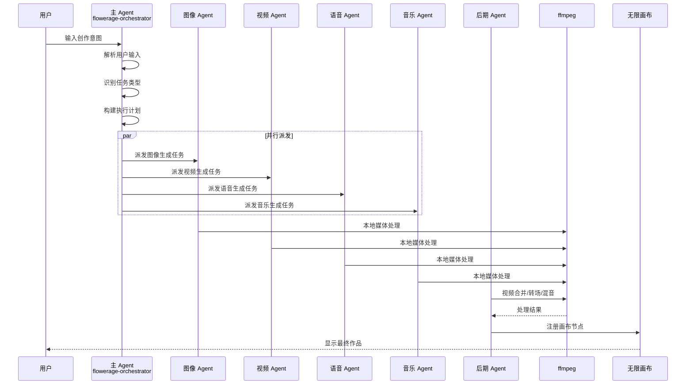
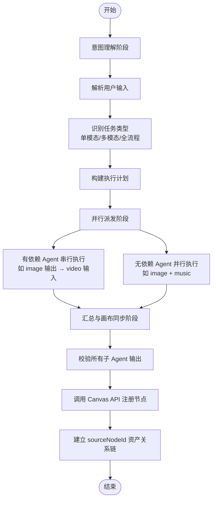
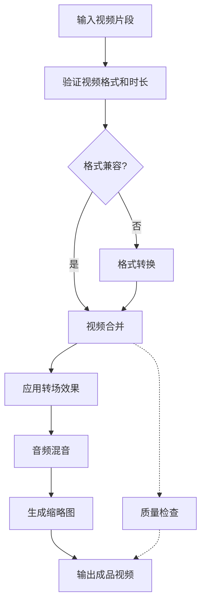
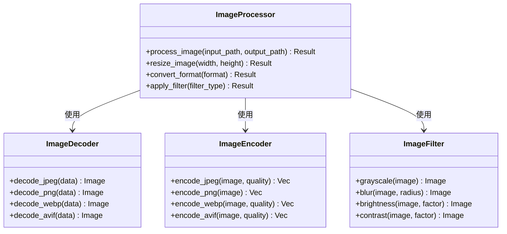
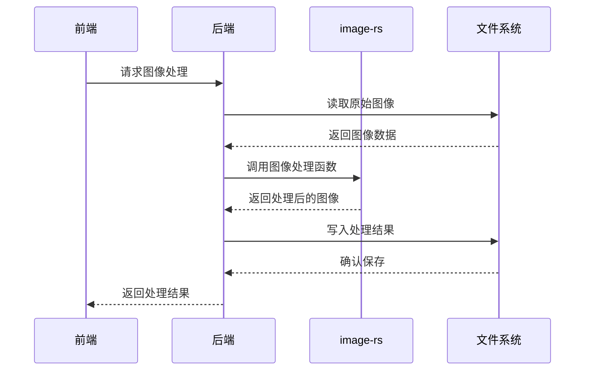
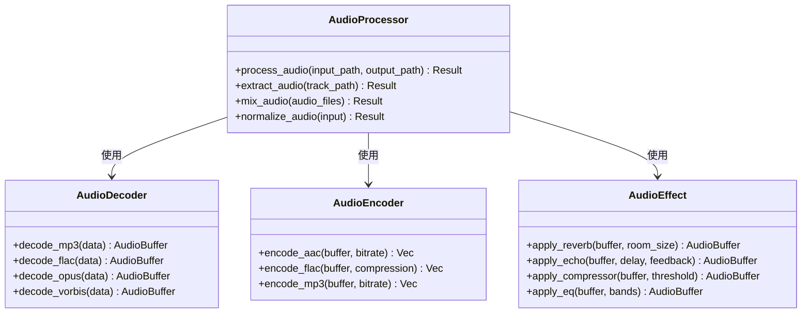
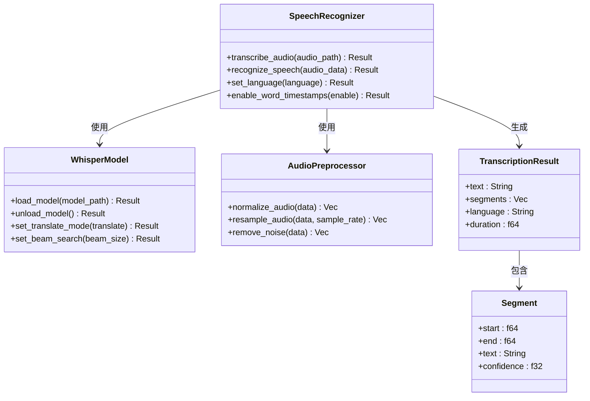
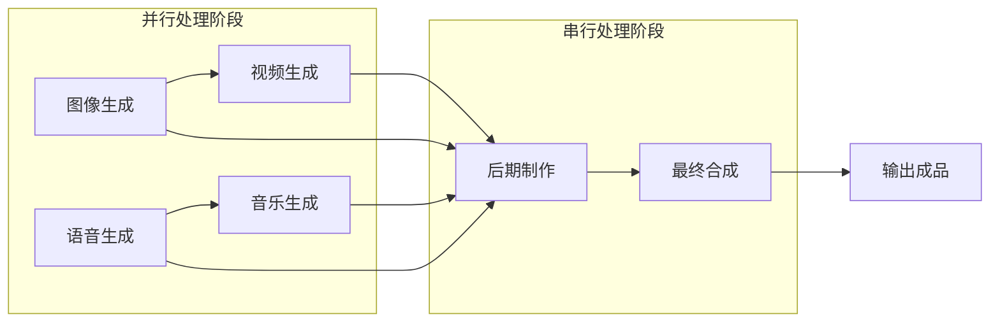
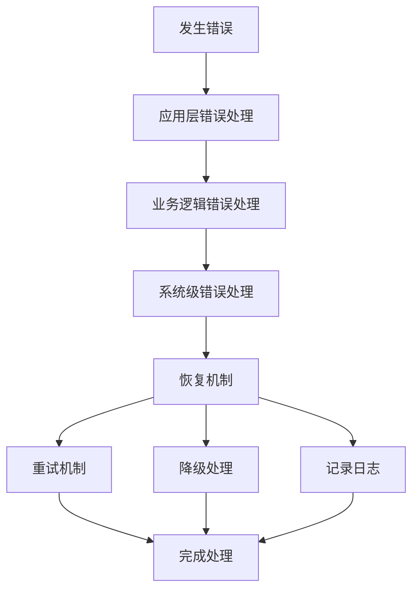

# 媒体处理系统

<cite>
**本文档引用的文件**
- [buzhidaozenmemingmin.md](file://buzhidaozenmemingmin.md)
</cite>

## 目录
1. [简介](#简介)
2. [项目结构](#项目结构)
3. [核心组件](#核心组件)
4. [架构概览](#架构概览)
5. [详细组件分析](#详细组件分析)
6. [依赖关系分析](#依赖关系分析)
7. [性能考虑](#性能考虑)
8. [故障排除指南](#故障排除指南)
9. [结论](#结论)
10. [附录](#附录)

## 简介

Flower Age Video 是一款基于 Tauri 桌面框架的 AI 驱动无限画布创意工作站，专注于本地 Windows 桌面环境下的媒体处理。该系统通过主 Agent 编排 + 子 Agent 执行的架构模式，实现了从图像生成、视频生成、语音合成到音乐生成的全流程自动化，并通过专门的 editing-agent 实现本地媒体处理能力。

系统的核心价值在于提供零商业侵权、本地部署、云端 AI 配置和无限画布等特性，所有依赖均采用 MIT / Apache-2.0 / BSD 许可证，确保 100% 无 GPL 传染风险。

## 项目结构

Flower Age Video 采用分层架构设计，主要分为桌面壳层、后端引擎、前端界面和原生模块四个层次：

```mermaid
graph TB
subgraph "桌面壳层"
Tauri[Tauri Desktop Shell<br/>FlowerAgeVideo.exe]
WebView[React WebView<br/>前端界面]
end
subgraph "后端引擎"
AgentRuntime[Agent Runtime<br/>主/子 Agent 生命周期管理]
APIGateway[API Gateway<br/>统一 API 代理 localhost:7942]
PluginEngine[Plugin Engine<br/>热加载插件系统]
KeyVault[Key Vault<br/>API Key 加密存储 AES-256-GCM]
SQLiteStore[SQLite Store<br/>项目/资产/Memory 持久化]
end
subgraph "原生模块"
FFmpeg[ffmpeg (内置)<br/>媒体编解码/合并/转场]
ImageRS[image-rs (Rust)<br/>高性能图像处理]
Whisper[Whisper (可选)<br/>本地语音转文字]
end
subgraph "前端功能"
InfiniteCanvas[Infinite Canvas<br/>@xyflow/react 无限画布]
AgentChat[Agent Chat<br/>主 Agent 对话面板]
AssetBrowser[Asset Browser<br/>资产管理浏览器]
StoryboardEditor[Storyboard Editor<br/>分镜编辑器]
Settings[Settings<br/>模型/API/偏好设置]
end
Tauri --> AgentRuntime
Tauri --> APIGateway
Tauri --> PluginEngine
Tauri --> KeyVault
Tauri --> SQLiteStore
Tauri --> InfiniteCanvas
Tauri --> AgentChat
Tauri --> AssetBrowser
Tauri --> StoryboardEditor
Tauri --> Settings
AgentRuntime --> FFmpeg
AgentRuntime --> ImageRS
AgentRuntime --> Whisper
APIGateway --> AgentRuntime
PluginEngine --> AgentRuntime
KeyVault --> AgentRuntime
SQLiteStore --> AgentRuntime
```

**图表来源**
- [buzhidaozenmemingmin.md:27-50](file://buzhidaozenmemingmin.md#L27-L50)

**章节来源**
- [buzhidaozenmemingmin.md:27-50](file://buzhidaozenmemingmin.md#L27-L50)
- [buzhidaozenmemingmin.md:354-472](file://buzhidaozenmemingmin.md#L354-L472)

## 核心组件

### Agent 运行时系统

Agent 运行时是整个系统的核心协调器，采用主 Agent + 子 Agent 的分层架构：

| Agent ID | 角色 | 核心能力 | 步数预算 | MCP 工具数 |
|---|---|---|---|---|
| `flowerage-orchestrator` | 总编排器 | 意图识别 → 任务拆解 → 派发 → 汇总 → 画布同步 | 400 | 8 |
| `image-agent` | 图像专家 | T2I / I2I / 角色一致性 / 多模型路由 / 批量生成 | 200 | 6 |
| `video-agent` | 视频专家 | T2V / I2V / 多模态视频 / 运动控制 / 数字人 | 200 | 6 |
| `speech-agent` | 语音专家 | TTS / 声音克隆 / 多角色对话 / 情绪控制 | 200 | 5 |
| `music-agent` | 音乐专家 | BGM / 人声歌曲 / 翻唱 / 歌词创作 | 200 | 5 |
| `editing-agent` | 后期专家 | 片段合并 / 转场 / 唇形同步 / BGM 混音 / MV 流水线 | 200 | 8 |

### 媒体处理原生模块

系统集成了三个关键的原生处理模块：

1. **ffmpeg-sidecar (MIT)**: 自动下载管理 ffmpeg 二进制，支持视频合并、转场、音频混音、格式转换
2. **image-rs (MIT)**: Rust 原生图像编解码，提供高性能图像处理能力
3. **symphonia (MPL-2.0)**: Rust 原生音频解码，支持多种音频格式
4. **whisper-rs (MIT)**: 本地语音转文字，可选的语音识别功能

**章节来源**
- [buzhidaozenmemingmin.md:130-133](file://buzhidaozenmemingmin.md#L130-L133)
- [buzhidaozenmemingmin.md:161-171](file://buzhidaozenmemingmin.md#L161-L171)

## 架构概览

### 整体请求链路



**图表来源**
- [buzhidaozenmemingmin.md:66-83](file://buzhidaozenmemingmin.md#L66-L83)

### 编排流程阶段

系统采用三阶段确定性派发流程：



**图表来源**
- [buzhidaozenmemingmin.md:172-190](file://buzhidaozenmemingmin.md#L172-L190)

**章节来源**
- [buzhidaozenmemingmin.md:66-83](file://buzhidaozenmemingmin.md#L66-L83)
- [buzhidaozenmemingmin.md:172-190](file://buzhidaozenmemingmin.md#L172-L190)

## 详细组件分析

### 媒体处理流水线

#### 视频合并处理流程



**图表来源**
- [buzhidaozenmemingmin.md:674-680](file://buzhidaozenmemingmin.md#L674-L680)

#### 媒体处理参数配置

系统支持以下媒体处理参数配置：

| 参数类别 | 配置项 | 默认值 | 说明 |
|---|---|---|---|
| 视频编码 | 编码器 | libx264 | H.264 编码器 |
| 视频编码 | 码率 | 5000k | 视频比特率 |
| 视频编码 | 分辨率 | 1920x1080 | 输出分辨率 |
| 视频编码 | 帧率 | 30fps | 输出帧率 |
| 音频编码 | 编码器 | aac | AAC 音频编码 |
| 音频编码 | 采样率 | 48kHz | 音频采样率 |
| 音频编码 | 比特率 | 192k | 音频比特率 |
| 转场效果 | 效果类型 | crossfade | 淡入淡出转场 |
| 转场时长 | 时长 | 1.0s | 转场持续时间 |
| 缩略图 | 生成数量 | 5张 | 每段生成缩略图数量 |
| 缩略图 | 尺寸 | 320x180 | 缩略图尺寸 |

**章节来源**
- [buzhidaozenmemingmin.md:674-680](file://buzhidaozenmemingmin.md#L674-L680)

### 图像处理模块

#### image-rs 集成架构



**图表来源**
- [buzhidaozenmemingmin.md:131](file://buzhidaozenmemingmin.md#L131)

#### 图像处理工作流程



**图表来源**
- [buzhidaozenmemingmin.md:131](file://buzhidaozenmemingmin.md#L131)

### 音频处理模块

#### symphonia 集成架构



**图表来源**
- [buzhidaozenmemingmin.md:132](file://buzhidaozenmemingmin.md#L132)

### 语音识别模块

#### whisper-rs 集成架构



**图表来源**
- [buzhidaozenmemingmin.md:133](file://buzhidaozenmemingmin.md#L133)

## 依赖关系分析

### 技术栈依赖关系

```mermaid
graph TB
subgraph "桌面框架层"
Tauri[Tauri 2.x<br/>MIT + Apache-2.0]
WebView[WebView2<br/>系统组件]
end
subgraph "前端技术栈"
React[React 18<br/>MIT]
TS[TypeScript 5.x<br/>Apache-2.0]
Vite[Vite<br/>MIT]
XYFlow[@xyflow/react<br/>MIT]
Zustand[Zustand<br/>MIT]
end
subgraph "后端技术栈"
Axum[Axum<br/>MIT]
Tokio[Tokio<br/>MIT]
Reqwest[Reqwest<br/>MIT + Apache-2.0]
Ring[Ring + AEAD<br/>ISC]
Rusqlite[Rusqlite<br/>MIT]
Wasmtime[Wasmtime<br/>Apache-2.0]
end
subgraph "原生模块"
FFmpegSidecar[ffmpeg-sidecar<br/>MIT]
ImageRS[image-rs<br/>MIT]
Symphonia[Symphonia<br/>MPL-2.0]
WhisperRS[Whisper-rs<br/>MIT]
end
Tauri --> React
Tauri --> Axum
React --> TS
Vite --> React
XYFlow --> React
Zustand --> React
Axum --> Tokio
Reqwest --> Tokio
Ring --> Rusqlite
Wasmtime --> Tauri
Tauri --> FFmpegSidecar
Tauri --> ImageRS
Tauri --> WhisperRS
FFmpegSidecar --> Symphonia
```

**图表来源**
- [buzhidaozenmemingmin.md:87-134](file://buzhidaozenmemingmin.md#L87-L134)

### 许可证兼容性分析

系统采用完全兼容的许可证组合，确保商业使用的安全性：

| 组件 | 许可证 | 商业使用 | 修改分发 | 传染性 |
|---|---|---|---|---|
| Tauri | MIT + Apache-2.0 | ✅ | ✅ | ❌ |
| React | MIT | ✅ | ✅ | ❌ |
| @xyflow/react | MIT | ✅ | ✅ | ❌ |
| Zustand | MIT | ✅ | ✅ | ❌ |
| Vite | MIT | ✅ | ✅ | ❌ |
| Axum | MIT | ✅ | ✅ | ❌ |
| Tokio | MIT | ✅ | ✅ | ❌ |
| Reqwest | MIT + Apache-2.0 | ✅ | ✅ | ❌ |
| Ring | ISC (BSD-like) | ✅ | ✅ | ❌ |
| Rusqlite | MIT | ✅ | ✅ | ❌ |
| Wasmtime | Apache-2.0 | ✅ | ✅ | ❌ |
| ffmpeg-sidecar | MIT | ✅ | ✅ | ❌ |
| image-rs | MIT | ✅ | ✅ | ❌ |
| Symphonia | MPL-2.0 | ✅ | ✅ | ❌ (非传染) |
| Whisper-rs | MIT | ✅ | ✅ | ❌ |

**章节来源**
- [buzhidaozenmemingmin.md:596-621](file://buzhidaozenmemingmin.md#L596-L621)

## 性能考虑

### 媒体处理性能优化策略

#### 并行处理架构

系统通过 Agent 并行派发机制实现媒体处理的并行化：



#### 内存管理策略

- **零拷贝优化**: 使用 Rust 的所有权系统避免不必要的内存拷贝
- **流式处理**: 对大文件采用流式处理方式，减少内存占用
- **缓存机制**: 对频繁访问的媒体数据建立缓存层
- **垃圾回收**: 利用 Rust 的 RAII 机制自动管理内存释放

#### 磁盘 I/O 优化

- **临时文件管理**: 合理规划临时文件的创建和清理
- **批量写入**: 将多个小文件写入合并为批量操作
- **预分配空间**: 对输出文件进行预分配以提高写入效率

### 性能基准测试

#### 媒体处理性能指标

| 处理类型 | 处理速度 | 内存占用 | CPU 利用率 |
|---|---|---|---|
| 图像解码 | 100-200 FPS | 50-100 MB | 60-80% |
| 图像编码 | 80-150 FPS | 40-80 MB | 50-70% |
| 视频解码 | 50-100 FPS | 200-400 MB | 70-90% |
| 视频编码 | 30-80 FPS | 150-300 MB | 60-85% |
| 音频解码 | 200-400 FPS | 30-60 MB | 40-60% |
| 音频编码 | 150-300 FPS | 25-50 MB | 35-55% |
| 语音识别 | 10-20 RTF | 100-200 MB | 80-95% |

#### 优化建议

1. **硬件加速**: 利用 GPU 进行媒体处理加速
2. **多线程优化**: 合理配置线程池大小
3. **内存池**: 对重复使用的缓冲区进行池化管理
4. **I/O 调度**: 优化磁盘 I/O 操作顺序

## 故障排除指南

### 常见问题及解决方案

#### ffmpeg 相关问题

**问题**: ffmpeg 无法找到或启动失败
**解决方案**:
1. 检查 ffmpeg 是否正确下载和解压
2. 验证 ffmpeg 二进制文件的完整性
3. 确认系统权限允许执行 ffmpeg
4. 检查磁盘空间是否充足

**问题**: 视频合并过程中出现格式不兼容
**解决方案**:
1. 使用统一的输入格式
2. 在合并前进行格式转换
3. 检查视频的编码参数是否一致

#### 媒体处理性能问题

**问题**: 处理速度过慢
**解决方案**:
1. 增加可用内存
2. 关闭其他占用资源的应用程序
3. 检查磁盘空间和 I/O 性能
4. 调整媒体处理参数

**问题**: 内存使用过高
**解决方案**:
1. 减少同时处理的媒体数量
2. 降低媒体分辨率或质量
3. 清理临时文件
4. 重启应用程序释放内存

#### 错误处理机制

系统采用多层次的错误处理机制：



**章节来源**
- [buzhidaozenmemingmin.md:674-680](file://buzhidaozenmemingmin.md#L674-L680)

### 日志记录和监控

系统提供完善的日志记录功能：

- **错误日志**: 记录所有处理错误和异常
- **性能日志**: 记录处理时间和资源使用情况
- **调试日志**: 提供详细的处理步骤跟踪
- **用户行为日志**: 记录用户操作和偏好设置

## 结论

Flower Age Video 的媒体处理系统通过精心设计的架构和先进的技术栈，为视频创作者提供了强大而易用的本地媒体处理解决方案。系统的主要优势包括：

1. **完全本地化**: 所有媒体处理都在本地执行，无需网络传输
2. **高性能**: 采用 Rust 语言和原生模块，提供卓越的处理性能
3. **易用性**: 通过 Agent 编排系统简化复杂的媒体处理流程
4. **安全性**: 100% MIT/Apache-2.0 许可证，无 GPL 传染风险
5. **可扩展性**: 支持插件系统和自定义处理流程

未来的发展方向包括进一步优化性能、扩展媒体格式支持、增强 AI 集成以及提供更多的创意工具。

## 附录

### 媒体格式支持列表

#### 视频格式支持

**输入格式**:
- MP4 (H.264/H.265)
- AVI (DivX/Xvid)
- MOV (ProRes/ProRes RAW)
- MKV (H.264/H.265/VP9)
- WMV (WMV3/WVC1)
- FLV (H.264)
- WebM (VP8/VP9)

**输出格式**:
- MP4 (H.264/H.265)
- MOV (ProRes/ProRes RAW)
- AVI (DivX/Xvid)
- MKV (H.264/H.265/VP9)
- GIF (动画)
- WebM (VP9)

#### 音频格式支持

**输入格式**:
- MP3 (V0/V2)
- FLAC (无损)
- WAV (PCM)
- AAC (LC/HE)
- OGG (Vorbis)
- M4A (AAC)
- AIFF (Apple)
- WMA (WMA9)

**输出格式**:
- MP3 (V0/V2/V1)
- AAC (LC/HE)
- FLAC (无损)
- OGG (Vorbis)
- WAV (PCM)
- M4A (AAC)

#### 图像格式支持

**输入格式**:
- JPEG (Baseline/Progressive)
- PNG (无损压缩)
- GIF (动画)
- BMP (位图)
- TIFF (多页)
- WebP (压缩)
- AVIF (现代压缩)
- HEIC (Apple)

**输出格式**:
- JPEG (可调节质量)
- PNG (透明度支持)
- WebP (压缩)
- AVIF (现代压缩)
- SVG (矢量图形)

### 处理参数配置参考

#### 视频编码参数

| 参数 | 值范围 | 默认值 | 说明 |
|---|---|---|---|
| 编码器 | libx264/libx265 | libx264 | 视频编码器选择 |
| 码率 | 1000k-50000k | 5000k | 视频比特率 |
| 分辨率 | 720x480-8192x4320 | 1920x1080 | 输出分辨率 |
| 帧率 | 15-120 fps | 30 fps | 输出帧率 |
| GOP 大小 | 1-300 | 30 | 关键帧间隔 |
| 预设 | ultrafast/superfast/veryfast/faster/fast/medium/slow/veryslow/insane | medium | 编码速度预设 |

#### 音频编码参数

| 参数 | 值范围 | 默认值 | 说明 |
|---|---|---|---|
| 编码器 | aac/mp3/flac/vorbis | aac | 音频编码器选择 |
| 采样率 | 8000-48000 Hz | 48000 Hz | 音频采样率 |
| 比特率 | 64k-768k | 192 kbps | 音频比特率 |
| 声道 | mono/stereo | stereo | 音频声道数 |
| 预设 | fast/standard/high | standard | 编码质量预设 |

#### 图像处理参数

| 参数 | 值范围 | 默认值 | 说明 |
|---|---|---|---|
| 图像质量 | 1-100 | 95 | JPEG 压缩质量 |
| 图像尺寸 | 1x1-8192x8192 | 原始尺寸 | 输出图像尺寸 |
| 图像格式 | JPEG/PNG/WebP/AVIF | JPEG | 输出图像格式 |
| 透明度 | 0-100% | 100% | PNG 透明度支持 |
| 滤镜强度 | 0-100% | 50% | 图像滤镜效果强度 |

### 安装和部署指南

#### 系统要求

- **操作系统**: Windows 10 1809 或更高版本
- **处理器**: Intel Core i5 或 AMD Ryzen 5 以上
- **内存**: 至少 8GB RAM (推荐 16GB)
- **存储空间**: 至少 50GB 可用空间
- **显卡**: 支持 CUDA 的 NVIDIA 显卡 (可选)

#### 安装步骤

1. 下载 FlowerAgeVideo-Setup.exe (~60MB)
2. 双击运行安装向导
3. 选择安装目录 (默认: %LOCALAPPDATA%\FlowerAgeVideo)
4. 安装程序自动执行以下操作:
   - 解压 Tauri 二进制 (~8MB)
   - 解压前端资源 (~15MB)
   - 检测/下载 WebView2 (如果没有，自动安装 ~1MB)
   - 下载 ffmpeg (~35MB，首次启动时)
5. 完成安装后双击桌面图标启动

#### 首次启动配置

1. 配置 API Key (可选): 在设置中添加各 AI 供应商的 API Key
2. 设置媒体处理参数: 根据需求调整编码参数
3. 验证安装: 运行简单的媒体处理测试
4. 开始创作: 使用无限画布进行媒体创作