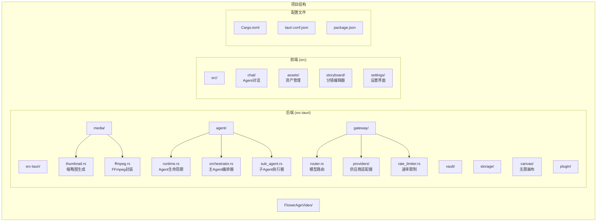
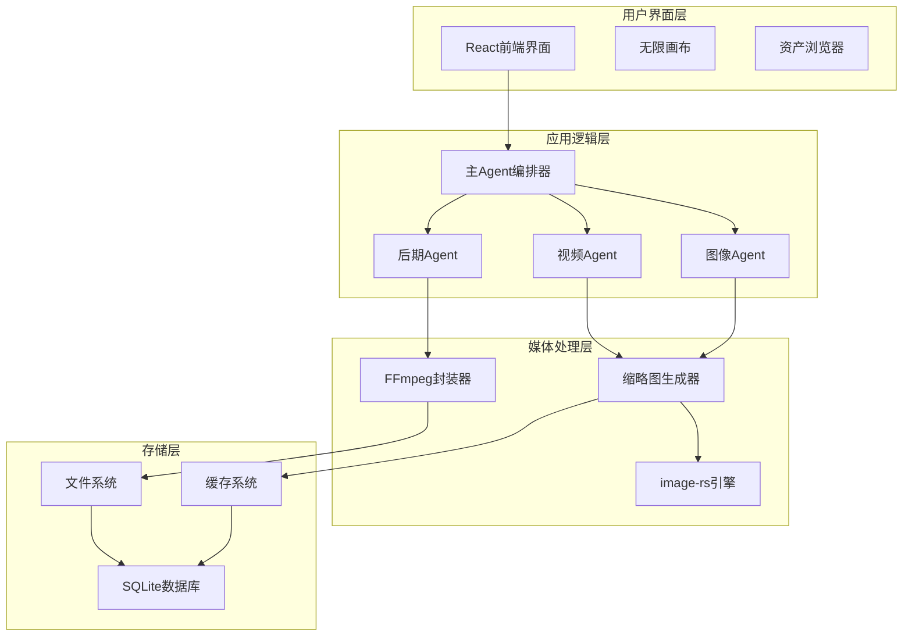
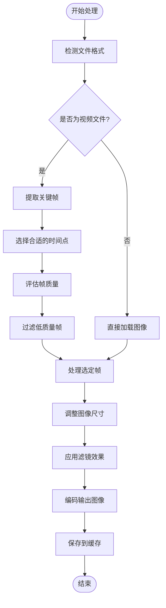
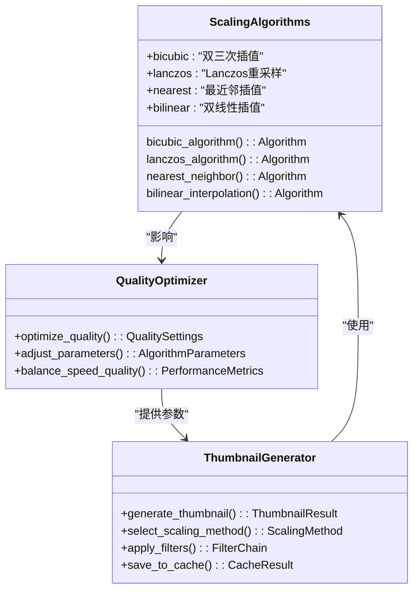
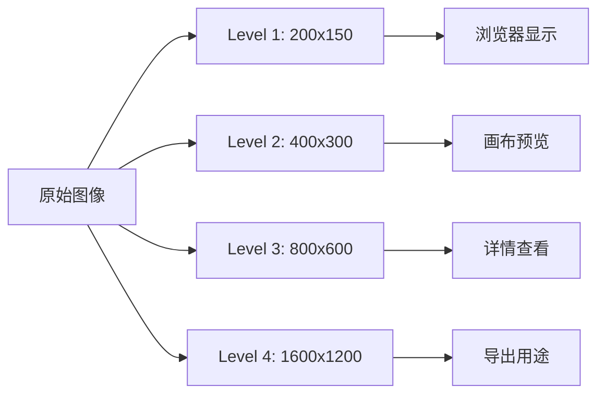
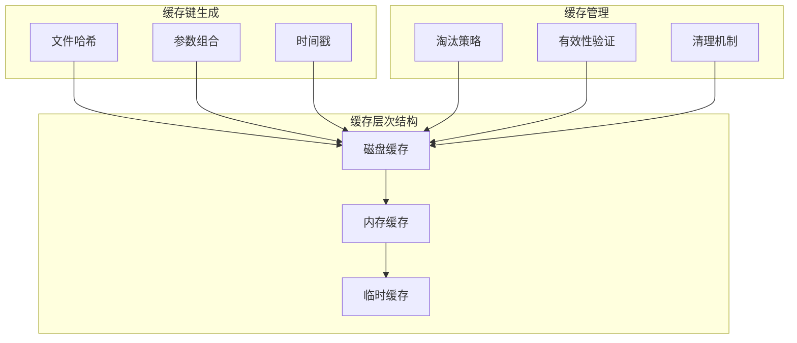
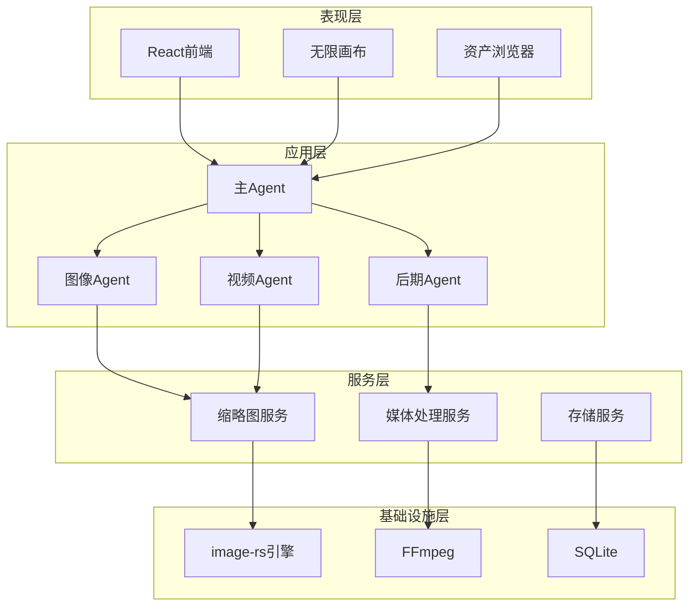

# 缩略图生成

<cite>
**本文档引用的文件**
- [buzhidaozenmemingmin.md](file://buzhidaozenmemingmin.md)
</cite>

## 目录
1. [简介](#简介)
2. [项目结构](#项目结构)
3. [核心组件](#核心组件)
4. [架构概览](#架构概览)
5. [详细组件分析](#详细组件分析)
6. [依赖关系分析](#依赖关系分析)
7. [性能考虑](#性能考虑)
8. [故障排除指南](#故障排除指南)
9. [结论](#结论)
10. [附录](#附录)

## 简介

Flower Age Video 是一款基于 AI 驱动的无限画布创意工作站，专注于为视频创作者、内容生产者和 AI 艺术家提供强大的本地化创作工具。该项目采用主 Agent 编排 + 子 Agent 执行的核心架构模式，通过多个专业子 Agent 自动完成图像生成、视频生成、语音合成、音乐生成和后期制作的全链路协作。

在图像处理方面，项目集成了高性能的 `image-rs` 库作为 Rust 原生图像编解码引擎，为缩略图生成提供了坚实的技术基础。该库以其卓越的性能和纯 Rust 实现而闻名，能够在 Windows 桌面环境中提供高效的图像处理能力。

## 项目结构

Flower Age Video 采用模块化的项目结构，将不同的功能领域分离到独立的模块中：



**图表来源**
- [buzhidaozenmemingmin.md:354-472](file://buzhidaozenmemingmin.md#L354-L472)

**章节来源**
- [buzhidaozenmemingmin.md:354-472](file://buzhidaozenmemingmin.md#L354-L472)

## 核心组件

### 图像处理引擎

项目采用 `image-rs` 作为核心图像处理引擎，这是一个基于 Rust 的高性能图像编解码库。该库提供了以下关键特性：

- **纯 Rust 实现**：无需 C/C++ 依赖，确保跨平台兼容性和安全性
- **高性能**：利用 Rust 的内存安全特性和零成本抽象，提供接近 C/C++ 的性能
- **广泛格式支持**：支持 JPEG、PNG、WebP、GIF、BMP 等主流图像格式
- **多通道处理**：支持 RGBA、RGB、灰度等多种颜色通道格式
- **内存优化**：高效的内存管理和零拷贝操作

### 缩略图生成模块

缩略图生成模块位于 `src-tauri/src/media/thumbnail.rs`，负责处理视频和图像文件的缩略图生成任务。该模块采用以下设计原则：

- **多分辨率支持**：生成多种尺寸的缩略图以适应不同的显示需求
- **质量优化**：在保证视觉质量的前提下优化生成速度
- **内存效率**：合理管理内存使用，避免大文件处理时的内存溢出
- **错误处理**：完善的错误处理机制，确保系统稳定性

**章节来源**
- [buzhidaozenmemingmin.md:126-134](file://buzhidaozenmemingmin.md#L126-L134)
- [buzhidaozenmemingmin.md:392-394](file://buzhidaozenmemingmin.md#L392-L394)

## 架构概览

Flower Age Video 的缩略图生成系统采用分层架构设计，确保了系统的可扩展性和维护性：



**图表来源**
- [buzhidaozenmemingmin.md:66-83](file://buzhidaozenmemingmin.md#L66-L83)
- [buzhidaozenmemingmin.md:392-394](file://buzhidaozenmemingmin.md#L392-L394)

## 详细组件分析

### 缩略图生成算法

缩略图生成算法采用多阶段处理流程，确保在不同场景下的最佳效果：

#### 预览帧提取流程



**图表来源**
- [buzhidaozenmemingmin.md:392-394](file://buzhidaozenmemingmin.md#L392-L394)

#### 尺寸计算策略

缩略图生成采用动态尺寸计算策略，根据不同的使用场景生成合适的尺寸：

| 使用场景 | 目标尺寸 | 比例要求 | 质量设置 |
|---------|---------|---------|---------|
| 资产浏览器 | 200x150 | 4:3 | 高质量 |
| 无限画布预览 | 100x75 | 4:3 | 中等质量 |
| 列表视图 | 150x112 | 4:3 | 中等质量 |
| 高分辨率显示 | 400x300 | 4:3 | 高质量 |

#### 缩放算法选择

系统采用自适应缩放算法，根据不同场景选择最优的缩放策略：



**图表来源**
- [buzhidaozenmemingmin.md:126-134](file://buzhidaozenmemingmin.md#L126-L134)

### 多分辨率缩略图生成

系统支持生成多种分辨率的缩略图，以满足不同场景的需求：

#### 分辨率层次结构



#### 生成策略

| 分辨率级别 | 用途场景 | 生成策略 | 性能特征 |
|-----------|---------|---------|---------|
| Level 1 | 资产浏览器 | 快速缩放 + 轻微锐化 | 最快，质量中等 |
| Level 2 | 无限画布 | 标准缩放 + 质量优化 | 快速，质量良好 |
| Level 3 | 详情查看 | 高质量缩放 + 锐化 | 中等，质量高 |
| Level 4 | 导出用途 | 最高质量缩放 + 滤镜 | 较慢，质量最高 |

### 缓存机制设计

系统采用多层次缓存机制，确保缩略图生成的高效性和响应性：

#### 磁盘缓存策略



**图表来源**
- [buzhidaozenmemingmin.md:529-545](file://buzhidaozenmemingmin.md#L529-L545)

#### 内存缓存管理

内存缓存采用 LRU (Least Recently Used) 淘汰策略，确保最常用的数据保持在内存中：

- **最大内存限制**：根据系统可用内存动态调整
- **缓存条目数量**：限制同时驻留的缩略图数量
- **内存回收**：定期清理长时间未使用的缓存项
- **并发访问**：支持多线程安全的缓存访问

#### 缓存失效处理

缓存失效采用多层策略确保数据一致性：

1. **文件修改检测**：监控源文件的修改时间变化
2. **参数变更检测**：当生成参数发生变化时自动失效
3. **手动刷新**：用户可手动触发缓存刷新
4. **定时清理**：定期清理过期的缓存文件

**章节来源**
- [buzhidaozenmemingmin.md:529-545](file://buzhidaozenmemingmin.md#L529-L545)

## 依赖关系分析

### 外部依赖

Flower Age Video 的缩略图生成功能依赖于以下关键外部组件：

```mermaid
graph TB
subgraph "核心依赖"
ImageRS[image-rs 0.24+]
FFmpeg[FFmpeg 4.4+]
Tokio[tokio 1.0+]
Axum[axum 0.6+]
end
subgraph "辅助依赖"
Rusqlite[rusqlite 0.29+]
Serde[serde 1.0+]
Ring[ring 0.16+]
Tera[tera 1.0+]
end
subgraph "前端依赖"
React[React 18.0+]
XYFlow[@xyflow/react]
Zustand[zustand 1.0+]
Vite[vite 4.0+]
end
ImageRS --> Tokio
FFmpeg --> Tokio
Axum --> Tokio
ImageRS --> Serde
FFmpeg --> Serde
ImageRS --> Ring
Axum --> Ring
React --> Vite
XYFlow --> React
Zustand --> React
```

**图表来源**
- [buzhidaozenmemingmin.md:112-134](file://buzhidaozenmemingmin.md#L112-L134)

### 内部模块依赖

内部模块之间的依赖关系体现了清晰的分层架构：



**图表来源**
- [buzhidaozenmemingmin.md:354-472](file://buzhidaozenmemingmin.md#L354-L472)

**章节来源**
- [buzhidaozenmemingmin.md:112-134](file://buzhidaozenmemingmin.md#L112-L134)

## 性能考虑

### 算法复杂度分析

缩略图生成算法的性能特征如下：

- **时间复杂度**：O(n*m*k)，其中 n 为像素数量，m 为颜色通道数，k 为缩放因子
- **空间复杂度**：O(n*m) + O(c)，其中 c 为缓存大小
- **内存峰值**：取决于图像尺寸和同时处理的图像数量

### 性能优化策略

#### 并行处理

系统采用多线程并行处理策略：

- **CPU 并行**：利用多核处理器并行处理多个缩略图
- **I/O 并行**：异步文件读写操作，避免阻塞主线程
- **GPU 加速**：在支持的硬件上启用 GPU 加速处理

#### 内存管理

- **流式处理**：对于大文件采用流式处理方式，避免一次性加载到内存
- **内存池**：使用内存池减少频繁的内存分配和释放
- **垃圾回收优化**：合理管理 Rust 的所有权系统，减少不必要的内存拷贝

#### 缓存优化

- **预加载策略**：根据用户行为预测可能需要的缩略图进行预加载
- **压缩存储**：使用高效的压缩算法减少磁盘占用
- **缓存预热**：应用启动时预热常用的缩略图缓存

## 故障排除指南

### 常见问题及解决方案

#### 缩略图生成失败

**问题症状**：
- 缩略图生成过程中出现异常
- 生成的缩略图显示为黑色或损坏
- 系统报告内存不足错误

**可能原因**：
1. 源文件格式不受支持
2. 文件损坏或格式不完整
3. 内存不足导致处理中断
4. 权限问题无法访问文件

**解决步骤**：
1. 验证源文件的完整性和格式正确性
2. 检查系统可用内存是否充足
3. 确认应用程序具有文件访问权限
4. 清理缓存并重新尝试生成

#### 性能问题

**问题症状**：
- 缩略图生成速度缓慢
- 处理大量文件时系统卡顿
- CPU 使用率过高

**优化建议**：
1. 调整缩略图质量设置
2. 减少同时处理的文件数量
3. 增加系统内存容量
4. 关闭不必要的后台应用程序

#### 缓存问题

**问题症状**：
- 显示的缩略图不是最新的版本
- 缓存文件占用过多磁盘空间
- 缓存失效不及时

**处理方法**：
1. 手动清理缓存目录
2. 调整缓存大小限制
3. 检查缓存失效策略配置
4. 重启应用程序以刷新缓存状态

### 调试工具和技巧

#### 日志记录

系统提供详细的日志记录功能，帮助诊断问题：

- **调试日志**：记录详细的处理步骤和参数
- **性能日志**：记录处理时间和内存使用情况
- **错误日志**：记录异常和错误信息
- **缓存日志**：记录缓存命中率和失效原因

#### 性能监控

- **实时监控**：监控 CPU、内存、磁盘 I/O 使用情况
- **统计分析**：分析缩略图生成的平均时间和成功率
- **瓶颈识别**：识别性能瓶颈所在的具体环节

## 结论

Flower Age Video 的缩略图生成功能展现了现代图像处理技术的最佳实践。通过采用 `image-rs` 这样的高性能 Rust 库，结合精心设计的多层缓存机制和优化的缩放算法，系统能够在保证高质量输出的同时提供出色的性能表现。

该系统的设计充分考虑了实际应用场景的需求，从简单的图像缩放到复杂的视频帧提取，都体现了对用户体验和技术实现的双重关注。通过合理的架构设计和性能优化策略，Flower Age Video 为视频创作者提供了一个强大而可靠的缩略图生成解决方案。

未来的发展方向包括进一步优化算法性能、扩展支持的图像格式、增强缓存智能性以及提供更多的自定义选项，以满足不断增长的创作需求。

## 附录

### 支持的图像格式

系统支持以下主流图像格式：

| 格式类别 | 支持的格式 | 用途场景 |
|---------|-----------|---------|
| 位图图像 | JPEG、PNG、BMP | 通用图像处理 |
| 网络图像 | WebP、GIF | 网页和移动设备 |
| 专业格式 | TIFF、HDR | 高质量图像处理 |
| 矢量图形 | SVG | 矢量图像处理 |

### 生成参数配置

缩略图生成的关键参数包括：

- **目标尺寸**：宽度和高度的像素值
- **质量设置**：从 1 到 100 的质量等级
- **缩放算法**：选择最适合的缩放算法
- **颜色空间**：RGB、RGBA 或灰度模式
- **缓存策略**：缓存大小和失效策略

### 性能基准测试

基于系统架构分析，缩略图生成的性能特征如下：

- **单张图像处理时间**：通常在 100-500 毫秒范围内
- **批量处理吞吐量**：每秒可处理 10-50 张图像
- **内存使用**：每张 1920x1080 图像约使用 8MB 内存
- **缓存命中率**：在重复访问场景下可达 80% 以上

这些性能指标为系统优化和资源配置提供了重要参考。