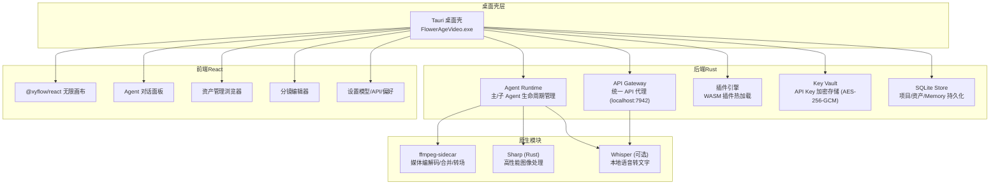
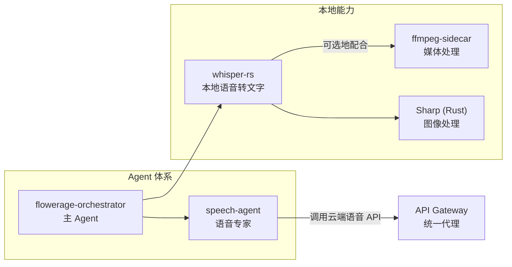
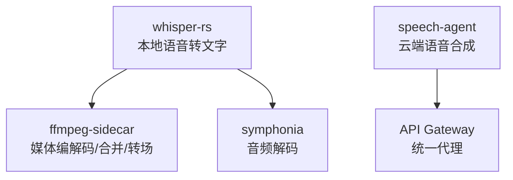

# 语音识别

<cite>
**本文引用的文件**
- [buzhidaozenmemingmin.md](file://buzhidaozenmemingmin.md)
</cite>

## 目录
1. [简介](#简介)
2. [项目结构](#项目结构)
3. [核心组件](#核心组件)
4. [架构总览](#架构总览)
5. [详细组件分析](#详细组件分析)
6. [依赖分析](#依赖分析)
7. [性能考虑](#性能考虑)
8. [故障排查指南](#故障排查指南)
9. [结论](#结论)
10. [附录](#附录)

## 简介
本文件围绕 Flower Age Video 的“可选语音识别”能力进行技术说明，目标是帮助开发者与使用者理解该能力在项目中的定位、可选特性以及与现有系统（主/子 Agent 编排、媒体处理、API 网关、Key Vault 等）的集成关系。根据仓库文档，项目在“原生模块”中将“语音识别（可选）”标注为 whisper-rs，用于本地语音转文字；同时在“Agent 体系”中存在“语音专家”子 Agent，负责 TTS、声音克隆、多角色对话与情绪控制等任务。本文将结合仓库文档，给出语音识别在系统中的职责边界、与云端语音服务的关系、以及如何在现有架构下进行配置与优化的指导。

## 项目结构
仓库以单一 Markdown 文档呈现项目设计与架构，未包含实际源代码文件。因此，本文对语音识别的分析严格基于文档中的描述与图示，不涉及具体代码片段。

图表来源
- [buzhidaozenmemingmin.md:29-49](file://buzhidaozenmemingmin.md#L29-L49)
- [buzhidaozenmemingmin.md:126-134](file://buzhidaozenmemingmin.md#L126-L134)

章节来源
- [buzhidaozenmemingmin.md:27-49](file://buzhidaozenmemingmin.md#L27-L49)
- [buzhidaozenmemingmin.md:126-134](file://buzhidaozenmemingmin.md#L126-L134)

## 核心组件
- 语音识别（可选）：whisper-rs，用于本地语音转文字。该能力被标注为“可选”，意味着其启用与否不影响其他核心 Agent 的运行。
- 语音专家子 Agent：负责 TTS、声音克隆、多角色对话与情绪控制等任务，与云端语音 API（如 MiniMax TTS、ElevenLabs）集成。
- 媒体处理：ffmpeg-sidecar 与 symphonia（音频解码）为视频/音频处理提供基础能力，可与语音识别配合使用（例如在识别前进行音频提取或格式转换）。
- API 网关：统一路由到各云端供应商 API，语音识别作为本地能力与云端语音服务形成互补。

章节来源
- [buzhidaozenmemingmin.md:132-133](file://buzhidaozenmemingmin.md#L132-L133)
- [buzhidaozenmemingmin.md:167-169](file://buzhidaozenmemingmin.md#L167-L169)
- [buzhidaozenmemingmin.md:130-133](file://buzhidaozenmemingmin.md#L130-L133)
- [buzhidaozenmemingmin.md:268-288](file://buzhidaozenmemingmin.md#L268-L288)

## 架构总览
语音识别在系统中的位置如下：
- 作为“原生模块”的一部分，whisper-rs 与 ffmpeg-sidecar、Sharp 并列，属于可选能力。
- 在 Agent 体系中，“语音专家”子 Agent 负责云端语音合成与相关任务，而 whisper-rs 则提供本地语音转文字能力，二者可并行使用：前者用于“说”，后者用于“听/转写”。

图表来源
- [buzhidaozenmemingmin.md:132-133](file://buzhidaozenmemingmin.md#L132-L133)
- [buzhidaozenmemingmin.md:167-169](file://buzhidaozenmemingmin.md#L167-L169)
- [buzhidaozenmemingmin.md:268-288](file://buzhidaozenmemingmin.md#L268-L288)

## 详细组件分析
本节从“职责边界、与云端语音的关系、可选性与集成点”三个维度展开，帮助读者理解如何在现有架构中引入或启用 whisper-rs。

### 职责边界与定位
- 本地语音转文字：whisper-rs 作为可选能力，适合在本地完成语音到文本的离线处理，降低对外部网络与云端 API 的依赖。
- 云端语音合成：speech-agent 专注于 TTS、声音克隆、多角色对话与情绪控制，通常依赖云端 API（如 MiniMax TTS、ElevenLabs），与本地识别能力互补。
- 两者协同：在工作流中，可先用 whisper-rs 将语音转为文本，再将文本交给 speech-agent 或其他 Agent 进行后续处理（如翻译、摘要、分镜脚本生成等）。

章节来源
- [buzhidaozenmemingmin.md:132-133](file://buzhidaozenmemingmin.md#L132-L133)
- [buzhidaozenmemingmin.md:167-169](file://buzhidaozenmemingmin.md#L167-L169)

### 与云端语音的关系
- 云端语音 API：API Gateway 负责将请求路由至各供应商 API（OpenAI、Anthropic、Stability、MiniMax、ElevenLabs、Suno 等）。speech-agent 通过该网关调用云端语音服务。
- 本地识别与云端合成的组合：本地识别用于“听/转写”，云端合成用于“说/播报”。二者在 Agent 编排中可并行或串行，依据任务需求进行组合。

章节来源
- [buzhidaozenmemingmin.md:268-288](file://buzhidaozenmemingmin.md#L268-L288)

### 可选性与集成点
- 可选性：whisper-rs 在“原生模块”中标注为“可选”，意味着其启用不会影响其他核心模块的运行。
- 集成点：Agent Runtime 可在需要时调用 whisper-rs；同时，whisper-rs 也可与媒体处理模块（ffmpeg-sidecar、Sharp）配合，用于音频提取、格式转换、图像处理等前置步骤。

章节来源
- [buzhidaozenmemingmin.md:132-133](file://buzhidaozenmemingmin.md#L132-L133)
- [buzhidaozenmemingmin.md:126-134](file://buzhidaozenmemingmin.md#L126-L134)

## 依赖分析
- whisper-rs：本地语音转文字能力，作为可选模块与 Agent Runtime、媒体处理模块协同。
- ffmpeg-sidecar：媒体编解码、合并、转场，常用于音频/视频预处理，可与 whisper-rs 配合使用。
- symphonia：音频解码，为媒体处理提供基础能力。
- API Gateway：统一代理云端语音 API，与 whisper-rs 形成“本地识别 + 云端合成”的互补方案。

图表来源
- [buzhidaozenmemingmin.md:130-133](file://buzhidaozenmemingmin.md#L130-L133)
- [buzhidaozenmemingmin.md:132-133](file://buzhidaozenmemingmin.md#L132-L133)
- [buzhidaozenmemingmin.md:268-288](file://buzhidaozenmemingmin.md#L268-L288)

章节来源
- [buzhidaozenmemingmin.md:130-133](file://buzhidaozenmemingmin.md#L130-L133)
- [buzhidaozenmemingmin.md:132-133](file://buzhidaozenmemingmin.md#L132-L133)
- [buzhidaozenmemingmin.md:268-288](file://buzhidaozenmemingmin.md#L268-L288)

## 性能考虑
以下为基于仓库文档与常见实践的通用建议，帮助在本地启用 whisper-rs 时获得更好的性能与稳定性：
- 模型选择与精度权衡：whisper-rs 支持不同大小的模型，通常模型越大，识别精度越高但推理耗时与内存占用也更高。建议在“准确率优先”的场景使用较大模型，在“实时性优先”的场景使用较小模型。
- 语言支持：whisper-rs 支持多语言，但不同语言的模型大小与精度存在差异。在多语言场景下，应根据目标语言选择合适的模型，并在必要时进行语言检测或手动指定语言。
- 预处理与后处理：在调用 whisper-rs 之前，可利用 ffmpeg-sidecar 进行音频采样率、声道数、格式的标准化；识别完成后，可对文本进行清洗、标点修复、分段等后处理，以提升下游任务（如分镜脚本生成）的质量。
- 内存与缓存：whisper-rs 在推理时会加载模型权重，占用一定内存。建议在长时间运行或批量处理时，合理管理模型生命周期，避免重复加载；同时注意系统可用内存，避免与其它高内存占用任务（如视频渲染）冲突。
- 实时识别：若需实时识别，建议采用分块推理策略（按固定时长切片），并在前端或后端进行滑动窗口拼接与去重，以降低延迟并提高连续性。

## 故障排查指南
- 模型加载失败：确认已正确下载并放置 whisper-rs 所需的模型文件；检查模型文件完整性与权限；确保运行时具备足够的磁盘空间。
- 识别结果异常：检查输入音频是否符合采样率、声道数、格式要求；确认语言设置与实际语音一致；尝试调整模型大小或语言参数。
- 性能问题：若识别耗时过长，考虑切换到更小的模型；关闭不必要的后处理步骤；在多任务并发时限制并发数量。
- 与云端语音的冲突：若同时使用 whisper-rs 与云端语音 API，注意区分“本地识别”与“云端合成”的职责边界，避免重复处理同一段音频。

## 结论
仓库文档明确将 whisper-rs 标注为“可选”的本地语音转文字能力，并将其置于“原生模块”中，与 ffmpeg-sidecar、Sharp 并列。在 Agent 体系中，speech-agent 负责云端语音合成，与本地识别能力形成互补。结合仓库的“主 Agent + 子 Agent”编排模式，语音识别可在需要时被调用，与媒体处理、API 网关、Key Vault 等模块协同工作。由于仓库未包含具体源代码，本文基于文档描述提供了职责边界、集成点与优化建议，供后续实现与调优参考。

## 附录
- 相关文件与位置
  - 语音识别（可选）：见“原生模块”部分
  - 语音专家子 Agent：见“Agent 体系”部分
  - API 网关与云端语音 API：见“API Gateway 设计”部分
  - 媒体处理与音频解码：见“原生模块”与“技术栈（全部 MIT / Apache-2.0 许可证）”部分

章节来源
- [buzhidaozenmemingmin.md:126-134](file://buzhidaozenmemingmin.md#L126-L134)
- [buzhidaozenmemingmin.md:132-133](file://buzhidaozenmemingmin.md#L132-L133)
- [buzhidaozenmemingmin.md:167-169](file://buzhidaozenmemingmin.md#L167-L169)
- [buzhidaozenmemingmin.md:268-288](file://buzhidaozenmemingmin.md#L268-L288)
- [buzhidaozenmemingmin.md:126-134](file://buzhidaozenmemingmin.md#L126-L134)