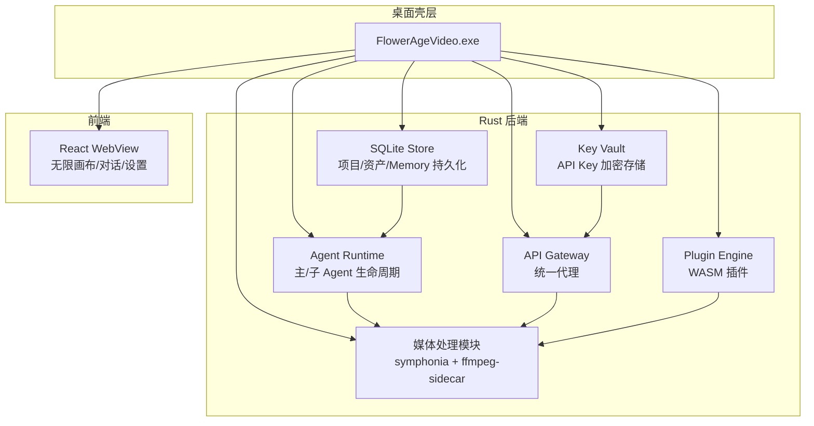
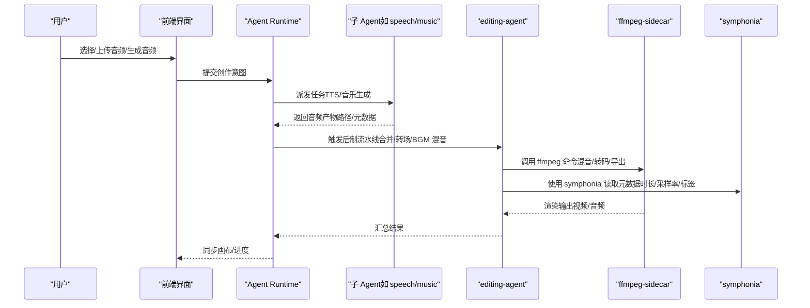
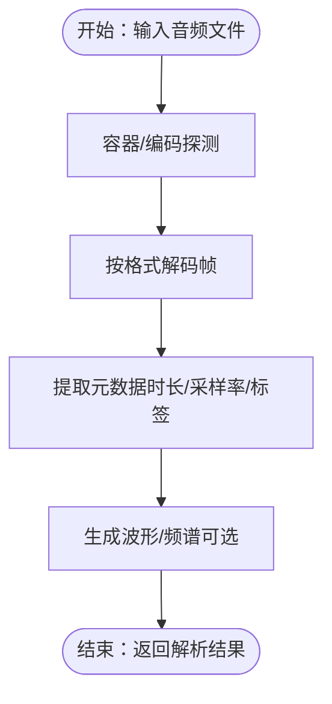
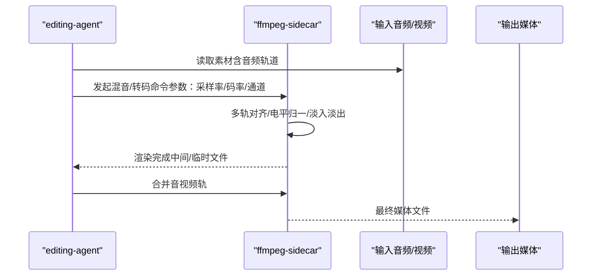
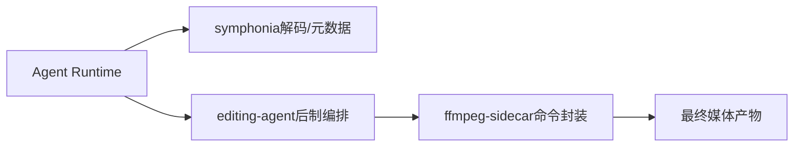

# 音频处理

<cite>
**本文引用的文件**
- [buzhidaozenmemingmin.md](file://buzhidaozenmemingmin.md)
</cite>

## 目录
1. [简介](#简介)
2. [项目结构](#项目结构)
3. [核心组件](#核心组件)
4. [架构总览](#架构总览)
5. [详细组件分析](#详细组件分析)
6. [依赖分析](#依赖分析)
7. [性能考虑](#性能考虑)
8. [故障排查指南](#故障排查指南)
9. [结论](#结论)
10. [附录](#附录)

## 简介
本文件围绕 Flower Age Video 的音频处理能力进行系统化技术说明。根据项目设计文档，系统在 Rust 后端采用两类原生能力：
- symphonia：用于原生音频解码与元数据提取
- ffmpeg-sidecar：用于媒体编解码、合并、转场与音频混音、格式转换等后制流程

文档将从“音频格式支持、解码流程与元数据提取”“音频处理核心功能（混音、音量调整、格式转换、流处理）”“编解码器选择策略（MP3、AAC、FLAC、WAV）”“性能优化与内存控制、实时处理能力”“参数配置、质量调优与故障诊断”五个维度展开，并结合项目中 editing-agent 的后制职责与 ffmpeg 的集成方式给出实践指导。

## 项目结构
音频处理在后端以“原生解码 + 本地后制”的组合方式实现：
- symphonia：Rust 原生音频解码，负责解析多种音频格式并提取元数据
- ffmpeg-sidecar：封装 ffmpeg 命令，执行混音、格式转换、合并渲染等后制任务
- editing-agent：承接“片段合并/转场/唇形同步/BGM 混音/MV 流水线”，作为音频后制的编排入口

**图表来源**
- [buzhidaozenmemingmin.md:27-65](file://buzhidaozenmemingmin.md#L27-L65)
- [buzhidaozenmemingmin.md:354-416](file://buzhidaozenmemingmin.md#L354-L416)

**章节来源**
- [buzhidaozenmemingmin.md:27-65](file://buzhidaozenmemingmin.md#L27-L65)
- [buzhidaozenmemingmin.md:354-416](file://buzhidaozenmemingmin.md#L354-L416)

## 核心组件
- symphonia（音频解码与元数据提取）
  - 用途：Rust 原生音频解码，支持多种容器与编码格式，提供元数据读取能力
  - 在项目中承担“音频资产解析、时长、采样率、声道、标签等元数据提取”的职责
- ffmpeg-sidecar（媒体编解码与后制）
  - 用途：封装 ffmpeg 命令，执行合并、转场、BGM 混音、格式转换、导出等
  - 在 editing-agent 的后制流水线中被调用，确保本地执行且零外部依赖
- editing-agent（后制编排）
  - 用途：负责“片段合并/转场/唇形同步/BGM 混音/MV 流水线”，串联前端素材与后制命令

**章节来源**
- [buzhidaozenmemingmin.md:132](file://buzhidaozenmemingmin.md#L132)
- [buzhidaozenmemingmin.md:169-170](file://buzhidaozenmemingmin.md#L169-L170)
- [buzhidaozenmemingmin.md:676-680](file://buzhidaozenmemingmin.md#L676-L680)

## 架构总览
音频处理在系统中的位置与交互如下：

**图表来源**
- [buzhidaozenmemingmin.md:676-680](file://buzhidaozenmemingmin.md#L676-L680)
- [buzhidaozenmemingmin.md:132](file://buzhidaozenmemingmin.md#L132)

## 详细组件分析

### 组件A：音频解码与元数据提取（symphonia）
- 职责
  - 解码多种音频格式容器与编码
  - 提取时长、采样率、声道数、编码参数、标签（标题、艺术家、专辑等）
- 适用场景
  - 音频资产入库前的快速解析
  - 后制阶段对输入音频时长/采样的校验
  - 画布节点（AudioNode）的波形与元数据展示
- 关键优势
  - 原生 Rust 实现，零外部依赖，内存可控
  - 轻量、可并行，适合在 Agent Runtime 中作为前置步骤

**图表来源**
- [buzhidaozenmemingmin.md:132](file://buzhidaozenmemingmin.md#L132)

**章节来源**
- [buzhidaozenmemingmin.md:132](file://buzhidaozenmemingmin.md#L132)

### 组件B：音频混音与格式转换（ffmpeg-sidecar）
- 职责
  - BGM 混音：将背景音乐与人声/旁白进行时间轴对齐与电平匹配
  - 音量调整：对轨道进行增益/衰减，避免过载
  - 格式转换：将音频统一为目标容器与编码（如 AAC/MP3/WAV/FLAC）
  - 合并与导出：与视频流合并，输出最终成品
- 关键流程
  - 输入校验：时长/采样率/通道一致性
  - 时间对齐：基于时间戳或节拍/歌词对齐
  - 混音参数：增益、淡入淡出、交叉淡化
  - 编码参数：码率、采样率、通道、容器封装
  - 渲染输出：多轨合并、封装为 MP4/MOV/AVI 等

**图表来源**
- [buzhidaozenmemingmin.md:676-680](file://buzhidaozenmemingmin.md#L676-L680)

**章节来源**
- [buzhidaozenmemingmin.md:676-680](file://buzhidaozenmemingmin.md#L676-L680)

### 组件C：音频流处理与实时能力
- 流处理能力
  - 通过 ffmpeg 的流式处理能力，支持边生成边处理（如直播/录制回放）
  - 结合 SSE 进度推送，前端可实时感知后制进度
- 实时性保障
  - 将解码与混音任务拆分为可并行的子任务，降低端到端延迟
  - 使用异步运行时（tokio）与任务队列，避免阻塞主线程

**章节来源**
- [buzhidaozenmemingmin.md:117](file://buzhidaozenmemingmin.md#L117)
- [buzhidaozenmemingmin.md:676-680](file://buzhidaozenmemingmin.md#L676-L680)

### 组件D：编解码器选择策略（MP3、AAC、FLAC、WAV）
- MP3
  - 优点：兼容性极佳，体积较小
  - 适用：广播/分发场景；对质量要求中等
  - 注意：有损压缩，建议合理码率（如 256/320 kbps）
- AAC
  - 优点：有损压缩下音质优异，广泛用于移动与流媒体
  - 适用：移动端播放、在线分发
  - 注意：需正确封装（ADTS/ADIF 或 MP4 容器）
- FLAC
  - 优点：无损压缩，音质最佳
  - 适用：母带/存档、高质量后期
  - 注意：文件较大，CPU 开销更高
- WAV
  - 优点：无压缩，音质完美
  - 适用：专业后期、进一步编码前的中间格式
  - 注意：文件大，需注意存储与内存占用

**章节来源**
- [buzhidaozenmemingmin.md:132](file://buzhidaozenmemingmin.md#L132)
- [buzhidaozenmemingmin.md:676-680](file://buzhidaozenmemingmin.md#L676-L680)

## 依赖分析
- symphonia 与 ffmpeg 的职责边界
  - symphonia：专注“解码与元数据”，轻量、可控
  - ffmpeg：专注“编解码与后制”，功能全面、性能稳定
- 依赖关系
  - editing-agent 作为编排器，协调 symphonia 与 ffmpeg 的调用顺序
  - ffmpeg-sidecar 作为本地二进制封装，首次启动自动下载，后续离线可用

**图表来源**
- [buzhidaozenmemingmin.md:132](file://buzhidaozenmemingmin.md#L132)
- [buzhidaozenmemingmin.md:676-680](file://buzhidaozenmemingmin.md#L676-L680)

**章节来源**
- [buzhidaozenmemingmin.md:132](file://buzhidaozenmemingmin.md#L132)
- [buzhidaozenmemingmin.md:676-680](file://buzhidaozenmemingmin.md#L676-L680)

## 性能考虑
- 解码阶段（symphonia）
  - 并行解析：对多音频文件采用并发任务，缩短总解析时间
  - 流式读取：避免一次性加载大文件至内存，降低峰值内存
  - 元数据优先：仅在需要时解码关键帧，减少 CPU 占用
- 后制阶段（ffmpeg-sidecar）
  - 多轨并行：利用 ffmpeg 的多线程能力，加速混音与转码
  - 参数预设：固定采样率/码率/通道，减少重复计算
  - 临时文件管理：合理清理中间文件，避免磁盘压力
- 实时处理
  - SSE 推送：后制进度通过 SSE 实时反馈，改善用户体验
  - 异步队列：将耗时任务放入后台队列，保持界面流畅

**章节来源**
- [buzhidaozenmemingmin.md:117](file://buzhidaozenmemingmin.md#L117)
- [buzhidaozenmemingmin.md:676-680](file://buzhidaozenmemingmin.md#L676-L680)

## 故障排查指南
- 常见问题与定位
  - 音频无法解码/元数据缺失：检查容器与编码是否受支持；确认文件未损坏
  - 混音后爆音/削波：检查增益/电平设置，必要时启用限制器
  - 时长不一致导致对不准：统一采样率与起始时间戳
  - 导出失败：检查 ffmpeg 是否可用、磁盘空间、权限
- 诊断步骤
  - 使用 symphonia 读取元数据，核对采样率/通道/时长
  - 逐步执行 ffmpeg 命令，定位具体环节（混音/封装/导出）
  - 查看日志与 SSE 进度，确认异常发生阶段
- 降级策略
  - 若某格式不受支持，回退到 WAV/FLAC 等通用中间格式
  - 若实时性不足，降低码率或关闭高成本效果（如复杂淡入淡出）

**章节来源**
- [buzhidaozenmemingmin.md:132](file://buzhidaozenmemingmin.md#L132)
- [buzhidaozenmemingmin.md:676-680](file://buzhidaozenmemingmin.md#L676-L680)

## 结论
Flower Age Video 的音频处理以“symphonia + ffmpeg-sidecar”为核心，前者负责轻量、可控的解码与元数据提取，后者负责强大的编解码与后制能力。通过 editing-agent 的编排，系统实现了从素材解析到最终导出的一体化工作流。在实际使用中，应结合业务需求选择合适的编解码器与参数，配合性能优化与故障排查策略，确保高质量与高效率的音频处理体验。

## 附录
- 相关技术栈与职责
  - symphonia：Rust 原生音频解码，MPL-2.0（非传染）
  - ffmpeg-sidecar：本地 ffmpeg 二进制封装，MIT
  - editing-agent：后制编排，负责混音/转码/合并/导出

**章节来源**
- [buzhidaozenmemingmin.md:132](file://buzhidaozenmemingmin.md#L132)
- [buzhidaozenmemingmin.md:676-680](file://buzhidaozenmemingmin.md#L676-L680)