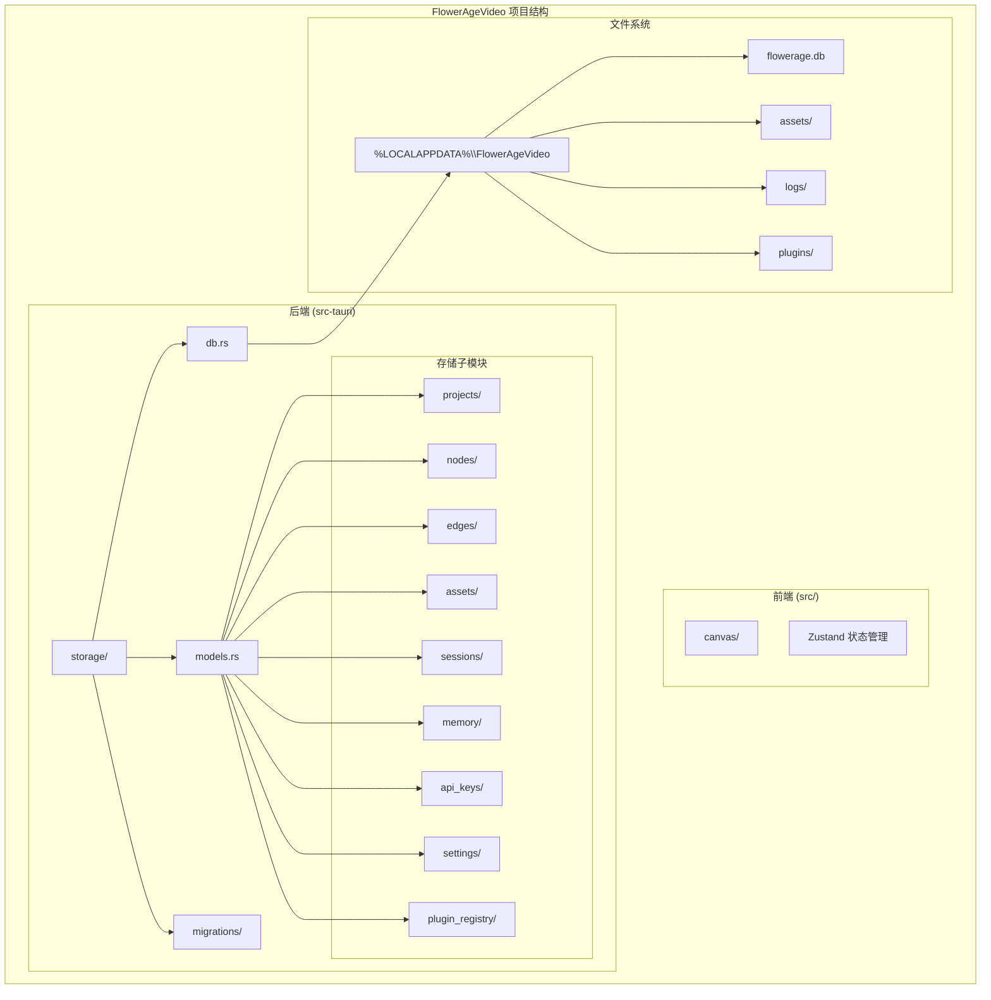
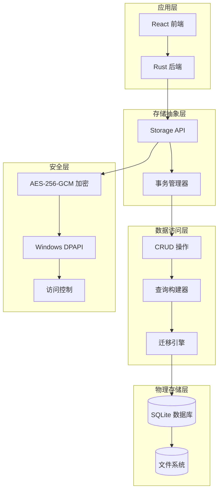
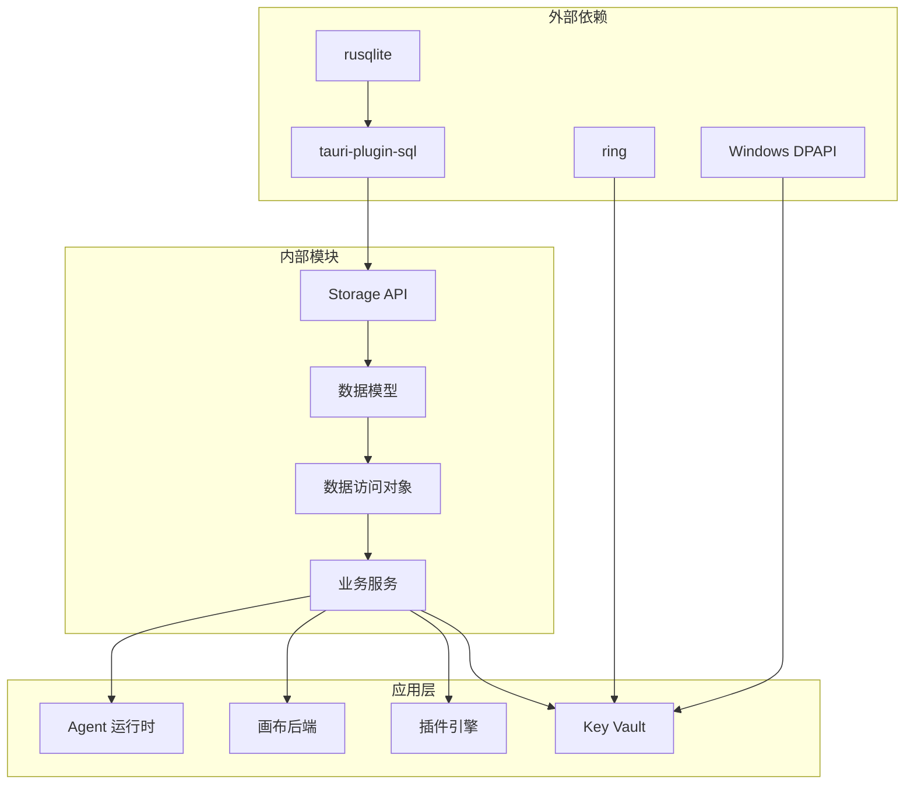

# 存储系统

<cite>
**本文档引用的文件**
- [buzhidaozenmemingmin.md](file://buzhidaozenmemingmin.md)
</cite>

## 目录
1. [简介](#简介)
2. [项目结构](#项目结构)
3. [核心组件](#核心组件)
4. [架构概览](#架构概览)
5. [详细组件分析](#详细组件分析)
6. [依赖关系分析](#依赖关系分析)
7. [性能考虑](#性能考虑)
8. [故障排除指南](#故障排除指南)
9. [结论](#结论)
10. [附录](#附录)

## 简介

Flower Age Video 的存储系统是一个基于 SQLite 的本地数据存储解决方案，专为 AI 驱动的无限画布创意工作站设计。该系统提供了完整的数据持久化能力，包括项目元信息、画布节点、资产索引、会话历史、Memory 持久化、API Key 加密存储和插件注册等功能。

该存储系统采用嵌入式 SQLite 数据库，通过 tauri-plugin-sql 插件与 Rust 后端集成，确保了高性能、可靠性和易维护性。系统设计遵循零依赖原则，所有数据都存储在本地用户的应用数据目录中，保证了隐私性和安全性。

## 项目结构

存储系统在项目中的组织结构如下：

**图表来源**
- [buzhidaozenmemingmin.md: 357-416:357-416](file://buzhidaozenmemingmin.md#L357-L416)
- [buzhidaozenmemingmin.md: 512-545:512-545](file://buzhidaozenmemingmin.md#L512-L545)

**章节来源**
- [buzhidaozenmemingmin.md: 357-416:357-416](file://buzhidaozenmemingmin.md#L357-L416)
- [buzhidaozenmemingmin.md: 512-545:512-545](file://buzhidaozenmemingmin.md#L512-L545)

## 核心组件

存储系统的核心组件包括：

### 1. 数据库层 (DB Layer)
- **SQLite 数据库**: 使用 rusqlite crate 提供的嵌入式数据库功能
- **连接管理**: 通过 tauri-plugin-sql 插件进行数据库连接和查询
- **事务支持**: 支持 ACID 事务，确保数据一致性

### 2. 数据模型层 (Models Layer)
- **项目模型**: 项目元信息和配置
- **节点模型**: 画布节点的结构和关系
- **资产模型**: 资产索引和元数据
- **会话模型**: Agent 会话历史记录
- **Memory 模型**: 用户偏好和角色锚点
- **API Key 模型**: 加密的 API Key 存储
- **设置模型**: 用户偏好和系统配置
- **插件模型**: 已安装插件的注册信息

### 3. 迁移管理层 (Migrations Layer)
- **版本控制**: 数据库结构的版本管理和升级
- **向后兼容**: 确保新版本向后兼容旧版本数据
- **数据迁移**: 复杂数据结构变更时的数据迁移策略

**章节来源**
- [buzhidaozenmemingmin.md: 120-121:120-121](file://buzhidaozenmemingmin.md#L120-L121)
- [buzhidaozenmemingmin.md: 385-388:385-388](file://buzhidaozenmemingmin.md#L385-L388)

## 架构概览

存储系统的整体架构采用分层设计，确保了清晰的职责分离和良好的可维护性：

**图表来源**
- [buzhidaozenmemingmin.md: 37-38:37-38](file://buzhidaozenmemingmin.md#L37-L38)
- [buzhidaozenmemingmin.md: 63](file://buzhidaozenmemingmin.md#L63)

## 详细组件分析

### 数据库 Schema 设计

存储系统采用规范化的关系型数据库设计，主要表结构如下：

#### 项目表 (projects)
存储项目的基本元信息和配置数据。

| 字段名 | 类型 | 约束 | 描述 |
|--------|------|------|------|
| id | TEXT | PRIMARY KEY | 项目唯一标识符 |
| name | TEXT | NOT NULL | 项目名称 |
| description | TEXT |  | 项目描述 |
| created_at | DATETIME | NOT NULL | 创建时间 |
| updated_at | DATETIME | NOT NULL | 最后更新时间 |
| status | TEXT | DEFAULT 'active' | 项目状态 |

#### 画布节点表 (nodes)
存储画布节点的结构化数据。

| 字段名 | 类型 | 约束 | 描述 |
|--------|------|------|------|
| id | TEXT | PRIMARY KEY | 节点唯一标识符 |
| project_id | TEXT | NOT NULL, FOREIGN KEY | 关联项目 |
| type | TEXT | NOT NULL | 节点类型 (ProjectNode, TextNode, ImageNode, 等) |
| data | JSON | NOT NULL | 节点数据 (JSON 格式) |
| position | JSON |  | 节点位置信息 |
| created_at | DATETIME | NOT NULL | 创建时间 |
| updated_at | DATETIME | NOT NULL | 最后更新时间 |

#### 边表 (edges)
存储画布节点间的连接关系。

| 字段名 | 类型 | 约束 | 描述 |
|--------|------|------|------|
| id | TEXT | PRIMARY KEY | 边唯一标识符 |
| source_node_id | TEXT | NOT NULL, FOREIGN KEY | 源节点 |
| target_node_id | TEXT | NOT NULL, FOREIGN KEY | 目标节点 |
| label | TEXT |  | 边标签或说明 |
| created_at | DATETIME | NOT NULL | 创建时间 |

#### 资产表 (assets)
存储生成资产的索引和元数据。

| 字段名 | 类型 | 约束 | 描述 |
|--------|------|------|------|
| id | TEXT | PRIMARY KEY | 资产唯一标识符 |
| project_id | TEXT | NOT NULL, FOREIGN KEY | 关联项目 |
| name | TEXT | NOT NULL | 资产名称 |
| path | TEXT | NOT NULL | 文件系统路径 |
| mime_type | TEXT | NOT NULL | MIME 类型 |
| size | INTEGER |  | 文件大小 (字节) |
| metadata | JSON |  | 元数据 (JSON 格式) |
| created_at | DATETIME | NOT NULL | 创建时间 |
| updated_at | DATETIME | NOT NULL | 最后更新时间 |

#### 会话表 (sessions)
存储 Agent 会话的历史记录。

| 字段名 | 类型 | 约束 | 描述 |
|--------|------|------|------|
| id | TEXT | PRIMARY KEY | 会话唯一标识符 |
| project_id | TEXT | NOT NULL, FOREIGN KEY | 关联项目 |
| agent_id | TEXT | NOT NULL | Agent 标识符 |
| input | TEXT | NOT NULL | 用户输入 |
| output | TEXT |  | Agent 输出 |
| status | TEXT | NOT NULL | 会话状态 |
| created_at | DATETIME | NOT NULL | 创建时间 |
| updated_at | DATETIME | NOT NULL | 最后更新时间 |

#### Memory 表 (memory)
存储用户偏好和角色锚点。

| 字段名 | 类型 | 约束 | 描述 |
|--------|------|------|------|
| id | TEXT | PRIMARY KEY | Memory 唯一标识符 |
| project_id | TEXT | NOT NULL, FOREIGN KEY | 关联项目 |
| key | TEXT | NOT NULL | 键名 |
| value | TEXT | NOT NULL | 值 (JSON 格式) |
| created_at | DATETIME | NOT NULL | 创建时间 |
| updated_at | DATETIME | NOT NULL | 最后更新时间 |

#### API Key 表 (api_keys)
存储加密的 API Key。

| 字段名 | 类型 | 约束 | 描述 |
|--------|------|------|------|
| id | TEXT | PRIMARY KEY | API Key 唯一标识符 |
| provider | TEXT | NOT NULL | 供应商名称 |
| encrypted_key | BLOB | NOT NULL | 加密的 API Key |
| iv | BLOB | NOT NULL | 初始化向量 |
| created_at | DATETIME | NOT NULL | 创建时间 |
| updated_at | DATETIME | NOT NULL | 最后更新时间 |

#### 设置表 (settings)
存储用户偏好和系统配置。

| 字段名 | 类型 | 约束 | 描述 |
|--------|------|------|------|
| id | TEXT | PRIMARY KEY | 设置唯一标识符 |
| key | TEXT | NOT NULL UNIQUE | 设置键名 |
| value | TEXT | NOT NULL | 设置值 (JSON 格式) |
| created_at | DATETIME | NOT NULL | 创建时间 |
| updated_at | DATETIME | NOT NULL | 最后更新时间 |

#### 插件注册表 (plugin_registry)
存储已安装插件的信息。

| 字段名 | 类型 | 约束 | 描述 |
|--------|------|------|------|
| id | TEXT | PRIMARY KEY | 插件唯一标识符 |
| name | TEXT | NOT NULL | 插件名称 |
| version | TEXT | NOT NULL | 插件版本 |
| wasm_path | TEXT | NOT NULL | WASM 文件路径 |
| manifest | JSON | NOT NULL | 插件清单 (JSON 格式) |
| installed_at | DATETIME | NOT NULL | 安装时间 |
| enabled | BOOLEAN | DEFAULT TRUE | 是否启用 |

**章节来源**
- [buzhidaozenmemingmin.md: 514-527:514-527](file://buzhidaozenmemingmin.md#L514-L527)

### 数据访问模式

存储系统采用多种数据访问模式以满足不同的使用场景：

#### 1. 命令查询职责分离 (CQRS)
- **写操作**: 专门的命令处理器负责数据修改
- **读操作**: 专门的查询处理器负责数据检索
- **事件溯源**: 通过事件日志实现数据变更追踪

#### 2. 仓储模式 (Repository Pattern)
- **抽象接口**: 定义统一的数据访问接口
- **实现隔离**: 具体实现与业务逻辑分离
- **测试友好**: 支持单元测试和模拟对象

#### 3. 单元事务模式 (Unit of Work)
- **事务边界**: 明确的事务开始和结束点
- **回滚机制**: 失败时自动回滚
- **并发控制**: 支持并发访问的锁机制

### 缓存策略

为了提高性能，存储系统实现了多层次的缓存策略：

#### 1. 查询结果缓存
- **短期缓存**: 针对频繁查询的结果进行缓存
- **失效策略**: 基于时间或数据变更的失效机制
- **内存管理**: 自动清理过期缓存项

#### 2. 结构缓存
- **表结构缓存**: 缓存数据库表结构信息
- **索引信息缓存**: 缓存查询索引信息
- **连接池**: 复用数据库连接，减少开销

#### 3. 应用层缓存
- **内存缓存**: 在应用内存中缓存热点数据
- **懒加载**: 按需加载和缓存数据
- **批量操作**: 支持批量数据的缓存和处理

**章节来源**
- [buzhidaozenmemingmin.md: 385-388:385-388](file://buzhidaozenmemingmin.md#L385-L388)

## 依赖关系分析

存储系统的依赖关系体现了清晰的分层架构：

**图表来源**
- [buzhidaozenmemingmin.md: 120-121:120-121](file://buzhidaozenmemingmin.md#L120-L121)
- [buzhidaozenmemingmin.md: 377-381:377-381](file://buzhidaozenmemingmin.md#L377-L381)

### 外部依赖

#### SQLite 相关依赖
- **rusqlite**: Rust 的 SQLite 绑定，提供类型安全的数据库访问
- **tauri-plugin-sql**: Tauri 生态系统的 SQL 插件，支持跨平台数据库访问

#### 加密相关依赖
- **ring**: Rust 的加密库，提供 AES-256-GCM 加密算法
- **Windows DPAPI**: Windows 平台的密钥管理服务

### 内部模块依赖

#### 存储 API 依赖
- **数据模型**: 定义数据结构和验证规则
- **DAO 层**: 实现具体的数据访问逻辑
- **业务服务**: 组合多个 DAO 操作，提供业务功能

#### 应用层集成
- **Agent 运行时**: 使用存储系统保存会话历史和 Memory
- **画布后端**: 管理画布节点和边的持久化
- **插件引擎**: 注册和管理已安装的插件
- **Key Vault**: 存储加密的 API Key

**章节来源**
- [buzhidaozenmemingmin.md: 120-121:120-121](file://buzhidaozenmemingmin.md#L120-L121)
- [buzhidaozenmemingmin.md: 377-381:377-381](file://buzhidaozenmemingmin.md#L377-L381)

## 性能考虑

存储系统在设计时充分考虑了性能优化，采用了多种策略来确保高效的数据访问：

### 1. 数据库性能优化

#### 索引策略
- **主键索引**: 所有表的主键自动建立索引
- **外键索引**: 关联字段建立索引以加速 JOIN 操作
- **复合索引**: 针对常用查询组合建立复合索引
- **全文索引**: 对文本搜索字段建立全文索引

#### 查询优化
- **预编译语句**: 使用预编译语句减少解析开销
- **批量操作**: 支持批量插入和更新操作
- **延迟加载**: 懒加载大型数据字段
- **查询缓存**: 缓存频繁执行的查询结果

### 2. 内存管理优化

#### 连接池管理
- **连接复用**: 复用数据库连接，减少连接开销
- **连接超时**: 设置合理的连接超时时间
- **连接监控**: 监控连接池使用情况

#### 内存缓存
- **热点数据缓存**: 缓存频繁访问的数据
- **LRU 淘汰**: 使用 LRU 算法淘汰不常用数据
- **内存限制**: 设置内存使用上限

### 3. 文件系统优化

#### 文件组织
- **目录分层**: 按资产类型分目录存储
- **文件命名**: 使用哈希值作为文件名，避免路径冲突
- **符号链接**: 使用符号链接管理重复文件

#### I/O 优化
- **异步 I/O**: 使用异步文件操作
- **缓冲区管理**: 合理设置文件缓冲区大小
- **批处理**: 批量文件操作减少系统调用

### 4. 网络性能优化

#### API Key 管理
- **内存缓存**: API Key 在内存中短期缓存
- **解密优化**: 优化解密操作的性能
- **并发访问**: 支持并发的 API Key 访问

**章节来源**
- [buzhidaozenmemingmin.md: 514-527:514-527](file://buzhidaozenmemingmin.md#L514-L527)

## 故障排除指南

### 常见问题及解决方案

#### 1. 数据库连接问题
**症状**: 应用启动时报数据库连接错误
**原因**: 数据库文件损坏或权限不足
**解决方案**:
- 检查数据库文件是否存在和可访问
- 验证应用程序对数据库文件的读写权限
- 运行数据库完整性检查

#### 2. 数据迁移失败
**症状**: 应用启动时报数据库版本不匹配
**原因**: 数据库结构与代码不兼容
**解决方案**:
- 运行数据库迁移脚本
- 检查迁移日志中的错误信息
- 手动修复迁移问题

#### 3. 性能问题
**症状**: 数据库操作响应缓慢
**原因**: 缺少必要的索引或查询优化不足
**解决方案**:
- 分析慢查询日志
- 添加适当的索引
- 优化查询语句

#### 4. 内存泄漏
**症状**: 应用内存使用持续增长
**原因**: 数据库连接未正确关闭
**解决方案**:
- 检查所有数据库连接的生命周期
- 确保连接在 finally 块中正确关闭
- 使用连接池管理连接

### 数据完整性保障

#### 1. 事务管理
- **原子性**: 所有数据库操作都在事务中执行
- **一致性**: 事务完成后验证数据一致性
- **隔离性**: 使用适当的隔离级别
- **持久性**: 确保事务提交后的数据持久化

#### 2. 数据验证
- **输入验证**: 对所有输入数据进行验证
- **约束检查**: 验证外键约束和业务规则
- **数据类型检查**: 确保数据类型正确

#### 3. 错误处理
- **异常捕获**: 捕获所有数据库相关异常
- **回滚机制**: 发生错误时自动回滚事务
- **日志记录**: 记录详细的错误信息

### 备份恢复机制

#### 1. 自动备份
- **定时备份**: 定期自动备份数据库文件
- **增量备份**: 支持增量备份以减少备份时间
- **备份验证**: 验证备份文件的完整性

#### 2. 手动备份
- **文件复制**: 直接复制数据库文件
- **导出导入**: 支持数据的导出和导入
- **版本管理**: 管理多个备份版本

#### 3. 恢复策略
- **快速恢复**: 支持快速恢复到最近的备份
- **点恢复**: 支持恢复到特定的时间点
- **灾难恢复**: 提供完整的灾难恢复方案

**章节来源**
- [buzhidaozenmemingmin.md: 385-388:385-388](file://buzhidaozenmemingmin.md#L385-L388)

## 结论

Flower Age Video 的存储系统是一个设计精良、功能完整的本地数据存储解决方案。通过采用 SQLite 嵌入式数据库、分层架构设计和多种优化策略，系统在保证数据安全性的同时，提供了优秀的性能表现。

系统的主要优势包括：
- **零依赖**: 完全本地化，无需额外的数据库服务器
- **安全性**: API Key 采用 AES-256-GCM 加密，结合 Windows DPAPI 保护
- **可扩展性**: 清晰的架构设计支持未来的功能扩展
- **可靠性**: 完善的错误处理和备份恢复机制
- **性能**: 多层次的缓存策略和查询优化

该存储系统为 Flower Age Video 的无限画布创意工作站提供了坚实的数据基础，支持复杂的多模态内容创作和管理需求。

## 附录

### 数据生命周期管理

#### 1. 数据创建
- **验证**: 对输入数据进行严格验证
- **标准化**: 标准化数据格式和编码
- **索引**: 为新数据建立必要的索引

#### 2. 数据更新
- **增量更新**: 支持部分数据更新
- **版本控制**: 跟踪数据的版本变化
- **审计日志**: 记录数据变更历史

#### 3. 数据归档
- **自动归档**: 根据时间或大小自动归档旧数据
- **压缩存储**: 对归档数据进行压缩存储
- **访问优化**: 为归档数据建立专门的访问策略

#### 4. 数据删除
- **软删除**: 支持软删除保留数据历史
- **硬删除**: 彻底删除数据和关联文件
- **清理策略**: 定期清理无效和过期数据

### 最佳实践建议

#### 1. 开发阶段
- **单元测试**: 为每个数据访问方法编写单元测试
- **集成测试**: 测试完整的数据流程
- **性能测试**: 定期进行性能基准测试

#### 2. 生产阶段
- **监控**: 实施数据库性能和健康监控
- **备份**: 建立定期备份和恢复演练
- **维护**: 定期进行数据库维护和优化

#### 3. 安全最佳实践
- **最小权限**: 为数据库用户分配最小必要权限
- **加密传输**: 即使是本地数据库也考虑加密
- **访问控制**: 实施严格的访问控制和审计