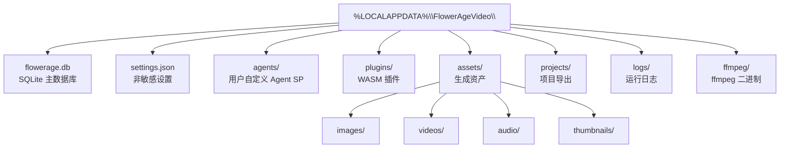
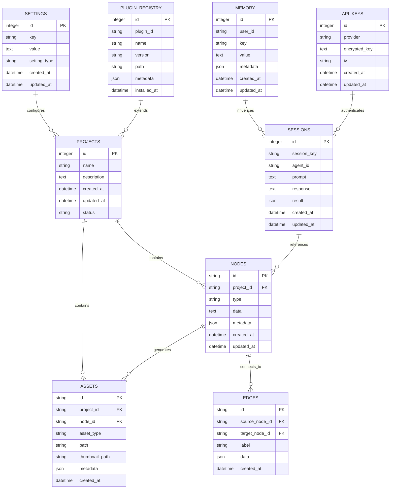
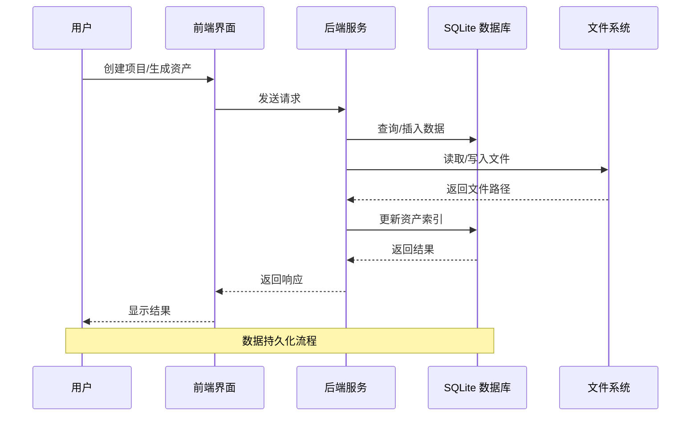
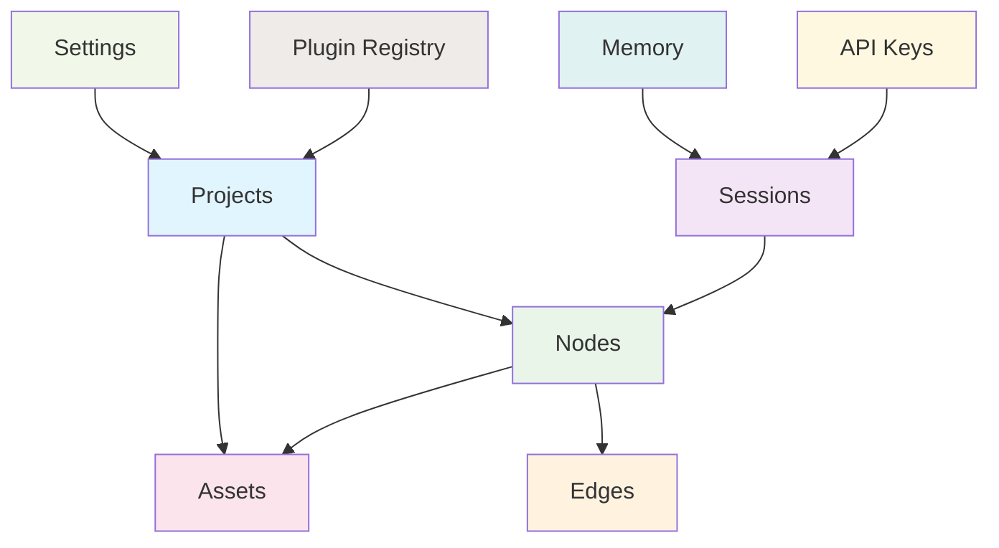

# 数据库架构设计

<cite>
**本文档引用的文件**
- [buzhidaozenmemingmin.md](file://buzhidaozenmemingmin.md)
</cite>

## 目录
1. [简介](#简介)
2. [项目结构](#项目结构)
3. [核心组件](#核心组件)
4. [架构概览](#架构概览)
5. [详细组件分析](#详细组件分析)
6. [依赖关系分析](#依赖关系分析)
7. [性能考虑](#性能考虑)
8. [故障排除指南](#故障排除指南)
9. [结论](#结论)

## 简介

Flower Age Video 是一款基于 Tauri 桌面框架的 AI 驱动无限画布创意工作站。该项目采用 SQLite 作为本地数据库，存储项目元信息、画布节点、资产索引、会话历史等核心数据。数据库设计遵循零依赖原则，确保用户可以在没有 Docker、Python 或 Node.js 环境的情况下直接使用。

## 项目结构

Flower Age Video 的数据库架构围绕 flowerage.db 展开，该数据库包含以下核心表：

```mermaid
graph TB
subgraph "flowerage.db"
subgraph "核心表"
projects[projects<br/>项目元信息]
nodes[nodes<br/>画布节点(JSON)]
edges[edges<br/>画布连线]
assets[assets<br/>资产索引]
end
subgraph "会话表"
sessions[sessions<br/>Agent 会话历史]
memory[memory<br/>Memory 持久化]
end
subgraph "配置表"
api_keys[api_keys<br/>加密的 API Key]
settings[settings<br/>用户设置]
plugin_registry[plugin_registry<br/>已安装插件]
end
end
projects --> nodes
nodes --> edges
assets --> nodes
sessions --> nodes
memory --> sessions
api_keys --> sessions
settings --> projects
plugin_registry --> projects
```

**图表来源**
- [buzhidaozenmemingmin.md:517-527](file://buzhidaozenmemingmin.md#L517-L527)

**章节来源**
- [buzhidaozenmemingmin.md:512-546](file://buzhidaozenmemingmin.md#L512-L546)

## 核心组件

### 数据库文件系统布局

项目采用集中式文件系统布局，所有数据都存储在用户本地应用数据目录中：



**图表来源**
- [buzhidaozenmemingmin.md:532-545](file://buzhidaozenmemingmin.md#L532-L545)

**章节来源**
- [buzhidaozenmemingmin.md:529-546](file://buzhidaozenmemingmin.md#L529-L546)

## 架构概览

### 数据库关系图



**图表来源**
- [buzhidaozenmemingmin.md:517-527](file://buzhidaozenmemingmin.md#L517-L527)

### 数据流架构



## 详细组件分析

### Projects 表（项目元信息）

Projects 表存储项目的基本信息和状态管理：

| 字段名 | 数据类型 | 约束条件 | 描述 |
|--------|----------|----------|------|
| id | integer | PRIMARY KEY, AUTOINCREMENT | 项目唯一标识符 |
| name | string | NOT NULL | 项目名称 |
| description | text | | 项目描述 |
| created_at | datetime | NOT NULL | 创建时间戳 |
| updated_at | datetime | NOT NULL | 更新时间戳 |
| status | string | DEFAULT 'active' | 项目状态 |

**章节来源**
- [buzhidaozenmemingmin.md:517](file://buzhidaozenmemingmin.md#L517)

### Nodes 表（画布节点）

Nodes 表存储画布上的各种节点类型，采用 JSON 格式存储节点数据：

| 字段名 | 数据类型 | 约束条件 | 描述 |
|--------|----------|----------|------|
| id | string | PRIMARY KEY | 节点唯一标识符 |
| project_id | string | NOT NULL, FOREIGN KEY | 关联的项目ID |
| type | string | NOT NULL | 节点类型（ProjectNode/TextNode/ImageNode等） |
| data | text | NOT NULL | 节点的 JSON 数据 |
| metadata | json | | 节点元数据 |
| created_at | datetime | NOT NULL | 创建时间戳 |
| updated_at | datetime | NOT NULL | 更新时间戳 |

**章节来源**
- [buzhidaozenmemingmin.md:519](file://buzhidaozenmemingmin.md#L519)

### Edges 表（画布连线）

Edges 表存储节点间的连接关系，表达资产依赖关系：

| 字段名 | 数据类型 | 约束条件 | 描述 |
|--------|----------|----------|------|
| id | string | PRIMARY KEY | 边唯一标识符 |
| source_node_id | string | NOT NULL, FOREIGN KEY | 源节点ID |
| target_node_id | string | NOT NULL, FOREIGN KEY | 目标节点ID |
| label | string | | 边标签或说明 |
| data | json | | 边的 JSON 数据 |
| created_at | datetime | NOT NULL | 创建时间戳 |

**章节来源**
- [buzhidaozenmemingmin.md:520](file://buzhidaozenmemingmin.md#L520)

### Assets 表（资产索引）

Assets 表存储生成资产的索引信息，包括文件路径和元数据：

| 字段名 | 数据类型 | 约束条件 | 描述 |
|--------|----------|----------|------|
| id | string | PRIMARY KEY | 资产唯一标识符 |
| project_id | string | NOT NULL, FOREIGN KEY | 关联的项目ID |
| node_id | string | NOT NULL, FOREIGN KEY | 生成该资产的节点ID |
| asset_type | string | NOT NULL | 资产类型（image/video/audio/text） |
| path | string | NOT NULL | 资产文件的绝对路径 |
| thumbnail_path | string | | 缩略图路径 |
| metadata | json | | 资产元数据（尺寸、时长、标签等） |
| created_at | datetime | NOT NULL | 创建时间戳 |

**章节来源**
- [buzhidaozenmemingmin.md:521](file://buzhidaozenmemingmin.md#L521)

### Sessions 表（Agent 会话历史）

Sessions 表记录 Agent 的交互历史和结果：

| 字段名 | 数据类型 | 约束条件 | 描述 |
|--------|----------|----------|------|
| id | integer | PRIMARY KEY, AUTOINCREMENT | 会话唯一标识符 |
| session_key | string | NOT NULL | 会话密钥 |
| agent_id | string | NOT NULL | Agent ID |
| prompt | text | NOT NULL | 用户输入的提示词 |
| response | text | | Agent 的响应 |
| result | json | | 执行结果 |
| created_at | datetime | NOT NULL | 创建时间戳 |
| updated_at | datetime | NOT NULL | 更新时间戳 |

**章节来源**
- [buzhidaozenmemingmin.md:522](file://buzhidaozenmemingmin.md#L522)

### Memory 表（Memory 持久化）

Memory 表存储用户的偏好设置和角色锚点：

| 字段名 | 数据类型 | 约束条件 | 描述 |
|--------|----------|----------|------|
| id | integer | PRIMARY KEY, AUTOINCREMENT | 记忆项唯一标识符 |
| user_id | string | | 用户标识符 |
| key | string | NOT NULL | 键名 |
| value | text | NOT NULL | 值 |
| metadata | json | | 元数据 |
| created_at | datetime | NOT NULL | 创建时间戳 |
| updated_at | datetime | NOT NULL | 更新时间戳 |

**章节来源**
- [buzhidaozenmemingmin.md:523](file://buzhidaozenmemingmin.md#L523)

### API Keys 表（加密的 API Key）

API Keys 表存储用户配置的 API 密钥，采用加密存储：

| 字段名 | 数据类型 | 约束条件 | 描述 |
|--------|----------|----------|------|
| id | integer | PRIMARY KEY, AUTOINCREMENT | API Key 唯一标识符 |
| provider | string | NOT NULL | AI 供应商名称 |
| encrypted_key | text | NOT NULL | 加密后的 API Key |
| iv | string | NOT NULL | 初始化向量 |
| created_at | datetime | NOT NULL | 创建时间戳 |
| updated_at | datetime | NOT NULL | 更新时间戳 |

**章节来源**
- [buzhidaozenmemingmin.md:524](file://buzhidaozenmemingmin.md#L524)

### Settings 表（用户设置）

Settings 表存储用户的各种偏好设置：

| 字段名 | 数据类型 | 约束条件 | 描述 |
|--------|----------|----------|------|
| id | integer | PRIMARY KEY, AUTOINCREMENT | 设置项唯一标识符 |
| key | string | NOT NULL | 设置键名 |
| value | text | NOT NULL | 设置值 |
| setting_type | string | NOT NULL | 设置类型（string/number/boolean/json） |
| created_at | datetime | NOT NULL | 创建时间戳 |
| updated_at | datetime | NOT NULL | 更新时间戳 |

**章节来源**
- [buzhidaozenmemingmin.md:525](file://buzhidaozenmemingmin.md#L525)

### Plugin Registry 表（已安装插件）

Plugin Registry 表记录已安装的插件信息：

| 字段名 | 数据类型 | 约束条件 | 描述 |
|--------|----------|----------|------|
| id | integer | PRIMARY KEY, AUTOINCREMENT | 插件唯一标识符 |
| plugin_id | string | NOT NULL | 插件ID |
| name | string | NOT NULL | 插件名称 |
| version | string | NOT NULL | 插件版本 |
| path | string | NOT NULL | 插件文件路径 |
| metadata | json | | 插件元数据 |
| installed_at | datetime | NOT NULL | 安装时间戳 |

**章节来源**
- [buzhidaozenmemingmin.md:526](file://buzhidaozenmemingmin.md#L526)

## 依赖关系分析

### 外键关系图



**图表来源**
- [buzhidaozenmemingmin.md:517-527](file://buzhidaozenmemingmin.md#L517-L527)

### 数据完整性约束

数据库设计遵循以下完整性约束：

1. **实体完整性**：所有表都有主键约束
2. **参照完整性**：通过外键约束维护表间关系
3. **域完整性**：使用适当的约束确保数据类型正确
4. **用户定义完整性**：通过业务规则确保数据有效性

**章节来源**
- [buzhidaozenmemingmin.md:517-527](file://buzhidaozenmemingmin.md#L517-L527)

## 性能考虑

### 索引策略

为了优化查询性能，建议在以下字段上建立索引：

1. **Projects 表**：`created_at`, `status`
2. **Nodes 表**：`project_id`, `type`, `created_at`
3. **Edges 表**：`source_node_id`, `target_node_id`
4. **Assets 表**：`project_id`, `node_id`, `asset_type`, `created_at`
5. **Sessions 表**：`session_key`, `agent_id`, `created_at`
6. **Memory 表**：`user_id`, `key`, `created_at`
7. **API Keys 表**：`provider`, `created_at`
8. **Settings 表**：`key`, `setting_type`
9. **Plugin Registry 表**：`plugin_id`, `version`

### 查询优化建议

1. **批量操作**：对于大量数据的插入和更新，使用事务批量处理
2. **分页查询**：对大型结果集使用 LIMIT 和 OFFSET 进行分页
3. **索引优化**：定期分析查询模式，调整索引策略
4. **缓存策略**：对频繁访问的数据建立应用层缓存

### 存储优化

1. **文件分离**：将大文件存储在文件系统中，数据库只存储路径
2. **压缩存储**：对文本数据进行压缩存储
3. **归档策略**：定期归档旧数据，保持数据库大小可控

## 故障排除指南

### 常见问题及解决方案

1. **数据库文件损坏**
   - 使用 SQLite 的 VACUUM 命令重建数据库
   - 检查磁盘空间是否充足
   - 验证文件权限设置

2. **并发访问冲突**
   - 确保使用适当的锁机制
   - 避免长时间持有数据库连接
   - 使用 WAL 模式提高并发性能

3. **内存不足**
   - 调整 SQLite 的内存使用参数
   - 优化查询语句，避免一次性加载大量数据
   - 实施数据分页策略

4. **API Key 解密失败**
   - 检查加密算法的一致性
   - 验证初始化向量的正确性
   - 确认密钥材料的完整性

**章节来源**
- [buzhidaozenmemingmin.md:338-350](file://buzhidaozenmemingmin.md#L338-L350)

## 结论

Flower Age Video 的数据库架构设计体现了现代桌面应用的最佳实践。通过采用 SQLite 作为本地数据库，项目实现了零依赖部署，确保了用户使用的便利性和安全性。

数据库架构的核心特点包括：

1. **模块化设计**：清晰的表结构分离，便于维护和扩展
2. **强一致性**：通过外键约束确保数据完整性
3. **安全性**：API Key 的加密存储，保护用户隐私
4. **性能优化**：合理的索引策略和查询优化
5. **可扩展性**：插件系统的支持，便于功能扩展

该架构为 Flower Age Video 提供了稳定可靠的数据存储基础，支持其作为 AI 驱动创意工作站的各项功能需求。