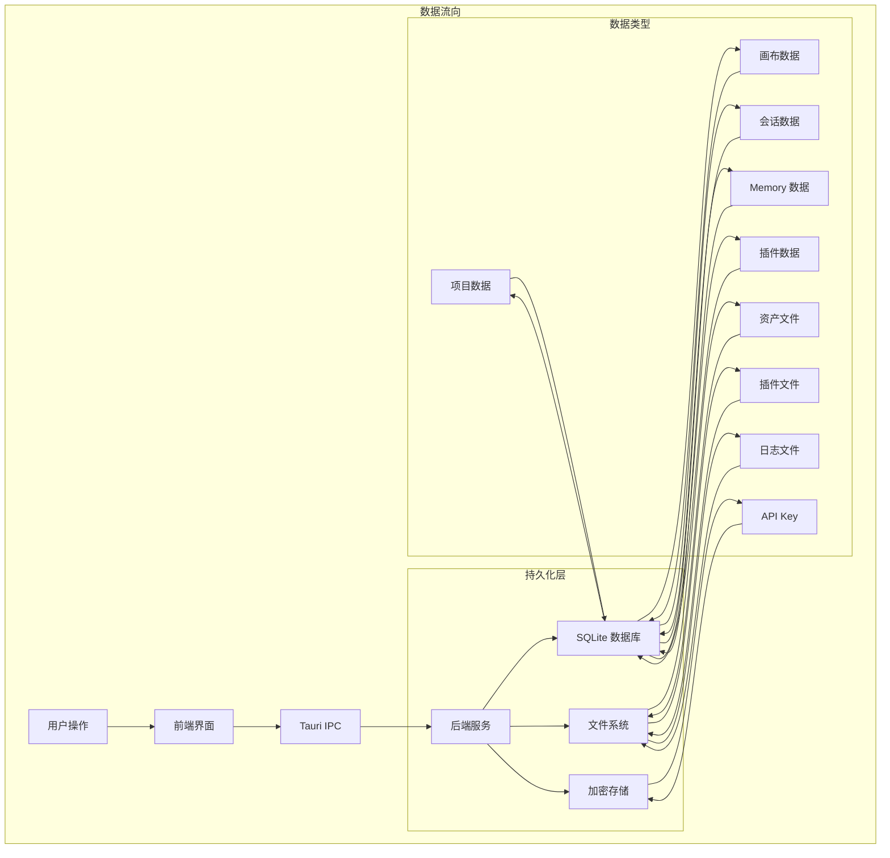
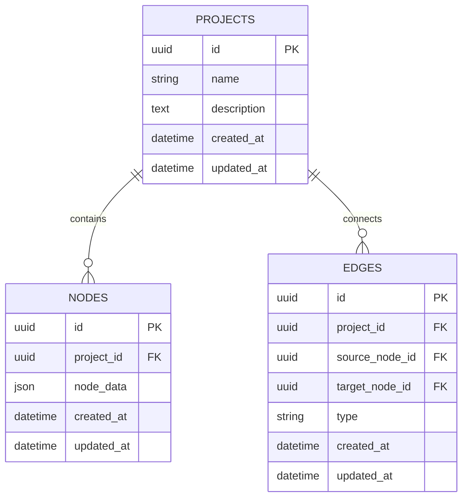
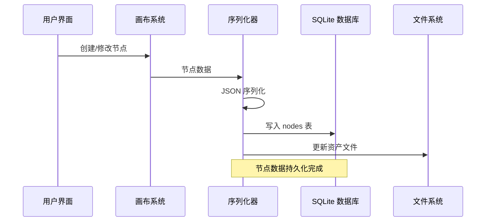
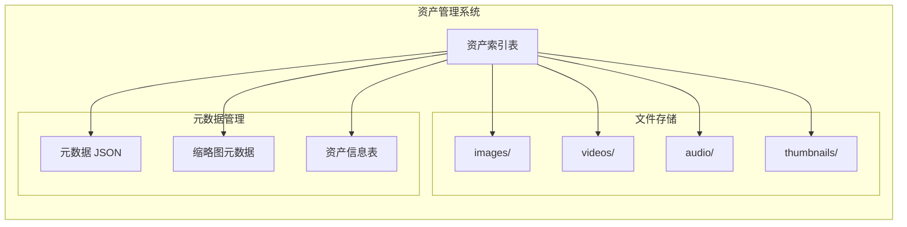
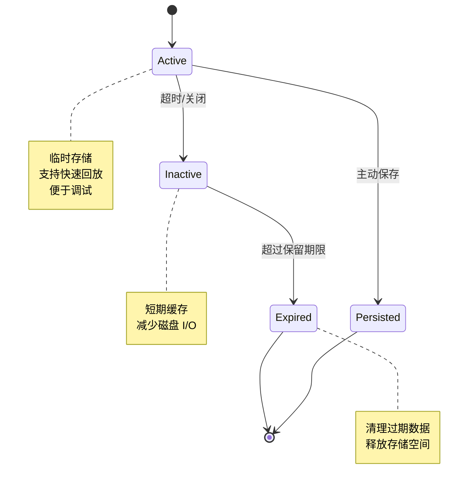
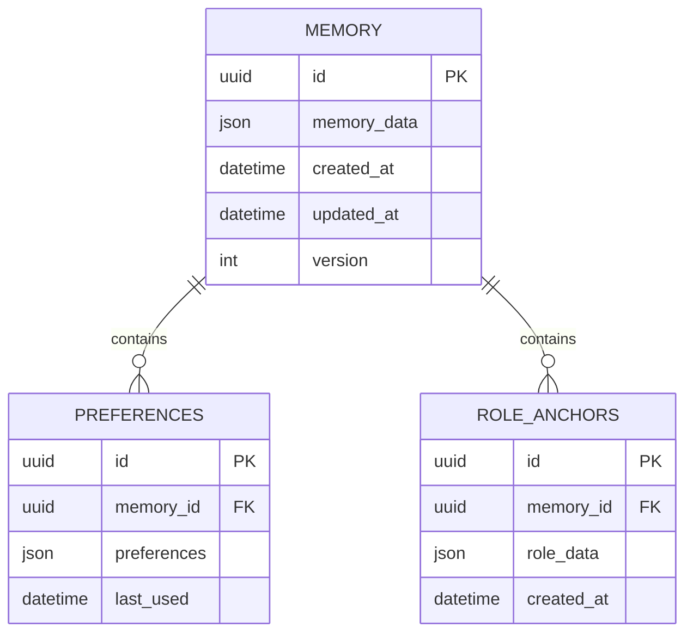
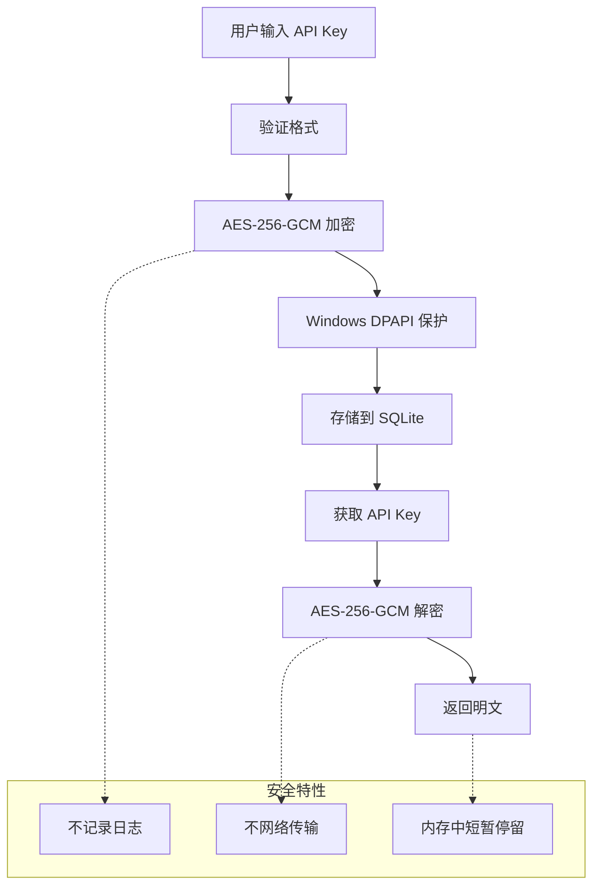
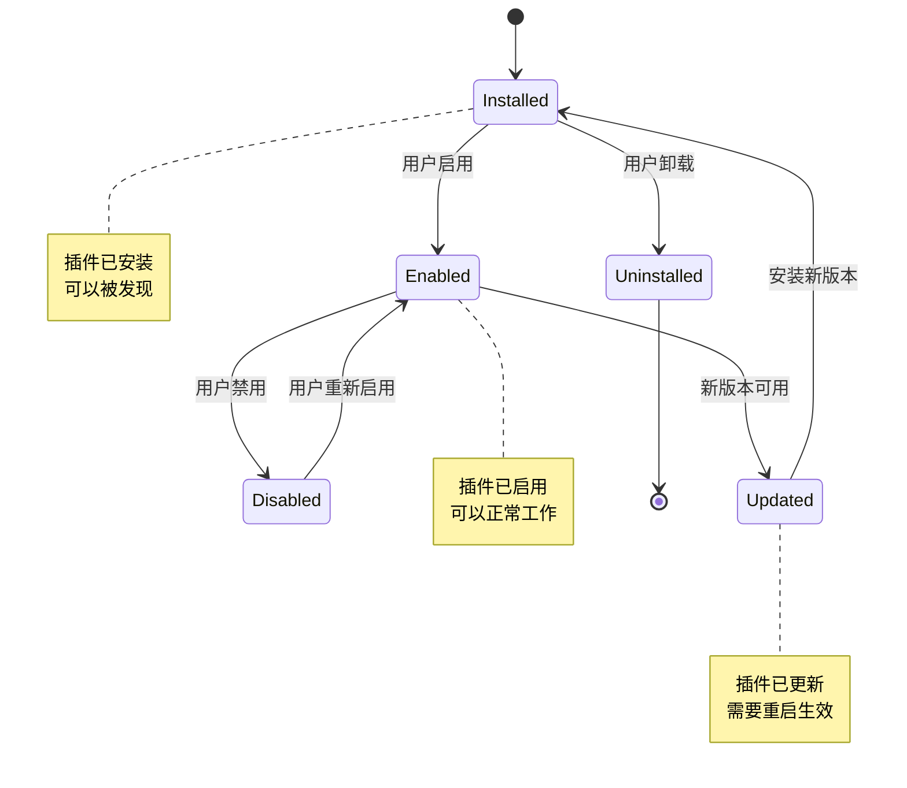
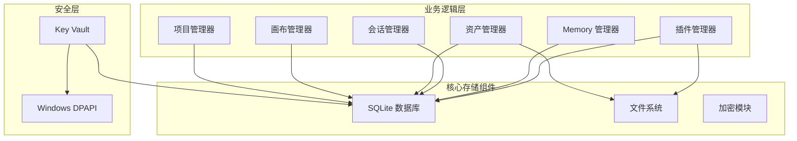

# 数据持久化策略

<cite>
**本文档引用的文件**
- [buzhidaozenmemingmin.md](file://buzhidaozenmemingmin.md)
</cite>

## 目录
1. [简介](#简介)
2. [项目结构](#项目结构)
3. [核心组件](#核心组件)
4. [架构概览](#架构概览)
5. [详细组件分析](#详细组件分析)
6. [依赖关系分析](#依赖关系分析)
7. [性能考虑](#性能考虑)
8. [故障排除指南](#故障排除指南)
9. [结论](#结论)

## 简介

Flower Age Video 是一款基于 Tauri 桌面框架的 AI 驱动无限画布创意工作站。本项目采用混合持久化策略，结合本地 SQLite 数据库存储、文件系统管理和内存缓存机制，为用户提供完整的数据持久化解决方案。

该系统的核心目标是在保证数据安全性的同时，提供高性能、可靠的本地存储能力，支持项目元信息、画布节点、资产索引、会话历史、Memory 和插件注册表等多种数据类型的持久化需求。

## 项目结构

基于设计文档，Flower Age Video 的数据持久化架构主要包含以下层次：

```mermaid
graph TB
subgraph "应用层"
Frontend[React 前端]
Backend[Rust 后端]
end
subgraph "存储层"
subgraph "本地数据库 (SQLite)"
Projects[projects 表<br/>项目元信息]
Nodes[nodes 表<br/>画布节点(JSON)]
Edges[edges 表<br/>画布连线]
Assets[assets 表<br/>资产索引]
Sessions[sessions 表<br/>会话历史]
Memory[memory 表<br/>Memory 持久化]
APIKeys[api_keys 表<br/>加密 API Key]
Settings[settings 表<br/>用户设置]
PluginRegistry[plugin_registry 表<br/>插件注册表]
end
subgraph "文件系统"
LocalAppData[%LOCALAPPDATA%\\FlowerAgeVideo]
AssetsDir[assets/<br/>生成资产]
PluginsDir[plugins/<br/>WASM 插件]
ProjectsDir[projects/<br/>项目导出]
LogsDir[logs/<br/>运行日志]
FFmpegDir[ffmpeg/<br/>ffmpeg 二进制]
end
end
Frontend --> Backend
Backend --> Projects
Backend --> Nodes
Backend --> Edges
Backend --> Assets
Backend --> Sessions
Backend --> Memory
Backend --> APIKeys
Backend --> Settings
Backend --> PluginRegistry
Backend --> AssetsDir
Backend --> PluginsDir
Backend --> ProjectsDir
Backend --> LogsDir
Backend --> FFmpegDir
```

**图表来源**
- [buzhidaozenmemingmin.md:512-545](file://buzhidaozenmemingmin.md#L512-L545)

**章节来源**
- [buzhidaozenmemingmin.md:512-545](file://buzhidaozenmemingmin.md#L512-L545)

## 核心组件

### 1. 本地数据库 (SQLite)

系统采用 SQLite 作为主要的数据存储引擎，通过 tauri-plugin-sql 插件实现跨平台兼容性。数据库文件位于用户本地应用数据目录中，确保数据的私密性和完整性。

#### 数据库表结构设计

| 表名 | 主要字段 | 用途 | 数据类型 |
|------|----------|------|----------|
| projects | id, name, description, created_at, updated_at | 项目元信息 | 文本/时间戳 |
| nodes | id, node_data, created_at, updated_at | 画布节点序列化 | JSON/文本 |
| edges | id, source, target, type, created_at | 节点关系链接 | 文本/时间戳 |
| assets | id, path, type, metadata, created_at | 资产索引 | 文本/JSON/时间戳 |
| sessions | id, session_data, created_at, expires_at | 会话历史 | JSON/时间戳 |
| memory | id, memory_data, created_at, updated_at | Memory 持久化 | JSON/时间戳 |
| api_keys | id, encrypted_key, provider, created_at | 加密 API Key | 文本/时间戳 |
| settings | id, setting_data, created_at | 用户设置 | JSON/时间戳 |
| plugin_registry | id, plugin_manifest, installed_at | 插件注册表 | JSON/时间戳 |

### 2. 文件系统管理

系统采用分层文件系统结构，将不同类型的数据存储在相应的目录中：

- **assets/**: 存储生成的媒体资产（images/videos/audio/thumbnails）
- **plugins/**: 存储已安装的 WASM 插件
- **projects/**: 存储项目导出文件
- **logs/**: 存储运行日志
- **ffmpeg/**: 存储 ffmpeg 二进制文件

### 3. 加密存储组件

API Key 采用双重加密策略：
- **AES-256-GCM**: 对 API Key 进行对称加密
- **Windows DPAPI**: 使用操作系统提供的密钥保护服务

**章节来源**
- [buzhidaozenmemingmin.md:512-545](file://buzhidaozenmemingmin.md#L512-L545)
- [buzhidaozenmemingmin.md:338-350](file://buzhidaozenmemingmin.md#L338-L350)

## 架构概览



**图表来源**
- [buzhidaozenmemingmin.md:354-472](file://buzhidaozenmemingmin.md#L354-L472)

## 详细组件分析

### 1. 项目元信息持久化

项目元信息存储在 `projects` 表中，包含项目的基本属性和时间戳信息。

#### 数据模型设计



**图表来源**
- [buzhidaozenmemingmin.md:518-520](file://buzhidaozenmemingmin.md#L518-L520)

#### 写入策略
- **事务处理**: 所有项目元信息变更都在 SQLite 事务中执行
- **并发控制**: 使用 SQLite 的 WAL 模式支持多进程并发访问
- **数据一致性**: 通过外键约束确保项目与其节点、连线的一致性

**章节来源**
- [buzhidaozenmemingmin.md:518-520](file://buzhidaozenmemingmin.md#L518-L520)

### 2. 画布节点序列化存储

画布节点采用 JSON 序列化存储，支持多种节点类型和复杂的数据结构。

#### 节点类型映射

| 节点类型 | 数据承载 | 存储格式 | 关系约束 |
|----------|----------|----------|----------|
| ProjectNode | 项目根节点 | JSON 对象 | 无 |
| TextNode | 文本/脚本 | Markdown 内容 | 无 |
| ImageNode | 图像资产 | 缩略图 + 提示词 + 模型 + 尺寸 | 资产索引 |
| VideoNode | 视频资产 | 预览帧 + 提示词 + 时长 + 分辨率 | 资产索引 |
| AudioNode | 音频资产 | 波形 + 时长 + 情绪标签 | 资产索引 |
| StoryboardNode | 分镜节点 | 镜头号 + 描述 + 时长 + 转场 | 无 |
| TaskNode | Agent 任务节点 | 任务状态 + 进度 + Agent 日志 | 无 |
| GroupNode | 分组容器 | 子节点集合 | 多对多关系 |

#### 序列化流程



**图表来源**
- [buzhidaozenmemingmin.md:226-237](file://buzhidaozenmemingmin.md#L226-L237)

**章节来源**
- [buzhidaozenmemingmin.md:226-237](file://buzhidaozenmemingmin.md#L226-L237)

### 3. 资产索引文件系统管理

资产索引采用文件系统 + 数据库的混合存储策略，确保大文件的高效管理和元数据的快速查询。

#### 资产存储架构



**图表来源**
- [buzhidaozenmemingmin.md:521](file://buzhidaozenmemingmin.md#L521)

#### 存储策略
- **文件系统**: 大型媒体文件直接存储在对应目录
- **数据库索引**: 轻量级元数据存储在 SQLite 中
- **缓存机制**: 频繁访问的资产建立内存缓存

**章节来源**
- [buzhidaozenmemingmin.md:521](file://buzhidaozenmemingmin.md#L521)

### 4. 会话历史临时存储

会话历史采用临时存储策略，平衡数据完整性和性能需求。

#### 会话生命周期管理



**图表来源**
- [buzhidaozenmemingmin.md:522](file://buzhidaozenmemingmin.md#L522)

#### 存储策略
- **临时性**: 默认短期存储，支持快速访问
- **可配置性**: 支持用户自定义保留期限
- **清理机制**: 自动清理过期会话数据

**章节来源**
- [buzhidaozenmemingmin.md:522](file://buzhidaozenmemingmin.md#L522)

### 5. Memory 长期持久化

Memory 系统负责用户偏好和角色锚点的长期存储，采用增量更新策略。

#### Memory 数据模型



**图表来源**
- [buzhidaozenmemingmin.md:523](file://buzhidaozenmemingmin.md#L523)

#### 持久化策略
- **增量更新**: 仅存储变化的部分，减少写入开销
- **版本控制**: 支持 Memory 数据的版本追踪
- **压缩存储**: 对历史数据进行压缩以节省空间

**章节来源**
- [buzhidaozenmemingmin.md:523](file://buzhidaozenmemingmin.md#L523)

### 6. API Key 加密存储

API Key 采用双重加密策略，确保敏感信息的安全性。

#### 加密存储架构



**图表来源**
- [buzhidaozenmemingmin.md:338-350](file://buzhidaozenmemingmin.md#L338-L350)

#### 安全机制
- **对称加密**: AES-256-GCM 算法确保数据机密性
- **系统保护**: Windows DPAPI 利用操作系统密钥管理
- **最小暴露**: 解密后的明文仅在内存中短暂停留

**章节来源**
- [buzhidaozenmemingmin.md:338-350](file://buzhidaozenmemingmin.md#L338-L350)

### 7. 插件注册表版本管理

插件注册表采用版本化管理策略，支持插件的安装、升级和卸载。

#### 插件生命周期管理



**图表来源**
- [buzhidaozenmemingmin.md:526](file://buzhidaozenmemingmin.md#L526)

#### 版本管理策略
- **语义化版本**: 支持主版本、次版本、补丁版本
- **兼容性检查**: 自动检测插件兼容性
- **回滚机制**: 支持版本回退

**章节来源**
- [buzhidaozenmemingmin.md:526](file://buzhidaozenmemingmin.md#L526)

## 依赖关系分析

### 1. 组件耦合度分析



**图表来源**
- [buzhidaozenmemingmin.md:37-38](file://buzhidaozenmemingmin.md#L37-L38)

### 2. 数据一致性保障

系统采用多层次的数据一致性保障机制：

#### 事务处理策略
- **ACID 事务**: 关键数据操作使用 SQLite 事务保证原子性
- **外键约束**: 通过数据库外键确保引用完整性
- **触发器机制**: 自动维护时间戳和版本信息

#### 并发控制机制
- **WAL 模式**: 使用 SQLite Write-Ahead Logging 支持并发读写
- **乐观锁**: Memory 数据采用版本号控制并发更新
- **文件锁**: 文件系统操作使用操作系统文件锁

**章节来源**
- [buzhidaozenmemingmin.md:37-38](file://buzhidaozenmemingmin.md#L37-L38)

## 性能考虑

### 1. 存储性能优化

#### 写入性能优化
- **批量写入**: 支持多条记录的批量插入和更新
- **延迟提交**: 对于非关键操作采用延迟提交策略
- **索引优化**: 为常用查询字段建立合适的索引

#### 读取性能优化
- **缓存策略**: 频繁访问的数据建立内存缓存
- **预加载机制**: 预加载相关联的数据减少查询次数
- **分页查询**: 大量数据采用分页查询避免内存溢出

### 2. 存储成本控制

#### 空间优化策略
- **数据压缩**: 对大文本和 JSON 数据进行压缩存储
- **归档机制**: 自动归档历史数据到低成本存储
- **清理策略**: 定期清理临时文件和过期数据

#### 成本监控
- **存储使用统计**: 实时监控各表的存储使用情况
- **增长趋势分析**: 分析数据增长趋势预测存储需求
- **自动扩容**: 根据使用情况自动调整存储配置

## 故障排除指南

### 1. 常见问题诊断

#### 数据库连接问题
- **症状**: 应用启动时报数据库连接错误
- **原因**: 数据库文件损坏或权限不足
- **解决**: 检查数据库文件完整性，修复文件权限

#### 文件系统访问问题
- **症状**: 资产文件无法读取或写入
- **原因**: 目录权限不足或磁盘空间不足
- **解决**: 检查目标目录权限和磁盘空间

#### 加密存储问题
- **症状**: API Key 无法正确解密
- **原因**: Windows DPAPI 服务异常或密钥损坏
- **解决**: 重置 API Key 或检查系统密钥服务

### 2. 数据恢复策略

#### 自动备份
- **定期备份**: 系统自动创建数据库备份文件
- **增量备份**: 仅备份自上次备份以来的变化
- **备份验证**: 自动验证备份文件的完整性

#### 手动恢复
- **数据库恢复**: 从备份文件恢复整个数据库
- **部分恢复**: 支持按表或按记录级别的恢复
- **版本回滚**: 支持恢复到之前的数据库版本

### 3. 故障转移机制

#### 冷备份
- **异地存储**: 将重要数据存储在多个位置
- **自动化切换**: 发生故障时自动切换到备用存储
- **数据同步**: 确保主备数据的实时同步

#### 降级策略
- **功能降级**: 在存储故障时降级部分功能
- **性能降级**: 减少存储操作频率以维持基本功能
- **数据降级**: 仅保留关键数据，暂时丢弃非关键数据

**章节来源**
- [buzhidaozenmemingmin.md:512-545](file://buzhidaozenmemingmin.md#L512-L545)

## 结论

Flower Age Video 的数据持久化策略采用了混合存储架构，结合了关系数据库的结构化存储优势和文件系统的高效大文件处理能力。通过合理的数据分层、多重加密保护和完善的备份恢复机制，系统能够在保证数据安全性的同时，提供高性能、可靠的数据持久化服务。

该策略的主要优势包括：
- **安全性**: 采用双重加密保护敏感数据
- **可靠性**: 多层次备份和故障转移机制
- **性能**: 混合存储架构优化不同数据类型的访问效率
- **可维护性**: 清晰的数据分层和版本管理
- **扩展性**: 支持未来功能的平滑扩展

通过持续的性能监控和优化，该持久化策略能够满足 Flower Age Video 作为专业创意工具的需求，为用户提供稳定可靠的数据存储体验。