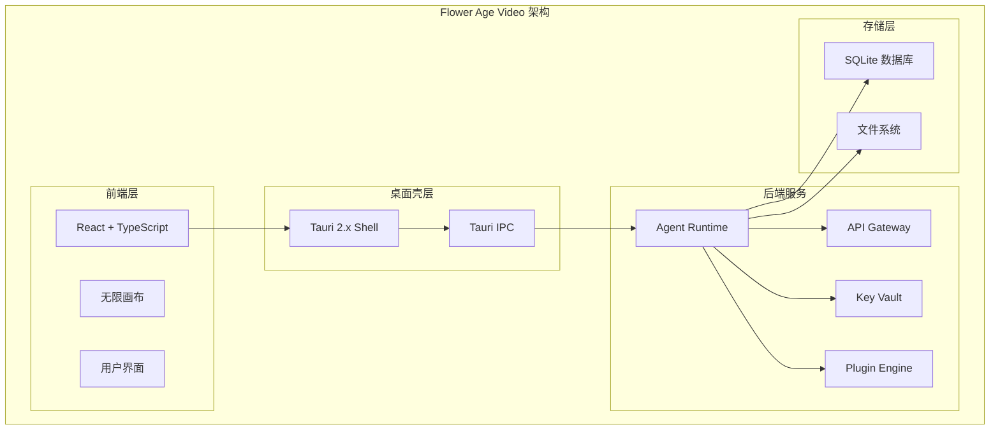
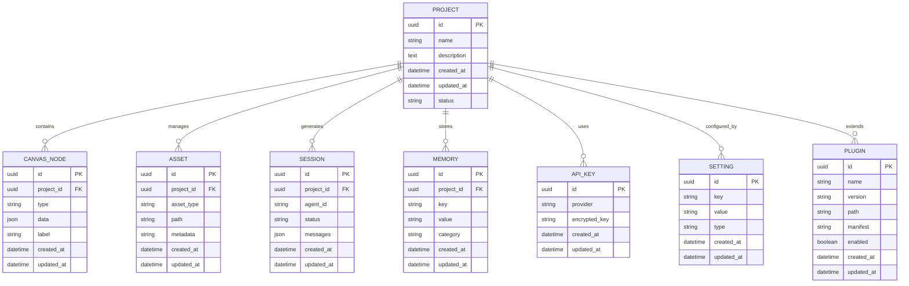
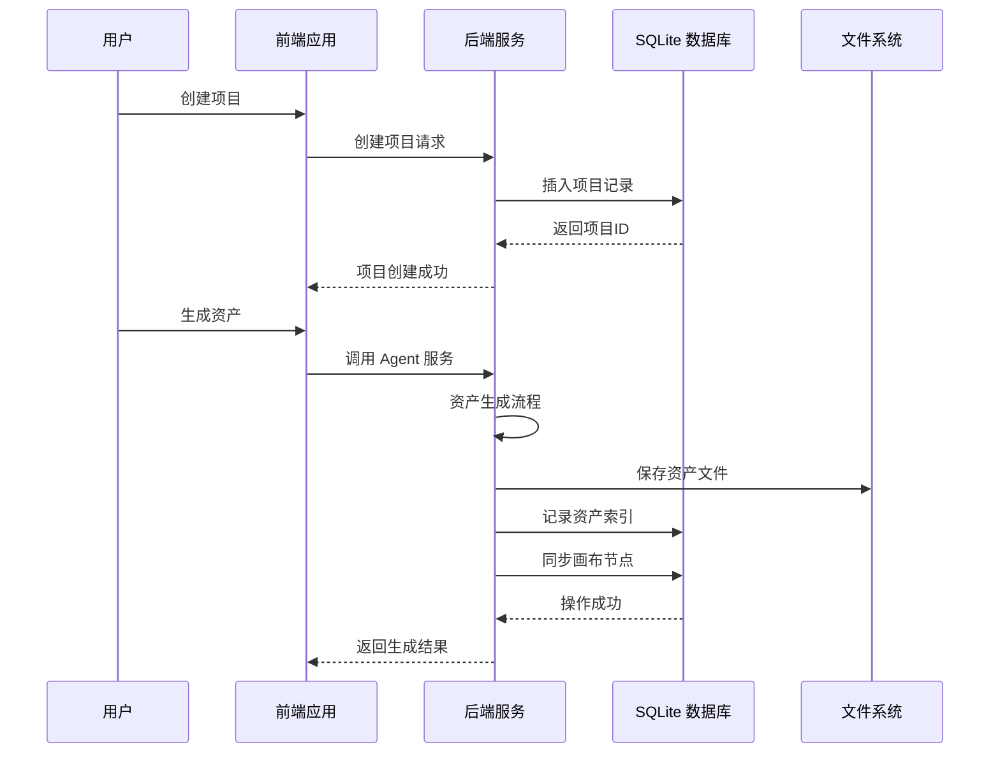
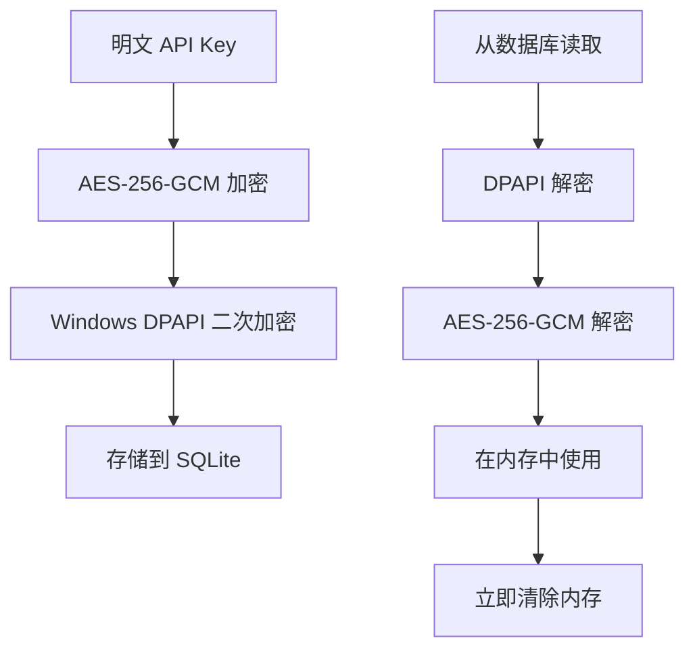
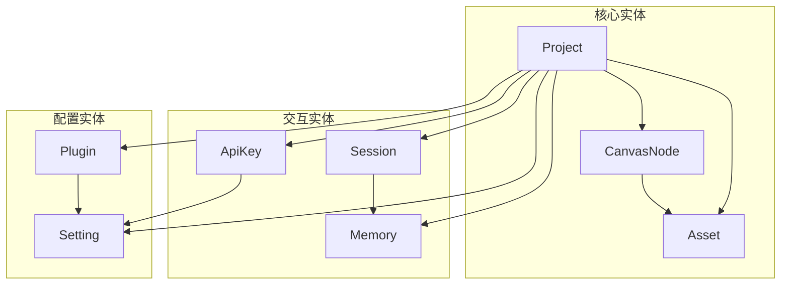

# 数据模型定义

<cite>
**本文引用的文件**
- [buzhidaozenmemingmin.md](file://buzhidaozenmemingmin.md)
</cite>

## 目录
1. [简介](#简介)
2. [项目结构](#项目结构)
3. [核心数据模型](#核心数据模型)
4. [架构概览](#架构概览)
5. [详细模型分析](#详细模型分析)
6. [依赖关系分析](#依赖关系分析)
7. [性能考量](#性能考量)
8. [故障排查指南](#故障排查指南)
9. [结论](#结论)
10. [附录](#附录)

## 简介
Flower Age Video 是一款基于 Tauri 桌面框架的 AI 驱动无限画布创意工作站。该项目采用 SQLite 作为本地持久化存储，实现了完整的项目管理、画布节点、资产管理和会话记忆系统。本文档详细阐述了项目中涉及的核心数据模型，包括 Project（项目）、CanvasNode（画布节点）、Asset（资产）、Session（会话）、Memory（记忆）、ApiKey（API密钥）、Setting（设置）、Plugin（插件）等实体的数据结构、字段定义、验证规则和业务约束。

## 项目结构
基于设计文档，Flower Age Video 采用前后端分离的架构设计，后端使用 Rust 实现，前端使用 React + TypeScript。数据存储采用 SQLite 数据库，所有数据均在本地持久化保存。



**图表来源**
- [buzhidaozenmemingmin.md:357-472](file://buzhidaozenmemingmin.md#L357-L472)

**章节来源**
- [buzhidaozenmemingmin.md:357-472](file://buzhidaozenmemingmin.md#L357-L472)

## 核心数据模型
根据设计文档，Flower Age Video 的数据模型主要围绕以下核心实体构建：

### 数据库表结构概览
项目采用 SQLite 作为本地存储，包含以下核心表结构：

- **projects** - 项目元信息表
- **nodes** - 画布节点表（JSON 格式存储）
- **edges** - 画布连线表
- **assets** - 资产索引表
- **sessions** - Agent 会话历史表
- **memory** - Memory 持久化表
- **api_keys** - 加密的 API Key 表
- **settings** - 用户设置表
- **plugin_registry** - 插件注册表

**章节来源**
- [buzhidaozenmemingmin.md:517-527](file://buzhidaozenmemingmin.md#L517-L527)

## 架构概览
Flower Age Video 的数据模型设计体现了以下核心原则：

### 存储架构


**图表来源**
- [buzhidaozenmemingmin.md:517-527](file://buzhidaozenmemingmin.md#L517-L527)

### 数据流架构


**图表来源**
- [buzhidaozenmemingmin.md:66-83](file://buzhidaozenmemingmin.md#L66-L83)

## 详细模型分析

### Project（项目）模型
Project 模型代表用户创建的创意项目，是整个数据模型的根实体。

#### 字段定义
| 字段名 | 数据类型 | 必填 | 默认值 | 说明 |
|--------|----------|------|--------|------|
| id | UUID | 是 | 自动生成 | 项目唯一标识符 |
| name | String | 是 | 无 | 项目名称，最大长度 255 字符 |
| description | Text | 否 | 空字符串 | 项目描述信息 |
| created_at | DateTime | 是 | 当前时间 | 项目创建时间戳 |
| updated_at | DateTime | 是 | 当前时间 | 项目最后更新时间 |
| status | String | 是 | "active" | 项目状态（active/archived/deleted） |

#### 验证规则
- 名称必须唯一且不超过 255 字符
- 状态必须为预定义枚举值之一
- 时间戳自动维护，禁止手动修改

#### 业务约束
- 项目删除时，关联的所有子实体应级联删除
- 项目状态变更需要权限验证
- 同一用户可拥有多个项目

**章节来源**
- [buzhidaozenmemingmin.md:518](file://buzhidaozenmemingmin.md#L518)

### CanvasNode（画布节点）模型
CanvasNode 模型用于表示无限画布上的各种节点类型，支持多种节点类型和复杂的数据结构。

#### 节点类型定义
| 节点类型 | 用途 | 数据承载 |
|----------|------|----------|
| ProjectNode | 项目根节点 | 项目名称/描述/创建时间 |
| TextNode | 文本/脚本/创意 | Markdown 内容 |
| ImageNode | 图像资产 | 缩略图 + 提示词 + 模型 + 尺寸 |
| VideoNode | 视频资产 | 预览帧 + 提示词 + 时长 + 分辨率 |
| AudioNode | 音频资产 | 波形 + 时长 + 情绪标签 |
| StoryboardNode | 分镜节点 | 镜头号 + 描述 + 时长 + 转场 |
| TaskNode | Agent 任务节点 | 任务状态 + 进度 + Agent 日志 |
| GroupNode | 分组容器 | 子节点集合 |

#### 字段定义
| 字段名 | 数据类型 | 必填 | 默认值 | 说明 |
|--------|----------|------|--------|------|
| id | UUID | 是 | 自动生成 | 节点唯一标识符 |
| project_id | UUID | 是 | 无 | 所属项目ID |
| type | String | 是 | 无 | 节点类型（ProjectNode/TextNode/ImageNode等） |
| data | JSON | 是 | 空对象 | 节点特定数据，根据类型而定 |
| label | String | 否 | 空字符串 | 节点显示标签 |
| created_at | DateTime | 是 | 当前时间 | 节点创建时间戳 |
| updated_at | DateTime | 是 | 当前时间 | 节点最后更新时间 |

#### 数据结构示例
```json
{
  "id": "uuid",
  "project_id": "uuid",
  "type": "ImageNode",
  "data": {
    "thumbnail": "/path/to/thumbnail.jpg",
    "prompt": "beautiful landscape",
    "model": "Stable Diffusion XL",
    "width": 1024,
    "height": 768
  },
  "label": "风景图像",
  "created_at": "2026-05-18T10:30:00Z",
  "updated_at": "2026-05-18T10:30:00Z"
}
```

#### 验证规则
- 节点类型必须在预定义列表中
- JSON 数据必须符合对应类型的结构要求
- 项目ID必须存在且有效

**章节来源**
- [buzhidaozenmemingmin.md:228-237](file://buzhidaozenmemingmin.md#L228-L237)

### Asset（资产）模型
Asset 模型用于管理项目中生成的各种媒体资产，包括图像、视频、音频等。

#### 资产类型定义
| 资产类型 | 文件扩展名 | 用途 |
|----------|------------|------|
| image | .jpg, .png, .webp | 图像资产 |
| video | .mp4, .mov, .avi | 视频资产 |
| audio | .mp3, .wav, .flac | 音频资产 |
| text | .txt, .md | 文本资产 |
| thumbnail | .jpg, .png | 缩略图 |

#### 字段定义
| 字段名 | 数据类型 | 必填 | 默认值 | 说明 |
|--------|----------|------|--------|------|
| id | UUID | 是 | 自动生成 | 资产唯一标识符 |
| project_id | UUID | 是 | 无 | 所属项目ID |
| asset_type | String | 是 | 无 | 资产类型（image/video/audio/text） |
| path | String | 是 | 无 | 资产文件在文件系统中的路径 |
| metadata | JSON | 否 | 空对象 | 资产元数据（尺寸、时长、标签等） |
| created_at | DateTime | 是 | 当前时间 | 资产创建时间戳 |
| updated_at | DateTime | 是 | 当前时间 | 资产最后更新时间 |

#### 元数据结构示例
```json
{
  "size": 1048576,
  "width": 1920,
  "height": 1080,
  "duration": 120.5,
  "tags": ["landscape", "nature", "sunset"],
  "prompt": "beautiful sunset over mountains",
  "model": "Stable Diffusion XL"
}
```

#### 验证规则
- 文件路径必须存在且可访问
- 元数据必须符合资产类型的标准格式
- 资产类型必须与文件扩展名匹配

**章节来源**
- [buzhidaozenmemingmin.md:521](file://buzhidaozenmemingmin.md#L521)

### Session（会话）模型
Session 模型用于记录 Agent 交互的历史会话，支持多轮对话和任务执行跟踪。

#### 字段定义
| 字段名 | 数据类型 | 必填 | 默认值 | 说明 |
|--------|----------|------|--------|------|
| id | UUID | 是 | 自动生成 | 会话唯一标识符 |
| project_id | UUID | 是 | 无 | 所属项目ID |
| agent_id | String | 是 | 无 | Agent 标识符 |
| status | String | 是 | "active" | 会话状态（active/completed/failed/cancelled） |
| messages | JSON Array | 是 | 空数组 | 会话消息历史，包含用户输入和Agent响应 |
| created_at | DateTime | 是 | 当前时间 | 会话创建时间戳 |
| updated_at | DateTime | 是 | 当前时间 | 会话最后更新时间 |

#### 消息结构示例
```json
[
  {
    "role": "user",
    "content": "生成一个美丽的风景图像",
    "timestamp": "2026-05-18T10:30:00Z"
  },
  {
    "role": "assistant",
    "content": "正在为您生成图像，请稍候...",
    "timestamp": "2026-05-18T10:30:05Z"
  }
]
```

#### 验证规则
- Agent ID 必须存在于系统中
- 消息数组必须包含至少一条用户消息
- 状态必须为预定义枚举值之一

**章节来源**
- [buzhidaozenmemingmin.md:522](file://buzhidaozenmemingmin.md#L522)

### Memory（记忆）模型
Memory 模型用于持久化用户的偏好设置、角色锚点和其他长期记忆信息。

#### 字段定义
| 字段名 | 数据类型 | 必填 | 默认值 | 说明 |
|--------|----------|------|--------|------|
| id | UUID | 是 | 自动生成 | 记忆唯一标识符 |
| project_id | UUID | 是 | 无 | 所属项目ID |
| key | String | 是 | 无 | 记忆键名 |
| value | String | 是 | 无 | 记忆值（JSON格式） |
| category | String | 否 | "general" | 记忆分类（偏好/角色锚点/风格等） |
| created_at | DateTime | 是 | 当前时间 | 记忆创建时间戳 |
| updated_at | DateTime | 是 | 当前时间 | 记忆最后更新时间 |

#### 记忆分类
| 分类 | 用途 | 示例 |
|------|------|------|
| preference | 用户偏好设置 | 颜色偏好、风格偏好、模型偏好 |
| role_anchor | 角色锚点 | 角色特征、外观描述、行为模式 |
| style | 创作风格 | 艺术风格、色彩理论、构图原则 |
| general | 一般记忆 | 临时信息、备注、标签 |

#### 验证规则
- 键名必须唯一且不超过 100 字符
- 值必须为有效的 JSON 格式
- 分类必须为预定义类别之一

**章节来源**
- [buzhidaozenmemingmin.md:523](file://buzhidaozenmemingmin.md#L523)

### ApiKey（API密钥）模型
ApiKey 模型用于安全地存储用户配置的云端 API 密钥，采用加密存储机制。

#### 字段定义
| 字段名 | 数据类型 | 必填 | 默认值 | 说明 |
|--------|----------|------|--------|------|
| id | UUID | 是 | 自动生成 | API Key 唯一标识符 |
| provider | String | 是 | 无 | AI 供应商名称（OpenAI/Anthropic等） |
| encrypted_key | String | 是 | 无 | 加密后的 API Key |
| created_at | DateTime | 是 | 当前时间 | 密钥创建时间戳 |
| updated_at | DateTime | 是 | 当前时间 | 密钥最后更新时间 |

#### 加密机制


**图表来源**
- [buzhidaozenmemingmin.md:340-350](file://buzhidaozenmemingmin.md#L340-L350)

#### 验证规则
- 供应商必须在支持列表中
- 加密密钥长度必须符合要求
- 解密过程必须在内存中进行，禁止写入日志

**章节来源**
- [buzhidaozenmemingmin.md:524](file://buzhidaozenmemingmin.md#L524)

### Setting（设置）模型
Setting 模型用于存储用户的应用偏好设置和系统配置。

#### 字段定义
| 字段名 | 数据类型 | 必填 | 默认值 | 说明 |
|--------|----------|------|--------|------|
| id | UUID | 是 | 自动生成 | 设置项唯一标识符 |
| key | String | 是 | 无 | 设置键名 |
| value | String | 是 | 无 | 设置值（JSON格式） |
| type | String | 是 | "string" | 设置类型（string/number/boolean/object） |
| created_at | DateTime | 是 | 当前时间 | 设置创建时间戳 |
| updated_at | DateTime | 是 | 当前时间 | 设置最后更新时间 |

#### 设置类型
| 类型 | 用途 | 示例值 |
|------|------|--------|
| string | 文本设置 | "default" |
| number | 数值设置 | 42 |
| boolean | 布尔设置 | true/false |
| object | 复杂对象 | JSON 对象 |

#### 验证规则
- 键名必须唯一且不超过 100 字符
- 值必须符合类型要求
- 类型必须为预定义类型之一

**章节来源**
- [buzhidaozenmemingmin.md:525](file://buzhidaozenmemingmin.md#L525)

### Plugin（插件）模型
Plugin 模型用于管理用户安装的 WASM 插件，支持热加载和版本管理。

#### 字段定义
| 字段名 | 数据类型 | 必填 | 默认值 | 说明 |
|--------|----------|------|--------|------|
| id | UUID | 是 | 自动生成 | 插件唯一标识符 |
| name | String | 是 | 无 | 插件名称 |
| version | String | 是 | 无 | 插件版本号 |
| path | String | 是 | 无 | 插件文件路径 |
| manifest | JSON | 是 | 空对象 | 插件清单信息 |
| enabled | Boolean | 是 | false | 插件是否启用 |
| created_at | DateTime | 是 | 当前时间 | 插件安装时间戳 |
| updated_at | DateTime | 是 | 当前时间 | 插件最后更新时间 |

#### 插件清单结构
```json
{
  "name": "flowerage-plugin-example",
  "version": "1.0.0",
  "description": "示例插件",
  "author": "Flower Age Video Team",
  "license": "MIT",
  "dependencies": {
    "rust": ">=1.60.0",
    "wasmtime": ">=10.0.0"
  },
  "capabilities": ["image-generation", "video-processing"],
  "entry_point": "index.wasm"
}
```

#### 验证规则
- 插件名称必须唯一且不超过 100 字符
- 版本号必须符合语义化版本规范
- 插件文件必须存在且可加载
- 清单信息必须完整且有效

**章节来源**
- [buzhidaozenmemingmin.md:526](file://buzhidaozenmemingmin.md#L526)

## 依赖关系分析
数据模型之间的依赖关系体现了清晰的层次结构和业务逻辑约束。



**图表来源**
- [buzhidaozenmemingmin.md:517-527](file://buzhidaozenmemingmin.md#L517-L527)

### 外部依赖
- **SQLite**：嵌入式数据库，提供 ACID 事务保证
- **Windows DPAPI**：系统级加密服务，提供额外的安全保护
- **AES-256-GCM**：对称加密算法，确保数据机密性
- **Tauri IPC**：前后端通信机制，支持类型安全的数据传递

**章节来源**
- [buzhidaozenmemingmin.md:114-125](file://buzhidaozenmemingmin.md#L114-L125)

## 性能考量
基于设计文档中的技术栈，数据模型在性能方面具有以下特点：

### 存储性能
- **SQLite 优化**：使用合适的索引策略，特别是针对 UUID 和时间戳字段
- **JSON 存储**：CanvasNode 和 Asset 的 JSON 字段便于灵活扩展
- **文件系统分离**：大文件直接存储在文件系统，数据库仅存索引

### 查询性能
- **层级查询**：通过 project_id 字段实现高效的项目内查询
- **时间范围查询**：支持按创建时间范围筛选
- **类型过滤**：通过 asset_type 和 node_type 字段快速过滤

### 内存管理
- **加密密钥**：API Key 在内存中短暂存储，使用后立即清理
- **批量操作**：支持批量插入和更新操作
- **连接池**：SQLite 连接复用，减少连接开销

## 故障排查指南
### 常见问题及解决方案

#### 数据库连接问题
- **症状**：应用启动时报数据库连接错误
- **原因**：数据库文件损坏或权限不足
- **解决**：检查数据库文件完整性，确保应用程序有读写权限

#### 数据加密问题
- **症状**：API Key 无法解密或解密失败
- **原因**：Windows DPAPI 环境异常或密钥损坏
- **解决**：重新配置 API Key，检查系统加密服务状态

#### 文件系统问题
- **症状**：资产文件丢失或无法访问
- **原因**：文件路径错误或磁盘空间不足
- **解决**：检查文件路径配置，清理磁盘空间

#### 性能问题
- **症状**：查询响应缓慢或内存占用过高
- **原因**：缺少必要的数据库索引或缓存不足
- **解决**：添加适当的索引，优化查询语句

**章节来源**
- [buzhidaozenmemingmin.md:338-350](file://buzhidaozenmemingmin.md#L338-L350)

## 结论
Flower Age Video 的数据模型设计体现了现代桌面应用的最佳实践，通过 SQLite 本地存储、加密安全机制和灵活的 JSON 结构，实现了功能丰富且性能优异的数据管理方案。八个核心数据模型相互配合，形成了完整的创意工作流数据支撑体系。

### 设计优势
- **安全性**：API Key 加密存储，防止敏感信息泄露
- **扩展性**：JSON 字段支持灵活的数据结构扩展
- **性能**：合理的索引设计和文件系统分离
- **可靠性**：SQLite ACID 事务保证数据一致性

### 技术创新
- **本地化**：完全本地化的数据处理，无需云端依赖
- **隐私保护**：用户数据始终保留在本地设备上
- **零依赖**：无需额外运行时环境，降低部署复杂度

## 附录

### 数据模型演进策略
基于设计文档中的技术栈和架构，建议采用以下演进策略：

#### 向后兼容性考虑
- **版本化存储**：为每个数据模型添加版本字段
- **渐进式迁移**：通过迁移脚本逐步更新现有数据
- **默认值策略**：为新增字段提供合理的默认值

#### 扩展性设计
- **插件化架构**：支持通过插件扩展新的数据模型
- **配置驱动**：通过配置文件控制数据模型的行为
- **接口抽象**：定义清晰的接口契约，便于替换实现

#### 数据完整性保证
- **约束检查**：在数据库层面实施严格的约束
- **事务管理**：使用事务确保批量操作的一致性
- **备份策略**：定期备份数据库，防止数据丢失

**章节来源**
- [buzhidaozenmemingmin.md:512-545](file://buzhidaozenmemingmin.md#L512-L545)