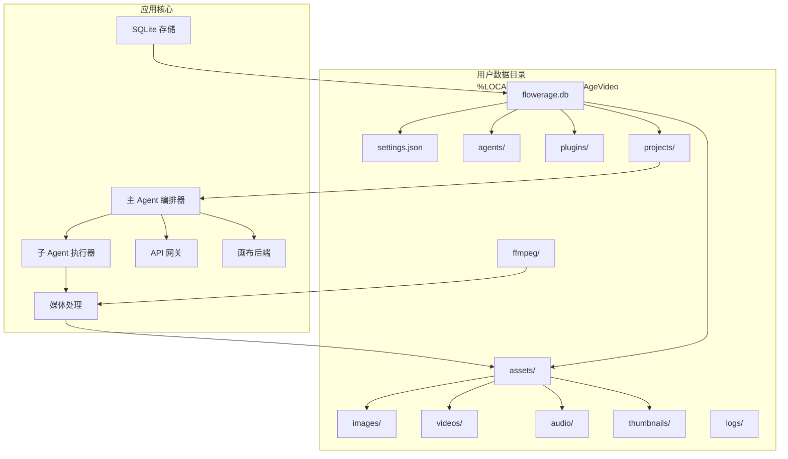

# 文件系统布局

<cite>
**本文引用的文件**
- [buzhidaozenmemingmin.md](file://buzhidaozenmemingmin.md)
</cite>

## 目录
1. [简介](#简介)
2. [项目结构](#项目结构)
3. [核心组件](#核心组件)
4. [架构总览](#架构总览)
5. [详细组件分析](#详细组件分析)
6. [依赖分析](#依赖分析)
7. [性能考虑](#性能考虑)
8. [故障排查指南](#故障排查指南)
9. [结论](#结论)
10. [附录](#附录)

## 简介
本文件系统布局文档面向 Flower Age Video 的本地数据与资源组织，聚焦于 Windows 平台下应用的用户数据目录：%LOCALAPPDATA%\FlowerAgeVideo\。该目录是应用运行时的核心存储位置，包含数据库、用户设置、生成资产、项目导出、日志以及媒体处理工具等。本文将系统阐述各子目录的职责、文件组织方式、命名规范、访问权限与安全策略，并给出路径解析示例、备份与清理建议及磁盘空间管理策略。

## 项目结构
以下为应用在 Windows 上的用户数据目录结构概览，该结构由安装流程与存储设计共同决定：
- %LOCALAPPDATA%\FlowerAgeVideo\
  - flowerage.db：SQLite 本地数据库，用于存储项目、画布节点、资产索引、会话历史、Memory、API Key、用户设置与插件注册信息。
  - settings.json：非敏感设置的 JSON 配置文件。
  - agents/：用户自定义 Agent 系统提示词（SP）存放目录。
  - plugins/：用户安装的 WASM 插件目录。
  - assets/：生成资产的统一存储目录，按媒体类型进一步细分：
    - images/：图像资产
    - videos/：视频资产
    - audio/：音频资产
    - thumbnails/：缩略图
  - projects/：项目导出产物目录。
  - logs/：运行日志目录。
  - ffmpeg/：ffmpeg 二进制文件目录（首次启动时自动下载）。

上述结构与安装流程密切相关：安装程序默认将应用安装至 %LOCALAPPDATA%\FlowerAgeVideo，并在首次启动时自动下载运行时依赖（如 ffmpeg），同时创建上述目录以满足运行与持久化需求。

章节来源
- [buzhidaozenmemingmin.md:487-498](file://buzhidaozenmemingmin.md#L487-L498)
- [buzhidaozenmemingmin.md:529-545](file://buzhidaozenmemingmin.md#L529-L545)

## 核心组件
- SQLite 数据库（flowerage.db）
  - 作用：集中存储项目元信息、画布节点与连线、资产索引、会话历史、Memory、API Key、用户设置与插件注册信息。
  - 关系：与 assets/、projects/ 等目录配合，形成“索引 + 存储”的分离架构。
- settings.json
  - 作用：保存非敏感用户设置，便于快速读取与跨会话恢复。
- agents/
  - 作用：存放用户自定义 Agent SP 文件，便于扩展与个性化。
- plugins/
  - 作用：存放用户安装的 WASM 插件，支持热加载与沙箱隔离。
- assets/
  - images/：图像生成产物
  - videos/：视频生成产物
  - audio/：音频生成产物
  - thumbnails/：缩略图缓存，加速浏览与预览
- projects/
  - 作用：项目导出目录，存放最终可交付的成品或中间产物。
- logs/
  - 作用：运行日志，便于问题诊断与审计。
- ffmpeg/
  - 作用：ffmpeg 二进制文件目录，首次启动时自动下载并放置于此。

章节来源
- [buzhidaozenmemingmin.md:514-527](file://buzhidaozenmemingmin.md#L514-L527)
- [buzhidaozenmemingmin.md:529-545](file://buzhidaozenmemingmin.md#L529-L545)

## 架构总览
下图展示了用户数据目录与应用核心模块之间的关系，体现“索引 + 存储 + 工具”的分层设计。

图表来源
- [buzhidaozenmemingmin.md:27-50](file://buzhidaozenmemingmin.md#L27-L50)
- [buzhidaozenmemingmin.md:514-527](file://buzhidaozenmemingmin.md#L514-L527)
- [buzhidaozenmemingmin.md:529-545](file://buzhidaozenmemingmin.md#L529-L545)

## 详细组件分析

### 数据库层（flowerage.db）
- 数据模型要点
  - projects：项目元信息
  - nodes：画布节点（JSON）
  - edges：画布连线
  - assets：资产索引（路径/缩略图/元数据）
  - sessions：Agent 会话历史
  - memory：Memory 持久化（用户偏好/角色锚点）
  - api_keys：加密的 API Key
  - settings：用户设置
  - plugin_registry：已安装插件
- 存储策略
  - 以表为单位进行结构化存储，结合 assets/ 的文件路径建立“索引 + 文件”映射。
  - settings.json 与 settings 表互补：前者用于快速读取非敏感配置，后者用于持久化用户设置。
- 访问权限
  - 作为本地 SQLite 文件，应遵循最小权限原则，仅允许当前用户进程访问。
  - 建议在备份与迁移时关闭应用，避免并发写入导致损坏。

章节来源
- [buzhidaozenmemingmin.md:514-527](file://buzhidaozenmemingmin.md#L514-L527)

### 资产目录（assets/）
- images/
  - 作用：存放图像生成产物
  - 命名规范：建议采用“任务ID_时间戳_描述”的命名策略，便于检索与去重。
- videos/
  - 作用：存放视频生成产物
  - 命名规范：建议包含分辨率、时长等关键信息，便于后续编辑与导出。
- audio/
  - 作用：存放音频生成产物
  - 命名规范：建议包含采样率、声道等参数，便于混音与同步。
- thumbnails/
  - 作用：缩略图缓存，加速浏览与预览
  - 命名规范：与源资产同名或同前缀，便于索引与清理。
- 存储策略
  - 采用“索引 + 文件”分离：数据库记录路径与元数据，实际文件落盘到 assets/ 下对应子目录。
  - 建议定期扫描重复文件，启用去重与压缩策略（如适用）。
- 访问权限
  - 仅允许当前用户读写；避免跨用户共享，防止权限冲突。

章节来源
- [buzhidaozenmemingmin.md:529-545](file://buzhidaozenmemingmin.md#L529-L545)

### 项目导出（projects/）
- 作用：存放项目导出产物，便于分享与归档。
- 命名规范：建议使用“项目名_版本_时间戳”命名，便于版本管理与回溯。
- 存储策略：建议按项目维度建立子目录，避免根目录文件过多影响性能。
- 访问权限：仅当前用户可读写。

章节来源
- [buzhidaozenmemingmin.md:529-545](file://buzhidaozenmemingmin.md#L529-L545)

### 日志（logs/）
- 作用：记录运行时日志，便于问题诊断与审计。
- 命名规范：建议按日期或会话编号命名，例如“YYYY-MM-DD.log”或“session_001.log”。
- 清理策略：建议保留最近 N 天的日志，超过阈值自动删除或压缩归档。
- 访问权限：仅当前用户可读写。

章节来源
- [buzhidaozenmemingmin.md:529-545](file://buzhidaozenmemingmin.md#L529-L545)

### ffmpeg（ffmpeg/）
- 作用：ffmpeg 二进制文件目录，首次启动时自动下载。
- 命名规范：保持二进制文件名不变，便于调用与版本管理。
- 存储策略：建议与应用安装目录分离，便于卸载与重装时独立管理。
- 访问权限：仅当前用户可读写。

章节来源
- [buzhidaozenmemingmin.md:487-498](file://buzhidaozenmemingmin.md#L487-L498)
- [buzhidaozenmemingmin.md:529-545](file://buzhidaozenmemingmin.md#L529-L545)

### 用户设置（settings.json）
- 作用：保存非敏感用户设置，如界面主题、语言、默认模型等。
- 命名规范：遵循 JSON 格式，键名语义清晰，便于解析与迁移。
- 存储策略：建议与数据库 settings 表保持一致，避免重复与冲突。
- 访问权限：仅当前用户可读写。

章节来源
- [buzhidaozenmemingmin.md:514-527](file://buzhidaozenmemingmin.md#L514-L527)
- [buzhidaozenmemingmin.md:529-545](file://buzhidaozenmemingmin.md#L529-L545)

### 用户自定义 Agent SP（agents/）
- 作用：存放用户自定义 Agent 系统提示词（SP），便于扩展与个性化。
- 命名规范：建议采用“agent-id.md”命名，便于索引与加载。
- 存储策略：建议与数据库中的 SP 模板保持版本一致，便于回滚与升级。
- 访问权限：仅当前用户可读写。

章节来源
- [buzhidaozenmemingmin.md:529-545](file://buzhidaozenmemingmin.md#L529-L545)

### WASM 插件（plugins/）
- 作用：存放用户安装的 WASM 插件，支持热加载与沙箱隔离。
- 命名规范：建议采用“插件名.wasm”命名，便于识别与管理。
- 存储策略：建议与数据库 plugin_registry 保持一致，便于启用/禁用与卸载。
- 访问权限：仅当前用户可读写。

章节来源
- [buzhidaozenmemingmin.md:529-545](file://buzhidaozenmemingmin.md#L529-L545)

## 依赖分析
- 目录耦合关系
  - assets/ 与 flowerage.db 的 assets 表强关联，索引与文件一一对应。
  - projects/ 与 flowerage.db 的 projects 表关联，导出产物与项目元信息绑定。
  - logs/ 与应用运行时日志输出相关，便于问题定位。
  - ffmpeg/ 与媒体处理模块耦合，确保 ffmpeg 可用性。
- 外部依赖
  - 安装流程依赖 WebView2 与 ffmpeg 的可用性；首次启动时自动下载 ffmpeg。
- 循环依赖
  - 目录之间无循环依赖，均为单向数据流（索引 -> 文件）。

章节来源
- [buzhidaozenmemingmin.md:487-498](file://buzhidaozenmemingmin.md#L487-L498)
- [buzhidaozenmemingmin.md:514-527](file://buzhidaozenmemingmin.md#L514-L527)
- [buzhidaozenmemingmin.md:529-545](file://buzhidaozenmemingmin.md#L529-L545)

## 性能考虑
- I/O 分层
  - 将索引（数据库）与大文件（assets/）分离，降低数据库膨胀与查询压力。
- 缓存策略
  - thumbnails/ 作为热点缓存，建议启用 LRU 或基于访问时间的淘汰策略。
- 并发写入
  - 在备份或迁移时关闭应用，避免数据库锁争用与文件损坏。
- 磁盘空间
  - 定期清理临时文件与过期日志，控制 assets/ 的增长速度。

## 故障排查指南
- 数据库损坏
  - 现象：应用无法启动或查询异常
  - 处理：关闭应用，备份 flowerage.db，尝试修复或重建
- 资产缺失
  - 现象：画布节点显示为空或报错
  - 处理：检查 assets/ 对应子目录是否存在；核对数据库索引路径是否正确
- 日志过大
  - 现象：磁盘空间不足
  - 处理：清理旧日志，或调整日志级别与保留周期
- ffmpeg 未找到
  - 现象：媒体处理功能不可用
  - 处理：确认 ffmpeg/ 是否存在且可执行；必要时重新安装或手动下载

章节来源
- [buzhidaozenmemingmin.md:529-545](file://buzhidaozenmemingmin.md#L529-L545)

## 结论
Flower Age Video 的用户数据目录以“索引 + 存储 + 工具”为核心设计，通过 flowerage.db 与 assets/ 的分离实现了高扩展性与易维护性。遵循本文的命名规范、访问权限与清理策略，可在保证性能的同时，有效降低运维成本并提升用户体验。

## 附录

### 路径解析示例
- 绝对路径
  - %LOCALAPPDATA%\FlowerAgeVideo\flowerage.db
  - %LOCALAPPDATA%\FlowerAgeVideo\assets\images\...
  - %LOCALAPPDATA%\FlowerAgeVideo\logs\...
- 相对路径
  - 相对应用工作目录的相对路径通常不推荐；建议始终使用绝对路径或通过环境变量解析
- 解析规则
  - 使用 %LOCALAPPDATA% 环境变量解析到用户数据目录
  - 在多用户场景下，确保当前用户上下文中访问，避免跨用户权限问题

章节来源
- [buzhidaozenmemingmin.md:487-498](file://buzhidaozenmemingmin.md#L487-L498)
- [buzhidaozenmemingmin.md:529-545](file://buzhidaozenmemingmin.md#L529-L545)

### 备份策略
- 全量备份
  - 备份对象：flowerage.db、settings.json、agents/、plugins/、assets/、projects/、logs/、ffmpeg/
  - 备份频率：建议每日增量 + 每周全量
- 增量备份
  - 重点监控 assets/ 与 projects/ 的变化，按需备份新增文件
- 迁移策略
  - 卸载后保留用户数据目录，重新安装后直接复用

### 清理机制与磁盘空间管理
- 清理策略
  - assets/thumbnails/：定期清理长时间未访问的缩略图
  - logs/：保留最近 N 天日志，超过阈值自动删除或压缩
  - projects/：定期归档旧项目，释放空间
- 磁盘空间管理
  - 建议为用户数据目录预留至少 2-3 倍于生成资产的可用空间
  - 对于高频生成场景，建议启用去重与压缩（如适用）