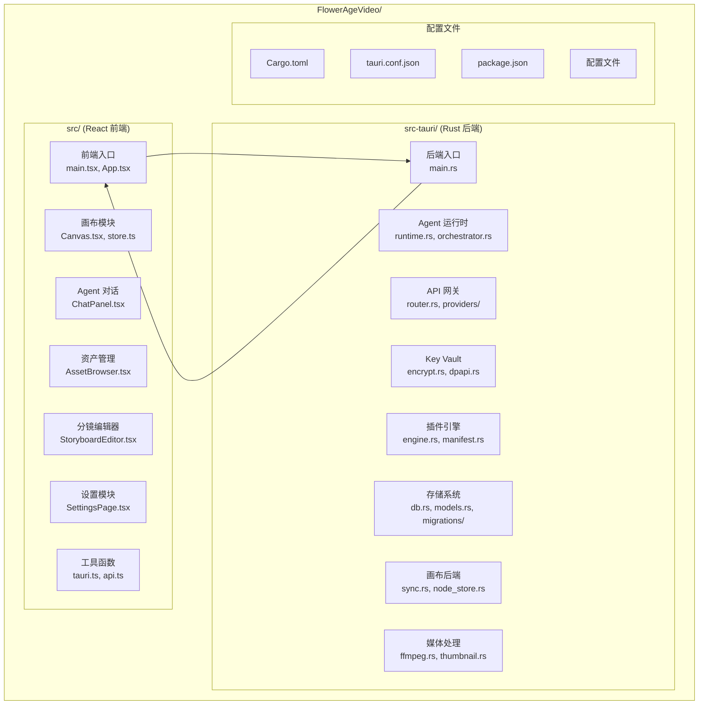
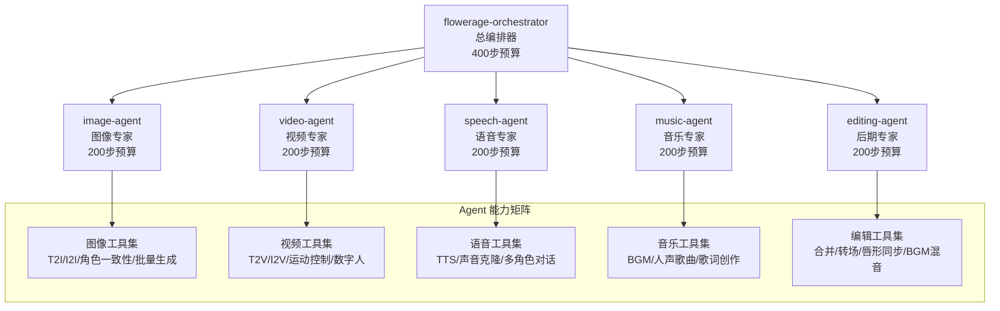
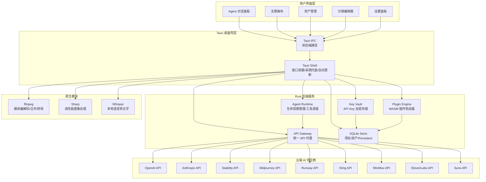
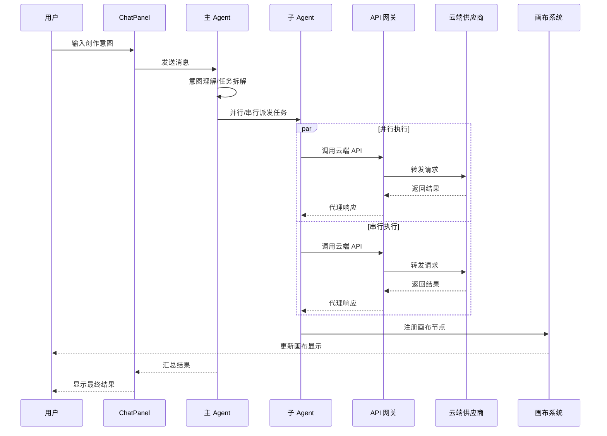
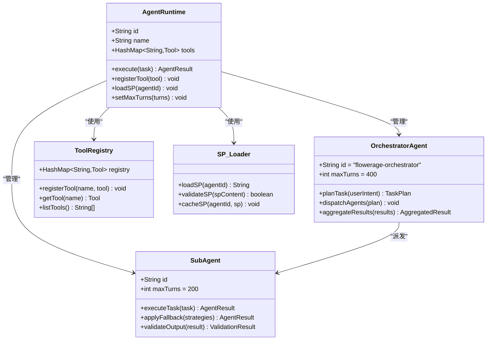
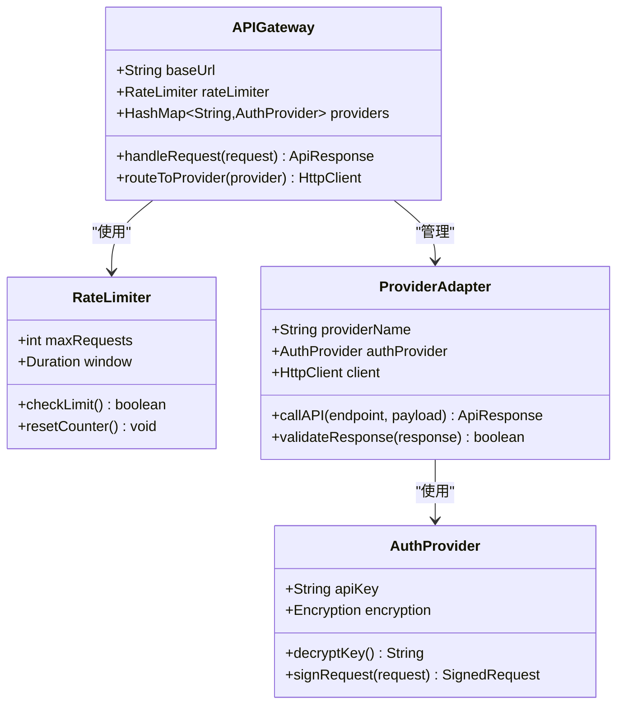
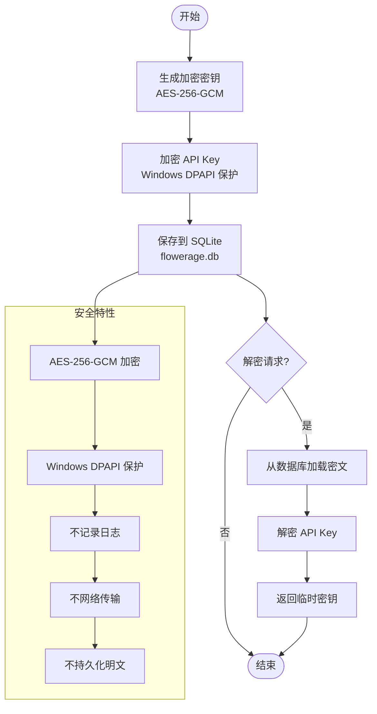
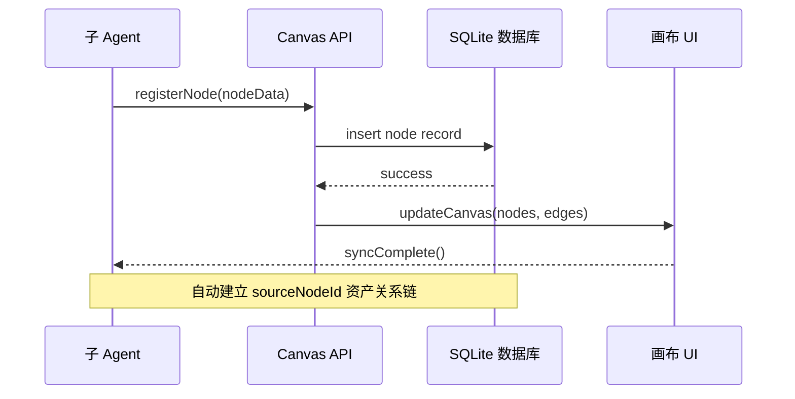

# 开发指南

<cite>
**本文档引用的文件**
- [buzhidaozenmemingmin.md](file://buzhidaozenmemingmin.md)
</cite>

## 目录
1. [简介](#简介)
2. [项目结构](#项目结构)
3. [核心组件](#核心组件)
4. [架构概览](#架构概览)
5. [详细组件分析](#详细组件分析)
6. [依赖分析](#依赖分析)
7. [性能考虑](#性能考虑)
8. [故障排除指南](#故障排除指南)
9. [结论](#结论)
10. [附录](#附录)

## 简介

Flower Age Video（花纪视频工作室）是一个基于 AI 驱动的无限画布创意工作站，面向视频创作者、内容生产者和 AI 艺术家。该项目采用主 Agent 编排 + 子 Agent 执行的架构模式，通过本地 Windows 桌面提供无限画布，用户通过主 Agent 描述创作意图，由多个专业子 Agent 自动完成图像生成、视频生成、语音合成、音乐生成和后期制作的全链路协作。

### 核心价值主张

- **零商业侵权**：全部依赖采用 MIT / Apache-2.0 / BSD 许可证，无 GPL 传染风险
- **本地部署**：单文件 .exe 安装，无需 Docker、无需 Python 环境、无需 Node.js 运行时
- **云端 AI**：用户配置自己的 API Key，本地加密存储，无第三方代理
- **无限画布**：所有资产（图片/视频/音频/文本/分镜）在画布上可视化管理
- **主 Agent 控子 Agent**：1 个编排器拆解任务 → 5 个专业子 Agent 并行/串行执行

## 项目结构

根据设计文档，项目采用前后端分离的架构，主要分为以下层次：



**图表来源**
- [buzhidaozenmemingmin.md:357-472](file://buzhidaozenmemingmin.md#L357-L472)

### 技术栈概览

项目采用混合技术栈，结合了现代 Web 技术和高性能 Rust 后端：

**桌面框架**
- **Tauri 2.x**：比 Electron 小 ~90%，Rust 后端
- **WebView2**：Windows 内置，零额外依赖
- **打包工具**：Tauri Bundler，生成 .msi/.exe 安装包
- **自动更新**：Tauri Updater，增量更新

**前端技术**
- **React 18**：成熟生态
- **TypeScript 5.x**：全链路类型安全
- **Vite**：极速 HMR
- **@xyflow/react**：行业标准无限画布
- **Zustand**：轻量、高性能状态管理
- **shadcn/ui + Radix**：无运行时依赖，复制即用

**后端技术 (Rust)**
- **axum**：高性能异步 HTTP
- **tokio**：Rust 异步标准
- **reqwest**：调用云端 API
- **ring + aead**：AES-256-GCM 加密 API Key
- **rusqlite**：嵌入式数据库
- **wasmtime**：WASM 插件运行时

**原生模块**
- **ffmpeg-sidecar**：自动下载管理 ffmpeg 二进制
- **image-rs**：Rust 原生图像编解码
- **symphonia**：Rust 原生音频解码
- **whisper-rs**：本地语音转文字

**章节来源**
- [buzhidaozenmemingmin.md:87-134](file://buzhidaozenmemingmin.md#L87-L134)

## 核心组件

### Agent 体系架构

Flower Age Video 采用主 Agent + 子 Agent 的分层架构，每个 Agent 都有明确的角色分工和步数预算：



**图表来源**
- [buzhidaozenmemingmin.md:139-171](file://buzhidaozenmemingmin.md#L139-L171)

### 无限画布设计

基于 @xyflow/react 的无限画布系统支持：

- **无限缩放**：0.1x ~ 5x，鼠标滚轮
- **拖拽布局**：自由拖拽节点
- **连线关系**：节点间有向边，表达资产依赖
- **分组节点**：Group Node 收纳相关资产
- **小地图**：MiniMap 全局导航
- **对齐吸附**：拖拽自动吸附对齐

**章节来源**
- [buzhidaozenmemingmin.md:213-263](file://buzhidaozenmemingmin.md#L213-L263)

## 架构概览

### 整体架构设计



**图表来源**
- [buzhidaozenmemingmin.md:27-84](file://buzhidaozenmemingmin.md#L27-L84)

### 请求处理流程



**图表来源**
- [buzhidaozenmemingmin.md:66-83](file://buzhidaozenmemingmin.md#L66-L83)

**章节来源**
- [buzhidaozenmemingmin.md:27-84](file://buzhidaozenmemingmin.md#L27-L84)

## 详细组件分析

### Agent 运行时系统

Agent 运行时是整个系统的核心，负责 Agent 的生命周期管理和工具调度：



**图表来源**
- [buzhidaozenmemingmin.md:361-366](file://buzhidaozenmemingmin.md#L361-L366)

### API 网关系统

API 网关负责统一管理各种云端 AI 供应商的 API 调用：



**图表来源**
- [buzhidaozenmemingmin.md:367-377](file://buzhidaozenmemingmin.md#L367-L377)

### Key Vault 安全存储

Key Vault 提供 API Key 的本地加密存储：



**图表来源**
- [buzhidaozenmemingmin.md:338-350](file://buzhidaozenmemingmin.md#L338-L350)

**章节来源**
- [buzhidaozenmemingmin.md:338-350](file://buzhidaozenmemingmin.md#L338-L350)

### 画布同步机制

画布同步协议确保所有生成物自动注册到画布节点：



**图表来源**
- [buzhidaozenmemingmin.md:185-189](file://buzhidaozenmemingmin.md#L185-L189)

**章节来源**
- [buzhidaozenmemingmin.md:185-189](file://buzhidaozenmemingmin.md#L185-L189)

## 依赖分析

### 技术栈许可证合规性

项目采用 100% 无 GPL 传染性的许可证组合：

| 组件 | 许可证 | 商业使用 | 修改分发 | 传染性 |
|---|---|---|---|---|
| Tauri | MIT + Apache-2.0 | ✅ | ✅ | ❌ |
| React | MIT | ✅ | ✅ | ❌ |
| @xyflow/react | MIT | ✅ | ✅ | ❌ |
| Zustand | MIT | ✅ | ✅ | ❌ |
| shadcn/ui | MIT | ✅ | ✅ | ❌ |
| Tailwind CSS | MIT | ✅ | ✅ | ❌ |
| Framer Motion | MIT | ✅ | ✅ | ❌ |
| Vercel AI SDK | Apache-2.0 | ✅ | ✅ | ❌ |
| axum | MIT | ✅ | ✅ | ❌ |
| tokio | MIT | ✅ | ✅ | ❌ |
| reqwest | MIT + Apache-2.0 | ✅ | ✅ | ❌ |
| ring | ISC (BSD-like) | ✅ | ✅ | ❌ |
| rusqlite | MIT | ✅ | ✅ | ❌ |
| wasmtime | Apache-2.0 | ✅ | ✅ | ❌ |
| ffmpeg-sidecar | MIT | ✅ | ✅ | ❌ |
| image-rs | MIT | ✅ | ✅ | ❌ |
| symphonia | MPL-2.0 | ✅ | ✅ | ❌ (非传染) |

**章节来源**
- [buzhidaozenmemingmin.md:596-621](file://buzhidaozenmemingmin.md#L596-L621)

### 第三方依赖关系

```mermaid
graph TB
subgraph "前端依赖"
React[React 18]
TS[TypeScript 5.x]
Vite[Vite]
XYFlow[@xyflow/react]
Zustand[Zustand]
UI[shadcn/ui + Radix]
Tailwind[Tailwind CSS]
Motion[Framer Motion]
AISDK[@ai-sdk/react]
end
subgraph "后端依赖"
Tauri[Tauri 2.x]
Axum[axum]
Tokio[tokio]
Serde[serde/serde_json]
Reqwest[reqwest]
Ring[ring + aead]
Rusqlite[rusqlite]
Tera[tera]
SSE[tokio-stream]
Wasmtime[wasmtime]
end
subgraph "原生模块"
FFmpeg[ffmpeg-sidecar]
ImageRS[image-rs]
Symphonia[symphonia]
Whisper[whisper-rs]
end
React --> Tauri
Vite --> Tauri
AXum --> Tauri
Reqwest --> Tauri
FFmpeg --> Tauri
```

**图表来源**
- [buzhidaozenmemingmin.md:87-134](file://buzhidaozenmemingmin.md#L87-L134)

## 性能考虑

### 架构性能优势

Flower Age Video 在性能方面具有显著优势：

- **体积优势**：Tauri 比 Electron 小 ~90%，从 150MB 缩减到 60MB
- **启动速度**：单文件 .exe 安装，双击即用，无需等待环境初始化
- **内存占用**：Rust 后端相比 Node.js/Python 更高效
- **并发处理**：Tokio 异步运行时支持高并发 Agent 执行

### 性能优化建议

1. **Agent 并行化**：合理利用主 Agent 的并行派发能力，减少串行等待时间
2. **缓存策略**：利用 Key Vault 的本地加密存储，避免重复网络请求
3. **资源管理**：ffmpeg 和图像处理模块采用流式处理，减少内存占用
4. **数据库优化**：SQLite 使用合适的索引和查询优化，提高数据访问速度

### 性能监控指标

- **Agent 响应时间**：从用户输入到结果返回的总时间
- **并发 Agent 数量**：同时执行的子 Agent 数量
- **内存使用峰值**：应用运行过程中的最大内存占用
- **CPU 利用率**：多核处理器的并行利用率

## 故障排除指南

### 常见问题及解决方案

#### 安装问题

**问题**：安装程序无法启动或崩溃
- **原因**：系统缺少必要的运行时组件
- **解决方案**：确保 Windows 10 1809+ 系统，自动安装 WebView2

**问题**：首次启动时 ffmpeg 下载失败
- **原因**：网络连接不稳定或防火墙阻止
- **解决方案**：手动下载 ffmpeg 二进制文件到指定目录

#### 运行时问题

**问题**：Agent 执行超时
- **原因**：云端 API 供应商响应慢或达到速率限制
- **解决方案**：检查 API Key 配置，调整速率限制参数

**问题**：画布节点无法显示
- **原因**：画布同步协议异常或数据库连接失败
- **解决方案**：重启应用，检查数据库文件完整性

#### 性能问题

**问题**：应用响应缓慢
- **原因**：同时运行的 Agent 过多或资源不足
- **解决方案**：减少并发 Agent 数量，关闭不必要的功能

**章节来源**
- [buzhidaozenmemingmin.md:476-509](file://buzhidaozenmemingmin.md#L476-L509)

### 调试工具使用

#### 开发环境调试

1. **前端调试**：使用 Chrome DevTools 调试 React 组件和状态管理
2. **后端调试**：使用 Rust 的调试工具链进行后端逻辑调试
3. **IPC 调试**：通过 Tauri 的日志系统监控前后端通信
4. **数据库调试**：使用 SQLite 工具查看和修改数据库内容

#### 性能分析方法

1. **内存分析**：使用 Rust 的内存分析工具检测内存泄漏
2. **CPU 分析**：分析 Agent 执行的热点函数
3. **网络分析**：监控 API 调用的响应时间和错误率
4. **存储分析**：分析数据库查询的性能瓶颈

## 结论

Flower Age Video 是一个设计精良的 AI 创意工作站，通过采用先进的技术栈和架构模式，在保持高性能的同时提供了丰富的功能。项目采用了 100% 开源且无 GPL 传染性的技术组合，确保了商业使用的安全性。

### 主要优势

- **技术先进性**：采用 Rust + Tauri + React 的现代化技术栈
- **架构合理性**：主 Agent + 子 Agent 的分层架构清晰明确
- **用户体验**：零环境依赖，双击即用的安装体验
- **安全性**：本地 API Key 加密存储，无第三方代理
- **扩展性**：WASM 插件系统提供良好的扩展能力

### 发展前景

项目按照 17 周的开发路线图推进，涵盖了从核心框架到打包发布的完整开发周期。随着各阶段功能的逐步完善，Flower Age Video 将成为一款功能完备的 AI 创意工具。

## 附录

### 开发环境搭建指南

#### 系统要求

- **操作系统**：Windows 10 1809+ 或更高版本
- **硬件要求**：至少 8GB RAM，推荐 16GB+
- **存储空间**：至少 2GB 可用空间

#### 开发工具安装

1. **Rust 工具链**
   - 安装 Rustup：https://rustup.rs/
   - 配置目标平台：`rustup target add x86_64-pc-windows-msvc`

2. **Node.js 环境**
   - 安装 Node.js 18+ LTS 版本
   - 验证安装：`node --version`

3. **Tauri 开发工具**
   - 安装 Tauri CLI：`cargo install tauri-cli`
   - 安装 WebView2 运行时（开发时）

#### 项目初始化步骤

1. **克隆项目**
   ```bash
   git clone <repository-url>
   cd FlowerAgeVideo
   ```

2. **安装依赖**
   ```bash
   # 后端依赖
   cargo build
   
   # 前端依赖
   npm install
   ```

3. **开发服务器启动**
   ```bash
   # 后端开发
   cargo tauri dev
   
   # 或者分别启动
   cargo tauri dev --features backend
   npm run dev --features frontend
   ```

#### 开发工作流程

1. **前端开发**
   - 使用 Vite 的热重载功能进行快速迭代
   - 通过 Tauri IPC 与后端通信
   - 使用 TypeScript 进行类型安全开发

2. **后端开发**
   - 使用 Rust 的异步编程模型
   - 通过 axum 框架构建 API 服务
   - 利用 tokio 的并发能力

3. **数据库开发**
   - 使用 rusqlite 进行数据库操作
   - 通过迁移脚本管理数据库结构变更
   - 实现数据模型的类型安全

#### 测试策略

1. **单元测试**
   - 后端：使用 Rust 的标准测试框架
   - 前端：使用 Jest 进行组件测试
   - API：使用 Postman 或 curl 进行接口测试

2. **集成测试**
   - Agent 系统测试：验证 Agent 间的协作
   - 数据库测试：验证数据持久化和查询
   - IPC 测试：验证前后端通信

3. **端到端测试**
   - 用户工作流测试：模拟完整的创作流程
   - 性能测试：验证应用的响应时间和吞吐量
   - 兼容性测试：验证不同系统配置下的行为

#### 版本控制规范

1. **分支策略**
   - `main`：稳定版本
   - `develop`：开发版本
   - `feature/*`：功能开发分支
   - `hotfix/*`：紧急修复分支

2. **提交规范**
   - 格式：`<type>(<scope>): <subject>`
   - 示例：`feat(agent): add new image processing tool`

3. **标签规范**
   - 语义化版本：`v1.0.0`
   - 预发布版本：`v1.0.0-alpha.1`

#### 代码审查流程

1. **Pull Request 创建**
   - 选择适当的基分支
   - 详细描述变更内容
   - 添加相关测试用例

2. **代码审查标准**
   - 代码质量：遵循 Rust 和 TypeScript 最佳实践
   - 功能正确性：确保功能按预期工作
   - 性能影响：评估对性能的影响
   - 安全性：检查潜在的安全漏洞

3. **审查流程**
   - 自动化检查：CI/CD 自动运行测试
   - 人工审查：至少一名维护者审查
   - 修改反馈：根据审查意见进行修改
   - 合并批准：获得足够的批准后合并

#### 贡献流程

1. **问题报告**
   - 使用 GitHub Issues 模板
   - 提供详细的复现步骤
   - 包含系统信息和日志

2. **功能请求**
   - 描述使用场景和需求
   - 提供设计建议
   - 讨论实现方案

3. **代码贡献**
   - 遵循代码风格指南
   - 编写测试用例
   - 更新文档

#### 开发最佳实践

1. **代码组织**
   - 模块化设计，职责单一
   - 清晰的命名约定
   - 适当的注释和文档

2. **错误处理**
   - 使用 Result 类型处理错误
   - 提供有意义的错误信息
   - 实现优雅的降级策略

3. **性能优化**
   - 避免不必要的计算
   - 使用异步编程模型
   - 实现缓存机制

4. **安全性**
   - 输入验证和清理
   - 安全的 API Key 存储
   - 防止常见的安全漏洞

#### 常见问题解答

**Q: 如何解决 API Key 验证失败的问题？**
A: 检查 API Key 是否正确配置，确认网络连接正常，查看日志获取详细错误信息。

**Q: 如何优化应用启动速度？**
A: 减少不必要的初始化操作，使用懒加载策略，优化资源文件大小。

**Q: 如何处理 Agent 执行失败的情况？**
A: 实现降级矩阵，提供备用方案，记录详细的错误日志用于诊断。

**章节来源**
- [buzhidaozenmemingmin.md:635-731](file://buzhidaozenmemingmin.md#L635-L731)