# WASM 插件引擎

<cite>
**本文档引用的文件**
- [buzhidaozenmemingmin.md](file://buzhidaozenmemingmin.md)
</cite>

## 目录
1. [简介](#简介)
2. [项目结构](#项目结构)
3. [核心组件](#核心组件)
4. [架构概览](#架构概览)
5. [详细组件分析](#详细组件分析)
6. [依赖分析](#依赖分析)
7. [性能考虑](#性能考虑)
8. [故障排除指南](#故障排除指南)
9. [结论](#结论)
10. [附录](#附录)

## 简介

WASM 插件引擎是 Flower Age Video 项目中的一个关键组件，基于 wasmtime 运行时实现，用于在安全沙箱环境中动态加载和执行 WASM 插件。该引擎提供了完整的插件生命周期管理、内存隔离机制、资源限制策略和错误处理流程，支持热加载功能，能够扩展新的 AI 模型接入。

### 核心特性

- **安全沙箱环境**：基于 wasmtime 运行时，提供强隔离的执行环境
- **动态加载**：支持插件的热加载和卸载
- **生命周期管理**：完整的插件生命周期控制
- **资源限制**：内存、CPU 时间等资源使用限制
- **错误处理**：完善的异常捕获和恢复机制
- **通信协议**：标准化的插件与宿主通信接口

## 项目结构

根据项目文档，WASM 插件引擎位于 `src-tauri/src/plugin/` 目录下，包含以下关键文件：

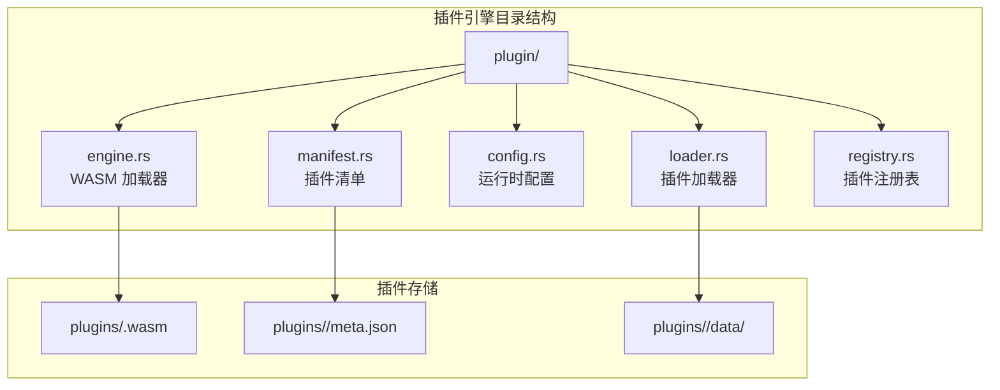

**图表来源**
- [buzhidaozenmemingmin.md:382-384](file://buzhidaozenmemingmin.md#L382-L384)

**章节来源**
- [buzhidaozenmemingmin.md:382-384](file://buzhidaozenmemingmin.md#L382-L384)
- [buzhidaozenmemingmin.md:536](file://buzhidaozenmemingmin.md#L536)

## 核心组件

### 插件加载器 (Plugin Loader)

插件加载器负责将 WASM 模块加载到 wasmtime 运行时中，并建立必要的绑定和接口。

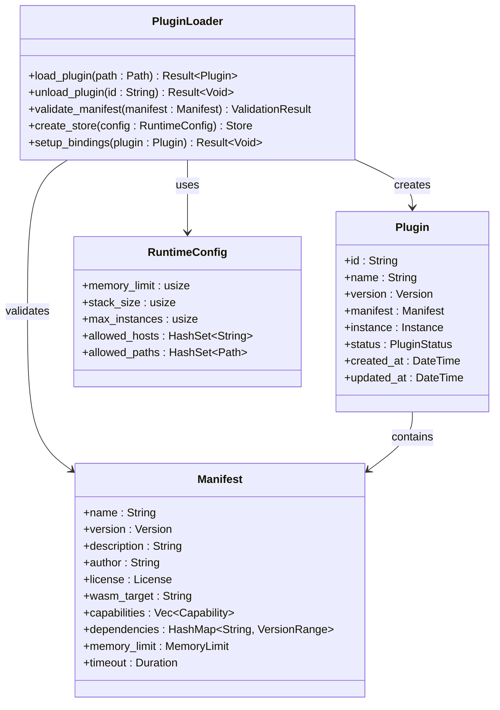

**图表来源**
- [buzhidaozenmemingmin.md:382-384](file://buzhidaozenmemingmin.md#L382-L384)

### 插件运行时 (Plugin Runtime)

插件运行时管理插件实例的执行，包括内存分配、资源管理和生命周期控制。

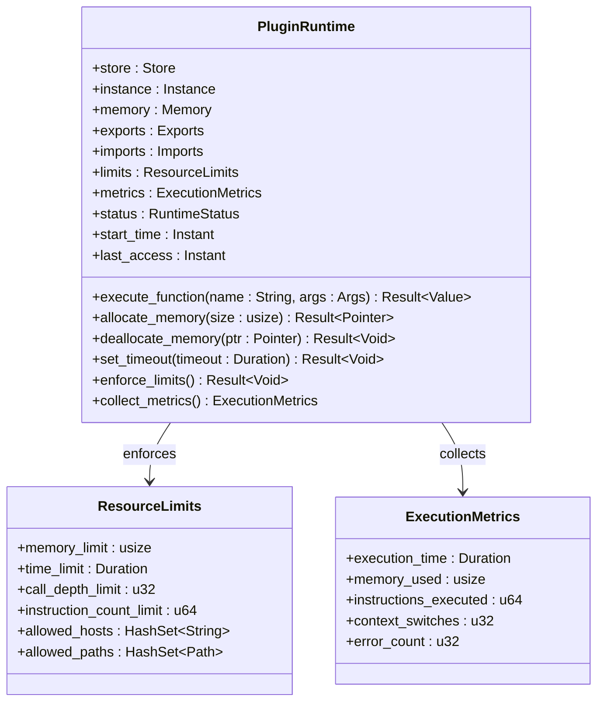

**图表来源**
- [buzhidaozenmemingmin.md:124](file://buzhidaozenmemingmin.md#L124)

### 插件注册表 (Plugin Registry)

插件注册表维护已安装插件的信息，提供查询、检索和管理功能。

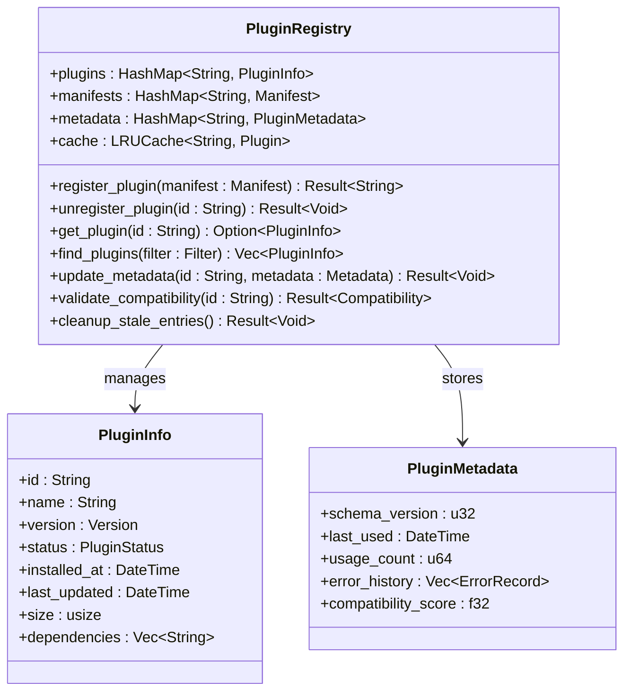

**图表来源**
- [buzhidaozenmemingmin.md:526](file://buzhidaozenmemingmin.md#L526)

**章节来源**
- [buzhidaozenmemingmin.md:382-384](file://buzhidaozenmemingmin.md#L382-L384)
- [buzhidaozenmemingmin.md:526](file://buzhidaozenmemingmin.md#L526)

## 架构概览

WASM 插件引擎采用分层架构设计，确保了良好的模块化和可扩展性：

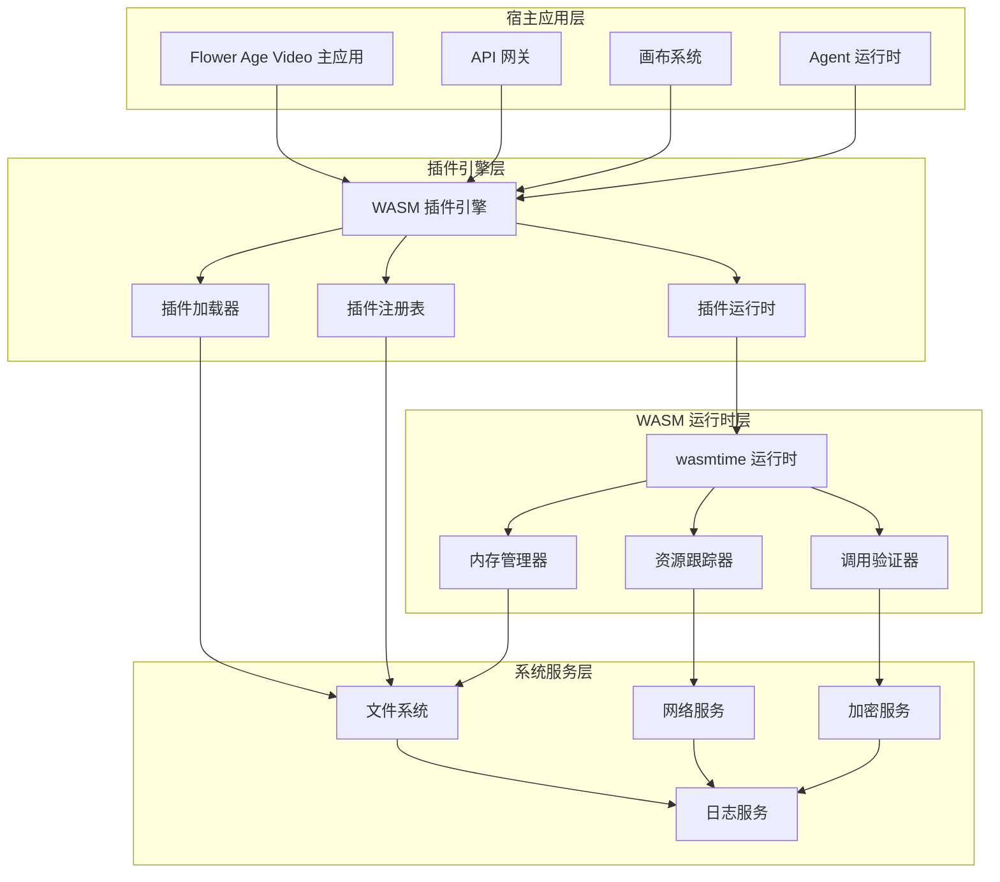

**图表来源**
- [buzhidaozenmemingmin.md:27](file://buzhidaozenmemingmin.md#L27-L50)
- [buzhidaozenmemingmin.md:124](file://buzhidaozenmemingmin.md#L124)

## 详细组件分析

### 插件生命周期管理

插件生命周期管理是插件引擎的核心功能之一，涵盖了从插件安装到卸载的完整流程：

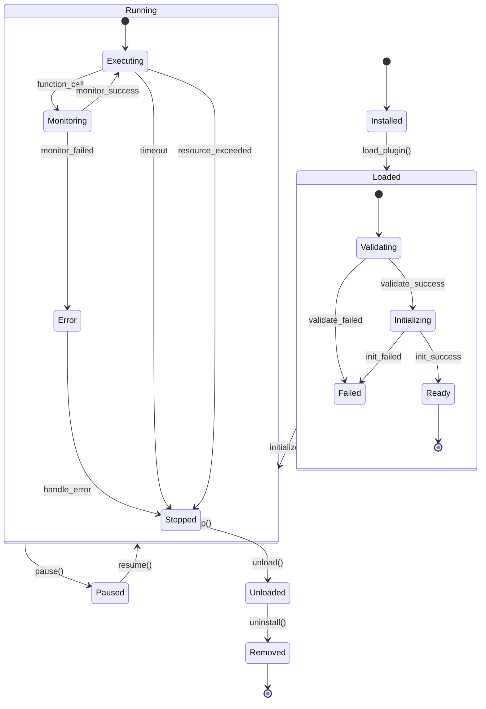

**图表来源**
- [buzhidaozenmemingmin.md:382-384](file://buzhidaozenmemingmin.md#L382-L384)

#### 生命周期阶段详解

1. **Installed 阶段**：插件文件已下载并存储在本地
2. **Loaded 阶段**：插件被加载到内存中，但尚未初始化
3. **Initializing 阶段**：执行插件的初始化逻辑
4. **Ready 阶段**：插件准备就绪，可以接收请求
5. **Running 阶段**：插件正在执行函数调用
6. **Paused 阶段**：插件暂停执行，保留状态
7. **Stopped 阶段**：插件停止执行，释放资源
8. **Unloaded 阶段**：插件从内存中卸载
9. **Removed 阶段**：插件从系统中移除

**章节来源**
- [buzhidaozenmemingmin.md:382-384](file://buzhidaozenmemingmin.md#L382-L384)

### 内存隔离机制

WASM 插件引擎实现了多层次的内存隔离机制，确保插件之间的安全隔离：

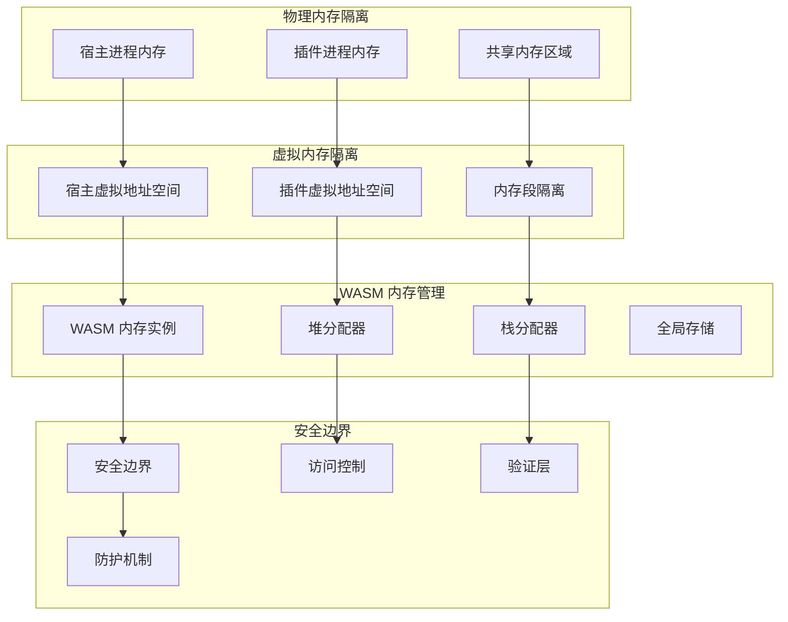

**图表来源**
- [buzhidaozenmemingmin.md:124](file://buzhidaozenmemingmin.md#L124)

#### 内存隔离策略

1. **地址空间隔离**：每个插件拥有独立的虚拟地址空间
2. **堆栈分离**：插件的堆和栈空间相互隔离
3. **全局变量保护**：插件间的全局变量访问受到严格限制
4. **内存边界检查**：防止插件越界访问其他内存区域

**章节来源**
- [buzhidaozenmemingmin.md:124](file://buzhidaozenmemingmin.md#L124)

### 资源限制策略

插件引擎实施了严格的资源限制策略，防止恶意或异常插件消耗过多系统资源：

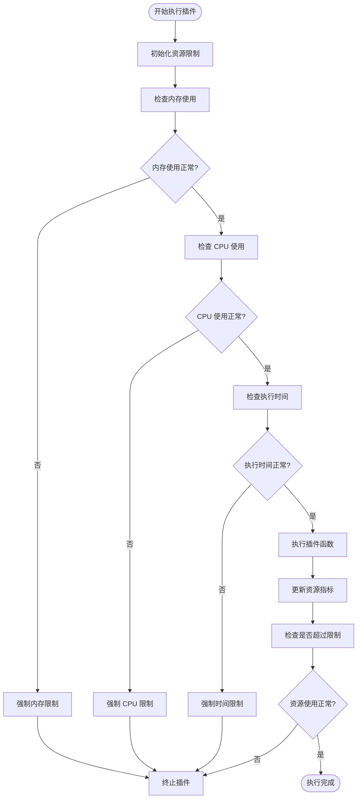

**图表来源**
- [buzhidaozenmemingmin.md:382-384](file://buzhidaozenmemingmin.md#L382-L384)

#### 资源限制类型

1. **内存限制**：限制插件的最大内存使用量
2. **CPU 时间限制**：限制插件的执行时间
3. **指令计数限制**：限制插件执行的指令数量
4. **调用深度限制**：限制递归调用的深度
5. **网络访问限制**：限制插件的网络连接

**章节来源**
- [buzhidaozenmemingmin.md:382-384](file://buzhidaozenmemingmin.md#L382-L384)

### 错误处理流程

插件引擎实现了完善的错误处理机制，确保系统稳定性和可靠性：

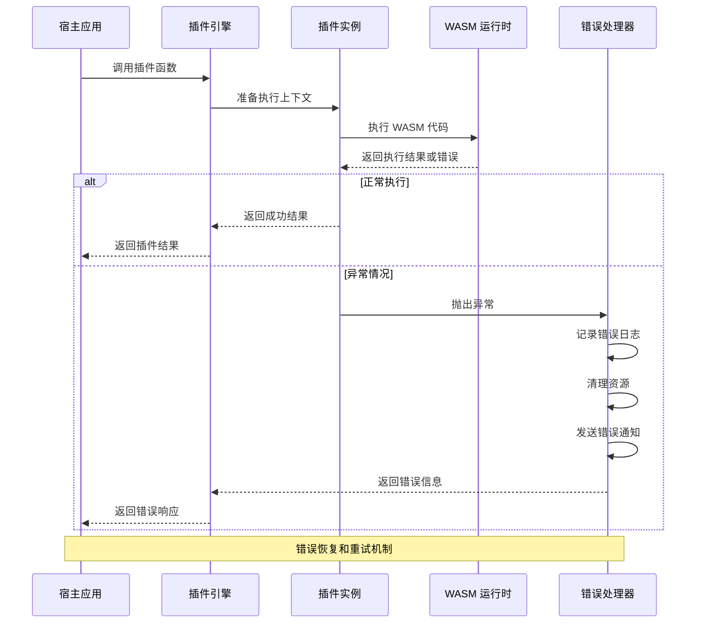

**图表来源**
- [buzhidaozenmemingmin.md:382-384](file://buzhidaozenmemingmin.md#L382-L384)

#### 错误分类和处理

1. **语法错误**：插件代码编译失败
2. **运行时错误**：插件执行过程中出现异常
3. **资源错误**：插件超出资源限制
4. **接口错误**：插件与宿主通信失败
5. **系统错误**：底层系统资源不足

**章节来源**
- [buzhidaozenmemingmin.md:382-384](file://buzhidaozenmemingmin.md#L382-L384)

### 插件与宿主通信协议

插件引擎定义了标准化的通信协议，确保插件与宿主应用之间的可靠交互：

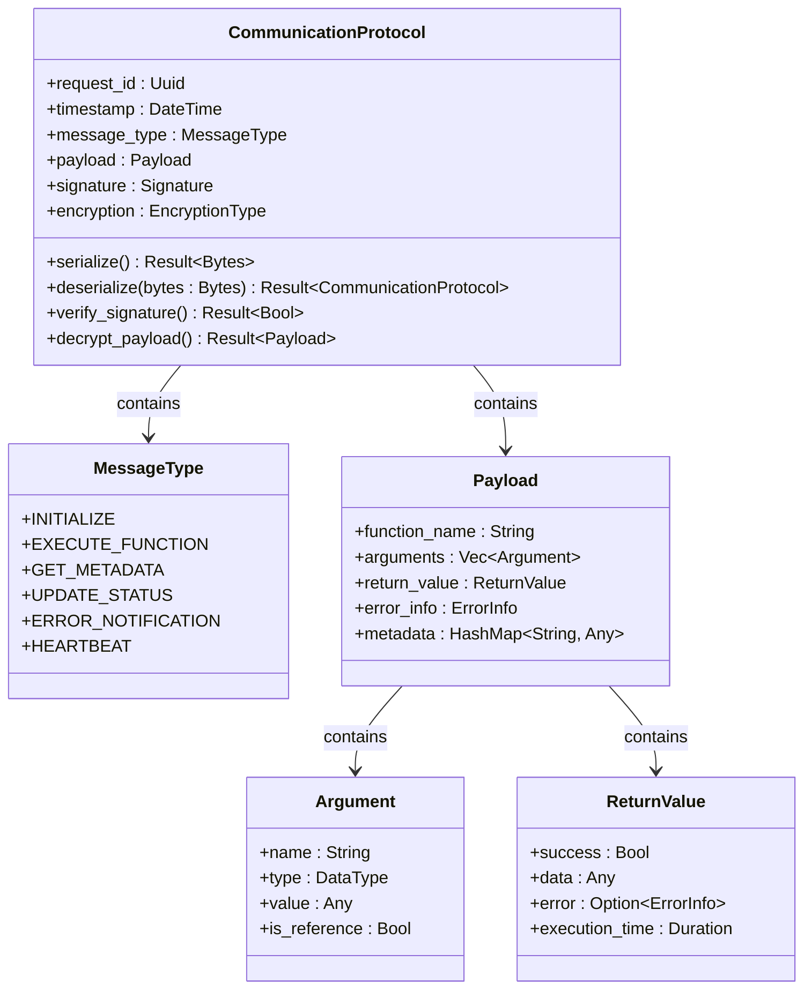

**图表来源**
- [buzhidaozenmemingmin.md:382-384](file://buzhidaozenmemingmin.md#L382-L384)

#### 通信协议规范

1. **消息格式**：统一的 JSON 或 Protocol Buffers 格式
2. **签名验证**：确保消息的完整性和真实性
3. **加密传输**：敏感数据的加密保护
4. **超时机制**：防止长时间阻塞
5. **重试策略**：网络异常时的自动重试

**章节来源**
- [buzhidaozenmemingmin.md:382-384](file://buzhidaozenminingmin.md#L382-L384)

## 依赖分析

插件引擎依赖于多个外部组件和内部模块：

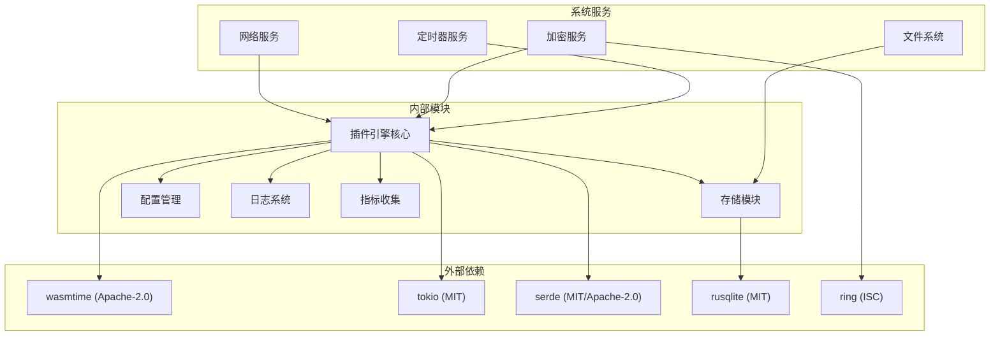

**图表来源**
- [buzhidaozenmemingmin.md:124](file://buzhidaozenmemingmin.md#L124)

### 依赖关系分析

1. **wasmtime**：核心 WASM 运行时，提供插件执行环境
2. **tokio**：异步运行时，支持并发执行
3. **serde**：数据序列化，支持 JSON 和二进制格式
4. **rusqlite**：SQLite 数据库，存储插件元数据
5. **ring**：加密库，提供安全功能

**章节来源**
- [buzhidaozenmemingmin.md:124](file://buzhidaozenmemingmin.md#L124)

## 性能考虑

### 并发控制

插件引擎采用了多种并发控制策略来确保系统的稳定性和性能：

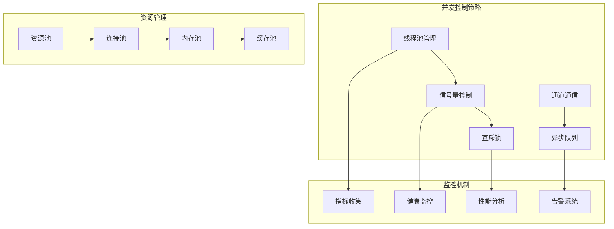

### 性能优化策略

1. **懒加载**：插件按需加载，减少启动时间
2. **预热机制**：常用插件提前加载到内存
3. **缓存策略**：结果缓存和元数据缓存
4. **批量处理**：多个插件请求的批处理
5. **异步执行**：非阻塞的异步调用模式

## 故障排除指南

### 常见问题诊断

1. **插件加载失败**
   - 检查 WASM 文件完整性
   - 验证插件兼容性版本
   - 查看依赖项是否满足

2. **插件执行超时**
   - 检查资源限制配置
   - 分析插件算法复杂度
   - 调整超时参数

3. **内存泄漏**
   - 监控插件内存使用
   - 检查插件资源清理
   - 分析循环引用问题

4. **通信异常**
   - 验证网络连接
   - 检查防火墙设置
   - 查看消息序列化问题

### 调试方法

1. **启用详细日志**
   ```bash
   export RUST_LOG=plugin_engine=debug
   ```

2. **性能分析**
   - 使用火焰图分析热点
   - 监控内存使用趋势
   - 分析并发瓶颈

3. **单元测试**
   - 编写插件测试用例
   - 测试边界条件
   - 验证错误处理

**章节来源**
- [buzhidaozenmemingmin.md:382-384](file://buzhidaozenmemingmin.md#L382-L384)

## 结论

WASM 插件引擎为 Flower Age Video 提供了一个强大而安全的扩展平台。通过基于 wasmtime 的实现，该引擎不仅提供了高效的插件执行环境，还确保了严格的沙箱隔离和资源限制。其模块化的架构设计使得系统具有良好的可维护性和可扩展性。

### 主要优势

1. **安全性**：基于 WASM 的强隔离机制
2. **性能**：接近原生代码的执行效率
3. **灵活性**：支持动态加载和卸载
4. **可扩展性**：模块化设计便于功能扩展
5. **稳定性**：完善的错误处理和恢复机制

### 未来发展方向

1. **插件市场**：建立官方插件商店
2. **性能优化**：进一步提升执行效率
3. **监控增强**：完善性能监控和分析
4. **安全加固**：持续改进安全防护机制
5. **生态建设**：培养开发者社区

## 附录

### 插件开发指南

#### 基本要求
- 支持的 WASM 特性
- 必需的导入函数
- 输出格式规范

#### 开发步骤
1. 编写插件代码
2. 编译为 WASM
3. 创建插件清单
4. 测试和验证
5. 部署和发布

#### 最佳实践
- 遵循资源使用限制
- 实现优雅的错误处理
- 提供详细的元数据
- 进行充分的测试

### 运行时配置

| 配置项 | 默认值 | 说明 |
|--------|--------|------|
| max_memory | 64MB | 插件最大内存限制 |
| max_instances | 10 | 最大插件实例数 |
| timeout | 30s | 插件执行超时时间 |
| cache_size | 100MB | 插件缓存大小 |
| log_level | Info | 日志级别 |

### API 接口规范

#### 插件管理接口
- `POST /plugins` - 安装插件
- `GET /plugins` - 获取插件列表
- `GET /plugins/{id}` - 获取插件详情
- `PUT /plugins/{id}` - 更新插件
- `DELETE /plugins/{id}` - 卸载插件

#### 插件执行接口
- `POST /plugins/{id}/execute` - 执行插件函数
- `GET /plugins/{id}/status` - 获取插件状态
- `POST /plugins/{id}/pause` - 暂停插件
- `POST /plugins/{id}/resume` - 恢复插件