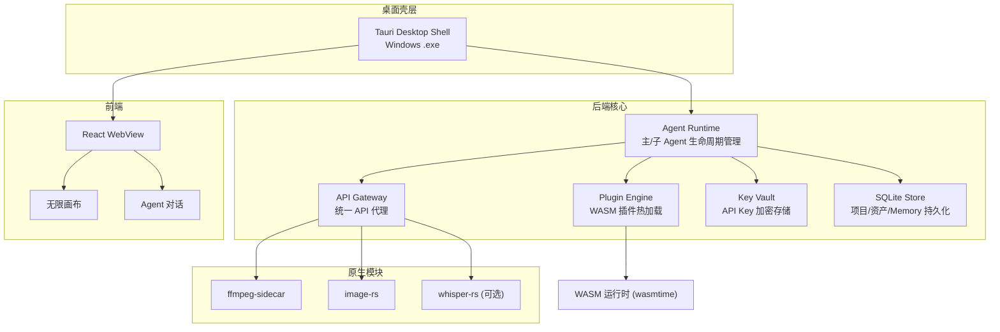
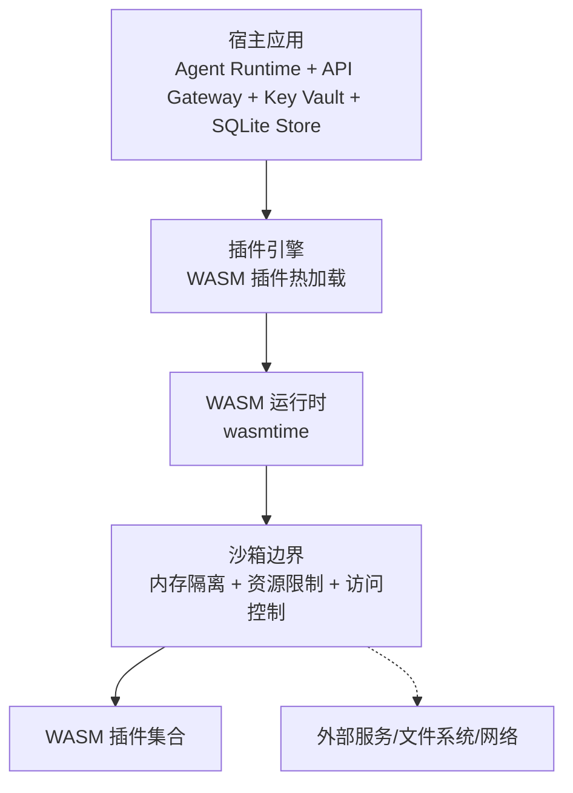
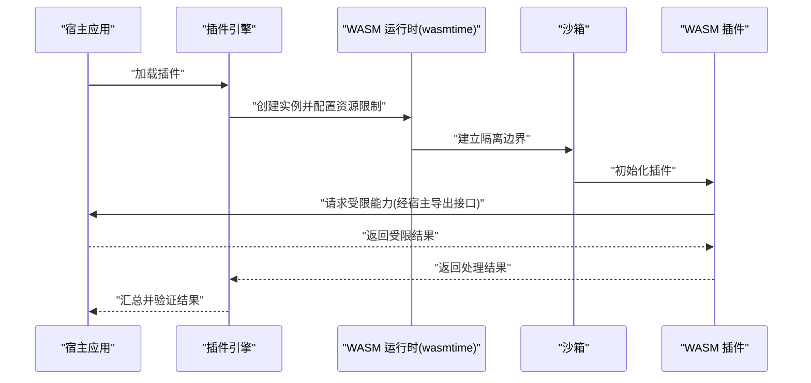
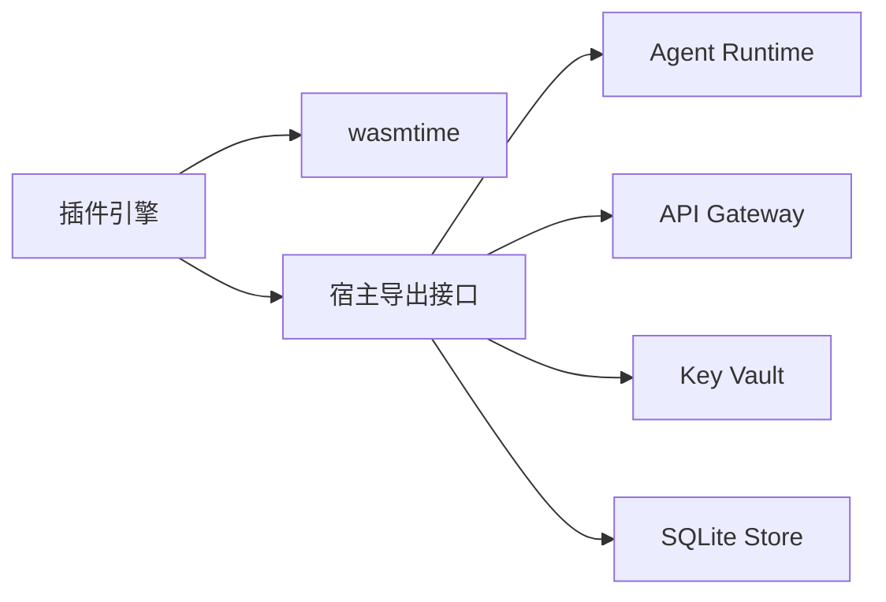

# 插件安全隔离

<cite>
**本文引用的文件**
- [buzhidaozenmemingmin.md](file://buzhidaozenmemingmin.md)
</cite>

## 目录
1. [简介](#简介)
2. [项目结构](#项目结构)
3. [核心组件](#核心组件)
4. [架构总览](#架构总览)
5. [详细组件分析](#详细组件分析)
6. [依赖分析](#依赖分析)
7. [性能考虑](#性能考虑)
8. [故障排查指南](#故障排查指南)
9. [结论](#结论)
10. [附录](#附录)

## 简介
本文件围绕“插件安全隔离”主题，结合项目文档中对 WASM 插件引擎的描述，系统阐述基于 wasmtime 沙箱的内存隔离、资源限制与访问控制设计。文档聚焦以下方面：
- 插件执行环境的安全边界与权限模型
- 插件与宿主应用的通信安全、数据验证与注入防护
- 安全威胁模型、攻击面分析与防护措施
- 安全配置示例、监控与审计建议
- 插件签名验证、完整性检查与可信执行环境
- 安全漏洞修复流程、应急响应与安全更新策略

## 项目结构
根据项目文档，Flower Age Video 采用“主 Agent 编排 + 子 Agent 执行”的架构，并在后端 Rust 模块中引入了“插件引擎（Plugin Engine）”用于热加载 WASM 插件。插件系统位于后端 Rust 模块的 plugin 目录下，与 Agent Runtime、API Gateway、Key Vault、SQLite Store 等核心模块协同工作。

图表来源
- [buzhidaozenmemingmin.md:357-472](file://buzhidaozenmemingmin.md#L357-L472)

章节来源
- [buzhidaozenmemingmin.md:27-84](file://buzhidaozenmemingmin.md#L27-L84)
- [buzhidaozenmemingmin.md:357-472](file://buzhidaozenmemingmin.md#L357-L472)

## 核心组件
- 插件引擎（Plugin Engine）：负责加载与管理 WASM 插件，提供扩展新 AI 模型接入的能力。该组件直接依赖 wasmtime 作为 WASM 运行时，从而获得沙箱隔离能力。
- Agent Runtime：负责 Agent 生命周期管理、工具调度、SP 注入与步数限制，是插件调用的主要入口之一。
- API Gateway：统一代理到各云端 AI 供应商 API，与插件系统在功能上互补（插件侧重本地扩展，API Gateway 侧重云端服务调用）。
- Key Vault：本地加密存储 API Key，确保敏感凭据不落盘明文，降低插件或 Agent 在调用外部服务时的泄露风险。
- SQLite Store：持久化项目数据、资产索引、Memory、会话历史等，插件注册信息也可能存储于此。

章节来源
- [buzhidaozenmemingmin.md:357-472](file://buzhidaozenmemingmin.md#L357-L472)
- [buzhidaozenmemingmin.md:59-60](file://buzhidaozenmemingmin.md#L59-L60)

## 架构总览
插件安全隔离的关键在于将“插件执行环境”置于 wasmtime 提供的沙箱边界内，限制其可访问的资源与能力，并通过宿主应用的权限模型与访问控制进行协同。

图表来源
- [buzhidaozenmemingmin.md:59-60](file://buzhidaozenmemingmin.md#L59-L60)

## 详细组件分析

### 插件引擎与 WASM 沙箱
- 安全边界
  - 插件以 WASM 形式加载，运行于 wasmtime 提供的沙箱环境中，天然具备内存隔离与地址空间隔离能力。
  - 插件无法直接访问宿主文件系统、网络套接字或进程间共享内存，除非通过显式的宿主导出接口暴露。
- 权限模型
  - 插件仅能访问被显式授予的资源与能力，例如受限的内存池、只读的配置、受控的回调接口等。
  - 插件与宿主之间的交互通过“宿主导出函数”和“插件导入函数”约定进行，双方均需严格遵守接口契约。
- 隔离策略
  - 内存隔离：插件与宿主拥有独立的虚拟地址空间；插件无法越界访问宿主内存。
  - 资源限制：通过 wasmtime 的实例配置限制堆栈大小、线程数量、指令执行步数等，防止插件滥用 CPU/内存。
  - 访问控制：仅允许白名单内的系统调用或宿主导出接口，拒绝一切未授权的系统调用。
- 与宿主通信
  - 插件通过宿主提供的受限 API 获取所需能力（如读取配置、记录日志、触发事件），避免直接与外部系统交互。
  - 插件输出必须经过宿主的数据验证与清洗，防止恶意数据进入后续处理链。

图表来源
- [buzhidaozenmemingmin.md:59-60](file://buzhidaozenmemingmin.md#L59-L60)

章节来源
- [buzhidaozenmemingmin.md:357-472](file://buzhidaozenmemingmin.md#L357-L472)

### Agent Runtime 与插件协作
- Agent Runtime 作为插件调用的主要入口，负责：
  - 将插件注册为可用工具，供 Agent SP 使用。
  - 在执行过程中，按需调用插件接口，传递参数并接收结果。
  - 对插件输出进行格式校验与安全检查，确保不会破坏画布或下游流程。
- 步数预算与降级矩阵同样适用于插件调用链，避免插件导致的资源耗尽或长时间阻塞。

章节来源
- [buzhidaozenmemingmin.md:137-211](file://buzhidaozenmemingmin.md#L137-L211)

### API Gateway 与 Key Vault 的协同
- 插件若需要访问外部服务，应通过 API Gateway 代理，而非直接发起网络请求。
- Key Vault 提供本地加密存储，确保敏感凭据不落盘明文，降低泄露风险。
- 插件不应直接读取 Key Vault 中的内容，而应通过宿主提供的受控接口获取临时凭据或令牌。

章节来源
- [buzhidaozenmemingmin.md:266-351](file://buzhidaozenmemingmin.md#L266-L351)

### SQLite Store 的数据安全
- 插件注册信息、插件清单与相关元数据可存储于 SQLite 中，但应避免存储敏感数据。
- 对数据库访问应进行最小权限控制，仅允许必要的读写操作。

章节来源
- [buzhidaozenmemingmin.md:512-546](file://buzhidaozenmemingmin.md#L512-L546)

## 依赖分析
- 插件引擎依赖 wasmtime 作为 WASM 运行时，这是实现沙箱隔离的核心依赖。
- 插件与宿主之间通过严格的接口契约耦合，降低相互影响与耦合度。
- 插件与外部系统交互需经由 API Gateway 与 Key Vault，形成清晰的访问控制边界。

图表来源
- [buzhidaozenmemingmin.md:59-60](file://buzhidaozenmemingmin.md#L59-L60)

章节来源
- [buzhidaozenmemingmin.md:357-472](file://buzhidaozenmemingmin.md#L357-L472)

## 性能考虑
- WASM 插件的启动与执行开销较低，适合频繁调用的场景。
- 通过资源限制（如堆栈大小、指令步数、内存上限）避免插件占用过多系统资源。
- 插件与宿主之间的数据序列化/反序列化应尽量轻量化，减少不必要的拷贝与转换。

## 故障排查指南
- 插件加载失败
  - 检查插件是否符合目标架构与版本要求。
  - 确认插件清单与宿主接口契约匹配。
- 插件执行异常
  - 查看 wasmtime 实例配置是否合理（内存、指令步数、线程等）。
  - 检查插件输出是否通过宿主验证与清洗。
- 与外部服务交互问题
  - 确认 API Gateway 代理配置正确，Key Vault 凭据有效。
  - 检查网络策略与防火墙设置。

章节来源
- [buzhidaozenmemingmin.md:266-351](file://buzhidaozenmemingmin.md#L266-L351)

## 结论
通过将插件运行于 wasmtime 沙箱中，结合宿主应用的权限模型、访问控制与资源限制，可以实现对插件执行环境的有效隔离与治理。配合 API Gateway 与 Key Vault 的安全设计，以及 SQLite Store 的最小权限访问策略，能够显著降低插件带来的安全风险。建议在实际落地时进一步细化接口契约、完善监控与审计，并建立完善的漏洞修复与应急响应流程。

## 附录

### 安全威胁模型与攻击面
- 威胁来源
  - 恶意插件：通过越权访问、资源滥用、注入攻击等方式危害系统。
  - 供应链攻击：插件来源不可信，导致恶意代码进入系统。
  - 配置错误：资源限制不当、接口暴露过度、日志泄露等。
- 攻击面
  - 插件加载与初始化阶段
  - 插件与宿主通信接口
  - 插件对数据库、文件系统、网络的间接访问路径
  - 插件输出对后续处理链的影响

### 防护措施
- 内存隔离与资源限制
  - 为插件实例配置严格的内存上限、指令步数限制与线程数限制。
- 最小权限原则
  - 仅暴露必要的宿主导出接口，避免插件直接访问敏感资源。
- 数据验证与注入防护
  - 对插件输入与输出进行严格校验，防止注入与格式错误。
- 审计与监控
  - 记录插件加载、调用、异常与资源使用情况，定期审计。
- 供应链安全
  - 对插件来源进行签名验证与完整性检查，建立可信插件白名单。

### 安全配置示例（概念性）
- 插件实例配置
  - 内存上限：例如 MB 级别
  - 指令步数限制：例如每秒步数阈值
  - 线程数限制：例如 1
- 接口暴露清单
  - 明确列出允许插件调用的宿主接口及其参数范围
- 日志与审计
  - 记录插件调用时间、输入摘要、输出摘要、异常信息
  - 审计周期：每日/每周汇总

### 监控工具与审计日志
- 监控指标
  - 插件实例数量、CPU/内存使用、异常次数、调用成功率
- 审计日志
  - 插件清单、加载时间、调用轨迹、资源消耗、错误详情

### 插件签名验证与完整性检查
- 签名验证
  - 对插件进行数字签名，宿主在加载前验证签名有效性与发行者可信度。
- 完整性检查
  - 使用哈希算法校验插件二进制完整性，防止篡改。
- 可信执行环境
  - 在可信硬件或受控环境中进行签名与验证，降低中间环节风险。

### 安全漏洞修复流程、应急响应与安全更新策略
- 漏洞修复流程
  - 发现漏洞 → 评估影响 → 制定补丁 → 测试验证 → 发布更新 → 回滚预案
- 应急响应
  - 快速隔离受影响插件、回滚到稳定版本、通知用户、追踪攻击路径
- 安全更新策略
  - 自动更新通道、灰度发布、回滚机制、用户确认与通知