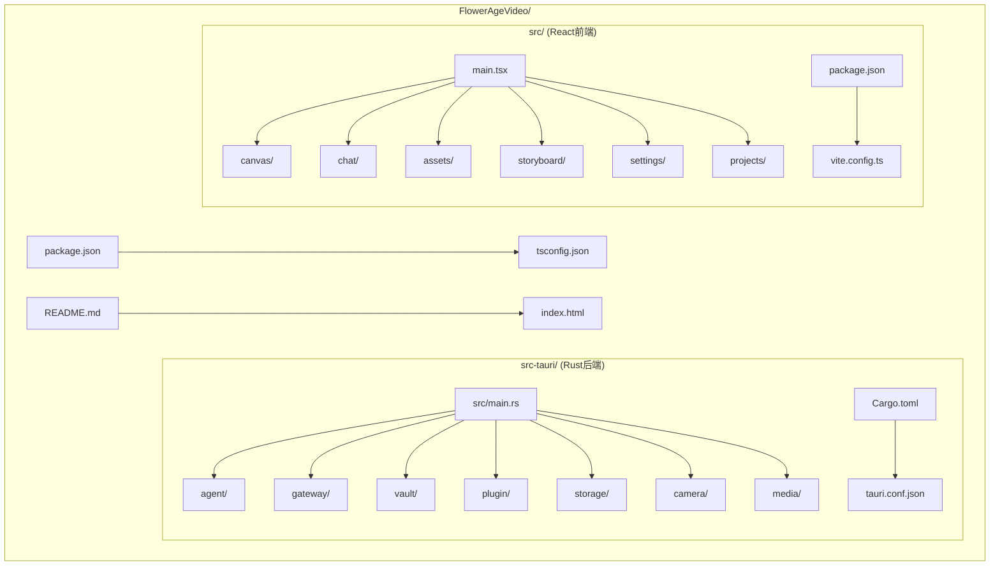
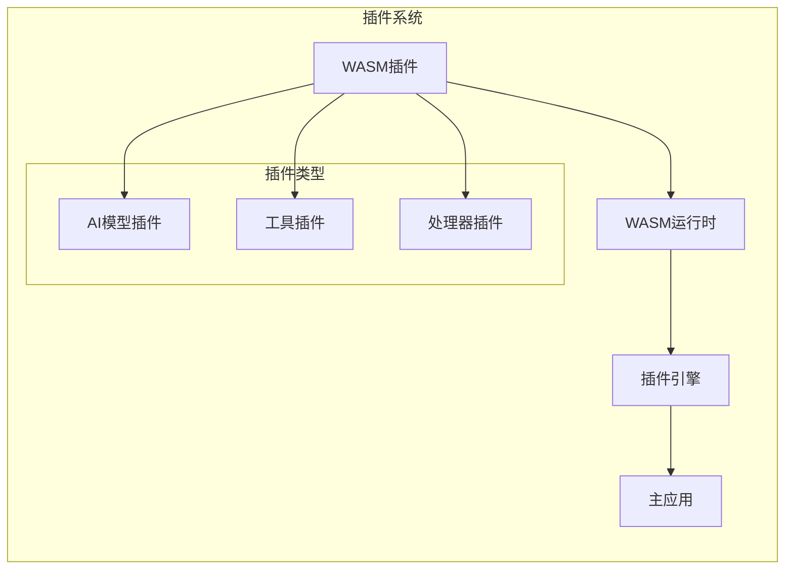
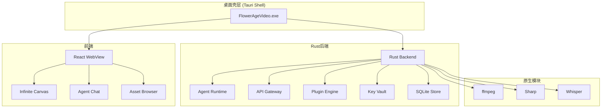
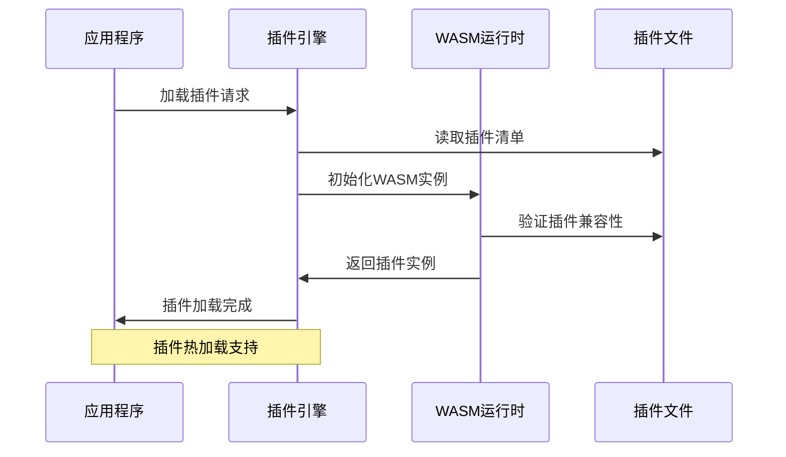
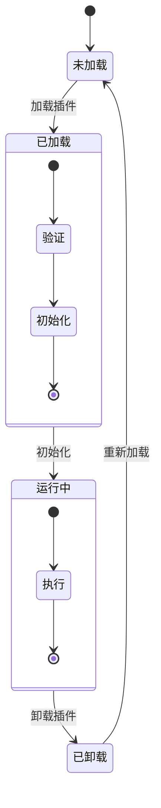
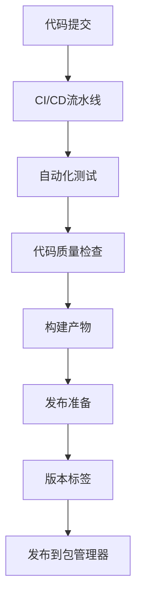

# 插件开发指南

<cite>
**本文档引用的文件**
- [buzhidaozenmemingmin.md](file://buzhidaozenmemingmin.md)
</cite>

## 目录
1. [简介](#简介)
2. [项目结构](#项目结构)
3. [核心组件](#核心组件)
4. [架构概览](#架构概览)
5. [详细组件分析](#详细组件分析)
6. [依赖分析](#依赖分析)
7. [性能考虑](#性能考虑)
8. [故障排除指南](#故障排除指南)
9. [结论](#结论)
10. [附录](#附录)

## 简介

Flower Age Video是一个基于WASM插件系统的AI驱动无限画布创意工作站。该项目采用主Agent编排+子Agent执行的架构模式，通过WASM插件系统实现可扩展的AI模型接入和功能扩展。

### 核心价值主张

- **零商业侵权**：全部依赖采用MIT/APACHE-2.0/BSD许可证，无GPL传染风险
- **本地部署**：单文件.exe安装，无需Docker、无需Python环境、无需Node.js运行时
- **云端AI**：用户配置自己的API Key，本地加密存储，无第三方代理
- **无限画布**：所有资产在画布上可视化管理
- **主Agent控子Agent**：1个编排器拆解任务→5个专业子Agent并行/串行执行

## 项目结构

根据设计文档，Flower Age Video采用前后端分离的架构设计：



**图表来源**
- [buzhidaozenmemingmin.md:357-472](file://buzhidaozenmemingmin.md#L357-L472)

### 插件系统架构



**图表来源**
- [buzhidaozenmemingmin.md:59-64](file://buzhidaozenmemingmin.md#L59-L64)

**章节来源**
- [buzhidaozenmemingmin.md:357-472](file://buzhidaozenmemingmin.md#L357-L472)

## 核心组件

### 插件引擎 (Plugin Engine)

插件引擎是整个系统的核心组件，负责WASM插件的加载、管理和执行。根据设计文档，插件引擎采用以下架构：

- **WASM运行时**：基于wasmtime crate，提供安全的沙箱环境
- **动态加载**：支持`.wasm`插件的热加载机制
- **生命周期管理**：管理插件的加载、初始化、执行和卸载
- **API接口**：提供标准化的插件接口规范

### 插件清单 (Plugin Manifest)

插件清单文件用于描述插件的基本信息和配置要求：

- **插件标识**：唯一标识符和版本信息
- **依赖声明**：声明所需的API和权限
- **入口点**：指定插件的主函数入口
- **配置参数**：插件运行所需的配置选项

**章节来源**
- [buzhidaozenmemingmin.md:382-384](file://buzhidaozenmemingmin.md#L382-L384)

## 架构概览

### 整体架构设计



**图表来源**
- [buzhidaozenmemingmin.md:29-49](file://buzhidaozenmemingmin.md#L29-L49)

### 插件加载流程



**图表来源**
- [buzhidaozenmemingmin.md:59](file://buzhidaozenmemingmin.md#L59)

## 详细组件分析

### 插件引擎实现

#### 插件生命周期管理



#### 插件接口规范

插件需要实现的标准接口包括：

- **初始化接口**：插件启动时调用
- **执行接口**：插件主要功能的执行入口
- **配置接口**：获取和设置插件配置
- **清理接口**：插件关闭时的清理工作

### 插件清单格式

插件清单文件采用标准化的格式，包含以下关键字段：

- **metadata**：插件基本信息
- **requirements**：运行时需求
- **permissions**：权限声明
- **configuration**：配置模板

**章节来源**
- [buzhidaozenmemingmin.md:383-384](file://buzhidaozenmemingmin.md#L383-L384)

## 依赖分析

### 技术栈依赖

根据设计文档，项目采用以下技术栈：

```mermaid
graph TB
subgraph "桌面框架"
A[Tauri 2.x] --> B[MIT + Apache-2.0]
end
subgraph "前端技术"
C[React 18] --> D[MIT]
E[Vite] --> F[MIT]
G[@xyflow/react] --> H[MIT]
end
subgraph "后端技术"
I[axum] --> J[MIT]
K[tokio] --> L[MIT]
M[wasmtime] --> N[Apache-2.0]
end
subgraph "原生模块"
O[ffmpeg-sidecar] --> P[MIT]
Q[image-rs] --> R[MIT]
end
```

**图表来源**
- [buzhidaozenmemingmin.md:89-134](file://buzhidaozenmemingmin.md#L89-L134)

### 插件系统依赖

插件系统的核心依赖包括：

- **wasmtime**：WASM运行时引擎
- **serde**：序列化/反序列化支持
- **tokio**：异步运行时支持

**章节来源**
- [buzhidaozenmemingmin.md:114-124](file://buzhidaozenmemingmin.md#L114-L124)

## 性能考虑

### WASM插件性能优化

1. **内存管理**：合理管理插件内存使用，避免内存泄漏
2. **并发处理**：利用Tokio异步运行时提高并发性能
3. **缓存策略**：实现插件结果缓存机制
4. **资源限制**：设置插件执行时间限制和资源使用上限

### 插件加载优化

- **延迟加载**：按需加载插件，减少启动时间
- **预加载机制**：对常用插件进行预加载
- **插件池管理**：复用已加载的插件实例

## 故障排除指南

### 常见问题及解决方案

#### 插件加载失败

**症状**：插件无法加载或启动异常

**可能原因**：
- WASM字节码损坏
- 插件版本不兼容
- 权限不足

**解决步骤**：
1. 验证插件文件完整性
2. 检查插件版本兼容性
3. 确认插件权限声明

#### 插件执行超时

**症状**：插件执行超过预期时间

**解决方法**：
1. 检查插件算法复杂度
2. 实现超时机制
3. 优化插件内部逻辑

#### 内存泄漏问题

**症状**：长时间运行后内存占用持续增长

**预防措施**：
1. 实现正确的资源清理
2. 使用RAII模式管理资源
3. 定期进行内存监控

**章节来源**
- [buzhidaozenmemingmin.md:591](file://buzhidaozenmemingmin.md#L591)

## 结论

Flower Age Video项目展示了现代插件系统的设计理念和实现方法。通过采用WASM沙箱技术和标准化的插件接口，该系统实现了高度的安全性和可扩展性。

### 关键优势

1. **安全性**：WASM沙箱提供强隔离环境
2. **可扩展性**：插件系统支持功能扩展
3. **性能**：原生Rust实现保证高性能
4. **易用性**：零环境依赖，简单部署

### 发展前景

随着AI技术的发展，插件系统将继续演进，支持更多类型的AI模型和功能扩展。通过标准化的接口和严格的权限控制，确保系统的稳定性和安全性。

## 附录

### 开发环境搭建

#### 必需工具

- **Rust工具链**：最新稳定版本
- **Node.js**：用于前端构建
- **Tauri CLI**：桌面应用构建工具
- **WASM编译器**：如Rust的wasm32-unknown-unknown目标

#### 项目初始化

```bash
# 克隆项目
git clone <repository-url>
cd FlowerAgeVideo

# 安装依赖
npm install

# 构建项目
npm run build

# 开发模式运行
npm run dev
```

### 插件开发最佳实践

#### 代码组织

- **模块化设计**：将功能分解为独立模块
- **错误处理**：实现完善的错误处理机制
- **日志记录**：添加适当的日志输出
- **单元测试**：编写全面的测试用例

#### 性能优化

- **算法优化**：选择高效的算法实现
- **内存管理**：避免不必要的内存分配
- **并发处理**：充分利用异步编程优势
- **缓存策略**：实现合理的缓存机制

### 安全要求

#### 权限控制

- **最小权限原则**：插件只申请必要权限
- **权限验证**：运行时验证插件权限
- **沙箱隔离**：WASM沙箱提供执行隔离

#### 数据安全

- **API Key加密**：使用AES-256-GCM加密存储
- **传输安全**：所有网络通信使用HTTPS
- **日志脱敏**：避免记录敏感信息

### 发布流程

#### 版本管理

- **语义化版本**：遵循SemVer规范
- **变更日志**：维护详细的变更记录
- **标签管理**：使用Git标签标记版本

#### 构建流程



### 社区贡献指南

#### 代码贡献

- **分支策略**：使用GitFlow工作流
- **提交规范**：遵循约定式提交规范
- **代码审查**：实施严格的代码审查制度
- **测试要求**：所有功能必须有相应测试

#### 问题报告

- **模板使用**：使用标准的问题报告模板
- **详细描述**：提供完整的问题重现步骤
- **环境信息**：包含系统和依赖版本信息
- **日志收集**：附带相关日志文件