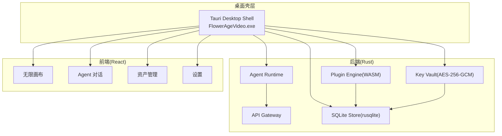
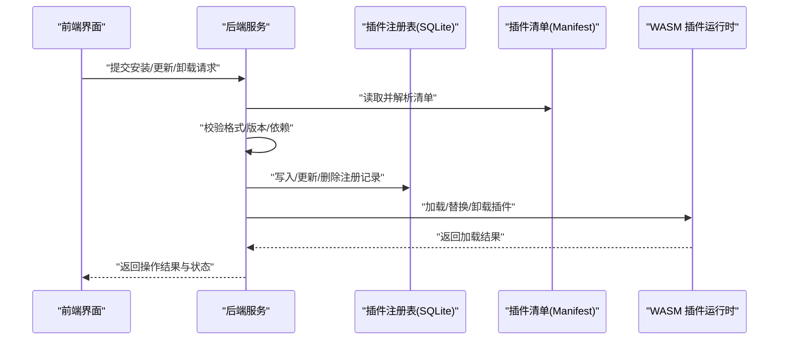
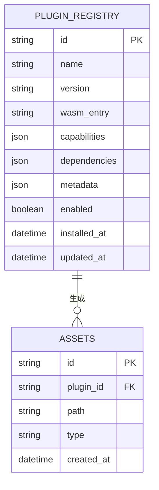
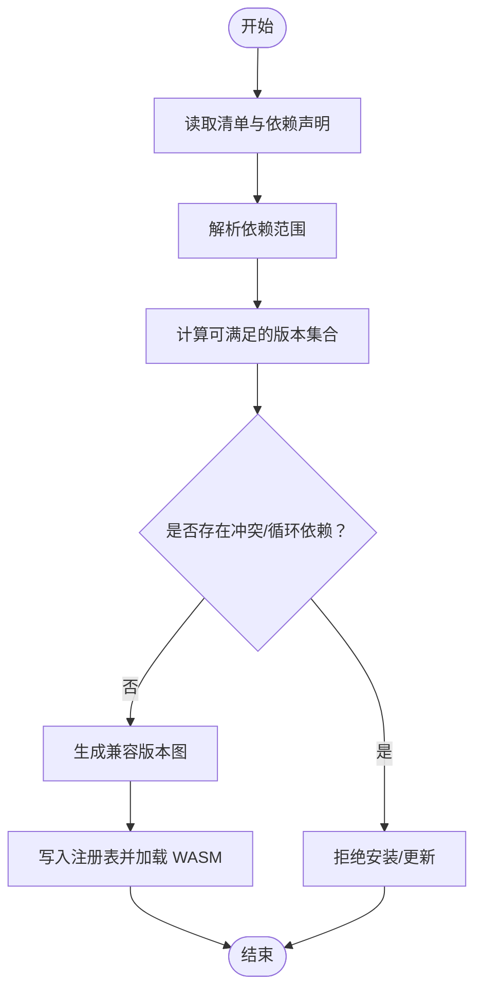
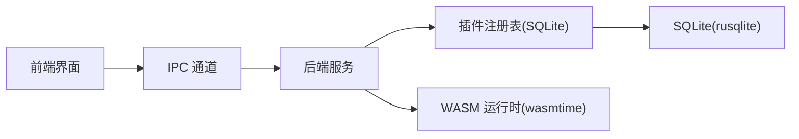

# 插件清单管理

<cite>
**本文引用的文件**
- [buzhidaozenmemingmin.md](file://buzhidaozenmemingmin.md)
</cite>

## 目录
1. [简介](#简介)
2. [项目结构](#项目结构)
3. [核心组件](#核心组件)
4. [架构总览](#架构总览)
5. [详细组件分析](#详细组件分析)
6. [依赖分析](#依赖分析)
7. [性能考虑](#性能考虑)
8. [故障排除指南](#故障排除指南)
9. [结论](#结论)
10. [附录](#附录)

## 简介
本文件为“插件清单管理系统”的技术文档，围绕基于 SQLite 的插件注册表设计展开，涵盖插件元数据管理、版本控制与依赖解析、清单格式规范、验证规则、存储机制、插件发现与安装流程、更新与回滚策略以及卸载流程。文档以项目设计文档为依据，结合实际工程实践，提供从概念到落地的完整说明，并辅以可视化图表帮助理解。

## 项目结构
本项目采用“桌面壳层 + Rust 后端 + React 前端”的三层架构，其中插件系统位于后端 Rust 层，通过 WASM 插件运行时实现热加载与沙箱隔离；SQLite 作为本地持久化存储，用于保存插件注册表、项目数据、资产索引、会话历史、密钥与设置等。

- 桌面壳层：Tauri 2.x（Rust），负责窗口容器、系统托盘、自动更新、原生 IPC。
- 后端（Rust）：Agent Runtime、API Gateway、Plugin Engine（WASM）、Key Vault（加密存储）、SQLite Store（持久化）。
- 前端（React）：无限画布、Agent 对话、资产管理、分镜编辑、设置等。

**章节来源**
- [buzhidaozenmemingmin.md: 第27-64节:27-64](file://buzhidaozenmemingmin.md#L27-L64)
- [buzhidaozenmemingmin.md: 第354-416节:354-416](file://buzhidaozenmemingmin.md#L354-L416)

## 核心组件
- 插件引擎（WASM）：支持 .wasm 插件热加载，扩展新 AI 模型接入，具备沙箱隔离与安全边界。
- 插件清单（Manifest）：定义插件元数据、版本、依赖、入口、能力声明等，用于注册表校验与安装决策。
- 插件注册表（SQLite）：持久化已安装插件的状态、版本、依赖关系、启用/禁用标记等。
- 存储层（SQLite）：统一管理项目、节点、资产、会话、记忆、密钥与设置等数据。
- 前端交互：提供插件安装、卸载、更新、回滚等 UI 操作与状态展示。

**章节来源**
- [buzhidaozenmemingmin.md: 第382-384节:382-384](file://buzhidaozenmemingmin.md#L382-L384)
- [buzhidaozenmemingmin.md: 第512-527节:512-527](file://buzhidaozenmemingmin.md#L512-L527)

## 架构总览
插件系统通过“清单校验 → 注册表落库 → WASM 加载 → 运行时注入”的闭环实现。前端触发安装/更新/卸载，后端进行清单验证与依赖解析，成功后写入 SQLite 注册表并加载 WASM 插件；回滚策略通过版本号与注册表状态保障。

**图表来源**
- [buzhidaozenmemingmin.md: 第382-384节:382-384](file://buzhidaozenmemingmin.md#L382-L384)
- [buzhidaozenmemingmin.md: 第512-527节:512-527](file://buzhidaozenmemingmin.md#L512-L527)

## 详细组件分析

### 插件清单（Manifest）数据结构与字段定义
- 必填字段
  - id：插件唯一标识（字符串，建议遵循反向域名或语义化命名）
  - name：插件显示名称（字符串）
  - version：语义化版本号（语义化版本，如 1.2.3）
  - wasm_entry：WASM 文件相对路径（字符串）
  - capabilities：能力声明数组（字符串集合，如 “image-generation”, “audio-tts”）
- 可选字段
  - description：插件描述（字符串）
  - authors：作者信息（字符串或数组）
  - homepage：主页链接（URL）
  - license：许可证（字符串）
  - dependencies：依赖声明（键值对，如 {“依赖插件ID”: “版本范围”}）
  - metadata：扩展元数据（键值对，供运行时或 UI 使用）
- 版本兼容性策略
  - 使用语义化版本（MAJOR.MINOR.PATCH）
  - 依赖范围采用“兼容版本”约定（如 ^1.2.3 表示 >=1.2.3 且 <2.0.0）
  - 若未声明兼容范围，默认按严格匹配处理
- 清单校验规则
  - 必填字段缺失 → 拒绝安装
  - 版本号格式非法 → 拒绝安装
  - 依赖冲突或循环依赖 → 拒绝安装
  - wasm_entry 路径不存在或无法访问 → 拒绝安装
  - capabilities 非法或重复 → 拒绝安装
  - metadata 键值类型不符合要求 → 拒绝安装

**章节来源**
- [buzhidaozenmemingmin.md: 第382-384节:382-384](file://buzhidaozenmemingmin.md#L382-L384)

### 插件注册表（SQLite）设计
- 表：plugin_registry
  - 字段：id（主键，字符串）、name（字符串）、version（字符串）、wasm_entry（字符串）、capabilities（JSON 文本）、dependencies（JSON 文本）、metadata（JSON 文本）、enabled（布尔）、installed_at（时间戳）、updated_at（时间戳）
  - 约束：id 唯一；version 与 dependencies 用于版本控制与依赖解析
- 关联表：assets（用于插件生成的资产索引，便于清理与回滚）
- 存储机制
  - 安装：写入一条记录，标记 enabled=true
  - 更新：新增一条更高版本记录，保留旧版本以便回滚
  - 卸载：删除记录或标记 enabled=false
  - 回滚：将注册表指向旧版本记录

**图表来源**
- [buzhidaozenmemingmin.md: 第512-527节:512-527](file://buzhidaozenmemingmin.md#L512-L527)

**章节来源**
- [buzhidaozenmemingmin.md: 第512-527节:512-527](file://buzhidaozenmemingmin.md#L512-L527)

### 插件发现流程与自动扫描机制
- 扫描位置
  - 用户插件目录：%LOCALAPPDATA%\FlowerAgeVideo\plugins\
- 扫描策略
  - 递归遍历插件目录，识别 .wasm 文件与其对应的清单文件（如 manifest.json）
  - 对每个候选插件执行清单校验与依赖解析
  - 若通过，写入注册表并尝试加载 WASM 插件
- 事件驱动
  - 文件系统变更（新增/删除/修改）触发增量扫描
  - 启动时执行全量扫描
- 失败处理
  - 校验失败：记录错误日志，跳过该插件
  - 加载失败：回滚至上次可用版本或保持禁用状态

**章节来源**
- [buzhidaozenmemingmin.md: 第529-545节:529-545](file://buzhidaozenmemingmin.md#L529-L545)

### 手动安装流程
- 前置条件
  - 插件目录存在（若不存在则创建）
  - 清单文件与 WASM 文件在同一目录下
- 步骤
  1) 前端上传清单与 WASM 文件
  2) 后端解析清单，执行格式与依赖校验
  3) 校验通过：写入注册表，enabled=true
  4) 加载 WASM 插件，注入运行时
  5) 返回安装结果与状态
- 失败回滚
  - 若加载失败：删除注册记录或标记为 disabled，保留原始文件以便重试

**章节来源**
- [buzhidaozenmemingmin.md: 第382-384节:382-384](file://buzhidaozenmemingmin.md#L382-L384)
- [buzhidaozenmemingmin.md: 第529-545节:529-545](file://buzhidaozenmemingmin.md#L529-L545)

### 插件更新机制
- 版本比较
  - 使用语义化版本比较，仅允许升级到更高版本
- 依赖兼容性
  - 更新前重新解析依赖，确保与现有注册表不冲突
- 在线/离线更新
  - 在线：从指定源下载清单与 WASM
  - 离线：本地上传清单与 WASM
- 更新策略
  - 新增一条更高版本记录，保留旧版本
  - 成功后切换启用版本，失败则回滚至旧版本

**章节来源**
- [buzhidaozenmemingmin.md: 第382-384节:382-384](file://buzhidaozenmemingmin.md#L382-L384)

### 插件回滚策略
- 触发场景
  - 更新失败、加载失败、运行时异常
- 回滚步骤
  - 读取注册表中上一个可用版本
  - 卸载当前版本 WASM
  - 加载上一个版本 WASM
  - 更新注册表启用版本
- 数据一致性
  - 通过事务保证注册表更新与 WASM 切换的一致性

**章节来源**
- [buzhidaozenmemingmin.md: 第512-527节:512-527](file://buzhidaozenmemingmin.md#L512-L527)

### 插件卸载流程
- 卸载策略
  - 删除注册表记录（物理卸载）
  - 或标记 disabled（逻辑卸载）
- 资产清理
  - 查询关联资产表，删除插件生成的资产
- 依赖解除
  - 若其他插件依赖该插件，需提示或自动调整依赖

**章节来源**
- [buzhidaozenmemingmin.md: 第512-527节:512-527](file://buzhidaozenmemingmin.md#L512-L527)

### 插件依赖解析算法

**图表来源**
- [buzhidaozenmemingmin.md: 第382-384节:382-384](file://buzhidaozenmemingmin.md#L382-L384)

## 依赖分析
- 组件耦合
  - 插件引擎依赖 WASM 运行时与注册表
  - 注册表依赖 SQLite 存储
  - 前端通过 IPC 与后端交互，间接影响插件生命周期
- 外部依赖
  - rusqlite：嵌入式数据库
  - wasmtime：WASM 运行时
  - ring：加密库（用于 Key Vault，与插件系统解耦）

**图表来源**
- [buzhidaozenmemingmin.md: 第112-124节:112-124](file://buzhidaozenmemingmin.md#L112-L124)
- [buzhidaozenmemingmin.md: 第382-384节:382-384](file://buzhidaozenmemingmin.md#L382-L384)
- [buzhidaozenmemingmin.md: 第512-527节:512-527](file://buzhidaozenmemingmin.md#L512-L527)

**章节来源**
- [buzhidaozenmemingmin.md: 第112-124节:112-124](file://buzhidaozenmemingmin.md#L112-L124)
- [buzhidaozenmemingmin.md: 第382-384节:382-384](file://buzhidaozenmemingmin.md#L382-L384)
- [buzhidaozenmemingmin.md: 第512-527节:512-527](file://buzhidaozenmemingmin.md#L512-L527)

## 性能考虑
- WASM 加载成本
  - 首次加载耗时较高，建议缓存与懒加载策略
  - 插件数量较多时，批量加载与并发控制需谨慎
- SQLite 写入
  - 批量写入使用事务，减少磁盘 IO
  - 避免频繁读写注册表，必要时引入内存缓存
- 依赖解析
  - 依赖图规模大时，采用拓扑排序与增量解析
- 前端渲染
  - 插件列表分页与虚拟滚动，降低 DOM 压力

## 故障排除指南
- 常见问题
  - 清单格式错误：检查必填字段与 JSON 结构
  - 依赖冲突：调整依赖范围或移除冲突插件
  - WASM 加载失败：确认文件完整性与权限
  - 注册表损坏：重建注册表或恢复备份
- 排查步骤
  - 查看后端日志与 SQLite 注册表
  - 验证清单与 WASM 文件是否匹配
  - 检查依赖解析结果与版本范围
  - 尝试回滚至上一个稳定版本
- 预防措施
  - 安装前执行清单校验
  - 更新前备份注册表
  - 限制插件数量与复杂度

**章节来源**
- [buzhidaozenmemingmin.md: 第512-527节:512-527](file://buzhidaozenmemingmin.md#L512-L527)

## 结论
本插件清单管理系统以 SQLite 为注册表核心，结合 WASM 插件运行时与严格的清单校验机制，实现了安全、可控、可回滚的插件生命周期管理。通过清晰的字段定义、版本兼容策略与依赖解析算法，系统能够在保证稳定性的同时支持灵活扩展。配合自动扫描与手动安装流程，用户可以便捷地管理插件生态。

## 附录
- 清单示例（字段示意）
  - id: “com.example.my-plugin”
  - name: “我的插件”
  - version: “1.2.3”
  - wasm_entry: “my_plugin.wasm”
  - capabilities: [“image-generation”, “audio-tts”]
  - dependencies: {“com.example.base-lib”: “^1.0.0”}
  - metadata: {“category”: “工具类”}
- 验证工具建议
  - JSON Schema 校验清单格式
  - 语义化版本比较库
  - 依赖解析与冲突检测工具
- 最佳实践
  - 为每个插件提供最小化能力声明
  - 明确依赖范围，避免过度耦合
  - 定期备份注册表与关键数据
  - 提供友好的回滚与卸载界面