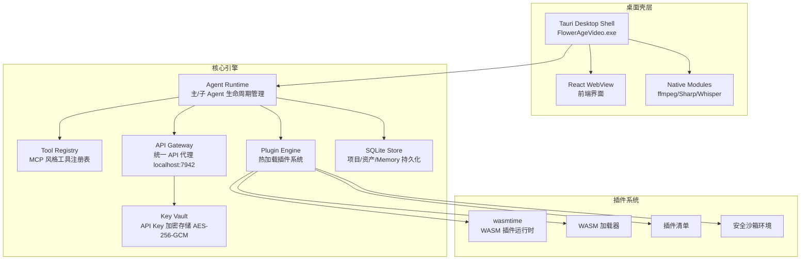
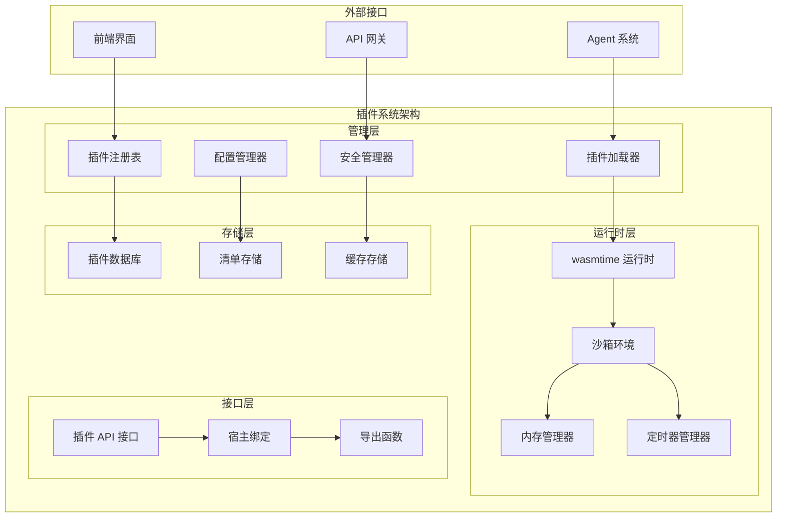
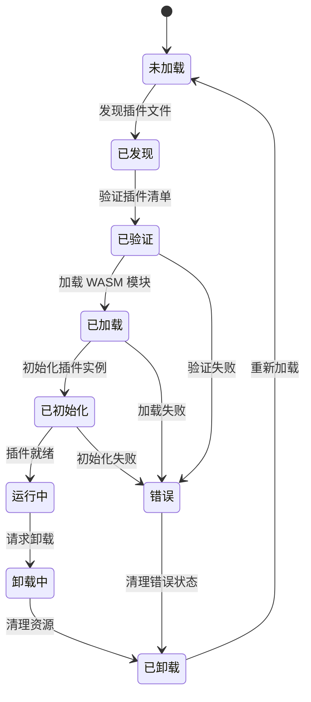
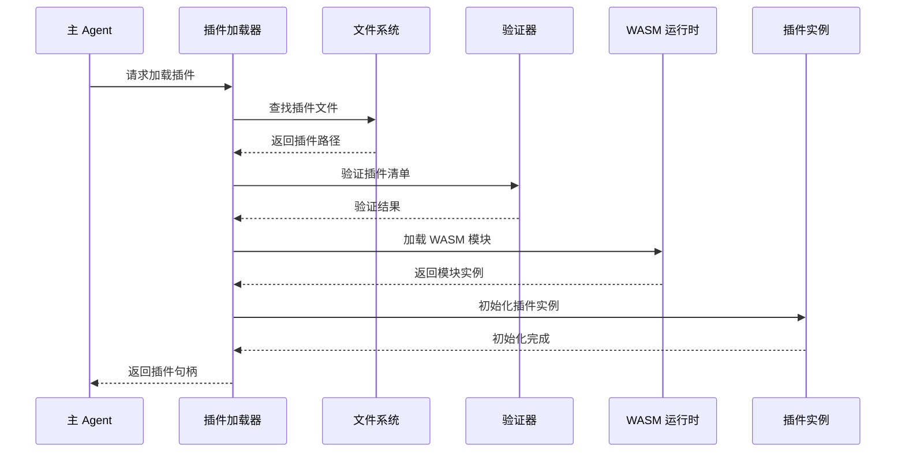
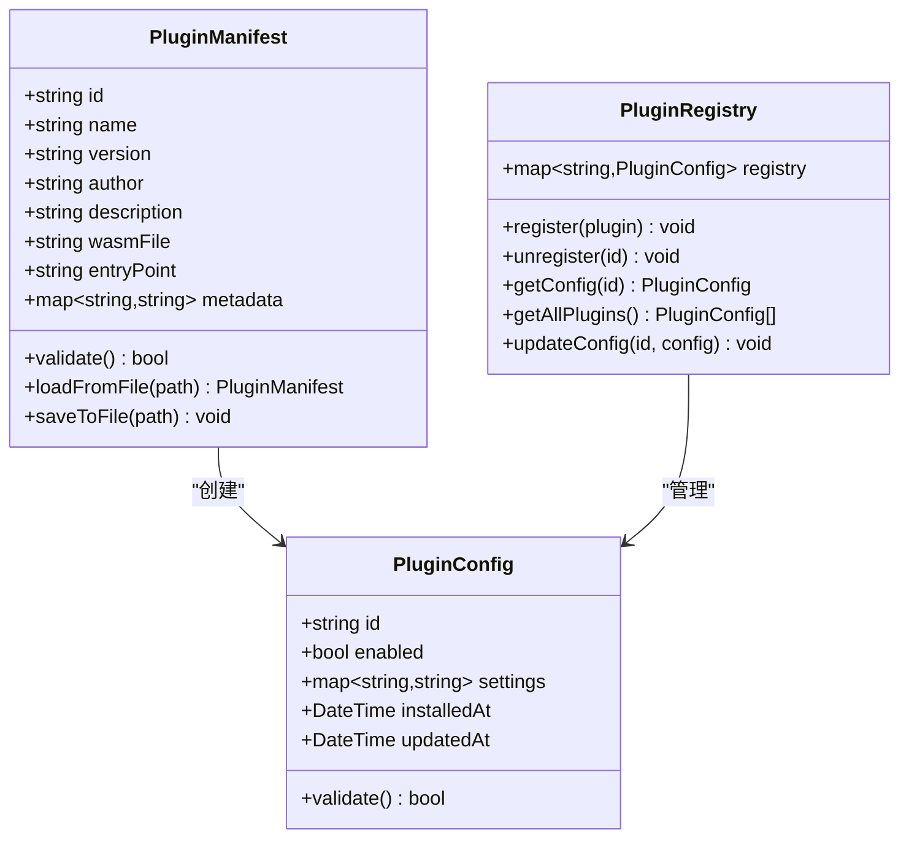
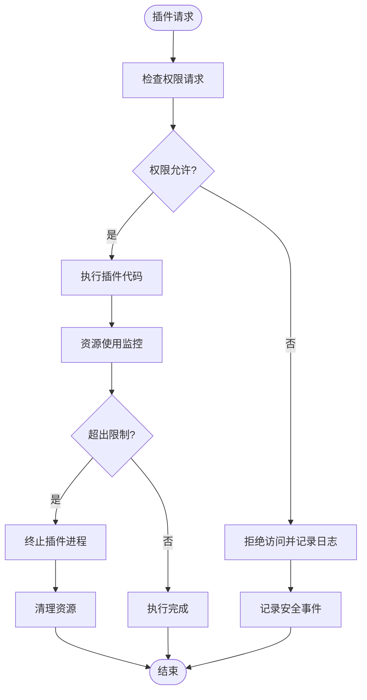
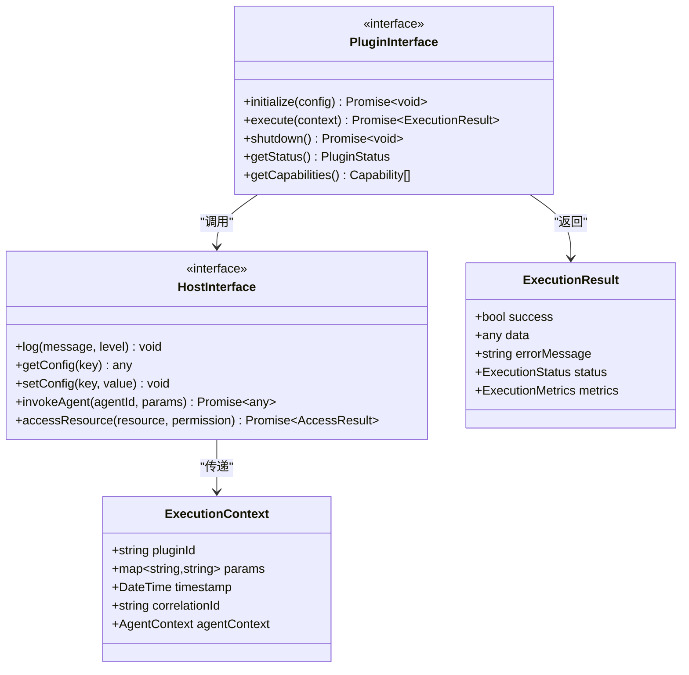
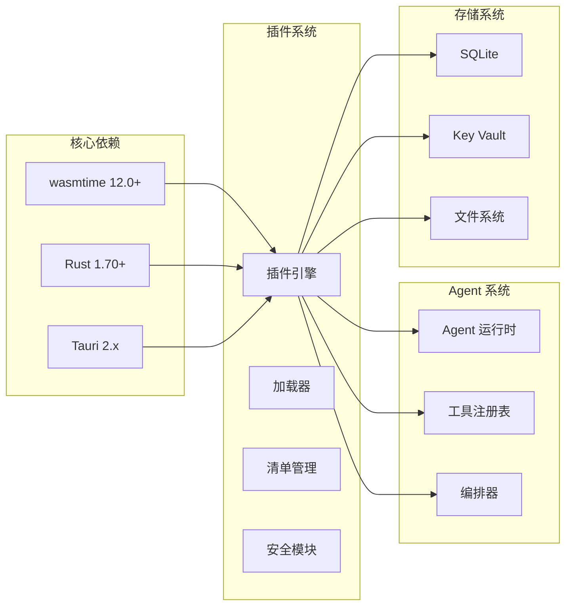

# 插件系统

<cite>
**本文档引用的文件**
- [buzhidaozenmemingmin.md](file://buzhidaozenmemingmin.md)
</cite>

## 目录
1. [简介](#简介)
2. [项目结构](#项目结构)
3. [核心组件](#核心组件)
4. [架构概览](#架构概览)
5. [详细组件分析](#详细组件分析)
6. [依赖分析](#依赖分析)
7. [性能考虑](#性能考虑)
8. [故障排除指南](#故障排除指南)
9. [结论](#结论)
10. [附录](#附录)

## 简介

Flower Age Video 是一款基于 AI 驱动的无限画布创意工作站，采用主 Agent 编排 + 子 Agent 执行的核心架构。该项目的核心创新之一是其基于 WASM 的热加载插件系统，该系统提供了安全沙箱环境中的动态插件扩展能力。

### 核心价值主张

| 维度 | 说明 |
|---|---|
| **零商业侵权** | 全部依赖采用 MIT / Apache-2.0 / BSD 许可证，无 GPL 传染风险 |
| **本地部署** | 单文件 .exe 安装，无需 Docker、无需 Python 环境、无需 Node.js 运行时 |
| **云端 AI** | 用户配置自己的 API Key，本地加密存储，无第三方代理 |
| **无限画布** | 所有资产（图片/视频/音频/文本/分镜）在画布上可视化管理 |
| **主 Agent 控子 Agent** | 1 个编排器拆解任务 → 5 个专业子 Agent 并行/串行执行 |

## 项目结构

Flower Age Video 采用分层架构设计，插件系统位于核心引擎层，与 Agent 运行时、API 网关、Key Vault 等核心组件协同工作。

**图表来源**
- [buzhidaozenmemingmin.md:29-50](file://buzhidaozenmemingmin.md#L29-L50)
- [buzhidaozenmemingmin.md:357-472](file://buzhidaozenmemingmin.md#L357-L472)

**章节来源**
- [buzhidaozenmemingmin.md:27-84](file://buzhidaozenmemingmin.md#L27-L84)
- [buzhidaozenmemingmin.md:354-472](file://buzhidaozenmemingmin.md#L354-L472)

## 核心组件

### 插件引擎架构

插件系统基于 Rust 的 wasmtime WASM 运行时构建，提供以下核心功能：

- **动态加载**：支持 `.wasm` 插件的热加载和卸载
- **安全沙箱**：通过 WASM 运行时提供强隔离环境
- **生命周期管理**：完整的插件生命周期控制
- **API 接口**：标准化的插件接口规范

### 技术栈

| 组件 | 技术 | 许可证 | 说明 |
|---|---|---|---|
| 插件运行时 | **wasmtime** | Apache-2.0 | WASM 插件运行时 |
| 插件系统 | **Rust** | MIT + Apache-2.0 | 核心引擎实现 |
| 桌面框架 | **Tauri 2.x** | MIT + Apache-2.0 | 比 Electron 小 ~90%，Rust 后端 |
| 前端 | **React 18 + Vite** | MIT | 极速 HMR，全链路类型安全 |

**章节来源**
- [buzhidaozenmemingmin.md:112-134](file://buzhidaozenmemingmin.md#L112-L134)
- [buzhidaozenmemingmin.md:124](file://buzhidaozenmemingmin.md#L124)

## 架构概览

### 插件系统整体架构

**图表来源**
- [buzhidaozenmemingmin.md:382-384](file://buzhidaozenmemingmin.md#L382-L384)

### 插件生命周期管理

**图表来源**
- [buzhidaozenmemingmin.md:382-384](file://buzhidaozenmemingmin.md#L382-L384)

## 详细组件分析

### WASM 插件加载器

#### 核心功能

插件加载器负责管理插件的完整生命周期，包括发现、验证、加载、初始化和卸载等阶段。

**图表来源**
- [buzhidaozenmemingmin.md:382-384](file://buzhidaozenmemingmin.md#L382-L384)

#### 加载流程

1. **文件发现**：扫描插件目录，识别 `.wasm` 文件
2. **清单验证**：验证插件清单文件的有效性和完整性
3. **WASM 加载**：使用 wasmtime 运行时加载插件模块
4. **实例初始化**：创建插件实例并建立宿主绑定
5. **资源分配**：分配必要的内存和计算资源

**章节来源**
- [buzhidaozenmemingmin.md:382-384](file://buzhidaozenmemingmin.md#L382-L384)

### 插件清单管理系统

#### 清单结构

插件清单文件定义了插件的基本信息、依赖关系和配置参数。

**图表来源**
- [buzhidaozenmemingmin.md:383-384](file://buzhidaozenmemingmin.md#L383-L384)

#### 配置管理

插件配置管理系统负责维护插件的运行时配置，包括启用状态、参数设置和版本信息。

**章节来源**
- [buzhidaozenmemingmin.md:383-384](file://buzhidaozenmemingmin.md#L383-L384)

### 安全沙箱机制

#### 沙箱隔离

插件在独立的 WASM 实例中运行，享有以下隔离特性：

- **内存隔离**：每个插件拥有独立的内存空间
- **资源限制**：CPU 时间、内存使用、文件访问等限制
- **网络隔离**：默认禁用网络访问，防止恶意行为
- **文件系统隔离**：受限的文件系统访问权限

**图表来源**
- [buzhidaozenmemingmin.md:382-384](file://buzhidaozenmemingmin.md#L382-L384)

#### 错误处理策略

插件系统实现了多层次的错误处理机制：

- **异常捕获**：捕获插件运行时的所有异常
- **资源清理**：确保插件退出时释放所有资源
- **状态恢复**：在错误发生后恢复系统到稳定状态
- **日志记录**：详细记录错误信息用于诊断

**章节来源**
- [buzhidaozenmemingmin.md:382-384](file://buzhidaozenmemingmin.md#L382-L384)

### 插件 API 接口

#### 核心接口规范

插件通过标准化的 API 接口与宿主系统交互：

**图表来源**
- [buzhidaozenmemingmin.md:382-384](file://buzhidaozenmemingmin.md#L382-L384)

#### 资源访问控制

插件只能通过受控的方式访问系统资源：

- **白名单机制**：只有明确授权的资源可以访问
- **权限验证**：每次资源访问都需要权限验证
- **审计日志**：记录所有资源访问行为
- **实时监控**：监控资源使用情况

**章节来源**
- [buzhidaozenmemingmin.md:382-384](file://buzhidaozenmemingmin.md#L382-L384)

## 依赖分析

### 外部依赖

插件系统依赖于以下关键组件：

**图表来源**
- [buzhidaozenmemingmin.md:112-134](file://buzhidaozenmemingmin.md#L112-L134)

### 内部耦合关系

插件系统与核心组件之间存在紧密的耦合关系：

- **Agent 系统集成**：插件可以被 Agent 调用执行特定任务
- **工具注册表**：插件可以注册新的工具供 Agent 使用
- **存储系统**：插件可以访问项目数据和用户配置
- **API 网关**：插件可以调用外部 API 服务

**章节来源**
- [buzhidaozenmemingmin.md:112-134](file://buzhidaozenmemingmin.md#L112-L134)

## 性能考虑

### 内存管理

插件系统的内存管理采用以下策略：

- **内存池管理**：为每个插件分配独立的内存池
- **垃圾回收**：利用 WASM 的垃圾回收机制
- **内存监控**：实时监控插件内存使用情况
- **内存限制**：设置内存使用上限防止内存泄漏

### 并发处理

插件系统支持多插件并发执行：

- **线程隔离**：每个插件在独立的线程中运行
- **资源共享**：通过安全的共享机制实现插件间通信
- **死锁预防**：避免插件间的资源竞争导致死锁
- **性能监控**：监控插件执行性能指标

### 热重载机制

插件系统支持热重载功能：

- **无缝切换**：插件更新时无需重启整个应用
- **状态保持**：在热重载过程中保持必要的状态
- **兼容性检查**：检查新版本插件的兼容性
- **回滚机制**：如果热重载失败，自动回滚到旧版本

## 故障排除指南

### 常见问题诊断

#### 插件加载失败

**症状**：插件无法加载或启动失败

**可能原因**：
- WASM 模块损坏或格式不正确
- 插件清单文件缺失或格式错误
- 依赖库版本不兼容
- 权限不足无法访问必要资源

**解决步骤**：
1. 检查插件文件是否完整
2. 验证插件清单文件格式
3. 确认依赖库版本兼容性
4. 检查文件系统权限

#### 内存泄漏问题

**症状**：插件运行一段时间后内存使用持续增长

**诊断方法**：
1. 使用内存分析工具检查插件内存使用
2. 检查插件是否正确释放资源
3. 验证插件代码是否存在循环引用
4. 监控插件的垃圾回收行为

#### 性能瓶颈

**症状**：插件执行速度慢或响应延迟高

**优化建议**：
1. 分析插件执行时间热点
2. 优化算法复杂度
3. 减少不必要的资源访问
4. 考虑使用缓存机制

### 调试工具

#### 日志系统

插件系统提供详细的日志记录功能：

- **级别分类**：DEBUG/INFO/WARNING/ERROR 等不同级别
- **上下文信息**：包含插件 ID、执行时间戳等信息
- **过滤机制**：支持按级别和插件类型过滤日志
- **持久化存储**：日志文件自动轮转和清理

#### 性能监控

- **执行时间统计**：记录插件执行的关键时间点
- **资源使用监控**：监控 CPU、内存、磁盘使用情况
- **错误率统计**：统计插件错误发生的频率
- **性能报告**：定期生成性能分析报告

**章节来源**
- [buzhidaozenmemingmin.md:382-384](file://buzhidaozenmemingmin.md#L382-L384)

## 结论

Flower Age Video 的插件系统是一个设计精良的基于 WASM 的热加载插件引擎，具有以下显著特点：

### 技术优势

- **安全性**：基于 WASM 的强隔离环境，提供比传统插件系统更高的安全性
- **性能**：原生 Rust 实现，性能优异且内存占用低
- **灵活性**：支持热加载和热卸载，无需重启应用
- **可扩展性**：标准化的 API 接口，易于开发新的插件

### 架构特色

- **分层设计**：清晰的层次结构，便于维护和扩展
- **模块化**：各个组件相对独立，降低耦合度
- **标准化**：统一的接口规范，保证插件的一致性
- **监控完善**：全面的日志和性能监控机制

### 应用前景

插件系统为 Flower Age Video 提供了强大的扩展能力，使得用户可以根据需要添加新的 AI 模型、工具和功能，同时保持系统的稳定性和安全性。

## 附录

### 开发指南

#### 插件开发流程

1. **环境准备**：安装 Rust 工具链和 WebAssembly 工具
2. **项目创建**：使用标准的 Rust crate 模板
3. **接口实现**：实现插件接口规范
4. **测试验证**：在开发环境中测试插件功能
5. **打包发布**：将插件打包为 .wasm 文件

#### 最佳实践

- **错误处理**：始终处理可能出现的异常情况
- **资源管理**：及时释放不再使用的资源
- **性能优化**：避免长时间阻塞操作
- **日志记录**：提供详细的日志信息便于调试

### API 参考

#### 插件接口方法

| 方法 | 参数 | 返回值 | 说明 |
|---|---|---|---|
| initialize | config: PluginConfig | Promise<void> | 初始化插件 |
| execute | context: ExecutionContext | Promise<ExecutionResult> | 执行插件逻辑 |
| shutdown | - | Promise<void> | 清理插件资源 |
| getStatus | - | PluginStatus | 获取插件状态 |
| getCapabilities | - | Capability[] | 获取插件能力列表 |

#### 配置参数

| 参数 | 类型 | 必需 | 默认值 | 说明 |
|---|---|---|---|---|
| id | string | 是 | - | 插件唯一标识符 |
| enabled | boolean | 否 | true | 是否启用插件 |
| settings | map<string,string> | 否 | {} | 插件配置参数 |
| installedAt | DateTime | 否 | 当前时间 | 安装时间戳 |
| updatedAt | DateTime | 否 | 当前时间 | 更新时间戳 |