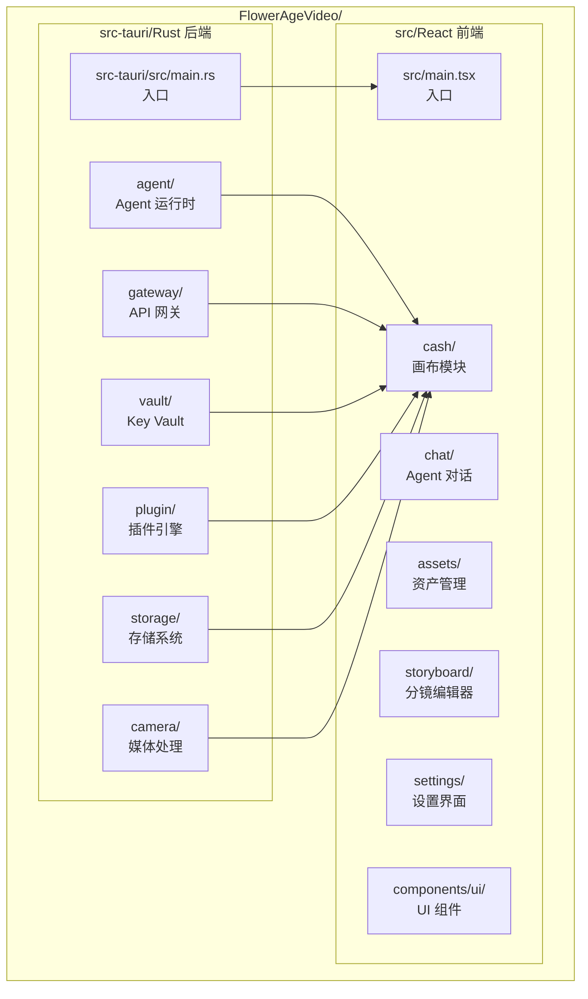
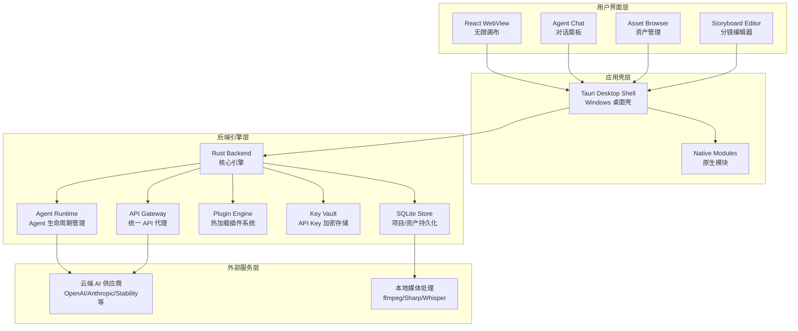
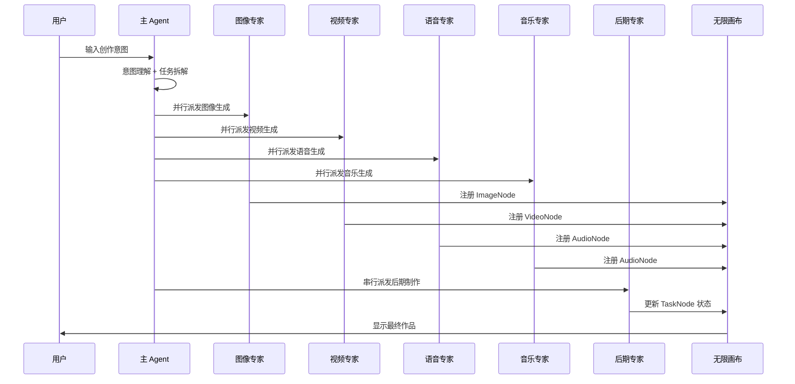
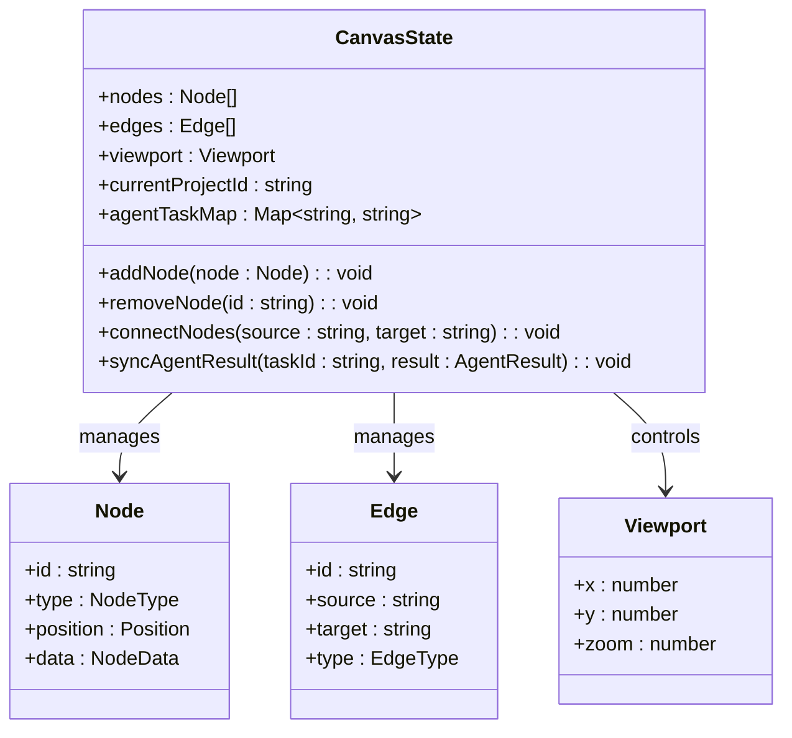
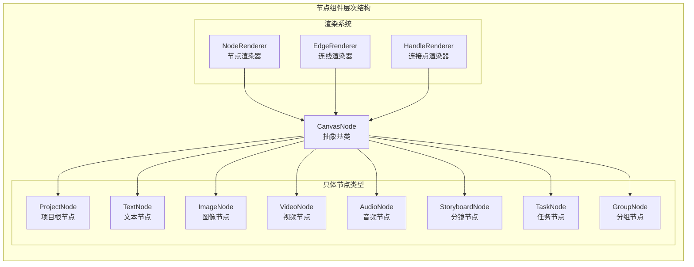
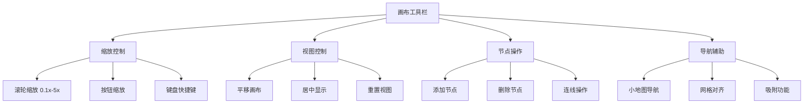

# 无限画布系统

<cite>
**本文档引用的文件**
- [buzhidaozenmemingmin.md](file://buzhidaozenmemingmin.md)
</cite>

## 目录
1. [简介](#简介)
2. [项目结构](#项目结构)
3. [核心组件](#核心组件)
4. [架构概览](#架构概览)
5. [详细组件分析](#详细组件分析)
6. [依赖分析](#依赖分析)
7. [性能考虑](#性能考虑)
8. [故障排除指南](#故障排除指南)
9. [结论](#结论)
10. [附录](#附录)

## 简介

Flower Age Video 是一款基于 Tauri 桌面框架的 AI 驱动无限画布创意工作站。该系统采用 @xyflow/react (React Flow) 实现了真正的无限画布功能，支持无限缩放（0.1x ~ 5x）、拖拽布局、连线关系、分组节点、小地图导航和对齐吸附等高级功能。

系统的核心价值在于为视频创作者、内容生产者和 AI 艺术家提供一个本地化的无限画布环境，通过主 Agent 编排 + 子 Agent 执行的架构模式，实现从创意到成品的全链路自动化创作流程。

## 项目结构

基于设计文档，Flower Age Video 采用模块化的项目结构，主要分为前端 React 应用和后端 Rust 引擎两大部分：



**图表来源**
- [buzhidaozenmemingmin.md: 354-472:354-472](file://buzhidaozenmemingmin.md#L354-L472)

**章节来源**
- [buzhidaozenmemingmin.md: 354-472:354-472](file://buzhidaozenmemingmin.md#L354-L472)

## 核心组件

### 无限画布架构

系统基于 @xyflow/react (React Flow) 实现了完整的无限画布解决方案，具备以下核心特性：

- **无限缩放支持**：0.1x 到 5x 的连续缩放范围
- **自由拖拽**：节点和画布的完全自由拖拽
- **连线关系**：节点间的有向边连接，表达资产依赖关系
- **分组节点**：GroupNode 作为容器收纳相关资产
- **小地图导航**：MiniMap 提供全局导航功能
- **对齐吸附**：拖拽时的自动对齐和吸附效果

### 节点类型系统

系统定义了八种核心节点类型，每种节点都有特定的功能和数据承载能力：

| 节点类型 | 图标 | 功能 | 数据承载 |
|---|---|---|---|
| **ProjectNode** | 📁 | 项目根节点 | 项目名称/描述/创建时间 |
| **TextNode** | 📝 | 文本/脚本/创意 | Markdown 内容 |
| **ImageNode** | 🖼️ | 图像资产 | 缩略图 + 提示词 + 模型 + 尺寸 |
| **VideoNode** | 🎬 | 视频资产 | 预览帧 + 提示词 + 时长 + 分辨率 |
| **AudioNode** | 🎵 | 音频资产 | 波形 + 时长 + 情绪标签 |
| **StoryboardNode** | 🎞️ | 分镜节点 | 镜头号 + 描述 + 时长 + 转场 |
| **TaskNode** | ⚙️ | Agent 任务节点 | 任务状态 + 进度 + Agent 日志 |
| **GroupNode** | 📦 | 分组容器 | 子节点集合 |

**章节来源**
- [buzhidaozenmemingmin.md: 213-238:213-238](file://buzhidaozenmemingmin.md#L213-L238)

## 架构概览

Flower Age Video 采用了分层架构设计，从前端无限画布到后端 Agent 运行时形成了完整的创作生态系统：



**图表来源**
- [buzhidaozenmemingmin.md: 27-64:27-64](file://buzhidaozenmemingmin.md#L27-L64)

### Agent 编排流程

系统采用主 Agent + 子 Agent 的分层架构，实现了确定性的任务编排流程：



**图表来源**
- [buzhidaozenmemingmin.md: 172-190:172-190](file://buzhidaozenmemingmin.md#L172-L190)

**章节来源**
- [buzhidaozenmemingmin.md: 137-211:137-211](file://buzhidaozenmemingmin.md#L137-L211)

## 详细组件分析

### Zustand 状态管理

系统采用 Zustand 作为轻量级状态管理解决方案，实现了画布状态的集中管理：



**图表来源**
- [buzhidaozenmemingmin.md: 239-262:239-262](file://buzhidaozenmemingmin.md#L239-L262)

#### 状态管理 API

系统提供了完整的画布操作 API，包括节点管理、连线关系和视口控制：

- **节点操作**：添加、删除、更新节点
- **连线管理**：建立、修改、删除节点间的关系
- **视口控制**：平移、缩放、重置视图
- **项目上下文**：当前项目状态管理
- **Agent 集成**：任务结果与画布节点的同步

**章节来源**
- [buzhidaozenmemingmin.md: 239-262:239-262](file://buzhidaozenmemingmin.md#L239-L262)

### 画布节点组件

每个节点类型都对应一个专门的 React 组件，负责节点的渲染和交互：



**图表来源**
- [buzhidaozenmemingmin.md: 428-436:428-436](file://buzhidaozenmemingmin.md#L428-L436)

#### 节点数据结构

每种节点类型都有其特定的数据结构和渲染逻辑：

- **ProjectNode**：项目元数据，作为画布的根节点
- **TextNode**：Markdown 内容，支持富文本编辑
- **ImageNode**：图像资产，包含缩略图、提示词和生成参数
- **VideoNode**：视频资产，包含预览帧和时长信息
- **AudioNode**：音频资产，包含波形数据和情感标签
- **StoryboardNode**：分镜头信息，包含镜头编号和转场效果
- **TaskNode**：Agent 任务状态，显示执行进度和日志
- **GroupNode**：分组容器，管理子节点的布局和样式

**章节来源**
- [buzhidaozenmemingmin.md: 226-238:226-238](file://buzhidaozenmemingmin.md#L226-L238)

### 画布工具栏和导航

系统提供了完整的画布工具栏和导航功能：



**图表来源**
- [buzhidaozenmemingmin.md: 215-225:215-225](file://buzhidaozenmemingmin.md#L215-L225)

**章节来源**
- [buzhidaozenmemingmin.md: 437-439:437-439](file://buzhidaozenmemingmin.md#L437-L439)

## 依赖分析

### 技术栈依赖

系统采用了业界标准的技术栈组合，确保了性能和可靠性：

```mermaid
graph TB
subgraph "桌面框架"
A[Tauri 2.x<br/>Rust 桌面框架]
B[WebView2<br/>Windows 内置浏览器]
end
subgraph "前端技术"
C[React 18<br/>组件框架]
D[TypeScript 5.x<br/>类型系统]
E[Vite<br/>构建工具]
F[@xyflow/react<br/>无限画布]
G[Zustand<br/>状态管理]
H[shadcn/ui + Radix<br/>UI 组件]
end
subgraph "后端技术"
I[Rust 异步运行时<br/>Tokio]
J[HTTP 框架<br/>Axum]
K[加密库<br/>Ring + AEAD]
L[数据库<br/>Rusqlite]
end
subgraph "原生模块"
M[ffmpeg-sidecar<br/>媒体处理]
N[image-rs<br/>图像处理]
O[whisper-rs<br/>语音识别]
end
A --> C
A --> I
C --> F
F --> G
I --> K
I --> L
M --> N
M --> O
```

**图表来源**
- [buzhidaozenmemingmin.md: 87-134:87-134](file://buzhidaozenmemingmin.md#L87-L134)

### 第三方服务集成

系统通过 API Gateway 实现了与多家云端 AI 供应商的安全集成：

```mermaid
graph LR
subgraph "API Gateway"
A[统一代理接口<br/>localhost:7942]
end
subgraph "图像生成服务"
B[OpenAI DALL·E 3]
C[Stability AI SD3/SDXL]
D[Midjourney (代理)]
E[即梦/豆包 Seedream]
F[Recraft V3]
end
subgraph "视频生成服务"
G[Runway Gen-3/Gen-4]
H[可灵 Kling 2.x]
I[即梦 Seedance 2.0]
J[MiniMax Video-01]
K[Luma Dream Machine]
end
subgraph "语音合成服务"
L[MiniMax speech-2.8-hd]
M[ElevenLabs Multilingual v2]
N[OpenAI TTS-1/TTS-1-hd]
end
subgraph "音乐生成服务"
O[Suno V4]
P[Udio V2]
Q[MiniMax music-2.6]
end
A --> B
A --> C
A --> D
A --> E
A --> F
A --> G
A --> H
A --> I
A --> J
A --> K
A --> L
A --> M
A --> N
A --> O
A --> P
A --> Q
```

**图表来源**
- [buzhidaozenmemingmin.md: 266-337:266-337](file://buzhidaozenmemingmin.md#L266-L337)

**章节来源**
- [buzhidaozenmemingmin.md: 87-134:87-134](file://buzhidaozenmemingmin.md#L87-L134)

## 性能考虑

### 状态管理优化

Zustand 作为轻量级状态管理库，提供了高性能的状态更新机制：

- **原子化状态**：将状态分割为独立的原子，减少不必要的重渲染
- **选择器模式**：通过 selector 函数精确控制组件订阅的状态片段
- **中间件支持**：支持日志记录、时间旅行调试等开发工具

### 画布渲染优化

无限画布的渲染性能是系统的关键挑战：

- **虚拟化渲染**：只渲染可见区域内的节点和连线
- **增量更新**：基于变更检测的增量状态更新
- **批处理操作**：批量处理节点操作以减少重绘次数
- **缓存策略**：对静态内容进行缓存，避免重复计算

### 内存管理

系统采用了多种内存管理策略：

- **对象池**：复用节点和连线对象，减少垃圾回收压力
- **懒加载**：延迟加载大型媒体资源
- **内存监控**：实时监控内存使用情况，及时释放不需要的对象

## 故障排除指南

### 常见问题诊断

#### 画布渲染问题

**症状**：节点渲染异常或画布卡顿
**可能原因**：
- 状态更新过于频繁
- 节点数量过多导致渲染压力
- 样式计算复杂度过高

**解决方法**：
- 检查状态订阅是否合理
- 实施虚拟化渲染
- 优化节点样式计算

#### Agent 集成问题

**症状**：Agent 结果无法正确同步到画布
**可能原因**：
- IPC 通信中断
- 任务 ID 映射错误
- 数据格式不匹配

**解决方法**：
- 检查 Tauri IPC 配置
- 验证任务 ID 生成逻辑
- 实施数据验证和转换

#### 性能问题

**症状**：应用响应缓慢或内存占用过高
**可能原因**：
- 状态管理不当
- 事件监听器泄漏
- 大量定时器未清理

**解决方法**：
- 使用 React DevTools Profiler 分析
- 实施内存泄漏检测
- 优化事件处理逻辑

**章节来源**
- [buzhidaozenmemingmin.md: 549-594:549-594](file://buzhidaozenmemingmin.md#L549-L594)

## 结论

Flower Age Video 的无限画布系统代表了现代 AI 创意工具的发展方向。通过结合 @xyflow/react 的强大画布能力和 Tauri 的轻量桌面框架，系统实现了真正意义上的无限画布体验。

系统的核心优势包括：

1. **技术架构先进**：基于 React Flow 和 Zustand 的现代化前端架构
2. **Agent 驱动**：主 Agent + 子 Agent 的智能创作流程
3. **本地化部署**：零依赖的单文件安装，隐私安全优先
4. **扩展性强**：支持 WASM 插件和多供应商 API 集成
5. **性能优化**：针对无限画布场景的专门优化

未来的发展方向包括进一步优化画布渲染性能、增强 AI 供应商集成、完善分镜编辑功能以及扩展插件生态系统。

## 附录

### 开发环境配置

系统采用零环境依赖的部署模式，开发者只需准备基本的开发工具：

- **Node.js**：用于前端开发和构建
- **Rust 工具链**：用于后端开发和编译
- **Tauri CLI**：用于桌面应用打包
- **Git**：版本控制系统

### API 参考

系统提供了完整的 API 接口用于与后端 Agent 运行时通信：

- **画布操作 API**：节点增删改查、连线管理、视口控制
- **Agent 通信 API**：任务派发、状态查询、结果同步
- **文件系统 API**：资产读写、项目管理、配置存储

### 最佳实践

- **状态管理**：使用原子化状态设计，避免不必要的重渲染
- **组件设计**：遵循单一职责原则，保持组件简洁
- **错误处理**：实施全面的错误边界和降级策略
- **性能监控**：建立性能指标监控和告警机制