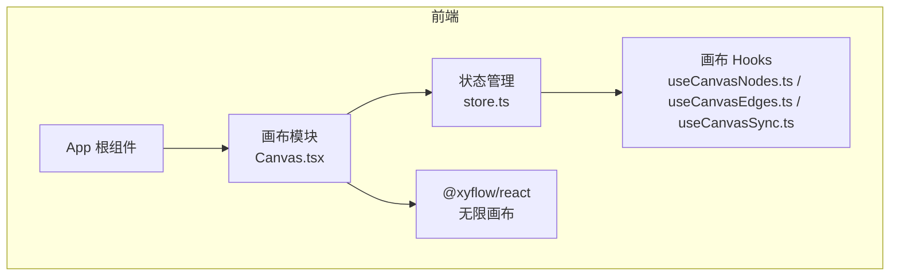
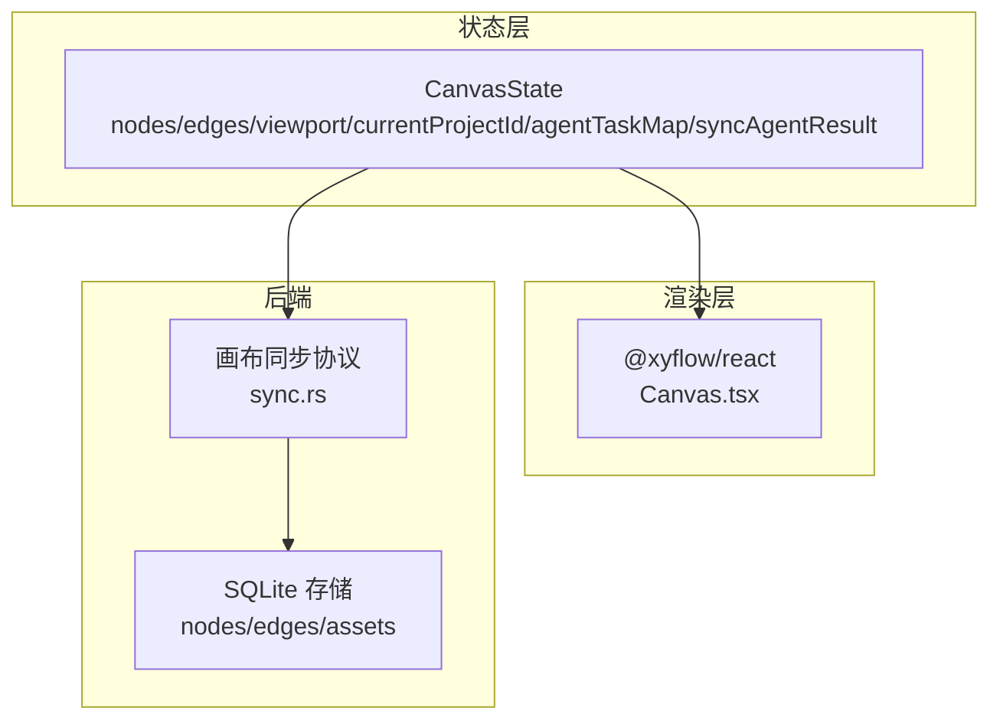
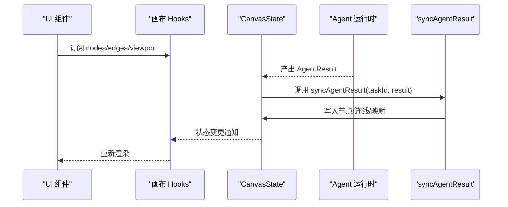
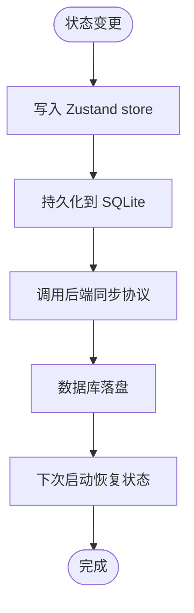
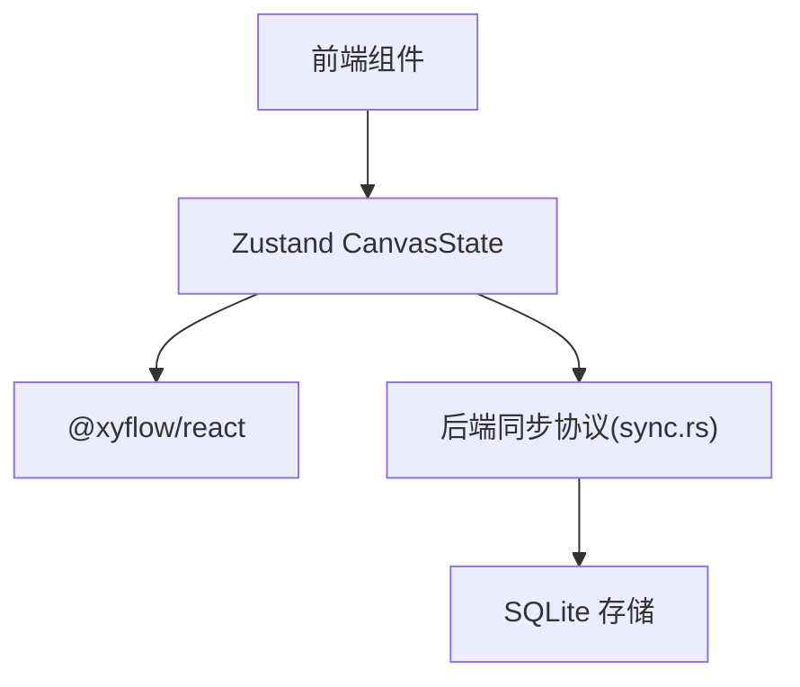

# 状态管理

<cite>
**本文引用的文件**
- [buzhidaozenmemingmin.md](file://buzhidaozenmemingmin.md)
</cite>

## 目录
1. [简介](#简介)
2. [项目结构](#项目结构)
3. [核心组件](#核心组件)
4. [架构总览](#架构总览)
5. [详细组件分析](#详细组件分析)
6. [依赖分析](#依赖分析)
7. [性能考虑](#性能考虑)
8. [故障排查指南](#故障排查指南)
9. [结论](#结论)
10. [附录](#附录)

## 简介
本文件围绕“无限画布”的状态管理系统进行系统化说明，基于文档中给出的 Zustand 状态管理设计，详细阐述画布状态结构、节点状态、边关系状态、视口状态与选择状态的管理机制；同时覆盖状态订阅、状态更新、状态持久化与状态同步策略，并提供状态钩子使用建议、调试方法与性能优化要点，以及状态扩展与最佳实践指导。由于当前仓库仅包含设计文档，本文以文档中的接口定义与架构说明为依据，结合通用 Zustand 最佳实践进行系统化整理。

## 项目结构
- 前端采用 React + TypeScript + Vite，无限画布基于 @xyflow/react（React Flow），状态管理采用 Zustand。
- 项目结构中明确包含画布模块、状态文件与相关 Hooks，用于支撑画布节点、连线、视口与 Agent 集成的统一状态管理。



图表来源
- [buzhidaozenmemingmin.md: 418-471:418-471](file://buzhidaozenmemingmin.md#L418-L471)

章节来源
- [buzhidaozenmemingmin.md: 418-471:418-471](file://buzhidaozenmemingmin.md#L418-L471)

## 核心组件
- CanvasState 接口（Zustand 状态模型）
  - 节点与边：nodes、edges
  - 操作：addNode、removeNode、connectNodes
  - 画布视口：viewport（x、y、zoom）
  - 项目上下文：currentProjectId
  - Agent 集成：agentTaskMap（taskId → nodeId）、syncAgentResult（将 Agent 结果同步到画布）

该接口定义了画布状态的核心字段与行为，是后续状态订阅、更新、持久化与同步的基础契约。

章节来源
- [buzhidaozenmemingmin.md: 239-262:239-262](file://buzhidaozenmemingmin.md#L239-L262)

## 架构总览
- 前端状态层：Zustand store 提供全局状态与动作，负责节点、连线、视口与 Agent 关联的集中管理。
- 画布渲染层：@xyflow/react 负责节点渲染、连线绘制、拖拽缩放与交互。
- 同步与持久化：通过 syncAgentResult 将 Agent 产出自动注册为画布节点；结合后端画布同步协议与 SQLite 存储实现跨会话持久化。



图表来源
- [buzhidaozenmemingmin.md: 239-262:239-262](file://buzhidaozenmemingmin.md#L239-L262)
- [buzhidaozenmemingmin.md: 389-391:389-391](file://buzhidaozenmemingmin.md#L389-L391)
- [buzhidaozenmemingmin.md: 514-527:514-527](file://buzhidaozenmemingmin.md#L514-L527)

## 详细组件分析

### 1) CanvasState 接口与职责
- 节点与边：nodes、edges 作为画布元素的唯一事实来源，所有节点增删改查与连线建立均通过 store 动作完成。
- 操作函数：addNode、removeNode、connectNodes 提供声明式的画布变更入口。
- 视口状态：viewport 提供 x、y、zoom 的统一视口控制，便于跨组件共享与联动。
- 项目上下文：currentProjectId 用于区分不同项目的工作空间，确保状态隔离与切换。
- Agent 集成：agentTaskMap 与 syncAgentResult 将 Agent 任务与画布节点建立映射，实现“产出即节点”的自动化同步。

```mermaid
classDiagram
class CanvasState {
+nodes : Node[]
+edges : Edge[]
+addNode(node) : void
+removeNode(id) : void
+connectNodes(source, target) : void
+viewport : {x : number, y : number, zoom : number}
+currentProjectId : string
+agentTaskMap : Map<string, string>
+syncAgentResult(taskId, result) : void
}
```

图表来源
- [buzhidaozenmemingmin.md: 239-262:239-262](file://buzhidaozenmemingmin.md#L239-L262)

章节来源
- [buzhidaozenmemingmin.md: 239-262:239-262](file://buzhidaozenmemingmin.md#L239-L262)

### 2) 状态订阅与更新流程
- 订阅：组件通过画布 Hooks 订阅 store 的部分状态（如 nodes、edges、viewport），实现按需重渲染。
- 更新：通过 store 动作（addNode/removeNode/connectNodes）触发状态变更，Zustand 自动通知订阅者。
- 同步：syncAgentResult 将 Agent 任务结果转换为画布节点与连线，写入 store 并驱动 UI 更新。



图表来源
- [buzhidaozenmemingmin.md: 239-262:239-262](file://buzhidaozenmemingmin.md#L239-L262)

章节来源
- [buzhidaozenmemingmin.md: 239-262:239-262](file://buzhidaozenmemingmin.md#L239-L262)

### 3) 状态持久化与同步策略
- 本地持久化：SQLite 存储 nodes、edges、assets 等，实现跨会话恢复与版本演进。
- 画布同步协议：后端提供同步协议与节点持久化模块，保障 Agent 产出与画布状态的一致性。
- 状态与存储的双向绑定：store 与后端同步模块协同，保证离线/重启后的状态一致性。



图表来源
- [buzhidaozenmemingmin.md: 389-391:389-391](file://buzhidaozenmemingmin.md#L389-L391)
- [buzhidaozenmemingmin.md: 514-527:514-527](file://buzhidaozenmemingmin.md#L514-L527)

章节来源
- [buzhidaozenmemingmin.md: 389-391:389-391](file://buzhidaozenmemingmin.md#L389-L391)
- [buzhidaozenmemingmin.md: 514-527:514-527](file://buzhidaozenmemingmin.md#L514-L527)

### 4) 状态钩子使用建议
- useCanvasNodes：订阅 nodes，渲染节点列表或节点详情。
- useCanvasEdges：订阅 edges，渲染连线关系。
- useCanvasSync：封装与后端同步协议的交互，统一处理 Agent 结果同步。
- 使用原则：尽量细粒度订阅，避免不必要的重渲染；将复杂逻辑下沉至 store 动作或自定义 Hook。

章节来源
- [buzhidaozenmemingmin.md: 425-427:425-427](file://buzhidaozenmemingmin.md#L425-L427)

### 5) 状态调试与可观测性
- 使用 Zustand DevTools 或日志记录关键动作（如 addNode/removeNode/connectNodes）与状态快照。
- 在 syncAgentResult 中记录 taskId 到节点的映射变化，便于回溯 Agent 产出与画布节点的对应关系。
- 对 viewport 变化进行节流/防抖，避免高频重绘。

章节来源
- [buzhidaozenmemingmin.md: 239-262:239-262](file://buzhidaozenmemingmin.md#L239-L262)

### 6) 状态扩展指南与最佳实践
- 扩展方向
  - 新增节点类型：在 CanvasState 中保持 nodes/edges 的统一入口，新增节点类型的数据结构与渲染组件。
  - 新增视口联动：在 viewport 基础上扩展选择框、对齐吸附、网格吸附等功能。
  - 新增选择状态：引入 selectionIds 与选择事件回调，实现多选与批量操作。
- 最佳实践
  - 将复杂状态计算与副作用封装在 store 动作中，保持 UI 组件的纯函数特性。
  - 使用不可变更新策略或原子化动作，降低订阅范围与重渲染成本。
  - 对 Agent 结果的同步采用幂等写入与去重策略，避免重复节点与环路。
  - 对 SQLite 持久化采用事务写入与增量备份，确保一致性与性能。

章节来源
- [buzhidaozenmemingmin.md: 239-262:239-262](file://buzhidaozenmemingmin.md#L239-L262)
- [buzhidaozenmemingmin.md: 389-391:389-391](file://buzhidaozenmemingmin.md#L389-L391)
- [buzhidaozenmemingmin.md: 514-527:514-527](file://buzhidaozenmemingmin.md#L514-L527)

## 依赖分析
- 技术栈依赖
  - 前端：React、TypeScript、Vite、@xyflow/react、Zustand、shadcn/ui、Tailwind CSS、Framer Motion、Vercel AI SDK。
  - 后端：Rust（axum/tokio）、reqwest、ring、rusqlite、wasmtime、ffmpeg-sidecar、image-rs、symphonia。
- 状态管理耦合
  - CanvasState 与 @xyflow/react 渲染层松耦合，通过 store 动作驱动 UI。
  - 与后端同步协议通过 syncAgentResult 解耦，便于替换与扩展。



图表来源
- [buzhidaozenmemingmin.md: 105-110:105-110](file://buzhidaozenmemingmin.md#L105-L110)
- [buzhidaozenmemingmin.md: 116-124:116-124](file://buzhidaozenmemingmin.md#L116-L124)
- [buzhidaozenmemingmin.md: 239-262:239-262](file://buzhidaozenmemingmin.md#L239-L262)
- [buzhidaozenmemingmin.md: 389-391:389-391](file://buzhidaozenmemingmin.md#L389-L391)

章节来源
- [buzhidaozenmemingmin.md: 105-110:105-110](file://buzhidaozenmemingmin.md#L105-L110)
- [buzhidaozenmemingmin.md: 116-124:116-124](file://buzhidaozenmemingmin.md#L116-L124)
- [buzhidaozenmemingmin.md: 239-262:239-262](file://buzhidaozenmemingmin.md#L239-L262)
- [buzhidaozenmemingmin.md: 389-391:389-391](file://buzhidaozenmemingmin.md#L389-L391)

## 性能考虑
- 订阅粒度：按需订阅最小状态集合，避免全局重渲染。
- 动作幂等：对 addNode/connectNodes 等动作进行去重与冲突检测，减少无效更新。
- 视口优化：对 viewport 变化进行节流/防抖，降低渲染压力。
- 持久化策略：批量写入与事务提交，减少磁盘 IO；对大体量节点/连线采用分页或懒加载。
- 同步策略：在 syncAgentResult 中进行批量合并与去重，避免频繁触发 UI 更新。

## 故障排查指南
- Agent 结果未显示为节点
  - 检查 syncAgentResult 是否被调用且传入正确的 taskId 与 AgentResult。
  - 核对 agentTaskMap 是否正确建立 taskId → nodeId 映射。
- 节点/连线异常
  - 检查 nodes/edges 的数据结构是否符合 @xyflow/react 要求。
  - 确认 connectNodes 的 source/target 是否存在且有效。
- 视口跳变
  - 检查 viewport 的 x/y/z 值是否合理，避免 NaN/无穷大。
  - 对外部视口控制进行节流/防抖。
- 持久化问题
  - 确认 SQLite 写入成功与事务提交。
  - 核对后端同步协议调用顺序与参数。

章节来源
- [buzhidaozenmemingmin.md: 239-262:239-262](file://buzhidaozenmemingmin.md#L239-L262)
- [buzhidaozenmemingmin.md: 389-391:389-391](file://buzhidaozenmemingmin.md#L389-L391)
- [buzhidaozenmemingmin.md: 514-527:514-527](file://buzhidaozenmemingmin.md#L514-L527)

## 结论
本文件基于设计文档中的 CanvasState 接口与架构说明，系统梳理了无限画布状态管理的设计理念与实现要点。通过 Zustand 的轻量与高性能特性，结合 @xyflow/react 的渲染能力与后端同步协议，实现了节点、连线、视口与 Agent 集成的统一状态管理。遵循本文的状态订阅、更新、持久化与同步策略，配合调试与性能优化方法，可为后续扩展与维护提供清晰的路径。

## 附录
- 相关文件与位置
  - CanvasState 接口定义与画布模块结构：[buzhidaozenmemingmin.md: 239-262, 418-471:239-262](file://buzhidaozenmemingmin.md#L239-L262)
  - 后端画布同步与存储：[buzhidaozenmemingmin.md: 389-391, 514-527:389-391](file://buzhidaozenmemingmin.md#L389-L391)