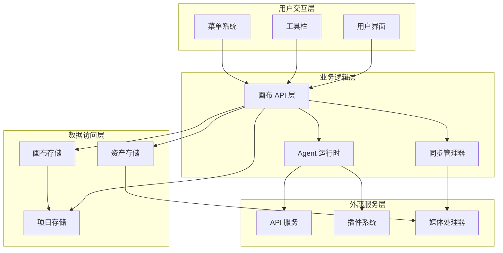
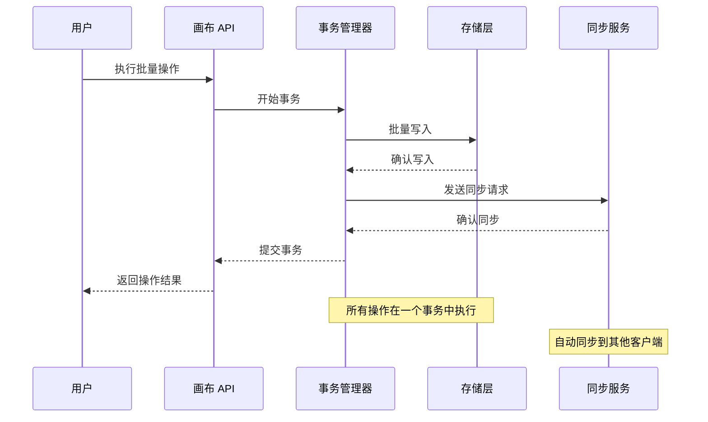
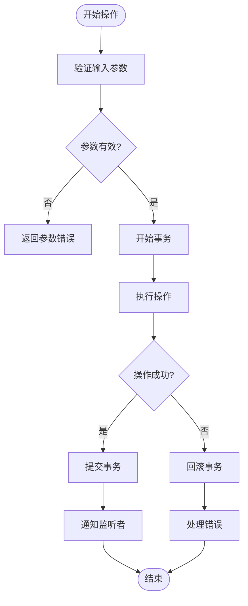

# 画布操作 API

<cite>
**本文档引用的文件**
- [buzhidaozenmemingmin.md](file://buzhidaozenmemingmin.md)
</cite>

## 目录
1. [简介](#简介)
2. [项目结构概览](#项目结构概览)
3. [核心组件](#核心组件)
4. [架构概览](#架构概览)
5. [详细组件分析](#详细组件分析)
6. [依赖分析](#依赖分析)
7. [性能考虑](#性能考虑)
8. [故障排除指南](#故障排除指南)
9. [结论](#结论)

## 简介

Flower Age Video 是一款基于 Tauri 桌面框架的 AI 驱动无限画布创意工作站。该系统提供了完整的无限画布功能，支持节点创建/删除/更新、边创建/删除、画布缩放/平移、节点选择/取消选择、分组/取消分组、复制/粘贴、导入/导出等操作。

系统采用主 Agent 编排 + 子 Agent 执行的架构模式，所有生成的资产都会自动注册到画布节点中，形成完整的创作工作流。

## 项目结构概览

基于设计文档，系统采用前后端分离的架构：

```mermaid
graph TB
subgraph "桌面壳层"
Tauri[Tauri Desktop Shell<br/>FlowerAgeVideo.exe]
end
subgraph "后端服务"
Rust[Rust Backend<br/>核心引擎]
AgentRuntime[Agent Runtime<br/>主/子 Agent 生命周期管理]
APIGateway[API Gateway<br/>统一 API 代理]
PluginEngine[Plugin Engine<br/>热加载插件系统]
KeyVault[Key Vault<br/>API Key 加密存储]
SQLiteStore[SQLite Store<br/>项目/资产/Memory 持久化]
end
subgraph "前端界面"
ReactWebView[React WebView]
InfiniteCanvas[Infinite Canvas<br/>@xyflow/react 无限画布]
AgentChat[Agent Chat<br/>主 Agent 对话面板]
AssetBrowser[Asset Browser<br/>资产管理浏览器]
StoryboardEditor[Storyboard Editor<br/>分镜编辑器]
Settings[Settings<br/>模型/API/偏好设置]
end
subgraph "原生模块"
FFmpeg[ffmpeg (内置)]
Sharp[Sharp (Rust)]
Whisper[Whisper (可选)]
end
Tauri --> Rust
Rust --> AgentRuntime
Rust --> APIGateway
Rust --> PluginEngine
Rust --> KeyVault
Rust --> SQLiteStore
Tauri --> ReactWebView
ReactWebView --> InfiniteCanvas
ReactWebView --> AgentChat
ReactWebView --> AssetBrowser
ReactWebView --> StoryboardEditor
ReactWebView --> Settings
Rust --> FFmpeg
Rust --> Sharp
Rust --> Whisper
```

**图表来源**
- [buzhidaozenmemingmin.md:29-50](file://buzhidaozenmemingmin.md#L29-L50)
- [buzhidaozenmemingmin.md:52-65](file://buzhidaozenmemingmin.md#L52-L65)

**章节来源**
- [buzhidaozenmemingmin.md:27-65](file://buzhidaozenmemingmin.md#L27-L65)

## 核心组件

### 无限画布核心架构

系统基于 @xyflow/react (React Flow) 实现无限画布，支持以下核心功能：

- **无限缩放**：0.1x ~ 5x，鼠标滚轮控制
- **拖拽布局**：自由拖拽节点
- **连线关系**：节点间有向边，表达资产依赖
- **分组节点**：Group Node 收纳相关资产
- **小地图**：MiniMap 全局导航
- **对齐吸附**：拖拽自动吸附对齐

### 节点类型系统

系统支持多种节点类型，每种节点承载不同的数据内容：

| 节点类型 | 图标 | 功能 | 数据承载 |
|---|---|---|---|
| **ProjectNode** | 📁 | 项目根节点 | 项目名称/描述/创建时间 |
| **TextNode** | 📝 | 文本/脚本/创意 | Markdown 内容 |
| **ImageNode** | 🖼️ | 图像资产 | 缩略图 + 提示词 + 模型 + 尺寸 |
| **VideoNode** | 🎬 | 视频资产 | 预览帧 + 提示词 + 时长 + 分辨率 |
| **AudioNode** | 🎵 | 音频资产 | 波形 + 时长 + 情绪标签 |
| **StoryboardNode** | 🎞️ | 分镜节点 | 镜头号 + 描述 + 时长 + 转场 |
| **TaskNode** | ⚙️ | Agent 任务节点 | 任务状态 + 进度 + Agent 日志 |
| **GroupNode** | 📦 | 分组容器 | 子节点集合 |

### 状态管理架构

画布状态管理采用 Zustand 实现，提供响应式的状态管理：

```mermaid
classDiagram
class CanvasState {
+nodes : Node[]
+edges : Edge[]
+viewport : {x : number, y : number, zoom : number}
+currentProjectId : string
+agentTaskMap : Map~string, string~
+addNode(node : Node) void
+removeNode(id : string) void
+connectNodes(source : string, target : string) void
+syncAgentResult(taskId : string, result : AgentResult) void
}
class Node {
+id : string
+type : string
+position : {x : number, y : number}
+data : any
}
class Edge {
+id : string
+source : string
+target : string
+type : string
}
CanvasState --> Node : manages
CanvasState --> Edge : manages
Node --> Edge : connects to
```

**图表来源**
- [buzhidaozenmemingmin.md:241-262](file://buzhidaozenmemingmin.md#L241-L262)

**章节来源**
- [buzhidaozenmemingmin.md:213-262](file://buzhidaozenmemingmin.md#L213-L262)

## 架构概览

系统采用分层架构，从底层基础设施到顶层应用功能：



**图表来源**
- [buzhidaozenmemingmin.md:137-190](file://buzhidaozenmemingmin.md#L137-L190)

## 详细组件分析

### 画布操作 API 设计

基于设计文档，系统提供了完整的画布操作接口。以下是主要的 API 分类：

#### 节点操作 API

**节点创建**
- `addNode(node: Node): void` - 添加新节点到画布
- `addNodes(nodes: Node[]): void` - 批量添加节点
- 参数：节点对象，包含 id、type、position、data 等属性
- 返回：无（void）
- 使用场景：从 Agent 生成结果创建画布节点

**节点删除**
- `removeNode(id: string): void` - 删除指定节点
- `removeNodes(ids: string[]): void` - 批量删除节点
- 参数：节点 ID 或 ID 数组
- 返回：无（void）
- 使用场景：清理无效节点或用户手动删除

**节点更新**
- `updateNode(id: string, updates: Partial<Node>): void` - 更新节点属性
- `updateNodes(updates: Array<{id: string, updates: Partial<Node>}>): void` - 批量更新节点
- 参数：节点 ID 和更新对象
- 返回：无（void）
- 使用场景：修改节点位置、状态或数据

#### 边操作 API

**边创建**
- `addEdge(edge: Edge): void` - 添加连接边
- `addEdges(edges: Edge[]): void` - 批量添加边
- 参数：边对象，包含 source、target、type 等属性
- 返回：无（void）
- 使用场景：建立节点间的依赖关系

**边删除**
- `removeEdge(id: string): void` - 删除指定边
- `removeEdges(ids: string[]): void` - 批量删除边
- 参数：边 ID 或 ID 数组
- 返回：无（void）
- 使用场景：移除无效连接或用户手动删除

#### 画布视口操作 API

**缩放控制**
- `setZoom(zoom: number): void` - 设置缩放级别
- `zoomIn(factor?: number): void` - 放大
- `zoomOut(factor?: number): void` - 缩小
- `fitView(options?: FitViewOptions): void` - 适应视图
- 参数：缩放因子或视图选项
- 返回：无（void）
- 使用场景：用户手动缩放或自动适配

**平移控制**
- `setViewport(viewport: Viewport): void` - 设置视口位置
- `pan(dx: number, dy: number): void` - 平移
- `centerOnNode(id: string): void` - 定位到节点
- 参数：坐标偏移或节点 ID
- 返回：无（void）
- 使用场景：导航到特定区域或节点

#### 选择操作 API

**节点选择**
- `selectNode(id: string): void` - 选择单个节点
- `selectNodes(ids: string[]): void` - 选择多个节点
- `clearSelection(): void` - 清空选择
- 参数：节点 ID 或 ID 数组
- 返回：无（void）
- 使用场景：用户交互选择或批量操作

**选择状态管理**
- `getSelectedNodes(): string[]` - 获取当前选择的节点 ID
- `isNodeSelected(id: string): boolean` - 检查节点是否被选择
- 返回：节点 ID 数组或布尔值
- 使用场景：获取选择状态或验证选择

#### 分组操作 API

**分组管理**
- `addGroup(groupId: string, nodeIds: string[]): void` - 创建分组
- `ungroup(groupId: string): void` - 取消分组
- `moveToGroup(nodeId: string, groupId: string): void` - 移动节点到分组
- 参数：分组 ID 和节点 ID 列表
- 返回：无（void）
- 使用场景：组织相关资产或创建逻辑分组

#### 复制粘贴操作 API

**复制操作**
- `copySelection(): ClipboardData` - 复制选中内容
- `copyNode(id: string): ClipboardData` - 复制单个节点
- 返回：剪贴板数据对象
- 使用场景：准备复制内容

**粘贴操作**
- `pasteClipboard(data: ClipboardData, position?: Position): void` - 粘贴内容
- `pasteNode(data: ClipboardData, position?: Position): Node` - 粘贴单个节点
- 参数：剪贴板数据和可选位置
- 返回：粘贴的节点或无（void）
- 使用场景：批量创建相似节点

#### 导入导出操作 API

**数据导入**
- `importFromJSON(json: string): ImportResult` - 从 JSON 导入
- `importFromFile(file: File): Promise<ImportResult>` - 从文件导入
- 返回：导入结果对象
- 使用场景：恢复备份或共享画布

**数据导出**
- `exportToJSON(): string` - 导出为 JSON
- `exportToFile(format: ExportFormat): Promise<File>` - 导出为文件
- 返回：JSON 字符串或文件对象
- 使用场景：备份数据或分享作品

### API 调用时机和事务处理

系统采用事务性操作确保数据一致性：



**图表来源**
- [buzhidaozenmemingmin.md:172-190](file://buzhidaozenmemingmin.md#L172-L190)

### 错误处理机制

系统提供完善的错误处理和回滚机制：



**图表来源**
- [buzhidaozenmemingmin.md:172-190](file://buzhidaozenmemingmin.md#L172-L190)

**章节来源**
- [buzhidaozenmemingmin.md:213-262](file://buzhidaozenmemingmin.md#L213-L262)

## 依赖分析

系统采用模块化的依赖管理：

```mermaid
graph TB
subgraph "前端依赖"
XYFlow[@xyflow/react<br/>无限画布核心]
Zustand[Zustand<br/>状态管理]
React[React 18<br/>UI 框架]
TS[TypeScript 5.x<br/>类型系统]
end
subgraph "后端依赖"
Tauri[Tauri 2.x<br/>桌面框架]
Axum[Axum<br/>HTTP 框架]
Tokio[Tokio<br/>异步运行时]
Rusqlite[Rusqlite<br/>SQLite 操作]
end
subgraph "AI 服务依赖"
OpenAI[OpenAI API]
Anthropic[Anthropic API]
Stability[Stability API]
Minimax[Minimax API]
end
subgraph "原生模块"
FFmpeg[ffmpeg-sidecar<br/>媒体处理]
ImageRS[image-rs<br/>图像处理]
Whisper[whisper-rs<br/>语音识别]
end
XYFlow --> Zustand
Zustand --> React
Tauri --> Axum
Axum --> Rusqlite
OpenAI --> Tauri
Anthropic --> Tauri
Stability --> Tauri
Minimax --> Tauri
FFmpeg --> Tauri
ImageRS --> Tauri
Whisper --> Tauri
```

**图表来源**
- [buzhidaozenmemingmin.md:87-134](file://buzhidaozenmemingmin.md#L87-L134)

**章节来源**
- [buzhidaozenmemingmin.md:87-134](file://buzhidaozenmemingmin.md#L87-L134)

## 性能考虑

### 状态管理优化

系统采用 Zustand 实现高性能状态管理：

- **原子化状态更新**：最小化不必要的重渲染
- **选择器模式**：按需订阅状态变化
- **immer 不变性**：自动处理状态不可变性

### 渲染性能优化

- **虚拟滚动**：大量节点时使用虚拟化
- **增量更新**：只更新发生变化的部分
- **防抖节流**：复杂操作使用防抖节流

### 数据持久化优化

- **批量写入**：事务性批量操作
- **增量同步**：只同步变化的数据
- **压缩存储**：大对象使用压缩存储

## 故障排除指南

### 常见问题和解决方案

**画布操作异常**
- 检查节点 ID 是否存在
- 验证边的源目标节点是否有效
- 确认权限和约束条件

**同步问题**
- 检查网络连接状态
- 验证 API Key 配置
- 查看同步队列状态

**性能问题**
- 减少同时操作的节点数量
- 使用批量操作而非逐个操作
- 清理不需要的历史数据

**数据丢失**
- 检查自动保存设置
- 验证备份策略
- 检查存储空间

**章节来源**
- [buzhidaozenmemingmin.md:172-190](file://buzhidaozenmemingmin.md#L172-L190)

## 结论

Flower Age Video 的无限画布系统提供了完整的创意工作流支持。通过基于 @xyflow/react 的无限画布架构、Zustand 状态管理和 Tauri 桌面框架，系统实现了高性能、易用性和可扩展性的平衡。

系统的核心优势包括：
- **完整的 API 生态**：覆盖画布操作的所有核心功能
- **事务性操作**：确保数据一致性和可靠性
- **模块化设计**：便于扩展和维护
- **性能优化**：针对大规模数据场景进行优化
- **安全性保障**：本地部署和加密存储

该系统为视频创作者、内容生产者和 AI 艺术家提供了一个强大而灵活的创作平台，支持从概念到成品的完整创作流程。