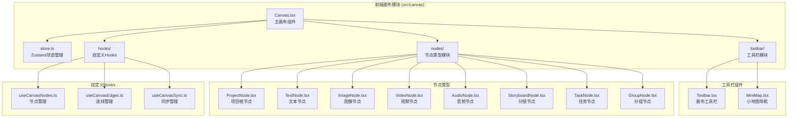
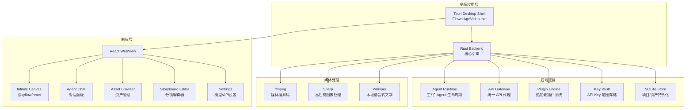
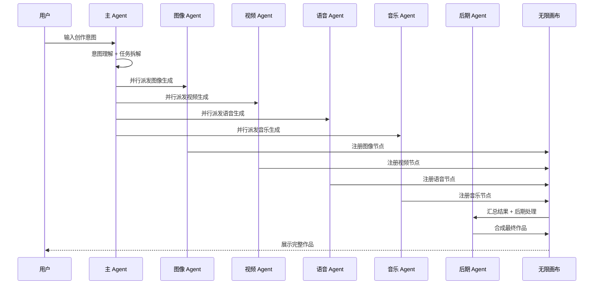
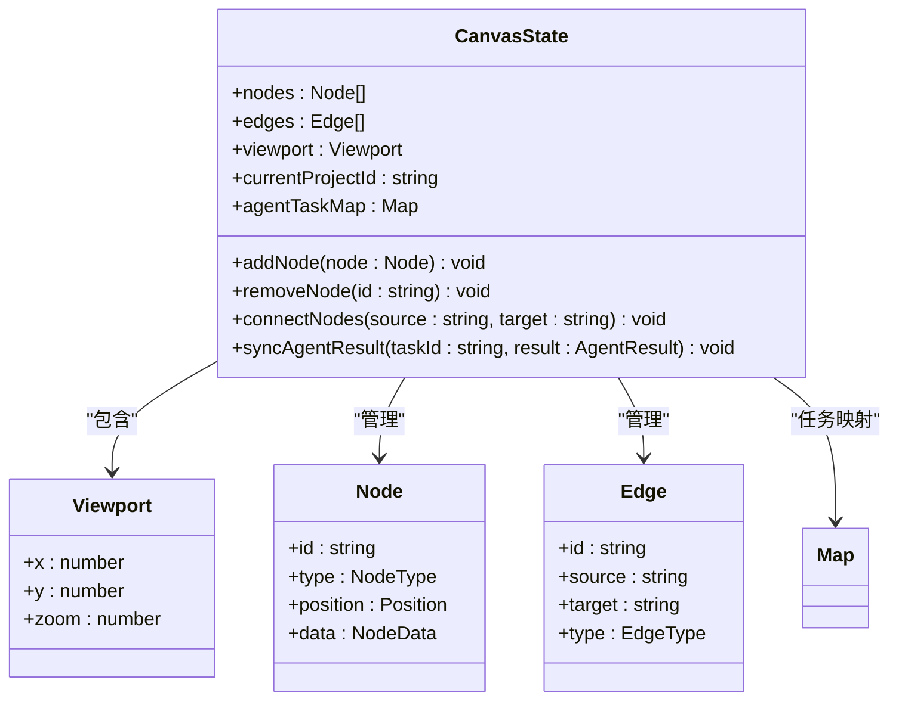

# 画布核心设计

<cite>
**本文档引用的文件**
- [buzhidaozenmemingmin.md](file://buzhidaozenmemingmin.md)
</cite>

## 目录
1. [简介](#简介)
2. [项目结构](#项目结构)
3. [核心组件](#核心组件)
4. [架构概览](#架构概览)
5. [详细组件分析](#详细组件分析)
6. [依赖分析](#依赖分析)
7. [性能考虑](#性能考虑)
8. [故障排除指南](#故障排除指南)
9. [结论](#结论)
10. [附录](#附录)

## 简介

Flower Age Video 是一款基于 Tauri 桌面壳的 AI 驱动无限画布创意工作站。该项目采用主 Agent 编排 + 子 Agent 执行的架构模式，结合 TapCanvas Pro 的无限画布设计和字字画布的插件系统理念，为视频创作者、内容生产者和 AI 艺术家提供了一个功能强大的本地化创作环境。

本项目的核心创新在于将行业标准的无限画布解决方案与 AI Agent 协作系统深度集成，实现了真正的"无限画布"体验，支持无限缩放、拖拽布局、连线关系、分组节点、小地图导航和对齐吸附等高级功能。

## 项目结构

基于项目文档分析，Flower Age Video 的前端画布模块采用模块化组织方式，主要包含以下核心目录结构：



**图表来源**
- [buzhidaozenmemingmin.md:418-472](file://buzhidaozenmemingmin.md#L418-L472)

**章节来源**
- [buzhidaozenmemingmin.md:418-472](file://buzhidaozenmemingmin.md#L418-L472)

## 核心组件

### 无限画布架构设计

基于 @xyflow/react 的无限画布系统采用了业界标准的无限画布架构，支持以下核心功能：

- **无限缩放机制**：支持 0.1x 到 5x 的连续缩放范围，通过鼠标滚轮实现精确的缩放控制
- **拖拽布局**：自由拖拽节点进行布局调整，支持节点间的层级管理和空间优化
- **连线关系**：节点间有向边连接，用于表达资产依赖关系和工作流程
- **分组节点**：Group Node 收纳相关资产，支持复杂的层次化组织结构
- **小地图导航**：MiniMap 全局导航功能，提供画布的整体视图和快速定位
- **对齐吸附**：拖拽时的自动对齐和吸附功能，提升布局精度

### 节点类型系统

画布系统定义了八种核心节点类型，每种节点都有特定的功能和数据承载能力：

| 节点类型 | 图标 | 功能 | 数据承载 |
|---|---|---|---|
| **ProjectNode** | 📁 | 项目根节点 | 项目名称/描述/创建时间 |
| **TextNode** | 📝 | 文本/脚本/创意 | Markdown 内容 |
| **ImageNode** | 🖼️ | 图像资产 | 缩略图 + 提示词 + 模型 + 尺寸 |
| **VideoNode** | 🎬 | 视频资产 | 预览帧 + 提示词 + 时长 + 分辨率 |
| **AudioNode** | 🎵 | 音频资产 | 波形 + 时长 + 情绪标签 |
| **StoryboardNode** | 🎞️ | 分镜节点 | 镜头号 + 描述 + 时长 + 转场 |
| **TaskNode** | ⚙️ | Agent 任务节点 | 任务状态 + 进度 + Agent 日志 |
| **GroupNode** | 📦 | 分组容器 | 子节点集合 |

**章节来源**
- [buzhidaozenmemingmin.md:213-238](file://buzhidaozenmemingmin.md#L213-L238)

## 架构概览

### 整体架构设计



**图表来源**
- [buzhidaozenmemingmin.md:27-50](file://buzhidaozenmemingmin.md#L27-L50)

### Agent 协作流程



**图表来源**
- [buzhidaozenmemingmin.md:172-190](file://buzhidaozenmemingmin.md#L172-L190)

**章节来源**
- [buzhidaozenmemingmin.md:27-83](file://buzhidaozenmemingmin.md#L27-L83)

## 详细组件分析

### 画布状态管理系统

基于 Zustand 的画布状态管理提供了完整的状态控制机制：



**图表来源**
- [buzhidaozenmemingmin.md:239-262](file://buzhidaozenmemingmin.md#L239-L262)

### 画布初始化配置

无限画布的初始化配置包含了丰富的自定义选项，确保了良好的用户体验和性能表现：

#### 视口控制配置
- **缩放范围**：0.1x 到 5x 的连续缩放范围
- **缩放步进**：通过鼠标滚轮实现精确的缩放控制
- **平移限制**：支持无限空间内的自由移动
- **视口重置**：提供视口重置到默认位置的功能

#### 渲染优化配置
- **节点缓存**：启用节点渲染缓存机制
- **批量更新**：支持批量节点更新以减少重绘
- **虚拟化**：对大量节点进行虚拟化处理
- **延迟加载**：按需加载节点内容

#### 交互行为配置
- **拖拽灵敏度**：可调节的拖拽响应速度
- **对齐吸附**：智能的节点对齐和吸附功能
- **选择模式**：支持单选、多选和框选
- **快捷键支持**：提供丰富的键盘快捷键操作

**章节来源**
- [buzhidaozenmemingmin.md:213-225](file://buzhidaozenmemingmin.md#L213-L225)

### 节点类型实现

#### 项目节点 (ProjectNode)
项目根节点作为整个画布的组织中心，承载着项目的基本信息和元数据。

#### 文本节点 (TextNode)
支持 Markdown 内容的文本节点，适用于脚本、创意说明和项目文档的管理。

#### 图像节点 (ImageNode)
专门用于管理图像资产的节点类型，包含缩略图、提示词、模型信息和尺寸数据。

#### 视频节点 (VideoNode)
视频资产节点，提供预览帧、时长、分辨率等视频相关信息的展示和管理。

#### 音频节点 (AudioNode)
音频资产节点，支持波形显示、时长统计和情绪标签等音频特征的可视化。

#### 分镜节点 (StoryboardNode)
分镜编辑专用节点，包含镜头编号、描述、时长和转场效果等影视制作相关信息。

#### 任务节点 (TaskNode)
Agent 任务节点，用于跟踪和展示各个子 Agent 的执行状态、进度和日志信息。

#### 分组节点 (GroupNode)
分组容器节点，支持将相关的子节点进行逻辑分组，便于复杂项目的组织管理。

**章节来源**
- [buzhidaozenmemingmin.md:226-238](file://buzhidaozenmemingmin.md#L226-L238)

### 工具栏与导航组件

#### 画布工具栏 (Toolbar)
提供画布操作的核心工具集，包括缩放控制、视图切换、节点操作等功能按钮。

#### 小地图导航 (MiniMap)
全局导航组件，提供画布的整体视图和快速定位功能，支持实时同步画布视口位置。

**章节来源**
- [buzhidaozenmemingmin.md:437-439](file://buzhidaozenmemingmin.md#L437-L439)

## 依赖分析

### 技术栈依赖

```mermaid
graph TB
subgraph "前端框架"
A[React 18<br/>成熟生态]
B[TypeScript 5.x<br/>全链路类型安全]
C[Vite<br/>极速 HMR]
end
subgraph "画布核心"
D[@xyflow/react<br/>React Flow]
E[Zustand<br/>轻量状态管理]
end
subgraph "UI组件"
F[shadcn/ui + Radix<br/>无运行时依赖]
G[Tailwind CSS<br/>原子化CSS]
H[Framer Motion<br/>声明式动画]
end
subgraph "AI集成"
I[@ai-sdk/react<br/>多LLM供应商支持]
end
subgraph "桌面框架"
J[Tauri 2.x<br/>Rust后端]
end
A --> D
A --> E
A --> F
A --> G
A --> H
A --> I
J --> A
```

**图表来源**
- [buzhidaozenmemingmin.md:87-134](file://buzhidaozenmemingmin.md#L87-L134)

### 许可证兼容性

项目采用完全开源的 MIT + Apache-2.0 许可证组合，确保了商业使用的安全性：

| 组件 | 许可证 | 商业使用 | 修改分发 | 传染性 |
|---|---|---|---|---|
| Tauri | MIT + Apache-2.0 | ✅ | ✅ | ❌ |
| React | MIT | ✅ | ✅ | ❌ |
| @xyflow/react | MIT | ✅ | ✅ | ❌ |
| Zustand | MIT | ✅ | ✅ | ❌ |
| shadcn/ui | MIT | ✅ | ✅ | ❌ |
| Tailwind CSS | MIT | ✅ | ✅ | ❌ |
| Framer Motion | MIT | ✅ | ✅ | ❌ |
| Vercel AI SDK | Apache-2.0 | ✅ | ✅ | ❌ |

**章节来源**
- [buzhidaozenmemingmin.md:596-621](file://buzhidaozenmemingmin.md#L596-L621)

## 性能考虑

### 渲染性能优化

无限画布系统在设计时充分考虑了性能优化，采用了多种策略来确保流畅的用户体验：

#### 虚拟化技术
- **节点虚拟化**：对大量节点进行虚拟化处理，只渲染可见区域内的节点
- **连线优化**：智能计算连线的可见性，避免不必要的渲染
- **增量更新**：支持增量更新机制，减少全量重绘的频率

#### 内存管理
- **对象池**：复用节点和连线对象，减少垃圾回收压力
- **懒加载**：按需加载节点内容，避免一次性加载过多数据
- **缓存策略**：合理利用缓存机制，平衡内存占用和性能

#### 并行处理
- **Web Workers**：利用 Web Workers 进行后台计算
- **异步渲染**：采用异步渲染策略，避免阻塞主线程
- **批处理**：将多个操作合并为批处理，提高执行效率

### 用户体验优化

#### 响应式设计
- **自适应缩放**：根据屏幕尺寸自动调整画布显示效果
- **触摸支持**：支持触摸设备的多点触控操作
- **高 DPI 支持**：完美支持高分辨率显示器

#### 无障碍访问
- **键盘导航**：完整的键盘快捷键支持
- **屏幕阅读器**：支持屏幕阅读器的无障碍访问
- **色彩对比**：确保足够的色彩对比度

## 故障排除指南

### 常见问题诊断

#### 画布渲染异常
- **症状**：节点显示不完整或连线断裂
- **原因**：可能是虚拟化配置不当或内存不足
- **解决方案**：检查虚拟化参数设置，增加内存分配

#### 缩放功能失效
- **症状**：无法进行画布缩放操作
- **原因**：可能是事件监听器冲突或配置错误
- **解决方案**：检查事件绑定，重新初始化画布配置

#### 性能问题
- **症状**：画布操作卡顿或延迟明显
- **原因**：可能是节点数量过多或渲染优化不足
- **解决方案**：实施节点分页加载，优化渲染策略

### 调试工具

#### 开发者工具
- **React DevTools**：调试 React 组件状态
- **Vue DevTools**：调试 Vue 组件状态
- **浏览器开发者工具**：监控性能指标和内存使用

#### 性能监控
- **性能面板**：监控渲染时间和帧率
- **内存分析器**：检测内存泄漏和使用模式
- **网络监控**：分析数据加载和 API 调用

**章节来源**
- [buzhidaozenmemingmin.md:694-731](file://buzhidaozenmemingmin.md#L694-L731)

## 结论

Flower Age Video 的无限画布设计成功地将行业标准的 @xyflow/react 无限画布解决方案与 AI Agent 协作系统深度融合，创造出了一个功能强大、性能优异的创意工作平台。

该设计的主要优势包括：

1. **技术先进性**：采用最新的 React Flow 技术，支持真正的无限画布功能
2. **架构合理性**：清晰的模块化设计，便于维护和扩展
3. **性能优化**：全面的性能优化策略，确保流畅的用户体验
4. **生态兼容**：完全开源的许可证组合，确保商业使用的安全性
5. **功能完整性**：从基础的节点管理到高级的 Agent 协作，功能覆盖全面

通过将无限画布与 AI Agent 系统的有机结合，Flower Age Video 为内容创作者提供了一个前所未有的创作体验，真正实现了"无限可能"的创意工作环境。

## 附录

### 扩展点设计

#### 插件系统
- **WASM 插件**：支持安全的沙箱插件扩展
- **钩子机制**：提供丰富的生命周期钩子
- **配置接口**：标准化的插件配置接口

#### 自定义节点
- **模板系统**：提供节点模板创建工具
- **样式定制**：支持节点样式的完全定制
- **交互扩展**：允许添加自定义交互行为

#### 集成接口
- **IPC 通信**：提供跨进程通信接口
- **API 扩展**：支持外部系统的 API 集成
- **数据导入**：支持多种格式的数据导入

### 最佳实践

#### 代码组织
- **模块化设计**：遵循单一职责原则
- **类型安全**：充分利用 TypeScript 的类型系统
- **错误处理**：建立完善的错误处理机制

#### 性能优化
- **懒加载**：对非关键资源实施懒加载
- **缓存策略**：合理使用缓存提升性能
- **资源管理**：及时释放不再使用的资源

#### 用户体验
- **响应式设计**：确保在各种设备上的良好体验
- **无障碍访问**：提供完整的无障碍支持
- **性能监控**：持续监控和优化性能表现