# 节点类型系统

<cite>
**本文档引用的文件**
- [buzhidaozenmemingmin.md](file://buzhidaozenmemingmin.md)
</cite>

## 目录
1. [简介](#简介)
2. [项目结构](#项目结构)
3. [核心组件](#核心组件)
4. [架构概览](#架构概览)
5. [详细组件分析](#详细组件分析)
6. [依赖分析](#依赖分析)
7. [性能考虑](#性能考虑)
8. [故障排除指南](#故障排除指南)
9. [结论](#结论)
10. [附录](#附录)

## 简介
本文件系统性阐述 Flower Age Video 项目中无限画布的节点类型体系。该系统以 @xyflow/react 为基础，结合 Zustand 状态管理，构建了支持项目根节点、文本节点、图像节点、视频节点、音频节点、分镜节点、任务节点与分组节点的完整节点类型族。每种节点类型均承载特定业务数据，具备对应的渲染组件、属性配置、交互行为与业务逻辑，并通过画布状态管理实现统一的增删改查与连接关系维护。

## 项目结构
- 前端画布模块位于 src/canvas，包含主画布组件、状态管理、Hooks 以及各类节点类型文件。
- 节点类型集中于 src/canvas/nodes 目录，涵盖 ProjectNode、TextNode、ImageNode、VideoNode、AudioNode、StoryboardNode、TaskNode、GroupNode 八种节点类型。
- 画布状态管理采用 Zustand，提供节点与边的增删、连接、视口控制及 Agent 集成能力。

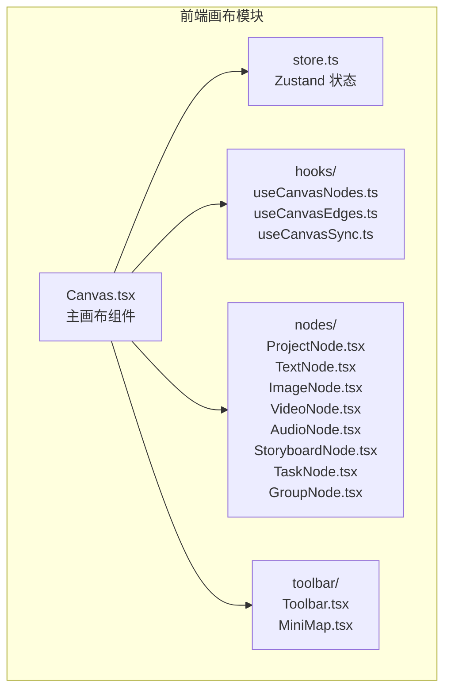

**图表来源**
- [buzhidaozenmemingmin.md:357-472](file://buzhidaozenmemingmin.md#L357-L472)

**章节来源**
- [buzhidaozenmemingmin.md:357-472](file://buzhidaozenmemingmin.md#L357-L472)

## 核心组件
- 画布状态接口 CanvasState 定义了节点与边集合、画布操作方法、视口状态、项目上下文与 Agent 集成映射与同步方法。
- 节点类型定义：项目根节点、文本节点、图像节点、视频节点、音频节点、分镜节点、任务节点、分组节点。
- 渲染组件：每种节点类型对应独立的 React 组件，负责节点外观与交互。
- 属性配置：节点 props 接口定义了节点数据结构与渲染所需字段。
- 事件处理：节点交互（拖拽、连线、删除、编辑）通过画布事件与状态管理协同实现。
- 自定义节点开发：遵循统一的节点接口与渲染规范，快速扩展新的节点类型。

**章节来源**
- [buzhidaozenmemingmin.md:226-262](file://buzhidaozenmemingmin.md#L226-L262)

## 架构概览
无限画布的节点类型系统围绕以下核心要素展开：
- 节点类型：八种节点类型分别承载不同业务数据，形成可视化资产管理与工作流编排的基础单元。
- 渲染组件：基于 @xyflow/react 的节点渲染器，将节点数据映射为可视元素。
- 状态管理：Zustand 提供全局状态访问与变更，确保节点与边的一致性与可追踪性。
- 业务逻辑：节点类型与 Agent 集成，实现从任务生成到节点注册的自动化流程。

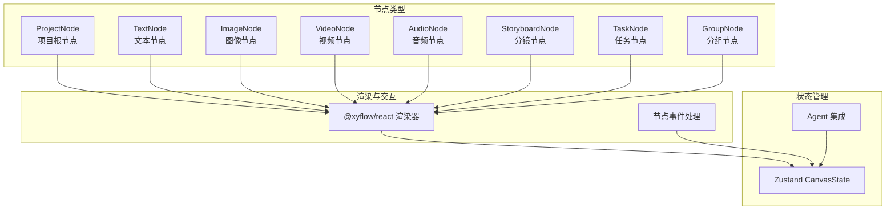

**图表来源**
- [buzhidaozenmemingmin.md:226-262](file://buzhidaozenmemingmin.md#L226-L262)

## 详细组件分析

### 项目根节点（ProjectNode）
- 数据结构：承载项目名称、描述、创建时间等项目元信息。
- 渲染组件：作为画布根节点，通常用于组织与标识项目范围。
- 属性配置：props 接口包含项目标识、标题、描述、时间戳等字段。
- 交互行为：支持拖拽移动、缩放视口、作为分组容器的父节点。
- 业务逻辑：与当前项目上下文绑定，参与画布初始化与项目切换。

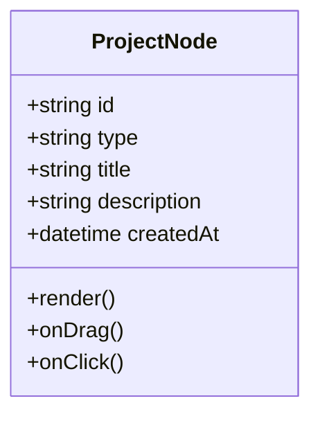

**图表来源**
- [buzhidaozenmemingmin.md:226-230](file://buzhidaozenmemingmin.md#L226-L230)

**章节来源**
- [buzhidaozenmemingmin.md:226-230](file://buzhidaozenmemingmin.md#L226-L230)

### 文本节点（TextNode）
- 数据结构：承载 Markdown 内容，支持脚本、创意与文本资产的可视化呈现。
- 渲染组件：以文本卡片或编辑框形式展示内容，支持折叠/展开。
- 属性配置：props 接口包含内容、样式、尺寸等字段。
- 交互行为：支持双击编辑、拖拽移动、连线关联。
- 业务逻辑：与脚本/创意工作流结合，作为内容资产的入口节点。

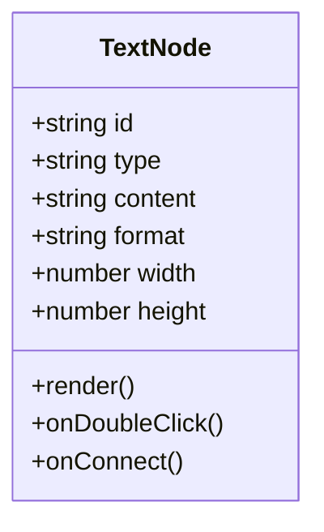

**图表来源**
- [buzhidaozenmemingmin.md:231](file://buzhidaozenmemingmin.md#L231)

**章节来源**
- [buzhidaozenmemingmin.md:231](file://buzhidaozenmemingmin.md#L231)

### 图像节点（ImageNode）
- 数据结构：承载缩略图、提示词、模型、尺寸等图像资产元数据。
- 渲染组件：以缩略图卡片形式展示，支持预览与详情展开。
- 属性配置：props 接口包含图像路径、提示词、模型、宽高、生成参数等。
- 交互行为：支持点击预览、拖拽移动、连线关联生成关系。
- 业务逻辑：与图像生成 Agent 协同，自动注册生成的图像资产。

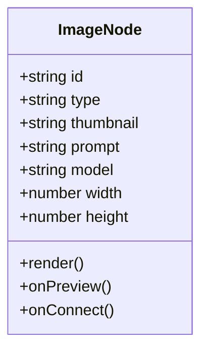

**图表来源**
- [buzhidaozenmemingmin.md:232](file://buzhidaozenmemingmin.md#L232)

**章节来源**
- [buzhidaozenmemingmin.md:232](file://buzhidaozenmemingmin.md#L232)

### 视频节点（VideoNode）
- 数据结构：承载预览帧、提示词、时长、分辨率等视频资产元数据。
- 渲染组件：以视频缩略图与播放器预览形式展示。
- 属性配置：props 接口包含视频路径、预览帧、时长、分辨率、生成参数等。
- 交互行为：支持播放预览、拖拽移动、连线关联。
- 业务逻辑：与视频生成 Agent 协同，自动注册生成的视频资产。

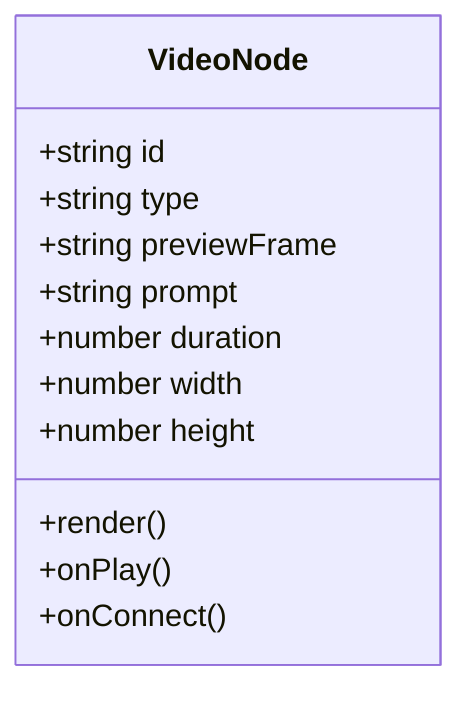

**图表来源**
- [buzhidaozenmemingmin.md:233](file://buzhidaozenmemingmin.md#L233)

**章节来源**
- [buzhidaozenmemingmin.md:233](file://buzhidaozenmemingmin.md#L233)

### 音频节点（AudioNode）
- 数据结构：承载波形、时长、情绪标签等音频资产元数据。
- 渲染组件：以波形图与播放器形式展示音频片段。
- 属性配置：props 接口包含音频路径、波形数据、时长、情绪标签等。
- 交互行为：支持播放预览、拖拽移动、连线关联。
- 业务逻辑：与音频生成 Agent 协同，自动注册生成的音频资产。

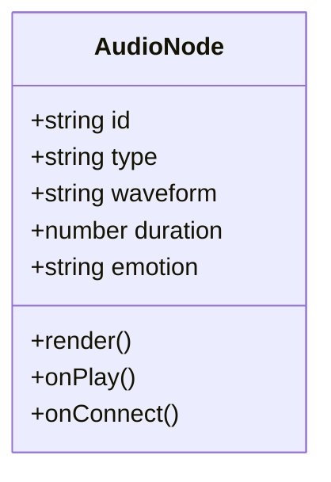

**图表来源**
- [buzhidaozenmemingmin.md:234](file://buzhidaozenmemingmin.md#L234)

**章节来源**
- [buzhidaozenmemingmin.md:234](file://buzhidaozenmemingmin.md#L234)

### 分镜节点（StoryboardNode）
- 数据结构：承载镜头号、描述、时长、转场等分镜元数据。
- 渲染组件：以分镜卡片形式展示，支持镜头编号与描述的可视化。
- 属性配置：props 接口包含镜头号、描述、时长、转场效果等。
- 交互行为：支持拖拽排序、连线关联拍摄顺序。
- 业务逻辑：与分镜编辑器联动，支撑视频剪辑与节奏控制。

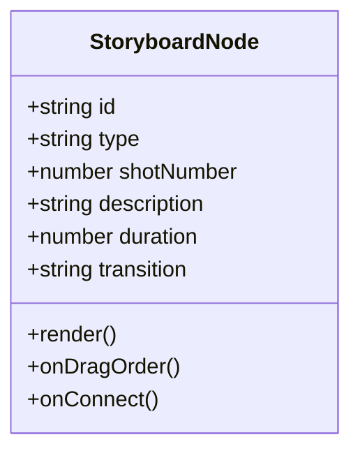

**图表来源**
- [buzhidaozenmemingmin.md:235](file://buzhidaozenmemingmin.md#L235)

**章节来源**
- [buzhidaozenmemingmin.md:235](file://buzhidaozenmemingmin.md#L235)

### 任务节点（TaskNode）
- 数据结构：承载任务状态、进度、Agent 日志等任务执行元数据。
- 渲染组件：以任务面板形式展示状态与进度条，支持日志滚动查看。
- 属性配置：props 接口包含任务 ID、状态、进度百分比、日志列表等。
- 交互行为：支持刷新状态、查看详情、重试任务。
- 业务逻辑：与 Agent 运行时集成，实时同步任务执行结果并注册为画布节点。

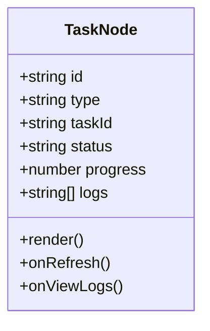

**图表来源**
- [buzhidaozenmemingmin.md:236](file://buzhidaozenmemingmin.md#L236)

**章节来源**
- [buzhidaozenmemingmin.md:236](file://buzhidaozenmemingmin.md#L236)

### 分组节点（GroupNode）
- 数据结构：承载子节点集合，作为容器节点管理相关资产。
- 渲染组件：以分组容器形式展示，支持折叠/展开与子节点布局。
- 属性配置：props 接口包含子节点 ID 列表、分组标题、展开状态等。
- 交互行为：支持拖拽子节点、调整分组范围、批量操作。
- 业务逻辑：与分组编辑器联动，实现资产的逻辑归类与批量管理。

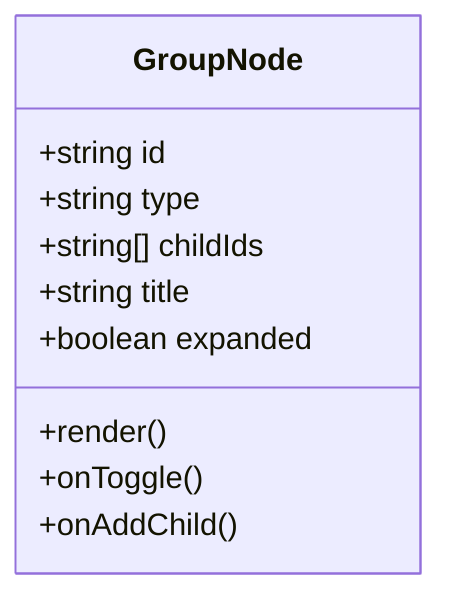

**图表来源**
- [buzhidaozenmemingmin.md:237](file://buzhidaozenmemingmin.md#L237)

**章节来源**
- [buzhidaozenmemingmin.md:237](file://buzhidaozenmemingmin.md#L237)

### 画布状态管理（Zustand）
- 状态接口：CanvasState 定义节点与边集合、操作方法、视口状态、项目上下文与 Agent 集成映射。
- 操作方法：addNode、removeNode、connectNodes 等，提供节点与边的增删改查能力。
- 视口控制：viewport 提供 x、y、zoom 状态，支持缩放与平移。
- 项目上下文：currentProjectId 与画布上下文绑定。
- Agent 集成：agentTaskMap 与 syncAgentResult 提供任务结果到节点的自动注册能力。

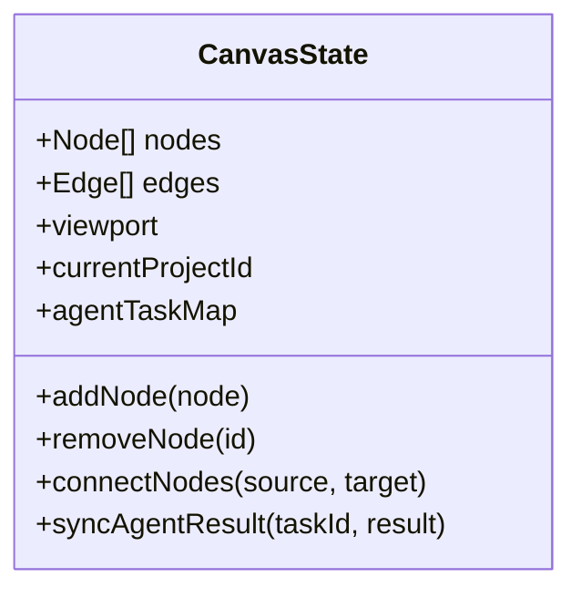

**图表来源**
- [buzhidaozenmemingmin.md:241-262](file://buzhidaozenmemingmin.md#L241-L262)

**章节来源**
- [buzhidaozenmemingmin.md:241-262](file://buzhidaozenmemingmin.md#L241-L262)

### 节点类型定义与属性接口
- 节点类型定义：八种节点类型在设计文档中明确其图标、功能与数据承载。
- 属性接口：每种节点类型均应定义清晰的 props 接口，确保渲染组件与状态管理的一致性。
- 事件处理：节点交互事件（拖拽、连线、删除、编辑）通过画布事件与状态管理协同处理。
- 自定义节点开发：遵循统一的节点接口与渲染规范，快速扩展新的节点类型。

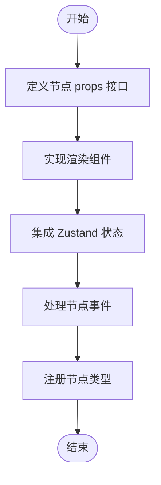

**图表来源**
- [buzhidaozenmemingmin.md:226-237](file://buzhidaozenmemingmin.md#L226-L237)

**章节来源**
- [buzhidaozenmemingmin.md:226-237](file://buzhidaozenmemingmin.md#L226-L237)

## 依赖分析
- 组件耦合：节点类型与渲染组件、状态管理之间保持低耦合高内聚；节点类型通过统一接口与状态管理交互。
- 直接依赖：节点渲染依赖 @xyflow/react；节点数据依赖 Zustand CanvasState；Agent 集成依赖 agentTaskMap 与 syncAgentResult。
- 间接依赖：分镜节点与分镜编辑器联动；任务节点与 Agent 运行时联动；分组节点与分组编辑器联动。
- 外部依赖：React Flow 提供无限画布能力；Zustand 提供轻量状态管理；Tauri 提供桌面壳层与 IPC。

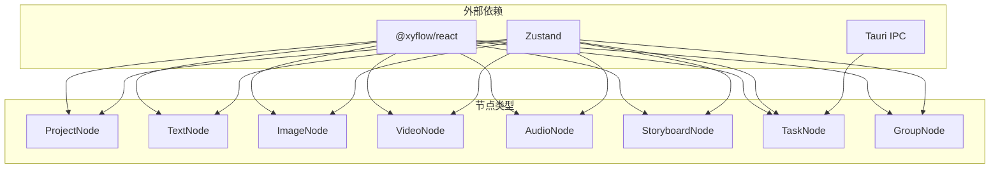

**图表来源**
- [buzhidaozenmemingmin.md:226-262](file://buzhidaozenmemingmin.md#L226-L262)

**章节来源**
- [buzhidaozenmemingmin.md:226-262](file://buzhidaozenmemingmin.md#L226-L262)

## 性能考虑
- 渲染性能：节点数量较多时，建议启用虚拟化与懒加载，减少不必要的重渲染。
- 状态更新：批量更新节点与边，避免频繁触发状态订阅者的重渲染。
- 事件处理：对高频事件（如拖拽）进行节流或防抖，降低计算压力。
- 数据结构：使用稳定的数据结构（如数组索引）优化查找与更新效率。
- Agent 集成：任务结果同步采用增量更新，避免全量重绘。

## 故障排除指南
- 节点无法渲染：检查节点 props 是否符合接口定义，确认渲染组件已正确注册。
- 节点连线异常：验证节点 ID 与边的 source/target 是否一致，检查 connectNodes 方法调用。
- 状态不同步：确认 Zustand 状态更新是否在正确的组件生命周期中执行，避免竞态条件。
- Agent 结果未注册：检查 agentTaskMap 与 syncAgentResult 的调用时机与参数传递。
- 性能问题：对大量节点场景启用虚拟化与批处理，监控渲染帧率与内存占用。

## 结论
无限画布的节点类型系统通过八种节点类型与统一的状态管理，实现了从项目根节点到具体资产节点的完整可视化编排。该系统在保证易用性的同时，兼顾了扩展性与性能，为后续的分镜编辑器、资产浏览器与 Agent 自动注册提供了坚实基础。

## 附录
- 开发建议：遵循统一的节点接口与渲染规范，确保新增节点类型与现有系统无缝集成。
- 最佳实践：合理划分节点职责，避免过度耦合；对高频操作进行性能优化；完善错误处理与日志记录。