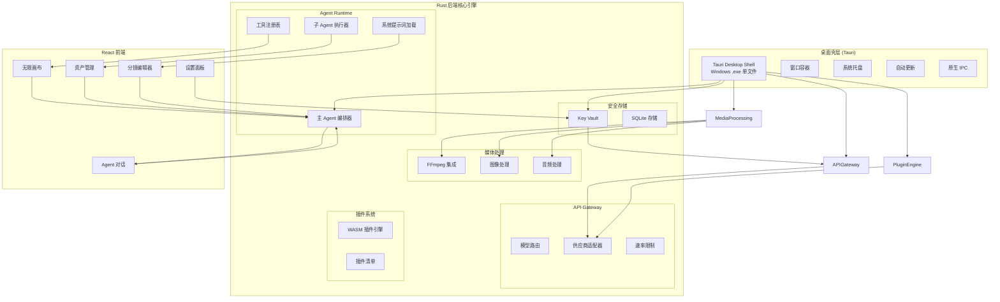
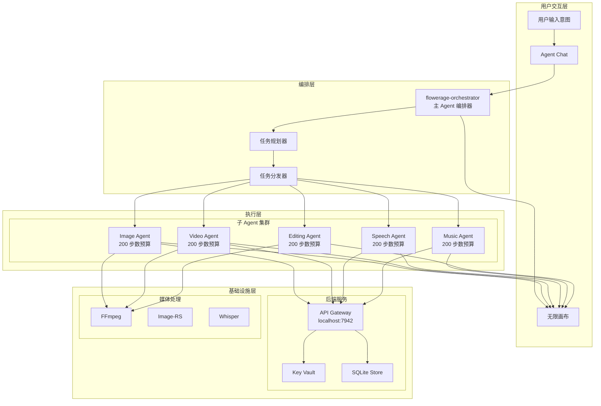
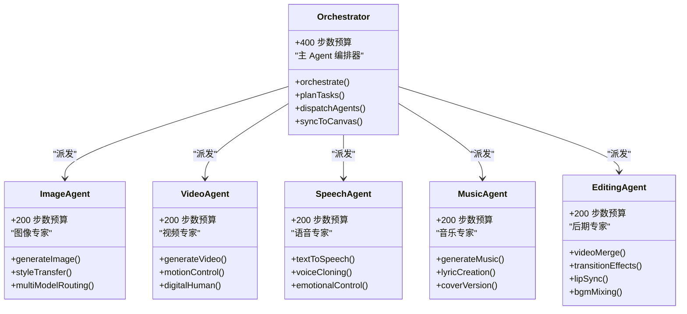
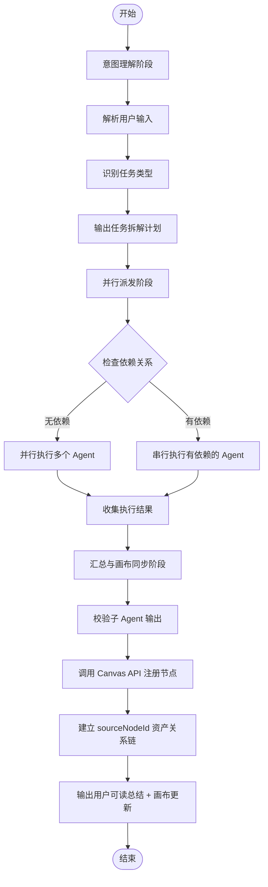
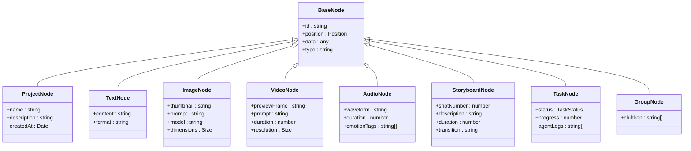
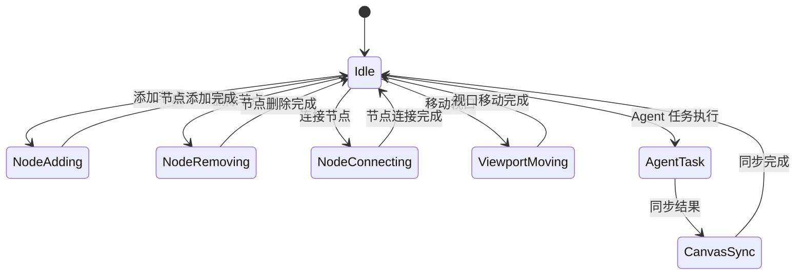
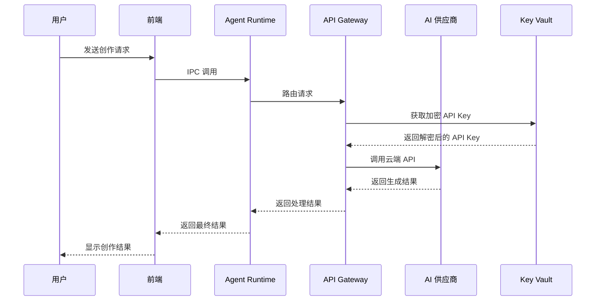

# 分层架构设计

<cite>
**本文档引用的文件**
- [buzhidaozenmemingmin.md](file://buzhidaozenmemingmin.md)
</cite>

## 目录
1. [简介](#简介)
2. [项目结构](#项目结构)
3. [核心组件](#核心组件)
4. [架构概览](#架构概览)
5. [详细组件分析](#详细组件分析)
6. [依赖分析](#依赖分析)
7. [性能考虑](#性能考虑)
8. [故障排除指南](#故障排除指南)
9. [结论](#结论)

## 简介

Flower Age Video（花纪视频工作室）是一款基于 AI 驱动的无限画布创意工作站，面向视频创作者、内容生产者和 AI 艺术家。该项目采用三层架构设计，通过 Tauri 桌面壳层、Rust 后端核心引擎和 React 前端的协同工作，为用户提供完整的本地化 AI 创作解决方案。

该系统的核心价值在于提供零商业侵权、本地部署、云端 AI 和无限画布四大特性，同时确保用户隐私和数据安全。

## 项目结构

项目采用清晰的分层架构，每层都有明确的职责边界：



**图表来源**
- [buzhidaozenmemingmin.md:29-50](file://buzhidaozenmemingmin.md#L29-L50)
- [buzhidaozenmemingmin.md:355-472](file://buzhidaozenmemingmin.md#L355-L472)

**章节来源**
- [buzhidaozenmemingmin.md:27-50](file://buzhidaozenmemingmin.md#L27-L50)
- [buzhidaozenmemingmin.md:355-472](file://buzhidaozenmemingmin.md#L355-L472)

## 核心组件

### Tauri 桌面壳层

Tauri 桌面壳层作为整个应用的外壳，负责提供桌面应用程序的基础功能：

- **窗口容器**：管理主窗口和各种子窗口的生命周期
- **系统托盘**：提供最小化到托盘的功能和快捷操作入口
- **自动更新**：实现增量更新机制，无需额外服务器支持
- **原生 IPC**：提供前后端通信的桥梁，支持安全的原生模块调用

### Rust 后端核心引擎

后端核心引擎采用纯 Rust 实现，确保高性能和安全性：

#### Agent Runtime（Agent 运行时）
- **Agent 生命周期管理**：负责主 Agent 和子 Agent 的创建、执行、监控和销毁
- **工具调度**：实现 MCP 风格的工具注册表，统一管理各类工具
- **SP 注入**：系统提示词的动态加载和注入机制
- **步数限制**：为每个 Agent 设置合理的执行步数预算，防止无限循环

#### API Gateway（API 网关）
- **本地 API 代理**：在 localhost:7942 提供统一的 API 代理服务
- **供应商路由**：将请求路由到不同的 AI 供应商 API
- **速率限制**：实现请求频率控制，避免触发供应商限流

#### Plugin Engine（插件引擎）
- **WASM 插件热加载**：支持动态加载和卸载 WASM 插件
- **沙箱隔离**：在安全的沙箱环境中执行插件代码
- **接口标准化**：提供统一的插件接口规范

#### Key Vault（密钥保险库）
- **API Key 加密存储**：使用 AES-256-GCM 算法加密存储 API Key
- **Windows DPAPI 支持**：利用系统级加密服务增强安全性
- **内存安全**：解密后的密钥仅在内存中短暂存在

#### SQLite Store（SQLite 存储）
- **项目数据持久化**：存储项目元信息和配置
- **资产索引管理**：维护生成资产的索引和元数据
- **Memory 持久化**：保存用户偏好和角色锚点等记忆数据

### React 前端

前端采用现代化的 React 生态系统，提供丰富的用户界面：

#### Infinite Canvas（无限画布）
- **@xyflow/react 集成**：基于 React Flow 实现行业标准的无限画布
- **节点系统**：支持多种节点类型（项目、文本、图像、视频、音频等）
- **交互功能**：无限缩放、拖拽、连线、分组等操作

#### Agent Chat（Agent 对话）
- **实时对话**：通过 Server-Sent Events 实现实时进度反馈
- **思考过程展示**：显示 Agent 的推理过程和思考状态
- **进度可视化**：提供任务执行进度的直观展示

#### Asset Browser（资产管理）
- **资产浏览**：提供生成资产的集中管理和浏览功能
- **分类管理**：按类型和项目组织资产
- **快速访问**：支持资产的快速搜索和定位

#### Storyboard Editor（分镜编辑器）
- **镜头管理**：支持分镜镜头的创建、编辑和管理
- **时序控制**：精确控制镜头的时长和顺序
- **转场效果**：提供基本的转场效果编辑功能

#### Settings（设置面板）
- **模型配置**：支持多种 AI 模型的选择和配置
- **API Key 管理**：安全地管理各个供应商的 API Key
- **偏好设置**：用户个性化配置选项

**章节来源**
- [buzhidaozenmemingmin.md:52-65](file://buzhidaozenmemingmin.md#L52-L65)
- [buzhidaozenmemingmin.md:87-134](file://buzhidaozenmemingmin.md#L87-L134)

## 架构概览

系统采用主 Agent 编排 + 子 Agent 执行的分层架构模式：



**图表来源**
- [buzhidaozenmemingmin.md:66-83](file://buzhidaozenmemingmin.md#L66-L83)
- [buzhidaozenmemingmin.md:139-159](file://buzhidaozenmemingmin.md#L139-L159)

### 请求链路分析

系统的核心请求链路由以下步骤组成：

1. **用户输入意图**：用户通过聊天界面输入创作需求
2. **主 Agent 意图理解**：flowerage-orchestrator 分析用户意图，识别任务类型
3. **任务拆解与派发**：根据任务复杂度进行拆解，并行或串行派发给子 Agent
4. **子 Agent 执行**：各专业子 Agent 调用相应的 AI 供应商 API 或本地处理
5. **结果汇总与画布同步**：将生成结果注册到无限画布，建立资产关系链

**章节来源**
- [buzhidaozenmemingmin.md:66-83](file://buzhidaozenmemingmin.md#L66-L83)
- [buzhidaozenmemingmin.md:172-190](file://buzhidaozenmemingmin.md#L172-L190)

## 详细组件分析

### Agent 体系设计

#### Agent 分层架构



**图表来源**
- [buzhidaozenmemingmin.md:139-159](file://buzhidaozenmemingmin.md#L139-L159)
- [buzhidaozenmemingmin.md:163-171](file://buzhidaozenmemingmin.md#L163-L171)

#### Agent 编排流程



**图表来源**
- [buzhidaozenmemingmin.md:172-190](file://buzhidaozenmemingmin.md#L172-L190)

**章节来源**
- [buzhidaozenmemingmin.md:137-210](file://buzhidaozenmemingmin.md#L137-L210)

### 无限画布设计

#### 节点类型系统



**图表来源**
- [buzhidaozenmemingmin.md:226-238](file://buzhidaozenmemingmin.md#L226-L238)

#### 画布状态管理

前端使用 Zustand 实现轻量级状态管理：



**图表来源**
- [buzhidaozenmemingmin.md:239-262](file://buzhidaozenmemingmin.md#L239-L262)

**章节来源**
- [buzhidaozenmemingmin.md:213-262](file://buzhidaozenmemingmin.md#L213-L262)

### API 网关与安全存储

#### API 网关架构



**图表来源**
- [buzhidaozenmemingmin.md:268-288](file://buzhidaozenmemingmin.md#L268-L288)
- [buzhidaozenmemingmin.md:338-350](file://buzhidaozenmemingmin.md#L338-L350)

#### 支持的 AI 供应商

系统支持多家主流 AI 供应商，涵盖不同应用场景：

| 供应商类别 | 支持的供应商 | 主要用途 |
|-----------|-------------|---------|
| 大语言模型 | OpenAI, Anthropic, DeepSeek, 通义千问, MiniMax | 主力 Agent 推理 |
| 图像生成 | OpenAI DALL·E, Stability AI, Midjourney, 即梦/豆包, Recraft | 通用图像生成 |
| 视频生成 | Runway, 可灵, 即梦, MiniMax, Luma | 高质量视频生成 |
| 语音合成 | MiniMax, ElevenLabs, OpenAI | 多语种 TTS |
| 音乐生成 | Suno, Udio, MiniMax | BGM 和歌曲生成 |

**章节来源**
- [buzhidaozenmemingmin.md:266-337](file://buzhidaozenmemingmin.md#L266-L337)
- [buzhidaozenmemingmin.md:338-350](file://buzhidaozenmemingmin.md#L338-L350)

## 依赖分析

### 技术栈依赖关系

```mermaid
graph TB
subgraph "桌面框架"
Tauri[Tauri 2.x]
WebView2[WebView2]
Bundler[Tauri Bundler]
Updater[Tauri Updater]
end
subgraph "前端技术栈"
React[React 18]
TypeScript[TypeScript 5.x]
Vite[Vite]
XYFlow[@xyflow/react]
Zustand[Zustand]
ShadcnUI[shadcn/ui + Radix]
TailwindCSS[Tailwind CSS]
FramerMotion[Framer Motion]
AISDK[@ai-sdk/react]
end
subgraph "后端 Rust"
Axum[Axum]
Tokio[Tokio]
Serde[Serde JSON]
Reqwest[Reqwest]
Ring[Ring + AEAD]
Rusqlite[Rusqlite]
Tera[Tera]
SSE[tokio-stream]
Wasmtime[Wasmtime]
end
subgraph "原生模块"
FFmpegSidecar[ffmpeg-sidecar]
ImageRS[image-rs]
Symphonia[Symphonia]
WhisperRS[whisper-rs]
end
Tauri --> React
React --> AXum
Axum --> Reqwest
Axum --> Ring
Axum --> Rusqlite
Axum --> Wasmtime
FFmpegSidecar --> Symphonia
ImageRS --> FFmpegSidecar
```

**图表来源**
- [buzhidaozenmemingmin.md:87-134](file://buzhidaozenmemingmin.md#L87-L134)

### 许可证兼容性

系统采用完全开源的许可证组合，确保商业使用的安全性：

| 组件 | 许可证 | 商业使用 | 修改分发 | 传染性 |
|------|--------|----------|----------|--------|
| Tauri | MIT + Apache-2.0 | ✅ | ✅ | ❌ |
| React | MIT | ✅ | ✅ | ❌ |
| @xyflow/react | MIT | ✅ | ✅ | ❌ |
| Zustand | MIT | ✅ | ✅ | ❌ |
| shadcn/ui | MIT | ✅ | ✅ | ❌ |
| Tailwind CSS | MIT | ✅ | ✅ | ❌ |
| Framer Motion | MIT | ✅ | ✅ | ❌ |
| Vercel AI SDK | Apache-2.0 | ✅ | ✅ | ❌ |
| axum | MIT | ✅ | ✅ | ❌ |
| tokio | MIT | ✅ | ✅ | ❌ |
| reqwest | MIT + Apache-2.0 | ✅ | ✅ | ❌ |
| ring | ISC (BSD-like) | ✅ | ✅ | ❌ |
| rusqlite | MIT | ✅ | ✅ | ❌ |
| wasmtime | Apache-2.0 | ✅ | ✅ | ❌ |
| ffmpeg-sidecar | MIT | ✅ | ✅ | ❌ |
| image-rs | MIT | ✅ | ✅ | ❌ |
| symphonia | MPL-2.0 | ✅ | ✅ | ❌ (非传染) |

**章节来源**
- [buzhidaozenmemingmin.md:596-621](file://buzhidaozenmemingmin.md#L596-L621)

## 性能考虑

### 架构性能优势

1. **Tauri 轻量化**：相比 Electron 减少约 90% 的体积，启动速度更快
2. **Rust 高性能**：后端使用 Rust 实现，提供接近 C/C++ 的性能表现
3. **异步并发**：Tokio 异步运行时支持高并发的 Agent 执行
4. **内存安全**：Rust 的所有权系统避免内存泄漏和安全漏洞
5. **零依赖部署**：用户无需安装额外运行时环境

### 性能优化策略

- **WASM 插件沙箱**：在安全的沙箱环境中执行插件，避免影响主进程性能
- **缓存机制**：API Key 解密结果在内存中短期缓存，减少重复解密开销
- **批量处理**：支持多个子 Agent 并行执行，充分利用硬件资源
- **增量更新**：Tauri Updater 实现增量更新，减少下载时间和带宽消耗

## 故障排除指南

### 常见问题诊断

#### 启动问题
- **问题**：应用无法启动或启动后立即退出
- **排查**：检查系统是否满足最低要求（Windows 10+），确认 WebView2 是否正常安装
- **解决**：重新安装 WebView2，或手动下载安装包

#### API Key 问题
- **问题**：API 调用失败或返回认证错误
- **排查**：验证 API Key 是否正确存储，检查 Key Vault 加密状态
- **解决**：重新配置 API Key，确保网络连接正常

#### 画布同步问题
- **问题**：生成的资产未显示在画布上
- **排查**：检查 Agent 执行日志，验证画布同步协议
- **解决**：重启应用，清理缓存数据

#### 性能问题
- **问题**：应用响应缓慢或内存占用过高
- **排查**：监控 Agent 执行状态，检查是否有死循环
- **解决**：调整 Agent 步数预算，优化插件配置

**章节来源**
- [buzhidaozenmemingmin.md:694-731](file://buzhidaozenmemingmin.md#L694-L731)

## 结论

Flower Age Video 的分层架构设计体现了现代 AI 创作工具的发展方向：通过 Tauri 桌面壳层提供轻量化的用户体验，通过 Rust 后端核心引擎确保高性能和安全性，通过 React 前端提供丰富的交互界面。

该架构的主要优势包括：

1. **技术选型先进**：采用 Tauri 替代 Electron，Rust 替代 Node.js/Python
2. **隐私保护优先**：用户自有 API Key 直连，无第三方中间商
3. **扩展性强**：WASM 插件系统支持功能扩展
4. **许可证合规**：100% 开源许可证，无 GPL 传染风险
5. **部署简单**：零依赖环境，双击即可使用

通过主 Agent 编排 + 子 Agent 执行的模式，系统能够高效处理复杂的多模态创作任务，为用户提供从创意到成品的完整创作体验。