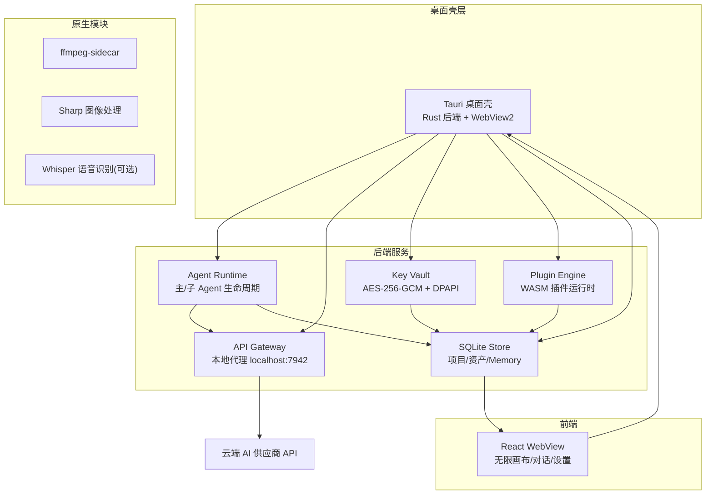
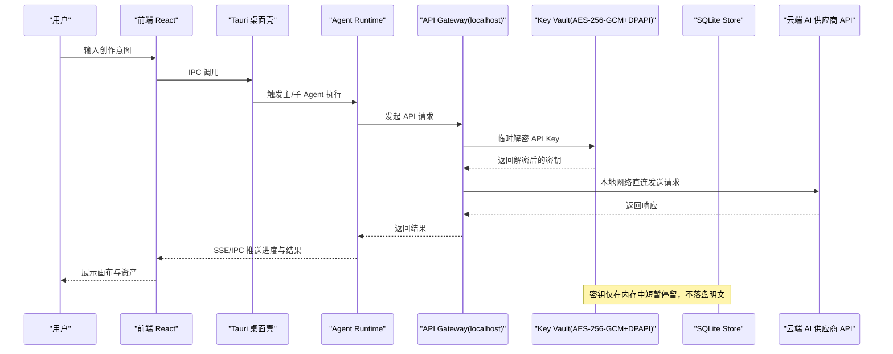
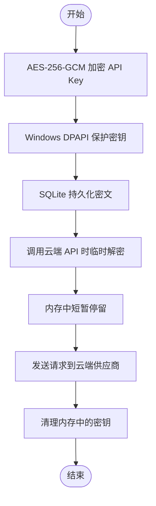
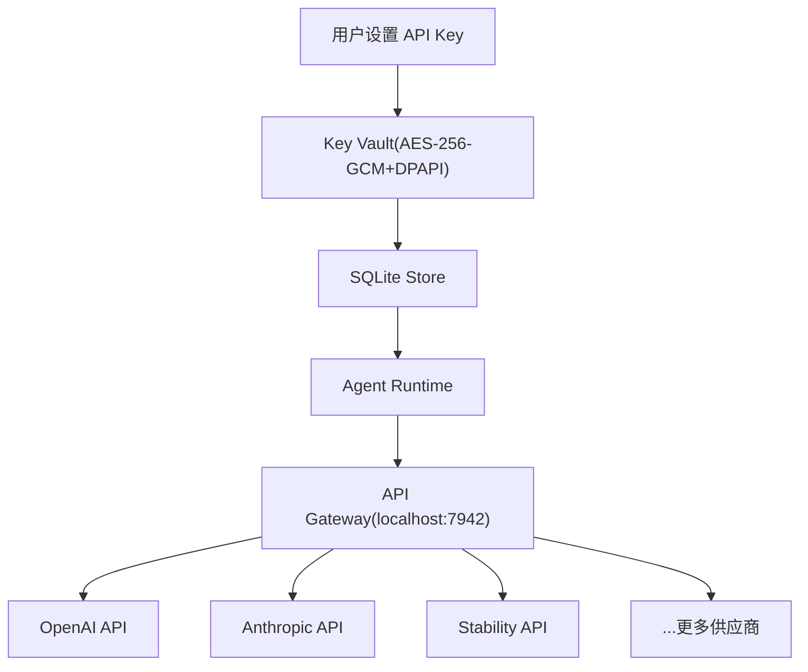
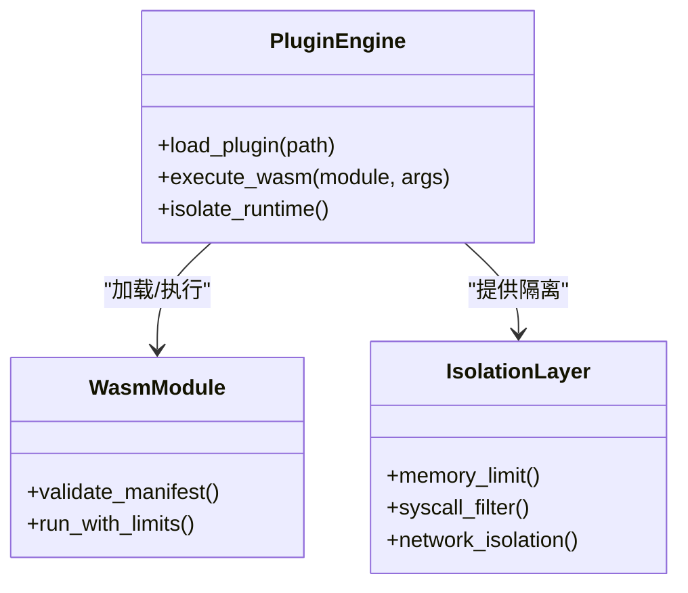
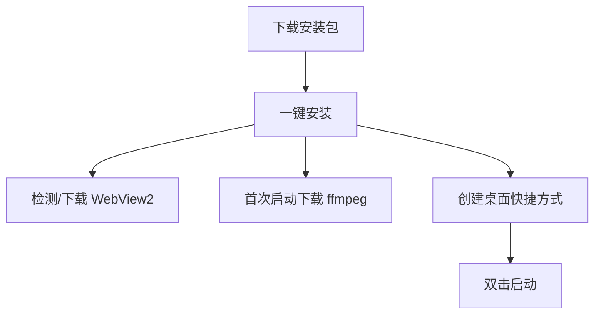
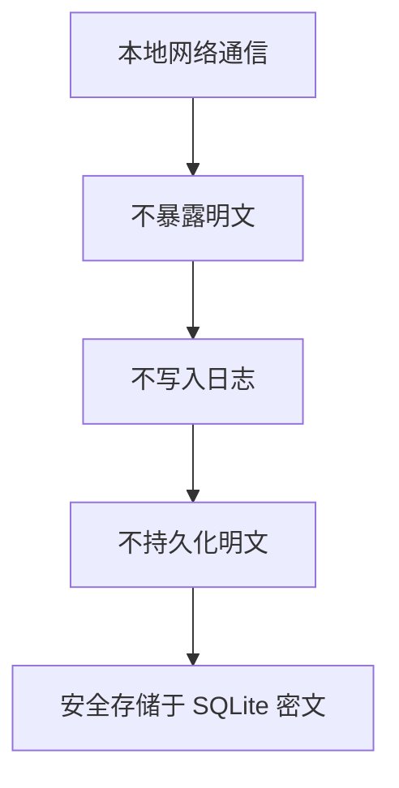
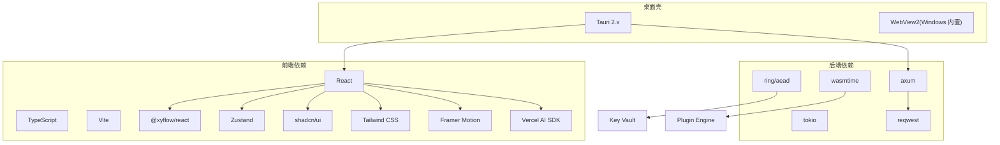

# 安全架构设计

<cite>
**本文引用的文件**
- [buzhidaozenmemingmin.md](file://buzhidaozenmemingmin.md)
</cite>

## 目录
1. [简介](#简介)
2. [项目结构](#项目结构)
3. [核心组件](#核心组件)
4. [架构总览](#架构总览)
5. [详细组件分析](#详细组件分析)
6. [依赖分析](#依赖分析)
7. [性能考量](#性能考量)
8. [故障排查指南](#故障排查指南)
9. [结论](#结论)
10. [附录](#附录)

## 简介
本文件面向 Flower Age Video（花纪视频工作室）项目，系统化阐述其安全架构设计与实现要点，聚焦以下目标：
- API Key 加密存储机制：AES-256-GCM 加密 + Windows DPAPI 保护
- 本地部署模式：用户自有 API Key 直连，无第三方代理
- WASM 插件沙箱隔离：安全的插件执行环境
- 零环境依赖的安全性优势：不依赖外部运行时环境
- 数据加密传输与隐私：本地网络通信，无明文日志记录

同时，文档将给出威胁模型、防护措施与合规性考虑，确保用户隐私与数据安全。

## 项目结构
项目采用“Tauri 桌面壳 + Rust 后端 + React 前端”的分层架构，后端以 Rust 实现，前端以 React/Vite 构建，核心安全能力集中在后端模块中：
- Tauri 桌面壳层：窗口容器、系统托盘、自动更新、原生 IPC
- Agent Runtime：主/子 Agent 生命周期管理、工具调度、步数限制
- API Gateway：本地 API 代理（localhost），路由至各云端供应商 API
- Plugin Engine：WASM 插件热加载与运行时隔离
- Key Vault：API Key 本地加密存储（AES-256-GCM + Windows DPAPI）
- SQLite Store：项目/资产/Memory 持久化
- 媒体处理：ffmpeg-sidecar、Sharp、Whisper（可选）

图表来源
- [buzhidaozenmemingmin.md:27-83](file://buzhidaozenmemingmin.md#L27-L83)
- [buzhidaozenmemingmin.md:354-472](file://buzhidaozenmemingmin.md#L354-L472)

章节来源
- [buzhidaozenmemingmin.md:27-83](file://buzhidaozenmemingmin.md#L27-L83)
- [buzhidaozenmemingmin.md:354-472](file://buzhidaozenmemingmin.md#L354-L472)

## 核心组件
- API Key 加密存储（Key Vault）
  - 使用 AES-256-GCM 对 API Key 进行加密
  - 加密密钥由 Windows DPAPI 保护
  - 密文存储于本地 SQLite 数据库
  - 解密仅在调用云端 API 时进行，内存中短暂停留
  - 明确禁止写入日志、网络传输与持久化明文
- 本地部署模式（API Gateway）
  - 用户在本地配置各供应商 API Key
  - 通过本地 API Gateway（localhost:7942）直连云端供应商
  - 无第三方代理，避免中间人风险
- WASM 插件沙箱隔离（Plugin Engine）
  - 使用 wasmtime 作为 WASM 插件运行时
  - 插件以沙箱方式加载，降低对宿主系统的攻击面
- 零环境依赖（安装与运行）
  - 无需 Docker、Python、Node.js、运行时环境
  - 仅依赖 Windows 内置 WebView2（10+ 预装）
  - 首次启动自动下载 ffmpeg 二进制
- 数据加密传输与隐私
  - 本地网络通信，不暴露明文
  - 严格避免日志中记录敏感信息

章节来源
- [buzhidaozenmemingmin.md:60-64](file://buzhidaozenmemingmin.md#L60-L64)
- [buzhidaozenmemingmin.md:112-125](file://buzhidaozenmemingmin.md#L112-L125)
- [buzhidaozenmemingmin.md:266-288](file://buzhidaozenmemingmin.md#L266-L288)
- [buzhidaozenmemingmin.md:338-350](file://buzhidaozenmemingmin.md#L338-L350)
- [buzhidaozenmemingmin.md:476-509](file://buzhidaozenmemingmin.md#L476-L509)
- [buzhidaozenmemingmin.md:512-545](file://buzhidaozenmemingmin.md#L512-L545)

## 架构总览
下图展示了从用户输入到云端供应商 API 的端到端请求链路，强调“用户自有 API Key + 本地代理 + 无第三方代理”的安全路径。

图表来源
- [buzhidaozenmemingmin.md:66-83](file://buzhidaozenmemingmin.md#L66-L83)
- [buzhidaozenmemingmin.md:266-288](file://buzhidaozenmemingmin.md#L266-L288)
- [buzhidaozenmemingmin.md:338-350](file://buzhidaozenmemingmin.md#L338-L350)

章节来源
- [buzhidaozenmemingmin.md:66-83](file://buzhidaozenmemingmin.md#L66-L83)
- [buzhidaozenmemingmin.md:266-288](file://buzhidaozenmemingmin.md#L266-L288)

## 详细组件分析

### API Key 加密存储（Key Vault）
- 加密算法：AES-256-GCM
- 密钥保护：Windows DPAPI
- 存储介质：本地 SQLite 数据库
- 生命周期：仅在调用云端 API 时解密，内存中短暂停留；不写日志、不网络传输、不持久化明文
- 供应链与合规：ring + aead 提供加密能力，许可证为 ISC（BSD-like），符合商用要求

图表来源
- [buzhidaozenmemingmin.md:338-350](file://buzhidaozenmemingmin.md#L338-L350)
- [buzhidaozenmemingmin.md:120](file://buzhidaozenmemingmin.md#L120)

章节来源
- [buzhidaozenmemingmin.md:338-350](file://buzhidaozenmemingmin.md#L338-L350)
- [buzhidaozenmemingmin.md:120](file://buzhidaozenmemingmin.md#L120)

### 本地部署模式（API Gateway）
- 用户在本地配置各供应商 API Key
- 通过本地 API Gateway（localhost:7942）直连云端供应商
- 无第三方代理，避免中间人风险与数据泄露
- 支持多供应商并行路由与速率限制

图表来源
- [buzhidaozenmemingmin.md:266-288](file://buzhidaozenmemingmin.md#L266-L288)
- [buzhidaozenmemingmin.md:378-381](file://buzhidaozenmemingmin.md#L378-L381)

章节来源
- [buzhidaozenmemingmin.md:266-288](file://buzhidaozenmemingmin.md#L266-L288)
- [buzhidaozenmemingmin.md:378-381](file://buzhidaozenmemingmin.md#L378-L381)

### WASM 插件沙箱隔离（Plugin Engine）
- 运行时：wasmtime
- 加载方式：动态加载 .wasm 插件
- 隔离策略：WASM 在独立虚拟机上下文中执行，限制访问宿主系统资源
- 优势：相比 Python/Cython 扩展，WASM 沙箱更安全

图表来源
- [buzhidaozenmemingmin.md:59-60](file://buzhidaozenmemingmin.md#L59-L60)
- [buzhidaozenmemingmin.md:124](file://buzhidaozenmemingmin.md#L124)
- [buzhidaozenmemingmin.md:382-384](file://buzhidaozenmemingmin.md#L382-L384)

章节来源
- [buzhidaozenmemingmin.md:59-60](file://buzhidaozenmemingmin.md#L59-L60)
- [buzhidaozenmemingmin.md:124](file://buzhidaozenmemingmin.md#L124)
- [buzhidaozenmemingmin.md:382-384](file://buzhidaozenmemingmin.md#L382-L384)

### 零环境依赖（安装与运行）
- 安装包：.exe/.msi，一键安装
- 运行时依赖：Windows 10+ 内置 WebView2；ffmpeg 首次启动自动下载
- 无需 Python、Node.js、Docker、第三方运行时
- 降低攻击面与运维复杂度

图表来源
- [buzhidaozenmemingmin.md:476-509](file://buzhidaozenmemingmin.md#L476-L509)

章节来源
- [buzhidaozenmemingmin.md:476-509](file://buzhidaozenmemingmin.md#L476-L509)

### 数据加密传输与隐私（本地网络通信）
- 通信范围：本地网络（localhost），不暴露到公网
- 敏感信息处理：API Key 仅在内存中短暂停留，不写入日志、不网络传输、不持久化明文
- 存储设计：SQLite 本地数据库，密文存储 API Key

图表来源
- [buzhidaozenmemingmin.md:266-288](file://buzhidaozenmemingmin.md#L266-L288)
- [buzhidaozenmemingmin.md:338-350](file://buzhidaozenmemingmin.md#L338-L350)
- [buzhidaozenmemingmin.md:512-527](file://buzhidaozenmemingmin.md#L512-L527)

章节来源
- [buzhidaozenmemingmin.md:266-288](file://buzhidaozenmemingmin.md#L266-L288)
- [buzhidaozenmemingmin.md:338-350](file://buzhidaozenmemingmin.md#L338-L350)
- [buzhidaozenmemingmin.md:512-527](file://buzhidaozenmemingmin.md#L512-L527)

## 依赖分析
- 后端加密与网络栈：axum + tokio + reqwest + ring/aead
- 插件运行时：wasmtime
- 媒体处理：ffmpeg-sidecar、image-rs、symphonia、whisper-rs（可选）
- 前端与状态：React + TypeScript + Vite + @xyflow/react + Zustand + shadcn/ui + Tailwind CSS + Framer Motion + Vercel AI SDK
- 桌面壳：Tauri 2.x（Rust），WebView2（Windows 内置）

图表来源
- [buzhidaozenmemingmin.md:112-134](file://buzhidaozenmemingmin.md#L112-L134)
- [buzhidaozenmemingmin.md:87-134](file://buzhidaozenmemingmin.md#L87-L134)

章节来源
- [buzhidaozenmemingmin.md:112-134](file://buzhidaozenmemingmin.md#L112-L134)
- [buzhidaozenmemingmin.md:87-134](file://buzhidaozenmemingmin.md#L87-L134)

## 性能考量
- 本地代理与直连：避免第三方代理带来的网络延迟与带宽瓶颈
- WASM 插件：在独立上下文中执行，避免全局状态污染与资源争用
- 零环境依赖：减少安装与运行时开销，提升启动速度与稳定性
- SQLite 本地存储：低延迟访问，适合小规模数据与频繁读写

## 故障排查指南
- API Key 无法使用
  - 检查 Key Vault 是否正确加密存储，确认解密流程是否在调用时进行且内存中短暂停留
  - 确认 API Gateway 本地代理（localhost:7942）可正常访问
- 插件加载失败
  - 确认 .wasm 插件清单与运行时版本兼容
  - 检查隔离层是否启用（内存限制、系统调用过滤、网络隔离）
- 安装与运行问题
  - 确认 Windows 10+ 预装 WebView2 是否可用
  - 首次启动时 ffmpeg 是否成功下载
- 日志与隐私
  - 确保日志中不包含 API Key 或明文敏感信息
  - 确认 SQLite 中仅存储密文

章节来源
- [buzhidaozenmemingmin.md:338-350](file://buzhidaozenmemingmin.md#L338-L350)
- [buzhidaozenmemingmin.md:266-288](file://buzhidaozenmemingmin.md#L266-L288)
- [buzhidaozenmemingmin.md:476-509](file://buzhidaozenmemingmin.md#L476-L509)
- [buzhidaozenmemingmin.md:512-545](file://buzhidaozenmemingmin.md#L512-L545)

## 结论
Flower Age Video 的安全架构围绕“用户自有 API Key + 本地代理 + WASM 沙箱 + 零环境依赖”展开，通过 AES-256-GCM + DPAPI 的密钥保护、本地网络通信与严格的日志策略，有效降低了数据泄露与中间人攻击的风险。结合零依赖安装与插件沙箱隔离，进一步提升了系统的安全性与可维护性。建议在后续开发中持续完善密钥轮换、审计日志与合规性检查机制，确保长期稳定运行。

## 附录
- 许可证合规性：全部依赖为 MIT/Apache-2.0/BSD 许可，无 GPL 传染性，可安全商用
- 与参考项目的差异：采用 Tauri 桌面壳、Rust 后端、用户自有 API Key、WASM 插件与零依赖安装，避免侵权风险

章节来源
- [buzhidaozenmemingmin.md:596-634](file://buzhidaozenmemingmin.md#L596-L634)
- [buzhidaozenmemingmin.md:694-731](file://buzhidaozenmemingmin.md#L694-L731)