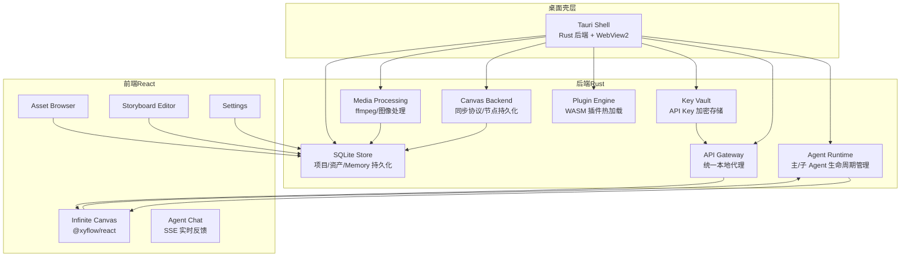
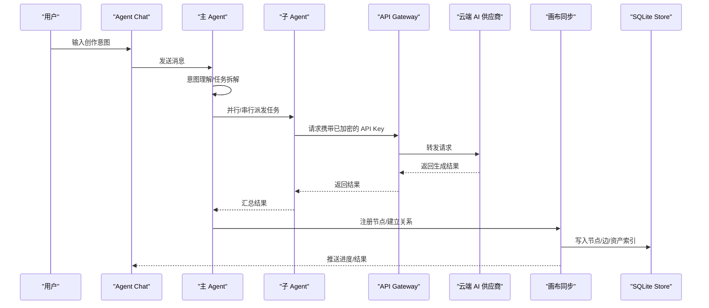
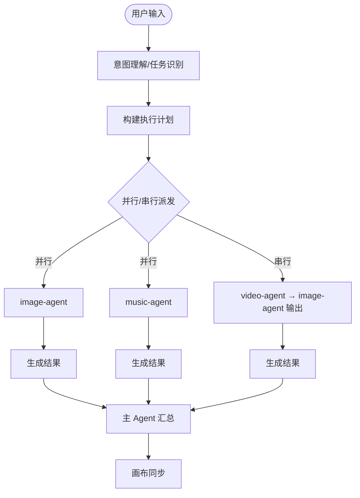
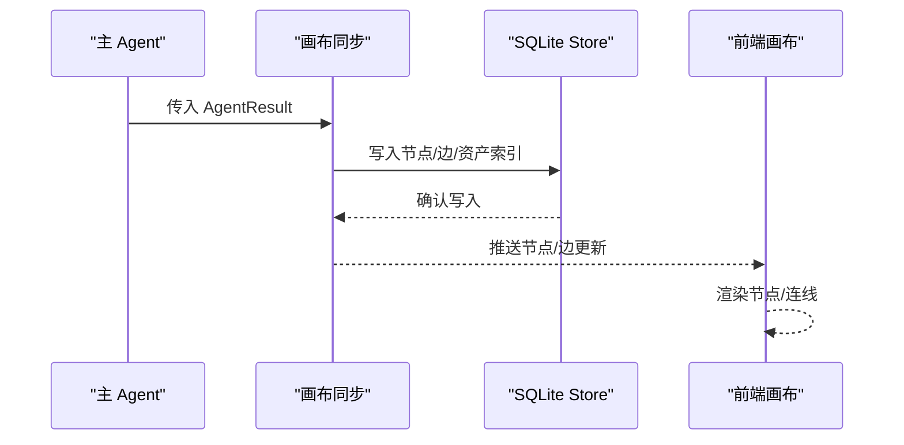
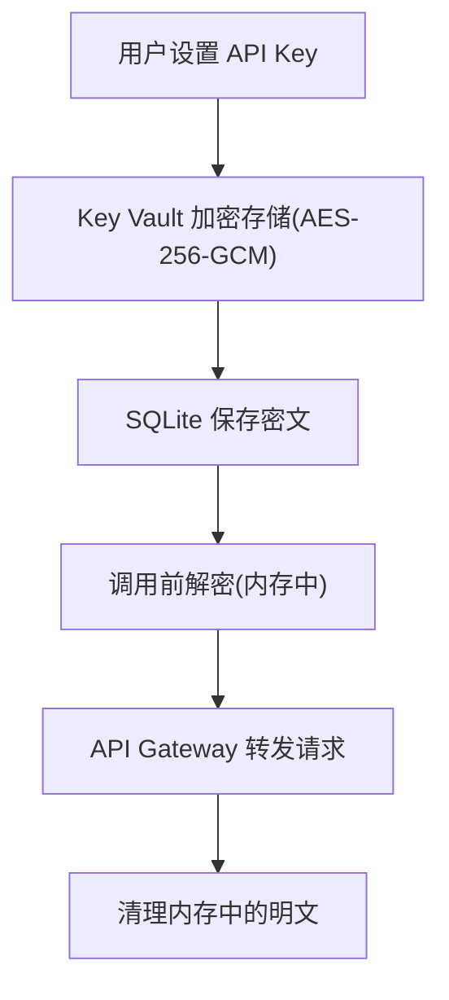
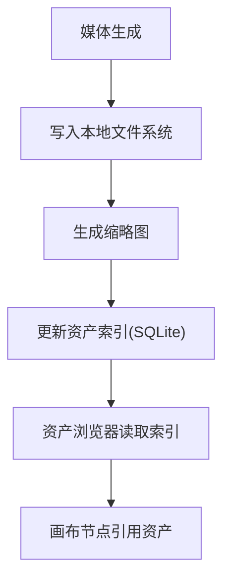
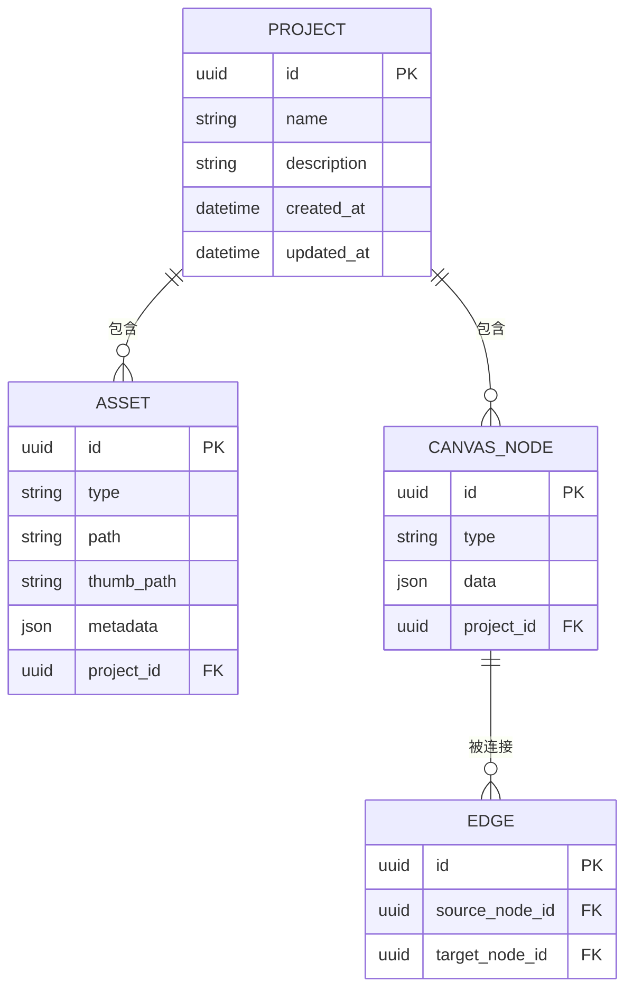
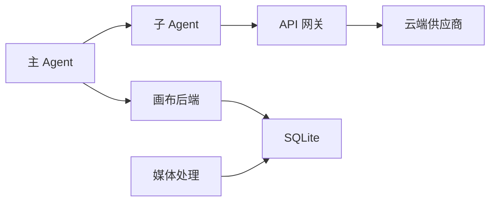

# 数据流设计

<cite>
**本文引用的文件**
- [buzhidaozenmemingmin.md](file://buzhidaozenmemingmin.md)
</cite>

## 目录
1. [简介](#简介)
2. [项目结构](#项目结构)
3. [核心组件](#核心组件)
4. [架构总览](#架构总览)
5. [详细组件分析](#详细组件分析)
6. [依赖分析](#依赖分析)
7. [性能考虑](#性能考虑)
8. [故障排查指南](#故障排查指南)
9. [结论](#结论)
10. [附录](#附录)

## 简介
本设计文档围绕 Flower Age Video 的数据流进行系统化梳理，重点阐述以下三条主线：
- 用户输入 → 主 Agent → 任务拆解 → 子 Agent 执行的数据流
- 子 Agent 输出 → 画布同步 → 节点注册 → 关系建立的同步流程
- API Key → Key Vault → 加密存储 → 解密使用 → 清理内存的安全流程
- 媒体资产 → 本地存储 → 缩略图生成 → 资产浏览器的资产管理流程

同时，明确关键数据模型（AgentResult、CanvasNode、Asset、Project）的设计与相互关系，并给出数据持久化策略与缓存机制建议。

## 项目结构
项目采用前后端分离的桌面应用架构，后端以 Rust 为核心，前端以 React/Vite 构建，通过 Tauri 桥接实现 IPC 通信。后端包含 Agent 运行时、API 网关、Key Vault、插件引擎、画布后端、媒体处理与存储模块；前端包含无限画布、资产浏览器、分镜编辑器、设置与项目管理等界面模块。

图表来源
- [buzhidaozenmemingmin.md:27-83](file://buzhidaozenmemingmin.md#L27-L83)
- [buzhidaozenmemingmin.md:354-472](file://buzhidaozenmemingmin.md#L354-L472)

章节来源
- [buzhidaozenmemingmin.md:27-83](file://buzhidaozenmemingmin.md#L27-L83)
- [buzhidaozenmemingmin.md:354-472](file://buzhidaozenmemingmin.md#L354-L472)

## 核心组件
- Agent 运行时：负责主 Agent 编排与子 Agent 执行，包含生命周期管理、工具调度、系统提示词注入与步数预算控制。
- API 网关：本地统一代理，将请求路由至各 AI 供应商 API，避免第三方代理。
- Key Vault：本地加密存储 API Key，使用对称加密与系统密钥保护，解密仅在调用时于内存中短暂停留。
- 画布后端：提供画布同步协议与节点持久化，支撑前端无限画布的节点注册与关系建立。
- 媒体处理：封装 ffmpeg 命令与图像处理，负责媒体生成、合并、转场与缩略图生成。
- 存储：SQLite 持久化项目、节点、资产索引、会话历史、Memory、API Key 与插件注册等。

章节来源
- [buzhidaozenmemingmin.md:52-65](file://buzhidaozenmemingmin.md#L52-L65)
- [buzhidaozenmemingmin.md:266-353](file://buzhidaozenmemingmin.md#L266-L353)
- [buzhidaozenmemingmin.md:512-546](file://buzhidaozenmemingmin.md#L512-L546)

## 架构总览
下图展示了从用户输入到最终画布更新的完整数据流，以及 API Key 的安全流转与媒体资产的本地化管理路径。

图表来源
- [buzhidaozenmemingmin.md:66-83](file://buzhidaozenmemingmin.md#L66-L83)
- [buzhidaozenmemingmin.md:172-190](file://buzhidaozenmemingmin.md#L172-L190)
- [buzhidaozenmemingmin.md:266-353](file://buzhidaozenmemingmin.md#L266-L353)

## 详细组件分析

### 用户输入 → 主 Agent → 任务拆解 → 子 Agent 执行的数据流
- 用户通过前端对话面板提交创作意图，消息经 Tauri IPC 到达后端 Agent 运行时。
- 主 Agent（orchestrator）解析用户输入，识别任务类型（单模态/多模态/全流程），构建执行计划，按依赖关系进行并行/串行派发。
- 子 Agent 执行各自领域任务（图像/视频/语音/音乐/后期），期间通过 API 网关访问云端供应商 API。
- 子 Agent 输出统一格式化为 AgentResult，交由主 Agent 汇总并触发画布同步。

图表来源
- [buzhidaozenmemingmin.md:172-190](file://buzhidaozenmemingmin.md#L172-L190)
- [buzhidaozenmemingmin.md:161-171](file://buzhidaozenmemingmin.md#L161-L171)

章节来源
- [buzhidaozenmemingmin.md:137-190](file://buzhidaozenmemingmin.md#L137-L190)

### 子 Agent 输出 → 画布同步 → 节点注册 → 关系建立的同步流程
- 主 Agent 将子 Agent 的结果转化为画布节点数据，调用后端画布同步协议。
- 后端将节点与边写入 SQLite，同时维护节点持久化，确保跨会话可恢复。
- 前端通过 Zustand 状态管理与画布组件实时渲染节点与连线，形成资产依赖关系链。

图表来源
- [buzhidaozenmemingmin.md:185-189](file://buzhidaozenmemingmin.md#L185-L189)
- [buzhidaozenmemingmin.md:390-391](file://buzhidaozenmemingmin.md#L390-L391)
- [buzhidaozenmemingmin.md:518-526](file://buzhidaozenmemingmin.md#L518-L526)

章节来源
- [buzhidaozenmemingmin.md:213-262](file://buzhidaozenmemingmin.md#L213-L262)
- [buzhidaozenmemingmin.md:390-391](file://buzhidaozenmemingmin.md#L390-L391)

### API Key → Key Vault → 加密存储 → 解密使用 → 清理内存的安全流程
- 用户在设置页面配置各供应商 API Key，Key Vault 使用对称加密算法进行本地加密存储。
- 解密仅在调用 API 时于内存中短暂停留，避免明文落盘与日志记录。
- 通过本地 API 网关路由请求，不经过第三方代理，保障隐私与安全。

图表来源
- [buzhidaozenmemingmin.md:338-350](file://buzhidaozenmemingmin.md#L338-L350)
- [buzhidaozenmemingmin.md:266-288](file://buzhidaozenmemingmin.md#L266-L288)

章节来源
- [buzhidaozenmemingmin.md:338-350](file://buzhidaozenmemingmin.md#L338-L350)
- [buzhidaozenmemingmin.md:266-288](file://buzhidaozenmemingmin.md#L266-L288)

### 媒体资产 → 本地存储 → 缩略图生成 → 资产浏览器的资产管理流程
- 媒体生成完成后写入本地文件系统，按类型分目录存放（images/videos/audio/thumbnails）。
- 后端媒体模块生成缩略图，更新资产索引，前端资产浏览器读取索引并展示。
- 画布节点与资产索引通过 SQLite 关联，支持快速检索与关系追踪。

图表来源
- [buzhidaozenmemingmin.md:537-544](file://buzhidaozenmemingmin.md#L537-L544)
- [buzhidaozenmemingmin.md:393-394](file://buzhidaozenmemingmin.md#L393-L394)
- [buzhidaozenmemingmin.md:518-526](file://buzhidaozenmemingmin.md#L518-L526)

章节来源
- [buzhidaozenmemingmin.md:512-546](file://buzhidaozenmemingmin.md#L512-L546)
- [buzhidaozenmemingmin.md:446-447](file://buzhidaozenmemingmin.md#L446-L447)

### 关键数据模型与相互关系
- AgentResult：子 Agent 输出的标准化结果载体，包含任务标识、生成物元数据与后续处理指引。
- CanvasNode：画布节点实体，承载资产类型（图像/视频/音频/文本/分镜/任务/分组）及其属性。
- Asset：资产索引，记录文件路径、缩略图、元数据与所属项目。
- Project：项目根节点，作为画布树的组织单元，关联节点与资产。

图表来源
- [buzhidaozenmemingmin.md:226-237](file://buzhidaozenmemingmin.md#L226-L237)
- [buzhidaozenmemingmin.md:518-526](file://buzhidaozenmemingmin.md#L518-L526)

章节来源
- [buzhidaozenmemingmin.md:226-237](file://buzhidaozenmemingmin.md#L226-L237)
- [buzhidaozenmemingmin.md:518-526](file://buzhidaozenmemingmin.md#L518-L526)

## 依赖分析
- 组件耦合与内聚：Agent 运行时与 API 网关通过统一接口耦合；Key Vault 与 API 网关弱耦合，仅在解密阶段交互；画布后端与存储强耦合，保证节点/边一致性。
- 外部依赖：云端 AI 供应商 API、ffmpeg、SQLite、WebView2。
- 潜在循环依赖：当前设计通过“主 Agent 编排 + 子 Agent 执行”的单向依赖避免循环；画布节点关系通过边指向建立单向依赖链。

图表来源
- [buzhidaozenmemingmin.md:137-190](file://buzhidaozenmemingmin.md#L137-L190)
- [buzhidaozenmemingmin.md:266-353](file://buzhidaozenmemingmin.md#L266-L353)
- [buzhidaozenmemingmin.md:390-391](file://buzhidaozenmemingmin.md#L390-L391)

章节来源
- [buzhidaozenmemingmin.md:137-190](file://buzhidaozenmemingmin.md#L137-L190)
- [buzhidaozenmemingmin.md:266-353](file://buzhidaozenmemingmin.md#L266-L353)
- [buzhidaozenmemingmin.md:390-391](file://buzhidaozenmemingmin.md#L390-L391)

## 性能考虑
- 并行派发：主 Agent 在无依赖条件下并行执行子 Agent，缩短端到端时延。
- 步数预算：每个 Agent 设定步数上限，防止长尾任务阻塞全局。
- 本地处理：媒体处理与缩略图生成在本地完成，降低网络往返开销。
- 存储策略：SQLite 事务批量写入，减少磁盘碎片；资产索引按类型分区，提高查询效率。
- 前端渲染：Zustand 状态管理与 React Flow 优化渲染，避免不必要的重绘。

## 故障排查指南
- API Key 解密失败：确认 Key Vault 加密密钥与系统密钥一致，检查解密阶段内存清理逻辑是否执行。
- 画布节点缺失：检查画布同步协议是否成功写入 SQLite，确认前端订阅是否正常。
- 媒体生成异常：检查 ffmpeg 是否正确下载与可用，关注媒体处理模块的日志输出。
- 会话历史丢失：确认 SQLite 事务提交与备份策略，必要时回滚到最近一次稳定快照。

章节来源
- [buzhidaozenmemingmin.md:338-350](file://buzhidaozenmemingmin.md#L338-L350)
- [buzhidaozenmemingmin.md:390-391](file://buzhidaozenmemingmin.md#L390-L391)
- [buzhidaozenmemingmin.md:518-526](file://buzhidaozenmemingmin.md#L518-L526)

## 结论
本设计文档系统化梳理了 Flower Age Video 的数据流与关键组件，明确了从用户意图到画布可视化的完整路径，以及 API Key 安全与媒体资产管理的策略。通过主/子 Agent 分层编排、本地加密存储与缩略图索引，系统在易用性、安全性与性能之间取得平衡，适合在本地 Windows 环境中高效运行。

## 附录
- 项目结构与模块分布详见项目结构章节。
- 开发路线图与里程碑可参考开发路线图章节。